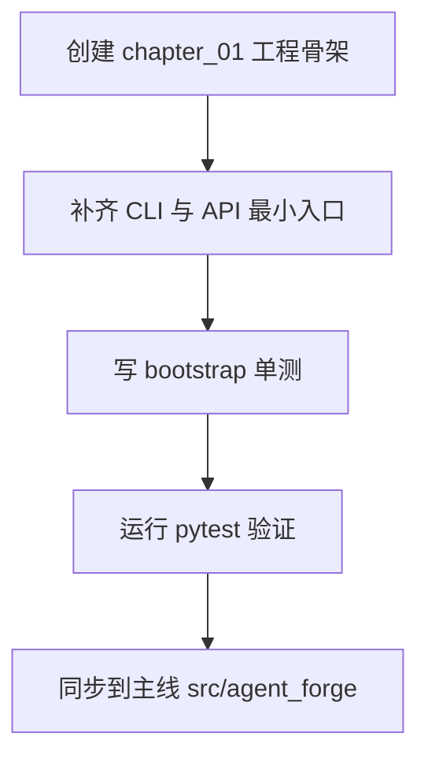

# 《从0到1工业级Agent框架打造》第一章：你的Agent为什么永远停在Demo阶段？

## 本章目标

1. 捅破 Agent 项目从 Demo 到上线之间那层最常见的“窗户纸”。
2. 搭起一个最小可运行骨架（CLI + API + 测试），这是后面14章的起跑线。
3. 定个规矩：后面每章，必须有代码、有测试、能验证。咱们不搞“脑补架构”。

## 这套课到底会学什么（课程全景）

很多教程的问题是：单章讲得热闹，但你不知道整条路线怎么走。  
这套课从第一章开始就把地图摊开，避免你学到一半发现方向不对。

14 章的主线分成四段：

1. 打地基（第 1-4 章）：骨架、协议、执行引擎、模型运行时。  
2. 长能力（第 5-8 章）：工具运行时、可观测、上下文工程、检索。  
3. 稳系统（第 9-11 章）：记忆、评测、安全层。  
4. 可交付（第 12-14 章）：API/CLI 集成、部署与质量门禁。

你可以把它理解成一条固定节奏：  
先把系统“跑起来”，再让系统“做得对”，最后让系统“敢上线”。

## 学完后你能拿到什么（阶段展望）

这不是“看完很懂，开工还不会”的那种课程。  
按章节跟下来，你会拿到三层可交付产物：

1. 工程层：一套可运行、可测试、可扩展的 `agent_forge` 框架骨架。  
2. 架构层：从 Protocol 到 Safety 的完整组件链路与边界约束。  
3. 交付层：可演示、可回归、可持续迭代的项目工程（不是一次性 Demo）。

换句话说，最后你交出去的不是“一个聪明回答”，而是一套“可维护系统”。

## 你适不适合这套课（先判断，再投入）

适合你，如果你满足下面任意两条：

1. 做过后端或平台开发，想把 Agent 做成“可上线系统”，不是一次性 Demo。
2. 遇到过“Demo 很惊艳、线上难排查”的问题，想补齐工程基本盘。
3. 希望沉淀一套可复用框架，而不是只完成一个项目。

不太适合你，如果你当前目标是：

1. 只想快速出一个演示，不关心长期维护。
2. 只关心 Prompt 结果，不打算做测试、回归和版本治理。
3. 不接受“先打地基、后堆能力”的学习节奏。

## 学这套课需要哪些知识点

必备：

1. Python 基础：函数、模块、包导入、虚拟环境。
2. 命令行基础：能执行 `uv`、`pytest`、基本文件操作。
3. Web 基础：理解 HTTP 路由与 JSON 返回。

加分项（不会也能跟）：

1. `asyncio` 基础认知。
2. `typing` 与 `pydantic` 基础用法。
3. 对测试、lint、发布流程有基本概念。

如果你现在只具备“必备项”，可以直接开学。  
因为本系列每章都坚持：完整代码 + 可运行命令 + 可验证结果。

## 动手之前

1. Python 版本 >= 3.11
2. 装好 `uv`
3. 所有命令都在仓库根目录下执行

## 环境准备（复制粘贴即可）

```bash
uv add fastapi typer pydantic pydantic-settings python-dotenv openai
uv add --dev pytest
uv sync --dev
```

## 代码放在哪

- 本章独立快照：`examples/from_zero_to_one/chapter_01/`
- 主线演进目录：`src/agent_forge/`

## 创建目录与文件命令（硬标准）

不要一口气全部创建。按下面顺序，走到对应代码步骤时再执行下一条命令。

Bash（分步执行）：
1. `mkdir -p examples/from_zero_to_one/chapter_01`
2. `mkdir -p examples/from_zero_to_one/chapter_01/src/agent_forge`
3. `mkdir -p examples/from_zero_to_one/chapter_01/src/agent_forge/apps`
4. `mkdir -p examples/from_zero_to_one/chapter_01/src/agent_forge/apps/api`
5. `mkdir -p examples/from_zero_to_one/chapter_01/tests`
6. `mkdir -p examples/from_zero_to_one/chapter_01/tests/unit`
7. `touch examples/from_zero_to_one/chapter_01/pyproject.toml`
8. `touch examples/from_zero_to_one/chapter_01/src/agent_forge/__init__.py`
9. `touch examples/from_zero_to_one/chapter_01/src/agent_forge/apps/__init__.py`
10. `touch examples/from_zero_to_one/chapter_01/src/agent_forge/apps/api/__init__.py`
11. `touch examples/from_zero_to_one/chapter_01/src/agent_forge/apps/api/app.py`
12. `touch examples/from_zero_to_one/chapter_01/src/agent_forge/apps/cli.py`
13. `touch examples/from_zero_to_one/chapter_01/tests/conftest.py`
14. `touch examples/from_zero_to_one/chapter_01/tests/unit/test_bootstrap.py`

Windows PowerShell（分步执行）：
1. `New-Item -ItemType Directory -Force "examples\from_zero_to_one\chapter_01" | Out-Null`
2. `New-Item -ItemType Directory -Force "examples\from_zero_to_one\chapter_01\src\agent_forge" | Out-Null`
3. `New-Item -ItemType Directory -Force "examples\from_zero_to_one\chapter_01\src\agent_forge\apps" | Out-Null`
4. `New-Item -ItemType Directory -Force "examples\from_zero_to_one\chapter_01\src\agent_forge\apps\api" | Out-Null`
5. `New-Item -ItemType Directory -Force "examples\from_zero_to_one\chapter_01\tests" | Out-Null`
6. `New-Item -ItemType Directory -Force "examples\from_zero_to_one\chapter_01\tests\unit" | Out-Null`
7. `New-Item -ItemType File -Force "examples\from_zero_to_one\chapter_01\pyproject.toml" | Out-Null`
8. `New-Item -ItemType File -Force "examples\from_zero_to_one\chapter_01\src\agent_forge\__init__.py" | Out-Null`
9. `New-Item -ItemType File -Force "examples\from_zero_to_one\chapter_01\src\agent_forge\apps\__init__.py" | Out-Null`
10. `New-Item -ItemType File -Force "examples\from_zero_to_one\chapter_01\src\agent_forge\apps\api\__init__.py" | Out-Null`
11. `New-Item -ItemType File -Force "examples\from_zero_to_one\chapter_01\src\agent_forge\apps\api\app.py" | Out-Null`
12. `New-Item -ItemType File -Force "examples\from_zero_to_one\chapter_01\src\agent_forge\apps\cli.py" | Out-Null`
13. `New-Item -ItemType File -Force "examples\from_zero_to_one\chapter_01\tests\conftest.py" | Out-Null`
14. `New-Item -ItemType File -Force "examples\from_zero_to_one\chapter_01\tests\unit\test_bootstrap.py" | Out-Null`

## 开干

### 第 1 步：先聊点实际的

做过 Agent 的，下面这场景熟不熟？

- 第 1 天：调了两句 Prompt，效果惊艳，感觉马上要起飞。
- 第 7 天：接上工具、状态和接口，开始时不时抽风一下。
- 第 30 天：问题在哪都搞不清楚，团队里开始有人嘀咕“要不重写吧”。

真不是模型不行，是工程的底子没打好。

所以第一章，我们不谈什么花哨的“高级能力”，就干一件事：把最小可运行骨架立起来，并且能让测试放心地说一句“这玩意能跑”。



这张图就是后面14章的基本操作：  
先搭结构，再填能力；先能验证，再谈优化。

### 第 2 步：创建目录和文件

```bash
mkdir -p examples/from_zero_to_one/chapter_01/src/agent_forge/apps/api
mkdir -p examples/from_zero_to_one/chapter_01/tests/unit
```

Windows PowerShell：

```powershell
New-Item -ItemType Directory -Force examples/from_zero_to_one/chapter_01/src/agent_forge/apps/api | Out-Null
New-Item -ItemType Directory -Force examples/from_zero_to_one/chapter_01/tests/unit | Out-Null
```

这步没啥技术含量，但有个细节值得说一句：从第一天就把 `tests` 和 `src` 并列建好。这不是形式主义，我见过太多项目，到后期想补测试的时候，发现连个放测试文件的地方都要吵半天。

### 第 3 步：写核心代码（可以直接跑的版本）

文件：[examples/from_zero_to_one/chapter_01/pyproject.toml](../../examples/from_zero_to_one/chapter_01/pyproject.toml)

```toml
[project]
name = "agent-forge-chapter-01"
version = "0.1.0"
requires-python = ">=3.11"
dependencies = [
  "fastapi>=0.115.0",
  "typer>=0.12.0",
  "pytest>=8.3.0",  # 直接把 pytest 塞进依赖，省得跑测试时还要现装
]

[project.scripts]
agent-forge = "agent_forge.apps.cli:app"
```

说两个让我吃过亏的地方：

一是把 `pytest` 放进了 `dependencies` 而不是 dev 依赖。这样做有点“政治不正确”，但第一章读者很多还没建立 dev 依赖的心智模型，我不想让他们第一步就卡在缺包报错。后面章节稳定了，再挪回去也不迟。

二是 `[project.scripts]` 这个配置。我第一次写 `pyproject.toml` 时在这里拼错过路径，结果命令装上了但跑不起来，白白 debug 半小时。这里建议直接复制，不要手打。

文件：[examples/from_zero_to_one/chapter_01/src/agent_forge/apps/cli.py](../../examples/from_zero_to_one/chapter_01/src/agent_forge/apps/cli.py)

```python
"""CLI entry for chapter 01."""

from __future__ import annotations

import typer

app = typer.Typer(help="agent_forge chapter 01 CLI")


@app.command()
def version() -> None:
    """Print chapter bootstrap version."""

    typer.echo("agent-forge-chapter-01")


if __name__ == "__main__":
    app()
```

这个文件现在看着有点傻，就一个 `version` 命令。但我想表达的是：CLI 是工程的“门面”，门面可以简陋，但不能没有。有了这个入口，后面加命令就是加函数的事，不用再折腾一遍基础设施。

有个容易踩的坑：如果你把 `version` 函数签名改成带参数、但调用时没传参，CLI 会直接报错。CLI 框架对函数签名很敏感，这是好事，越早崩溃的问题越好修。

文件：[examples/from_zero_to_one/chapter_01/src/agent_forge/apps/api/app.py](../../examples/from_zero_to_one/chapter_01/src/agent_forge/apps/api/app.py)

```python
"""FastAPI app for chapter 01."""

from fastapi import FastAPI

app = FastAPI(title="agent_forge_chapter_01")


@app.get("/v1/health")
def health() -> dict[str, str]:
    return {"status": "ok"}
```

健康检查接口，看起来也傻傻的，永远返回 `{"status": "ok"}`。但我故意这么写：第一版健康检查就应该“傻”。如果你在第一章就开始纠结“要不要检查数据库连接”“要不要检查缓存状态”，这个接口一个月都上不去。

后面我们会在它上面叠加逻辑，但现在任务只有一个：证明服务能启动，路由能访问。

### 第 4 步：写测试（也是可以直接跑的版本）

文件：[examples/from_zero_to_one/chapter_01/tests/conftest.py](../../examples/from_zero_to_one/chapter_01/tests/conftest.py)

```python
"""Test bootstrap for chapter 01 snapshot."""

from __future__ import annotations

import sys
from pathlib import Path

ROOT = Path(__file__).resolve().parents[1]
SRC = ROOT / "src"
if str(SRC) not in sys.path:
    sys.path.insert(0, str(SRC))
```

这个文件就干了一件事：把 `src` 目录塞进 Python 的模块搜索路径。

为什么需要它？因为我们的目录结构是 `examples/chapter_01/src/...`。不在 `conftest.py` 里加这段，`pytest` 运行时根本找不到 `agent_forge`。

你可以把它理解为“测试环境胶水代码”。删掉它，测试基本都会报导入错误，就这么直接。

文件：[examples/from_zero_to_one/chapter_01/tests/unit/test_bootstrap.py](../../examples/from_zero_to_one/chapter_01/tests/unit/test_bootstrap.py)

```python
"""Chapter 01 bootstrap tests."""

from __future__ import annotations

from agent_forge.apps.api.app import health


def test_health_endpoint_function() -> None:
    assert health() == {"status": "ok"}
```

这是我们的第一条测试，验证 API 健康函数能调用、返回值符合预期。

你可能觉得它很简单。但第一条测试的意义不在“测得多复杂”，而在建立“可以被测试”的习惯。一旦这个习惯建立起来，后面每章都能自然接上。

### 第 5 步：同步到主线（chapter_01 -> src）

快照和主线为什么要分开？因为教学代码和交付代码目标不完全一样：

- 章节快照放 `examples/`：注释更全、节奏更慢、利于学习。
- 主线工程放 `src/`：结构更稳、便于持续演进和交付。

同步方式：

1. 同步 CLI：把 `examples/.../apps/cli.py` 的改动同步到 [src/agent_forge/apps/cli.py](../../src/agent_forge/apps/cli.py)
2. 同步 API：把 `examples/.../apps/api/app.py` 的改动同步到 [src/agent_forge/apps/api/app.py](../../src/agent_forge/apps/api/app.py)
3. 检查主线 [pyproject.toml](../../pyproject.toml) 的 `[project.scripts]` 路径是否正确

Unix/macOS 复制命令示例：

```bash
cp examples/from_zero_to_one/chapter_01/src/agent_forge/apps/cli.py src/agent_forge/apps/cli.py
cp examples/from_zero_to_one/chapter_01/src/agent_forge/apps/api/app.py src/agent_forge/apps/api/app.py
```

Windows PowerShell 复制命令示例：

```powershell
Copy-Item examples/from_zero_to_one/chapter_01/src/agent_forge/apps/cli.py src/agent_forge/apps/cli.py -Force
Copy-Item examples/from_zero_to_one/chapter_01/src/agent_forge/apps/api/app.py src/agent_forge/apps/api/app.py -Force
```

## 跑起来看看

验证本章快照：

```bash
uv run pytest examples/from_zero_to_one/chapter_01/tests/unit/test_bootstrap.py -q
```

正常输出应该是一个绿点：`.`

验证主线工程：

```bash
uv run agent-forge version
# 输出: agent-forge 0.1.0

uv run pytest tests/unit/test_protocol.py -q
# 输出: 4 passed
```

## 检查清单

1. `chapter_01` 的测试能跑通，输出绿点。
2. `agent-forge version` 能执行并输出版本号。
3. 本章提到的文件链接都能跳到真实文件。
4. 快照代码和主线代码保持一致。

## 翻车了怎么办？

翻车现场 1：`ModuleNotFoundError: No module named 'agent_forge'`  
大概率是 `conftest.py` 路径注入没生效。检查：

1. 文件是否在 `examples/from_zero_to_one/chapter_01/tests/conftest.py`
2. `SRC = ROOT / "src"` 是否被改坏

翻车现场 2：`agent-forge: command not found`  
说明脚本入口没正确安装。处理方式：

1. 确认 `pyproject.toml` 的 `[project.scripts]` 配置
2. 使用 `uv run agent-forge version` 直接执行，避免环境路径问题

翻车现场 3：CLI 执行时报函数签名错误  
说明命令参数和函数签名不一致。第一章 `version` 命令不带参数，别额外传参。

## 本章完成标志（DoD）

1. 任何人都能从空目录搭出第一版可运行骨架。
2. 能跑通第一条自动化测试和第一条 CLI 命令。
3. 主线与章节快照已经建立同步机制，可以进入下一章迭代。

## 下一章预告

- 做什么：实现 `Protocol` 组件，定义消息、状态、事件、错误这套“通用语言”。
- 为什么重要：第一章让“壳”跑起来，第二章让“芯”定下来。没有统一协议，后面组件只会各说各话。


