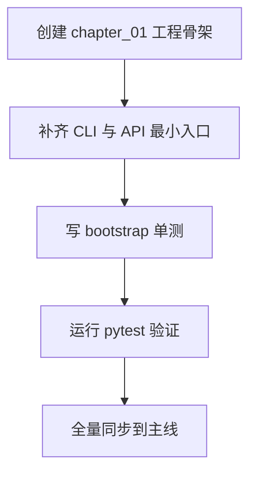

# 《从0到1工业级Agent框架打造》第一章：你的Agent为什么永远停在Demo阶段？

## 本章目标

1. 捅破 Agent 项目从 Demo 到上线之间最常见的工程断层。
2. 搭起一个最小可运行骨架（CLI + API + 测试），作为后续章节的统一起跑线。
3. 定下纪律：后面每章都必须有代码、有命令、有验证结果。

## 动手之前

1. Python 版本 >= 3.11
2. 装好 `uv`
3. 所有命令都在仓库根目录执行

## 环境准备（复制粘贴即可）

```bash
uv init
uv add fastapi typer pydantic pydantic-settings python-dotenv openai
uv add --dev pytest
uv sync --dev
```

## 代码放在哪

- 本章独立快照：`examples/from_zero_to_one/chapter_01/`
- 主线演进目录：`src/agent_forge/`

## 开干

### 第 1 步：先聊点实际的

做过 Agent 的，下面这场景熟不熟？

- **第 1 天**：调了两句 Prompt，效果惊艳，感觉马上要起飞。
- **第 7 天**：接上工具、状态和接口，开始时不时抽风一下。
- **第 30 天**：问题在哪都搞不清楚，团队里开始有人嘀咕“要不重写吧”。

真不是模型不行，是工程底子没打好。

所以第一章我们不讲花哨能力，只干一件事：把**最小可运行骨架**立起来，并且让测试能给出确定反馈。



### 第 2 步：创建目录和文件

```bash
mkdir -p examples/from_zero_to_one/chapter_01/src/agent_forge/apps/api
mkdir -p examples/from_zero_to_one/chapter_01/tests/unit
```

Windows PowerShell：

```powershell
New-Item -ItemType Directory -Force examples/from_zero_to_one/chapter_01/src/agent_forge/apps/api | Out-Null
New-Item -ItemType Directory -Force examples/from_zero_to_one/chapter_01/tests/unit | Out-Null
```

### 第 3 步：写核心代码（可以直接跑的版本）

创建命令：

```bash
touch examples/from_zero_to_one/chapter_01/pyproject.toml
```

```powershell
New-Item -ItemType File -Force "examples\from_zero_to_one\chapter_01\pyproject.toml" | Out-Null
```

**文件：** `examples/from_zero_to_one/chapter_01/pyproject.toml`

```toml
[project]
name = "agent-forge-chapter-01"
version = "0.1.0"
requires-python = ">=3.11"
dependencies = [
  "fastapi>=0.115.0",
  "typer>=0.12.0",
  "pytest>=8.3.0",
]

[project.scripts]
agent-forge = "agent_forge.apps.cli:app"
```

创建命令：

```bash
touch examples/from_zero_to_one/chapter_01/src/agent_forge/apps/cli.py
```

```powershell
New-Item -ItemType File -Force "examples\from_zero_to_one\chapter_01\src\agent_forge\apps\cli.py" | Out-Null
```

**文件：** `examples/from_zero_to_one/chapter_01/src/agent_forge/apps/cli.py`

```python
"""CLI entry for chapter 01."""

from __future__ import annotations

import typer

app = typer.Typer(help="agent_forge chapter 01 CLI")


@app.callback()
def main() -> None:
    """CLI root command group."""


@app.command()
def version() -> None:
    """Print chapter bootstrap version."""

    typer.echo("agent-forge-chapter-01")


if __name__ == "__main__":
    app()
```

这个文件看起来简单，但它非常关键：这是后续所有 CLI 能力的门面入口。

创建命令：

```bash
touch examples/from_zero_to_one/chapter_01/src/agent_forge/apps/api/app.py
```

```powershell
New-Item -ItemType File -Force "examples\from_zero_to_one\chapter_01\src\agent_forge\apps\api\app.py" | Out-Null
```

**文件：** `examples/from_zero_to_one/chapter_01/src/agent_forge/apps/api/app.py`

```python
"""FastAPI app for chapter 01."""

from fastapi import FastAPI

app = FastAPI(title="agent_forge_chapter_01")


@app.get("/v1/health")
def health() -> dict[str, str]:
    return {"status": "ok"}
```

### 第 4 步：写测试（也是可以直接跑的版本）

创建命令：

```bash
touch examples/from_zero_to_one/chapter_01/tests/conftest.py
```

```powershell
New-Item -ItemType File -Force "examples\from_zero_to_one\chapter_01\tests\conftest.py" | Out-Null
```

**文件：** `examples/from_zero_to_one/chapter_01/tests/conftest.py`

```python
"""Test bootstrap for chapter 01 snapshot."""

from __future__ import annotations

import sys
from pathlib import Path

ROOT = Path(__file__).resolve().parents[1]
SRC = ROOT / "src"
if str(SRC) not in sys.path:
    sys.path.insert(0, str(SRC))
```

创建命令：

```bash
touch examples/from_zero_to_one/chapter_01/tests/unit/test_bootstrap.py
```

```powershell
New-Item -ItemType File -Force "examples\from_zero_to_one\chapter_01\tests\unit\test_bootstrap.py" | Out-Null
```

**文件：** `examples/from_zero_to_one/chapter_01/tests/unit/test_bootstrap.py`

```python
"""Chapter 01 bootstrap tests."""

from __future__ import annotations

from agent_forge.apps.api.app import health


def test_health_endpoint_function() -> None:
    assert health() == {"status": "ok"}
```

### 第 5 步：同步到主线（chapter_01 -> src）

这一节直接“覆盖同步”当天快照目录下所有代码到主线（`chapter_01/*` 全量同步）。

Bash：

```bash
cp -r examples/from_zero_to_one/chapter_01/* .
```

Windows PowerShell：

```powershell
Copy-Item -Recurse -Force "examples\from_zero_to_one\chapter_01\*" "."
```

## 跑起来看看

验证本章快照：

```bash
uv run pytest examples/from_zero_to_one/chapter_01/tests/unit/test_bootstrap.py -q
```

验证主线工程：

```bash
uv pip install -e .
uv run agent-forge version
# 预期输出: agent-forge 0.1.0（主线）
```

## 检查清单

1. `chapter_01` 的测试能跑通。
2. `agent-forge version` 能执行并输出版本号。
3. 快照代码和主线代码一致。

## 翻车了怎么办？

**翻车现场 1：`ModuleNotFoundError: No module named 'agent_forge'`**

检查 `tests/conftest.py` 是否存在并且路径注入正确。

**翻车现场 2：`agent-forge: command not found`**

检查 `pyproject.toml` 里的 `[project.scripts]`，并重新执行 `uv sync --dev`。

**翻车现场 3：`Got unexpected extra argument (version)`**

这是 Typer 的单命令模式问题。若只有一个 `@app.command()`，Typer 会把它当主命令而不是子命令。  
本章已通过 `@app.callback()` 强制多子命令模式，确保 `agent-forge version` 可用。
如果你本地仍报这个错误，通常是入口脚本还没刷新，执行下面命令后重试：

```bash
uv sync --dev
uv run agent-forge version
```

## 本章完成标志（DoD）

1. 能从空目录搭出可运行骨架。
2. 能跑通第一条自动化测试。
3. `agent-forge version` 可执行。

## 下一章预告

下一章进入 `Protocol` 组件：统一消息、状态和错误契约，让组件之间真正“说同一种语言”。

