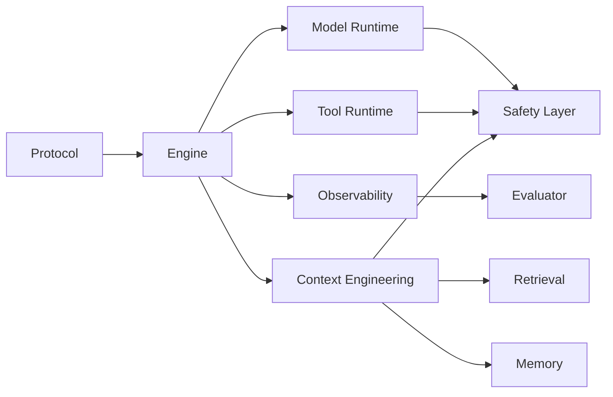

# 《从0到1工业级Agent框架打造》第一章：为什么你的Agent永远走不出Demo阶段

> 这不是又一个Prompt教程，而是一套完整的工程化实战

## 开头：一个再熟悉不过的失败循环

**第1天**：你花两小时写了个Prompt，Agent表现得像个专家，团队欢呼“太强了！”

**第3天**：接上工具和知识库后，它开始答非所问，团队说“再调调参数”

**第1周**：线上用户遇到边缘场景，你试图排查，却发现——**根本不知道它当时为什么那么回答**

**第2周**：项目复盘会上，所有人达成共识：“Agent还不成熟，不适合生产。”

这个场景，是不是似曾相识？

我见过至少20个团队，在同样的坑里摔倒。他们不缺技术热情，不缺资源投入，甚至不缺模型能力。

缺的只是一个东西：**把Agent当系统来建的工程思维。**

---

## 01 这不是“玩模型”的教程，这是“做系统”的实战

如果你期待的是“10个Prompt让Agent变聪明”，现在可以合上这篇文章。

这套教程的目标只有一个：

**从0到1，手把手搭建一个工业级Agent框架，并用它落地一个真实的“劳动纠纷处理指导Agent”。**

当你跟完整个系列，你会得到：

✅ **一套可扩展的框架结构**——不是“这个项目能用”，而是“下一个项目也能用”  
✅ **一条可观测、可评测的执行链路**——出了问题，你知道从哪看、怎么修  
✅ **一个能拿得出手的实战案例**——劳动纠纷处理Agent，有业务价值，有法律边界，有落地场景

---

## 02 扒开真相：为什么90%的Agent项目烂尾？

我复盘过十几个失败的Agent项目，它们的死法惊人一致：

**第一层：工程顺序错误**
- 先写业务逻辑，后想框架抽象
- 先追求“回答像人”，后补可观测性
- 等到想加评测时，代码已经乱到不敢动

**第二层：系统设计缺失**
- 工具调用没有协议化，重试一次，订单重复扣款
- 错误处理靠字符串匹配，“抱歉我遇到一个问题”吞掉所有异常
- 状态管理靠全局变量，并发请求一来，记忆串台

**第三层：维护成本失控**
- 半年后，新人不敢改代码
- 一年后，老团队不敢动逻辑
- 最后结论：重构不如重写，重写不如放弃

你会发现，这些都不是“模型不够聪明”的问题。

它们是**软件工程问题**。

---

## 03 这套系列怎么破局：10个组件的铁序

我们定义了一个固定的组件顺序——**不扩项，不跳步，不讲故事**：

```
1. Protocol（协议层）
2. Engine（执行引擎）
3. Model Runtime（模型运行时）
4. Tool Runtime（工具运行时）
5. Observability（可观测性）
6. Context Engineering（上下文工程）
7. Retrieval（检索）
8. Memory（记忆）
9. Evaluator（评测）
10. Safety Layer（安全层）
```

这个顺序不是拍脑袋定的，它遵循一个铁律：

**先让系统能跑，再让系统会做，最后让系统敢上线。**

- 先统一协议 → 避免后面各层各玩各的
- 再跑通闭环 → 哪怕只有Hello World，也要能稳定执行
- 然后接模型和工具 → 让它能真正做事
- 再补可观测和上下文 → 让它能被优化
- 最后上评测和安全 → 让它能对用户负责

每一步，都是上一轮的“验收标准”，也是下一轮的“地基”。

---

## 03.1 先讲“面”：从0到1的主流程到底怎么跑

很多教程一上来就讲“某个技巧”，读者会知道一个点，但不知道它在系统里的位置。  
我们这套系列固定先讲全局链路，再讲局部实现。



这张图表达的不是“依赖图漂亮”，而是工程顺序：  
1. 先把数据契约统一（Protocol）  
2. 再跑通执行闭环（Engine）  
3. 然后接模型/工具，让系统能真实完成任务  
4. 最后补观测、评测、安全，让系统可持续上线

---

## 03.2 再讲“点”：为什么这个顺序不能反过来

1. 先做业务 Agent 再抽协议：会导致字段到处漂移，后期改一处炸全链路。  
2. 先做评测再做观测：会出现“想评却没数据”的死局。  
3. 先堆记忆检索再跑闭环：你会得到“能力很多但不可控”的系统。  

这就是我们反复强调的原则：  
先有“可执行、可追踪”的主流程，再谈“更聪明”的能力增强。

---

## 04 你适合跟这套教程吗？

**适合你，如果：**

✅ 你有后端开发经验，想把Agent做成能上线的工程  
✅ 你正在做AI项目，但卡在“Demo很牛，上线就崩”的阶段  
✅ 你需要一套可复用的框架，而不是一次性项目代码  

**不适合你，如果：**

❌ 你只想要几段Prompt，快速拼个演示  
❌ 你不关心代码能不能维护、问题能不能排查  
❌ 你觉得“工程化”就是加几个try-catch

---

## 05 这套教程的交付纪律（你可以直接抄去做团队规范）

每一章的交付，都必须满足三个条件：

📦 **交付代码**——可运行，可复用，可扩展  
🧪 **交付测试**——单测+集成测，覆盖核心链路  
📘 **交付教程**——讲清楚“为什么这么设计”，不只给“怎么用”

这不是形式主义。

这是避免“半年后没人敢动这套代码”的唯一方法。

---

## 06 我们要落地的业务场景：劳动纠纷处理指导Agent

我们不做一个“什么都能聊”的聊天机器人。

我们要做一个**真正有用的辅助系统**：

**输入**：用户描述劳动纠纷场景（如“公司拖欠三个月工资，没合同”）  
**输出**：

1. 处理路径建议（协商→投诉→仲裁→诉讼）  
2. 证据清单（需要收集什么、怎么收集）  
3. 文书草稿（仲裁申请书要点、协商话术）

并且，从第一天起就明确法律边界：

> ⚖️ 提供法律信息辅助，不构成正式法律意见  
> ⚖️ 明确告知用户：重要决策请咨询专业律师

这不是免责声明，这是对用户负责。

---

## 07 第一阶段你能拿到的两个里程碑

跟完前几章，你不会只拿到一堆代码碎片。

你会拿到：

**里程碑一：第一个可追踪的执行闭环**

不是“模型输出一段文本就结束”，而是：
- 每一次执行都有唯一ID
- 每一步调用都有日志
- 每一条链路都可复现

**里程碑二：第一个可自动验证的协议与测试体系**

不是“手动点几个Case觉得还行”，而是：
- 协议层统一约束
- 核心逻辑有自动化验证
- 改代码敢跑测试，跑测试敢上线

这两个里程碑一旦建立，后续的“加工具、接知识库、上记忆”就不再是“堆代码”，而是“可控迭代”。

---

## 08 给读者的行动建议（今天就做）

如果你想跟着这个系列真正拿到结果，今天先完成三件事：

1️⃣ **明确你的Agent场景边界**
- 做什么（劳动纠纷处理）
- 不做什么（不是法律咨询，不是情感聊天）
- 越具体，后面越不迷茫

2️⃣ **接受“先框架后业务”的节奏**
- 前几章可能看不到“智能”，只能看到“结构”
- 但请相信：**结构对了，智能才有落脚点**

3️⃣ **建一份学习记录**
- 每章写下三件事：
  - 输入（我理解了哪些设计）
  - 取舍（为什么这么选，不这么选）
  - 验证（怎么证明它是对的）
  - 遗留（还有哪些问题没解决）

---

## 09 下一章预告：从“想法”到“代码”的分水岭

下一章我们正式进入工程落地：

**《第二章：搭建仓库工程骨架——让每一行代码都长对地方》**

- 怎么设计目录结构，让十年后的人还能看懂
- 怎么定代码规范，让协作不再是灾难
- 怎么搭CI/CD，让测试自动守护质量

如果你之前做Agent总是“做着做着就乱了”，这一章会是你的分水岭。

---

**P.S.** 这不是一本“书”，这是一次“实战直播”。

我会按章节持续更新，每一章都有代码、有测试、有教程。

如果你身边也有被“Agent上线难”困扰的朋友，欢迎转发给他——我们一起，把Agent从“Demo玩具”做成“生产系统”。
