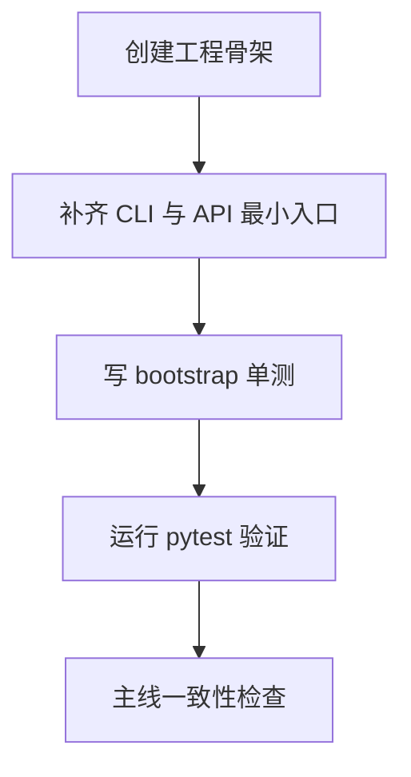

# 《从0到1工业级Agent框架打造》第一章：你的Agent为什么永远停在Demo阶段？
## 这套课到底会学什么（课程全景）

很多教程的问题是：单章讲得热闹，但你不知道整条路线怎么走。  
这套课从第一章开始就把地图摊开，避免你学到一半发现方向不对。

14 章的主线分成四段：

1. 打地基（第 1-4 章）：骨架、协议、执行引擎、模型运行时。  
2. 长能力（第 5-8 章）：工具运行时、可观测、上下文工程、检索。  
3. 稳系统（第 9-11 章）：记忆、评测、安全层。  
4. 可交付（第 12-14 章）：API/CLI 集成、部署与质量门禁。

你可以把它理解成一条固定节奏：  
先把系统“跑起来”，再让系统“做得对”，最后让系统“敢上线”。

## 学完后你能拿到什么（阶段展望）

这不是“看完很懂，开工还不会”的那种课程。  
按章节跟下来，你会拿到三层可交付产物：

1. 工程层：一套可运行、可测试、可扩展的 `agent_forge` 框架骨架。  
2. 架构层：从 Protocol 到 Safety 的完整组件链路与边界约束。  
3. 交付层：可演示、可回归、可持续迭代的项目工程（不是一次性 Demo）。

换句话说，最后你交出去的不是“一个聪明回答”，而是一套“可维护系统”。

## 你适不适合这套课（先判断，再投入）

适合你，如果你满足下面任意两条：

1. 做过后端或平台开发，想把 Agent 做成“可上线系统”，不是一次性 Demo。
2. 遇到过“Demo 很惊艳、线上难排查”的问题，想补齐工程基本盘。
3. 希望沉淀一套可复用框架，而不是只完成一个项目。

不太适合你，如果你当前目标是：

1. 只想快速出一个演示，不关心长期维护。
2. 只关心 Prompt 结果，不打算做测试、回归和版本治理。
3. 不接受“先打地基、后堆能力”的学习节奏。

## 学这套课需要哪些知识点

必备：

1. Python 基础：函数、模块、包导入、虚拟环境。
2. 命令行基础：能执行 `uv`、`pytest`、基本文件操作。
3. Web 基础：理解 HTTP 路由与 JSON 返回。

加分项（不会也能跟）：

1. `asyncio` 基础认知。
2. `typing` 与 `pydantic` 基础用法。
3. 对测试、lint、发布流程有基本概念。

如果你现在只具备“必备项”，可以直接开学。  
因为本系列每章都坚持：完整代码 + 可运行命令 + 可验证结果。

## 本章目标

1. 捅破 Agent 项目从 Demo 到上线之间那层最常见的“窗户纸”。
2. 搭起一个最小可运行骨架（CLI + API + 测试），这是后面14章的起跑线。
3. 定个规矩：后面每章，必须有代码、有测试、能验证。咱们不搞“脑补架构”。

## 动手之前

1. Python 版本 >= 3.11
2. 装好 `uv`
3. 所有命令都在仓库根目录执行

## 环境准备（复制粘贴即可）

```bash
uv init
uv add fastapi typer pydantic pydantic-settings python-dotenv openai
uv add --dev pytest
uv sync --dev
```

## 代码放在哪

- 主线演进目录：`src/agent_forge/`

## 开干

### 第 1 步：先聊点实际的

做过 Agent 的，下面这场景熟不熟？

- **第 1 天**：调了两句 Prompt，效果惊艳，感觉马上要起飞。
- **第 7 天**：接上工具、状态和接口，开始时不时抽风一下。
- **第 30 天**：问题在哪都搞不清楚，团队里开始有人嘀咕“要不重写吧”。

真不是模型不行，是工程底子没打好。

所以第一章我们不讲花哨能力，只干一件事：把**最小可运行骨架**立起来，并且让测试能给出确定反馈。



### 第 2 步：创建目录和文件

```bash
mkdir -p src/agent_forge/apps/api
mkdir -p tests/unit
```

Windows PowerShell：

```powershell
New-Item -ItemType Directory -Force src/agent_forge/apps/api | Out-Null
New-Item -ItemType Directory -Force tests/unit | Out-Null
```

### 第 3 步：写核心代码（可以直接跑的版本）

创建命令：

```bash
touch pyproject.toml
```

```powershell
New-Item -ItemType File -Force "pyproject.toml" | Out-Null
```

**文件：** `pyproject.toml`

```toml
[project]
name = "agent-forge-chapter-01"
version = "0.1.0"
requires-python = ">=3.11"
dependencies = [
  "fastapi>=0.115.0",
  "typer>=0.12.0",
  "pytest>=8.3.0",
]

[project.scripts]
agent-forge = "agent_forge.apps.cli:app"
```

创建命令：

```bash
touch src/agent_forge/apps/cli.py
```

```powershell
New-Item -ItemType File -Force "src\agent_forge\apps\cli.py" | Out-Null
```

**文件：** `src/agent_forge/apps/cli.py`

```python
"""CLI entry for 主线 01."""

from __future__ import annotations

import typer

app = typer.Typer(help="agent_forge 主线 01 CLI")


@app.callback()
def main() -> None:
    """CLI root command group."""


@app.command()
def version() -> None:
    """Print 主线 bootstrap version."""

    typer.echo("agent-forge-chapter-01")


if __name__ == "__main__":
    app()
```

这个文件看起来简单，但它非常关键：这是后续所有 CLI 能力的门面入口。

创建命令：

```bash
touch src/agent_forge/apps/api/app.py
```

```powershell
New-Item -ItemType File -Force "src\agent_forge\apps\api\app.py" | Out-Null
```

**文件：** `src/agent_forge/apps/api/app.py`

```python
"""FastAPI app for 主线 01."""

from fastapi import FastAPI

app = FastAPI(title="agent_forge_chapter_01")


@app.get("/v1/health")
def health() -> dict[str, str]:
    return {"status": "ok"}
```

### 第 4 步：写测试（也是可以直接跑的版本）

创建命令：

```bash
touch tests/conftest.py
```

```powershell
New-Item -ItemType File -Force "tests\conftest.py" | Out-Null
```

**文件：** `tests/conftest.py`

```python
"""Test bootstrap for 主线 01 snapshot."""

from __future__ import annotations

import sys
from pathlib import Path

ROOT = Path(__file__).resolve().parents[1]
SRC = ROOT / "src"
if str(SRC) not in sys.path:
    sys.path.insert(0, str(SRC))
```

创建命令：

```bash
touch tests/unit/test_bootstrap.py
```

```powershell
New-Item -ItemType File -Force "tests\unit\test_bootstrap.py" | Out-Null
```

**文件：** `tests/unit/test_bootstrap.py`

```python
"""主线 01 bootstrap tests."""

from __future__ import annotations

from agent_forge.apps.api.app import health


def test_health_endpoint_function() -> None:
    assert health() == {"status": "ok"}
```

### 第 5 步：一致性检查

这一节只做两件事：

1. 确认本章文件都已经落在主线路径（`src/`、`tests/`）。
2. 确认入口命令与测试命令都可直接运行。

Bash：

```bash
ls src/agent_forge/apps
ls tests/unit
```

Windows PowerShell：

```powershell
Get-ChildItem src/agent_forge/apps
Get-ChildItem tests/unit
```

## 跑起来看看

验证主线：

```bash
uv run pytest tests/unit/test_bootstrap.py -q
```

验证主线工程：

```bash
uv pip install -e .
uv run agent-forge version
# 预期输出: agent-forge 0.1.0（主线）
```

## 检查清单

1. 本章测试能跑通。
2. `agent-forge version` 能执行并输出版本号。
3. 教程中的路径和仓库真实文件一致。

## 翻车了怎么办？

**翻车现场 1：`ModuleNotFoundError: No module named 'agent_forge'`**

检查 `tests/conftest.py` 是否存在并且路径注入正确。

**翻车现场 2：`agent-forge: command not found`**

检查 `pyproject.toml` 里的 `[project.scripts]`，并重新执行 `uv sync --dev`。

**翻车现场 3：`Got unexpected extra argument (version)`**

这是 Typer 的单命令模式问题。若只有一个 `@app.command()`，Typer 会把它当主命令而不是子命令。  
本章已通过 `@app.callback()` 强制多子命令模式，确保 `agent-forge version` 可用。
如果你本地仍报这个错误，通常是入口脚本还没刷新，执行下面命令后重试：

```bash
uv sync --dev
uv run agent-forge version
```

## 本章完成标志（DoD）

1. 能从空目录搭出可运行骨架。
2. 能跑通第一条自动化测试。
3. `agent-forge version` 可执行。

## 下一章预告

下一章进入 `Protocol` 组件：统一消息、状态和错误契约，让组件之间真正“说同一种语言”。


