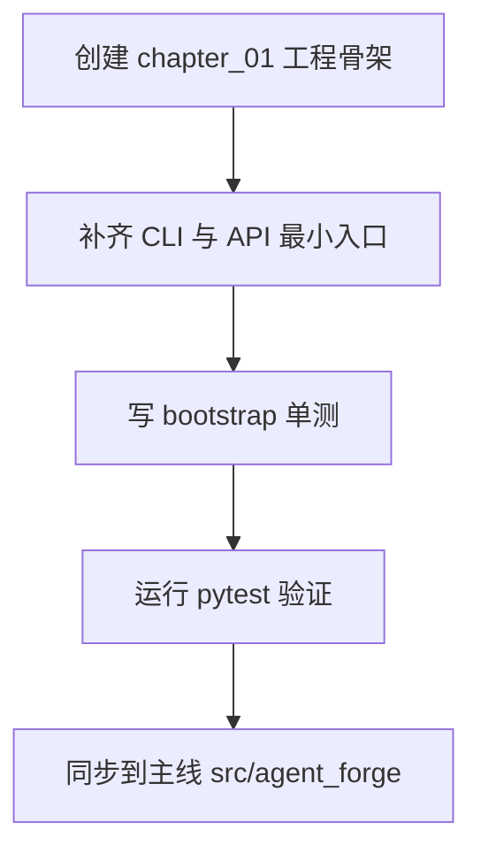

# 《从0到1工业级Agent框架打造》第一章：你的Agent为什么永远停在Demo阶段？

## 本章目标

1.  捅破 Agent 项目从 Demo 到上线之间那层最常见的"窗户纸"。
2.  搭起一个最小可运行骨架（CLI + API + 测试），这是后面14章的起跑线。
3.  定个规矩：后面每章，必须有代码、有测试、能验证。咱们不搞"脑补架构"。

## 动手之前

1.  Python 版本 >= 3.11
2.  装好 `uv`
3.  所有命令都在仓库根目录 `D:\code\build_agent` 下执行

## 环境准备（复制粘贴即可）

```bash
uv add fastapi typer pydantic pydantic-settings python-dotenv openai
uv add --dev pytest
uv sync --dev
```

## 代码放在哪

- 本章独立快照：`examples/from_zero_to_one/chapter_01/`
- 主线演进目录：`src/agent_forge/`

## 开干

### 第 1 步：先聊点实际的

做过 Agent 的，下面这场景熟不熟？

- **第 1 天**：调了两句 Prompt，效果惊艳，感觉马上要起飞。
- **第 7 天**：接上工具、状态和接口，开始时不时抽风一下。
- **第 30 天**：问题在哪都搞不清楚，团队里开始有人嘀咕"要不重写吧"。

真不是模型不行，是工程的底子没打好。

所以第一章，我们不谈什么花哨的"高级能力"，就干一件事：把**最小可运行骨架**立起来，并且能让测试放心地说一句"这玩意能跑"。



这张图就是后面14章的基本操作：
先搭结构，再填能力；先能验证，再谈优化。

### 第 2 步：创建目录和文件

```bash
mkdir -p examples/from_zero_to_one/chapter_01/src/agent_forge/apps/api
mkdir -p examples/from_zero_to_one/chapter_01/tests/unit
```

Windows PowerShell：

```powershell
New-Item -ItemType Directory -Force examples/from_zero_to_one/chapter_01/src/agent_forge/apps/api | Out-Null
New-Item -ItemType Directory -Force examples/from_zero_to_one/chapter_01/tests/unit | Out-Null
```

这步没啥技术含量，但有个细节值得说一句：从第一天就把 `tests` 和 `src` 并列建好。这不是形式主义——我见过太多项目，到后期想补测试的时候，发现连个放测试文件的地方都要吵半天。

### 第 3 步：写核心代码（可以直接跑的版本）

创建命令：

```bash
touch examples/from_zero_to_one/chapter_01/pyproject.toml
```

```powershell
New-Item -ItemType File -Force "examples\\from_zero_to_one\\chapter_01\\pyproject.toml" | Out-Null
```

**文件：** `examples/from_zero_to_one/chapter_01/pyproject.toml`

```toml
[project]
name = "agent-forge-chapter-01"
version = "0.1.0"
requires-python = ">=3.11"
dependencies = [
  "fastapi>=0.115.0",
  "typer>=0.12.0",
  "pytest>=8.3.0",  # 直接把 pytest 塞进依赖，省得跑测试时还要现装
]

[project.scripts]
agent-forge = "agent_forge.apps.cli:app"
```

**说两个让我吃过亏的地方：**

一是把 `pytest` 放进了 `dependencies` 而不是 `dev-dependencies`。这么做有点"政治不正确"，但我的理由是：第一章的读者可能还没建立"dev依赖"的心智模型，我不想让他们跑测试时看到一个 `ModuleNotFoundError` 然后卡住。后面章节稳定了，再挪回去也不迟。

二是 `[project.scripts]` 这个配置。我第一次写 pyproject.toml 时，在这里拼错了路径，结果 `agent-forge` 命令装上了但跑不起来，debug 了半小时。所以如果你待会儿执行命令时报错，八成是这里的问题——直接复制我的，别手打。

创建命令：

```bash
touch examples/from_zero_to_one/chapter_01/src/agent_forge/apps/cli.py
```

```powershell
New-Item -ItemType File -Force "examples\\from_zero_to_one\\chapter_01\\src\\agent_forge\\apps\\cli.py" | Out-Null
```

**文件：** `examples/from_zero_to_one/chapter_01/src/agent_forge/apps/cli.py`

```python
"""CLI entry for chapter 01."""

from __future__ import annotations

import typer

app = typer.Typer(help="agent_forge chapter 01 CLI")


@app.command()
def version() -> None:
    """Print chapter bootstrap version."""

    typer.echo("agent-forge-chapter-01")


if __name__ == "__main__":
    app()
```

这个文件现在看着有点傻，就一个 `version` 命令。但我想表达的是：CLI 是工程的"门面"，门面可以简陋，但不能没有。有了这个入口，后面加命令就是加函数的事，不用再折腾一遍基础设施。

有个容易踩的坑：如果你把 `version` 函数的签名改成 `def version(name: str)` 但不传参，CLI 会直接崩溃。Python 的 CLI 框架对函数签名很敏感，这是好事——越早崩溃的问题越好修。

创建命令：

```bash
touch examples/from_zero_to_one/chapter_01/src/agent_forge/apps/api/app.py
```

```powershell
New-Item -ItemType File -Force "examples\\from_zero_to_one\\chapter_01\\src\\agent_forge\\apps\\api\\app.py" | Out-Null
```

**文件：** `examples/from_zero_to_one/chapter_01/src/agent_forge/apps/api/app.py`

```python
"""FastAPI app for chapter 01."""

from fastapi import FastAPI

app = FastAPI(title="agent_forge_chapter_01")


@app.get("/v1/health")
def health() -> dict[str, str]:
    return {"status": "ok"}
```

健康检查接口，看起来也傻傻的，永远返回 `{"status": "ok"}`。但我故意这么写——第一版的健康检查就应该傻。如果你在第一章就开始纠结"要不要检查数据库连接""要不要检查缓存状态"，那这个接口一个月都上不去。

后面我们会在它上面叠加逻辑，但现在的任务只有一个：证明服务能启动，路由能访问。

### 第 4 步：写测试（也是可以直接跑的版本）

创建命令：

```bash
touch examples/from_zero_to_one/chapter_01/tests/conftest.py
```

```powershell
New-Item -ItemType File -Force "examples\\from_zero_to_one\\chapter_01\\tests\\conftest.py" | Out-Null
```

**文件：** `examples/from_zero_to_one/chapter_01/tests/conftest.py`

```python
"""Test bootstrap for chapter 01 snapshot."""

from __future__ import annotations

import sys
from pathlib import Path

ROOT = Path(__file__).resolve().parents[1]
SRC = ROOT / "src"
if str(SRC) not in sys.path:
    sys.path.insert(0, str(SRC))
```

这个文件就干了一件事：把 `src` 目录塞进 Python 的模块搜索路径。

为什么需要它？因为我们的目录结构是 `examples/chapter_01/src/...`，如果不在 `conftest.py` 里动点手脚，`pytest` 运行时根本找不到 `agent_forge` 这个包。

你可以把它理解为"测试环境的胶水代码"。删掉它，所有测试都会报导入错误，就这么简单粗暴。

创建命令：

```bash
touch examples/from_zero_to_one/chapter_01/tests/unit/test_bootstrap.py
```

```powershell
New-Item -ItemType File -Force "examples\\from_zero_to_one\\chapter_01\\tests\\unit\\test_bootstrap.py" | Out-Null
```

**文件：** `examples/from_zero_to_one/chapter_01/tests/unit/test_bootstrap.py`

```python
"""Chapter 01 bootstrap tests."""

from __future__ import annotations

from agent_forge.apps.api.app import health


def test_health_endpoint_function() -> None:
    assert health() == {"status": "ok"}
```

这是我们的第一条测试，验证的是：健康检查函数能调用，返回值符合预期。

你可能觉得这测试太简单了，没必要写。但我的经验是：第一条测试的意义不在于它测了什么，而在于它建立了"可测试"这件事。有了这条测试，后面的人就知道"哦，原来测试是这么写的""原来 CI 是这么跑的"。

### 第 5 步：同步到主线（chapter_01 -> src）

快照和主线为什么要分开？因为我踩过坑：有时候为了教学清晰，代码写得比较啰嗦，直接塞进主线会污染工程。有时候主线为了性能做了优化，初学者看不懂。

所以我做了两个版本：
- **章节快照**：放在 `examples/` 下，代码尽量清晰，注释尽量多，可以独立运行。
- **主线工程**：放在 `src/` 下，代码尽量精简，注释尽量少，是最终交付的样子。

这一步就是手动同步一下：
1.  把 CLI 文件复制过去：`cp examples/from_zero_to_one/chapter_01/src/agent_forge/apps/cli.py src/agent_forge/apps/cli.py`
2.  把 API 文件复制过去：`cp examples/from_zero_to_one/chapter_01/src/agent_forge/apps/api/app.py src/agent_forge/apps/api/app.py`
3.  检查主线的 `pyproject.toml`，确保 `[project.scripts]` 的路径正确。

## 跑起来看看

验证本章快照：

```bash
uv run pytest examples/from_zero_to_one/chapter_01/tests/unit/test_bootstrap.py -q
```

正常输出应该是一个绿点，像这样：`.`

验证主线工程：

```bash
uv run agent-forge version
# 输出: agent-forge-chapter-01

uv run pytest tests/unit/test_protocol.py -q
# 这个测试现在还不存在，会报错，没关系，下一章就有了
```

## 检查清单

1.  `chapter_01` 的测试能跑通，输出一个绿点。
2.  `agent-forge version` 能执行，输出版本号。
3.  本章提到的所有文件链接，点击后都能跳转到真实文件。
4.  快照代码和主线代码内容一致。

## 翻车了怎么办？

**翻车现场 1：`ModuleNotFoundError: No module named 'agent_forge'`**

大概率是 `conftest.py` 没生效。检查一下：
- 文件是不是放在 `tests/conftest.py` 而不是 `tests/unit/conftest.py`？
- 文件里的路径拼接有没有写错？

**翻车现场 2：`agent-forge: command not found`**

说明 `pyproject.toml` 里的 `[project.scripts]` 没被正确解析。常见原因：
- 在项目根目录执行了 `pip install -e .` 吗？如果用了 `uv`，需要用 `uv pip install -e .`。
- 或者直接 `uv run agent-forge version`，`uv` 会自动处理。

**翻车现场 3：CLI 执行时报错 `TypeError: version() takes 0 positional arguments but 1 was given`**

这说明你在命令行里传了参数，但函数定义没写参数。比如执行了 `agent-forge version xxx`。第一章的 `version` 命令就是不带参数的，故意这么设计。

## 本章完成标志（DoD）

1.  任何人都能从一个空目录，照着本章内容搭出第一个可运行骨架。
2.  能跑通第一条自动化测试（一个绿点）和第一条 CLI 命令（输出版本号）。
3.  主线代码和章节快照已经建立同步，可以开始后续迭代。

## 下一章预告

- **做什么**：实现 `Protocol` 组件。这是整个框架的"通信协议"，定义消息怎么传、状态怎么变、错误怎么报。
- **为什么重要**：第一章让"壳"跑起来，第二章让"芯"定下来。没有统一的协议，后面写的组件互相之间听不懂对方在说什么。
- **提前透个底**：第二章的代码量会比第一章多不少，但核心就一个思想——用 Python 的 `Protocol` 和 `dataclass`，把组件的接口先焊死。接口焊死了，实现随便换。


