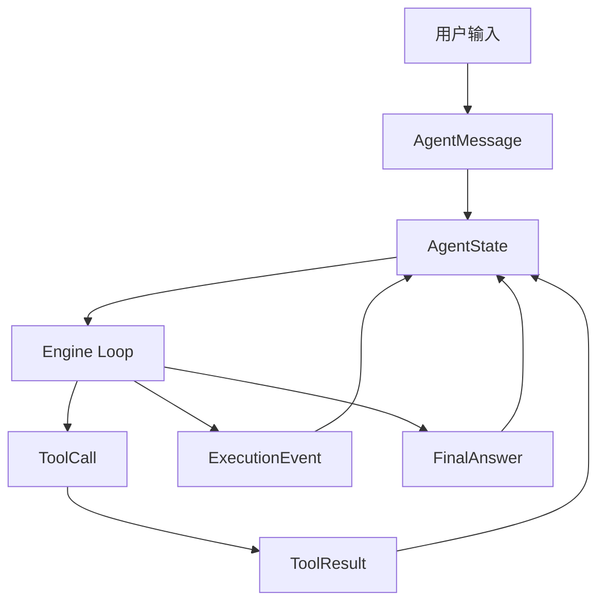

# 《从0到1工业级Agent框架打造》第二章：先把“共同语言”焊死，系统才不会边跑边散架

## 本章目标

1. 搭建 Protocol 组件的完整对象模型：`AgentMessage`、`ToolCall`、`ToolResult`、`ExecutionEvent`、`FinalAnswer`、`AgentState`。
2. 建立“协议先行”的工程纪律：新能力先对齐协议，再写实现。
3. 交付可独立运行的 主线 主线（代码 + 测试），并与主线 `src/agent_forge` 保持一致。

## 前置条件

1. Python >= 3.11
2. 已安装 `uv`
3. 当前命令执行目录：仓库根目录（即包含 `src/`、`tests/`、`docs/` 的目录）
4. 已完成第一章（你已经有最小 CLI/API 骨架）

## 环境准备与缺包兜底步骤（可直接复制）

```bash
uv add pydantic
uv add --dev pytest
uv sync --dev
```

如果你是新环境，且 `uv` 还没安装：

Windows PowerShell：

```powershell
powershell -ExecutionPolicy ByPass -c "irm https://astral.sh/uv/install.ps1 | iex"
```

macOS / Linux：

```bash
curl -LsSf https://astral.sh/uv/install.sh | sh
```


## 先讲“面”：为什么第二章必须先做 Protocol

第一章我们解决的是“项目能启动”。  
第二章要解决的是“项目能协作”。

没有统一协议时，工程会出现三个典型症状：

1. 字段漂移：模型这周返回 `answer`，下周返回 `result`，到处写兜底 `if/else`。
2. 状态漂移：Engine、Runtime、日志系统各存一份状态，出了问题没人知道哪份是真的。
3. 错误漂移：错误只是一段字符串，系统不知道是该重试、降级还是立刻失败。

Protocol 的价值，就是把这些漂移变成“结构化、可校验、可演进”的确定性边界。



这条链路你可以先记一句话：  
所有输入输出，都先落到协议对象，再被各组件消费。

## 再讲“点”：本章具体实施步骤

### 第 1 步：创建 主线章节 主线目录

```bash
mkdir -p src/agent_forge/components/protocol/domain
mkdir -p tests/unit
```

Windows PowerShell：

```powershell
New-Item -ItemType Directory -Force src/agent_forge/components/protocol/domain | Out-Null
New-Item -ItemType Directory -Force tests/unit | Out-Null
```

代码讲解：

1. 设计动机：章节主线和主线分离，避免“教学代码”和“交付代码”互相污染。
2. 工程取舍：本章只聚焦一个组件（Protocol），目录尽量薄，避免提前引入无关结构。
3. 边界条件：只放 Protocol 相关代码，不引入 Engine/Model Runtime 逻辑。
4. 失败模式：目录没建对会直接导致 `pytest` 导入失败。

### 第 2 步：准备主线工程文件

创建命令：

```ash
touch pyproject.toml
```

```powershell
New-Item -ItemType File -Force "examples\\from_zero_to_one\\主线章节\\pyproject.toml" | Out-Null
```
文件：[pyproject.toml](../../pyproject.toml)

```toml
[project]
name = "agent-forge-chapter-02"
version = "0.1.0"
requires-python = ">=3.11"
dependencies = [
  "pydantic>=2.11.0",
  "pytest>=8.3.0",
]

[tool.pytest.ini_options]
pythonpath = ["src"]
```

创建命令：

```ash
touch tests/conftest.py
```

```powershell
New-Item -ItemType File -Force "examples\\from_zero_to_one\\主线章节\\tests\\conftest.py" | Out-Null
```
文件：[tests/conftest.py](../../tests/conftest.py)

```python
"""Test bootstrap for 主线 02 snapshot."""

from __future__ import annotations

import sys
from pathlib import Path

ROOT = Path(__file__).resolve().parents[1]
SRC = ROOT / "src"
if str(SRC) not in sys.path:
    sys.path.insert(0, str(SRC))
```

代码讲解：

1. 设计动机：让章节目录可以完全独立运行，不依赖仓库外部安装状态。
2. 工程取舍：`pyproject.toml` 只保留本章最小依赖，降低读者启动阻力。
3. 边界条件：测试路径固定依赖 `主线章节/src`，目录移动后需要同步改 `conftest.py`。
4. 失败模式：`ModuleNotFoundError: No module named 'agent_forge'` 基本都是这里路径没配好。

### 第 3 步：写 Protocol 导出入口

创建命令：

`ash
touch src/agent_forge/components/protocol/__init__.py
`

`powershell
New-Item -ItemType File -Force "examples\\from_zero_to_one\\主线章节\\src\\agent_forge\\components\\protocol\\__init__.py" | Out-Null
`
文件：[src/agent_forge/components/protocol/__init__.py](../../src/agent_forge/components/protocol/__init__.py)

```python
"""Protocol component exports."""

from agent_forge.components.protocol.domain.schemas import (
    PROTOCOL_VERSION,
    AgentMessage,
    AgentState,
    ErrorInfo,
    ExecutionEvent,
    FinalAnswer,
    ToolCall,
    ToolResult,
    build_initial_state,
)

__all__ = [
    "PROTOCOL_VERSION",
    "AgentMessage",
    "AgentState",
    "ErrorInfo",
    "ExecutionEvent",
    "FinalAnswer",
    "ToolCall",
    "ToolResult",
    "build_initial_state",
]
```

创建命令：

`ash
touch src/agent_forge/components/protocol/domain/__init__.py
`

`powershell
New-Item -ItemType File -Force "examples\\from_zero_to_one\\主线章节\\src\\agent_forge\\components\\protocol\\domain\\__init__.py" | Out-Null
`
文件：[src/agent_forge/components/protocol/domain/__init__.py](../../src/agent_forge/components/protocol/domain/__init__.py)

```python
"""Domain models for protocol component."""
```

代码讲解：

1. 设计动机：把组件的公开 API 收敛在一个入口，外部不直接依赖内部目录细节。
2. 工程取舍：使用 `__all__` 明确“稳定可用字段”，为后续演进预留空间。
3. 边界条件：新增协议对象时必须同步更新 `__init__.py` 和 `__all__`。
4. 失败模式：入口没导出会导致上层模块导入失败，或出现隐式依赖内部路径。

### 第 4 步：写 Protocol 核心 Schema（完整可运行）

创建命令：

`ash
touch src/agent_forge/components/protocol/domain/schemas.py
`

`powershell
New-Item -ItemType File -Force "examples\\from_zero_to_one\\主线章节\\src\\agent_forge\\components\\protocol\\domain\\schemas.py" | Out-Null
`
文件：[src/agent_forge/components/protocol/domain/schemas.py](../../src/agent_forge/components/protocol/domain/schemas.py)

```python
"""Protocol component (framework contract layer).

Why this layer exists:
1. Share one data contract across Engine, Model Runtime, Tool Runtime.
2. Provide stable structured inputs for Observability/Evaluator.
3. Control schema evolution via protocol versions.
"""

from __future__ import annotations

from datetime import datetime, timezone
from typing import Any, Literal
from uuid import uuid4

from pydantic import BaseModel, Field, field_validator

PROTOCOL_VERSION = "v1"


def _now_iso() -> str:
    """Return current UTC timestamp in ISO format."""

    return datetime.now(timezone.utc).isoformat()


class ErrorInfo(BaseModel):
    """Unified runtime error contract."""

    error_code: str = Field(..., min_length=1, description="Error code")
    error_message: str = Field(..., min_length=1, description="Error message")
    retryable: bool = Field(default=False, description="Whether retryable")
    protocol_version: str = Field(default=PROTOCOL_VERSION, description="Protocol version")


class AgentMessage(BaseModel):
    """Single message object in the agent conversation."""

    message_id: str = Field(default_factory=lambda: f"msg_{uuid4().hex}", description="Message ID")
    role: Literal["system", "developer", "user", "assistant", "tool"] = Field(..., description="Message role")
    content: str = Field(..., min_length=1, description="Message content")
    metadata: dict[str, Any] = Field(default_factory=dict, description="Extended metadata")
    created_at: str = Field(default_factory=_now_iso, description="Creation time")
    protocol_version: str = Field(default=PROTOCOL_VERSION, description="Protocol version")


class ToolCall(BaseModel):
    """Tool invocation request.

    `tool_call_id` is the idempotency key.
    """

    tool_call_id: str = Field(..., min_length=1, description="Unique tool call ID")
    tool_name: str = Field(..., min_length=1, description="Tool name")
    args: dict[str, Any] = Field(default_factory=dict, description="Tool arguments")
    principal: str = Field(..., min_length=1, description="Caller principal for auth checks")
    protocol_version: str = Field(default=PROTOCOL_VERSION, description="Protocol version")

    @field_validator("tool_call_id", "tool_name", "principal")
    @classmethod
    def _not_blank(cls, value: str) -> str:
        # Block whitespace-only values from entering the execution chain.
        if not value.strip():
            raise ValueError("Field must not be blank")
        return value


class ToolResult(BaseModel):
    """Tool execution result."""

    tool_call_id: str = Field(..., min_length=1, description="Matched tool call ID")
    status: Literal["ok", "error"] = Field(..., description="Execution status")
    output: dict[str, Any] = Field(default_factory=dict, description="Output payload")
    error: ErrorInfo | None = Field(default=None, description="Error details")
    latency_ms: int = Field(default=0, ge=0, description="Latency in milliseconds")
    protocol_version: str = Field(default=PROTOCOL_VERSION, description="Protocol version")


class ExecutionEvent(BaseModel):
    """Execution event for tracing, replay and evaluation."""

    trace_id: str = Field(..., min_length=1, description="Trace ID")
    run_id: str = Field(..., min_length=1, description="Run ID")
    step_id: str = Field(..., min_length=1, description="Step ID")
    parent_step_id: str | None = Field(default=None, description="Parent step ID")
    event_type: Literal["plan", "tool_call", "tool_result", "state_update", "finish", "error"] = Field(
        ..., description="Event type"
    )
    payload: dict[str, Any] = Field(default_factory=dict, description="Event payload")
    error: ErrorInfo | None = Field(default=None, description="Event error")
    created_at: str = Field(default_factory=_now_iso, description="Creation time")
    protocol_version: str = Field(default=PROTOCOL_VERSION, description="Protocol version")


class FinalAnswer(BaseModel):
    """Structured final output, kept domain-agnostic."""

    status: Literal["success", "partial", "failed"] = Field(..., description="Task completion status")
    summary: str = Field(..., min_length=1, description="Summary of result")
    output: dict[str, Any] = Field(default_factory=dict, description="Structured output payload")
    artifacts: list[dict[str, Any]] = Field(default_factory=list, description="Execution artifacts")
    references: list[str] = Field(default_factory=list, description="Optional references")
    protocol_version: str = Field(default=PROTOCOL_VERSION, description="Protocol version")


class AgentState(BaseModel):
    """Single source of truth for the engine runtime."""

    session_id: str = Field(..., min_length=1, description="Session ID")
    trace_id: str = Field(default_factory=lambda: f"trace_{uuid4().hex}", description="Trace ID")
    run_id: str = Field(default_factory=lambda: f"run_{uuid4().hex}", description="Run ID")
    messages: list[AgentMessage] = Field(default_factory=list, description="Messages")
    tool_calls: list[ToolCall] = Field(default_factory=list, description="Tool call records")
    tool_results: list[ToolResult] = Field(default_factory=list, description="Tool result records")
    events: list[ExecutionEvent] = Field(default_factory=list, description="Execution events")
    final_answer: FinalAnswer | None = Field(default=None, description="Final structured output")
    protocol_version: str = Field(default=PROTOCOL_VERSION, description="Protocol version")

    @field_validator("session_id")
    @classmethod
    def _session_id_not_blank(cls, value: str) -> str:
        # Session ID is the partition key; blank values can pollute cross-session state.
        if not value.strip():
            raise ValueError("session_id must not be blank")
        return value


def build_initial_state(session_id: str) -> AgentState:
    """Build the initial state used by the engine loop."""

    return AgentState(session_id=session_id)
```

代码讲解：

1. 设计动机：所有核心对象都携带 `protocol_version`，协议演进可追踪。
2. 工程取舍：先保证协议稳定，再考虑字段“优雅”；字段多一点比线上崩溃强。
3. 边界条件：本章只定义协议，不定义业务语义（保持领域无关）。
4. 失败模式：空白字段没拦住会导致幂等键失效、会话分区失效、重试策略失效。

### 第 5 步：写测试（完整可运行）

创建命令：

`ash
touch tests/unit/test_protocol.py
`

`powershell
New-Item -ItemType File -Force "examples\\from_zero_to_one\\主线章节\\tests\\unit\\test_protocol.py" | Out-Null
`
文件：[tests/unit/test_protocol.py](../../tests/unit/test_protocol.py)

```python
"""Protocol component tests."""

from __future__ import annotations

import json

import pytest
from pydantic import ValidationError

from agent_forge.components.protocol import (
    PROTOCOL_VERSION,
    AgentMessage,
    AgentState,
    ErrorInfo,
    ExecutionEvent,
    FinalAnswer,
    ToolCall,
    ToolResult,
    build_initial_state,
)


def test_initial_state_contains_required_ids_and_version() -> None:
    """Initial state should include trace/run/protocol fields."""

    state = build_initial_state("session_001")
    assert state.session_id == "session_001"
    assert state.trace_id.startswith("trace_")
    assert state.run_id.startswith("run_")
    assert state.protocol_version == PROTOCOL_VERSION


def test_protocol_roundtrip_json_serialization() -> None:
    """Protocol objects should support JSON round-trip."""

    message = AgentMessage(role="user", content="Company delayed salary payment")
    call = ToolCall(
        tool_call_id="tc_001",
        tool_name="law_search",
        args={"query": "salary delay"},
        principal="worker_user",
    )
    result = ToolResult(tool_call_id="tc_001", status="ok", output={"hits": 2}, latency_ms=18)
    event = ExecutionEvent(
        trace_id="trace_001",
        run_id="run_001",
        step_id="step_001",
        event_type="tool_result",
        payload={"tool_call_id": "tc_001"},
    )
    final = FinalAnswer(
        status="success",
        summary="Task completed with structured output",
        output={"answer": "Collect evidence and file mediation first", "priority": "high"},
        artifacts=[{"type": "plan", "id": "plan_001"}],
        references=["law_search:doc_123"],
    )
    state = AgentState(
        session_id="session_002",
        messages=[message],
        tool_calls=[call],
        tool_results=[result],
        events=[event],
        final_answer=final,
    )

    raw = state.model_dump_json(ensure_ascii=False)
    data = json.loads(raw)
    loaded = AgentState.model_validate(data)
    assert loaded.session_id == "session_002"
    assert loaded.tool_calls[0].tool_name == "law_search"
    assert loaded.final_answer is not None
    assert loaded.final_answer.protocol_version == PROTOCOL_VERSION
    assert loaded.final_answer.status == "success"


def test_blank_fields_must_fail_validation() -> None:
    """Blank key fields must fail validation."""

    with pytest.raises(ValidationError):
        ToolCall(tool_call_id=" ", tool_name="t", args={}, principal="p")

    with pytest.raises(ValidationError):
        AgentState(session_id="   ")


def test_error_info_schema() -> None:
    """Error schema should be stable and include version."""

    err = ErrorInfo(error_code="TOOL_TIMEOUT", error_message="tool timeout", retryable=True)
    assert err.retryable is True
    assert err.protocol_version == PROTOCOL_VERSION
```

代码讲解：

1. 覆盖目标：初始化、序列化、校验、错误模型四类最小稳定面。
2. 断言设计：不只断言“有值”，还断言版本字段和关键状态字段。
3. 失败注入：用空白字符串触发校验，验证协议边界确实生效。
4. 工程价值：后续任何组件改动只要破坏协议，这组测试会第一时间报警。

### 第 6 步：主线一致性检查

本章主线应与主线代码保持一致：

1. [src/agent_forge/components/protocol/__init__.py](../../src/agent_forge/components/protocol/__init__.py) 对齐 [src/agent_forge/components/protocol/__init__.py](../../src/agent_forge/components/protocol/__init__.py)
2. [src/agent_forge/components/protocol/domain/schemas.py](../../src/agent_forge/components/protocol/domain/schemas.py) 对齐 [src/agent_forge/components/protocol/domain/schemas.py](../../src/agent_forge/components/protocol/domain/schemas.py)
3. [tests/unit/test_protocol.py](../../tests/unit/test_protocol.py) 对齐 [tests/unit/test_protocol.py](../../tests/unit/test_protocol.py)

快速同步命令（可直接复制）：

```bash
```

Windows PowerShell：

```powershell
```

## 创建目录与文件命令（硬标准）

不要一口气全部创建。按下面顺序，走到对应代码步骤时再执行下一条命令。

Bash（分步执行）：
2. `mkdir -p src/agent_forge/components/protocol`
3. `mkdir -p src/agent_forge/components/protocol/domain`
4. `mkdir -p tests`
5. `mkdir -p tests/unit`
6. `touch pyproject.toml`
7. `touch src/agent_forge/components/protocol/__init__.py`
8. `touch src/agent_forge/components/protocol/domain/__init__.py`
9. `touch src/agent_forge/components/protocol/domain/schemas.py`
10. `touch tests/conftest.py`
11. `touch tests/unit/test_protocol.py`

Windows PowerShell（分步执行）：
2. `New-Item -ItemType Directory -Force "src\agent_forge\components\protocol" | Out-Null`
3. `New-Item -ItemType Directory -Force "src\agent_forge\components\protocol\domain" | Out-Null`
4. `New-Item -ItemType Directory -Force "tests" | Out-Null`
5. `New-Item -ItemType Directory -Force "tests\unit" | Out-Null`
6. `New-Item -ItemType File -Force "pyproject.toml" | Out-Null`
7. `New-Item -ItemType File -Force "src\agent_forge\components\protocol\__init__.py" | Out-Null`
8. `New-Item -ItemType File -Force "src\agent_forge\components\protocol\domain\__init__.py" | Out-Null`
9. `New-Item -ItemType File -Force "src\agent_forge\components\protocol\domain\schemas.py" | Out-Null`
10. `New-Item -ItemType File -Force "tests\conftest.py" | Out-Null`
11. `New-Item -ItemType File -Force "tests\unit\test_protocol.py" | Out-Null`

## 运行命令

先验证 主线 主线：

```bash
uv run pytest tests/unit/test_protocol.py -q
```

再验证主线：

```bash
uv run pytest tests/unit/test_protocol.py -q
```

## 验证清单

1. 主线章节 测试通过。
2. 主线 `tests/unit/test_protocol.py` 测试通过。
3. 本文所有路径可点击跳转到真实文件。
4. 主线 主线与主线协议代码一致。

## 常见问题

1. 报错：`ModuleNotFoundError: No module named 'agent_forge'`  
修复：确认 [tests/conftest.py](../../tests/conftest.py) 存在，且 `SRC = ROOT / "src"` 未改错。

2. 报错：`ValidationError` 但看不懂字段  
修复：先看 `ToolCall` 和 `AgentState` 的校验器，重点检查是否传入空白字符串。

3. 报错：主线和 主线章节 行为不一致  
修复：按“第 6 步”逐文件对齐，避免只改了一边。

## 本章 DoD

1. Protocol 核心对象全部可序列化和反序列化。
2. 关键输入边界（空白字段）被协议层拦截。
3. 主线 主线和主线测试都通过。
4. 你能清楚回答每个对象“为什么存在”。

## 下一章预告

1. 第三章进入 Engine 主循环，严格实现：`plan -> act -> observe -> reflect -> update -> finish`。
2. 你会看到 Protocol 如何被 Engine 实际消费，以及为什么 reflect 不应该被省略。


