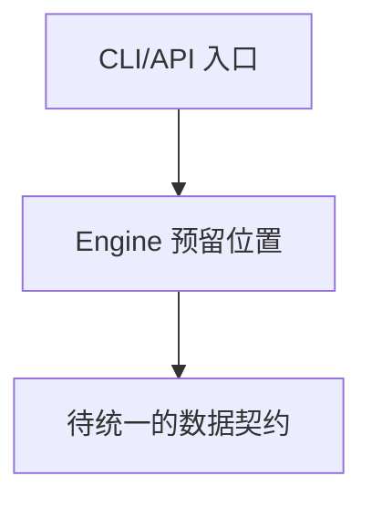
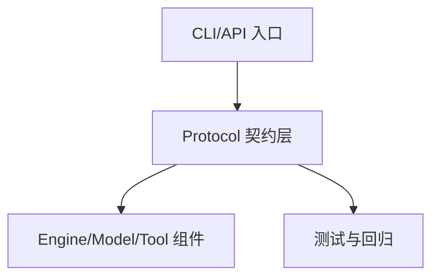
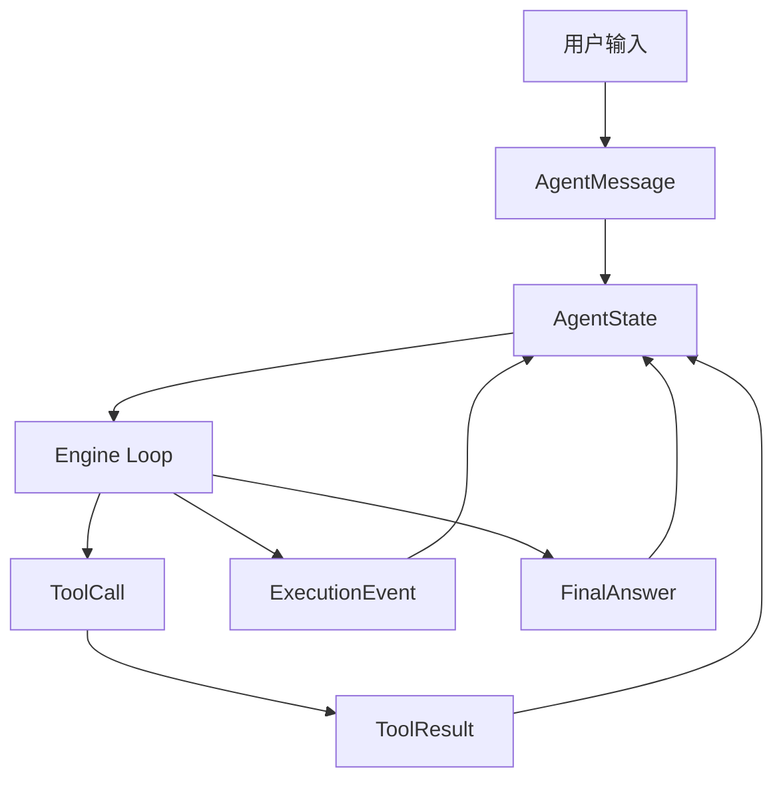
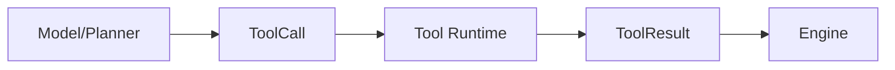

# 《从0到1工业级Agent框架打造》第二章：先把“共同语言”焊死，系统才不会边跑边散架

## 本章目标

1. 搭建 Protocol 组件的完整对象模型：`AgentMessage`、`ToolCall`、`ToolResult`、`ExecutionEvent`、`FinalAnswer`、`AgentState`。
2. 建立“协议先行”的工程纪律：新能力先对齐协议，再写实现。
3. 交付可独立运行的 主线（代码 + 测试），并与主线 `src/agent_forge` 保持一致。

## 架构位置说明（演进视角）

### 当前系统结构（第 2 章开始前）



### 本章完成后的结构



1. 新模块依赖谁：Protocol 仅依赖基础库（pydantic），不反向依赖 Engine。
2. 谁依赖它：后续 Engine、Model Runtime、Tool Runtime 都以它为统一输入输出契约。
3. 依赖方向是否变化：变化为“先协议后实现”，降低跨组件耦合。
4. 循环风险：本章保持单向依赖，不引入循环依赖。

## 前置条件

1. Python >= 3.11
2. 已安装 `uv`
3. 当前命令执行目录：仓库根目录（即包含 `src/`、`tests/`、`docs/` 的目录）
4. 已完成第一章（你已经有最小 CLI/API 骨架）

## 环境准备

```bash
uv add pydantic
uv add --dev pytest
uv sync --dev
```

## 先讲“面”：为什么第二章必须先做 Protocol

第一章我们解决的是“项目能启动”。  
第二章要解决的是“项目能协作”。

没有统一协议时，工程会出现三个典型症状：

1. 字段漂移：模型这周返回 `answer`，下周返回 `result`，到处写兜底 `if/else`。
2. 状态漂移：Engine、Runtime、日志系统各存一份状态，出了问题没人知道哪份是真的。
3. 错误漂移：错误只是一段字符串，系统不知道是该重试、降级还是立刻失败。

Protocol 的价值，就是把这些漂移变成“结构化、可校验、可演进”的确定性边界。



这条链路你可以先记一句话：  
所有输入输出，**都先落到协议对象**，再被各组件消费。

---


---

## 深入理解：Protocol 为什么是全链路的“同一种语言”

### 白话理解 Protocol

Protocol 就是“团队约定的统一表格”。

- 你填什么字段，我就按什么字段处理。
- 没有这张表，大家都在猜字段含义，系统必然越来越乱。

### 例子：同一个 Tool 调用，为什么要标准化

成功链路例子：

1. 模型产出 `tool_call_id/tool_name/args`。
2. Tool Runtime 按固定结构执行并返回 `ToolResult`。
3. Engine 只认 `status/output/error`，无需猜测。

失败链路例子：

1. 某工具返回 `{"ok": true}`，另一个返回 `{"success": 1}`。
2. Engine 里写满 if/else 兼容判断。
3. 新增第三个工具后继续膨胀，最终不可维护。

### 协议统一后数据怎么流



### 实战读法

1. 看字段时重点看“谁生产、谁消费、谁校验”。
2. 关注 `error_code/retryable` 这种“执行决策字段”，不是装饰字段。
3. 把协议当成“防回归边界”，不是文档摆设。

## 本章主线改动范围

### 代码目录

- `src/agent_forge/components/protocol/`

### 测试目录

- `tests/unit/`

### 本章涉及的真实文件

- [src/agent_forge/components/protocol/__init__.py](../../src/agent_forge/components/protocol/__init__.py)
- [src/agent_forge/components/protocol/domain/__init__.py](../../src/agent_forge/components/protocol/domain/__init__.py)
- [src/agent_forge/components/protocol/domain/schemas.py](../../src/agent_forge/components/protocol/domain/schemas.py)
- [tests/unit/test_protocol.py](../../tests/unit/test_protocol.py)

约束说明：本章只新增协议层能力，不引入临时代码，不推翻第一章骨架。

## 再讲“点”：本章具体实施步骤

### 第 1 步：创建目录

```bash
mkdir -p src/agent_forge/components/protocol/domain
mkdir -p tests/unit
```

Windows PowerShell：

```powershell
New-Item -ItemType Directory -Force src/agent_forge/components/protocol/domain | Out-Null
New-Item -ItemType Directory -Force tests/unit | Out-Null
```

### 第 2 步：写 Protocol 导出入口

创建命令：

```bash
touch src/agent_forge/components/protocol/__init__.py
```

```powershell
New-Item -ItemType File -Force "src\\agent_forge\\components\\protocol\\__init__.py" | Out-Null
```
文件：[src/agent_forge/components/protocol/__init__.py](../../src/agent_forge/components/protocol/__init__.py)

```python
"""Protocol component exports."""

from agent_forge.components.protocol.domain.schemas import (
    PROTOCOL_VERSION,
    AgentMessage,
    AgentState,
    ErrorInfo,
    ExecutionEvent,
    FinalAnswer,
    ToolCall,
    ToolResult,
    build_initial_state,
)

__all__ = [
    "PROTOCOL_VERSION",
    "AgentMessage",
    "AgentState",
    "ErrorInfo",
    "ExecutionEvent",
    "FinalAnswer",
    "ToolCall",
    "ToolResult",
    "build_initial_state",
]
```

创建命令：

```bash
touch src/agent_forge/components/protocol/domain/__init__.py
```

```powershell
New-Item -ItemType File -Force "src\\agent_forge\\components\\protocol\\domain\\__init__.py" | Out-Null
```
文件：[src/agent_forge/components/protocol/domain/__init__.py](../../src/agent_forge/components/protocol/domain/__init__.py)

```python
"""Domain models for protocol component."""
```

代码讲解：

1. 设计动机：把组件的公开 API 收敛在一个入口，外部不直接依赖内部目录细节。
2. 工程取舍：使用 `__all__` 明确“稳定可用字段”，为后续演进预留空间。
3. 边界条件：新增协议对象时必须同步更新 `__init__.py` 和 `__all__`。
4. 失败模式：入口没导出会导致上层模块导入失败，或出现隐式依赖内部路径。

### 第 3 步：写 Protocol 核心 Schema

创建命令：

```bash
touch src/agent_forge/components/protocol/domain/schemas.py
```

```powershell
New-Item -ItemType File -Force "src\\agent_forge\\components\\protocol\\domain\\schemas.py" | Out-Null
```
文件：[src/agent_forge/components/protocol/domain/schemas.py](../../src/agent_forge/components/protocol/domain/schemas.py)

```python
"""协议组件（框架契约层）。

为什么需要这一层：
1. 在 Engine、Model Runtime、Tool Runtime 之间共享统一的数据契约。
2. 为 Observability / Evaluator 提供稳定的结构化输入。
3. 通过协议版本控制 Schema 的演进。
"""

from __future__ import annotations

from datetime import datetime, timezone
from typing import Any, Literal
from uuid import uuid4

from pydantic import BaseModel, Field, field_validator

PROTOCOL_VERSION = "v1"


def _now_iso() -> str:
    """返回当前 UTC 时间戳（ISO 格式）。"""

    return datetime.now(timezone.utc).isoformat()


class ErrorInfo(BaseModel):
    """统一的运行时错误契约。"""

    error_code: str = Field(..., min_length=1, description="错误码")
    error_message: str = Field(..., min_length=1, description="错误信息")
    retryable: bool = Field(default=False, description="是否可重试")
    protocol_version: str = Field(default=PROTOCOL_VERSION, description="协议版本")


class AgentMessage(BaseModel):
    """Agent 对话中的单条消息对象。"""

    message_id: str = Field(default_factory=lambda: f"msg_{uuid4().hex}", description="消息 ID")
    role: Literal["system", "developer", "user", "assistant", "tool"] = Field(..., description="消息角色")
    content: str = Field(..., min_length=1, description="消息内容")
    metadata: dict[str, Any] = Field(default_factory=dict, description="扩展元数据")
    created_at: str = Field(default_factory=_now_iso, description="创建时间")
    protocol_version: str = Field(default=PROTOCOL_VERSION, description="协议版本")


class ToolCall(BaseModel):
    """工具调用请求。

    `tool_call_id` 是幂等键（idempotency key）。
    """

    tool_call_id: str = Field(..., min_length=1, description="唯一工具调用 ID")
    tool_name: str = Field(..., min_length=1, description="工具名称")
    args: dict[str, Any] = Field(default_factory=dict, description="工具参数")
    principal: str = Field(..., min_length=1, description="调用方主体（用于鉴权校验）")
    protocol_version: str = Field(default=PROTOCOL_VERSION, description="协议版本")

    @field_validator("tool_call_id", "tool_name", "principal")
    @classmethod
    def _not_blank(cls, value: str) -> str:
        # 禁止仅包含空白字符的值进入执行链路。
        if not value.strip():
            raise ValueError("字段不能为空白")
        return value


class ToolResult(BaseModel):
    """工具执行结果。"""

    tool_call_id: str = Field(..., min_length=1, description="匹配的工具调用 ID")
    status: Literal["ok", "error"] = Field(..., description="执行状态")
    output: dict[str, Any] = Field(default_factory=dict, description="输出载荷")
    error: ErrorInfo | None = Field(default=None, description="错误详情")
    latency_ms: int = Field(default=0, ge=0, description="执行耗时（毫秒）")
    protocol_version: str = Field(default=PROTOCOL_VERSION, description="协议版本")


class ExecutionEvent(BaseModel):
    """用于追踪、回放和评估的执行事件。"""

    trace_id: str = Field(..., min_length=1, description="Trace ID")
    run_id: str = Field(..., min_length=1, description="Run ID")
    step_id: str = Field(..., min_length=1, description="步骤 ID")
    parent_step_id: str | None = Field(default=None, description="父步骤 ID")
    event_type: Literal["plan", "tool_call", "tool_result", "state_update", "finish", "error"] = Field(
        ..., description="事件类型"
    )
    payload: dict[str, Any] = Field(default_factory=dict, description="事件载荷")
    error: ErrorInfo | None = Field(default=None, description="事件错误")
    created_at: str = Field(default_factory=_now_iso, description="创建时间")
    protocol_version: str = Field(default=PROTOCOL_VERSION, description="协议版本")


class FinalAnswer(BaseModel):
    """结构化最终输出，与具体业务领域无关。"""

    status: Literal["success", "partial", "failed"] = Field(..., description="任务完成状态")
    summary: str = Field(..., min_length=1, description="结果摘要")
    output: dict[str, Any] = Field(default_factory=dict, description="结构化输出载荷")
    artifacts: list[dict[str, Any]] = Field(default_factory=list, description="执行产物")
    references: list[str] = Field(default_factory=list, description="可选参考信息")
    protocol_version: str = Field(default=PROTOCOL_VERSION, description="协议版本")


class AgentState(BaseModel):
    """Engine 运行时的单一事实来源（Single Source of Truth）。"""

    session_id: str = Field(..., min_length=1, description="会话 ID")
    trace_id: str = Field(default_factory=lambda: f"trace_{uuid4().hex}", description="Trace ID")
    run_id: str = Field(default_factory=lambda: f"run_{uuid4().hex}", description="Run ID")
    messages: list[AgentMessage] = Field(default_factory=list, description="消息列表")
    tool_calls: list[ToolCall] = Field(default_factory=list, description="工具调用记录")
    tool_results: list[ToolResult] = Field(default_factory=list, description="工具执行结果记录")
    events: list[ExecutionEvent] = Field(default_factory=list, description="执行事件列表")
    final_answer: FinalAnswer | None = Field(default=None, description="最终结构化输出")
    protocol_version: str = Field(default=PROTOCOL_VERSION, description="协议版本")

    @field_validator("session_id")
    @classmethod
    def _session_id_not_blank(cls, value: str) -> str:
        # session_id 是分区键；空值可能导致跨会话状态污染。
        if not value.strip():
            raise ValueError("session_id 不能为空")
        return value


def build_initial_state(session_id: str) -> AgentState:
    """构建用于引擎循环的初始状态。"""

    return AgentState(session_id=session_id)
```

代码讲解：

1. 设计动机：所有核心对象都携带 `protocol_version`，协议演进可追踪。
2. 工程取舍：先保证协议稳定，再考虑字段“优雅”；字段多一点比线上崩溃强。
3. 边界条件：本章只定义协议，不定义业务语义（保持领域无关）。
4. 失败模式：空白字段没拦住会导致幂等键失效、会话分区失效、重试策略失效。

### 第 4 步：写测试（完整可运行）

创建命令：

```bash
touch tests/unit/test_protocol.py
```

```powershell
New-Item -ItemType File -Force "tests\\unit\\test_protocol.py" | Out-Null
```
文件：[tests/unit/test_protocol.py](../../tests/unit/test_protocol.py)

```python
"""Protocol 组件测试。"""

from __future__ import annotations

import json

import pytest
from pydantic import ValidationError

from agent_forge.components.protocol import (
    PROTOCOL_VERSION,
    AgentMessage,
    AgentState,
    ErrorInfo,
    ExecutionEvent,
    FinalAnswer,
    ToolCall,
    ToolResult,
    build_initial_state,
)


def test_initial_state_contains_required_ids_and_version() -> None:
    """初始状态应自动带 trace/run/protocol 字段。"""

    state = build_initial_state("session_001")
    assert state.session_id == "session_001"
    assert state.trace_id.startswith("trace_")
    assert state.run_id.startswith("run_")
    assert state.protocol_version == PROTOCOL_VERSION


def test_protocol_roundtrip_json_serialization() -> None:
    """协议对象应支持 JSON 序列化与反序列化。"""

    message = AgentMessage(role="user", content="公司拖欠工资")
    call = ToolCall(
        tool_call_id="tc_001",
        tool_name="labor_law_search",
        args={"query": "拖欠工资"},
        principal="worker_user",
    )
    result = ToolResult(tool_call_id="tc_001", status="ok", output={"hits": 2}, latency_ms=18)
    event = ExecutionEvent(
        trace_id="trace_001",
        run_id="run_001",
        step_id="step_001",
        event_type="tool_result",
        payload={"tool_call_id": "tc_001"},
    )
    final = FinalAnswer(
        status="success",
        summary="任务已完成并生成结构化结果",
        output={"answer": "工资争议处理建议", "priority": "high"},
        artifacts=[{"type": "plan", "id": "plan_001"}],
        references=["labor_law_search:doc_123"],
    )
    state = AgentState(
        session_id="session_002",
        messages=[message],
        tool_calls=[call],
        tool_results=[result],
        events=[event],
        final_answer=final,
    )

    raw = state.model_dump_json(ensure_ascii=False)
    data = json.loads(raw)
    loaded = AgentState.model_validate(data)
    assert loaded.session_id == "session_002"
    assert loaded.tool_calls[0].tool_name == "labor_law_search"
    assert loaded.final_answer is not None
    assert loaded.final_answer.protocol_version == PROTOCOL_VERSION
    assert loaded.final_answer.status == "success"


def test_blank_fields_must_fail_validation() -> None:
    """空白关键字段必须校验失败。"""

    with pytest.raises(ValidationError):
        ToolCall(tool_call_id=" ", tool_name="t", args={}, principal="p")

    with pytest.raises(ValidationError):
        AgentState(session_id="   ")


def test_error_info_schema() -> None:
    """错误结构应稳定且带协议版本。"""

    err = ErrorInfo(error_code="TOOL_TIMEOUT", error_message="tool timeout", retryable=True)
    assert err.retryable is True
    assert err.protocol_version == PROTOCOL_VERSION


```

代码讲解：

1. 覆盖目标：初始化、序列化、校验、错误模型四类最小稳定面。
2. 断言设计：不只断言“有值”，还断言版本字段和关键状态字段。
3. 失败注入：用空白字符串触发校验，验证协议边界确实生效。
4. 工程价值：后续任何组件改动只要破坏协议，这组测试会第一时间报警。

## 运行命令

验证：

```bash
uv run pytest tests/unit/test_protocol.py -q
```


PowerShell 等价命令：

```powershell
uv run pytest tests/unit/test_protocol.py -q
```

## 增量闭环验证

1. 协议闭环：`AgentState` 与核心对象可序列化/反序列化。
2. 边界闭环：空白关键字段会被校验器拦截。
3. 架构闭环：Protocol 已成为后续组件的稳定契约入口。

## 验证清单

1.  `tests/unit/test_protocol.py` 测试通过。

## 常见问题

1. 报错：`ModuleNotFoundError: No module named 'agent_forge'`  
修复：确认 [tests/conftest.py](../../tests/conftest.py) 存在，且 `SRC = ROOT / "src"` 未改错。
2. 报错：`ValidationError` 但看不懂字段  
修复：先看 `ToolCall` 和 `AgentState` 的校验器，重点检查是否传入空白字符串。

## 本章 DoD

1. Protocol 核心对象全部可序列化和反序列化。
2. 关键输入边界（空白字段）被协议层拦截。
3. 你能清楚回答每个对象“为什么存在”。

## 下一章预告

1. 第三章进入 Engine 主循环，严格实现：`plan -> act -> observe -> reflect -> update -> finish`。
2. 你会看到 Protocol 如何被 Engine 实际消费，以及为什么 reflect 不应该被省略。
