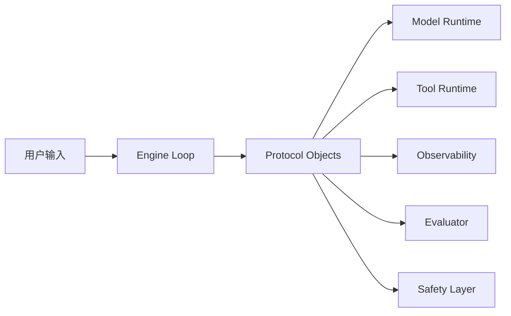
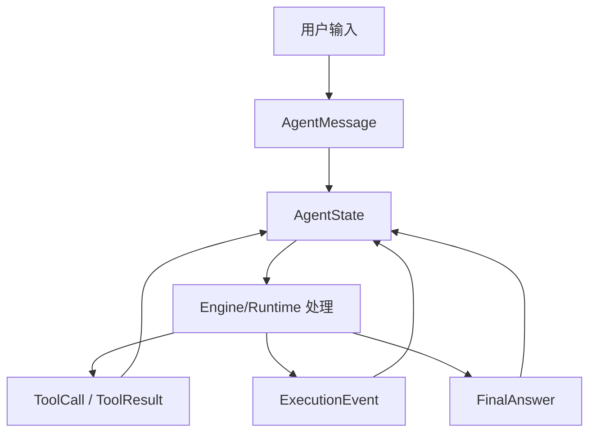
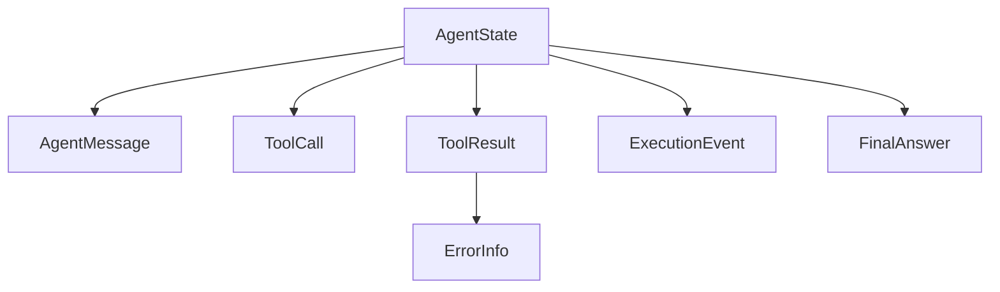
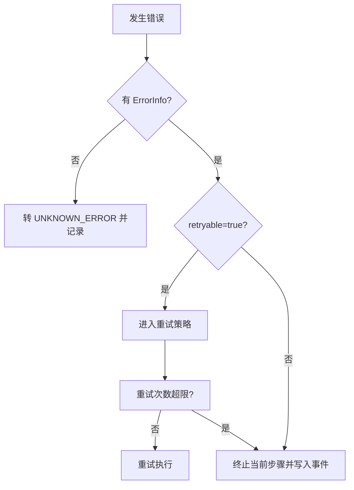

# 《从0到1工业级Agent框架打造》第二章：Protocol 协议层（手把手实战 + 原理图解）

这一章你不仅会“照着抄能跑”，还会知道“为什么要这么写”。  
目标是把协议层做成后续所有组件都能依赖的稳定地基。

---

## 这一章解决的核心问题

在工程里，Agent 失败常见不是“模型不行”，而是协议失控：

1. 模型输出字段经常变，解析逻辑到处 `if/else`。
2. 工具重试时重复执行副作用（写库、发消息）。
3. 线上问题无法定位到具体步骤。
4. 评测系统拿不到结构化数据。

Protocol 层就是为了解决这四件事。

---

## 先看全局图：协议层在框架里的位置



解释：  
Protocol 不是某个模块的私有实现，而是整个系统的“共享数据平面”。

---

## 先讲“面”：Protocol 主流程（一次请求如何穿过协议层）



主流程解释：  
1. 用户输入先被标准化成 `AgentMessage`，禁止裸字符串在系统里乱传。  
2. 所有运行态数据汇总到 `AgentState`，避免状态分散。  
3. 工具调用和执行事件都回写 `AgentState`，形成可观测、可回放链路。  
4. 最终输出统一为 `FinalAnswer`，确保上层调用方拿到稳定结构。

---

## 再讲“点”：为什么这些对象必须拆开而不是合并

1. `ToolCall` 和 `ToolResult` 分离：便于做幂等与重试，不会把“请求”和“结果”混成一个不可追踪对象。  
2. `ExecutionEvent` 独立：让观测系统只消费事件流，不耦合业务字段。  
3. `FinalAnswer` 独立：输出契约稳定，避免上游 UI/接口解析被中间态字段污染。  
4. `ErrorInfo` 独立：错误可机器化处理（重试/中止/降级），不是靠字符串猜测。

---

## 第 0 步：创建目录结构

在仓库根目录执行：

```bash
mkdir -p framework/labor_agent/core/protocol
mkdir -p tests
```

Windows PowerShell：

```powershell
New-Item -ItemType Directory -Force framework/labor_agent/core/protocol | Out-Null
New-Item -ItemType Directory -Force tests | Out-Null
```

为什么这样分层：  
`core/protocol` 明确它是框架核心能力，不是业务模块或 API 适配层。

---

## 第 0.5 步：准备可运行环境（最简版）

直接按这 2 步执行：

1. 安装 `uv`（如果你还没有）：

macOS / Linux：

```bash
curl -LsSf https://astral.sh/uv/install.sh | sh
```

Windows（PowerShell）：

```powershell
powershell -ExecutionPolicy ByPass -c "irm https://astral.sh/uv/install.ps1 | iex"
```

2. 添加测试依赖：

```bash
uv add --dev pytest
```

---

## 第 0.6 步：修复 IDE 飘红（import 无法解析）

如果你在 IDE 里看到下面这段 import 飘红：

```python
from labor_agent.core.protocol import ...
```

按下面两步处理：

1. 使用项目虚拟环境：

```bash
uv sync --dev
```

2. 把 `framework/` 设为源码根目录（Source Root）  
   - PyCharm：右键 `framework` -> `Mark Directory as` -> `Sources Root`  
   - VS Code/Pylance：项目已提供 `pyrightconfig.json`，重启语言服务即可

---

## 第 1 步：创建协议导出入口

创建 `framework/labor_agent/core/protocol/__init__.py`：

```python
"""Protocol 组件导出。"""

from .schemas import (
    PROTOCOL_VERSION,
    AgentMessage,
    AgentState,
    ErrorInfo,
    ExecutionEvent,
    FinalAnswer,
    ToolCall,
    ToolResult,
    build_initial_state,
)

__all__ = [
    "PROTOCOL_VERSION",
    "AgentMessage",
    "AgentState",
    "ErrorInfo",
    "ExecutionEvent",
    "FinalAnswer",
    "ToolCall",
    "ToolResult",
    "build_initial_state",
]
```

为什么要 `__all__`：  
统一公开接口，避免外部模块绕过协议边界直接依赖内部实现细节。

---

## 第 2 步：创建协议 Schema 主文件

创建 `framework/labor_agent/core/protocol/schemas.py`，写入：

```python
"""Protocol 组件（框架契约层）。

为什么单独做这一层：
1. 让 Engine、Model Runtime、Tool Runtime 共享同一套数据契约。
2. 给 Observability/Evaluator 提供稳定的结构化输入。
3. 通过版本字段控制协议演进，避免“改一个字段全链路崩”。
"""

from __future__ import annotations

from datetime import datetime, timezone
from typing import Any, Literal
from uuid import uuid4

from pydantic import BaseModel, Field, field_validator

PROTOCOL_VERSION = "v1"


def _now_iso() -> str:
    """统一事件时间格式。

    使用 UTC ISO 字符串，便于日志系统、数据仓库和跨时区排查统一处理。
    """

    return datetime.now(timezone.utc).isoformat()


class ErrorInfo(BaseModel):
    """统一错误结构。

    约束：
    - 所有运行时错误最终都应映射到这里。
    - `retryable` 由 Runtime 层给出，用于指导 Engine 的重试决策。
    """

    error_code: str = Field(..., min_length=1, description="错误码")
    error_message: str = Field(..., min_length=1, description="错误信息")
    retryable: bool = Field(default=False, description="是否可重试")
    protocol_version: str = Field(default=PROTOCOL_VERSION, description="协议版本")


class AgentMessage(BaseModel):
    """智能体消息对象。

    说明：
    - `role` 用 Literal 固定取值，防止上游传入未知角色破坏上下文拼装。
    - `message_id` 自动生成，确保每条消息都可在 trace 中被唯一定位。
    """

    message_id: str = Field(default_factory=lambda: f"msg_{uuid4().hex}", description="消息 ID")
    role: Literal["system", "developer", "user", "assistant", "tool"] = Field(..., description="消息角色")
    content: str = Field(..., min_length=1, description="消息内容")
    metadata: dict[str, Any] = Field(default_factory=dict, description="扩展元数据")
    created_at: str = Field(default_factory=_now_iso, description="创建时间")
    protocol_version: str = Field(default=PROTOCOL_VERSION, description="协议版本")


class ToolCall(BaseModel):
    """工具调用请求。

    说明：
    - `tool_call_id` 是幂等键；重试时可据此避免重复副作用执行。
    - `principal` 预留给权限系统，后续可接入 capability 校验。
    """

    tool_call_id: str = Field(..., min_length=1, description="工具调用唯一 ID")
    tool_name: str = Field(..., min_length=1, description="工具名称")
    args: dict[str, Any] = Field(default_factory=dict, description="工具参数")
    principal: str = Field(..., min_length=1, description="调用主体，用于权限控制")
    protocol_version: str = Field(default=PROTOCOL_VERSION, description="协议版本")

    @field_validator("tool_call_id", "tool_name", "principal")
    @classmethod
    def _not_blank(cls, value: str) -> str:
        # 防止“看起来有值、实际上是空白”的脏数据流入执行链路。
        if not value.strip():
            raise ValueError("字段不能为空白字符")
        return value


class ToolResult(BaseModel):
    """工具调用结果。

    说明：
    - `status` 明确区分成功/失败，避免通过是否有异常字段来“猜状态”。
    - `latency_ms` 是后续可观测性最小指标字段。
    """

    tool_call_id: str = Field(..., min_length=1, description="对应的调用 ID")
    status: Literal["ok", "error"] = Field(..., description="执行状态")
    output: dict[str, Any] = Field(default_factory=dict, description="输出内容")
    error: ErrorInfo | None = Field(default=None, description="错误信息")
    latency_ms: int = Field(default=0, ge=0, description="耗时毫秒")
    protocol_version: str = Field(default=PROTOCOL_VERSION, description="协议版本")


class ExecutionEvent(BaseModel):
    """执行事件（用于 trace、回放、评测）。

    字段语义：
    - `trace_id`：一次链路的全局 ID。
    - `run_id`：同一 trace 下某次运行实例。
    - `step_id`：运行实例中的步骤定位点。
    """

    trace_id: str = Field(..., min_length=1, description="链路 ID")
    run_id: str = Field(..., min_length=1, description="运行 ID")
    step_id: str = Field(..., min_length=1, description="步骤 ID")
    parent_step_id: str | None = Field(default=None, description="父步骤 ID")
    event_type: Literal["plan", "tool_call", "tool_result", "state_update", "finish", "error"] = Field(
        ..., description="事件类型"
    )
    payload: dict[str, Any] = Field(default_factory=dict, description="事件数据")
    error: ErrorInfo | None = Field(default=None, description="事件错误")
    created_at: str = Field(default_factory=_now_iso, description="创建时间")
    protocol_version: str = Field(default=PROTOCOL_VERSION, description="协议版本")


class FinalAnswer(BaseModel):
    """结构化最终输出（通用版本）。"""

    status: Literal["success", "partial", "failed"] = Field(..., description="任务完成状态")
    summary: str = Field(..., min_length=1, description="结果摘要")
    output: dict[str, Any] = Field(default_factory=dict, description="结构化结果内容")
    artifacts: list[dict[str, Any]] = Field(default_factory=list, description="执行产物清单")
    references: list[str] = Field(default_factory=list, description="可选参考信息")
    protocol_version: str = Field(default=PROTOCOL_VERSION, description="协议版本")


class AgentState(BaseModel):
    """运行状态对象（Engine 的单一事实源）。

    约束：
    - Engine 只读写这个状态对象，不在外部散落临时状态。
    - 未来 snapshot/restore 将基于该对象序列化实现。
    """

    session_id: str = Field(..., min_length=1, description="会话 ID")
    trace_id: str = Field(default_factory=lambda: f"trace_{uuid4().hex}", description="链路 ID")
    run_id: str = Field(default_factory=lambda: f"run_{uuid4().hex}", description="运行 ID")
    messages: list[AgentMessage] = Field(default_factory=list, description="消息列表")
    tool_calls: list[ToolCall] = Field(default_factory=list, description="工具调用记录")
    tool_results: list[ToolResult] = Field(default_factory=list, description="工具结果记录")
    events: list[ExecutionEvent] = Field(default_factory=list, description="执行事件记录")
    final_answer: FinalAnswer | None = Field(default=None, description="最终结构化输出")
    protocol_version: str = Field(default=PROTOCOL_VERSION, description="协议版本")

    @field_validator("session_id")
    @classmethod
    def _session_id_not_blank(cls, value: str) -> str:
        # session_id 是状态分区键，禁止空白可避免跨会话数据污染。
        if not value.strip():
            raise ValueError("session_id 不能为空白字符")
        return value


def build_initial_state(session_id: str) -> AgentState:
    """创建初始状态。

    这是 Engine loop 的标准起点，后续章节统一从这里进入执行流程。
    """

    return AgentState(session_id=session_id)

```

---

## 第 3 步：逐个解释“为什么要这么写”

### 1) `PROTOCOL_VERSION = "v1"`
- 目的：允许协议迭代，不破坏历史数据。
- 后续价值：同一个系统可以同时处理 v1/v2 请求。

### 2) `ErrorInfo`
- 为什么拆成独立结构：Engine 要基于错误类型做策略（重试/降级/失败），不能靠字符串匹配。
- `retryable` 的意义：把“是否重试”从业务逻辑中抽出来，避免分散在各处判断。

### 3) `ToolCall.tool_call_id`
- 目的：幂等键。
- 场景：工具调用超时重试时，靠这个 ID 防止重复副作用执行。

### 4) `ExecutionEvent(trace_id/run_id/step_id)`
- `trace_id`：跨请求追踪。
- `run_id`：一次运行实例。
- `step_id`：精确定位到步骤。
- 没这三个字段，后面可观测基本不可用。

### 5) `FinalAnswer` 结构化
- 不是只返回一段话，而是拆成 `status/summary/output/artifacts/references`。
- 这样协议层保持通用，不绑定法律、客服或任何单一业务场景。

### 6) `AgentState`
- 它是 Engine 的“单一真相源（single source of truth）”。
- 后续每一步都在更新这个状态，而不是各模块维护各自状态。

---

## 图 2：对象关系图（你要先形成这个脑图）



---

## 第 4 步：写协议层测试

创建 `tests/test_protocol.py`：

```python
from __future__ import annotations

import json

import pytest
from pydantic import ValidationError

from labor_agent.core.protocol import (
    PROTOCOL_VERSION,
    AgentMessage,
    AgentState,
    ErrorInfo,
    ExecutionEvent,
    FinalAnswer,
    ToolCall,
    ToolResult,
    build_initial_state,
)


def test_initial_state_contains_required_ids_and_version() -> None:
    state = build_initial_state("session_001")
    assert state.session_id == "session_001"
    assert state.trace_id.startswith("trace_")
    assert state.run_id.startswith("run_")
    assert state.protocol_version == PROTOCOL_VERSION


def test_protocol_roundtrip_json_serialization() -> None:
    message = AgentMessage(role="user", content="公司拖欠工资")
    call = ToolCall(
        tool_call_id="tc_001",
        tool_name="labor_law_search",
        args={"query": "拖欠工资"},
        principal="worker_user",
    )
    result = ToolResult(tool_call_id="tc_001", status="ok", output={"hits": 2}, latency_ms=18)
    event = ExecutionEvent(
        trace_id="trace_001",
        run_id="run_001",
        step_id="step_001",
        event_type="tool_result",
        payload={"tool_call_id": "tc_001"},
    )
    final = FinalAnswer(
        status="success",
        summary="任务已完成并生成结构化结果",
        output={"answer": "工资争议处理建议", "priority": "high"},
        artifacts=[{"type": "plan", "id": "plan_001"}],
        references=["labor_law_search:doc_123"],
    )
    state = AgentState(
        session_id="session_002",
        messages=[message],
        tool_calls=[call],
        tool_results=[result],
        events=[event],
        final_answer=final,
    )
    raw = state.model_dump_json(ensure_ascii=False)
    data = json.loads(raw)
    loaded = AgentState.model_validate(data)
    assert loaded.session_id == "session_002"
    assert loaded.tool_calls[0].tool_name == "labor_law_search"
    assert loaded.final_answer is not None


def test_blank_fields_must_fail_validation() -> None:
    with pytest.raises(ValidationError):
        ToolCall(tool_call_id=" ", tool_name="t", args={}, principal="p")
    with pytest.raises(ValidationError):
        AgentState(session_id="   ")


def test_error_info_schema() -> None:
    err = ErrorInfo(error_code="TOOL_TIMEOUT", error_message="tool timeout", retryable=True)
    assert err.retryable is True
```

为什么这四类测试必须有：
1. 初始化测试：防止 ID/版本漏填。  
2. 序列化测试：防止日志、回放、评测时丢字段。  
3. 输入校验测试：防止脏数据进入运行态。  
4. 错误结构测试：防止后续重试策略失效。

---

## 第 5 步：补充测试导入配置

创建 `tests/conftest.py`：

```python
from __future__ import annotations

import sys
from pathlib import Path

ROOT = Path(__file__).resolve().parents[1]
FRAMEWORK_DIR = ROOT / "framework"
if str(FRAMEWORK_DIR) not in sys.path:
    sys.path.insert(0, str(FRAMEWORK_DIR))
```

为什么要有它：  
确保测试环境能导入本地源码，不依赖外部安装路径状态。

---

## 第 6 步：运行与验证

```bash
uv run pytest tests/test_protocol.py
```

---

## 图 3：错误处理决策流（Engine 将直接依赖）



---

## 本章 DoD（完成标准）

1. 协议对象全部可序列化。  
2. 每个核心对象带 `protocol_version`。  
3. 关键字段校验生效（空白拦截、状态枚举）。  
4. 协议测试通过并可重复执行。  
5. 你能清楚解释每个对象“为什么存在”。  

---

## 下一章预告

第三章进入 Engine（loop），但不会新定义协议字段。  
Engine 只做一件事：消费本章协议，跑通 `plan -> act -> observe -> update -> finish`。
