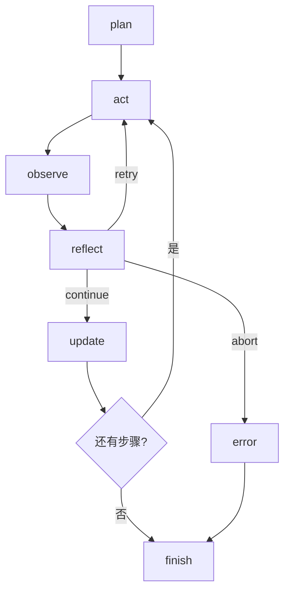

# 《从0到1工业级Agent框架打造》第三章：Engine 循环（反思机制与生产约束）

本章目标：将 Engine 重构为 `asyncio + 协程` 形态，打通可恢复、可限流、可追踪、可测试的生产导向执行闭环。

---

## 目标

1. 实现异步执行链路：`plan -> act -> observe -> reflect -> update -> finish`。
2. 实现恢复一致性（stable step key）与预算控制（step/run 双层时间预算 + max_steps）。
3. 实现并发背压与可注入执行器，避免 Engine 与业务执行器强耦合。
4. 用完整测试验证成功、重试、恢复、超时、背压等关键失败模式。

---

## 前置条件

1. 已完成第二章 Protocol 组件。
2. 已安装 `uv`。

```bash
# Windows (PowerShell)
powershell -ExecutionPolicy ByPass -c "irm https://astral.sh/uv/install.ps1 | iex"

# macOS / Linux
curl -LsSf https://astral.sh/uv/install.sh | sh

uv add --dev pytest
uv sync --dev
```

---

## 先讲“面”：Engine 主流程一眼看懂



主流程解释：  
1. `plan` 只负责产出“要做什么”，不做执行。  
2. `act` 负责执行，`observe` 负责把结果结构化沉淀。  
3. `reflect` 是决策闸门，决定继续、重试、终止。  
4. `update` 才算“步骤提交成功”，这对恢复一致性非常关键。  
5. 任一步骤失败都要落事件并进入 `finish`，不能静默吞掉。  

## 再讲“点”：本章重点解哪些工程难题

1. 恢复一致性：为什么要 `stable step key`，而不是步骤索引。  
2. 预算语义：为什么 `max_steps` 统计 executed 而不是 planned。  
3. 超时控制：为什么 run 预算检查必须进入重试循环。  
4. 扩展性：为什么执行器必须可注入。  
5. 观测成本：为什么 trace 要摘要化而不是全量塞原文。  

---

## 实施步骤

### 第 1 步：创建目录

```bash
mkdir -p framework/labor_agent/core/engine
```

### 第 2 步：写导出文件

文件：[framework/labor_agent/core/engine/__init__.py](framework/labor_agent/core/engine/__init__.py)

```python
"""Engine 组件导出。"""

from .loop import EngineLimits, EngineLoop, PlanStep, ReflectDecision, RunContext, StepOutcome

__all__ = ["EngineLimits", "EngineLoop", "StepOutcome", "ReflectDecision", "RunContext", "PlanStep"]
```

#### 代码讲解

1. 只导出稳定公共接口（`EngineLoop`、`EngineLimits`、`PlanStep` 等），避免外部依赖内部私有实现。
2. 这是“模块边界治理”，不是语法洁癖：业务方只依赖 `core.engine`，后续你把执行器从线程池换成进程池、把事件结构升级，都不会影响调用方 import。
3. 失败模式：如果直接暴露内部函数，后续重构会导致“看似没改 API、实际调用全挂”的隐性破坏。

### 第 2.5 步：先看执行链路图（先理解再写代码）


图解重点：
1. `reflect` 是决策闸门，不是日志节点。  
2. `retry` 回到 `act`，但必须受 `max_retry_per_step` 和 `time_budget` 双约束。  
3. `abort` 不继续推进 `update`，直接记录错误并结束，保证状态一致性。  

### 第 3 步：写 Engine 主循环（完整代码）

文件：[framework/labor_agent/core/engine/loop.py](framework/labor_agent/core/engine/loop.py)

```python
"""Engine(loop) 组件（asyncio 生产导向版）。

核心目标：
1. 主循环异步化：plan -> act -> observe -> reflect -> update -> finish
2. 恢复一致性：stable step key 跳过已完成步骤
3. 预算控制：max_steps / time_budget / step_timeout / retry
4. 可扩展执行：act_executor 可注入；默认执行器支持协程与同步函数
5. 性能语义：共享线程池、并发背压、attempt 指标、trace 输出摘要化
"""

from __future__ import annotations

import asyncio
import hashlib
import inspect
import json
from concurrent.futures import ThreadPoolExecutor
from dataclasses import dataclass
from time import monotonic
from typing import Any, Awaitable, Callable, Literal

from pydantic import BaseModel, Field

from labor_agent.core.protocol import AgentState, ErrorInfo, ExecutionEvent, FinalAnswer


class EngineLimits(BaseModel):
    """执行限制。"""

    max_steps: int = Field(default=8, ge=1, description="最大执行步数（只统计实际执行步）")
    time_budget_ms: int = Field(default=3000, ge=1, description="run 级时间预算（毫秒）")
    step_timeout_ms: int = Field(default=1200, ge=1, description="单步超时（毫秒）")
    max_retry_per_step: int = Field(default=1, ge=0, description="单步最大重试次数")
    executor_max_workers: int = Field(default=8, ge=1, description="共享执行池线程数")
    max_inflight_acts: int = Field(default=32, ge=1, description="同时在途 act 上限（背压）")
    trace_output_preview_chars: int = Field(default=240, ge=32, description="trace 输出预览最大字符数")


class StepOutcome(BaseModel):
    """单步执行结果。"""

    status: Literal["ok", "error"] = Field(..., description="步骤状态")
    output: dict[str, Any] = Field(default_factory=dict, description="步骤输出")
    error: ErrorInfo | None = Field(default=None, description="错误信息")


class ReflectDecision(BaseModel):
    """反思决策结果。"""

    action: Literal["continue", "retry", "abort"] = Field(..., description="反思动作")
    reason: str = Field(default="", description="决策原因")


class RunContext(BaseModel):
    """运行隔离与版本上下文。"""

    tenant_id: str | None = Field(default=None, description="租户 ID（可选）")
    user_id: str | None = Field(default=None, description="用户 ID（可选）")
    config_version: str = Field(default="v1", description="配置版本")
    model_version: str = Field(default="unset", description="模型版本")
    tool_version: str = Field(default="unset", description="工具版本")
    policy_version: str = Field(default="v1", description="策略版本")


class PlanStep(BaseModel):
    """标准化步骤对象。"""

    key: str = Field(..., min_length=1, description="稳定步骤键")
    name: str = Field(..., min_length=1, description="步骤名称")
    payload: dict[str, Any] = Field(default_factory=dict, description="步骤扩展数据")


PlanFn = Callable[[AgentState], list[str | dict[str, Any] | PlanStep]]
ActFn = Callable[[AgentState, PlanStep, int], StepOutcome | Awaitable[StepOutcome]]
ReflectFn = Callable[
    [AgentState, PlanStep, int, StepOutcome], ReflectDecision | Awaitable[ReflectDecision]
]
ActExecutor = Callable[[ActFn, AgentState, PlanStep, int, int], Awaitable[StepOutcome]]


@dataclass
class _RunStats:
    """内部运行统计。"""

    total_planned_steps: int = 0
    executed_steps: int = 0
    success_steps: int = 0
    failed_steps: int = 0
    reflected_retry_count: int = 0
    skipped_steps: int = 0
    attempt_count: int = 0
    stop_reason: str = "finished"


class EngineLoop:
    """生产导向 Engine 循环实现（asyncio）。"""

    def __init__(
        self,
        limits: EngineLimits | None = None,
        now_ms: Callable[[], int] | None = None,
        act_executor: ActExecutor | None = None,
    ) -> None:
        self.limits = limits or EngineLimits()
        self._now_ms = now_ms or (lambda: int(monotonic() * 1000))
        self._executor = ThreadPoolExecutor(max_workers=self.limits.executor_max_workers)
        self._inflight_guard = asyncio.Semaphore(self.limits.max_inflight_acts)
        self._act_executor = act_executor or self._default_act_executor

    def close(self) -> None:
        """释放共享执行池资源。"""

        self._executor.shutdown(wait=False, cancel_futures=True)

    async def arun(
        self,
        state: AgentState,
        plan_fn: PlanFn,
        act_fn: ActFn,
        reflect_fn: ReflectFn | None = None,
        context: RunContext | None = None,
    ) -> AgentState:
        """异步执行一轮完整 loop，并返回更新后的 state。"""

        context = context or RunContext()
        reflect_fn = reflect_fn or self._default_reflect
        started_at = self._now_ms()
        stats = _RunStats()
        plan_steps = self._normalize_plan_steps(plan_fn(state))
        stats.total_planned_steps = len(plan_steps)
        completed_step_keys = self._completed_step_keys(state)

        self._append_event(
            state=state,
            event_type="plan",
            step_id="step_plan",
            payload={
                "plan_steps": [{"key": s.key, "name": s.name} for s in plan_steps],
                "plan_count": len(plan_steps),
                "context": context.model_dump(),
            },
        )

        for idx, step in enumerate(plan_steps, start=1):
            step_id = f"step_{idx}"

            if step.key in completed_step_keys:
                stats.skipped_steps += 1
                self._append_event(
                    state=state,
                    event_type="state_update",
                    step_id=step_id,
                    payload={"phase": "resume_skip", "step_key": step.key, "step_name": step.name, "attempt": 0},
                )
                continue

            stats.executed_steps += 1
            if stats.executed_steps > self.limits.max_steps:
                stats.stop_reason = "max_steps_reached"
                self._append_event(
                    state=state,
                    event_type="error",
                    step_id=step_id,
                    payload={"step_key": step.key, "step_name": step.name, "attempt": 0},
                    error=ErrorInfo(
                        error_code="MAX_STEPS_REACHED",
                        error_message="Engine 达到最大执行步数限制",
                        retryable=False,
                    ),
                )
                break

            attempt = 0
            while True:
                if self._exceed_time_budget(started_at):
                    stats.stop_reason = "time_budget_exceeded"
                    self._append_event(
                        state=state,
                        event_type="error",
                        step_id=step_id,
                        payload={"step_key": step.key, "step_name": step.name, "attempt": attempt},
                        error=ErrorInfo(
                            error_code="TIME_BUDGET_EXCEEDED",
                            error_message="Engine 超出时间预算",
                            retryable=False,
                        ),
                    )
                    break

                stats.attempt_count += 1
                self._append_event(
                    state=state,
                    event_type="state_update",
                    step_id=step_id,
                    payload={"phase": "act_start", "step_key": step.key, "step_name": step.name, "attempt": attempt},
                )

                outcome = await self._act_executor(act_fn, state, step, idx, self.limits.step_timeout_ms)
                summary, out_hash = self._summarize_output(outcome.output)
                self._append_event(
                    state=state,
                    event_type="state_update",
                    step_id=step_id,
                    payload={
                        "phase": "observe",
                        "step_key": step.key,
                        "step_name": step.name,
                        "attempt": attempt,
                        "status": outcome.status,
                        "output_summary": summary,
                        "output_hash": out_hash,
                    },
                )

                decision = await self._maybe_await(reflect_fn(state, step, idx, outcome))
                self._append_event(
                    state=state,
                    event_type="state_update",
                    step_id=step_id,
                    payload={
                        "phase": "reflect",
                        "step_key": step.key,
                        "step_name": step.name,
                        "attempt": attempt,
                        "decision": decision.action,
                        "reason": decision.reason,
                    },
                )

                if outcome.status == "ok" and decision.action == "continue":
                    stats.success_steps += 1
                    self._append_event(
                        state=state,
                        event_type="state_update",
                        step_id=step_id,
                        payload={
                            "phase": "update",
                            "step_key": step.key,
                            "step_name": step.name,
                            "attempt": attempt,
                            "output_summary": summary,
                            "output_hash": out_hash,
                        },
                    )
                    completed_step_keys.add(step.key)
                    break

                if decision.action == "retry" and attempt < self.limits.max_retry_per_step:
                    attempt += 1
                    stats.reflected_retry_count += 1
                    continue

                stats.failed_steps += 1
                stats.stop_reason = "step_failed"
                self._append_event(
                    state=state,
                    event_type="error",
                    step_id=step_id,
                    payload={
                        "step_key": step.key,
                        "step_name": step.name,
                        "attempt": attempt,
                        "output_summary": summary,
                        "output_hash": out_hash,
                    },
                    error=outcome.error
                    or ErrorInfo(error_code="STEP_FAILED", error_message="步骤执行失败", retryable=False),
                )
                break

            if stats.stop_reason in {"time_budget_exceeded", "step_failed"}:
                break

        self._append_event(
            state=state,
            event_type="finish",
            step_id="step_finish",
            payload={
                "context": context.model_dump(),
                "total_planned_steps": stats.total_planned_steps,
                "executed_steps": stats.executed_steps,
                "success_steps": stats.success_steps,
                "failed_steps": stats.failed_steps,
                "reflected_retry_count": stats.reflected_retry_count,
                "skipped_steps": stats.skipped_steps,
                "attempt_count": stats.attempt_count,
                "completed_step_keys": sorted(list(completed_step_keys)),
                "stop_reason": stats.stop_reason,
            },
        )
        state.final_answer = self._build_final_answer(stats, started_at)
        return state

    def run(
        self,
        state: AgentState,
        plan_fn: PlanFn,
        act_fn: ActFn,
        reflect_fn: ReflectFn | None = None,
        context: RunContext | None = None,
    ) -> AgentState:
        """同步包装器。

        注意：
        - 如果调用方已有事件循环，请直接使用 `await arun(...)`。
        """

        try:
            asyncio.get_running_loop()
        except RuntimeError:
            return asyncio.run(self.arun(state, plan_fn, act_fn, reflect_fn, context))
        raise RuntimeError("检测到正在运行的事件循环，请改用 await arun(...)")

    async def _default_act_executor(
        self, act_fn: ActFn, state: AgentState, step: PlanStep, idx: int, timeout_ms: int
    ) -> StepOutcome:
        """默认 act 执行器（共享线程池 + 背压 + asyncio 超时）。"""

        timeout_sec = max(0.001, timeout_ms / 1000.0)
        try:
            await asyncio.wait_for(self._inflight_guard.acquire(), timeout=timeout_sec)
        except asyncio.TimeoutError:
            return StepOutcome(
                status="error",
                output={},
                error=ErrorInfo(
                    error_code="ACT_BACKPRESSURE",
                    error_message="act 执行器达到并发上限",
                    retryable=True,
                ),
            )
        try:
            try:
                if inspect.iscoroutinefunction(act_fn):
                    return await asyncio.wait_for(act_fn(state, step, idx), timeout=timeout_sec)
                loop = asyncio.get_running_loop()
                return await asyncio.wait_for(
                    loop.run_in_executor(self._executor, lambda: act_fn(state, step, idx)),
                    timeout=timeout_sec,
                )
            except asyncio.TimeoutError:
                return StepOutcome(
                    status="error",
                    output={},
                    error=ErrorInfo(
                        error_code="STEP_TIMEOUT",
                        error_message="步骤执行超时",
                        retryable=True,
                    ),
                )
            except Exception as exc:  # noqa: BLE001
                return StepOutcome(
                    status="error",
                    output={},
                    error=ErrorInfo(
                        error_code="ACT_EXECUTOR_EXCEPTION",
                        error_message=f"执行器异常: {exc}",
                        retryable=False,
                    ),
                )
        finally:
            self._inflight_guard.release()

    @staticmethod
    async def _maybe_await(value: ReflectDecision | Awaitable[ReflectDecision]) -> ReflectDecision:
        """兼容同步/异步反思函数。"""

        if inspect.isawaitable(value):
            return await value
        return value

    @staticmethod
    def _default_reflect(_: AgentState, __: PlanStep, ___: int, outcome: StepOutcome) -> ReflectDecision:
        """默认反思策略：成功继续，失败按 retryable 决策。"""

        if outcome.status == "ok":
            return ReflectDecision(action="continue", reason="步骤执行成功")
        if outcome.error and outcome.error.retryable:
            return ReflectDecision(action="retry", reason="错误可重试")
        return ReflectDecision(action="abort", reason="错误不可重试")

    def _append_event(
        self,
        state: AgentState,
        event_type: Literal["plan", "tool_call", "tool_result", "state_update", "finish", "error"],
        step_id: str,
        payload: dict[str, Any],
        error: ErrorInfo | None = None,
    ) -> None:
        """统一写事件，确保 trace 结构一致。"""

        state.events.append(
            ExecutionEvent(
                trace_id=state.trace_id,
                run_id=state.run_id,
                step_id=step_id,
                event_type=event_type,
                payload=payload,
                error=error,
            )
        )

    def _build_final_answer(self, stats: _RunStats, started_at: int) -> FinalAnswer:
        """构造通用最终输出。"""

        status: Literal["success", "partial", "failed"] = "success"
        if stats.failed_steps > 0:
            status = "failed"
        elif stats.stop_reason != "finished":
            status = "partial"

        elapsed_ms = max(1, self._now_ms() - started_at)
        steps_per_second = round((stats.executed_steps / elapsed_ms) * 1000, 3)

        return FinalAnswer(
            status=status,
            summary=f"Engine 执行结束：{stats.stop_reason}",
            output={
                "total_planned_steps": stats.total_planned_steps,
                "executed_steps": stats.executed_steps,
                "success_steps": stats.success_steps,
                "failed_steps": stats.failed_steps,
                "reflected_retry_count": stats.reflected_retry_count,
                "skipped_steps": stats.skipped_steps,
                "attempt_count": stats.attempt_count,
                "stop_reason": stats.stop_reason,
                "elapsed_ms": elapsed_ms,
                "steps_per_second": steps_per_second,
            },
            artifacts=[{"type": "engine_stats", "name": "loop_result"}],
            references=[],
        )

    def _completed_step_keys(self, state: AgentState) -> set[str]:
        """提取历史已完成步骤键（优先读 finish 索引）。"""

        for event in reversed(state.events):
            if event.event_type != "finish":
                continue
            keys = event.payload.get("completed_step_keys")
            if isinstance(keys, list):
                parsed = {k for k in keys if isinstance(k, str) and k}
                if parsed:
                    return parsed

        completed: set[str] = set()
        for event in state.events:
            if event.event_type != "state_update":
                continue
            if event.payload.get("phase") != "update":
                continue
            step_key = event.payload.get("step_key")
            if isinstance(step_key, str) and step_key:
                completed.add(step_key)
        return completed

    def _exceed_time_budget(self, started_at: int) -> bool:
        """检查 run 级时间预算。"""

        return (self._now_ms() - started_at) > self.limits.time_budget_ms

    def _summarize_output(self, output: dict[str, Any]) -> tuple[str, str]:
        """对步骤输出做摘要，控制 trace 体积。"""

        raw = json.dumps(output, ensure_ascii=False, sort_keys=True)
        out_hash = hashlib.sha1(raw.encode("utf-8")).hexdigest()[:16]
        preview = raw[: self.limits.trace_output_preview_chars]
        summary = f"len={len(raw)},preview={preview}"
        return summary, out_hash

    @staticmethod
    def _normalize_plan_steps(raw_steps: list[str | dict[str, Any] | PlanStep]) -> list[PlanStep]:
        """标准化 plan 步骤。"""

        normalized: list[PlanStep] = []
        for item in raw_steps:
            if isinstance(item, PlanStep):
                normalized.append(item)
                continue
            if isinstance(item, str):
                key = EngineLoop._stable_hash({"name": item})
                normalized.append(PlanStep(key=key, name=item, payload={}))
                continue
            step_id = item.get("id") if isinstance(item.get("id"), str) else ""
            step_name = item.get("name") if isinstance(item.get("name"), str) else "unnamed_step"
            payload = item.get("payload") if isinstance(item.get("payload"), dict) else {}
            if not step_id:
                step_id = EngineLoop._stable_hash({"name": step_name, "payload": payload})
            normalized.append(PlanStep(key=step_id, name=step_name, payload=payload))
        return normalized

    @staticmethod
    def _stable_hash(value: dict[str, Any]) -> str:
        """生成稳定哈希，用于步骤键。"""

        raw = json.dumps(value, sort_keys=True, ensure_ascii=False)
        return f"step_{hashlib.sha1(raw.encode('utf-8')).hexdigest()[:12]}"
```

#### 代码讲解（核心设计）

1. 为什么是 `arun()` + `run()` 双入口：  
`arun()` 是主语义，`run()` 只是兼容同步调用的包装器。这样既不牺牲异步吞吐，也不逼现有系统一次性改造为 async。  
替代方案是只保留同步接口，但会让每个 `act` 阻塞主线程，吞吐和尾延迟都会恶化。
2. 为什么引入 `PlanStep.key` 而不是只用 `step_{idx}`：  
恢复执行时，计划可能重排或插入新步骤。索引会漂移，稳定 key 才能正确识别“这个步骤我做过没有”。  
失败模式是重复副作用：例如同一外部 API 被重复调用。
3. 为什么 `max_steps` 统计 `executed_steps`：  
`resume_skip` 只是跳过历史已完成步骤，不代表本轮新执行。把 skip 计入预算会让恢复运行被错误截断。
4. 为什么 run 级 `time_budget` 要在重试循环中检查：  
如果只在 step 开始前检查，某个步骤重试多次会悄悄超预算。循环内检查可把超时变成确定行为，而不是偶然行为。
5. 为什么 `act_executor` 采用可注入接口：  
Engine 只定义“执行协议”，不绑定“执行介质”。同一套 Engine 可以接线程池、进程池、远程沙箱。  
这就是通用框架的扩展性核心，不然每换一个运行时都要改 Engine 核心代码。
6. 为什么默认执行器是“共享线程池 + 信号量背压”：  
共享线程池避免频繁创建/销毁线程；信号量把并发上限变成显式约束，防止流量峰值把下游打挂。  
失败语义由 `ACT_BACKPRESSURE` 显式返回，便于监控与限流策略联动。
7. 为什么 trace 用 `output_summary + output_hash`：  
生产环境下把大输出直接塞进事件会快速放大存储成本与传输成本。摘要+哈希保留排障能力，同时控制体积。
8. 为什么 `_completed_step_keys` 优先读 `finish` 索引：  
扫描全量历史事件是 O(E)，事件一多就拖慢恢复启动。优先读 finish 索引是低成本优化，且不破坏正确性。
9. 错误码设计的工程价值：  
`STEP_TIMEOUT`、`ACT_BACKPRESSURE`、`MAX_STEPS_REACHED`、`TIME_BUDGET_EXCEEDED` 不是“给人看”的字符串，而是给评测和告警系统做聚合统计的结构化信号。

#### 失败链路推演（你在评审时应该重点看）

1. 慢工具场景：`act` 超时 -> `STEP_TIMEOUT` -> reflect 评估是否重试 -> 超过重试上限后 `step_failed` -> `finish`。  
2. 高并发场景：获取信号量超时 -> `ACT_BACKPRESSURE` -> 可重试但仍受 run 级预算约束。  
3. 恢复场景：已有 `completed_step_keys` -> 命中 `resume_skip` -> 不重复执行副作用步骤。  

#### 主流程逐步拆解（从一次真实 run 的时间线理解）

下面用“时间线视角”解释 `arun()` 内部发生了什么，你在排障时就知道该看哪一段事件。

1. 初始化阶段  
`context`、`stats`、`plan_steps`、`completed_step_keys` 在开头就准备好。  
设计动机：把“输入标准化”和“运行统计初始化”前置，避免循环体里出现多处隐式初始化。
2. `plan` 事件落盘  
在真正执行前先写 `plan` 事件（包含步骤列表和上下文版本）。  
设计动机：即便后续第一个步骤就失败，也能在 trace 里复原“本来打算做什么”。
3. 遍历步骤  
每一步先判定是否 `resume_skip`，再判定 `max_steps`，最后进入执行尝试。  
设计动机：先做便宜且确定的判断（跳过/预算）再做昂贵操作（执行器调用）。
4. 单步执行尝试（attempt 循环）  
每次 attempt 都按顺序写：`act_start -> observe -> reflect`。  
设计动机：把同一次尝试的生命周期完整记录，便于定位“到底卡在 act、observe 还是 reflect”。
5. 成功提交与失败终止  
只有 `outcome=ok 且 decision=continue` 才会进入 `update`（真正提交）。  
设计动机：`update` 是提交点（commit point），恢复逻辑只认提交过的步骤。
6. `finish` 收尾  
无论成功、部分成功、失败，都会统一写 `finish` 事件和 `FinalAnswer`。  
设计动机：上层系统总能拿到结构化终态，不需要猜这次运行是否“异常退出”。

#### 关键函数逐块解剖（点到行为，不只点到概念）

1. `_normalize_plan_steps()`  
做了什么：把 `str | dict | PlanStep` 三种输入统一成 `PlanStep`。  
为什么：允许上层快速接入（字符串最省事）与严格接入（显式 id）并存。  
工程建议：生产场景尽量显式传 `id`，避免 fallback hash 受 payload 波动影响。
2. `_completed_step_keys()`  
做了什么：优先从 `finish.payload.completed_step_keys` 读取索引；没有时回扫 `state_update(update)`。  
为什么：兼顾性能（优先 O(1)）与兼容性（老数据仍可回扫）。  
失败模式：如果你把“成功”事件写成别的 phase，恢复将无法正确跳过。
3. `_default_act_executor()`  
做了什么：背压获取信号量 -> 区分异步/同步执行 -> `wait_for` 超时 -> 标准错误码返回。  
为什么：把执行器语义集中在一个地方，避免主循环充满执行细节分支。  
边界：线程超时无法硬中断底层阻塞调用，这是当前版本已知限制。
4. `_append_event()`  
做了什么：统一事件构造入口。  
为什么：防止不同代码路径写出不同格式 payload，破坏后续评测与观测聚合。  
经验：事件写入分散是大规模系统最常见的“可观测性腐化”根源。
5. `_build_final_answer()`  
做了什么：把内部统计映射成外部稳定输出。  
为什么：UI/API 不应依赖内部 `_RunStats`，而应依赖稳定契约 `FinalAnswer`。  
优点：后续你可以升级内部统计字段而不影响上层调用。

#### 状态机视角（把 Engine 看成可验证状态机）

你可以把每一步看成一个小状态机：

1. `Ready`：步骤已选中但未执行。  
2. `Running`：执行器正在跑 `act`。  
3. `Observed`：拿到执行结果并摘要化。  
4. `Reflected`：反思决策已得出。  
5. `Committed`：`update` 事件写入（表示该步骤成功提交）。  
6. `Failed`：错误事件写入并结束该步骤。  

为什么这个视角有用：  
当线上出现“步骤执行了但没生效”的问题时，你可以直接查是否缺少 `Committed(update)`，不用猜业务代码哪里丢了状态。

#### 预算语义深挖（最容易写错的地方）

1. `max_steps` 控制的是“新执行步骤数”，不是“计划总步数”。  
错法：把 skip 也算进去，恢复时会被误判超步数。  
2. `time_budget_ms` 是 run 级预算，必须在 attempt 循环内检查。  
错法：只在 step 开头检查，重试后可能超预算失控。  
3. `step_timeout_ms` 是单次执行上限。  
错法：把它当成 run 上限，导致多步场景误判超时。

#### 并发与性能语义（为什么这版能走向生产）

1. 共享线程池而不是每次创建  
优势：减少线程创建销毁开销，降低 P95 抖动。  
2. 信号量背压  
优势：拥塞时快速失败（`ACT_BACKPRESSURE`），保护下游依赖。  
3. 输出摘要化  
优势：控制 trace 体积，避免日志链路成为瓶颈。  
4. attempt 计数  
优势：可直接衡量“问题是执行失败还是重试过多”，为后续评测提供输入。

#### 你在代码评审时应重点检查的 10 个点

1. 是否存在 `update` 之外的“隐式成功提交”。  
2. `resume_skip` 是否只依据稳定 key。  
3. `max_steps` 是否按 executed 计数。  
4. `time_budget` 是否在 retry 循环中检查。  
5. 执行器错误是否统一映射错误码。  
6. reflect 是否真实参与决策而不是日志装饰。  
7. 事件是否都经由 `_append_event()`。  
8. `finish` 是否在所有分支都可达。  
9. trace 是否只写摘要，避免大对象直灌。  
10. `FinalAnswer` 是否可被上层稳定消费（字段名和语义一致）。

### 第 4 步：写完整测试（完整代码）

文件：[tests/test_engine.py](tests/test_engine.py)

```python
"""Engine(loop) 组件测试（asyncio 生产导向）。"""

from __future__ import annotations

import asyncio
import time

from labor_agent.core.engine import EngineLimits, EngineLoop, PlanStep, ReflectDecision, RunContext, StepOutcome
from labor_agent.core.protocol import AgentState, ErrorInfo, ExecutionEvent, build_initial_state


def test_engine_run_success_flow() -> None:
    """正常流程应输出 success 并产出 finish 事件。"""

    engine = EngineLoop(limits=EngineLimits(max_steps=5, time_budget_ms=5000))
    state = build_initial_state("session_engine_success")

    def plan_fn(_: AgentState) -> list[str]:
        return ["step-a", "step-b"]

    async def act_fn(_: AgentState, step: PlanStep, idx: int) -> StepOutcome:
        return StepOutcome(status="ok", output={"step": step.name, "index": idx})

    updated = asyncio.run(engine.arun(state, plan_fn=plan_fn, act_fn=act_fn))
    assert updated.final_answer is not None
    assert updated.final_answer.status == "success"
    assert updated.final_answer.output["success_steps"] == 2
    assert updated.final_answer.output["attempt_count"] == 2
    assert updated.events[-1].event_type == "finish"


def test_engine_reflect_retry_once_then_success() -> None:
    """可重试错误应触发 reflect 重试并最终成功。"""

    engine = EngineLoop(limits=EngineLimits(max_steps=4, time_budget_ms=5000, max_retry_per_step=1))
    state = build_initial_state("session_engine_retry")
    call_count = {"count": 0}

    def plan_fn(_: AgentState) -> list[dict]:
        return [{"id": "s-a", "name": "step-a"}]

    async def act_fn(_: AgentState, __: PlanStep, ___: int) -> StepOutcome:
        call_count["count"] += 1
        if call_count["count"] == 1:
            return StepOutcome(
                status="error",
                output={},
                error=ErrorInfo(error_code="TEMP_FAIL", error_message="temp", retryable=True),
            )
        return StepOutcome(status="ok", output={"done": True})

    async def reflect_fn(_: AgentState, __: PlanStep, ___: int, outcome: StepOutcome) -> ReflectDecision:
        if outcome.status == "error" and outcome.error and outcome.error.retryable:
            return ReflectDecision(action="retry", reason="临时错误重试")
        return ReflectDecision(action="continue", reason="成功推进")

    updated = asyncio.run(engine.arun(state, plan_fn=plan_fn, act_fn=act_fn, reflect_fn=reflect_fn))
    assert updated.final_answer is not None
    assert updated.final_answer.status == "success"
    assert updated.final_answer.output["reflected_retry_count"] == 1
    assert updated.final_answer.output["attempt_count"] == 2


def test_engine_resume_uses_stable_step_key_not_idx() -> None:
    """plan 重排后仍应根据 stable step key 跳过已完成步骤。"""

    engine = EngineLoop(limits=EngineLimits(max_steps=10, time_budget_ms=5000))
    state = build_initial_state("session_engine_resume")
    state.events.append(
        ExecutionEvent(
            trace_id=state.trace_id,
            run_id=state.run_id,
            step_id="step_old",
            event_type="state_update",
            payload={"phase": "update", "step_key": "s-b", "step_name": "step-b", "output": {"ok": True}},
        )
    )
    called_steps: list[str] = []

    def plan_fn(_: AgentState) -> list[dict]:
        return [
            {"id": "s-x", "name": "step-x"},
            {"id": "s-b", "name": "step-b"},
            {"id": "s-a", "name": "step-a"},
        ]

    async def act_fn(_: AgentState, step: PlanStep, step_idx: int) -> StepOutcome:
        called_steps.append(step.name)
        return StepOutcome(status="ok", output={"step": step.name})

    updated = asyncio.run(engine.arun(state, plan_fn=plan_fn, act_fn=act_fn))
    assert "step-b" not in called_steps
    assert "step-x" in called_steps
    assert "step-a" in called_steps
    assert updated.final_answer is not None
    assert updated.final_answer.output["skipped_steps"] == 1


def test_engine_max_steps_counts_executed_not_skipped() -> None:
    """max_steps 只统计实际执行步骤，不统计 resume_skip。"""

    engine = EngineLoop(limits=EngineLimits(max_steps=1, time_budget_ms=5000))
    state = build_initial_state("session_engine_max_steps")
    state.events.append(
        ExecutionEvent(
            trace_id=state.trace_id,
            run_id=state.run_id,
            step_id="step_old",
            event_type="state_update",
            payload={"phase": "update", "step_key": "s-a", "step_name": "step-a", "output": {"ok": True}},
        )
    )

    def plan_fn(_: AgentState) -> list[dict]:
        return [{"id": "s-a", "name": "step-a"}, {"id": "s-b", "name": "step-b"}]

    async def act_fn(_: AgentState, step: PlanStep, step_idx: int) -> StepOutcome:
        return StepOutcome(status="ok", output={"step": step.name})

    updated = asyncio.run(engine.arun(state, plan_fn=plan_fn, act_fn=act_fn))
    assert updated.final_answer is not None
    assert updated.final_answer.status == "success"
    assert updated.final_answer.output["executed_steps"] == 1
    assert updated.final_answer.output["skipped_steps"] == 1


def test_engine_step_timeout_via_executor() -> None:
    """单步超时应转换为 STEP_TIMEOUT 错误。"""

    engine = EngineLoop(
        limits=EngineLimits(max_steps=2, time_budget_ms=5000, step_timeout_ms=10, max_retry_per_step=0)
    )
    state = build_initial_state("session_engine_timeout")

    def plan_fn(_: AgentState) -> list[dict]:
        return [{"id": "s-a", "name": "slow-step"}]

    async def act_fn(_: AgentState, step: PlanStep, step_idx: int) -> StepOutcome:
        await asyncio.sleep(0.05)
        return StepOutcome(status="ok", output={"late": True})

    updated = asyncio.run(engine.arun(state, plan_fn=plan_fn, act_fn=act_fn))
    assert updated.final_answer is not None
    assert updated.final_answer.status == "failed"
    assert any(e.error and e.error.error_code == "STEP_TIMEOUT" for e in updated.events if e.event_type == "error")


def test_engine_context_fields_recorded_in_events() -> None:
    """隔离上下文与版本信息应写入 plan/finish 事件。"""

    engine = EngineLoop(limits=EngineLimits(max_steps=2, time_budget_ms=5000))
    state = build_initial_state("session_engine_ctx")

    def plan_fn(_: AgentState) -> list[dict]:
        return [{"id": "s-a", "name": "step-a"}]

    async def act_fn(_: AgentState, step: PlanStep, step_idx: int) -> StepOutcome:
        return StepOutcome(status="ok", output={"step": step.name})

    ctx = RunContext(
        tenant_id="tenant-001",
        user_id="user-001",
        config_version="cfg-20260301",
        model_version="model-v1",
        tool_version="tool-v1",
        policy_version="policy-v1",
    )
    updated = asyncio.run(engine.arun(state, plan_fn=plan_fn, act_fn=act_fn, context=ctx))
    assert any(
        e.event_type == "plan" and e.payload.get("context", {}).get("tenant_id") == "tenant-001" for e in updated.events
    )
    assert any(
        e.event_type == "finish" and e.payload.get("context", {}).get("policy_version") == "policy-v1"
        for e in updated.events
    )


def test_engine_backpressure_error_when_inflight_exceeded() -> None:
    """并发门达到上限时应返回 ACT_BACKPRESSURE。"""

    engine = EngineLoop(
        limits=EngineLimits(max_steps=1, time_budget_ms=5000, step_timeout_ms=10, max_retry_per_step=0, max_inflight_acts=1)
    )
    state = build_initial_state("session_engine_backpressure")

    async def scenario() -> AgentState:
        await engine._inflight_guard.acquire()
        try:
            def plan_fn(_: AgentState) -> list[dict]:
                return [{"id": "s-a", "name": "step-a"}]

            async def act_fn(_: AgentState, step: PlanStep, step_idx: int) -> StepOutcome:
                return StepOutcome(status="ok", output={"step": step.name})

            return await engine.arun(state, plan_fn=plan_fn, act_fn=act_fn)
        finally:
            engine._inflight_guard.release()

    updated = asyncio.run(scenario())
    assert updated.final_answer is not None
    assert updated.final_answer.status == "failed"
    assert any(e.error and e.error.error_code == "ACT_BACKPRESSURE" for e in updated.events if e.event_type == "error")

```

#### 代码讲解（测试为什么这样设计）

1. `test_engine_run_success_flow`：验证主链路闭环，确保 `finish` 与统计字段完整落盘。  
2. `test_engine_reflect_retry_once_then_success`：验证 reflect 真正控制重试行为，而不是“写了字段但不生效”。  
3. `test_engine_resume_uses_stable_step_key_not_idx`：防止计划重排导致重复执行，这个测试直接覆盖生产事故高发点。  
4. `test_engine_max_steps_counts_executed_not_skipped`：锁定预算语义，防止恢复场景被 `max_steps` 误杀。  
5. `test_engine_step_timeout_via_executor`：把超时统一映射为错误码，后续 Observability/Evaluator 才能自动统计。  
6. `test_engine_context_fields_recorded_in_events`：保证版本与隔离信息可追踪，便于问题归因和审计。  
7. `test_engine_backpressure_error_when_inflight_exceeded`：验证并发上限是“可执行约束”，不是“文档承诺”。

#### 这组测试的取舍说明

1. 当前是单元级 + 轻集成级测试，优先确保语义正确。  
2. 还没引入压测与混沌测试，这留到 Observability 组件阶段统一补齐。  
3. 测试刻意覆盖“失败路径”，因为生产事故大都发生在失败链路而不是 happy path。  

---

## 运行命令

```bash
UV_CACHE_DIR=.uv-cache uv run pytest tests/test_protocol.py tests/test_engine.py
```

---

## 验证清单

1. Protocol 与 Engine 测试全部通过。
2. Engine 事件中包含 `plan/observe/reflect/update/finish`。
3. 失败场景可观测到标准错误码。
4. 教程中的代码块与仓库文件逐字一致。

---

## 常见问题

### 1. `asyncio` 是否一定比线程快？
不是绝对。I/O 密集 Agent 链路通常更适合协程；CPU 密集任务应下沉到进程池或专用服务。

### 2. 为什么还保留线程池？
为了兼容同步 `act_fn`。很多历史工具 SDK 仍是同步接口，线程池是过渡层。

### 3. `uv run pytest` 报 `program not found`？
先执行 `uv add --dev pytest` 和 `uv sync --dev`。

---

## 环境准备与缺包兜底步骤（可直接复制）

```bash
# 1) 安装 uv（未安装时）
# Windows
powershell -ExecutionPolicy ByPass -c "irm https://astral.sh/uv/install.ps1 | iex"
# macOS / Linux
curl -LsSf https://astral.sh/uv/install.sh | sh

# 2) 安装并同步依赖
uv add --dev pytest
uv sync --dev

# 3) 运行测试
UV_CACHE_DIR=.uv-cache uv run pytest tests/test_protocol.py tests/test_engine.py
```
