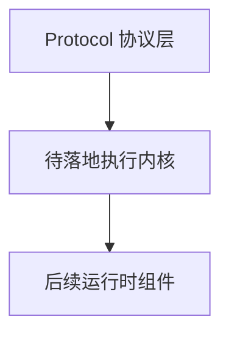
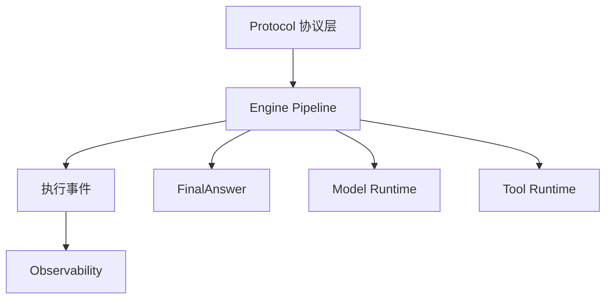
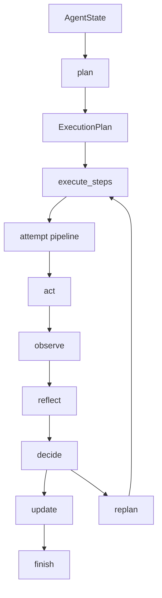
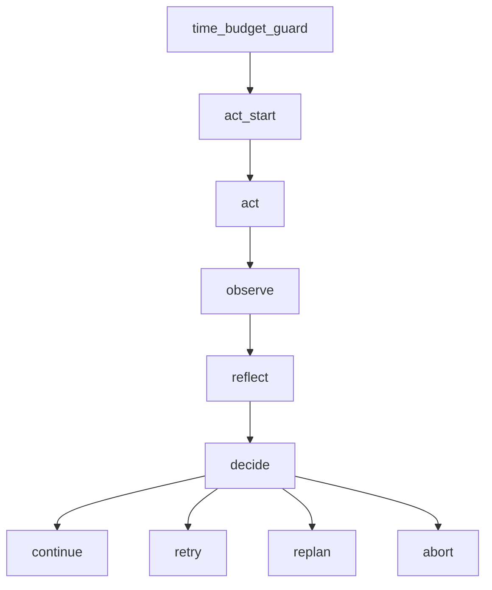

# 《从0到1工业级Agent框架打造》第三章：Engine 循环（反思机制与生产约束）

这一章重新定义 Engine 的目标：不是写一个能跑的 while 循环，而是先落一个真正能承受后续组件接入的执行内核。当前版本的 Engine 已经不是早期那种“plan 一下，然后按顺序调用 act”的最小闭环，而是升级成了带 `pipeline`、正式 `ExecutionPlan`、`replan`、预算控制、事件审计、恢复语义的生产导向内核。

---

## 目标

本章完成后，系统将新增以下能力：

1. 把 Engine 从固定大循环升级为“阶段可插拔”的 `pipeline engine`。
2. 把 `plan` 从低级步骤列表升级为正式 `ExecutionPlan`，支持 `global_task`、`success_criteria`、`constraints`、`risk_level`、`audit`。
3. 打通 `plan -> act -> observe -> reflect -> update -> finish` 六段式主链路，并让 `replan` 成为正式计划修订能力。
4. 用完整单元测试锁住成功链路、失败链路、恢复跳过、超时、背压、计划调度、计划修订与计划治理事件。

**本章在整体架构中的定位：**

1. 它属于核心执行层，是 Protocol 之上的第一层运行时骨架。
2. 它解决的是“协议对象已经有了，但系统还没有真正执行闭环”的缺口。
3. 必须在这个阶段引入，因为后面的 Model Runtime、Tool Runtime、Observability、Context Engineering、Retrieval 都要挂在 Engine 的执行链路上。

---

## 架构位置说明

### 当前系统结构回顾



### 本章新增后的结构



这里要先把边界讲清楚：

1. Engine 依赖谁：只依赖 Protocol 契约对象与 support/logging，不直接依赖 Tool Runtime 或 Model Runtime。
2. 谁依赖 Engine：后续的 Model Runtime、Tool Runtime、Observability 都是 Engine 的下游扩展，不反向塑形 Engine。
3. 依赖方向有没有变：有，系统从“只有对象定义”进入“对象驱动执行”的阶段，但依赖方向仍然保持单向。
4. 有没有循环风险：没有。Engine 提供执行骨架和事件出口，后续组件通过函数注入、hook 或 listener 接入。

这一章最重要的工程判断是：

**Engine 不能被具体运行时实现反向绑死。**

如果 Engine 直接知道“怎么调模型”“怎么调工具”“怎么写 trace”，后面的每一章都会变成在 Engine 里继续塞分支。那种设计能跑，但不叫生产级。

---

## 前置条件

1. 已完成第二章 Protocol 组件。
2. 当前仓库根目录下已经有 `src/`、`tests/`、`docs/`。
3. 本机已安装 Python 3.11+ 与 `uv`。
4. 你至少先跑通过：`tests/unit/test_protocol.py`。

### 环境准备与缺包兜底

先在仓库根目录执行：

```codex
uv sync --dev
uv run --no-sync pytest tests/unit/test_protocol.py -q
```

如果你之前没有同步开发依赖，先执行一次 `uv sync --dev`。如果你的环境里已经有依赖，但不想重新同步，可以直接用：

```codex
uv run --no-sync pytest tests/unit/test_protocol.py -q
```

---

## 名词速览：先把这一章最容易混的词看懂

这一章如果直接读源码，最容易在这些词上卡住。先压缩成人话：

1. `ExecutionPlan`：正式计划对象，不只是“步骤数组”，而是“这轮任务为什么做、要做到什么、受什么约束、现在是什么风险等级”的完整载体。
2. `PlanStep`：计划中的单个执行节点。它不仅有 `name`，还带 `depends_on`、`priority`、超时和重试覆盖。
3. `global_task`：全局任务目标。它解决的是“只剩步骤，没有目标”的问题。
4. `success_criteria`：成功标准。它回答的是“这轮计划做成什么样，才叫真的完成”。
5. `constraints`：执行约束。它回答的是“这轮计划不能做什么、必须遵守什么边界”。
6. `risk_level`：当前计划的风险等级。后续会直接影响策略、观测和审计。
7. `PlanAudit`：计划审计信息。它记录“谁生成了计划、是不是修订过、是哪一步触发了重规划”。
8. `pipeline`：阶段管线。不是一个大 while 把所有逻辑写死，而是把主流程拆成可插拔阶段。
9. `attempt pipeline`：单步尝试管线。处理的是同一个步骤的一次执行尝试，要走 `act -> observe -> reflect -> decide` 这条小链路。
10. `replan`：正式的计划修订动作，不是随手改一下剩余列表。
11. `resume_skip`：恢复时跳过已成功提交的步骤，靠的是稳定步骤键，而不是数组索引。
12. `commit point`：提交点。在这一章里就是 `update` 事件，只有进入 `update`，这一步才算真正完成。

这一章的阅读顺序建议是：

1. 先看主流程图，先理解 Engine 的“面”。
2. 再看 `ExecutionPlan` 和 `PlanStep`，理解计划对象为什么要做厚。
3. 再看 `loop.py`，理解阶段管线怎么落到运行时。
4. 最后看测试，确认这些设计不是自说自话。

---

## 本章主线改动范围

### 代码目录

- `src/agent_forge/components/engine/`
- `src/agent_forge/components/engine/domain/`
- `src/agent_forge/components/engine/application/`

### 测试目录

- `tests/unit/test_engine.py`

### 本章涉及的真实文件

- [src/agent_forge/components/engine/__init__.py](../../src/agent_forge/components/engine/__init__.py)
- [src/agent_forge/components/engine/domain/__init__.py](../../src/agent_forge/components/engine/domain/__init__.py)
- [src/agent_forge/components/engine/domain/schemas.py](../../src/agent_forge/components/engine/domain/schemas.py)
- [src/agent_forge/components/engine/application/__init__.py](../../src/agent_forge/components/engine/application/__init__.py)
- [src/agent_forge/components/engine/application/context.py](../../src/agent_forge/components/engine/application/context.py)
- [src/agent_forge/components/engine/application/helpers.py](../../src/agent_forge/components/engine/application/helpers.py)
- [src/agent_forge/components/engine/application/loop.py](../../src/agent_forge/components/engine/application/loop.py)
- [tests/unit/test_engine.py](../../tests/unit/test_engine.py)

本章只做 Engine，不跨组件偷塞别的能力。

---

# 实施步骤

## 第 1 步：先看主流程视角，知道这一章到底在系统里做了什么

先不要急着创建文件，先把主流程看清楚。

### 1.1 整个 Engine 主链路



### 1.2 单步 attempt 链路



### 代码讲解

这一节虽然还没上代码，但你必须先建立一个判断：

1. Engine 解决的是“执行协调”，不是“具体能力实现”。
2. `plan` 只决定做什么，不决定怎么调模型或工具。
3. `reflect` 是强制阶段，不是锦上添花。生产系统里，没有 `reflect`，就没有可重试、可中止、可重规划。
4. `replan` 要做成正式动作，不然系统一旦遇到“计划本身错了”的场景，就只能失败退出。

成功链路例子：

1. 计划先产出 3 个步骤。
2. 第一步成功，直接 `continue`。
3. 第二步失败，但 `reflect` 判断应该换计划。
4. `replan` 替换剩余步骤，最终任务仍然成功完成。

失败链路例子：

1. 计划里存在缺失依赖。
2. Engine 在 `plan` 阶段就明确报 `PLAN_INVALID`。
3. 它不会把非法计划带进执行阶段，更不会等到某一步跑崩才补锅。

工程取舍：

1. 我们没有直接上 DAG 工作流引擎，因为当前章节目标是“生产导向最小骨架”，不是一次把复杂度拉满。
2. 但也没有停留在“固定 while + if/else”那种最低级 loop，因为那种结构一旦接 Tool Runtime、Observability、Context Engineering，很快会塌。

---

## 第 2 步：创建包与导出骨架

先把包结构立起来，让后面的 `domain` 和 `application` 有明确边界。

```codex
New-Item -ItemType Directory -Force "src\\agent_forge\\components\\engine\\domain" | Out-Null
New-Item -ItemType Directory -Force "src\\agent_forge\\components\\engine\\application" | Out-Null
New-Item -ItemType File -Force "src\\agent_forge\\components\\engine\\__init__.py" | Out-Null
New-Item -ItemType File -Force "src\\agent_forge\\components\\engine\\domain\\__init__.py" | Out-Null
New-Item -ItemType File -Force "src\\agent_forge\\components\\engine\\application\\__init__.py" | Out-Null
```

文件：[src/agent_forge/components/engine/__init__.py](../../src/agent_forge/components/engine/__init__.py)

```python
"""Engine component exports."""

from agent_forge.components.engine.application import EngineLoop, EnginePipelineContext, EngineStage
from agent_forge.components.engine.domain import (
    EngineLimits,
    ExecutionPlan,
    PlanAudit,
    PlanStep,
    ReflectDecision,
    RunContext,
    StepOutcome,
)

__all__ = [
    "EngineLimits",
    "EngineLoop",
    "EnginePipelineContext",
    "EngineStage",
    "ExecutionPlan",
    "PlanAudit",
    "StepOutcome",
    "ReflectDecision",
    "RunContext",
    "PlanStep",
]
```

```codex
New-Item -ItemType File -Force "src\\agent_forge\\components\\engine\\domain\\__init__.py" | Out-Null
```

文件：[src/agent_forge/components/engine/domain/__init__.py](../../src/agent_forge/components/engine/domain/__init__.py)

```python
"""Engine 领域层导出。"""

from .schemas import (
    ActExecutor,
    ActFn,
    EngineEventListener,
    EngineLimits,
    ExecutionPlan,
    PlanAudit,
    PlanFn,
    PlanInput,
    PlanStep,
    ReflectDecision,
    ReflectFn,
    RunContext,
    StepOutcome,
)

__all__ = [
    "ActExecutor",
    "ActFn",
    "EngineEventListener",
    "EngineLimits",
    "ExecutionPlan",
    "PlanAudit",
    "PlanFn",
    "PlanInput",
    "PlanStep",
    "ReflectDecision",
    "ReflectFn",
    "RunContext",
    "StepOutcome",
]
```

```codex
New-Item -ItemType File -Force "src\\agent_forge\\components\\engine\\application\\__init__.py" | Out-Null
```

文件：[src/agent_forge/components/engine/application/__init__.py](../../src/agent_forge/components/engine/application/__init__.py)

```python
"""Engine application exports."""

from agent_forge.components.engine.domain import (
    EngineLimits,
    ExecutionPlan,
    PlanAudit,
    PlanStep,
    ReflectDecision,
    RunContext,
    StepOutcome,
)

from .context import EnginePipelineContext, EngineStage
from .loop import EngineLoop

__all__ = [
    "EngineLimits",
    "EngineLoop",
    "EnginePipelineContext",
    "EngineStage",
    "ExecutionPlan",
    "PlanAudit",
    "StepOutcome",
    "ReflectDecision",
    "RunContext",
    "PlanStep",
]
```

### 代码讲解

导出层的作用不是“少打一层 import”，而是把公开边界稳定下来：

1. 外部应该依赖 `agent_forge.components.engine`，而不是深入内部子模块。
2. 未来内部结构继续拆分时，外部调用点尽量不跟着一起震动。
3. `domain` 负责定义“是什么”，`application` 负责定义“怎么跑”。

---

## 第 3 步：定义领域模型，把 plan 从步骤列表升级成正式计划对象

```codex
New-Item -ItemType File -Force "src\\agent_forge\\components\\engine\\domain\\schemas.py" | Out-Null
```

文件：[src/agent_forge/components/engine/domain/schemas.py](../../src/agent_forge/components/engine/domain/schemas.py)

```python
"""Engine 领域类型定义。"""

from __future__ import annotations

from typing import Any, Awaitable, Callable, Literal
from uuid import uuid4

from pydantic import BaseModel, Field

from agent_forge.components.protocol import AgentState, ErrorInfo, ExecutionEvent


class EngineLimits(BaseModel):
    """执行限制配置。

    Args:
        max_steps: 最大执行步数，只统计真实执行步骤。
        time_budget_ms: 整次 run 的总时间预算。
        step_timeout_ms: 单次步骤执行超时。
        max_retry_per_step: 单步最大重试次数。
        executor_max_workers: 共享执行池最大线程数。
        max_inflight_acts: 同时在途 act 数量上限。
        trace_output_preview_chars: trace 输出预览最大字符数。

    Returns:
        EngineLimits: 校验后的执行限制对象。
    """

    max_steps: int = Field(default=8, ge=1, description="最大执行步数（只统计实际执行步）")
    time_budget_ms: int = Field(default=3000, ge=1, description="run 级时间预算（毫秒）")
    step_timeout_ms: int = Field(default=1200, ge=1, description="单步超时（毫秒）")
    max_retry_per_step: int = Field(default=1, ge=0, description="单步最大重试次数")
    max_replans: int = Field(default=2, ge=0, description="单次 run 允许的最大重规划次数")
    executor_max_workers: int = Field(default=8, ge=1, description="共享执行池线程数")
    max_inflight_acts: int = Field(default=32, ge=1, description="同时在途 act 上限（背压）")
    trace_output_preview_chars: int = Field(default=240, ge=32, description="trace 输出预览最大字符数")


class StepOutcome(BaseModel):
    """单步执行结果。

    Args:
        status: 步骤状态。
        output: 步骤输出。
        error: 错误信息。

    Returns:
        StepOutcome: 标准化后的步骤结果。
    """

    status: Literal["ok", "error"] = Field(..., description="步骤状态")
    output: dict[str, Any] = Field(default_factory=dict, description="步骤输出")
    error: ErrorInfo | None = Field(default=None, description="错误信息")


class ReflectDecision(BaseModel):
    """反思决策结果。

    Args:
        action: 反思动作。
        reason: 决策原因。
        replacement_plan: 当动作是 replan 时提供的新计划。
        plan_update_mode: 重规划时如何处理剩余步骤。

    Returns:
        ReflectDecision: 标准化决策对象。
    """

    action: Literal["continue", "retry", "abort", "replan"] = Field(..., description="反思动作")
    reason: str = Field(default="", description="决策原因")
    replacement_plan: ExecutionPlan | None = Field(default=None, description="重规划后的替换计划")
    plan_update_mode: Literal["replace_remaining", "append_remaining"] = Field(
        default="replace_remaining", description="重规划更新模式"
    )


class RunContext(BaseModel):
    """运行隔离与版本上下文。

    Args:
        tenant_id: 租户 ID。
        user_id: 用户 ID。
        config_version: 配置版本。
        model_version: 模型版本。
        tool_version: 工具版本。
        policy_version: 策略版本。

    Returns:
        RunContext: 校验后的运行上下文。
    """

    tenant_id: str | None = Field(default=None, description="租户 ID（可选）")
    user_id: str | None = Field(default=None, description="用户 ID（可选）")
    config_version: str = Field(default="v1", description="配置版本")
    model_version: str = Field(default="unset", description="模型版本")
    tool_version: str = Field(default="unset", description="工具版本")
    policy_version: str = Field(default="v1", description="策略版本")


class PlanStep(BaseModel):
    """标准化步骤对象。

    Args:
        key: 稳定步骤键。
        name: 步骤名称。
        kind: 步骤类型，用于区分检索、工具、生成等执行意图。
        payload: 步骤扩展数据。
        depends_on: 依赖步骤键列表。
        priority: 执行优先级，数值越小优先级越高。
        timeout_ms: 当前步骤的超时覆盖值。
        max_retry_per_step: 当前步骤的重试覆盖值。
        metadata: 步骤元数据。

    Returns:
        PlanStep: 标准化后的步骤对象。
    """

    key: str = Field(..., min_length=1, description="稳定步骤键")
    name: str = Field(..., min_length=1, description="步骤名称")
    kind: str = Field(default="generic", min_length=1, description="步骤类型")
    payload: dict[str, Any] = Field(default_factory=dict, description="步骤扩展数据")
    depends_on: list[str] = Field(default_factory=list, description="依赖步骤键")
    priority: int = Field(default=100, description="步骤优先级")
    timeout_ms: int | None = Field(default=None, ge=1, description="步骤级超时覆盖")
    max_retry_per_step: int | None = Field(default=None, ge=0, description="步骤级重试覆盖")
    metadata: dict[str, Any] = Field(default_factory=dict, description="步骤元数据")


class PlanAudit(BaseModel):
    """计划审计信息。
    Args:
        created_by: 计划创建来源，例如 planner、human、policy。
        previous_revision: 上一个计划修订号。
        triggered_by_step_key: 触发重规划的步骤键。
        triggered_by_step_name: 触发重规划的步骤名称。
        change_summary: 本次计划生成或修订摘要。
    Returns:
        PlanAudit: 标准化后的计划审计对象。
    """

    created_by: str = Field(default="planner", description="计划创建来源")
    previous_revision: int | None = Field(default=None, ge=1, description="上一个计划修订号")
    triggered_by_step_key: str = Field(default="", description="触发计划变化的步骤键")
    triggered_by_step_name: str = Field(default="", description="触发计划变化的步骤名称")
    change_summary: str = Field(default="", description="本次计划变化摘要")


class ExecutionPlan(BaseModel):
    """标准化执行计划对象。

    Args:
        plan_id: 计划唯一 ID。
        revision: 计划修订号。
        origin: 计划来源，例如 initial、replan、human_patch。
        reason: 本次计划生成或修订原因。
        global_task: 本轮计划服务的全局任务。
        steps: 标准化步骤列表。
        metadata: 计划元数据。

    Returns:
        ExecutionPlan: 标准化执行计划。
    """

    plan_id: str = Field(default_factory=lambda: f"plan_{uuid4().hex}", min_length=1, description="计划 ID")
    revision: int = Field(default=1, ge=1, description="计划修订号")
    origin: str = Field(default="initial", min_length=1, description="计划来源")
    reason: str = Field(default="", description="计划生成原因")
    global_task: str = Field(default="", description="全局任务目标")
    success_criteria: list[str] = Field(default_factory=list, description="计划成功判定标准")
    constraints: list[str] = Field(default_factory=list, description="计划执行约束")
    risk_level: Literal["low", "medium", "high", "critical"] = Field(default="medium", description="计划风险等级")
    audit: PlanAudit = Field(default_factory=PlanAudit, description="计划审计信息")
    steps: list[PlanStep] = Field(default_factory=list, description="标准化步骤列表")
    metadata: dict[str, Any] = Field(default_factory=dict, description="计划元数据")


PlanInput = list[str | dict[str, Any] | PlanStep] | ExecutionPlan
PlanFn = Callable[[AgentState], PlanInput]
ActFn = Callable[[AgentState, PlanStep, int], StepOutcome | Awaitable[StepOutcome]]
ReflectFn = Callable[
    [AgentState, PlanStep, int, StepOutcome], ReflectDecision | Awaitable[ReflectDecision]
]
ActExecutor = Callable[[ActFn, AgentState, PlanStep, int, int], Awaitable[StepOutcome]]
EngineEventListener = Callable[[ExecutionEvent], None]
```

### 代码讲解

这里要分 4 层看：

1. `EngineLimits` 负责运行限制。
2. `PlanStep`、`StepOutcome`、`ReflectDecision` 负责步骤、结果和决策。
3. `PlanAudit` 负责计划审计。
4. `ExecutionPlan` 负责正式计划对象。

这一章真正的升级点不是 `asyncio`，而是 `ExecutionPlan` 已经不再是“步骤列表”，而是同时承载：

1. 计划身份：`plan_id`、`revision`、`origin`
2. 任务语义：`global_task`
3. 治理语义：`success_criteria`、`constraints`、`risk_level`
4. 审计语义：`audit`
5. 执行主体：`steps`
6. 扩展位：`metadata`

成功链路例子：

1. 计划对象给出全局任务和成功标准。
2. Engine 把这些字段写进 `plan`、`replan`、`finish` 事件。
3. 后续 Observability、Evaluator 才有稳定输入可读。

失败链路例子：

如果这里继续用 `list[str]` 承载计划，会立刻遇到：

1. 重规划后不知道是不是同一轮任务。
2. 回放时看不到计划修订链。
3. 风险等级和执行约束无处可放。

---

## 第 4 步：定义 pipeline 共享上下文，把运行态从 loop.py 里剥出来

```codex
New-Item -ItemType File -Force "src\\agent_forge\\components\\engine\\application\\context.py" | Out-Null
```

文件：[src/agent_forge/components/engine/application/context.py](../../src/agent_forge/components/engine/application/context.py)

```python
"""Engine pipeline 上下文与阶段定义。"""

from __future__ import annotations

from dataclasses import dataclass, field
from typing import Any, Awaitable, Callable, Literal

from agent_forge.components.engine.domain.schemas import (
    ActFn,
    EngineLimits,
    ExecutionPlan,
    PlanFn,
    PlanStep,
    ReflectDecision,
    ReflectFn,
    RunContext,
    StepOutcome,
)
from agent_forge.components.protocol import AgentState, ErrorInfo


@dataclass(slots=True)
class RunStats:
    """运行统计聚合对象。

    Returns:
        RunStats: 当前 run 的累计统计信息。
    """

    total_planned_steps: int = 0
    executed_steps: int = 0
    success_steps: int = 0
    failed_steps: int = 0
    reflected_retry_count: int = 0
    skipped_steps: int = 0
    attempt_count: int = 0
    replan_count: int = 0
    stop_reason: str = "finished"


StageHandler = Callable[["EnginePipelineContext"], None | Awaitable[None]]
StageCustomizer = Callable[[list["EngineStage"]], list["EngineStage"]]


@dataclass(slots=True)
class EngineStage:
    """可插拔阶段定义。

    Args:
        name: 阶段名称。
        handler: 阶段处理函数。

    Returns:
        EngineStage: 单个可插拔阶段对象。
    """

    name: str
    handler: StageHandler


@dataclass(slots=True)
class EnginePipelineContext:
    """Engine pipeline 共享上下文。

    Args:
        state: 当前运行状态。
        run_context: 运行隔离与版本信息。
        plan_fn: 计划函数。
        act_fn: 执行函数。
        reflect_fn: 反思函数。
        started_at_ms: 启动时间戳。
        stats: 运行统计。
        event_writer: 统一事件写入函数。
        limits: Engine 限制配置。

    Returns:
        EnginePipelineContext: 供各阶段共享的上下文。
    """

    state: AgentState
    run_context: RunContext
    plan_fn: PlanFn
    act_fn: ActFn
    reflect_fn: ReflectFn
    started_at_ms: int
    stats: RunStats
    event_writer: Callable[
        [
            AgentState,
            Literal["plan", "tool_call", "tool_result", "state_update", "finish", "error"],
            str,
            dict[str, Any],
            ErrorInfo | None,
        ],
        None,
    ]
    limits: EngineLimits
    current_plan: ExecutionPlan | None = None
    plan_steps: list[PlanStep] = field(default_factory=list)
    completed_step_keys: set[str] = field(default_factory=set)
    current_step: PlanStep | None = None
    current_step_index: int = 0
    current_step_id: str = ""
    current_attempt: int = 0
    current_outcome: StepOutcome | None = None
    current_decision: ReflectDecision | None = None
    current_output_summary: str = ""
    current_output_hash: str = ""
    stop_requested: bool = False
    finish_emitted: bool = False
    retry_requested: bool = False
    replan_requested: bool = False
    step_completed: bool = False
    step_terminal: bool = False

    def append_event(
        self,
        event_type: Literal["plan", "tool_call", "tool_result", "state_update", "finish", "error"],
        step_id: str,
        payload: dict[str, Any],
        error: ErrorInfo | None = None,
    ) -> None:
        """通过统一入口写事件。

        Args:
            event_type: 事件类型。
            step_id: 步骤 ID。
            payload: 事件载荷。
            error: 错误对象。

        Returns:
            None
        """

        self.event_writer(self.state, event_type, step_id, payload, error)

    def request_stop(self, reason: str) -> None:
        """请求终止本轮运行。

        Args:
            reason: 停止原因。

        Returns:
            None
        """

        self.stats.stop_reason = reason
        self.stop_requested = True

    def prepare_step(self, step: PlanStep, step_index: int) -> None:
        """切换当前步骤。

        Args:
            step: 当前步骤。
            step_index: 步骤序号。

        Returns:
            None
        """

        self.current_step = step
        self.current_step_index = step_index
        self.current_step_id = f"step_{step_index}"

    def apply_plan(self, plan: ExecutionPlan) -> None:
        """将标准化计划写入上下文。

        Args:
            plan: 标准化执行计划。

        Returns:
            None
        """

        self.current_plan = plan
        self.plan_steps = list(plan.steps)
        self.stats.total_planned_steps = len(plan.steps)

    def replace_plan_steps(self, steps: list[PlanStep]) -> None:
        """同步替换当前运行计划中的全部步骤。
        Args:
            steps: 新的标准化步骤列表。
        Returns:
            None
        """

        normalized_steps = list(steps)
        if self.current_plan is None:
            self.current_plan = ExecutionPlan(steps=normalized_steps)
        else:
            self.current_plan = self.current_plan.model_copy(update={"steps": normalized_steps})
        self.plan_steps = normalized_steps
        self.stats.total_planned_steps = len(normalized_steps)

    def append_plan_steps(self, steps: list[PlanStep]) -> None:
        """向当前运行计划尾部追加步骤，并保持计划对象同步。
        Args:
            steps: 要追加的标准化步骤列表。
        Returns:
            None
        """

        if not steps:
            return
        self.replace_plan_steps([*self.plan_steps, *steps])

    def prepare_attempt(self, attempt: int) -> None:
        """重置当前尝试态。

        Args:
            attempt: 当前尝试序号。

        Returns:
            None
        """

        self.current_attempt = attempt
        self.current_outcome = None
        self.current_decision = None
        self.current_output_summary = ""
        self.current_output_hash = ""
        self.retry_requested = False
        self.replan_requested = False
        self.step_completed = False
        self.step_terminal = False

    def current_step_key(self) -> str:
        """返回当前步骤键。

        Returns:
            str: 当前步骤键；若无步骤则返回空字符串。
        """

        return self.current_step.key if self.current_step is not None else ""

    def current_step_name(self) -> str:
        """返回当前步骤名称。

        Returns:
            str: 当前步骤名称；若无步骤则返回空字符串。
        """

        return self.current_step.name if self.current_step is not None else ""
```

### 代码讲解

`context.py` 解决两个关键问题：

1. 把运行态从 `loop.py` 剥出来。
2. 给可插拔阶段一个稳定、受控的共享上下文。

最关键的不是字段多，而是它把计划变更收口成了方法：

1. `apply_plan(...)`
2. `replace_plan_steps(...)`
3. `append_plan_steps(...)`

这一步是上一轮质检之后专门补的，因为如果允许扩展阶段直接改 `plan_steps`，`current_plan` 和真实运行队列就可能失同步。

---

## 第 5 步：补 helper，把计划标准化、调度、重规划规则从 loop.py 分出去

```codex
New-Item -ItemType File -Force "src\\agent_forge\\components\\engine\\application\\helpers.py" | Out-Null
```

文件：[src/agent_forge/components/engine/application/helpers.py](../../src/agent_forge/components/engine/application/helpers.py)

```python
"""Engine 运行辅助函数。"""

from __future__ import annotations

import hashlib
import json
from time import monotonic
from typing import Any, Literal

from agent_forge.components.engine.application.context import RunStats
from agent_forge.components.engine.domain.schemas import EngineLimits, ExecutionPlan, PlanAudit, PlanInput, PlanStep
from agent_forge.components.protocol import AgentState, FinalAnswer


def default_now_ms() -> int:
    """返回当前毫秒时间戳。

    Returns:
        int: 当前单调时钟毫秒值。
    """

    return int(monotonic() * 1000)


def build_final_answer(stats: RunStats, started_at: int, now_ms: int) -> FinalAnswer:
    """构造通用最终输出。

    Args:
        stats: 运行统计。
        started_at: 启动时间戳。
        now_ms: 当前时间戳。

    Returns:
        FinalAnswer: 面向上层稳定暴露的最终结果。
    """

    status: Literal["success", "partial", "failed"] = "success"
    if stats.failed_steps > 0:
        status = "failed"
    elif stats.stop_reason != "finished":
        status = "partial"

    elapsed_ms = max(1, now_ms - started_at)
    steps_per_second = round((stats.executed_steps / elapsed_ms) * 1000, 3)

    return FinalAnswer(
        status=status,
        summary=f"Engine 执行结束：{stats.stop_reason}",
        output={
            "total_planned_steps": stats.total_planned_steps,
            "executed_steps": stats.executed_steps,
            "success_steps": stats.success_steps,
            "failed_steps": stats.failed_steps,
            "reflected_retry_count": stats.reflected_retry_count,
            "replan_count": stats.replan_count,
            "skipped_steps": stats.skipped_steps,
            "attempt_count": stats.attempt_count,
            "stop_reason": stats.stop_reason,
            "elapsed_ms": elapsed_ms,
            "steps_per_second": steps_per_second,
        },
        artifacts=[{"type": "engine_stats", "name": "loop_result"}],
        references=[],
    )


def completed_step_keys(state: AgentState) -> set[str]:
    """提取历史已完成步骤键。

    Args:
        state: 运行状态。

    Returns:
        set[str]: 已完成步骤键集合。
    """

    for event in reversed(state.events):
        if event.event_type != "finish":
            continue
        keys = event.payload.get("completed_step_keys")
        if isinstance(keys, list):
            parsed = {item for item in keys if isinstance(item, str) and item}
            if parsed:
                return parsed

    completed: set[str] = set()
    for event in state.events:
        if event.event_type != "state_update":
            continue
        if event.payload.get("phase") != "update":
            continue
        step_key = event.payload.get("step_key")
        if isinstance(step_key, str) and step_key:
            completed.add(step_key)
    return completed


def exceed_time_budget(started_at: int, time_budget_ms: int, now_ms: int) -> bool:
    """检查 run 级时间预算。

    Args:
        started_at: 启动时间。
        time_budget_ms: 总预算毫秒。
        now_ms: 当前时间。

    Returns:
        bool: 是否已超预算。
    """

    return (now_ms - started_at) > time_budget_ms


def summarize_output(output: dict[str, Any], limits: EngineLimits) -> tuple[str, str]:
    """对步骤输出做摘要。

    Args:
        output: 步骤输出。
        limits: Engine 限制配置。

    Returns:
        tuple[str, str]: 输出摘要与输出哈希。
    """

    raw = json.dumps(output, ensure_ascii=False, sort_keys=True)
    output_hash = hashlib.sha1(raw.encode("utf-8")).hexdigest()[:16]
    preview = raw[: limits.trace_output_preview_chars]
    summary = f"len={len(raw)},preview={preview}"
    return summary, output_hash


def normalize_execution_plan(raw_plan: PlanInput) -> ExecutionPlan:
    """标准化执行计划。

    Args:
        raw_plan: 原始计划输入。

    Returns:
        ExecutionPlan: 标准化后的执行计划对象。
    """

    normalized: list[PlanStep] = []
    if isinstance(raw_plan, ExecutionPlan):
        if not raw_plan.steps:
            return raw_plan.model_copy(update={"steps": []})
        for step in raw_plan.steps:
            normalized.append(_normalize_step(step))
        return raw_plan.model_copy(update={"steps": normalized})

    for item in raw_plan:
        if isinstance(item, PlanStep):
            normalized.append(_normalize_step(item))
            continue
        if isinstance(item, str):
            key = stable_hash({"name": item})
            normalized.append(PlanStep(key=key, name=item, payload={}))
            continue
        step_id = item.get("id") if isinstance(item.get("id"), str) else ""
        step_name = item.get("name") if isinstance(item.get("name"), str) else "unnamed_step"
        payload = item.get("payload") if isinstance(item.get("payload"), dict) else {}
        if not step_id:
            step_id = stable_hash({"name": step_name, "payload": payload})
        normalized.append(
            PlanStep(
                key=step_id,
                name=step_name,
                kind=item.get("kind") if isinstance(item.get("kind"), str) and item.get("kind") else "generic",
                payload=payload,
                depends_on=item.get("depends_on") if isinstance(item.get("depends_on"), list) else [],
                priority=item.get("priority") if isinstance(item.get("priority"), int) else 100,
                timeout_ms=item.get("timeout_ms") if isinstance(item.get("timeout_ms"), int) else None,
                max_retry_per_step=item.get("max_retry_per_step")
                if isinstance(item.get("max_retry_per_step"), int)
                else None,
                metadata=item.get("metadata") if isinstance(item.get("metadata"), dict) else {},
            )
        )

    return ExecutionPlan(steps=normalized)


def build_replanned_plan(
    current_plan: ExecutionPlan | None,
    replacement_plan: ExecutionPlan,
    reason: str,
    trigger_step: PlanStep | None = None,
) -> ExecutionPlan:
    """构建重规划后的标准计划。

    Args:
        current_plan: 当前运行中的计划。
        replacement_plan: reflect 返回的新计划。
        reason: 本次重规划原因。

    Returns:
        ExecutionPlan: 修订后的计划对象。
    """

    replacement_fields = set(replacement_plan.model_fields_set)
    replacement_audit_fields = set(replacement_plan.audit.model_fields_set) if "audit" in replacement_fields else set()
    normalized = normalize_execution_plan(replacement_plan)
    base_plan = current_plan or ExecutionPlan()
    next_revision = normalized.revision if normalized.revision > base_plan.revision else base_plan.revision + 1
    next_risk_level = normalized.risk_level if "risk_level" in replacement_fields else base_plan.risk_level
    next_created_by = normalized.audit.created_by if "created_by" in replacement_audit_fields else base_plan.audit.created_by
    next_change_summary = (
        normalized.audit.change_summary
        if "change_summary" in replacement_audit_fields
        else normalized.reason or reason
    )
    return normalized.model_copy(
        update={
            "plan_id": base_plan.plan_id,
            "revision": next_revision,
            "origin": normalized.origin if normalized.origin != "initial" else "replan",
            "reason": normalized.reason or reason,
            "global_task": normalized.global_task or base_plan.global_task,
            "success_criteria": normalized.success_criteria or list(base_plan.success_criteria),
            "constraints": normalized.constraints or list(base_plan.constraints),
            "risk_level": next_risk_level,
            "audit": PlanAudit(
                created_by=next_created_by,
                previous_revision=base_plan.revision,
                triggered_by_step_key=trigger_step.key if trigger_step is not None else "",
                triggered_by_step_name=trigger_step.name if trigger_step is not None else "",
                change_summary=next_change_summary,
            ),
            "metadata": {**base_plan.metadata, **normalized.metadata},
        }
    )


def schedule_execution_plan(plan: ExecutionPlan, completed_keys: set[str] | None = None) -> ExecutionPlan:
    """按依赖与优先级收口执行顺序。
    Args:
        plan: 原始标准化计划对象。
        completed_keys: 已完成步骤键集合，用于满足外部依赖。
    Returns:
        ExecutionPlan: 调度后的计划对象。
    Raises:
        ValueError: 依赖缺失或存在循环依赖时抛出。
    """

    completed = completed_keys or set()
    steps = list(plan.steps)
    if not steps:
        return plan.model_copy(update={"steps": []})

    step_by_key = {step.key: step for step in steps}
    missing_dependencies: list[str] = []
    for step in steps:
        for dependency in step.depends_on:
            if dependency in completed:
                continue
            if dependency not in step_by_key:
                missing_dependencies.append(f"{step.key}->{dependency}")
    if missing_dependencies:
        missing = ", ".join(sorted(missing_dependencies))
        raise ValueError(f"plan contains missing dependencies: {missing}")

    original_order = {step.key: index for index, step in enumerate(steps)}
    satisfied = set(completed)
    remaining = {step.key: step for step in steps}
    scheduled: list[PlanStep] = []

    while remaining:
        ready = [
            step
            for step in remaining.values()
            if all(dependency in satisfied for dependency in step.depends_on)
        ]
        if not ready:
            cycle_nodes = ", ".join(sorted(remaining.keys()))
            raise ValueError(f"plan contains cyclic dependencies: {cycle_nodes}")

        ready.sort(key=lambda step: (step.priority, original_order[step.key]))
        selected = ready[0]
        scheduled.append(selected)
        satisfied.add(selected.key)
        remaining.pop(selected.key)

    return plan.model_copy(update={"steps": scheduled})


def normalize_plan_steps(raw_plan: PlanInput) -> list[PlanStep]:
    """向后兼容的步骤标准化入口。

    Args:
        raw_plan: 原始计划输入。

    Returns:
        list[PlanStep]: 标准化后的步骤列表。
    """

    return normalize_execution_plan(raw_plan).steps


def _normalize_step(step: PlanStep) -> PlanStep:
    """收口单个步骤对象。

    Args:
        step: 原始步骤对象。

    Returns:
        PlanStep: 规范化后的步骤对象。
    """

    return step.model_copy(
        update={
            "kind": step.kind or "generic",
            "depends_on": list(step.depends_on),
            "payload": dict(step.payload),
            "metadata": dict(step.metadata),
        }
    )


def stable_hash(value: dict[str, Any]) -> str:
    """生成稳定哈希。

    Args:
        value: 待哈希对象。

    Returns:
        str: 稳定步骤键。
    """

    raw = json.dumps(value, sort_keys=True, ensure_ascii=False)
    return f"step_{hashlib.sha1(raw.encode('utf-8')).hexdigest()[:12]}"
```

### 代码讲解

这一段 helper 代码最重要的是 4 件事：

1. `normalize_execution_plan(...)`：把旧输入和新输入统一收口成正式计划对象。
2. `schedule_execution_plan(...)`：让 `depends_on` 和 `priority` 真正进入调度语义。
3. `build_replanned_plan(...)`：让 `replan` 成为正式计划修订，而不是简单替换列表。
4. `build_final_answer(...)`：统一汇总最终执行结果。

这里有一个非常关键的细节：

`build_replanned_plan(...)` 现在会基于 `model_fields_set` 判断 replacement plan 是否真的显式设置过治理字段。这样当 replacement plan 只是想换步骤，而不是改风险等级时，原来的 `risk_level` 和 `audit.created_by` 不会被默认值静默覆盖。

这类问题如果不在 helper 层收口，后面是很难查的，因为它表面上不是报错，而是“字段值慢慢变脏”。

### 名词对位讲解：读懂 helpers.py 里最容易混的 5 个词

1. `normalize`：把多种输入形态收口成统一内部对象。它解决的是“兼容旧调用方式”，不是“做额外业务判断”。
2. `schedule`：给已经合法的计划排执行顺序。它解决的是“先做谁、后做谁”，不是“计划该不该存在”。
3. `replanned plan`：重规划后的正式计划对象。它不是“剩余步骤列表”，而是“修订后的整版计划语义”。
4. `model_fields_set`：Pydantic 记录“哪些字段是调用方显式传入的”。这里用它是为了区分“调用方真的要改这个字段”和“只是吃到了默认值”。
5. `summary/hash`：输出摘要和输出指纹。摘要给人看，hash 给系统比对，两个都不是为了业务结果本身，而是为了观测和回放。

### 再看一遍成功链路：helpers.py 到底保护了什么

假设 planner 返回这样一个计划：

1. `step-b` 无依赖，优先级 10
2. `step-a` 无依赖，优先级 50
3. `step-c` 依赖 `step-a`

进入 helper 层后，实际会发生：

1. `normalize_execution_plan(...)` 先把输入统一成 `ExecutionPlan`
2. `schedule_execution_plan(...)` 再按“依赖满足 + priority + 原顺序”排成 `step-b -> step-a -> step-c`
3. Engine 拿到的是已经可执行的计划，而不是一坨半结构化原始输入

这个成功链路证明了一件事：

**helper 层不是工具函数堆，它是 Engine 计划语义真正落地的地方。**

### 再看一遍失败链路：为什么 helper 层必须足够严格

典型失败有两类：

1. 计划依赖缺失  
例子：`step-a` 依赖 `missing-step`
结果：`schedule_execution_plan(...)` 直接抛错，Engine 在 `plan` 阶段报 `PLAN_INVALID`

2. 重规划省略治理字段  
例子：replacement plan 只想换步骤，没有想改风险等级
结果：如果不用 `model_fields_set`，原计划可能被默认值偷偷覆盖

这两类失败有一个共同点：

它们都不应该拖到 `loop.py` 的深处才爆。  
越早在 helper 层收口，后面的执行链路越干净。

### 为什么不把这些规则都塞回 loop.py

表面上也能工作，但代价很高：

1. `loop.py` 会再次膨胀成上千行的大文件
2. 计划调度和计划修订规则会跟执行流程缠在一起
3. 测试很难做到“单看计划规则就能定位问题”

当前拆法的取舍是：

1. `loop.py` 负责“怎么驱动”
2. `helpers.py` 负责“规则如何收口”

这不是为了好看，而是为了让后续你继续演进 DAG、分支和计划审计时，不需要回头推翻主循环。

---

## 第 6 步：实现 EngineLoop，把主流程真正跑起来

```codex
New-Item -ItemType File -Force "src\\agent_forge\\components\\engine\\application\\loop.py" | Out-Null
```

文件：[src/agent_forge/components/engine/application/loop.py](../../src/agent_forge/components/engine/application/loop.py)

```python
"""Engine 运行时 facade。"""

from __future__ import annotations

import asyncio
import inspect
from concurrent.futures import ThreadPoolExecutor
from typing import Awaitable, Callable, Literal

from agent_forge.components.engine.application.context import (
    EnginePipelineContext,
    EngineStage,
    RunStats,
    StageCustomizer,
)
from agent_forge.components.engine.application.helpers import (
    build_final_answer,
    build_replanned_plan,
    completed_step_keys,
    default_now_ms,
    exceed_time_budget,
    normalize_execution_plan,
    schedule_execution_plan,
    summarize_output,
)
from agent_forge.components.engine.domain import (
    ActExecutor,
    ActFn,
    EngineEventListener,
    EngineLimits,
    ExecutionPlan,
    PlanFn,
    PlanStep,
    ReflectDecision,
    ReflectFn,
    RunContext,
    StepOutcome,
)
from agent_forge.components.protocol import AgentState, ErrorInfo, ExecutionEvent
from agent_forge.support.logging import get_logger

logger = get_logger(__name__)


class EngineLoop:
    """生产导向 Engine 循环实现（阶段可插拔 facade）。

    Args:
        limits: 执行限制配置。
        now_ms: 当前时间函数。
        act_executor: 自定义执行器。
        event_listener: 事件监听器。
        pipeline_customizer: 顶层阶段定制器。
        attempt_stage_customizer: 单步尝试阶段定制器。

    Returns:
        EngineLoop: 可运行的 Engine facade。
    """

    def __init__(
        self,
        limits: EngineLimits | None = None,
        now_ms: Callable[[], int] | None = None,
        act_executor: ActExecutor | None = None,
        event_listener: EngineEventListener | None = None,
        pipeline_customizer: StageCustomizer | None = None,
        attempt_stage_customizer: StageCustomizer | None = None,
    ) -> None:
        self.limits = limits or EngineLimits()
        self._now_ms = now_ms or default_now_ms
        self._executor = ThreadPoolExecutor(max_workers=self.limits.executor_max_workers)
        self._inflight_guard = asyncio.Semaphore(self.limits.max_inflight_acts)
        self._act_executor = act_executor or self._default_act_executor
        self._event_listener = event_listener
        self._pipeline_customizer = pipeline_customizer
        self._attempt_stage_customizer = attempt_stage_customizer

    def close(self) -> None:
        """释放共享执行池资源。

        Returns:
            None
        """

        self._executor.shutdown(wait=False, cancel_futures=True)

    async def arun(
        self,
        state: AgentState,
        plan_fn: PlanFn,
        act_fn: ActFn,
        reflect_fn: ReflectFn | None = None,
        context: RunContext | None = None,
    ) -> AgentState:
        """异步执行一轮完整 loop。

        Args:
            state: 当前状态对象。
            plan_fn: 计划函数。
            act_fn: 执行函数。
            reflect_fn: 反思函数。
            context: 运行上下文。

        Returns:
            AgentState: 更新后的状态对象。
        """

        pipeline_context = EnginePipelineContext(
            state=state,
            run_context=context or RunContext(),
            plan_fn=plan_fn,
            act_fn=act_fn,
            reflect_fn=reflect_fn or self._default_reflect,
            started_at_ms=self._now_ms(),
            stats=RunStats(),
            event_writer=self._append_event,
            limits=self.limits,
        )

        for stage in self._build_pipeline():
            await self._run_stage(stage, pipeline_context)

        if not pipeline_context.finish_emitted:
            await self._stage_finish(pipeline_context)

        return pipeline_context.state

    def run(
        self,
        state: AgentState,
        plan_fn: PlanFn,
        act_fn: ActFn,
        reflect_fn: ReflectFn | None = None,
        context: RunContext | None = None,
    ) -> AgentState:
        """同步包装器。

        Args:
            state: 当前状态对象。
            plan_fn: 计划函数。
            act_fn: 执行函数。
            reflect_fn: 反思函数。
            context: 运行上下文。

        Returns:
            AgentState: 更新后的状态对象。

        Raises:
            RuntimeError: 当前线程已有事件循环时，要求调用方改用 `await arun(...)`。
        """

        try:
            asyncio.get_running_loop()
        except RuntimeError:
            return asyncio.run(self.arun(state, plan_fn, act_fn, reflect_fn, context))
        raise RuntimeError("检测到正在运行的事件循环，请改用 await arun(...)")

    def _build_pipeline(self) -> list[EngineStage]:
        """构建顶层阶段 pipeline。

        Returns:
            list[EngineStage]: 顶层阶段列表。
        """

        stages = [
            EngineStage(name="plan", handler=self._stage_plan),
            EngineStage(name="execute_steps", handler=self._stage_execute_steps),
            EngineStage(name="finish", handler=self._stage_finish),
        ]
        if self._pipeline_customizer is not None:
            stages = self._pipeline_customizer(stages)
        return stages

    def _build_attempt_pipeline(self) -> list[EngineStage]:
        """构建单步尝试阶段 pipeline。

        Returns:
            list[EngineStage]: 单步尝试阶段列表。
        """

        stages = [
            EngineStage(name="time_budget_guard", handler=self._attempt_time_budget_guard),
            EngineStage(name="act_start", handler=self._attempt_act_start),
            EngineStage(name="act", handler=self._attempt_act),
            EngineStage(name="observe", handler=self._attempt_observe),
            EngineStage(name="reflect", handler=self._attempt_reflect),
            EngineStage(name="decide", handler=self._attempt_decide),
        ]
        if self._attempt_stage_customizer is not None:
            stages = self._attempt_stage_customizer(stages)
        return stages

    async def _run_stage(self, stage: EngineStage, context: EnginePipelineContext) -> None:
        """统一执行阶段。

        Args:
            stage: 当前阶段。
            context: pipeline 共享上下文。

        Returns:
            None
        """

        result = stage.handler(context)
        if inspect.isawaitable(result):
            await result

    async def _stage_plan(self, context: EnginePipelineContext) -> None:
        """执行 plan 阶段。

        Args:
            context: pipeline 共享上下文。

        Returns:
            None
        """

        context.completed_step_keys = completed_step_keys(context.state)
        raw_plan = normalize_execution_plan(context.plan_fn(context.state))
        try:
            plan = schedule_execution_plan(raw_plan, context.completed_step_keys)
        except ValueError as exc:
            context.stats.failed_steps += 1
            context.request_stop("plan_invalid")
            context.append_event(
                event_type="error",
                step_id="step_plan",
                payload={"phase": "plan"},
                error=ErrorInfo(
                    error_code="PLAN_INVALID",
                    error_message=str(exc),
                    retryable=False,
                ),
            )
            return
        context.apply_plan(plan)
        context.append_event(
            event_type="plan",
            step_id="step_plan",
            payload={
                "plan_id": plan.plan_id,
                "plan_revision": plan.revision,
                "plan_origin": plan.origin,
                "plan_reason": plan.reason,
                "global_task": plan.global_task,
                "success_criteria": plan.success_criteria,
                "constraints": plan.constraints,
                "risk_level": plan.risk_level,
                "plan_audit": plan.audit.model_dump(),
                "plan_metadata": plan.metadata,
                "plan_steps": [
                    {
                        "key": step.key,
                        "name": step.name,
                        "kind": step.kind,
                        "depends_on": step.depends_on,
                        "priority": step.priority,
                    }
                    for step in plan.steps
                ],
                "plan_count": len(plan.steps),
                "context": context.run_context.model_dump(),
            },
        )

    async def _stage_execute_steps(self, context: EnginePipelineContext) -> None:
        """执行步骤阶段。

        Args:
            context: pipeline 共享上下文。

        Returns:
            None
        """

        step_index = 1
        while step_index <= len(context.plan_steps):
            step = context.plan_steps[step_index - 1]
            context.prepare_step(step, step_index)

            if step.key in context.completed_step_keys:
                context.stats.skipped_steps += 1
                context.append_event(
                    event_type="state_update",
                    step_id=context.current_step_id,
                    payload={
                        "phase": "resume_skip",
                        "step_key": step.key,
                        "step_name": step.name,
                        "attempt": 0,
                    },
                )
                step_index += 1
                continue

            context.stats.executed_steps += 1
            if context.stats.executed_steps > self.limits.max_steps:
                context.request_stop("max_steps_reached")
                context.append_event(
                    event_type="error",
                    step_id=context.current_step_id,
                    payload={"step_key": step.key, "step_name": step.name, "attempt": 0},
                    error=ErrorInfo(
                        error_code="MAX_STEPS_REACHED",
                        error_message="Engine 达到最大执行步数限制",
                        retryable=False,
                    ),
                )
                break

            attempt = 0
            while True:
                context.prepare_attempt(attempt)
                for stage in self._build_attempt_pipeline():
                    await self._run_stage(stage, context)
                    if (
                        context.stop_requested
                        or context.retry_requested
                        or context.replan_requested
                        or context.step_completed
                        or context.step_terminal
                    ):
                        break

                if context.step_completed:
                    break

                if context.retry_requested:
                    attempt += 1
                    context.stats.reflected_retry_count += 1
                    continue

                if context.replan_requested:
                    break

                break

            if context.stop_requested:
                break

            if context.replan_requested:
                context.replan_requested = False
                continue

            step_index += 1

    async def _stage_finish(self, context: EnginePipelineContext) -> None:
        """执行 finish 阶段。

        Args:
            context: pipeline 共享上下文。

        Returns:
            None
        """

        context.append_event(
            event_type="finish",
            step_id="step_finish",
            payload={
                "context": context.run_context.model_dump(),
                "total_planned_steps": context.stats.total_planned_steps,
                "executed_steps": context.stats.executed_steps,
                "success_steps": context.stats.success_steps,
                "failed_steps": context.stats.failed_steps,
                "reflected_retry_count": context.stats.reflected_retry_count,
                "replan_count": context.stats.replan_count,
                "skipped_steps": context.stats.skipped_steps,
                "attempt_count": context.stats.attempt_count,
                "completed_step_keys": sorted(list(context.completed_step_keys)),
                "stop_reason": context.stats.stop_reason,
                "plan_id": context.current_plan.plan_id if context.current_plan is not None else "",
                "plan_revision": context.current_plan.revision if context.current_plan is not None else 0,
                "plan_origin": context.current_plan.origin if context.current_plan is not None else "",
                "global_task": context.current_plan.global_task if context.current_plan is not None else "",
                "success_criteria": context.current_plan.success_criteria if context.current_plan is not None else [],
                "constraints": context.current_plan.constraints if context.current_plan is not None else [],
                "risk_level": context.current_plan.risk_level if context.current_plan is not None else "",
                "plan_audit": context.current_plan.audit.model_dump() if context.current_plan is not None else {},
            },
        )
        context.state.final_answer = build_final_answer(
            context.stats,
            context.started_at_ms,
            self._now_ms(),
        )
        context.finish_emitted = True

    async def _attempt_time_budget_guard(self, context: EnginePipelineContext) -> None:
        """执行 run 级时间预算检查。

        Args:
            context: pipeline 共享上下文。

        Returns:
            None
        """

        if not exceed_time_budget(context.started_at_ms, self.limits.time_budget_ms, self._now_ms()):
            return

        context.request_stop("time_budget_exceeded")
        context.step_terminal = True
        context.append_event(
            event_type="error",
            step_id=context.current_step_id,
            payload={
                "step_key": context.current_step_key(),
                "step_name": context.current_step_name(),
                "attempt": context.current_attempt,
            },
            error=ErrorInfo(
                error_code="TIME_BUDGET_EXCEEDED",
                error_message="Engine 超出时间预算",
                retryable=False,
            ),
        )

    async def _attempt_act_start(self, context: EnginePipelineContext) -> None:
        """记录 act_start 阶段。

        Args:
            context: pipeline 共享上下文。

        Returns:
            None
        """

        context.stats.attempt_count += 1
        context.append_event(
            event_type="state_update",
            step_id=context.current_step_id,
            payload={
                "phase": "act_start",
                "step_key": context.current_step_key(),
                "step_name": context.current_step_name(),
                "attempt": context.current_attempt,
            },
        )

    async def _attempt_act(self, context: EnginePipelineContext) -> None:
        """执行 act 阶段。

        Args:
            context: pipeline 共享上下文。

        Returns:
            None
        """

        if context.current_step is None:
            return
        context.current_outcome = await self._act_executor(
            context.act_fn,
            context.state,
            context.current_step,
            context.current_step_index,
            context.current_step.timeout_ms or self.limits.step_timeout_ms,
        )

    async def _attempt_observe(self, context: EnginePipelineContext) -> None:
        """执行 observe 阶段。

        Args:
            context: pipeline 共享上下文。

        Returns:
            None
        """

        if context.current_step is None or context.current_outcome is None:
            return

        summary, output_hash = summarize_output(context.current_outcome.output, self.limits)
        context.current_output_summary = summary
        context.current_output_hash = output_hash
        context.append_event(
            event_type="state_update",
            step_id=context.current_step_id,
            payload={
                "phase": "observe",
                "step_key": context.current_step.key,
                "step_name": context.current_step.name,
                "attempt": context.current_attempt,
                "status": context.current_outcome.status,
                "output_summary": summary,
                "output_hash": output_hash,
            },
        )

    async def _attempt_reflect(self, context: EnginePipelineContext) -> None:
        """执行 reflect 阶段。

        Args:
            context: pipeline 共享上下文。

        Returns:
            None
        """

        if context.current_step is None or context.current_outcome is None:
            return

        context.current_decision = await self._maybe_await(
            context.reflect_fn(context.state, context.current_step, context.current_step_index, context.current_outcome)
        )
        context.append_event(
            event_type="state_update",
            step_id=context.current_step_id,
            payload={
                "phase": "reflect",
                "step_key": context.current_step.key,
                "step_name": context.current_step.name,
                "attempt": context.current_attempt,
                "decision": context.current_decision.action,
                "reason": context.current_decision.reason,
            },
        )

    async def _attempt_decide(self, context: EnginePipelineContext) -> None:
        """执行 decide 阶段。

        Args:
            context: pipeline 共享上下文。

        Returns:
            None
        """

        if context.current_step is None or context.current_outcome is None or context.current_decision is None:
            return

        if context.current_outcome.status == "ok" and context.current_decision.action == "continue":
            context.stats.success_steps += 1
            context.append_event(
                event_type="state_update",
                step_id=context.current_step_id,
                payload={
                    "phase": "update",
                    "step_key": context.current_step.key,
                    "step_name": context.current_step.name,
                    "attempt": context.current_attempt,
                    "output_summary": context.current_output_summary,
                    "output_hash": context.current_output_hash,
                },
            )
            context.completed_step_keys.add(context.current_step.key)
            context.step_completed = True
            return

        max_retry = (
            context.current_step.max_retry_per_step
            if context.current_step is not None and context.current_step.max_retry_per_step is not None
            else self.limits.max_retry_per_step
        )
        if context.current_decision.action == "retry" and context.current_attempt < max_retry:
            context.retry_requested = True
            return

        if context.current_decision.action == "replan":
            await self._apply_replan(context)
            return

        context.stats.failed_steps += 1
        context.request_stop("step_failed")
        context.step_terminal = True
        context.append_event(
            event_type="error",
            step_id=context.current_step_id,
            payload={
                "step_key": context.current_step.key,
                "step_name": context.current_step.name,
                "attempt": context.current_attempt,
                "output_summary": context.current_output_summary,
                "output_hash": context.current_output_hash,
            },
            error=context.current_outcome.error
            or ErrorInfo(error_code="STEP_FAILED", error_message="步骤执行失败", retryable=False),
        )

    async def _default_act_executor(
        self,
        act_fn: ActFn,
        state: AgentState,
        step: PlanStep,
        idx: int,
        timeout_ms: int,
    ) -> StepOutcome:
        """默认 act 执行器。

        Args:
            act_fn: 执行函数。
            state: 当前状态对象。
            step: 当前步骤。
            idx: 步骤序号。
            timeout_ms: 单步超时。

        Returns:
            StepOutcome: 标准化执行结果。
        """

        timeout_sec = max(0.001, timeout_ms / 1000.0)
        try:
            await asyncio.wait_for(self._inflight_guard.acquire(), timeout=timeout_sec)
        except asyncio.TimeoutError:
            return StepOutcome(
                status="error",
                output={},
                error=ErrorInfo(
                    error_code="ACT_BACKPRESSURE",
                    error_message="act 执行器达到并发上限",
                    retryable=True,
                ),
            )

        try:
            try:
                if inspect.iscoroutinefunction(act_fn):
                    return await asyncio.wait_for(act_fn(state, step, idx), timeout=timeout_sec)
                loop = asyncio.get_running_loop()
                return await asyncio.wait_for(
                    loop.run_in_executor(self._executor, lambda: act_fn(state, step, idx)),
                    timeout=timeout_sec,
                )
            except asyncio.TimeoutError:
                return StepOutcome(
                    status="error",
                    output={},
                    error=ErrorInfo(
                        error_code="STEP_TIMEOUT",
                        error_message="步骤执行超时",
                        retryable=True,
                    ),
                )
            except Exception as exc:  # noqa: BLE001
                return StepOutcome(
                    status="error",
                    output={},
                    error=ErrorInfo(
                        error_code="ACT_EXECUTOR_EXCEPTION",
                        error_message=f"执行器异常: {exc}",
                        retryable=False,
                    ),
                )
        finally:
            self._inflight_guard.release()

    @staticmethod
    async def _maybe_await(value: ReflectDecision | Awaitable[ReflectDecision]) -> ReflectDecision:
        """兼容同步/异步反思函数。

        Args:
            value: 反思结果或 awaitable。

        Returns:
            ReflectDecision: 已解析的决策对象。
        """

        if inspect.isawaitable(value):
            return await value
        return value

    @staticmethod
    def _default_reflect(_: AgentState, __: PlanStep, ___: int, outcome: StepOutcome) -> ReflectDecision:
        """默认反思策略。

        Args:
            _: 当前状态对象。
            __: 当前步骤。
            ___: 步骤序号。
            outcome: 当前执行结果。

        Returns:
            ReflectDecision: 标准化决策对象。
        """

        if outcome.status == "ok":
            return ReflectDecision(action="continue", reason="步骤执行成功")
        if outcome.error and outcome.error.retryable:
            return ReflectDecision(action="retry", reason="错误可重试")
        return ReflectDecision(action="abort", reason="错误不可重试")

    async def _apply_replan(self, context: EnginePipelineContext) -> None:
        """执行重规划。

        Args:
            context: pipeline 共享上下文。

        Returns:
            None
        """

        if context.current_decision is None or context.current_step is None:
            return

        if context.stats.replan_count >= self.limits.max_replans:
            context.stats.failed_steps += 1
            context.request_stop("replan_limit_reached")
            context.step_terminal = True
            context.append_event(
                event_type="error",
                step_id=context.current_step_id,
                payload={
                    "step_key": context.current_step.key,
                    "step_name": context.current_step.name,
                    "attempt": context.current_attempt,
                },
                error=ErrorInfo(
                    error_code="REPLAN_LIMIT_REACHED",
                    error_message="重规划次数达到上限",
                    retryable=False,
                ),
            )
            return

        replacement = context.current_decision.replacement_plan
        if replacement is None:
            context.stats.failed_steps += 1
            context.request_stop("replan_missing_plan")
            context.step_terminal = True
            context.append_event(
                event_type="error",
                step_id=context.current_step_id,
                payload={
                    "step_key": context.current_step.key,
                    "step_name": context.current_step.name,
                    "attempt": context.current_attempt,
                },
                error=ErrorInfo(
                    error_code="REPLAN_PLAN_MISSING",
                    error_message="reflect 请求重规划，但未提供 replacement_plan",
                    retryable=False,
                ),
            )
            return

        replanned = build_replanned_plan(
            current_plan=context.current_plan,
            replacement_plan=replacement,
            reason=context.current_decision.reason,
            trigger_step=context.current_step,
        )
        try:
            scheduled_replanned = schedule_execution_plan(replanned, context.completed_step_keys)
        except ValueError as exc:
            context.stats.failed_steps += 1
            context.request_stop("replan_invalid")
            context.step_terminal = True
            context.append_event(
                event_type="error",
                step_id=context.current_step_id,
                payload={
                    "step_key": context.current_step.key,
                    "step_name": context.current_step.name,
                    "attempt": context.current_attempt,
                },
                error=ErrorInfo(
                    error_code="REPLAN_INVALID",
                    error_message=str(exc),
                    retryable=False,
                ),
            )
            return
        prefix = context.plan_steps[: context.current_step_index - 1]
        old_remaining = context.plan_steps[context.current_step_index :]
        if context.current_decision.plan_update_mode == "append_remaining":
            next_steps = prefix + old_remaining + scheduled_replanned.steps
        else:
            next_steps = prefix + scheduled_replanned.steps

        context.current_plan = scheduled_replanned
        context.replace_plan_steps(next_steps)
        context.stats.replan_count += 1
        context.replan_requested = True
        context.append_event(
            event_type="plan",
            step_id=f"{context.current_step_id}_replan",
            payload={
                "phase": "replan",
                "trigger_step_key": context.current_step.key,
                "trigger_step_name": context.current_step.name,
                "plan_id": context.current_plan.plan_id,
                "plan_revision": context.current_plan.revision,
                "plan_origin": context.current_plan.origin,
                "plan_reason": context.current_plan.reason,
                "global_task": context.current_plan.global_task,
                "success_criteria": context.current_plan.success_criteria,
                "constraints": context.current_plan.constraints,
                "risk_level": context.current_plan.risk_level,
                "plan_audit": context.current_plan.audit.model_dump(),
                "plan_count": len(context.current_plan.steps),
                "plan_steps": [
                    {
                        "key": step.key,
                        "name": step.name,
                        "kind": step.kind,
                        "depends_on": step.depends_on,
                        "priority": step.priority,
                    }
                    for step in context.current_plan.steps
                ],
            },
        )

    def _append_event(
        self,
        state: AgentState,
        event_type: Literal["plan", "tool_call", "tool_result", "state_update", "finish", "error"],
        step_id: str,
        payload: dict[str, object],
        error: ErrorInfo | None = None,
    ) -> None:
        """统一写事件。

        Args:
            state: 当前状态对象。
            event_type: 事件类型。
            step_id: 步骤 ID。
            payload: 事件载荷。
            error: 错误对象。

        Returns:
            None
        """

        event = ExecutionEvent(
            trace_id=state.trace_id,
            run_id=state.run_id,
            step_id=step_id,
            event_type=event_type,
            payload=payload,
            error=error,
        )
        state.events.append(event)
        if self._event_listener is not None:
            try:
                self._event_listener(event)
            except Exception as exc:  # noqa: BLE001
                logger.warning("engine event listener failed: %s", exc)
```

### 代码讲解

`loop.py` 现在要按“主流程时间线”来理解，而不是按函数从上往下死读。

1. `EngineLoop` 是 facade，不是上帝类。它组装上下文、构建 pipeline、统一驱动阶段执行。
2. 顶层 pipeline 处理 run 级主线：`plan -> execute_steps -> finish`。
3. attempt pipeline 处理单步尝试：`time_budget_guard -> act_start -> act -> observe -> reflect -> decide`。
4. `_stage_plan()` 做的是“计划收口”，不是“列步骤”。它会标准化、调度、校验并落计划事件。
5. `_stage_execute_steps()` 必须用 `while`，因为 `replan` 会改变剩余队列。
6. `_attempt_decide()` 是真正的决策闸门，负责 `continue / retry / replan / abort`。
7. `_apply_replan()` 现在是正式计划修订，不是临时补丁。
8. `_default_act_executor()` 负责并发背压、同步/异步兼容、超时和异常标准化。

成功链路例子：

1. `act` 返回 `ok`
2. `reflect` 给出 `continue`
3. `decide` 写 `update`
4. 最终 `finish` 输出 `success`

失败链路例子：

1. `act` 超时
2. 结果转成 `STEP_TIMEOUT`
3. `reflect` 不再继续
4. `decide` 写标准错误事件
5. `finish` 输出 `failed`

这就是生产导向和 demo 写法最大的区别：失败不是糊掉，而是被系统收口成可解释状态。

### 名词对位讲解：loop.py 里最容易混的 6 个词

1. `pipeline`：整轮 run 的阶段序列。它关心的是“这轮任务的大阶段怎么走”。
2. `attempt pipeline`：单个步骤的一次尝试序列。它关心的是“这一步这一次尝试怎么走”。
3. `stage`：一个可插拔阶段节点，比如 `plan`、`execute_steps`、`finish`。
4. `facade`：对外暴露的稳定入口。`EngineLoop` 就是 facade，外部只看它，不关心内部怎么拆。
5. `replan_requested`：这不是“已经完成重规划”，而是“当前 attempt 决定跳回更高层继续按新计划跑”。
6. `step_completed`：这不是“act 成功返回”，而是“这一步已经走完 update，可以被视为真正完成”。

### 顺着时间线再看一次 loop.py

如果你读 `loop.py` 还是觉得长，建议按这条时间线看，而不是按代码文件顺序硬啃：

1. `arun()`：创建 `EnginePipelineContext`
2. `_build_pipeline()`：决定顶层 run 阶段
3. `_stage_plan()`：拿到并收口正式计划
4. `_stage_execute_steps()`：逐步跑计划队列
5. `_build_attempt_pipeline()`：给每一步搭好尝试链路
6. `_attempt_decide()`：决定这一步的命运
7. `_apply_replan()`：必要时修订剩余计划
8. `_stage_finish()`：统一收尾

只要你把这 8 个点串起来，`loop.py` 就不再是一大团逻辑，而是一条很明确的时间线。

### 成功链路再压一遍：为什么 update 是真正提交点

最容易误判的一点是：  
很多人会把“`act` 返回 `ok`”当成步骤已经完成。

在这套 Engine 里，不是。

真正的提交点是：

1. `act` 有结果
2. `observe` 已经产出摘要
3. `reflect` 明确给出 `continue`
4. `decide` 写出 `update`

只有到这一步，`completed_step_keys` 才会加入当前步骤键。  
这也是为什么恢复逻辑能工作，因为它跳过的是“已经提交成功”的步骤，而不是“曾经执行过一次”的步骤。

### 失败链路再压一遍：Engine 怎么把失败收口成系统语义

拿 `STEP_TIMEOUT` 为例：

1. `_default_act_executor()` 捕获超时
2. 返回 `StepOutcome(status="error", error=...)`
3. `observe` 仍然照常落摘要
4. `reflect` 决定是 `retry` 还是 `abort`
5. `decide` 再把它转成标准错误事件和 `stop_reason`

这条链路说明：

Engine 并不是“执行器一出错就炸掉”，而是“执行器出错后，Engine 仍然掌握解释权”。

### 为什么不把 top-level pipeline 和 attempt pipeline 合并成一层

合并当然可以写，但后果很差：

1. 每一步 attempt 的逻辑会污染整轮 run 的主流程
2. 你很难在“某一步的一次尝试”上插观察点
3. `replan`、`retry`、`resume_skip` 这些动作会更难拆清楚

现在双层 pipeline 的价值就在这里：

1. run 级逻辑独立
2. attempt 级逻辑独立
3. 阶段扩展点也跟着变清楚

这就是为什么你会觉得当前 Engine 比之前那版灵活很多，但复杂度又没炸。

---

## 第 7 步：补齐测试，把这套 Engine 变成真正可回归的骨架

```codex
New-Item -ItemType Directory -Force "tests\\unit" | Out-Null
New-Item -ItemType File -Force "tests\\unit\\test_engine.py" | Out-Null
```

文件：[tests/unit/test_engine.py](../../tests/unit/test_engine.py)

```python
"""Engine(loop) 组件测试（asyncio 生产导向）。"""

from __future__ import annotations

import asyncio

from agent_forge.components.engine import (
    EngineLimits,
    ExecutionPlan,
    EngineLoop,
    EnginePipelineContext,
    EngineStage,
    PlanAudit,
    PlanStep,
    ReflectDecision,
    RunContext,
    StepOutcome,
)
from agent_forge.components.protocol import AgentState, ErrorInfo, ExecutionEvent, build_initial_state


def test_engine_run_success_flow() -> None:
    """正常流程应输出 success 并产出 finish 事件。"""

    engine = EngineLoop(limits=EngineLimits(max_steps=5, time_budget_ms=5000))
    state = build_initial_state("session_engine_success")

    def plan_fn(_: AgentState) -> list[str]:
        return ["step-a", "step-b"]

    async def act_fn(_: AgentState, step: PlanStep, idx: int) -> StepOutcome:
        return StepOutcome(status="ok", output={"step": step.name, "index": idx})

    updated = asyncio.run(engine.arun(state, plan_fn=plan_fn, act_fn=act_fn))
    assert updated.final_answer is not None
    assert updated.final_answer.status == "success"
    assert updated.final_answer.output["success_steps"] == 2
    assert updated.final_answer.output["attempt_count"] == 2
    assert updated.events[-1].event_type == "finish"


def test_engine_reflect_retry_once_then_success() -> None:
    """可重试错误应触发 reflect 重试并最终成功。"""

    engine = EngineLoop(limits=EngineLimits(max_steps=4, time_budget_ms=5000, max_retry_per_step=1))
    state = build_initial_state("session_engine_retry")
    call_count = {"count": 0}

    def plan_fn(_: AgentState) -> list[dict]:
        return [{"id": "s-a", "name": "step-a"}]

    async def act_fn(_: AgentState, __: PlanStep, ___: int) -> StepOutcome:
        call_count["count"] += 1
        if call_count["count"] == 1:
            return StepOutcome(
                status="error",
                output={},
                error=ErrorInfo(error_code="TEMP_FAIL", error_message="temp", retryable=True),
            )
        return StepOutcome(status="ok", output={"done": True})

    async def reflect_fn(_: AgentState, __: PlanStep, ___: int, outcome: StepOutcome) -> ReflectDecision:
        if outcome.status == "error" and outcome.error and outcome.error.retryable:
            return ReflectDecision(action="retry", reason="临时错误重试")
        return ReflectDecision(action="continue", reason="成功推进")

    updated = asyncio.run(engine.arun(state, plan_fn=plan_fn, act_fn=act_fn, reflect_fn=reflect_fn))
    assert updated.final_answer is not None
    assert updated.final_answer.status == "success"
    assert updated.final_answer.output["reflected_retry_count"] == 1
    assert updated.final_answer.output["attempt_count"] == 2


def test_engine_resume_uses_stable_step_key_not_idx() -> None:
    """plan 重排后仍应根据 stable step key 跳过已完成步骤。"""

    engine = EngineLoop(limits=EngineLimits(max_steps=10, time_budget_ms=5000))
    state = build_initial_state("session_engine_resume")
    state.events.append(
        ExecutionEvent(
            trace_id=state.trace_id,
            run_id=state.run_id,
            step_id="step_old",
            event_type="state_update",
            payload={"phase": "update", "step_key": "s-b", "step_name": "step-b", "output": {"ok": True}},
        )
    )
    called_steps: list[str] = []

    def plan_fn(_: AgentState) -> list[dict]:
        return [
            {"id": "s-x", "name": "step-x"},
            {"id": "s-b", "name": "step-b"},
            {"id": "s-a", "name": "step-a"},
        ]

    async def act_fn(_: AgentState, step: PlanStep, step_idx: int) -> StepOutcome:
        called_steps.append(step.name)
        return StepOutcome(status="ok", output={"step": step.name})

    updated = asyncio.run(engine.arun(state, plan_fn=plan_fn, act_fn=act_fn))
    assert "step-b" not in called_steps
    assert "step-x" in called_steps
    assert "step-a" in called_steps
    assert updated.final_answer is not None
    assert updated.final_answer.output["skipped_steps"] == 1


def test_engine_max_steps_counts_executed_not_skipped() -> None:
    """max_steps 只统计实际执行步骤，不统计 resume_skip。"""

    engine = EngineLoop(limits=EngineLimits(max_steps=1, time_budget_ms=5000))
    state = build_initial_state("session_engine_max_steps")
    state.events.append(
        ExecutionEvent(
            trace_id=state.trace_id,
            run_id=state.run_id,
            step_id="step_old",
            event_type="state_update",
            payload={"phase": "update", "step_key": "s-a", "step_name": "step-a", "output": {"ok": True}},
        )
    )

    def plan_fn(_: AgentState) -> list[dict]:
        return [{"id": "s-a", "name": "step-a"}, {"id": "s-b", "name": "step-b"}]

    async def act_fn(_: AgentState, step: PlanStep, step_idx: int) -> StepOutcome:
        return StepOutcome(status="ok", output={"step": step.name})

    updated = asyncio.run(engine.arun(state, plan_fn=plan_fn, act_fn=act_fn))
    assert updated.final_answer is not None
    assert updated.final_answer.status == "success"
    assert updated.final_answer.output["executed_steps"] == 1
    assert updated.final_answer.output["skipped_steps"] == 1


def test_engine_step_timeout_via_executor() -> None:
    """单步超时应转换为 STEP_TIMEOUT 错误。"""

    engine = EngineLoop(
        limits=EngineLimits(max_steps=2, time_budget_ms=5000, step_timeout_ms=10, max_retry_per_step=0)
    )
    state = build_initial_state("session_engine_timeout")

    def plan_fn(_: AgentState) -> list[dict]:
        return [{"id": "s-a", "name": "slow-step"}]

    async def act_fn(_: AgentState, step: PlanStep, step_idx: int) -> StepOutcome:
        await asyncio.sleep(0.05)
        return StepOutcome(status="ok", output={"late": True})

    updated = asyncio.run(engine.arun(state, plan_fn=plan_fn, act_fn=act_fn))
    assert updated.final_answer is not None
    assert updated.final_answer.status == "failed"
    assert any(e.error and e.error.error_code == "STEP_TIMEOUT" for e in updated.events if e.event_type == "error")


def test_engine_context_fields_recorded_in_events() -> None:
    """隔离上下文与版本信息应写入 plan/finish 事件。"""

    engine = EngineLoop(limits=EngineLimits(max_steps=2, time_budget_ms=5000))
    state = build_initial_state("session_engine_ctx")

    def plan_fn(_: AgentState) -> list[dict]:
        return [{"id": "s-a", "name": "step-a"}]

    async def act_fn(_: AgentState, step: PlanStep, step_idx: int) -> StepOutcome:
        return StepOutcome(status="ok", output={"step": step.name})

    ctx = RunContext(
        tenant_id="tenant-001",
        user_id="user-001",
        config_version="cfg-20260301",
        model_version="model-v1",
        tool_version="tool-v1",
        policy_version="policy-v1",
    )
    updated = asyncio.run(engine.arun(state, plan_fn=plan_fn, act_fn=act_fn, context=ctx))
    assert any(
        e.event_type == "plan" and e.payload.get("context", {}).get("tenant_id") == "tenant-001" for e in updated.events
    )
    assert any(
        e.event_type == "finish" and e.payload.get("context", {}).get("policy_version") == "policy-v1"
        for e in updated.events
    )


def test_engine_backpressure_error_when_inflight_exceeded() -> None:
    """并发门达到上限时应返回 ACT_BACKPRESSURE。"""

    engine = EngineLoop(
        limits=EngineLimits(max_steps=1, time_budget_ms=5000, step_timeout_ms=10, max_retry_per_step=0, max_inflight_acts=1)
    )
    state = build_initial_state("session_engine_backpressure")

    async def scenario() -> AgentState:
        await engine._inflight_guard.acquire()
        try:
            def plan_fn(_: AgentState) -> list[dict]:
                return [{"id": "s-a", "name": "step-a"}]

            async def act_fn(_: AgentState, step: PlanStep, step_idx: int) -> StepOutcome:
                return StepOutcome(status="ok", output={"step": step.name})

            return await engine.arun(state, plan_fn=plan_fn, act_fn=act_fn)
        finally:
            engine._inflight_guard.release()

    updated = asyncio.run(scenario())
    assert updated.final_answer is not None
    assert updated.final_answer.status == "failed"
    assert any(e.error and e.error.error_code == "ACT_BACKPRESSURE" for e in updated.events if e.event_type == "error")


def test_engine_should_not_fail_when_event_listener_raises() -> None:
    """监听器异常不应影响主流程完成。"""

    def listener(_: ExecutionEvent) -> None:
        raise RuntimeError("listener boom")

    engine = EngineLoop(
        limits=EngineLimits(max_steps=1, time_budget_ms=5000),
        event_listener=listener,
    )
    state = build_initial_state("session_engine_listener")

    def plan_fn(_: AgentState) -> list[dict]:
        return [{"id": "s-a", "name": "step-a"}]

    async def act_fn(_: AgentState, step: PlanStep, step_idx: int) -> StepOutcome:
        return StepOutcome(status="ok", output={"step": step.name, "idx": step_idx})

    updated = asyncio.run(engine.arun(state, plan_fn=plan_fn, act_fn=act_fn))
    assert updated.final_answer is not None
    assert updated.final_answer.status == "success"


def test_engine_should_allow_pipeline_stage_to_expand_plan() -> None:
    """顶层 pipeline 应允许插入新阶段并修改计划步骤。"""

    def pipeline_customizer(stages: list[EngineStage]) -> list[EngineStage]:
        async def expand_plan(context: EnginePipelineContext) -> None:
            context.append_plan_steps([PlanStep(key="s-b", name="step-b", payload={})])
            assert context.current_plan is not None
            assert [step.name for step in context.current_plan.steps] == ["step-a", "step-b"]
            context.append_event(
                event_type="state_update",
                step_id="step_plan_extend",
                payload={"phase": "plan_expand", "added_step": "step-b"},
            )

        return [stages[0], EngineStage(name="expand_plan", handler=expand_plan), *stages[1:]]

    engine = EngineLoop(
        limits=EngineLimits(max_steps=4, time_budget_ms=5000),
        pipeline_customizer=pipeline_customizer,
    )
    state = build_initial_state("session_engine_pipeline_extension")
    called_steps: list[str] = []

    def plan_fn(_: AgentState) -> list[dict]:
        return [{"id": "s-a", "name": "step-a"}]

    async def act_fn(_: AgentState, step: PlanStep, step_idx: int) -> StepOutcome:
        called_steps.append(step.name)
        return StepOutcome(status="ok", output={"step": step.name, "idx": step_idx})

    updated = asyncio.run(engine.arun(state, plan_fn=plan_fn, act_fn=act_fn))
    assert called_steps == ["step-a", "step-b"]
    assert updated.final_answer is not None
    assert updated.final_answer.output["success_steps"] == 2
    assert any(e.payload.get("phase") == "plan_expand" for e in updated.events if e.event_type == "state_update")


def test_engine_should_schedule_steps_by_dependencies_and_priority() -> None:
    """计划中的依赖和优先级应真正影响执行顺序。"""

    engine = EngineLoop(limits=EngineLimits(max_steps=4, time_budget_ms=5000))
    state = build_initial_state("session_engine_schedule")
    called_steps: list[str] = []

    def plan_fn(_: AgentState) -> ExecutionPlan:
        return ExecutionPlan(
            global_task="按依赖顺序完成任务",
            steps=[
                PlanStep(key="s-c", name="step-c", priority=30, depends_on=["s-a"], payload={}),
                PlanStep(key="s-a", name="step-a", priority=50, payload={}),
                PlanStep(key="s-b", name="step-b", priority=10, payload={}),
            ],
        )

    async def act_fn(_: AgentState, step: PlanStep, step_idx: int) -> StepOutcome:
        called_steps.append(step.name)
        return StepOutcome(status="ok", output={"step": step.name, "idx": step_idx})

    updated = asyncio.run(engine.arun(state, plan_fn=plan_fn, act_fn=act_fn))
    assert updated.final_answer is not None
    assert updated.final_answer.status == "success"
    assert called_steps == ["step-b", "step-a", "step-c"]


def test_engine_should_fail_when_plan_dependency_missing() -> None:
    """计划引用不存在的依赖步骤时应在 plan 阶段失败。"""

    engine = EngineLoop(limits=EngineLimits(max_steps=2, time_budget_ms=5000))
    state = build_initial_state("session_engine_invalid_plan")

    def plan_fn(_: AgentState) -> ExecutionPlan:
        return ExecutionPlan(
            global_task="测试非法依赖",
            steps=[PlanStep(key="s-a", name="step-a", depends_on=["missing"], payload={})],
        )

    async def act_fn(_: AgentState, step: PlanStep, step_idx: int) -> StepOutcome:
        return StepOutcome(status="ok", output={"step": step.name, "idx": step_idx})

    updated = asyncio.run(engine.arun(state, plan_fn=plan_fn, act_fn=act_fn))
    assert updated.final_answer is not None
    assert updated.final_answer.status == "failed"
    assert any(e.error and e.error.error_code == "PLAN_INVALID" for e in updated.events if e.event_type == "error")


def test_engine_should_record_global_task_in_plan_events() -> None:
    """计划对象里的全局任务应进入事件，避免只剩步骤没有目标。"""

    engine = EngineLoop(limits=EngineLimits(max_steps=2, time_budget_ms=5000))
    state = build_initial_state("session_engine_global_task")

    def plan_fn(_: AgentState) -> ExecutionPlan:
        return ExecutionPlan(
            global_task="为用户生成一份可执行的劳动仲裁行动方案",
            reason="初始化计划",
            steps=[
                PlanStep(key="s-a", name="collect-facts", kind="analysis", payload={}),
                PlanStep(key="s-b", name="draft-actions", kind="generation", payload={}),
            ],
        )

    async def act_fn(_: AgentState, step: PlanStep, step_idx: int) -> StepOutcome:
        return StepOutcome(status="ok", output={"step": step.name, "idx": step_idx})

    updated = asyncio.run(engine.arun(state, plan_fn=plan_fn, act_fn=act_fn))
    assert any(
        e.event_type == "plan" and e.payload.get("global_task") == "为用户生成一份可执行的劳动仲裁行动方案"
        for e in updated.events
    )
    assert any(
        e.event_type == "finish" and e.payload.get("global_task") == "为用户生成一份可执行的劳动仲裁行动方案"
        for e in updated.events
    )


def test_engine_should_record_plan_governance_fields_in_events() -> None:
    """计划的成功标准、约束、风险和审计信息应进入事件。"""

    engine = EngineLoop(limits=EngineLimits(max_steps=2, time_budget_ms=5000))
    state = build_initial_state("session_engine_plan_governance")

    def plan_fn(_: AgentState) -> ExecutionPlan:
        return ExecutionPlan(
            global_task="生成带风控约束的执行方案",
            success_criteria=["输出行动方案", "不遗漏关键证据清单"],
            constraints=["不能调用外部付费服务", "总步骤数不超过 2"],
            risk_level="high",
            audit=PlanAudit(created_by="planner", change_summary="初始化计划"),
            steps=[PlanStep(key="s-a", name="step-a", payload={})],
        )

    async def act_fn(_: AgentState, step: PlanStep, step_idx: int) -> StepOutcome:
        return StepOutcome(status="ok", output={"step": step.name, "idx": step_idx})

    updated = asyncio.run(engine.arun(state, plan_fn=plan_fn, act_fn=act_fn))
    plan_event = next(event for event in updated.events if event.event_type == "plan")
    finish_event = next(event for event in updated.events if event.event_type == "finish")
    assert plan_event.payload["success_criteria"] == ["输出行动方案", "不遗漏关键证据清单"]
    assert plan_event.payload["constraints"] == ["不能调用外部付费服务", "总步骤数不超过 2"]
    assert plan_event.payload["risk_level"] == "high"
    assert plan_event.payload["plan_audit"]["created_by"] == "planner"
    assert finish_event.payload["risk_level"] == "high"


def test_engine_should_record_replan_audit_fields() -> None:
    """重规划后应记录上一个修订号和触发步骤，便于回放和审计。"""

    engine = EngineLoop(limits=EngineLimits(max_steps=4, time_budget_ms=5000, max_replans=1))
    state = build_initial_state("session_engine_replan_audit")

    def plan_fn(_: AgentState) -> ExecutionPlan:
        return ExecutionPlan(
            global_task="先执行，再按风险重规划",
            success_criteria=["完成最终步骤"],
            constraints=["禁止跳过审计记录"],
            risk_level="medium",
            audit=PlanAudit(created_by="planner", change_summary="初始化计划"),
            steps=[
                PlanStep(key="s-a", name="step-a", payload={}),
                PlanStep(key="s-b", name="step-b", payload={}),
            ],
        )

    async def act_fn(_: AgentState, step: PlanStep, step_idx: int) -> StepOutcome:
        if step.name == "step-a":
            return StepOutcome(
                status="error",
                output={"need_replan": True},
                error=ErrorInfo(error_code="NEED_REPLAN", error_message="需要重规划", retryable=False),
            )
        return StepOutcome(status="ok", output={"step": step.name, "idx": step_idx})

    async def reflect_fn(_: AgentState, step: PlanStep, step_idx: int, outcome: StepOutcome) -> ReflectDecision:
        if step.name == "step-a" and outcome.status == "error":
            return ReflectDecision(
                action="replan",
                reason="首步失败，需要调整计划",
                replacement_plan=ExecutionPlan(
                    origin="replan",
                    risk_level="high",
                    audit=PlanAudit(created_by="policy"),
                    steps=[PlanStep(key="s-c", name="step-c", payload={})],
                ),
            )
        return ReflectDecision(action="continue", reason="继续执行")

    updated = asyncio.run(engine.arun(state, plan_fn=plan_fn, act_fn=act_fn, reflect_fn=reflect_fn))
    replan_event = next(
        event for event in updated.events if event.event_type == "plan" and event.payload.get("phase") == "replan"
    )
    finish_event = next(event for event in updated.events if event.event_type == "finish")
    assert replan_event.payload["plan_revision"] == 2
    assert replan_event.payload["risk_level"] == "high"
    assert replan_event.payload["plan_audit"]["previous_revision"] == 1
    assert replan_event.payload["plan_audit"]["triggered_by_step_key"] == "s-a"
    assert replan_event.payload["plan_audit"]["created_by"] == "policy"
    assert finish_event.payload["plan_audit"]["triggered_by_step_name"] == "step-a"


def test_engine_should_inherit_risk_and_audit_creator_when_replan_omits_them() -> None:
    """重规划未显式声明治理字段时，不应被默认值静默覆盖。"""

    engine = EngineLoop(limits=EngineLimits(max_steps=4, time_budget_ms=5000, max_replans=1))
    state = build_initial_state("session_engine_replan_inherit")

    def plan_fn(_: AgentState) -> ExecutionPlan:
        return ExecutionPlan(
            global_task="保持原风险级别和审计来源",
            risk_level="critical",
            audit=PlanAudit(created_by="human", change_summary="人工确认后的计划"),
            steps=[
                PlanStep(key="s-a", name="step-a", payload={}),
                PlanStep(key="s-b", name="step-b", payload={}),
            ],
        )

    async def act_fn(_: AgentState, step: PlanStep, step_idx: int) -> StepOutcome:
        if step.name == "step-a":
            return StepOutcome(
                status="error",
                output={"need_replan": True},
                error=ErrorInfo(error_code="NEED_REPLAN", error_message="需要重规划", retryable=False),
            )
        return StepOutcome(status="ok", output={"step": step.name, "idx": step_idx})

    async def reflect_fn(_: AgentState, step: PlanStep, step_idx: int, outcome: StepOutcome) -> ReflectDecision:
        if step.name == "step-a" and outcome.status == "error":
            return ReflectDecision(
                action="replan",
                reason="调整步骤但不改治理字段",
                replacement_plan=ExecutionPlan(
                    origin="replan",
                    steps=[PlanStep(key="s-c", name="step-c", payload={})],
                ),
            )
        return ReflectDecision(action="continue", reason="继续执行")

    updated = asyncio.run(engine.arun(state, plan_fn=plan_fn, act_fn=act_fn, reflect_fn=reflect_fn))
    replan_event = next(
        event for event in updated.events if event.event_type == "plan" and event.payload.get("phase") == "replan"
    )
    assert replan_event.payload["risk_level"] == "critical"
    assert replan_event.payload["plan_audit"]["created_by"] == "human"


def test_engine_should_replan_remaining_steps() -> None:
    """reflect 应能把剩余步骤替换成新计划。"""

    engine = EngineLoop(limits=EngineLimits(max_steps=5, time_budget_ms=5000, max_replans=2))
    state = build_initial_state("session_engine_replan")
    called_steps: list[str] = []

    def plan_fn(_: AgentState) -> ExecutionPlan:
        return ExecutionPlan(
            global_task="先完成初始任务，再根据结果重规划",
            steps=[
                PlanStep(key="s-a", name="step-a", kind="analysis", payload={}),
                PlanStep(key="s-b", name="step-b", kind="analysis", payload={}),
            ],
        )

    async def act_fn(_: AgentState, step: PlanStep, step_idx: int) -> StepOutcome:
        called_steps.append(step.name)
        if step.name == "step-a":
            return StepOutcome(status="error", output={"need_replan": True}, error=ErrorInfo(error_code="NEED_REPLAN", error_message="需要换计划", retryable=False))
        return StepOutcome(status="ok", output={"step": step.name, "idx": step_idx})

    async def reflect_fn(_: AgentState, step: PlanStep, step_idx: int, outcome: StepOutcome) -> ReflectDecision:
        if step.name == "step-a" and outcome.status == "error":
            return ReflectDecision(
                action="replan",
                reason="首步失败，替换剩余计划",
                replacement_plan=ExecutionPlan(
                    origin="replan",
                    steps=[
                        PlanStep(key="s-c", name="step-c", kind="recovery", payload={}),
                        PlanStep(key="s-d", name="step-d", kind="generation", payload={}),
                    ],
                ),
            )
        return ReflectDecision(action="continue", reason="继续执行")

    updated = asyncio.run(engine.arun(state, plan_fn=plan_fn, act_fn=act_fn, reflect_fn=reflect_fn))
    assert called_steps == ["step-a", "step-c", "step-d"]
    assert updated.final_answer is not None
    assert updated.final_answer.status == "success"
    assert updated.final_answer.output["replan_count"] == 1
    assert any(e.event_type == "plan" and e.payload.get("phase") == "replan" for e in updated.events)


def test_engine_should_fail_when_replan_limit_reached() -> None:
    """重规划超过上限时应明确失败，而不是无限改计划。"""

    engine = EngineLoop(limits=EngineLimits(max_steps=4, time_budget_ms=5000, max_replans=0))
    state = build_initial_state("session_engine_replan_limit")

    def plan_fn(_: AgentState) -> ExecutionPlan:
        return ExecutionPlan(
            global_task="测试重规划上限",
            steps=[PlanStep(key="s-a", name="step-a", kind="analysis", payload={})],
        )

    async def act_fn(_: AgentState, step: PlanStep, step_idx: int) -> StepOutcome:
        return StepOutcome(status="error", output={}, error=ErrorInfo(error_code="FAIL", error_message="fail", retryable=False))

    async def reflect_fn(_: AgentState, step: PlanStep, step_idx: int, outcome: StepOutcome) -> ReflectDecision:
        return ReflectDecision(
            action="replan",
            reason="尝试重规划",
            replacement_plan=ExecutionPlan(
                origin="replan",
                steps=[PlanStep(key="s-b", name="step-b", kind="recovery", payload={})],
            ),
        )

    updated = asyncio.run(engine.arun(state, plan_fn=plan_fn, act_fn=act_fn, reflect_fn=reflect_fn))
    assert updated.final_answer is not None
    assert updated.final_answer.status == "failed"
    assert any(e.error and e.error.error_code == "REPLAN_LIMIT_REACHED" for e in updated.events if e.event_type == "error")


def test_engine_should_allow_attempt_stage_injection() -> None:
    """单步 attempt 阶段应允许插入额外观测逻辑。"""

    def attempt_stage_customizer(stages: list[EngineStage]) -> list[EngineStage]:
        observe_index = next(index for index, stage in enumerate(stages) if stage.name == "observe")

        async def mark_attempt(context: EnginePipelineContext) -> None:
            context.append_event(
                event_type="state_update",
                step_id=context.current_step_id,
                payload={
                    "phase": "attempt_marker",
                    "step_key": context.current_step.key if context.current_step is not None else "",
                    "attempt": context.current_attempt,
                },
            )

        return stages[: observe_index + 1] + [EngineStage(name="attempt_marker", handler=mark_attempt)] + stages[observe_index + 1 :]

    engine = EngineLoop(
        limits=EngineLimits(max_steps=2, time_budget_ms=5000),
        attempt_stage_customizer=attempt_stage_customizer,
    )
    state = build_initial_state("session_engine_attempt_extension")

    def plan_fn(_: AgentState) -> list[dict]:
        return [{"id": "s-a", "name": "step-a"}]

    async def act_fn(_: AgentState, step: PlanStep, step_idx: int) -> StepOutcome:
        return StepOutcome(status="ok", output={"step": step.name, "idx": step_idx})

    updated = asyncio.run(engine.arun(state, plan_fn=plan_fn, act_fn=act_fn))
    assert updated.final_answer is not None
    assert updated.final_answer.status == "success"
    assert any(e.payload.get("phase") == "attempt_marker" for e in updated.events if e.event_type == "state_update")
```

### 代码讲解

这一组测试锁的不是“代码有没有跑起来”，而是 Engine 的行为不变量。

1. 成功主链路：正常执行要得到 `success`，并且必须落 `finish` 事件。
2. 恢复与预算护栏：恢复按稳定步骤键跳过，`max_steps` 只统计真实执行步骤，超时和背压都转成标准错误。
3. 扩展与计划调度：扩展阶段可以安全追加步骤，`depends_on / priority` 真正影响调度顺序，缺失依赖会在 `plan` 阶段失败。
4. 计划治理与重规划：`global_task`、`success_criteria`、`constraints`、`risk_level`、`audit` 都会进入事件，`replan` 会写修订号和触发步骤，replacement plan 省略治理字段时原值不会被默认值偷偷覆盖。

这最后一条很重要。因为它说明当前测试已经开始保护“计划治理语义”，而不只是保护“步骤有没有跑完”。

### 逐条读懂这些测试到底在保护什么

这一节很重要。不要把 `test_engine.py` 看成“很多断言”，要把它看成 Engine 的行为护栏。

#### 1. 成功流测试在保护什么

`test_engine_run_success_flow()` 保护的是：

1. 主链路能跑通
2. `finish` 事件一定存在
3. `FinalAnswer` 的统计值和真实执行一致

它不是简单验证“函数能返回”，而是在验证 Engine 至少具备一个稳定成功闭环。

#### 2. 重试测试在保护什么

`test_engine_reflect_retry_once_then_success()` 保护的是：

1. 可重试错误不会立刻把整轮任务打死
2. retry 发生时，attempt 计数和反思重试计数都要正确增加

如果这条测试挂了，说明 Engine 不是“有反思能力”，而只是“写了个 retry 分支”。

#### 3. 恢复测试在保护什么

`test_engine_resume_uses_stable_step_key_not_idx()` 保护的是：

1. 恢复靠的是稳定步骤键
2. 不是靠“第几个步骤”这种脆弱索引

这条测试的价值非常大，因为真实系统里计划顺序会变，索引语义非常不可靠。

#### 4. 计划调度测试在保护什么

`test_engine_should_schedule_steps_by_dependencies_and_priority()` 保护的是：

1. `depends_on` 真生效
2. `priority` 真生效
3. 调度不是只把字段记进事件里做样子

这条测试存在，才说明计划对象不是“看起来高级”，而是真的进入执行语义。

#### 5. 计划治理测试在保护什么

`test_engine_should_record_plan_governance_fields_in_events()` 和  
`test_engine_should_record_replan_audit_fields()` 保护的是：

1. 计划治理字段能进入事件
2. 重规划会形成审计链
3. 回放时不会只剩步骤名，看不到计划上下文

如果没有这类测试，`success_criteria`、`risk_level`、`audit` 很容易在后续重构里被无声删掉。

#### 6. 默认值覆盖测试在保护什么

`test_engine_should_inherit_risk_and_audit_creator_when_replan_omits_them()` 保护的是：

1. replacement plan 省略字段时，原值要被继承
2. 默认值不能偷偷覆盖治理字段

这条测试很像“细节测试”，但实际上它保护的是计划治理语义的稳定性。  
这类 bug 最危险，因为它通常不会让系统直接报错，只会慢慢把审计数据搞脏。

### 为什么这组测试已经接近生产护栏，而不只是教学测试

因为它们覆盖的不只是功能点，而是系统不变量：

1. 计划必须合法
2. 计划字段必须生效
3. 提交点必须明确
4. 重规划必须可追踪
5. 治理字段必须稳定继承

这也是为什么我说：  
第三章真正的完成标准，不是 loop.py 写完，而是 `test_engine.py` 足够像一组生产护栏。

---

## 运行命令

建议按这个顺序验证：

```codex
uv run --no-sync pytest tests/unit/test_protocol.py -q
uv run --no-sync pytest tests/unit/test_engine.py -q
uv run --no-sync pytest tests/unit/test_protocol.py tests/unit/test_engine.py -q
```

如果你只想验证第三章本身，跑第二条就够了。

---

## 增量闭环验证

这一章的闭环，不是“代码文件都写出来了”，而是这 4 件事都成立：

1. `plan -> act -> observe -> reflect -> update -> finish` 真正跑起来了。
2. 非法计划会在 `plan` 阶段失败，而不是拖到执行阶段。
3. `replan` 会形成正式计划修订，而不是简单换剩余列表。
4. `finish` 事件和 `FinalAnswer` 能输出完整执行统计。

---

## 验证清单

完成本章后，你至少要能确认以下事项：

1. `EngineLoop.arun()` 可以驱动完整主链路。
2. `ExecutionPlan` 不再只是步骤列表，而是正式计划对象。
3. `PlanStep.depends_on / priority` 会真正影响调度顺序。
4. `reflect` 不止能 `retry`，还能 `replan`。
5. `PlanAudit` 会进入 `plan`、`replan`、`finish` 事件。
6. replacement plan 省略治理字段时，不会把原值悄悄覆盖掉。

---

## 常见问题

### 1. 为什么 Engine 现在还不直接调用 Model Runtime 或 Tool Runtime？

因为 Engine 负责执行协调，不负责具体能力实现。直接耦合进去，会把 Engine 做成上帝类。

### 2. 为什么 `plan` 一定要做成 `ExecutionPlan`，不能继续用 `list[str]`？

因为后面会有计划修订、风险治理、评测和审计。只有步骤列表，不够表达这些信息。

### 3. 为什么 `replan` 要升级 `revision`？

因为从系统视角看，这已经不是同一版计划。你不记录修订号，后面回放时根本分不清执行的是哪一版计划。

### 4. 为什么 `depends_on` 和 `priority` 必须真的生效？

因为对外暴露的契约如果不生效，就是假能力。生产系统里最怕的不是没功能，而是“看起来有，实际上没用”。

### 5. 为什么还要单独做 `PlanAudit`？

因为计划修订如果没有审计线索，后面你只能看到“计划变了”，但看不到“谁改的、为什么改、是哪一步触发的”。

---

## 本章 DoD

本章完成的标准不是“能跑一次”，而是：

1. Engine 主链路完整可运行。
2. 计划对象、步骤对象、重规划对象都已经标准化。
3. 关键预算、重试、重规划、恢复、背压、计划治理行为都有测试覆盖。
4. 第三章教程里的代码与主线源码一致，没有代码漂移。
5. 后续组件可以把 Engine 当成稳定执行骨架继续往上接。

---

## 下一章预告

有了 Engine，下一章就可以落真正的运行时适配层了。

下一章我们会进入 `Model Runtime`，解决两件事：

1. 如何把 Engine 的 `act` 真正接到模型调用上
2. 如何把 provider 差异封装成稳定运行时，而不是把 SDK 细节漏回 Engine
