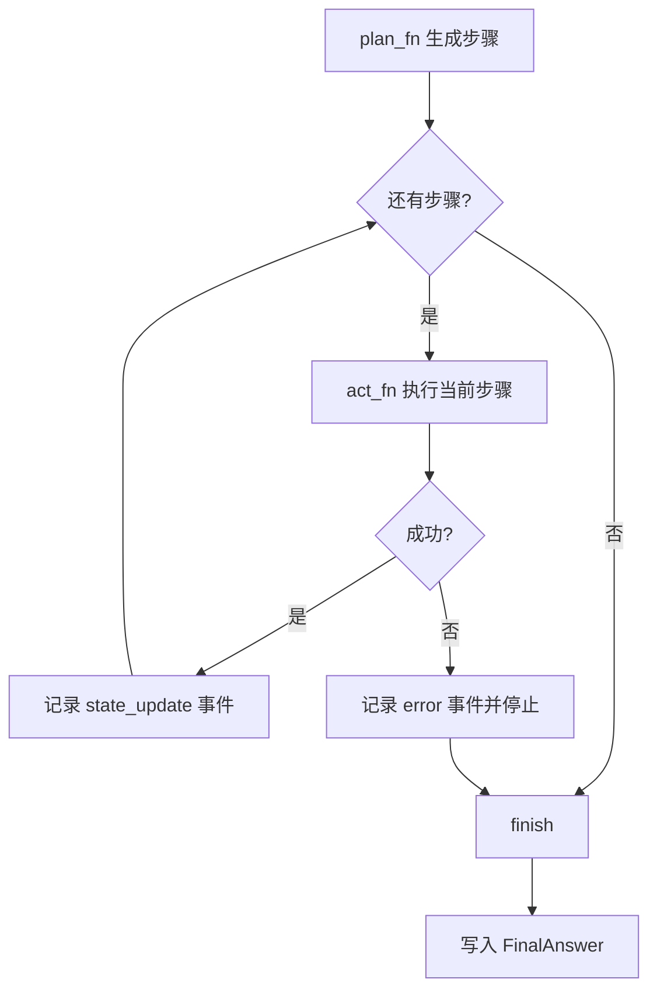
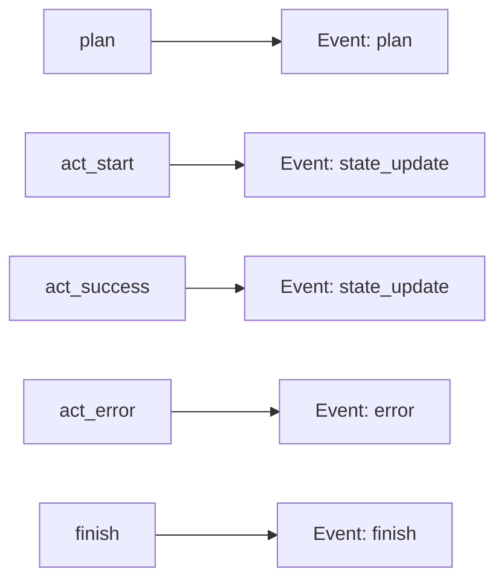

# 《从0到1工业级Agent框架打造》第三章：Engine 循环，让 Agent 真正跑起来

前两章我们做了“协议地基”。  
这一章开始让框架动起来：实现 `plan -> act -> observe -> update -> finish` 的执行循环。

---

## 这一章解决什么问题

如果没有 Engine，你的协议层只是静态数据定义。  
Engine 的职责是把“定义”变成“运行”。

本章重点解决三件事：

1. 如何控制循环不失控（`max_steps` / `time_budget_ms`）
2. 如何把每一步写成可追踪事件（`ExecutionEvent`）
3. 如何把运行结果稳定落到 `FinalAnswer`（通用结构）

---

## 先看流程图：Engine 到底在干什么



---

## 第 0 步：准备环境

```bash
uv add --dev pytest
uv sync --dev
```

---

## 第 1 步：创建 Engine 模块入口

创建文件：`framework/labor_agent/core/engine/__init__.py`

```python
"""Engine 组件导出。"""

from .loop import EngineLimits, EngineLoop, StepOutcome

__all__ = ["EngineLimits", "EngineLoop", "StepOutcome"]
```

为什么这样写：  
统一导出入口可以稳定外部依赖路径，后续重构内部文件时不影响上层调用。

---

## 第 2 步：实现 Engine 主循环

创建文件：`framework/labor_agent/core/engine/loop.py`，写入仓库现有实现。

你需要重点理解这几个设计点：

1. `EngineLimits`  
   - `max_steps` 防无限循环  
   - `time_budget_ms` 防单次请求卡死

2. `StepOutcome`  
   - 每个步骤执行结果必须结构化，不能靠字符串猜测是否成功

3. `EngineLoop.run(...)`  
   - 输入：`state + plan_fn + act_fn`  
   - 输出：更新后的 `state`（含事件和最终答案）

4. `_append_event(...)`  
   - 统一写事件，防止 trace 字段不一致

5. `_build_final_answer(...)`  
   - 统一把运行结果映射到通用 `FinalAnswer`

---

## 图 2：事件写入点分布



---

## 第 3 步：写 Engine 测试

创建文件：`tests/test_engine.py`，写入仓库现有实现。

本章测试覆盖 3 条主路径：

1. 成功路径：全部步骤成功，最终状态 `success`
2. 超步数路径：触发 `max_steps`，最终状态 `partial`
3. 失败路径：步骤执行失败，最终状态 `failed`

为什么是这 3 条：  
它们对应运行系统最核心的稳定性边界，缺任何一个都会让线上行为不可预测。

---

## 第 4 步：运行测试

```bash
uv run pytest tests/test_protocol.py tests/test_engine.py
```

---

## 常见报错与处理

1. 报错：`ModuleNotFoundError: No module named labor_agent`  
   处理：确认 `tests/conftest.py` 存在，并把 `framework/` 加入路径。

2. 报错：`Failed to spawn: pytest`  
   处理：执行 `uv add --dev pytest && uv sync --dev`。

3. 报错：IDE import 飘红  
   处理：确保 `pyrightconfig.json` 在仓库根目录，并重启 IDE 语言服务。

---

## 本章 DoD

完成以下 5 条才算通过：

1. `EngineLoop` 能驱动最小执行闭环。
2. 事件记录覆盖 plan / state_update / error / finish。
3. 支持 `max_steps` 与 `time_budget_ms` 限制。
4. `FinalAnswer` 通过统一函数构建且保持通用字段。
5. 三条主路径测试全部通过。

---

## 下一章预告

下一章进入 `Model Runtime (LLM Adapter)`。  
我们会把 Engine 的 `plan_fn/act_fn` 从本地函数升级到可接入模型推理的运行时接口。

