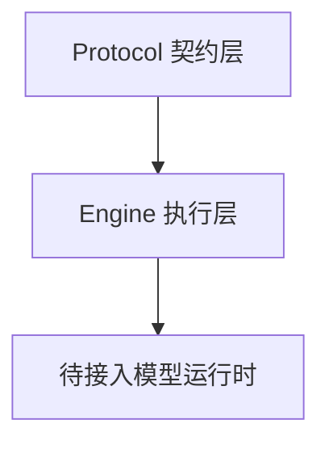
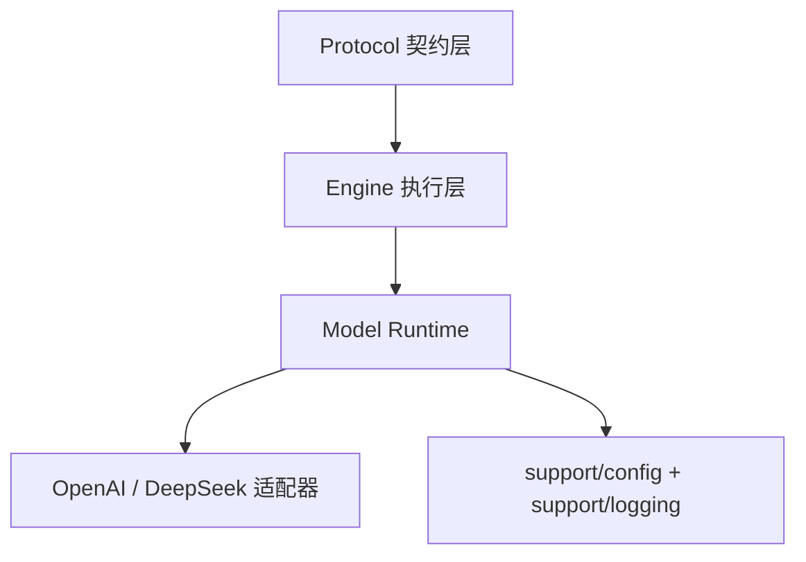
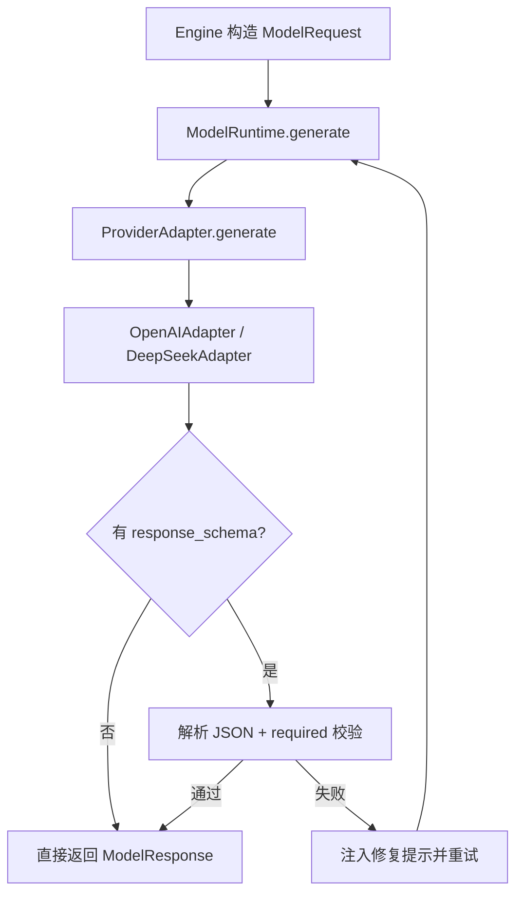
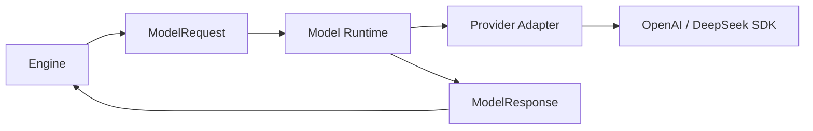
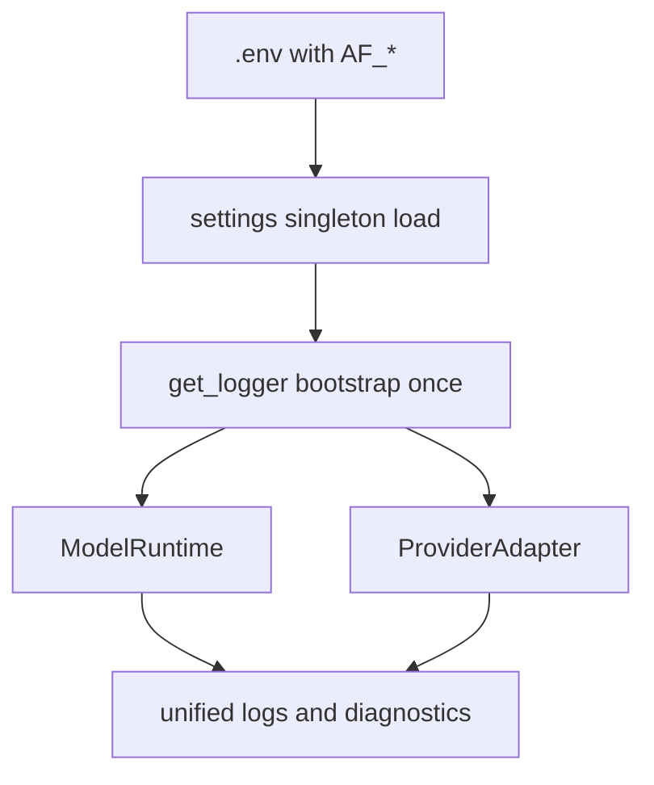
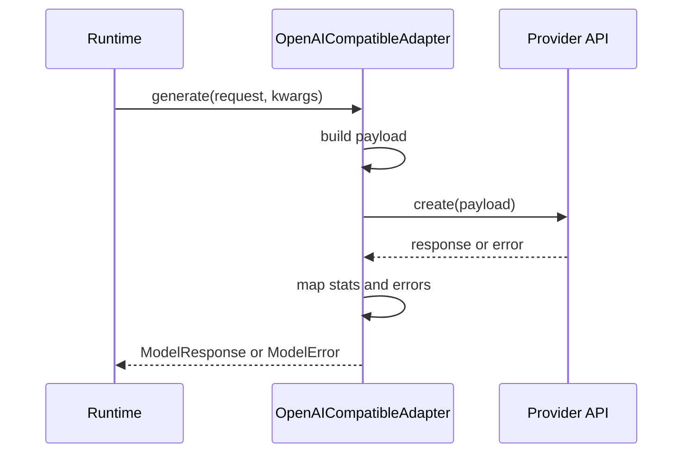
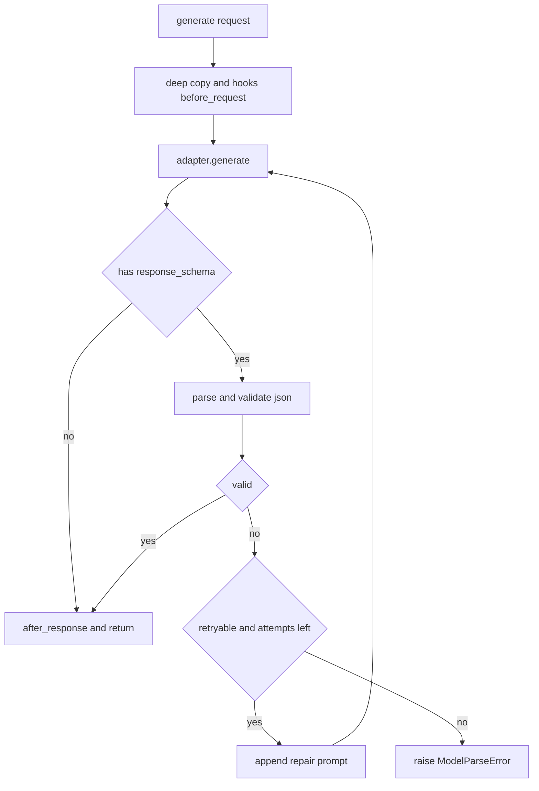
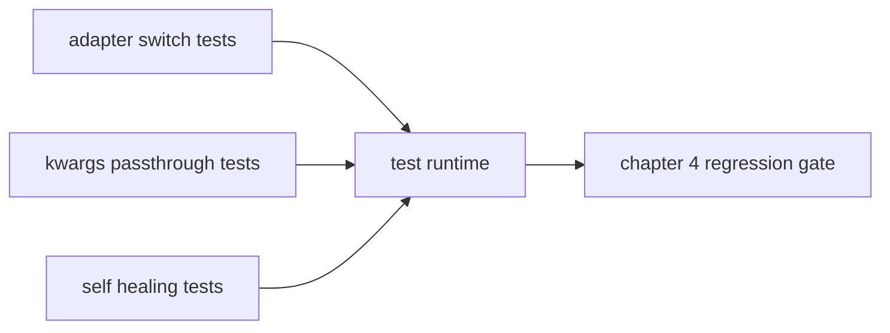
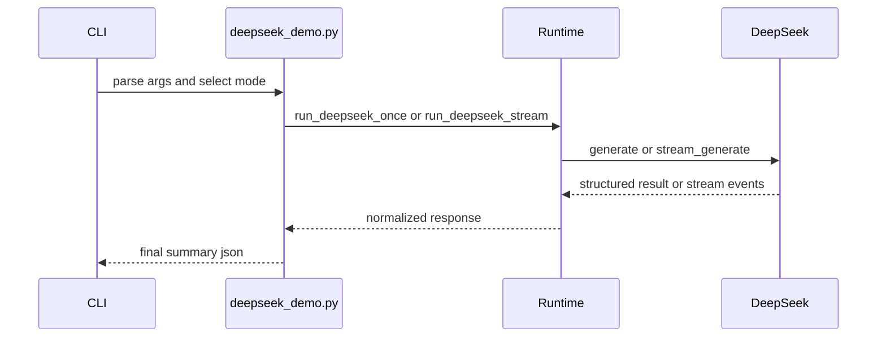

# 《从0到1工业级Agent框架打造》第四章：Model Runtime 真调用打通（OpenAI / DeepSeek）

## 目标

1. 前置集成通用配置与日志模块，形成统一运行基础。
2. 建立统一 `ModelRequest/ModelResponse` 契约，支持 `**kwargs` 透传。
3. 落地两个真实适配器：`OpenAIAdapter` 和 `DeepSeekAdapter`。
4. 实现 Runtime 自愈链路，并完成 DeepSeek 线上真实调用打通。

## 架构位置说明（演进视角）

### 当前系统结构（第 4 章开始前）



### 本章完成后的结构



1. 新模块依赖谁：Model Runtime 依赖 Protocol 与 support 辅助模块，不反向依赖应用层。
2. 谁依赖它：Engine 后续通过统一 runtime 接口调用具体模型能力。
3. 依赖方向变化：从“只有执行框架”升级为“执行框架 + 真实模型调用”。
4. 循环风险控制：适配器目录独立，避免 Engine 与厂商 SDK 直接耦合。

## 前置条件

1. 已完成第三章（Engine 可运行）。
2. 当前环境可执行：`uv run pytest tests/unit/test_engine.py -q`。
3. 在仓库根目录执行命令（包含 `src/`、`tests/`、`docs/`）。

## 环境准备

```powershell
uv add pydantic pydantic-settings python-dotenv openai
uv add --dev pytest
uv sync --dev
```

如果你之前已经装过这些包，重复执行不会破坏环境。

## 本章怎么学（防止读懵）

1. 先看“术语白话”与主流程图，知道每层职责。
2. 再做“最小测试”，确认代码行为没偏。
3. 最后跑 DeepSeek 真实线上调用，完成本章闭环。

## 先把术语讲成人话

1. `support/config`：统一读配置，不让各模块自己到处 `os.getenv`。
2. `support/logging`：统一日志格式，不让日志风格碎片化。
3. `Adapter`：翻译层，把框架请求翻译成厂商 SDK 参数。
4. `**kwargs` 透传：厂商新参数无需改框架也能传下去。
5. `Self-healing`：输出格式错了，系统自动补提示再试一次。

## 先讲“面”：Model Runtime 主流程



## 深入理解：Model Runtime 为什么是“模型能力”和“工程稳定性”之间的翻译层

### 一句话先讲人话

Model Runtime 不是“再包一层 SDK”这么简单，它的核心价值是把“模型侧变化”隔离在适配器里，把“系统侧稳定性”固定在统一契约里。

### 成功链路例子（你希望线上每天都在发生）

1. Engine 只构造 `ModelRequest`，不关心是 OpenAI 还是 DeepSeek。
2. Runtime 把请求交给对应 Adapter，并统一产出 `ModelResponse`。
3. 上层只读取 `content/parsed_output/stats`，代码不出现厂商分支判断。
4. 新增模型供应商时，只新增 Adapter，不改 Engine 主流程。

### 失败链路例子（没有 Runtime 时非常常见）

1. 业务层直接调用厂商 SDK 并写死参数名。
2. 厂商升级接口后字段变化，业务层多处一起报错。
3. 调试时只能看混乱字符串错误，无法统一判断是否可重试。
4. 最后项目里出现大量“某某模型专用 if/else”，系统逐步失控。

### 一张图看清职责边界



### 读这一章代码时建议你重点盯 3 件事

1. 统一契约是否稳定：`ModelRequest/ModelResponse` 是否足够表达主流程，且不泄漏厂商细节。
2. 错误语义是否可执行：`ModelParseError/ModelTimeoutError/ModelRateLimitError` 是否能直接支撑“重试还是终止”的决策。
3. 自愈边界是否可控：有重试上限、可观测日志、可解释失败，而不是无限重试。

## 本章主线改动范围（强制声明）

### 代码目录

- `src/agent_forge/components/model_runtime/`
- `src/agent_forge/support/`

### 测试目录

- `tests/unit/`

### 本章涉及的真实文件

```bash
touch src/agent_forge/support/config/settings.py
```

```powershell
New-Item -ItemType File -Force "src\\agent_forge\\support\\config\\settings.py" | Out-Null
```

- [src/agent_forge/support/config/settings.py](../../src/agent_forge/support/config/settings.py)
- [src/agent_forge/support/logging/logger.py](../../src/agent_forge/support/logging/logger.py)
- [src/agent_forge/components/model_runtime/__init__.py](../../src/agent_forge/components/model_runtime/__init__.py)
- [src/agent_forge/components/model_runtime/application/__init__.py](../../src/agent_forge/components/model_runtime/application/__init__.py)
- [src/agent_forge/components/model_runtime/infrastructure/adapters/openai_adapter.py](../../src/agent_forge/components/model_runtime/infrastructure/adapters/openai_adapter.py)
- [src/agent_forge/components/model_runtime/infrastructure/adapters/deepseek_adapter.py](../../src/agent_forge/components/model_runtime/infrastructure/adapters/deepseek_adapter.py)
- [src/agent_forge/components/model_runtime/infrastructure/adapters/stub.py](../../src/agent_forge/components/model_runtime/infrastructure/adapters/stub.py)
- [src/agent_forge/components/model_runtime/infrastructure/adapters/base.py](../../src/agent_forge/components/model_runtime/infrastructure/adapters/base.py)
- [src/agent_forge/components/model_runtime/infrastructure/adapters/__init__.py](../../src/agent_forge/components/model_runtime/infrastructure/adapters/__init__.py)
- [src/agent_forge/components/model_runtime/infrastructure/__init__.py](../../src/agent_forge/components/model_runtime/infrastructure/__init__.py)
- [src/agent_forge/components/model_runtime/domain/schemas.py](../../src/agent_forge/components/model_runtime/domain/schemas.py)
- [src/agent_forge/components/model_runtime/domain/__init__.py](../../src/agent_forge/components/model_runtime/domain/__init__.py)
- [src/agent_forge/components/model_runtime/application/runtime.py](../../src/agent_forge/components/model_runtime/application/runtime.py)
- [tests/unit/test_model_runtime.py](../../tests/unit/test_model_runtime.py)


## 实施步骤

### 第 1 步：先前置 support（config + logging）

创建命令：

```python
"""统一配置模块（辅助能力，不纳入 core 主干）。"""

from __future__ import annotations

from dotenv import load_dotenv
from pydantic import Field
from pydantic_settings import BaseSettings, SettingsConfigDict

# 1. 在导入阶段加载 .env，兼容 UTF-8 BOM（Windows PowerShell 常见）。
load_dotenv(override=False, encoding="utf-8-sig")


class AppConfig(BaseSettings):
    """应用配置单一事实源。"""

    environment: str = Field(default="development", description="运行环境")
    debug: bool = Field(default=False, description="是否开启调试")
    log_level: str = Field(default="INFO", description="日志级别")

    openai_api_key: str | None = Field(default=None, description="OpenAI API Key")
    deepseek_api_key: str | None = Field(default=None, description="DeepSeek API Key")
    openai_base_url: str = Field(default="https://api.openai.com/v1", description="OpenAI Base URL")
    deepseek_base_url: str = Field(default="https://api.deepseek.com/v1", description="DeepSeek Base URL")
    openai_model: str = Field(default="gpt-4o-mini", description="OpenAI 默认模型")
    deepseek_model: str = Field(default="deepseek-chat", description="DeepSeek 默认模型")

    model_config = SettingsConfigDict(
        env_file=".env",
        env_file_encoding="utf-8-sig",
        env_prefix="AF_",
        extra="ignore",
    )


# 2. 全局单例，供 Adapter/Runtime 等读取配置。
settings = AppConfig()
```

```bash
touch src/agent_forge/support/__init__.py
```

```powershell
New-Item -ItemType File -Force "src\\agent_forge\\support\\__init__.py" | Out-Null
```

文件：[src/agent_forge/support/__init__.py](../../src/agent_forge/support/__init__.py)

```python
"""Cross-cutting support modules."""

from agent_forge.support.config import AppConfig, settings
from agent_forge.support.logging import get_logger

__all__ = ["AppConfig", "settings", "get_logger"]
```

创建命令：

```bash
touch src/agent_forge/support/config/__init__.py
```

```powershell
New-Item -ItemType File -Force "src\\agent_forge\\support\\config\\__init__.py" | Out-Null
```

文件：[src/agent_forge/support/config/__init__.py](../../src/agent_forge/support/config/__init__.py)

```python
"""Configuration exports."""

from .settings import AppConfig, settings

__all__ = ["AppConfig", "settings"]
```

创建命令：

```bash
touch src/agent_forge/support/config/settings.py
```

```powershell
New-Item -ItemType File -Force "src\\agent_forge\\support\\config\\settings.py" | Out-Null
```

文件：[src/agent_forge/support/config/settings.py](../../src/agent_forge/support/config/settings.py)

```python
"""统一配置模块（辅助能力，不纳入 core 主干）。"""

from __future__ import annotations

from dotenv import load_dotenv
from pydantic import Field
from pydantic_settings import BaseSettings, SettingsConfigDict

# 1. 在导入阶段加载 .env，兼容 UTF-8 BOM（Windows PowerShell 常见）。
load_dotenv(override=False, encoding="utf-8-sig")


class AppConfig(BaseSettings):
    """应用配置单一事实源。"""

    environment: str = Field(default="development", description="运行环境")
    debug: bool = Field(default=False, description="是否开启调试")
    log_level: str = Field(default="INFO", description="日志级别")

    openai_api_key: str | None = Field(default=None, description="OpenAI API Key")
    deepseek_api_key: str | None = Field(default=None, description="DeepSeek API Key")
    openai_base_url: str = Field(default="https://api.openai.com/v1", description="OpenAI Base URL")
    deepseek_base_url: str = Field(default="https://api.deepseek.com/v1", description="DeepSeek Base URL")
    openai_model: str = Field(default="gpt-4o-mini", description="OpenAI 默认模型")
    deepseek_model: str = Field(default="deepseek-chat", description="DeepSeek 默认模型")

    model_config = SettingsConfigDict(
        env_file=".env",
        env_file_encoding="utf-8-sig",
        env_prefix="AF_",
        extra="ignore",
    )


# 2. 全局单例，供 Adapter/Runtime 等读取配置。
settings = AppConfig()
```

创建命令：

```bash
touch src/agent_forge/support/logging/__init__.py
```

```powershell
New-Item -ItemType File -Force "src\\agent_forge\\support\\logging\\__init__.py" | Out-Null
```

文件：[src/agent_forge/support/logging/__init__.py](../../src/agent_forge/support/logging/__init__.py)

```python
"""Logging exports."""

from .logger import get_logger

__all__ = ["get_logger"]
```

创建命令：

```bash
touch src/agent_forge/support/logging/logger.py
```

```powershell
New-Item -ItemType File -Force "src\\agent_forge\\support\\logging\\logger.py" | Out-Null
```

文件：[src/agent_forge/support/logging/logger.py](../../src/agent_forge/support/logging/logger.py)

```python
"""统一日志模块（辅助能力，不纳入 core 主干）。"""

from __future__ import annotations

import logging
import sys

from agent_forge.support.config import settings

_LOG_FORMAT = "%(asctime)s | %(levelname)-7s | %(name)s | %(message)s"
_DATE_FORMAT = "%Y-%m-%d %H:%M:%S"
_BOOTSTRAPPED = False


def _bootstrap_root_logger() -> None:
    global _BOOTSTRAPPED
    if _BOOTSTRAPPED:
        return
    level = getattr(logging, settings.log_level.upper(), logging.INFO)
    handler = logging.StreamHandler(sys.stdout)
    handler.setFormatter(logging.Formatter(fmt=_LOG_FORMAT, datefmt=_DATE_FORMAT))
    root_logger = logging.getLogger("agent_forge")
    root_logger.setLevel(level)
    root_logger.handlers.clear()
    root_logger.addHandler(handler)
    root_logger.propagate = False
    _BOOTSTRAPPED = True


def get_logger(name: str) -> logging.Logger:
    """获取框架统一 logger。"""

    # 1. 首次调用时初始化基础日志管道。
    _bootstrap_root_logger()
    # 2. 子模块 logger 统一挂在 agent_forge 命名空间下。
    return logging.getLogger(f"agent_forge.{name}")
```

代码讲解：

1. 设计意图：先把基础设施统一，再做业务组件，避免后续返工。
2. 工程取舍：support 不算主干组件，但必须“先有再用”。
3. 边界条件：环境变量统一 `AF_` 前缀，避免污染。
4. 失败模式：如果每个模块各自读配置、各自打日志，线上排障会碎片化。

这一段主流程可以按“配置入场 -> 日志挂载 -> 组件复用”来理解：

1. 进程启动时由 `settings.py` 统一加载 `.env`，并处理 Windows 常见 BOM。
2. 第一次调用 `get_logger()` 时完成根日志器初始化，后续模块只拿子 logger，不再重复配置。
3. Model Runtime 与 Adapter 都依赖这两个基础能力，避免在业务层散落环境变量读取和日志格式代码。

成功链路例子：
当你在 `.env` 写入 `AF_LOG_LEVEL=DEBUG` 后，不改任何业务代码，`runtime.py` 与 `deepseek_adapter.py` 的日志输出级别会一起生效，排查线上问题时能直接按同一格式检索。

失败链路例子：
如果每个模块自己 `os.getenv()`、自己 `logging.basicConfig()`，常见结果是有的日志带时间戳有的不带，有的模块仍是 INFO，有的已经 DEBUG，最后难以用单一检索条件排查。



工程取舍与边界：

1. 这里选择“模块导入即加载配置”，换来的是上手简单；代价是单元测试中如果要动态改环境变量，需要显式重建进程或使用 monkeypatch + 重新导入策略。
2. 日志器只初始化 `agent_forge` 命名空间，不接管第三方库根日志，避免把外部噪音一起打进来。

### 第 2 步：统一模型契约（domain）

创建命令：

```bash
touch src/agent_forge/components/model_runtime/domain/schemas.py
```

```powershell
New-Item -ItemType File -Force "src\\agent_forge\\components\\model_runtime\\domain\\schemas.py" | Out-Null
```

文件：[src/agent_forge/components/model_runtime/domain/schemas.py](../../src/agent_forge/components/model_runtime/domain/schemas.py)

```python
"""Model 组件（大模型契约层）。

目标：
1. 统一请求与响应结构，屏蔽底层厂商差异。
2. 规范化错误类型（超时、限流、解析失败等）。
3. 标准化成本域统计（输入 Token、输出 Token、延迟、成本）。
"""

from __future__ import annotations

from typing import Any, Literal, Protocol

from pydantic import BaseModel, ConfigDict, Field

from agent_forge.components.protocol import AgentMessage, ErrorInfo, ToolCall


class ModelStats(BaseModel):
    """请求统计信息。"""

    prompt_tokens: int = Field(default=0, ge=0, description="输入 Token 数")
    completion_tokens: int = Field(default=0, ge=0, description="输出 Token 数")
    total_tokens: int = Field(default=0, ge=0, description="总 Token 数")
    latency_ms: int = Field(default=0, ge=0, description="请求耗时（毫秒）")
    cost_usd: float | None = Field(default=None, ge=0.0, description="预估成本（美元）")


class ModelRequest(BaseModel):
    """统一模型调用请求。"""

    # 允许通过 `ModelRequest(..., **kwargs)` 直接透传厂商特定参数。
    model_config = ConfigDict(extra="allow")

    messages: list[AgentMessage] = Field(..., description="上下文消息列表")
    system_prompt: str | None = Field(default=None, description="系统提示词（若单独提供）")
    model: str | None = Field(default=None, description="覆盖默认模型名")
    temperature: float = Field(default=0.7, ge=0.0, le=2.0, description="采样温度")
    max_tokens: int | None = Field(default=None, ge=1, description="最大生成 Token 数")
    response_schema: dict[str, Any] | None = Field(default=None, description="期望的 JSON Schema 输出结构")
    tools: list[dict[str, Any]] | None = Field(default=None, description="可用工具列表")
    stream: bool = Field(default=False, description="是否流式返回")
    request_id: str | None = Field(default=None, description="请求ID（可选，用于追踪流式事件）")

    def extra_kwargs(self) -> dict[str, Any]:
        """返回通过 `**kwargs` 透传的额外参数。"""

        return dict(self.model_extra or {})


class ModelResponse(BaseModel):
    """统一模型调用响应。"""

    content: str = Field(default="", description="响应文本")
    parsed_output: dict[str, Any] | None = Field(default=None, description="结构化解析结果")
    tool_calls: list[ToolCall] = Field(default_factory=list, description="模型决定的工具调用")
    stats: ModelStats = Field(default_factory=ModelStats, description="本次请求统计")


ModelStreamEventType = Literal["start", "delta", "usage", "error", "end"]


class ModelStreamEvent(BaseModel):
    """Unified stream event shape for model runtime."""

    event_type: ModelStreamEventType = Field(..., description="流式事件类型")
    request_id: str = Field(..., min_length=1, description="请求ID")
    sequence: int = Field(default=0, ge=0, description="事件序号（从0开始）")
    delta: str | None = Field(default=None, description="增量文本（delta事件）")
    content: str | None = Field(default=None, description="完整文本（end事件可选）")
    stats: ModelStats | None = Field(default=None, description="统计信息（usage/end可带）")
    error: ErrorInfo | None = Field(default=None, description="错误信息（error事件）")
    timestamp_ms: int = Field(default=0, ge=0, description="事件时间戳（毫秒）")
    metadata: dict[str, Any] = Field(default_factory=dict, description="扩展字段")


class ModelRuntimeHooks(Protocol):
    """Extension hooks for pre/post process and stream events."""

    def before_request(self, request: ModelRequest) -> ModelRequest:
        """Called before adapter invocation."""

    def on_stream_event(self, event: ModelStreamEvent) -> ModelStreamEvent:
        """Called for each stream event."""

    def after_response(self, response: ModelResponse) -> ModelResponse:
        """Called after final response is built."""


class NoopModelRuntimeHooks:
    """Default no-op hooks implementation."""

    def before_request(self, request: ModelRequest) -> ModelRequest:
        return request

    def on_stream_event(self, event: ModelStreamEvent) -> ModelStreamEvent:
        return event

    def after_response(self, response: ModelResponse) -> ModelResponse:
        return response


class ModelError(Exception):
    """模型运行时统一异常基类。"""

    def __init__(self, error_code: str, message: str, retryable: bool = False):
        super().__init__(message)
        self.error_code = error_code
        self.message = message
        self.retryable = retryable


class ModelTimeoutError(ModelError):
    def __init__(self, message: str = "模型请求超时"):
        super().__init__("MODEL_TIMEOUT", message, retryable=True)


class ModelRateLimitError(ModelError):
    def __init__(self, message: str = "模型请求被限流"):
        super().__init__("MODEL_RATE_LIMIT", message, retryable=True)


class ModelParseError(ModelError):
    def __init__(self, message: str, raw_content: str):
        super().__init__("MODEL_PARSE_ERROR", message, retryable=True)
        self.raw_content = raw_content


class ModelAuthenticationError(ModelError):
    def __init__(self, message: str = "API 密钥无效或未授权"):
        super().__init__("MODEL_AUTH_ERROR", message, retryable=False)
```

代码讲解：

1. 设计意图：把“接口稳定性”从厂商层抽出来。
2. 取舍：高频参数做显式字段，长尾参数走 `extra="allow"`。
3. 边界：透传参数只保证“往下传”，不保证厂商接受。
4. 失败模式：没有统一错误码，上层无法稳定决定重试/终止。

创建命令：

```bash
touch src/agent_forge/components/model_runtime/domain/__init__.py
```

```powershell
New-Item -ItemType File -Force "src\\agent_forge\\components\\model_runtime\\domain\\__init__.py" | Out-Null
```

文件：[src/agent_forge/components/model_runtime/domain/__init__.py](../../src/agent_forge/components/model_runtime/domain/__init__.py)

```python
"""Model runtime domain exports."""

from .schemas import (
    ModelAuthenticationError,
    ModelError,
    ModelParseError,
    ModelRateLimitError,
    ModelRequest,
    ModelResponse,
    ModelRuntimeHooks,
    ModelStreamEvent,
    ModelStreamEventType,
    ModelStats,
    ModelTimeoutError,
    NoopModelRuntimeHooks,
)

__all__ = [
    "ModelRequest",
    "ModelResponse",
    "ModelStreamEvent",
    "ModelStreamEventType",
    "ModelRuntimeHooks",
    "NoopModelRuntimeHooks",
    "ModelStats",
    "ModelError",
    "ModelParseError",
    "ModelTimeoutError",
    "ModelRateLimitError",
    "ModelAuthenticationError",
]
```

### 第 3 步：真实适配器（OpenAI + DeepSeek）

创建命令：

```bash
touch src/agent_forge/components/model_runtime/infrastructure/__init__.py
```

```powershell
New-Item -ItemType File -Force "src\\agent_forge\\components\\model_runtime\\infrastructure\\__init__.py" | Out-Null
```

文件：[src/agent_forge/components/model_runtime/infrastructure/__init__.py](../../src/agent_forge/components/model_runtime/infrastructure/__init__.py)

```python
"""Model runtime infrastructure exports."""

from agent_forge.components.model_runtime.infrastructure.adapters import (
    DeepSeekAdapter,
    OpenAIAdapter,
    OpenAICompatibleAdapter,
    ProviderAdapter,
    StubDeepSeekAdapter,
    StubOpenAIAdapter,
)

__all__ = [
    "ProviderAdapter",
    "OpenAICompatibleAdapter",
    "OpenAIAdapter",
    "DeepSeekAdapter",
    "StubOpenAIAdapter",
    "StubDeepSeekAdapter",
]
```

创建命令：

```bash
touch src/agent_forge/components/model_runtime/infrastructure/adapters/__init__.py
```

```powershell
New-Item -ItemType File -Force "src\\agent_forge\\components\\model_runtime\\infrastructure\\adapters\\__init__.py" | Out-Null
```

文件：[src/agent_forge/components/model_runtime/infrastructure/adapters/__init__.py](../../src/agent_forge/components/model_runtime/infrastructure/adapters/__init__.py)

```python
"""模型适配器导出。"""

from .base import OpenAICompatibleAdapter, ProviderAdapter
from .deepseek_adapter import DeepSeekAdapter
from .openai_adapter import OpenAIAdapter
from .stub import StubDeepSeekAdapter, StubOpenAIAdapter

__all__ = [
    "ProviderAdapter",
    "OpenAICompatibleAdapter",
    "OpenAIAdapter",
    "DeepSeekAdapter",
    "StubOpenAIAdapter",
    "StubDeepSeekAdapter",
]
```

创建命令：

```bash
touch src/agent_forge/components/model_runtime/infrastructure/adapters/base.py
```

```powershell
New-Item -ItemType File -Force "src\\agent_forge\\components\\model_runtime\\infrastructure\\adapters\\base.py" | Out-Null
```

文件：[src/agent_forge/components/model_runtime/infrastructure/adapters/base.py](../../src/agent_forge/components/model_runtime/infrastructure/adapters/base.py)

```python
"""Provider 适配器抽象与通用实现。"""

from __future__ import annotations

import json
import time
from abc import ABC, abstractmethod
from collections.abc import Iterator
from typing import Any

import openai

from agent_forge.components.model_runtime.domain.schemas import (
    ModelAuthenticationError,
    ModelError,
    ModelRateLimitError,
    ModelRequest,
    ModelResponse,
    ModelStreamEvent,
    ModelStats,
    ModelTimeoutError,
)
from agent_forge.components.protocol import ErrorInfo, ToolCall
from agent_forge.support.logging import get_logger

logger = get_logger(__name__)


class ProviderAdapter(ABC):
    """模型厂商统一适配层接口。"""

    @abstractmethod
    def generate(self, request: ModelRequest, **kwargs: Any) -> ModelResponse:
        """执行模型调用。"""
        raise NotImplementedError

    @abstractmethod
    def generate_stream(self, request: ModelRequest, **kwargs: Any) -> Iterator[ModelStreamEvent]:
        """执行流式模型调用。"""
        raise NotImplementedError


class OpenAICompatibleAdapter(ProviderAdapter):
    """OpenAI 兼容协议适配器基类。"""

    provider_name: str = "openai-compatible"

    def __init__(
        self,
        *,
        api_key: str | None,
        base_url: str,
        default_model: str,
        client: Any | None = None,
    ) -> None:
        self.api_key = api_key
        self.base_url = base_url
        self.default_model = default_model
        if not self.api_key:
            logger.warning("%s 未提供 API Key，调用时可能鉴权失败。", self.provider_name)
        self.client = client or openai.Client(api_key=self.api_key, base_url=self.base_url)

    def generate(self, request: ModelRequest, **kwargs: Any) -> ModelResponse:
        payload = self._build_payload(request, **kwargs)
        start_t = time.monotonic()
        try:
            raw_response = self.client.chat.completions.create(**payload)
        except openai.BadRequestError as exc:
            # 某些兼容服务不支持 json_schema，这里自动降级为 json_object 再试一次。
            if request.response_schema and self._is_response_format_unavailable(exc):
                logger.warning("%s response_format 不可用，自动降级为 json_object 重试。", self.provider_name)
                fallback_payload = self._build_payload(
                    request,
                    response_format={"type": "json_object"},
                    **kwargs,
                )
                raw_response = self.client.chat.completions.create(**fallback_payload)
            else:
                # BadRequest 通常是参数不被模型支持，重试不会自愈。
                raise ModelError(error_code=f"{self.provider_name.upper()}_BAD_REQUEST", message=str(exc), retryable=False) from exc
        except openai.AuthenticationError as exc:
            raise ModelAuthenticationError(str(exc)) from exc
        except openai.RateLimitError as exc:
            raise ModelRateLimitError(str(exc)) from exc
        except openai.APITimeoutError as exc:
            raise ModelTimeoutError(str(exc)) from exc
        except openai.OpenAIError as exc:
            raise ModelError(error_code=f"{self.provider_name.upper()}_ERROR", message=str(exc), retryable=True) from exc

        latency_ms = int((time.monotonic() - start_t) * 1000)
        choice = raw_response.choices[0]
        usage = raw_response.usage
        return ModelResponse(
            content=(choice.message.content or "").strip(),
            tool_calls=self._extract_tool_calls(choice.message),
            stats=ModelStats(
                prompt_tokens=usage.prompt_tokens if usage else 0,
                completion_tokens=usage.completion_tokens if usage else 0,
                total_tokens=usage.total_tokens if usage else 0,
                latency_ms=latency_ms,
            ),
        )

    def generate_stream(self, request: ModelRequest, **kwargs: Any) -> Iterator[ModelStreamEvent]:
        request_id = request.request_id or kwargs.get("request_id") or f"req_{int(time.time() * 1000)}"
        payload = self._build_payload(request, stream=True, **kwargs)
        seq = 0
        start_ms = int(time.time() * 1000)
        started_at = time.monotonic()
        full_parts: list[str] = []
        stats = ModelStats()
        stream_obj: Any | None = None

        yield ModelStreamEvent(
            event_type="start",
            request_id=request_id,
            sequence=seq,
            timestamp_ms=start_ms,
            metadata={"provider": self.provider_name},
        )
        seq += 1

        try:
            stream_obj = self.client.chat.completions.create(**payload)
            for chunk in stream_obj:
                delta = self._extract_delta_content(chunk)
                if delta:
                    full_parts.append(delta)
                    yield ModelStreamEvent(
                        event_type="delta",
                        request_id=request_id,
                        sequence=seq,
                        delta=delta,
                        timestamp_ms=int(time.time() * 1000),
                    )
                    seq += 1
                usage = self._extract_usage(chunk)
                if usage:
                    stats = usage
        except Exception as exc:  # noqa: BLE001
            model_error = self._to_model_error(exc)
            elapsed_ms = int((time.monotonic() - started_at) * 1000)
            stats.latency_ms = elapsed_ms
            yield ModelStreamEvent(
                event_type="error",
                request_id=request_id,
                sequence=seq,
                timestamp_ms=int(time.time() * 1000),
                stats=stats,
                error=ErrorInfo(
                    error_code=model_error.error_code,
                    error_message=model_error.message,
                    retryable=model_error.retryable,
                ),
            )
            seq += 1
            yield ModelStreamEvent(
                event_type="end",
                request_id=request_id,
                sequence=seq,
                content="".join(full_parts),
                stats=stats,
                timestamp_ms=int(time.time() * 1000),
                metadata={"status": "error"},
            )
            return
        finally:
            closer = getattr(stream_obj, "close", None)
            if callable(closer):
                closer()

        stats.latency_ms = int((time.monotonic() - started_at) * 1000)
        yield ModelStreamEvent(
            event_type="usage",
            request_id=request_id,
            sequence=seq,
            stats=stats,
            timestamp_ms=int(time.time() * 1000),
        )
        seq += 1
        yield ModelStreamEvent(
            event_type="end",
            request_id=request_id,
            sequence=seq,
            content="".join(full_parts),
            stats=stats,
            timestamp_ms=int(time.time() * 1000),
            metadata={"status": "ok"},
        )

    def _build_payload(self, request: ModelRequest, **kwargs: Any) -> dict[str, Any]:
        messages: list[dict[str, Any]] = []
        if request.system_prompt:
            messages.append({"role": "system", "content": request.system_prompt})
        for msg in request.messages:
            messages.append({"role": msg.role, "content": msg.content})

        payload: dict[str, Any] = {
            "model": request.model or self.default_model,
            "messages": messages,
            "temperature": request.temperature,
            "stream": request.stream,
        }
        if request.max_tokens is not None:
            payload["max_tokens"] = request.max_tokens
        if request.tools:
            payload["tools"] = request.tools

        merged_kwargs: dict[str, Any] = {}
        merged_kwargs.update(request.extra_kwargs())
        merged_kwargs.update(kwargs)
        merged_kwargs.pop("request_id", None)

        response_format = merged_kwargs.pop("response_format", None)
        if request.response_schema:
            if response_format is None:
                schema_name = merged_kwargs.pop("request_id", "model_runtime_schema")
                payload["response_format"] = {
                    "type": "json_schema",
                    "json_schema": {
                        "name": schema_name,
                        "schema": request.response_schema,
                    },
                }
            else:
                payload["response_format"] = response_format
            # 无论使用 json_schema 还是 json_object，都加一层显式 JSON 约束，避免模型输出闲聊文本。
            payload["messages"].append(
                {
                    "role": "system",
                    "content": (
                        "请仅输出合法 JSON，且必须满足以下 JSON Schema：\n"
                        f"{json.dumps(request.response_schema, ensure_ascii=False)}"
                    ),
                }
            )

        timeout_ms = merged_kwargs.pop("timeout_ms", None)
        if timeout_ms is not None:
            payload["timeout"] = timeout_ms / 1000

        payload.update(merged_kwargs)
        return payload

    def _is_response_format_unavailable(self, exc: openai.BadRequestError) -> bool:
        text = str(exc).lower()
        return "response_format" in text and "unavailable" in text

    def _extract_tool_calls(self, message: Any) -> list[ToolCall]:
        tool_calls: list[ToolCall] = []
        raw_tool_calls = getattr(message, "tool_calls", None) or []
        for raw in raw_tool_calls:
            if isinstance(raw, dict):
                fn = raw.get("function", {})
                fn_name = fn.get("name")
                fn_args = fn.get("arguments", "{}")
                tool_id = raw.get("id")
            else:
                fn = getattr(raw, "function", None)
                fn_name = getattr(fn, "name", None)
                fn_args = getattr(fn, "arguments", "{}")
                tool_id = getattr(raw, "id", None)
            if fn_name and tool_id:
                try:
                    parsed_args = json.loads(fn_args) if isinstance(fn_args, str) else fn_args
                except Exception:
                    parsed_args = {"raw_arguments": fn_args}
                tool_calls.append(
                    ToolCall(
                        tool_call_id=tool_id,
                        tool_name=fn_name,
                        args=parsed_args,
                        principal="model",
                    )
                )
        return tool_calls

    def _to_model_error(self, exc: Exception) -> ModelError:
        if isinstance(exc, ModelError):
            return exc
        if isinstance(exc, openai.AuthenticationError):
            return ModelAuthenticationError(str(exc))
        if isinstance(exc, openai.RateLimitError):
            return ModelRateLimitError(str(exc))
        if isinstance(exc, openai.APITimeoutError):
            return ModelTimeoutError(str(exc))
        if isinstance(exc, openai.OpenAIError):
            return ModelError(
                error_code=f"{self.provider_name.upper()}_ERROR",
                message=str(exc),
                retryable=True,
            )
        return ModelError(
            error_code=f"{self.provider_name.upper()}_STREAM_ERROR",
            message=str(exc),
            retryable=False,
        )

    def _extract_delta_content(self, chunk: Any) -> str:
        choices = getattr(chunk, "choices", None)
        if not choices and isinstance(chunk, dict):
            choices = chunk.get("choices")
        if not choices:
            return ""

        first = choices[0]
        delta = getattr(first, "delta", None)
        if delta is None and isinstance(first, dict):
            delta = first.get("delta")

        content = getattr(delta, "content", None) if delta is not None else None
        if content is None and isinstance(delta, dict):
            content = delta.get("content")
        return content or ""

    def _extract_usage(self, chunk: Any) -> ModelStats | None:
        usage = getattr(chunk, "usage", None)
        if usage is None and isinstance(chunk, dict):
            usage = chunk.get("usage")
        if usage is None:
            return None
        prompt_tokens = getattr(usage, "prompt_tokens", None)
        completion_tokens = getattr(usage, "completion_tokens", None)
        total_tokens = getattr(usage, "total_tokens", None)
        if isinstance(usage, dict):
            prompt_tokens = usage.get("prompt_tokens")
            completion_tokens = usage.get("completion_tokens")
            total_tokens = usage.get("total_tokens")
        return ModelStats(
            prompt_tokens=prompt_tokens or 0,
            completion_tokens=completion_tokens or 0,
            total_tokens=total_tokens or 0,
        )
```

关键点：

1. `OpenAICompatibleAdapter` 统一了 payload 构建、异常映射、统计映射。
2. `request.extra_kwargs()` + `runtime.generate(..., **kwargs)` 组成两层透传覆盖链。
3. `response_format` 支持通用透传（如 `{"type": "json_object"}`），未显式传入时默认按 `response_schema` 走 `json_schema`。
4. 若服务端返回 `response_format unavailable`，自动降级为 `json_object` 再试一次。
5. `timeout_ms` 统一转秒给 OpenAI SDK。

把 `base.py` 当成“厂商协议翻译总线”更容易理解，它的主流程是：

1. 组装统一 payload（把协议层消息、schema、参数合并成厂商可接受格式）。
2. 执行调用并做异常分类（鉴权/限流/超时/BadRequest）。
3. 把厂商响应映射回统一 `ModelResponse` 或流式 `ModelStreamEvent`。
4. 在流式链路里保证 `start -> delta -> usage/error -> end` 的可观测闭环。

成功链路例子：
DeepSeek 某模型不支持 `json_schema`，第一次返回 `response_format unavailable`，基类自动降级到 `json_object` 再调用一次；上层 runtime 无需改代码，调用仍成功。

失败链路例子：
如果把异常映射留给上层处理，Engine 看到的就是混杂的 SDK 异常字符串，无法稳定判断是否可重试，最终会出现“该重试的不重试，不该重试的一直重试”。



工程取舍与边界：

1. 选择在基类做降级重试，是为了把“兼容协议差异”锁在基础设施层；代价是基类逻辑更重，需要更完整单测覆盖。
2. `extra_kwargs` 是能力扩展口，但不是能力保证口，参数能透传不代表每家 provider 都支持；因此保留 `BAD_REQUEST` 的不可重试语义，避免无意义重试。

创建命令：

```bash
touch src/agent_forge/components/model_runtime/infrastructure/adapters/openai_adapter.py
```

```powershell
New-Item -ItemType File -Force "src\\agent_forge\\components\\model_runtime\\infrastructure\\adapters\\openai_adapter.py" | Out-Null
```

文件：[src/agent_forge/components/model_runtime/infrastructure/adapters/openai_adapter.py](../../src/agent_forge/components/model_runtime/infrastructure/adapters/openai_adapter.py)  

```python
"""OpenAI 真实适配器实现。"""

from __future__ import annotations

from typing import Any

from agent_forge.components.model_runtime.infrastructure.adapters.base import OpenAICompatibleAdapter
from agent_forge.support.config import settings


class OpenAIAdapter(OpenAICompatibleAdapter):
    """OpenAI 官方 API 适配器。"""

    provider_name = "openai"

    def __init__(self, api_key: str | None = None, base_url: str | None = None, model: str | None = None, client: Any | None = None):
        super().__init__(
            api_key=api_key or settings.openai_api_key,
            base_url=base_url or settings.openai_base_url,
            default_model=model or settings.openai_model,
            client=client,
        )
```

创建命令：

```bash
touch src/agent_forge/components/model_runtime/infrastructure/adapters/deepseek_adapter.py
```

```powershell
New-Item -ItemType File -Force "src\\agent_forge\\components\\model_runtime\\infrastructure\\adapters\\deepseek_adapter.py" | Out-Null
```

文件：[src/agent_forge/components/model_runtime/infrastructure/adapters/deepseek_adapter.py](../../src/agent_forge/components/model_runtime/infrastructure/adapters/deepseek_adapter.py)

```python
"""DeepSeek 真实适配器实现。"""

from __future__ import annotations

from typing import Any

from agent_forge.components.model_runtime.infrastructure.adapters.base import OpenAICompatibleAdapter
from agent_forge.support.config import settings


class DeepSeekAdapter(OpenAICompatibleAdapter):
    """DeepSeek API 适配器（OpenAI 兼容协议）。"""

    provider_name = "deepseek"

    def __init__(
        self,
        api_key: str | None = None,
        base_url: str | None = None,
        model: str | None = None,
        client: Any | None = None,
    ) -> None:
        super().__init__(
            api_key=api_key or settings.deepseek_api_key,
            base_url=base_url or settings.deepseek_base_url,
            default_model=model or settings.deepseek_model,
            client=client,
        )
```

这两个文件只保留 provider 差异配置，不重复通用逻辑。

代码讲解：

1. 设计意图：共性上收，差异下沉。
2. 取舍：兼容 OpenAI 协议意味着接入 DeepSeek 成本最低。
3. 边界：若厂商协议分叉严重，需要新增独立 adapter。
4. 失败模式：如果每家都复制一套逻辑，改一次 bug 要改多处。

### 第 4 步：Runtime 自愈控制层

创建命令：

```bash
touch src/agent_forge/components/model_runtime/application/__init__.py
```

```powershell
New-Item -ItemType File -Force "src\\agent_forge\\components\\model_runtime\\application\\__init__.py" | Out-Null
```

文件：[src/agent_forge/components/model_runtime/application/__init__.py](../../src/agent_forge/components/model_runtime/application/__init__.py)

```python
"""Model runtime application exports."""

from .runtime import ModelRuntime

__all__ = ["ModelRuntime"]
```

创建命令：

```bash
touch src/agent_forge/components/model_runtime/application/runtime.py
```

```powershell
New-Item -ItemType File -Force "src\\agent_forge\\components\\model_runtime\\application\\runtime.py" | Out-Null
```

文件：[src/agent_forge/components/model_runtime/application/runtime.py](../../src/agent_forge/components/model_runtime/application/runtime.py)

```python
"""Model Runtime 组件（防崩塌控制层）。

主要能力：
1. 依赖注入调度不同的 Adapter
2. JSON 结构化输出校验
3. 自动化的自愈重试链路
"""

from __future__ import annotations

import json
from collections.abc import Iterator
from typing import Any
from uuid import uuid4

from agent_forge.components.model_runtime.infrastructure.adapters import ProviderAdapter
from agent_forge.components.model_runtime.domain.schemas import (
    ModelError,
    ModelParseError,
    ModelRequest,
    ModelResponse,
    ModelRuntimeHooks,
    ModelStreamEvent,
    ModelStats,
    NoopModelRuntimeHooks,
)
from agent_forge.components.protocol import AgentMessage
from agent_forge.support.logging import get_logger

logger = get_logger(__name__)


class ModelRuntime:
    """负责大模型调用的防御性执行环境。"""

    def __init__(self, adapter: ProviderAdapter, max_retries: int = 2):
        self.adapter = adapter
        self.max_retries = max_retries
        self.last_stream_response: ModelResponse | None = None

    def generate(
        self,
        request: ModelRequest,
        hooks: ModelRuntimeHooks | None = None,
        **kwargs: Any,
    ) -> ModelResponse:
        """执行带防御控制的生成流程。"""

        active_hooks = hooks or NoopModelRuntimeHooks()

        # 1. 记录初始系统请求信息
        attempt = 0
        last_error: Exception | None = None
        current_request = active_hooks.before_request(request.model_copy(deep=True))

        # 2. 进入带重试机制的调用循环
        while attempt <= self.max_retries:
            try:
                # 3. 委派给具体的厂商 Adapter
                response = self.adapter.generate(current_request, **kwargs)

                # 4. 如果没有结构化输出要求，直接返回
                if not current_request.response_schema:
                    return active_hooks.after_response(response)

                # 5. 尝试将返回的字符串解析为结构化 JSON
                # 实际生产中可能需要配合 Pydantic model_validate
                try:
                    parsed_data = self._parse_json(response.content)
                    
                    # 非常基础的结构匹配检查 (如果 schema 要求字段存在)
                    self._validate_against_schema(parsed_data, current_request.response_schema)
                    
                    response.parsed_output = parsed_data
                    return active_hooks.after_response(response)

                except json.JSONDecodeError as json_exc:
                    raise ModelParseError(f"JSON 格式非法: {json_exc}", raw_content=response.content) from json_exc
                except ValueError as val_exc:
                    raise ModelParseError(f"缺少必须结构: {val_exc}", raw_content=response.content) from val_exc

            except ModelError as err:
                last_error = err
                # 6. 非可重试错误或达到重试上限，直接抛出
                if not err.retryable or attempt >= self.max_retries:
                    logger.error(f"模型调用失败，超出重试次数或无法重试: {err.error_code}")
                    raise err

                logger.warning(f"由于 {err.error_code} 开启自愈重试 (attempt {attempt + 1}/{self.max_retries})")
                
                # 7. 自愈重试：构建修复提示并重试
                if isinstance(err, ModelParseError):
                    repair_msg = AgentMessage(
                        role="user",
                        content=(
                            f"你上次的输出无法解析为合法的 JSON 或未满足所需结构限制。\n"
                            f"错误原因: {err.message}\n"
                            f"你上次的原始内容:\n{err.raw_content}\n"
                            f"请按照要求的 JSON schema 纠正输出格式并仅输出有效 JSON。"
                        ),
                    )
                    current_request.messages.append(repair_msg)
                
                attempt += 1

        # 若达到上限依然退出，提供兜底防范。由于逻辑上有 `if attempt >= max_retries: raise` 保护，原则上这里不会触达。
        raise last_error or RuntimeError("模型循环执行异常到达不可能分支")

    def stream_generate(
        self,
        request: ModelRequest,
        hooks: ModelRuntimeHooks | None = None,
        **kwargs: Any,
    ) -> Iterator[ModelStreamEvent]:
        """Run streaming generation and emit normalized events."""

        active_hooks = hooks or NoopModelRuntimeHooks()
        prepared = request.model_copy(deep=True)
        if not prepared.request_id:
            prepared.request_id = f"req_{uuid4().hex}"
        prepared = active_hooks.before_request(prepared)

        stream_iter = self.adapter.generate_stream(prepared, **kwargs)
        full_parts: list[str] = []
        final_stats: ModelStats | None = None
        final_content = ""

        try:
            for event in stream_iter:
                patched = active_hooks.on_stream_event(event)
                if patched.event_type == "delta" and patched.delta:
                    full_parts.append(patched.delta)
                if patched.event_type == "usage" and patched.stats:
                    final_stats = patched.stats
                if patched.event_type == "end":
                    if patched.content is not None:
                        final_content = patched.content
                    if patched.stats is not None:
                        final_stats = patched.stats
                yield patched
        finally:
            closer = getattr(stream_iter, "close", None)
            if callable(closer):
                closer()

        if not final_content:
            final_content = "".join(full_parts)
        response = ModelResponse(
            content=final_content,
            stats=final_stats or ModelStats(),
        )
        if prepared.response_schema and response.content:
            parsed_data = self._parse_json(response.content)
            self._validate_against_schema(parsed_data, prepared.response_schema)
            response.parsed_output = parsed_data

        self.last_stream_response = active_hooks.after_response(response)

    def _parse_json(self, raw_content: str) -> dict[str, Any]:
        """清理 markdown code block 并解析 JSON。"""

        content = raw_content.strip()
        if content.startswith("```json"):
            content = content[7:]
        elif content.startswith("```"):
            content = content[3:]
            
        if content.endswith("```"):
            content = content[:-3]
            
        return json.loads(content.strip())

    def _validate_against_schema(self, data: dict[str, Any], schema: dict[str, Any]) -> None:
        """非常轻量级的 schema 验证（生产中通常会交由 Pydantic 执行）。"""

        required_keys = schema.get("required", [])
        missing_keys = [k for k in required_keys if k not in data]
        if missing_keys:
            raise ValueError(f"缺少必填列: {missing_keys}")
```

主流程（人话）：

1. 调 adapter 拿结果。
2. 如果没要求结构化，直接返回。
3. 如果要求结构化，解析 JSON + 检查 required。
4. 如果失败，自动补“修复提示”并重试（有上限）。

代码讲解：

1. 设计意图：调用失败可控，不要把异常直接甩给上游。
2. 取舍：先做轻 schema 校验，后续可替换为更严格校验器。
3. 边界：`max_retries` 只是上限，不保证一定成功。
4. 失败模式：不做 deep copy 会污染调用方传入 request。

再从“执行控制器”角度看 `runtime.py`，它做的是四件有顺序关系的事：

1. 入口整形：复制请求、触发 hooks，确保调用过程不污染调用方对象。
2. 调用与校验：委派 adapter 获取输出，再按 `response_schema` 做结构校验。
3. 自愈补偿：解析失败时注入修复提示，进入有限重试。
4. 收口归一：无论流式还是非流式，都归并为统一 `ModelResponse` 供上层消费。

成功链路例子：
模型第一次输出了 markdown 包裹的 JSON，`_parse_json()` 清理代码围栏后解析成功，`parsed_output` 可直接进入下游决策。

失败链路例子：
模型连续输出不满足 required 字段，重试到上限后抛 `ModelParseError`；上游可以基于 `retryable` 与错误码决定熔断或降级，不会无穷循环。



工程取舍与边界：

1. 当前 schema 校验只做 required 字段级最小约束，优点是轻量；缺点是复杂 schema 的语义校验不足，后续可接入更严格校验器。
2. 流式模式在 `finally` 中主动关闭迭代器，避免底层连接悬挂；但如果 provider 本身不支持 `close`，释放依赖 SDK 内部实现。

### 第 4.5 步：完整搭建 model_runtime 导出与存根文件

这一节继续完成 `model_runtime` 目录中的导出层与离线存根实现，按顺序创建并填写后即可直接运行，测试使用。

创建命令：

```bash
touch src/agent_forge/components/model_runtime/__init__.py
```

```powershell
New-Item -ItemType File -Force "src\\agent_forge\\components\\model_runtime\\__init__.py" | Out-Null
```

文件：[src/agent_forge/components/model_runtime/__init__.py](../../src/agent_forge/components/model_runtime/__init__.py)

```python
"""Model runtime component exports."""

from agent_forge.components.model_runtime.application.runtime import ModelRuntime
from agent_forge.components.model_runtime.domain.schemas import (
    ModelAuthenticationError,
    ModelError,
    ModelParseError,
    ModelRateLimitError,
    ModelRequest,
    ModelResponse,
    ModelRuntimeHooks,
    ModelStreamEvent,
    ModelStreamEventType,
    ModelStats,
    ModelTimeoutError,
    NoopModelRuntimeHooks,
)
from agent_forge.components.model_runtime.infrastructure.adapters import (
    DeepSeekAdapter,
    OpenAIAdapter,
    OpenAICompatibleAdapter,
    ProviderAdapter,
    StubDeepSeekAdapter,
    StubOpenAIAdapter,
)

__all__ = [
    "ProviderAdapter",
    "OpenAICompatibleAdapter",
    "OpenAIAdapter",
    "DeepSeekAdapter",
    "StubDeepSeekAdapter",
    "StubOpenAIAdapter",
    "ModelRuntime",
    "ModelRequest",
    "ModelResponse",
    "ModelStreamEvent",
    "ModelStreamEventType",
    "ModelRuntimeHooks",
    "NoopModelRuntimeHooks",
    "ModelStats",
    "ModelError",
    "ModelParseError",
    "ModelTimeoutError",
    "ModelRateLimitError",
    "ModelAuthenticationError",
]
```

创建命令：

```bash
touch src/agent_forge/components/model_runtime/infrastructure/adapters/stub.py
```

```powershell
New-Item -ItemType File -Force "src\\agent_forge\\components\\model_runtime\\infrastructure\\adapters\\stub.py" | Out-Null
```

文件：[src/agent_forge/components/model_runtime/infrastructure/adapters/stub.py](../../src/agent_forge/components/model_runtime/infrastructure/adapters/stub.py)

```python
"""离线测试用适配器。"""

from __future__ import annotations

import time
from collections.abc import Iterator

from agent_forge.components.model_runtime.infrastructure.adapters.base import ProviderAdapter
from agent_forge.components.model_runtime.domain.schemas import ModelRequest, ModelResponse, ModelStats, ModelStreamEvent


class StubOpenAIAdapter(ProviderAdapter):
    """OpenAI 存根实现（用于测试和示例）。"""

    def __init__(self, mock_response: str | None = None, mock_cost_per_1k: float = 0.002):
        self.mock_response = mock_response or '{"status": "ok", "message": "hello from openai"}'
        self.mock_cost_per_1k = mock_cost_per_1k

    def generate(self, request: ModelRequest, **kwargs: object) -> ModelResponse:
        # 1. 模拟生成延迟与 成本
        prompt_t = 100
        completion_t = 50
        cost = ((prompt_t + completion_t) / 1000.0) * self.mock_cost_per_1k
        # 2. 返回标准化响应
        return ModelResponse(
            content=self.mock_response,
            stats=ModelStats(
                prompt_tokens=prompt_t,
                completion_tokens=completion_t,
                total_tokens=prompt_t + completion_t,
                latency_ms=150,
                cost_usd=cost,
            ),
        )

    def generate_stream(self, request: ModelRequest, **kwargs: object) -> Iterator[ModelStreamEvent]:
        request_id = request.request_id or f"req_stub_{int(time.time() * 1000)}"
        seq = 0
        now_ms = int(time.time() * 1000)
        yield ModelStreamEvent(event_type="start", request_id=request_id, sequence=seq, timestamp_ms=now_ms)
        seq += 1

        chunk_size = 8
        for idx in range(0, len(self.mock_response), chunk_size):
            part = self.mock_response[idx : idx + chunk_size]
            yield ModelStreamEvent(
                event_type="delta",
                request_id=request_id,
                sequence=seq,
                delta=part,
                timestamp_ms=int(time.time() * 1000),
            )
            seq += 1

        stats = ModelStats(
            prompt_tokens=100,
            completion_tokens=50,
            total_tokens=150,
            latency_ms=150,
            cost_usd=((100 + 50) / 1000.0) * self.mock_cost_per_1k,
        )
        yield ModelStreamEvent(
            event_type="usage",
            request_id=request_id,
            sequence=seq,
            stats=stats,
            timestamp_ms=int(time.time() * 1000),
        )
        seq += 1
        yield ModelStreamEvent(
            event_type="end",
            request_id=request_id,
            sequence=seq,
            content=self.mock_response,
            stats=stats,
            timestamp_ms=int(time.time() * 1000),
            metadata={"status": "ok"},
        )


class StubDeepSeekAdapter(ProviderAdapter):
    """DeepSeek 存根实现（用于测试和示例）。"""

    def __init__(self, mock_response: str | None = None, mock_cost_per_1k: float = 0.001):
        self.mock_response = mock_response or '{"status": "ok", "message": "hello from deepseek"}'
        self.mock_cost_per_1k = mock_cost_per_1k

    def generate(self, request: ModelRequest, **kwargs: object) -> ModelResponse:
        # 1. 模拟生成延迟与 成本
        prompt_t = 80
        completion_t = 40
        cost = ((prompt_t + completion_t) / 1000.0) * self.mock_cost_per_1k
        # 2. 返回标准化响应
        return ModelResponse(
            content=self.mock_response,
            stats=ModelStats(
                prompt_tokens=prompt_t,
                completion_tokens=completion_t,
                total_tokens=prompt_t + completion_t,
                latency_ms=120,
                cost_usd=cost,
            ),
        )

    def generate_stream(self, request: ModelRequest, **kwargs: object) -> Iterator[ModelStreamEvent]:
        request_id = request.request_id or f"req_stub_{int(time.time() * 1000)}"
        seq = 0
        yield ModelStreamEvent(
            event_type="start",
            request_id=request_id,
            sequence=seq,
            timestamp_ms=int(time.time() * 1000),
        )
        seq += 1
        chunk_size = 8
        for idx in range(0, len(self.mock_response), chunk_size):
            part = self.mock_response[idx : idx + chunk_size]
            yield ModelStreamEvent(
                event_type="delta",
                request_id=request_id,
                sequence=seq,
                delta=part,
                timestamp_ms=int(time.time() * 1000),
            )
            seq += 1
        stats = ModelStats(
            prompt_tokens=80,
            completion_tokens=40,
            total_tokens=120,
            latency_ms=120,
            cost_usd=((80 + 40) / 1000.0) * self.mock_cost_per_1k,
        )
        yield ModelStreamEvent(
            event_type="usage",
            request_id=request_id,
            sequence=seq,
            stats=stats,
            timestamp_ms=int(time.time() * 1000),
        )
        seq += 1
        yield ModelStreamEvent(
            event_type="end",
            request_id=request_id,
            sequence=seq,
            content=self.mock_response,
            stats=stats,
            timestamp_ms=int(time.time() * 1000),
            metadata={"status": "ok"},
        )
```

### 第 5 步：最小测试（先证明行为）

创建命令：

```bash
touch tests/unit/test_model_runtime.py
```

```powershell
New-Item -ItemType File -Force "tests\\unit\\test_model_runtime.py" | Out-Null
```

文件：[tests/unit/test_model_runtime.py](../../tests/unit/test_model_runtime.py)

```python
"""Model Runtime 组件测试。"""

from __future__ import annotations

import time
from collections.abc import Iterator
from types import SimpleNamespace

import pytest

from agent_forge.components.model_runtime import (
    DeepSeekAdapter,
    ModelRequest,
    ModelResponse,
    ModelRuntime,
    ModelStats,
    OpenAIAdapter,
    ProviderAdapter,
    StubDeepSeekAdapter,
    StubOpenAIAdapter,
)
from agent_forge.components.model_runtime.domain.schemas import ModelParseError, ModelStreamEvent
from agent_forge.components.protocol import AgentMessage


class _BrokenJSONAdapter(ProviderAdapter):
    """会固定输出破损 JSON 的测试适配器，用于验证自愈流程。"""

    def __init__(self, failure_count: int = 1):
        self.failure_count = failure_count
        self.call_count = 0

    def generate(self, request: ModelRequest, **kwargs: object) -> ModelResponse:
        self.call_count += 1
        
        # 前 N 次返回破损 JSON
        if self.call_count <= self.failure_count:
            content = '```json\n{"status": "ok", "missing_key": true\n```'
        else:
            # 之后返回正确格式
            content = '{"status": "ok", "required_key": "fixed_value"}'

        return ModelResponse(
            content=content,
            stats=ModelStats(
                prompt_tokens=10 * self.call_count,
                completion_tokens=5,
                total_tokens=10 * self.call_count + 5,
                latency_ms=100,
                cost_usd=0.001,
            ),
        )

    def generate_stream(self, request: ModelRequest, **kwargs: object) -> Iterator[ModelStreamEvent]:
        now = int(time.time() * 1000)
        yield ModelStreamEvent(event_type="start", request_id=request.request_id or "req_test", sequence=0, timestamp_ms=now)
        yield ModelStreamEvent(event_type="delta", request_id=request.request_id or "req_test", sequence=1, delta="{", timestamp_ms=now)
        yield ModelStreamEvent(event_type="end", request_id=request.request_id or "req_test", sequence=2, content="{", timestamp_ms=now)


class _CaptureRequestAdapter(ProviderAdapter):
    """捕获请求以验证 generate hooks 行为。"""

    def __init__(self) -> None:
        self.captured_request: ModelRequest | None = None

    def generate(self, request: ModelRequest, **kwargs: object) -> ModelResponse:
        self.captured_request = request
        return ModelResponse(content='{"ok": true}', stats=ModelStats(total_tokens=1))

    def generate_stream(self, request: ModelRequest, **kwargs: object) -> Iterator[ModelStreamEvent]:
        now = int(time.time() * 1000)
        yield ModelStreamEvent(event_type="start", request_id=request.request_id or "req_capture", sequence=0, timestamp_ms=now)
        yield ModelStreamEvent(event_type="end", request_id=request.request_id or "req_capture", sequence=1, content='{"ok": true}', timestamp_ms=now)


class _GenerateHooks:
    def __init__(self) -> None:
        self.before_called = False
        self.after_called = False

    def before_request(self, request: ModelRequest) -> ModelRequest:
        self.before_called = True
        request.messages.append(AgentMessage(role="system", content="hook_injected"))
        return request

    def on_stream_event(self, event: ModelStreamEvent) -> ModelStreamEvent:
        return event

    def after_response(self, response: ModelResponse) -> ModelResponse:
        self.after_called = True
        return response


class _FakeCompletions:
    def __init__(self, response: object):
        self.response = response
        self.last_kwargs: dict | None = None

    def create(self, **kwargs: dict) -> object:
        self.last_kwargs = kwargs
        return self.response


def _build_fake_client(content: str = '{"answer":"ok"}') -> tuple[object, _FakeCompletions]:
    usage = SimpleNamespace(prompt_tokens=11, completion_tokens=7, total_tokens=18)
    message = SimpleNamespace(content=content, tool_calls=[])
    choice = SimpleNamespace(message=message)
    response = SimpleNamespace(choices=[choice], usage=usage)
    completions = _FakeCompletions(response=response)
    client = SimpleNamespace(chat=SimpleNamespace(completions=completions))
    return client, completions


def test_provider_stub_switching_and_telemetry() -> None:
    """验证模型提供商可切换，且 telemetry 数据被正确映射。"""
    
    req = ModelRequest(messages=[AgentMessage(role="user", content="hello")])
    
    # 测试 OpenAI Stub
    openai_adapter = StubOpenAIAdapter(mock_response='{"answer": "openai"}')
    runtime_openai = ModelRuntime(adapter=openai_adapter)
    res_open = runtime_openai.generate(req)
    
    assert "openai" in res_open.content
    assert res_open.stats.total_tokens == 150
    assert res_open.stats.latency_ms == 150

    # 测试 DeepSeek Stub
    deepseek_adapter = StubDeepSeekAdapter(mock_response='{"answer": "deepseek"}')
    runtime_deepseek = ModelRuntime(adapter=deepseek_adapter)
    res_deep = runtime_deepseek.generate(req)
    
    assert "deepseek" in res_deep.content
    assert res_deep.stats.total_tokens == 120
    assert res_deep.stats.latency_ms == 120


def test_openai_adapter_should_pass_extended_params() -> None:
    """验证 OpenAIAdapter 透传扩展参数。"""

    client, completions = _build_fake_client('{"answer":"openai"}')
    adapter = OpenAIAdapter(api_key="test-key", model="gpt-4o-mini", client=client)
    runtime = ModelRuntime(adapter=adapter)
    req = ModelRequest(
        messages=[AgentMessage(role="user", content="hello")],
        top_p=0.9,
        frequency_penalty=0.1,
        presence_penalty=0.2,
        seed=42,
        n=1,
        stop=["END"],
        timeout_ms=5000,
        user="u-1",
        metadata={"scene": "unit-test"},
        reasoning_effort="medium",
        top_logprobs=3,
    )

    res = runtime.generate(req)
    kwargs = completions.last_kwargs or {}

    assert res.content == '{"answer":"openai"}'
    assert kwargs["model"] == "gpt-4o-mini"
    assert kwargs["top_p"] == 0.9
    assert kwargs["frequency_penalty"] == 0.1
    assert kwargs["presence_penalty"] == 0.2
    assert kwargs["seed"] == 42
    assert kwargs["stop"] == ["END"]
    assert kwargs["timeout"] == 5
    assert kwargs["user"] == "u-1"
    assert kwargs["metadata"]["scene"] == "unit-test"
    assert kwargs["reasoning_effort"] == "medium"
    assert kwargs["top_logprobs"] == 3


def test_runtime_level_kwargs_should_override_request_kwargs() -> None:
    """验证 Runtime.generate(**kwargs) 可覆盖请求透传参数。"""

    client, completions = _build_fake_client('{"answer":"openai"}')
    adapter = OpenAIAdapter(api_key="test-key", model="gpt-4o-mini", client=client)
    runtime = ModelRuntime(adapter=adapter)
    req = ModelRequest(
        messages=[AgentMessage(role="user", content="hello")],
        reasoning_effort="low",
    )

    runtime.generate(req, reasoning_effort="high")
    kwargs = completions.last_kwargs or {}
    assert kwargs["reasoning_effort"] == "high"


def test_deepseek_adapter_should_use_provider_defaults() -> None:
    """验证 DeepSeekAdapter 默认模型和统计字段可用。"""

    client, completions = _build_fake_client('{"answer":"deepseek"}')
    adapter = DeepSeekAdapter(api_key="test-key", model="deepseek-chat", client=client)
    runtime = ModelRuntime(adapter=adapter)
    req = ModelRequest(messages=[AgentMessage(role="user", content="hello deepseek")])

    res = runtime.generate(req)
    kwargs = completions.last_kwargs or {}

    assert kwargs["model"] == "deepseek-chat"
    assert "deepseek" in res.content
    assert res.stats.total_tokens == 18


def test_response_format_json_object_should_pass_through() -> None:
    """验证 response_format 可作为通用参数透传。"""

    client, completions = _build_fake_client('{"answer":"deepseek","confidence":0.9}')
    adapter = DeepSeekAdapter(api_key="test-key", model="deepseek-chat", client=client)
    runtime = ModelRuntime(adapter=adapter)
    req = ModelRequest(
        messages=[AgentMessage(role="user", content="hello deepseek")],
        response_schema={"type": "object", "required": ["answer", "confidence"]},
    )

    runtime.generate(req, response_format={"type": "json_object"})
    kwargs = completions.last_kwargs or {}
    assert kwargs["response_format"]["type"] == "json_object"
    assert any("JSON Schema" in (m.get("content", "")) for m in kwargs["messages"])


def test_structural_output_validation() -> None:
    """验证 JSON Schema 结构解析是否正常工作。"""
    
    req = ModelRequest(
        messages=[AgentMessage(role="user", content="hello")],
        response_schema={"required": ["answer", "confidence"]}
    )
    
    # 提供满足 schema 的 stub
    adapter = StubOpenAIAdapter(mock_response='{"answer": "yes", "confidence": 0.99}')
    runtime = ModelRuntime(adapter=adapter)
    res = runtime.generate(req)
    
    assert res.parsed_output is not None
    assert res.parsed_output["answer"] == "yes"
    assert res.parsed_output["confidence"] == 0.99


def test_self_healing_retry_flow_success() -> None:
    """验证在遇到非法 JSON 时，系统会自动重试并成功自愈。"""
    
    req = ModelRequest(
        messages=[AgentMessage(role="user", content="hello")],
        response_schema={"required": ["required_key"]}
    )
    
    adapter = _BrokenJSONAdapter(failure_count=1)
    runtime = ModelRuntime(adapter=adapter, max_retries=2)
    
    # 第一次会失败，触发重试，第二次返回正确的格式
    res = runtime.generate(req)
    
    assert adapter.call_count == 2
    assert res.parsed_output is not None
    assert res.parsed_output["required_key"] == "fixed_value"
    
    # 验证修复请求是否被加到上下文里
    # 注意：在 adapter 内查看不好查，但在 runtime 层 逻辑上是正确的
    # 此处依赖于 adapter.call_count 确保发送了额外的请求


def test_self_healing_retry_flow_exceeds_limit() -> None:
    """验证超过重试次数依然失败的场景。"""
    
    req = ModelRequest(
        messages=[AgentMessage(role="user", content="hello")],
        response_schema={"required": ["required_key"]}
    )
    
    # 强制让它失败 5 次，但最大重试只允许 2 次
    adapter = _BrokenJSONAdapter(failure_count=5)
    runtime = ModelRuntime(adapter=adapter, max_retries=2)
    
    with pytest.raises(ModelParseError) as exc_info:
        runtime.generate(req)
        
    assert "JSON 格式非法" in str(exc_info.value.message)
    # 因为首调用 + 2次重试 = 3次
    assert adapter.call_count == 3


def test_generate_should_call_hooks_for_non_stream() -> None:
    req = ModelRequest(messages=[AgentMessage(role="user", content="hello")])
    hooks = _GenerateHooks()
    adapter = _CaptureRequestAdapter()
    runtime = ModelRuntime(adapter=adapter)

    response = runtime.generate(req, hooks=hooks)

    assert response.content == '{"ok": true}'
    assert hooks.before_called is True
    assert hooks.after_called is True
    assert adapter.captured_request is not None
    assert adapter.captured_request.messages[-1].content == "hook_injected"
```

最小命令：

```bash
uv run pytest tests/unit/test_model_runtime.py -q
```

这组测试覆盖：

1. OpenAI / DeepSeek stub 切换。
2. `ModelRequest(..., **kwargs)` 透传。
3. `runtime.generate(..., **kwargs)` 覆盖透传。
4. 结构化输出 + 自愈重试上限。

测试主流程可以按“契约正确性 -> 兼容性 -> 失败恢复”三层看：

1. 契约正确性：`ModelRequest/ModelResponse` 的字段和 hooks 行为是否稳定。
2. 兼容性：OpenAI/DeepSeek 适配器是否都遵守统一接口并完成参数透传。
3. 失败恢复：破损 JSON 是否进入自愈，且重试上限是否生效。

成功链路例子：
`test_self_healing_retry_flow_success` 先失败一次再成功，验证“补救路径存在且可达”，不是只测 happy path。

失败链路例子：
`test_self_healing_retry_flow_exceeds_limit` 固定构造持续失败，验证 runtime 不会无限重试，这个用例直接约束线上成本与延迟风险。



工程取舍与边界：

1. 单测主要使用 stub/fake client，确保稳定和可离线执行；真实联网调用放在 demo 手动验证，避免 CI 受网络与密钥影响。
2. 这里覆盖的是“组件行为边界”，不是 provider SLA；线上可用性仍要结合 Observability 章节做持续监控。


### 第 6 步：DeepSeek 线上真实调用手动打通

创建命令：

```bash
touch examples/model_runtime/deepseek_demo.py
```

```powershell
New-Item -ItemType File -Force "examples\\model_runtime\\deepseek_demo.py" | Out-Null
```

文件：[examples/model_runtime/deepseek_demo.py](../../examples/model_runtime/deepseek_demo.py)

```python
"""第 4 章 DeepSeek 真实调用演示（流式 + 非流式）。"""

from __future__ import annotations

import argparse
import json
import sys
from typing import Any

from agent_forge.components.model_runtime import DeepSeekAdapter, ModelRequest, ModelRuntime
from agent_forge.components.protocol import AgentMessage
from agent_forge.support.config import settings
from agent_forge.support.logging import get_logger

logger = get_logger(__name__)


def _require_runtime(runtime: ModelRuntime | None) -> ModelRuntime:
    """返回可用 runtime；未注入时创建真实 DeepSeek runtime。"""

    # 1. 优先复用调用方注入的 runtime（便于测试与扩展）。
    if runtime is not None:
        return runtime

    # 2. 真实调用前强校验密钥，避免到网络层才失败。
    if not settings.deepseek_api_key:
        raise RuntimeError("缺少 AF_DEEPSEEK_API_KEY，请先配置环境变量或 .env。")

    # 3. 使用主线组件创建 runtime，确保示例链路与生产链路一致。
    return ModelRuntime(adapter=DeepSeekAdapter(), max_retries=1)


def build_deepseek_request(user_input: str, *, stream: bool) -> ModelRequest:
    """构建 DeepSeek 请求对象。"""

    # 1. 按模式区分输出约束：
    #    - 非流式：要求 JSON 结构，便于教程中的结构化校验。
    #    - 流式：以增量文本输出为主，不强制 JSON schema。
    response_schema: dict[str, Any] | None = None
    if not stream:
        response_schema = {
            "type": "object",
            "properties": {
                "answer": {"type": "string"},
                "confidence": {"type": "number"},
            },
            "required": ["answer", "confidence"],
        }

    # 2. 统一模型参数，避免流式/非流式出现行为分叉。
    return ModelRequest(
        messages=[AgentMessage(role="user", content=user_input)],
        model=settings.deepseek_model,
        temperature=0.2,
        max_tokens=512,
        timeout_ms=30000,
        stream=stream,
        response_schema=response_schema,
    )


def run_deepseek_once(user_input: str, runtime: ModelRuntime | None = None) -> dict[str, Any]:
    """执行一次 DeepSeek 非流式调用。"""

    # 1. 准备 runtime 与请求。
    active_runtime = _require_runtime(runtime)
    request = build_deepseek_request(user_input, stream=False)

    # 2. 走非流式主链路。
    response = active_runtime.generate(request)

    # 3. 归一化结果，便于 CLI 与下游复用。
    result = {
        "mode": "non-stream",
        "content": response.content,
        "parsed_output": response.parsed_output,
        "stats": response.stats.model_dump(),
    }

    logger.info(
        "deepseek non-stream completed | total_tokens=%s latency_ms=%s",
        result["stats"]["total_tokens"],
        result["stats"]["latency_ms"],
    )
    return result


def run_deepseek_stream(user_input: str, runtime: ModelRuntime | None = None) -> dict[str, Any]:
    """执行一次 DeepSeek 流式调用，并实时打印增量文本。"""

    # 1. 准备 runtime 与流式请求。
    active_runtime = _require_runtime(runtime)
    request = build_deepseek_request(user_input, stream=True)

    # 2. 消费流式事件并实时输出 delta。
    full_text_parts: list[str] = []
    for event in active_runtime.stream_generate(request):
        if event.event_type == "delta" and event.delta:
            full_text_parts.append(event.delta)
            print(event.delta, end="", flush=True)

    # 3. 统一换行，避免后续 JSON 输出粘连。
    print()

    # 4. 聚合最终响应（由 runtime 统一收敛）。
    response = active_runtime.last_stream_response
    if response is None:
        content = "".join(full_text_parts)
        stats: dict[str, Any] = {}
    else:
        content = response.content or "".join(full_text_parts)
        stats = response.stats.model_dump()

    result = {
        "mode": "stream",
        "content": content,
        "stats": stats,
    }
    logger.info(
        "deepseek stream completed | total_tokens=%s latency_ms=%s",
        result["stats"].get("total_tokens"),
        result["stats"].get("latency_ms"),
    )
    return result


def parse_args(argv: list[str]) -> argparse.Namespace:
    parser = argparse.ArgumentParser(description="DeepSeek runtime demo（流式 + 非流式）")
    parser.add_argument(
        "prompt",
        nargs="?",
        default="请给出一份劳动仲裁材料准备清单。",
        help="用户输入问题",
    )
    parser.add_argument(
        "--mode",
        choices=["non-stream", "stream", "both"],
        default="both",
        help="运行模式：non-stream / stream / both",
    )
    return parser.parse_args(argv)


def main(argv: list[str] | None = None) -> int:
    """CLI 入口。"""

    args = parse_args(argv if argv is not None else sys.argv[1:])
    output: dict[str, Any] = {"prompt": args.prompt, "mode": args.mode}

    # 1. 非流式路径：验证结构化输出链路。
    if args.mode in {"non-stream", "both"}:
        output["non_stream"] = run_deepseek_once(args.prompt)

    # 2. 流式路径：验证增量输出链路。
    if args.mode in {"stream", "both"}:
        output["stream"] = run_deepseek_stream(args.prompt)

    # 3. 统一打印最终摘要结果（JSON）。
    print(json.dumps(output, ensure_ascii=False, indent=2))
    return 0


if __name__ == "__main__":
    raise SystemExit(main())
```

先写 `.env`（推荐方式）：

```bash
cat > .env << 'EOF'
AF_DEEPSEEK_API_KEY=你的_deepseek_key
AF_DEEPSEEK_MODEL=deepseek-chat
AF_OPENAI_MODEL=gpt-4o-mini
EOF
```

```powershell
[System.IO.File]::WriteAllText(
  ".env",
@'
AF_DEEPSEEK_API_KEY=你的_deepseek_key
AF_DEEPSEEK_MODEL=deepseek-chat
AF_OPENAI_MODEL=gpt-4o-mini
'@,
  (New-Object System.Text.UTF8Encoding($false))
)
```

再执行真实打通命令（非流式）：

```powershell
uv run python examples/model_runtime/deepseek_demo.py --mode non-stream "请给出一份劳动仲裁材料准备清单"
```

再执行真实打通命令（流式）：

```powershell
uv run python examples/model_runtime/deepseek_demo.py --mode stream "请给出一份劳动仲裁材料准备清单"
```

一次性验证两条链路：

```bash
uv run python examples/model_runtime/deepseek_demo.py --mode both "请给出一份劳动仲裁材料准备清单"
```

```powershell
uv run python examples/model_runtime/deepseek_demo.py --mode both "请给出一份劳动仲裁材料准备清单"
```

手动验证标准：

1. `--mode non-stream` 输出含 `non_stream.parsed_output`。
2. `--mode stream` 先打印增量文本，再输出总结 JSON。
3. `--mode both` 同时包含 `non_stream` 与 `stream` 两个结果块。

这段 demo 不是“可有可无的样例”，而是把第四章主线能力接到真实 provider 的最后一跳。主流程是：

1. 读取命令参数，决定走 non-stream、stream 还是 both。
2. 按模式构造请求（非流式要求结构化，流式强调增量输出）。
3. 通过同一个 `ModelRuntime` 调用 provider，并把结果汇总为统一 JSON 输出。

成功链路例子：
`--mode both` 下先看到流式增量文本，再在最终 JSON 里同时看到 `non_stream.parsed_output` 与 `stream.accumulated_text`，说明两条链路都打通。

失败链路例子：
未配置 `AF_DEEPSEEK_API_KEY` 时，在 `_require_runtime` 直接失败并给出明确错误，而不是进入网络层后返回模糊超时或 401。



工程取舍与边界：

1. 把 demo 放在 `examples/` 而不是 `src/.../apps`，是为了明确它是教学与验收入口，不是生产 API 入口。
2. demo 强依赖真实密钥与网络连通性，不适合纳入自动化回归；自动化回归继续由 `tests/unit/test_model_runtime.py` 负责。

### 第 7 步：主线一致性检查

Bash：

```bash
ls src/agent_forge/components/model_runtime
ls src/agent_forge/support
ls tests/unit
```

PowerShell：

```powershell
Get-ChildItem src/agent_forge/components/model_runtime
Get-ChildItem src/agent_forge/support
Get-ChildItem tests/unit
```

## 运行命令

最小回归：

```bash
uv run pytest tests/unit/test_model_runtime.py -q
```

关联回归：

```bash
uv run pytest tests/unit/test_protocol.py tests/unit/test_engine.py tests/unit/test_model_runtime.py -q
```


若 `uv` 因缓存权限或网络策略失败，可先用 Python 兜底验证本章主线：

```bash
python -m pytest tests/unit/test_model_runtime.py -q
```

## 增量闭环验证

1. 契约闭环：`ModelRequest/ModelResponse` 支持统一结构与 `**kwargs` 透传。
2. 适配闭环：OpenAI / DeepSeek 通过独立适配器返回统一响应对象。
3. 运行闭环：Runtime 自愈重试可控，且 DeepSeek 真实调用可手动打通。

## 验证清单

1. `ModelRequest(..., **kwargs)` 能透传参数。
2. `runtime.generate(..., **kwargs)` 能覆盖请求透传参数。
3. `OpenAIAdapter/DeepSeekAdapter` 返回统一 `ModelResponse`。
4. 自愈重试不会无限循环。
5. DeepSeek 真实调用可手动打通并拿到结构化输出。

## 常见问题

1. 报错：`MODEL_AUTH_ERROR`  
处理方式：优先检查 `.env` 中 `AF_DEEPSEEK_API_KEY` / `AF_OPENAI_API_KEY` 是否填写且无多余空格；修改后重新执行命令。

2. 报错：`JSON 格式非法`  
处理方式：提示词增加“仅输出 JSON”，并检查 `response_schema.required`。

3. 报错：`Missing AF_DEEPSEEK_API_KEY`  
处理方式：确认项目根目录存在 `.env`，且包含 `AF_DEEPSEEK_API_KEY=...`；再执行 `uv run python examples/model_runtime/deepseek_demo.py ...`。

4. 报错：`dotenv_values` 打印出 `\ufeffAF_DEEPSEEK_API_KEY`  
处理方式：说明 `.env` 含 BOM。执行下面命令重写为无 BOM UTF-8：

```powershell
$content = Get-Content .env -Raw
[System.IO.File]::WriteAllText(".env", $content, (New-Object System.Text.UTF8Encoding($false)))
```

## 本章 DoD

1. Model Runtime 已在主线代码中可独立运行并可回归验证。
2. OpenAI 与 DeepSeek 两个真实适配器均可通过统一契约接入。
3. 配置与日志辅助模块已集成并在本章链路中生效。

## 下一章预告

下一章进入 Tool Runtime：把 Engine 的 `act` 从“模型调用”扩展为“模型 + 工具协同执行”，并建立工具调用的幂等、超时与错误语义。
