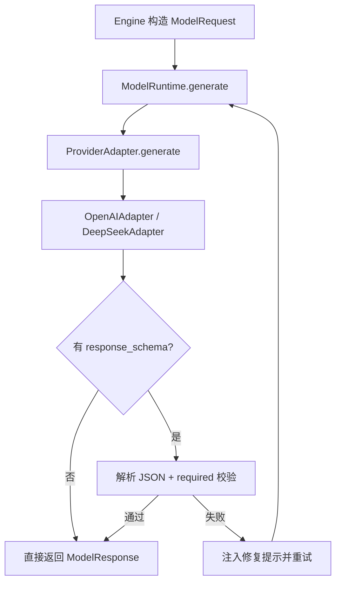

# 《从0到1工业级Agent框架打造》第四章：Model Runtime 真调用打通（OpenAI / DeepSeek）

## 目标

1. 前置集成通用配置与日志模块，形成统一运行基础。
2. 建立统一 `ModelRequest/ModelResponse` 契约，支持 `**kwargs` 透传。
3. 落地两个真实适配器：`OpenAIAdapter` 和 `DeepSeekAdapter`。
4. 实现 Runtime 自愈链路，并完成 DeepSeek 线上真实调用打通。

## 前置条件

1. 已完成第三章（Engine 可运行）。
2. 当前环境可执行：`uv run pytest tests/unit/test_engine.py -q`。
3. 在仓库根目录执行命令（包含 `src/`、`tests/`、`docs/`）。

## 章节快照目录

1. 本章独立快照：`examples/from_zero_to_one/chapter_04/`
2. 主线目标目录：`src/agent_forge/`

## 本章怎么学（防止读懵）

1. 先看“术语白话”与主流程图，知道每层职责。
2. 再做“最小测试”，确认代码行为没偏。
3. 最后跑 DeepSeek 真实线上调用，完成本章闭环。

## 先把术语讲成人话

1. `support/config`：统一读配置，不让各模块自己到处 `os.getenv`。
2. `support/logging`：统一日志格式，不让日志风格碎片化。
3. `Adapter`：翻译层，把框架请求翻译成厂商 SDK 参数。
4. `**kwargs` 透传：厂商新参数无需改框架也能传下去。
5. `Self-healing`：输出格式错了，系统自动补提示再试一次。

## 先讲“面”：Model Runtime 主流程



## 创建目录与文件命令（硬标准）

不要一口气全部创建。按下面顺序，走到对应代码步骤时再执行下一条命令。

Bash（分步执行）：
1. `mkdir -p examples/from_zero_to_one/chapter_04`
2. `mkdir -p examples/from_zero_to_one/chapter_04/src/agent_forge`
3. `mkdir -p examples/from_zero_to_one/chapter_04/src/agent_forge/apps`
4. `mkdir -p examples/from_zero_to_one/chapter_04/src/agent_forge/components/engine`
5. `mkdir -p examples/from_zero_to_one/chapter_04/src/agent_forge/components/engine/application`
6. `mkdir -p examples/from_zero_to_one/chapter_04/src/agent_forge/components/engine/domain`
7. `mkdir -p examples/from_zero_to_one/chapter_04/src/agent_forge/components/engine/infrastructure`
8. `mkdir -p examples/from_zero_to_one/chapter_04/src/agent_forge/components/model_runtime`
9. `mkdir -p examples/from_zero_to_one/chapter_04/src/agent_forge/components/model_runtime/application`
10. `mkdir -p examples/from_zero_to_one/chapter_04/src/agent_forge/components/model_runtime/domain`
11. `mkdir -p examples/from_zero_to_one/chapter_04/src/agent_forge/components/model_runtime/infrastructure`
12. `mkdir -p examples/from_zero_to_one/chapter_04/src/agent_forge/components/model_runtime/infrastructure/adapters`
13. `mkdir -p examples/from_zero_to_one/chapter_04/src/agent_forge/components/protocol`
14. `mkdir -p examples/from_zero_to_one/chapter_04/src/agent_forge/components/protocol/application`
15. `mkdir -p examples/from_zero_to_one/chapter_04/src/agent_forge/components/protocol/domain`
16. `mkdir -p examples/from_zero_to_one/chapter_04/src/agent_forge/components/protocol/infrastructure`
17. `mkdir -p examples/from_zero_to_one/chapter_04/src/agent_forge/support`
18. `mkdir -p examples/from_zero_to_one/chapter_04/src/agent_forge/support/config`
19. `mkdir -p examples/from_zero_to_one/chapter_04/src/agent_forge/support/errors`
20. `mkdir -p examples/from_zero_to_one/chapter_04/src/agent_forge/support/logging`
21. `mkdir -p examples/from_zero_to_one/chapter_04/src/agent_forge/support/typing`
22. `mkdir -p examples/from_zero_to_one/chapter_04/tests`
23. `mkdir -p examples/from_zero_to_one/chapter_04/tests/unit`
24. `touch examples/from_zero_to_one/chapter_04/pyproject.toml`
25. `touch examples/from_zero_to_one/chapter_04/src/agent_forge/__init__.py`
26. `touch examples/from_zero_to_one/chapter_04/src/agent_forge/apps/model_runtime_deepseek_demo.py`
27. `touch examples/from_zero_to_one/chapter_04/src/agent_forge/components/engine/__init__.py`
28. `touch examples/from_zero_to_one/chapter_04/src/agent_forge/components/engine/application/__init__.py`
29. `touch examples/from_zero_to_one/chapter_04/src/agent_forge/components/engine/application/loop.py`
30. `touch examples/from_zero_to_one/chapter_04/src/agent_forge/components/engine/domain/__init__.py`
31. `touch examples/from_zero_to_one/chapter_04/src/agent_forge/components/engine/infrastructure/__init__.py`
32. `touch examples/from_zero_to_one/chapter_04/src/agent_forge/components/model_runtime/__init__.py`
33. `touch examples/from_zero_to_one/chapter_04/src/agent_forge/components/model_runtime/application/__init__.py`
34. `touch examples/from_zero_to_one/chapter_04/src/agent_forge/components/model_runtime/application/runtime.py`
35. `touch examples/from_zero_to_one/chapter_04/src/agent_forge/components/model_runtime/domain/__init__.py`
36. `touch examples/from_zero_to_one/chapter_04/src/agent_forge/components/model_runtime/domain/schemas.py`
37. `touch examples/from_zero_to_one/chapter_04/src/agent_forge/components/model_runtime/infrastructure/__init__.py`
38. `touch examples/from_zero_to_one/chapter_04/src/agent_forge/components/model_runtime/infrastructure/adapters/__init__.py`
39. `touch examples/from_zero_to_one/chapter_04/src/agent_forge/components/model_runtime/infrastructure/adapters/base.py`
40. `touch examples/from_zero_to_one/chapter_04/src/agent_forge/components/model_runtime/infrastructure/adapters/deepseek_adapter.py`
41. `touch examples/from_zero_to_one/chapter_04/src/agent_forge/components/model_runtime/infrastructure/adapters/openai_adapter.py`
42. `touch examples/from_zero_to_one/chapter_04/src/agent_forge/components/model_runtime/infrastructure/adapters/stub.py`
43. `touch examples/from_zero_to_one/chapter_04/src/agent_forge/components/protocol/__init__.py`
44. `touch examples/from_zero_to_one/chapter_04/src/agent_forge/components/protocol/application/__init__.py`
45. `touch examples/from_zero_to_one/chapter_04/src/agent_forge/components/protocol/domain/__init__.py`
46. `touch examples/from_zero_to_one/chapter_04/src/agent_forge/components/protocol/domain/schemas.py`
47. `touch examples/from_zero_to_one/chapter_04/src/agent_forge/components/protocol/infrastructure/__init__.py`
48. `touch examples/from_zero_to_one/chapter_04/src/agent_forge/support/__init__.py`
49. `touch examples/from_zero_to_one/chapter_04/src/agent_forge/support/config/__init__.py`
50. `touch examples/from_zero_to_one/chapter_04/src/agent_forge/support/config/settings.py`
51. `touch examples/from_zero_to_one/chapter_04/src/agent_forge/support/errors/__init__.py`
52. `touch examples/from_zero_to_one/chapter_04/src/agent_forge/support/logging/__init__.py`
53. `touch examples/from_zero_to_one/chapter_04/src/agent_forge/support/logging/logger.py`
54. `touch examples/from_zero_to_one/chapter_04/src/agent_forge/support/typing/__init__.py`
55. `touch examples/from_zero_to_one/chapter_04/tests/conftest.py`
56. `touch examples/from_zero_to_one/chapter_04/tests/unit/test_engine.py`
57. `touch examples/from_zero_to_one/chapter_04/tests/unit/test_model_runtime.py`
58. `touch examples/from_zero_to_one/chapter_04/tests/unit/test_protocol.py`

Windows PowerShell（分步执行）：
1. `New-Item -ItemType Directory -Force "examples\from_zero_to_one\chapter_04" | Out-Null`
2. `New-Item -ItemType Directory -Force "examples\from_zero_to_one\chapter_04\src\agent_forge" | Out-Null`
3. `New-Item -ItemType Directory -Force "examples\from_zero_to_one\chapter_04\src\agent_forge\apps" | Out-Null`
4. `New-Item -ItemType Directory -Force "examples\from_zero_to_one\chapter_04\src\agent_forge\components\engine" | Out-Null`
5. `New-Item -ItemType Directory -Force "examples\from_zero_to_one\chapter_04\src\agent_forge\components\engine\application" | Out-Null`
6. `New-Item -ItemType Directory -Force "examples\from_zero_to_one\chapter_04\src\agent_forge\components\engine\domain" | Out-Null`
7. `New-Item -ItemType Directory -Force "examples\from_zero_to_one\chapter_04\src\agent_forge\components\engine\infrastructure" | Out-Null`
8. `New-Item -ItemType Directory -Force "examples\from_zero_to_one\chapter_04\src\agent_forge\components\model_runtime" | Out-Null`
9. `New-Item -ItemType Directory -Force "examples\from_zero_to_one\chapter_04\src\agent_forge\components\model_runtime\application" | Out-Null`
10. `New-Item -ItemType Directory -Force "examples\from_zero_to_one\chapter_04\src\agent_forge\components\model_runtime\domain" | Out-Null`
11. `New-Item -ItemType Directory -Force "examples\from_zero_to_one\chapter_04\src\agent_forge\components\model_runtime\infrastructure" | Out-Null`
12. `New-Item -ItemType Directory -Force "examples\from_zero_to_one\chapter_04\src\agent_forge\components\model_runtime\infrastructure\adapters" | Out-Null`
13. `New-Item -ItemType Directory -Force "examples\from_zero_to_one\chapter_04\src\agent_forge\components\protocol" | Out-Null`
14. `New-Item -ItemType Directory -Force "examples\from_zero_to_one\chapter_04\src\agent_forge\components\protocol\application" | Out-Null`
15. `New-Item -ItemType Directory -Force "examples\from_zero_to_one\chapter_04\src\agent_forge\components\protocol\domain" | Out-Null`
16. `New-Item -ItemType Directory -Force "examples\from_zero_to_one\chapter_04\src\agent_forge\components\protocol\infrastructure" | Out-Null`
17. `New-Item -ItemType Directory -Force "examples\from_zero_to_one\chapter_04\src\agent_forge\support" | Out-Null`
18. `New-Item -ItemType Directory -Force "examples\from_zero_to_one\chapter_04\src\agent_forge\support\config" | Out-Null`
19. `New-Item -ItemType Directory -Force "examples\from_zero_to_one\chapter_04\src\agent_forge\support\errors" | Out-Null`
20. `New-Item -ItemType Directory -Force "examples\from_zero_to_one\chapter_04\src\agent_forge\support\logging" | Out-Null`
21. `New-Item -ItemType Directory -Force "examples\from_zero_to_one\chapter_04\src\agent_forge\support\typing" | Out-Null`
22. `New-Item -ItemType Directory -Force "examples\from_zero_to_one\chapter_04\tests" | Out-Null`
23. `New-Item -ItemType Directory -Force "examples\from_zero_to_one\chapter_04\tests\unit" | Out-Null`
24. `New-Item -ItemType File -Force "examples\from_zero_to_one\chapter_04\pyproject.toml" | Out-Null`
25. `New-Item -ItemType File -Force "examples\from_zero_to_one\chapter_04\src\agent_forge\__init__.py" | Out-Null`
26. `New-Item -ItemType File -Force "examples\from_zero_to_one\chapter_04\src\agent_forge\apps\model_runtime_deepseek_demo.py" | Out-Null`
27. `New-Item -ItemType File -Force "examples\from_zero_to_one\chapter_04\src\agent_forge\components\engine\__init__.py" | Out-Null`
28. `New-Item -ItemType File -Force "examples\from_zero_to_one\chapter_04\src\agent_forge\components\engine\application\__init__.py" | Out-Null`
29. `New-Item -ItemType File -Force "examples\from_zero_to_one\chapter_04\src\agent_forge\components\engine\application\loop.py" | Out-Null`
30. `New-Item -ItemType File -Force "examples\from_zero_to_one\chapter_04\src\agent_forge\components\engine\domain\__init__.py" | Out-Null`
31. `New-Item -ItemType File -Force "examples\from_zero_to_one\chapter_04\src\agent_forge\components\engine\infrastructure\__init__.py" | Out-Null`
32. `New-Item -ItemType File -Force "examples\from_zero_to_one\chapter_04\src\agent_forge\components\model_runtime\__init__.py" | Out-Null`
33. `New-Item -ItemType File -Force "examples\from_zero_to_one\chapter_04\src\agent_forge\components\model_runtime\application\__init__.py" | Out-Null`
34. `New-Item -ItemType File -Force "examples\from_zero_to_one\chapter_04\src\agent_forge\components\model_runtime\application\runtime.py" | Out-Null`
35. `New-Item -ItemType File -Force "examples\from_zero_to_one\chapter_04\src\agent_forge\components\model_runtime\domain\__init__.py" | Out-Null`
36. `New-Item -ItemType File -Force "examples\from_zero_to_one\chapter_04\src\agent_forge\components\model_runtime\domain\schemas.py" | Out-Null`
37. `New-Item -ItemType File -Force "examples\from_zero_to_one\chapter_04\src\agent_forge\components\model_runtime\infrastructure\__init__.py" | Out-Null`
38. `New-Item -ItemType File -Force "examples\from_zero_to_one\chapter_04\src\agent_forge\components\model_runtime\infrastructure\adapters\__init__.py" | Out-Null`
39. `New-Item -ItemType File -Force "examples\from_zero_to_one\chapter_04\src\agent_forge\components\model_runtime\infrastructure\adapters\base.py" | Out-Null`
40. `New-Item -ItemType File -Force "examples\from_zero_to_one\chapter_04\src\agent_forge\components\model_runtime\infrastructure\adapters\deepseek_adapter.py" | Out-Null`
41. `New-Item -ItemType File -Force "examples\from_zero_to_one\chapter_04\src\agent_forge\components\model_runtime\infrastructure\adapters\openai_adapter.py" | Out-Null`
42. `New-Item -ItemType File -Force "examples\from_zero_to_one\chapter_04\src\agent_forge\components\model_runtime\infrastructure\adapters\stub.py" | Out-Null`
43. `New-Item -ItemType File -Force "examples\from_zero_to_one\chapter_04\src\agent_forge\components\protocol\__init__.py" | Out-Null`
44. `New-Item -ItemType File -Force "examples\from_zero_to_one\chapter_04\src\agent_forge\components\protocol\application\__init__.py" | Out-Null`
45. `New-Item -ItemType File -Force "examples\from_zero_to_one\chapter_04\src\agent_forge\components\protocol\domain\__init__.py" | Out-Null`
46. `New-Item -ItemType File -Force "examples\from_zero_to_one\chapter_04\src\agent_forge\components\protocol\domain\schemas.py" | Out-Null`
47. `New-Item -ItemType File -Force "examples\from_zero_to_one\chapter_04\src\agent_forge\components\protocol\infrastructure\__init__.py" | Out-Null`
48. `New-Item -ItemType File -Force "examples\from_zero_to_one\chapter_04\src\agent_forge\support\__init__.py" | Out-Null`
49. `New-Item -ItemType File -Force "examples\from_zero_to_one\chapter_04\src\agent_forge\support\config\__init__.py" | Out-Null`
50. `New-Item -ItemType File -Force "examples\from_zero_to_one\chapter_04\src\agent_forge\support\config\settings.py" | Out-Null`
51. `New-Item -ItemType File -Force "examples\from_zero_to_one\chapter_04\src\agent_forge\support\errors\__init__.py" | Out-Null`
52. `New-Item -ItemType File -Force "examples\from_zero_to_one\chapter_04\src\agent_forge\support\logging\__init__.py" | Out-Null`
53. `New-Item -ItemType File -Force "examples\from_zero_to_one\chapter_04\src\agent_forge\support\logging\logger.py" | Out-Null`
54. `New-Item -ItemType File -Force "examples\from_zero_to_one\chapter_04\src\agent_forge\support\typing\__init__.py" | Out-Null`
55. `New-Item -ItemType File -Force "examples\from_zero_to_one\chapter_04\tests\conftest.py" | Out-Null`
56. `New-Item -ItemType File -Force "examples\from_zero_to_one\chapter_04\tests\unit\test_engine.py" | Out-Null`
57. `New-Item -ItemType File -Force "examples\from_zero_to_one\chapter_04\tests\unit\test_model_runtime.py" | Out-Null`
58. `New-Item -ItemType File -Force "examples\from_zero_to_one\chapter_04\tests\unit\test_protocol.py" | Out-Null`

## 实施步骤

### 第 1 步：先前置 support（config + logging）

文件：[src/agent_forge/support/config/settings.py](../../src/agent_forge/support/config/settings.py)

```python
"""统一配置模块（辅助能力，不纳入 core 主干）。"""

from __future__ import annotations

from dotenv import load_dotenv
from pydantic import Field
from pydantic_settings import BaseSettings, SettingsConfigDict

# 1. 在导入阶段加载 .env，保证 Settings 初始化时可读到环境变量。
load_dotenv(override=False)


class AppConfig(BaseSettings):
    """应用配置单一事实源。"""

    environment: str = Field(default="development", description="运行环境")
    debug: bool = Field(default=False, description="是否开启调试")
    log_level: str = Field(default="INFO", description="日志级别")

    openai_api_key: str | None = Field(default=None, description="OpenAI API Key")
    deepseek_api_key: str | None = Field(default=None, description="DeepSeek API Key")
    openai_base_url: str = Field(default="https://api.openai.com/v1", description="OpenAI Base URL")
    deepseek_base_url: str = Field(default="https://api.deepseek.com/v1", description="DeepSeek Base URL")
    openai_model: str = Field(default="gpt-4o-mini", description="OpenAI 默认模型")
    deepseek_model: str = Field(default="deepseek-chat", description="DeepSeek 默认模型")

    model_config = SettingsConfigDict(
        env_file=".env",
        env_file_encoding="utf-8",
        env_prefix="AF_",
        extra="ignore",
    )


# 2. 全局单例，供 Adapter/Runtime 等读取配置。
settings = AppConfig()
```

文件：[src/agent_forge/support/logging/logger.py](../../src/agent_forge/support/logging/logger.py)

```python
"""统一日志模块（辅助能力，不纳入 core 主干）。"""

from __future__ import annotations

import logging
import sys

from agent_forge.support.config import settings

_LOG_FORMAT = "%(asctime)s | %(levelname)-7s | %(name)s | %(message)s"
_DATE_FORMAT = "%Y-%m-%d %H:%M:%S"
_BOOTSTRAPPED = False


def _bootstrap_root_logger() -> None:
    global _BOOTSTRAPPED
    if _BOOTSTRAPPED:
        return
    level = getattr(logging, settings.log_level.upper(), logging.INFO)
    handler = logging.StreamHandler(sys.stdout)
    handler.setFormatter(logging.Formatter(fmt=_LOG_FORMAT, datefmt=_DATE_FORMAT))
    root_logger = logging.getLogger("agent_forge")
    root_logger.setLevel(level)
    root_logger.handlers.clear()
    root_logger.addHandler(handler)
    root_logger.propagate = False
    _BOOTSTRAPPED = True


def get_logger(name: str) -> logging.Logger:
    """获取框架统一 logger。"""

    # 1. 首次调用时初始化基础日志管道。
    _bootstrap_root_logger()
    # 2. 子模块 logger 统一挂在 agent_forge 命名空间下。
    return logging.getLogger(f"agent_forge.{name}")
```

代码讲解：

1. 设计意图：先把基础设施统一，再做业务组件，避免后续返工。
2. 工程取舍：support 不算主干组件，但必须“先有再用”。
3. 边界条件：环境变量统一 `AF_` 前缀，避免污染。
4. 失败模式：如果每个模块各自读配置、各自打日志，线上排障会碎片化。

### 第 2 步：统一模型契约（domain）

文件：[src/agent_forge/components/model_runtime/domain/schemas.py](../../src/agent_forge/components/model_runtime/domain/schemas.py)

```python
"""Model 组件（大模型契约层）。

目标：
1. 统一请求与响应结构，屏蔽底层厂商差异。
2. 规范化错误类型（超时、限流、解析失败等）。
3. 标准化成本域统计（Token、Latency、Cost）。
"""

from __future__ import annotations

from typing import Any

from pydantic import BaseModel, ConfigDict, Field

from agent_forge.components.protocol import AgentMessage, ToolCall


class ModelStats(BaseModel):
    """请求统计信息。"""

    prompt_tokens: int = Field(default=0, ge=0, description="输入 Token 数")
    completion_tokens: int = Field(default=0, ge=0, description="输出 Token 数")
    total_tokens: int = Field(default=0, ge=0, description="总 Token 数")
    latency_ms: int = Field(default=0, ge=0, description="请求耗时（毫秒）")
    cost_usd: float | None = Field(default=None, ge=0.0, description="预估成本（美元）")


class ModelRequest(BaseModel):
    """统一模型调用请求。"""

    # 允许通过 `ModelRequest(..., **kwargs)` 直接透传厂商特定参数。
    model_config = ConfigDict(extra="allow")

    messages: list[AgentMessage] = Field(..., description="上下文消息列表")
    system_prompt: str | None = Field(default=None, description="系统提示词（若单独提供）")
    model: str | None = Field(default=None, description="覆盖默认模型名")
    temperature: float = Field(default=0.7, ge=0.0, le=2.0, description="采样温度")
    max_tokens: int | None = Field(default=None, ge=1, description="最大生成 Token 数")
    response_schema: dict[str, Any] | None = Field(default=None, description="期望的 JSON Schema 输出结构")
    tools: list[dict[str, Any]] | None = Field(default=None, description="可用工具列表")
    stream: bool = Field(default=False, description="是否流式返回")

    def extra_kwargs(self) -> dict[str, Any]:
        """返回通过 `**kwargs` 透传的额外参数。"""

        return dict(self.model_extra or {})


class ModelResponse(BaseModel):
    """统一模型调用响应。"""

    content: str = Field(default="", description="响应文本")
    parsed_output: dict[str, Any] | None = Field(default=None, description="结构化解析结果")
    tool_calls: list[ToolCall] = Field(default_factory=list, description="模型决定的工具调用")
    stats: ModelStats = Field(default_factory=ModelStats, description="本次请求统计")


class ModelError(Exception):
    """模型运行时统一异常基类。"""

    def __init__(self, error_code: str, message: str, retryable: bool = False):
        super().__init__(message)
        self.error_code = error_code
        self.message = message
        self.retryable = retryable


class ModelTimeoutError(ModelError):
    def __init__(self, message: str = "模型请求超时"):
        super().__init__("MODEL_TIMEOUT", message, retryable=True)


class ModelRateLimitError(ModelError):
    def __init__(self, message: str = "模型请求被限流"):
        super().__init__("MODEL_RATE_LIMIT", message, retryable=True)


class ModelParseError(ModelError):
    def __init__(self, message: str, raw_content: str):
        super().__init__("MODEL_PARSE_ERROR", message, retryable=True)
        self.raw_content = raw_content


class ModelAuthenticationError(ModelError):
    def __init__(self, message: str = "API 密钥无效或未授权"):
        super().__init__("MODEL_AUTH_ERROR", message, retryable=False)
```

代码讲解：

1. 设计意图：把“接口稳定性”从厂商层抽出来。
2. 取舍：高频参数做显式字段，长尾参数走 `extra="allow"`。
3. 边界：透传参数只保证“往下传”，不保证厂商接受。
4. 失败模式：没有统一错误码，上层无法稳定决定重试/终止。

### 第 3 步：真实适配器（OpenAI + DeepSeek）

文件：[src/agent_forge/components/model_runtime/infrastructure/adapters/base.py](../../src/agent_forge/components/model_runtime/infrastructure/adapters/base.py)

关键点：

1. `OpenAICompatibleAdapter` 统一了 payload 构建、异常映射、统计映射。
2. `request.extra_kwargs()` + `runtime.generate(..., **kwargs)` 组成两层透传覆盖链。
3. `timeout_ms` 统一转秒给 OpenAI SDK。

文件：[src/agent_forge/components/model_runtime/infrastructure/adapters/openai_adapter.py](../../src/agent_forge/components/model_runtime/infrastructure/adapters/openai_adapter.py)  
文件：[src/agent_forge/components/model_runtime/infrastructure/adapters/deepseek_adapter.py](../../src/agent_forge/components/model_runtime/infrastructure/adapters/deepseek_adapter.py)

这两个文件只保留 provider 差异配置，不重复通用逻辑。

代码讲解：

1. 设计意图：共性上收，差异下沉。
2. 取舍：兼容 OpenAI 协议意味着接入 DeepSeek 成本最低。
3. 边界：若厂商协议分叉严重，需要新增独立 adapter。
4. 失败模式：如果每家都复制一套逻辑，改一次 bug 要改多处。

### 第 4 步：Runtime 自愈控制层

文件：[src/agent_forge/components/model_runtime/application/runtime.py](../../src/agent_forge/components/model_runtime/application/runtime.py)

主流程（人话）：

1. 调 adapter 拿结果。
2. 如果没要求结构化，直接返回。
3. 如果要求结构化，解析 JSON + 检查 required。
4. 如果失败，自动补“修复提示”并重试（有上限）。

代码讲解：

1. 设计意图：调用失败可控，不要把异常直接甩给上游。
2. 取舍：先做轻 schema 校验，后续可替换为更严格校验器。
3. 边界：`max_retries` 只是上限，不保证一定成功。
4. 失败模式：不做 deep copy 会污染调用方传入 request。

### 第 5 步：最小测试（先证明行为）

文件：[tests/unit/test_model_runtime.py](../../tests/unit/test_model_runtime.py)

最小命令：

```bash
uv run pytest tests/unit/test_model_runtime.py -q
```

这组测试覆盖：

1. OpenAI / DeepSeek stub 切换。
2. `ModelRequest(..., **kwargs)` 透传。
3. `runtime.generate(..., **kwargs)` 覆盖透传。
4. 结构化输出 + 自愈重试上限。

### 第 6 步：DeepSeek 线上真实调用手动打通（非测试用例）

文件：[src/agent_forge/apps/model_runtime_deepseek_demo.py](../../src/agent_forge/apps/model_runtime_deepseek_demo.py)

```python
"""DeepSeek real-call demo for chapter 04."""

from __future__ import annotations

import json
import sys
from typing import Any

from agent_forge.components.model_runtime import DeepSeekAdapter, ModelRequest, ModelRuntime
from agent_forge.components.protocol import AgentMessage
from agent_forge.support.config import settings
from agent_forge.support.logging import get_logger

logger = get_logger(__name__)


def build_deepseek_request(user_input: str) -> ModelRequest:
    """Build a structured-output request for DeepSeek."""

    return ModelRequest(
        messages=[AgentMessage(role="user", content=user_input)],
        model=settings.deepseek_model,
        temperature=0.2,
        max_tokens=512,
        timeout_ms=30000,
        response_schema={
            "type": "object",
            "properties": {
                "answer": {"type": "string"},
                "confidence": {"type": "number"},
            },
            "required": ["answer", "confidence"],
        },
    )


def run_deepseek_once(user_input: str, runtime: ModelRuntime | None = None) -> dict[str, Any]:
    """Run one DeepSeek call through model runtime and return normalized output."""

    # 1. Ensure runtime is ready; if caller didn't inject one, create real DeepSeek runtime.
    if runtime is None:
        if not settings.deepseek_api_key:
            raise RuntimeError("Missing AF_DEEPSEEK_API_KEY; set it before running this demo.")
        runtime = ModelRuntime(adapter=DeepSeekAdapter(), max_retries=1)

    # 2. Build unified request object with structured-output requirement.
    request = build_deepseek_request(user_input)

    # 3. Execute runtime chain (adapter call + optional self-healing parse retry).
    response = runtime.generate(request)

    # 4. Normalize result for CLI and downstream consumers.
    result = {
        "content": response.content,
        "parsed_output": response.parsed_output,
        "stats": response.stats.model_dump(),
    }

    # 5. Log one compact summary for troubleshooting.
    logger.info(
        "deepseek_demo completed | total_tokens=%s latency_ms=%s",
        result["stats"]["total_tokens"],
        result["stats"]["latency_ms"],
    )
    return result


def main(argv: list[str] | None = None) -> int:
    """CLI entrypoint for one-shot DeepSeek runtime demo."""

    args = argv if argv is not None else sys.argv[1:]
    prompt = args[0] if args else "请用一句话解释什么是劳动仲裁。"
    result = run_deepseek_once(prompt)
    print(json.dumps(result, ensure_ascii=False, indent=2))
    return 0


if __name__ == "__main__":
    raise SystemExit(main())
```

真实打通命令（PowerShell）：

```powershell
$env:AF_DEEPSEEK_API_KEY = "你的 deepseek key"
uv run python -m agent_forge.apps.model_runtime_deepseek_demo "请给出一份劳动仲裁材料准备清单"
```

真实打通命令（Bash）：

```bash
export AF_DEEPSEEK_API_KEY="你的 deepseek key"
uv run python -m agent_forge.apps.model_runtime_deepseek_demo "请给出一份劳动仲裁材料准备清单"
```

手动验证标准：

1. 终端输出是 JSON。
2. 输出含 `content`、`parsed_output`、`stats`。
3. `stats.total_tokens` > 0 且 `stats.latency_ms` > 0。

### 第 7 步：主线同步（chapter_04 -> src/tests）

Bash：

```bash
cp -r examples/from_zero_to_one/chapter_04/src/agent_forge/components/model_runtime src/agent_forge/components/model_runtime
cp -r examples/from_zero_to_one/chapter_04/src/agent_forge/support src/agent_forge/support
cp examples/from_zero_to_one/chapter_04/src/agent_forge/apps/model_runtime_deepseek_demo.py src/agent_forge/apps/model_runtime_deepseek_demo.py
cp examples/from_zero_to_one/chapter_04/tests/unit/test_model_runtime.py tests/unit/test_model_runtime.py
```

PowerShell：

```powershell
Copy-Item examples/from_zero_to_one/chapter_04/src/agent_forge/components/model_runtime src/agent_forge/components/model_runtime -Recurse -Force
Copy-Item examples/from_zero_to_one/chapter_04/src/agent_forge/support src/agent_forge/support -Recurse -Force
Copy-Item examples/from_zero_to_one/chapter_04/src/agent_forge/apps/model_runtime_deepseek_demo.py src/agent_forge/apps/model_runtime_deepseek_demo.py -Force
Copy-Item examples/from_zero_to_one/chapter_04/tests/unit/test_model_runtime.py tests/unit/test_model_runtime.py -Force
```

## 运行命令

最小回归：

```bash
uv run pytest tests/unit/test_model_runtime.py -q
```

关联回归：

```bash
uv run pytest tests/unit/test_protocol.py tests/unit/test_engine.py tests/unit/test_model_runtime.py -q
```

## 验证清单

1. `ModelRequest(..., **kwargs)` 能透传参数。
2. `runtime.generate(..., **kwargs)` 能覆盖请求透传参数。
3. `OpenAIAdapter/DeepSeekAdapter` 返回统一 `ModelResponse`。
4. 自愈重试不会无限循环。
5. DeepSeek 真实调用可手动打通并拿到结构化输出。

## 常见问题

1. 报错：`MODEL_AUTH_ERROR`  
修复：检查 `AF_DEEPSEEK_API_KEY` / `AF_OPENAI_API_KEY`。

2. 报错：`JSON 格式非法`  
修复：提示词增加“仅输出 JSON”，并检查 `response_schema.required`。

3. 报错：`Missing AF_DEEPSEEK_API_KEY`  
修复：先设置环境变量再运行 demo 脚本。


