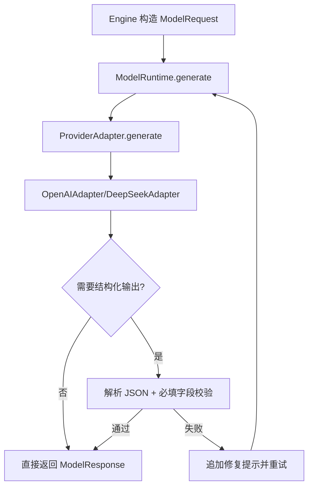

# 《从0到1工业级Agent框架打造》第四章：Model Runtime 大模型适配与防崩塌控制

## 目标

1. 建立统一 `ModelRequest/ModelResponse` 契约，并支持动态参数透传 `**kwargs`。
2. 落地两个真实适配器：`OpenAIAdapter` 与 `DeepSeekAdapter`（基于 OpenAI 兼容协议）。
3. 将日志与配置抽到 `support` 辅助层，不污染 `core` 主干组件边界。

## 前置条件

1. 已完成 Protocol 与 Engine 章节。
2. Python 3.11+，并在项目根目录执行命令。
3. 已安装 `uv`。

## 实施步骤

### 主流程（先讲面）



### 第 1 步：实现辅助模块（support 层）

文件：[src/agent_forge/support/config.py](../../src/agent_forge/support/config.py)

```python
"""统一配置模块（辅助能力，不纳入 core 主干）。"""

from __future__ import annotations

from dotenv import load_dotenv
from pydantic import Field
from pydantic_settings import BaseSettings, SettingsConfigDict

# 1. 在导入阶段加载 .env，保证 Settings 初始化时可读到环境变量。
load_dotenv(override=False)


class AppConfig(BaseSettings):
    """应用配置单一事实源。"""

    environment: str = Field(default="development", description="运行环境")
    debug: bool = Field(default=False, description="是否开启调试")
    log_level: str = Field(default="INFO", description="日志级别")

    openai_api_key: str | None = Field(default=None, description="OpenAI API Key")
    deepseek_api_key: str | None = Field(default=None, description="DeepSeek API Key")
    openai_base_url: str = Field(default="https://api.openai.com/v1", description="OpenAI Base URL")
    deepseek_base_url: str = Field(default="https://api.deepseek.com/v1", description="DeepSeek Base URL")
    openai_model: str = Field(default="gpt-4o-mini", description="OpenAI 默认模型")
    deepseek_model: str = Field(default="deepseek-chat", description="DeepSeek 默认模型")

    model_config = SettingsConfigDict(
        env_file=".env",
        env_file_encoding="utf-8",
        env_prefix="LA_",
        extra="ignore",
    )


# 2. 全局单例，供 Adapter/Runtime 等读取配置。
settings = AppConfig()
```

代码讲解：

1. `load_dotenv()` 在导入时执行，保证本地 `.env` 能被 `BaseSettings` 直接读取。
2. `env_prefix="LA_"` 避免环境变量与系统变量冲突，边界更清晰。

文件：[src/agent_forge/support/logger.py](../../src/agent_forge/support/logger.py)

```python
"""统一日志模块（辅助能力，不纳入 core 主干）。"""

from __future__ import annotations

import logging
import sys

from agent_forge.support.config import settings

_LOG_FORMAT = "%(asctime)s | %(levelname)-7s | %(name)s | %(message)s"
_DATE_FORMAT = "%Y-%m-%d %H:%M:%S"
_BOOTSTRAPPED = False


def _bootstrap_root_logger() -> None:
    global _BOOTSTRAPPED
    if _BOOTSTRAPPED:
        return
    level = getattr(logging, settings.log_level.upper(), logging.INFO)
    handler = logging.StreamHandler(sys.stdout)
    handler.setFormatter(logging.Formatter(fmt=_LOG_FORMAT, datefmt=_DATE_FORMAT))
    root_logger = logging.getLogger("agent_forge")
    root_logger.setLevel(level)
    root_logger.handlers.clear()
    root_logger.addHandler(handler)
    root_logger.propagate = False
    _BOOTSTRAPPED = True


def get_logger(name: str) -> logging.Logger:
    """获取框架统一 logger。"""

    # 1. 首次调用时初始化基础日志管道。
    _bootstrap_root_logger()
    # 2. 子模块 logger 统一挂在 agent_forge 命名空间下。
    return logging.getLogger(f"agent_forge.{name}")
```

代码讲解：

1. 只初始化一次 root handler，避免多模块重复打印。
2. 统一命名空间 `agent_forge.*`，方便后续日志采集规则配置。

### 第 2 步：扩展 ModelRequest（支持动态透传）

文件：[src/agent_forge/components/model_runtime/domain/schemas.py](../../src/agent_forge/components/model_runtime/domain/schemas.py)

```python
"""Model 组件（大模型契约层）。"""

from __future__ import annotations

from typing import Any, Literal

from pydantic import BaseModel, ConfigDict, Field

from agent_forge.components.protocol import AgentMessage, ToolCall


class ModelStats(BaseModel):
    prompt_tokens: int = Field(default=0, ge=0)
    completion_tokens: int = Field(default=0, ge=0)
    total_tokens: int = Field(default=0, ge=0)
    latency_ms: int = Field(default=0, ge=0)
    cost_usd: float | None = Field(default=None, ge=0.0)


class ModelRequest(BaseModel):
    messages: list[AgentMessage]
    system_prompt: str | None = None
    model: str | None = None
    temperature: float = Field(default=0.7, ge=0.0, le=2.0)
    top_p: float | None = Field(default=None, ge=0.0, le=1.0)
    frequency_penalty: float | None = Field(default=None, ge=-2.0, le=2.0)
    presence_penalty: float | None = Field(default=None, ge=-2.0, le=2.0)
    seed: int | None = None
    n: int | None = Field(default=None, ge=1)
    max_tokens: int | None = Field(default=None, ge=1)
    stop: str | list[str] | None = None
    timeout_ms: int | None = Field(default=None, ge=1)
    user: str | None = None
    request_id: str | None = None
    response_schema: dict[str, Any] | None = None
    tools: list[dict[str, Any]] | None = None
    tool_choice: Literal["none", "auto", "required"] | dict[str, Any] | None = None
    parallel_tool_calls: bool | None = None
    response_format: dict[str, Any] | None = None
    metadata: dict[str, Any] = Field(default_factory=dict)
    stream: bool = False
    model_config = ConfigDict(extra="allow")\r\n\r\n    def extra_kwargs(self) -> dict[str, Any]:\r\n        return dict(self.model_extra or {})


class ModelResponse(BaseModel):
    content: str = ""
    parsed_output: dict[str, Any] | None = None
    tool_calls: list[ToolCall] = Field(default_factory=list)
    stats: ModelStats = Field(default_factory=ModelStats)


class ModelError(Exception):
    def __init__(self, error_code: str, message: str, retryable: bool = False):
        super().__init__(message)
        self.error_code = error_code
        self.message = message
        self.retryable = retryable


class ModelTimeoutError(ModelError):
    def __init__(self, message: str = "模型请求超时"):
        super().__init__("MODEL_TIMEOUT", message, retryable=True)


class ModelRateLimitError(ModelError):
    def __init__(self, message: str = "模型请求被限流"):
        super().__init__("MODEL_RATE_LIMIT", message, retryable=True)


class ModelParseError(ModelError):
    def __init__(self, message: str, raw_content: str):
        super().__init__("MODEL_PARSE_ERROR", message, retryable=True)
        self.raw_content = raw_content


class ModelAuthenticationError(ModelError):
    def __init__(self, message: str = "API 密钥无效或未授权"):
        super().__init__("MODEL_AUTH_ERROR", message, retryable=False)
```

代码讲解：

1. 固定参数字段用于高频通用能力（`temperature/top_p/timeout_ms`），可读性与类型安全更好。
2. `**kwargs` 是可变参数主入口，覆盖新增厂商 Key 时无需改框架。

### 第 3 步：实现真实 OpenAI/DeepSeek 适配器

文件：[src/agent_forge/components/model_runtime/infrastructure/adapters/](../../src/agent_forge/components/model_runtime/infrastructure/adapters/)

```python
"""Provider 适配器层。"""

from __future__ import annotations

import json
import time
from abc import ABC, abstractmethod
from typing import Any

import openai

from agent_forge.components.model_runtime.schemas import (
    ModelAuthenticationError,
    ModelError,
    ModelRateLimitError,
    ModelRequest,
    ModelResponse,
    ModelStats,
    ModelTimeoutError,
)
from agent_forge.components.protocol import ToolCall
from agent_forge.support.config import settings
from agent_forge.support.logging import get_logger

logger = get_logger(__name__)


class ProviderAdapter(ABC):
    @abstractmethod
    def generate(self, request: ModelRequest) -> ModelResponse:
        pass


class OpenAICompatibleAdapter(ProviderAdapter):
    provider_name: str = "openai-compatible"

    def __init__(self, *, api_key: str | None, base_url: str, default_model: str, client: Any | None = None) -> None:
        self.api_key = api_key
        self.base_url = base_url
        self.default_model = default_model
        if not self.api_key:
            logger.warning("%s 未提供 API Key，调用时可能鉴权失败。", self.provider_name)
        self.client = client or openai.Client(api_key=self.api_key, base_url=self.base_url)

    def generate(self, request: ModelRequest) -> ModelResponse:
        # 1. 拼装跨厂商统一 payload
        payload = self._build_payload(request)
        # 2. 调用 SDK 并映射异常
        start_t = time.monotonic()
        try:
            raw_response = self.client.chat.completions.create(**payload)
        except openai.AuthenticationError as exc:
            raise ModelAuthenticationError(str(exc)) from exc
        except openai.RateLimitError as exc:
            raise ModelRateLimitError(str(exc)) from exc
        except openai.APITimeoutError as exc:
            raise ModelTimeoutError(str(exc)) from exc
        except openai.OpenAIError as exc:
            raise ModelError(error_code=f"{self.provider_name.upper()}_ERROR", message=str(exc), retryable=True) from exc
        # 3. 统一转换响应
        latency_ms = int((time.monotonic() - start_t) * 1000)
        choice = raw_response.choices[0]
        usage = raw_response.usage
        return ModelResponse(
            content=(choice.message.content or "").strip(),
            tool_calls=self._extract_tool_calls(choice.message),
            stats=ModelStats(
                prompt_tokens=usage.prompt_tokens if usage else 0,
                completion_tokens=usage.completion_tokens if usage else 0,
                total_tokens=usage.total_tokens if usage else 0,
                latency_ms=latency_ms,
            ),
        )

    def _build_payload(self, request: ModelRequest) -> dict[str, Any]:
        messages: list[dict[str, Any]] = []
        if request.system_prompt:
            messages.append({"role": "system", "content": request.system_prompt})
        for msg in request.messages:
            messages.append({"role": msg.role, "content": msg.content})

        payload: dict[str, Any] = {
            "model": request.model or self.default_model,
            "messages": messages,
            "temperature": request.temperature,
            "stream": request.stream,
        }
        if request.top_p is not None:
            payload["top_p"] = request.top_p
        if request.frequency_penalty is not None:
            payload["frequency_penalty"] = request.frequency_penalty
        if request.presence_penalty is not None:
            payload["presence_penalty"] = request.presence_penalty
        if request.max_tokens is not None:
            payload["max_tokens"] = request.max_tokens
        if request.seed is not None:
            payload["seed"] = request.seed
        if request.n is not None:
            payload["n"] = request.n
        if request.stop is not None:
            payload["stop"] = request.stop
        if request.user:
            payload["user"] = request.user
        if request.timeout_ms is not None:
            payload["timeout"] = request.timeout_ms / 1000
        if request.response_format:
            payload["response_format"] = request.response_format
        if request.tools:
            payload["tools"] = request.tools
        if request.tool_choice is not None:
            payload["tool_choice"] = request.tool_choice
        if request.parallel_tool_calls is not None:
            payload["parallel_tool_calls"] = request.parallel_tool_calls
        if request.metadata:
            payload["metadata"] = request.metadata
        if request.response_schema:
            payload["response_format"] = {
                "type": "json_schema",
                "json_schema": {"name": request.request_id or "model_runtime_schema", "schema": request.response_schema},
            }
        payload.update(request.extra_kwargs())
        return payload

    def _extract_tool_calls(self, message: Any) -> list[ToolCall]:
        tool_calls: list[ToolCall] = []
        raw_tool_calls = getattr(message, "tool_calls", None) or []
        for raw in raw_tool_calls:
            fn = getattr(raw, "function", None)
            fn_name = getattr(fn, "name", None)
            fn_args = getattr(fn, "arguments", "{}")
            tool_id = getattr(raw, "id", None)
            if fn_name and tool_id:
                try:
                    parsed_args = json.loads(fn_args) if isinstance(fn_args, str) else fn_args
                except Exception:
                    parsed_args = {"raw_arguments": fn_args}
                tool_calls.append(
                    ToolCall(tool_call_id=tool_id, tool_name=fn_name, args=parsed_args, principal="model")
                )
        return tool_calls


class OpenAIAdapter(OpenAICompatibleAdapter):
    provider_name = "openai"

    def __init__(self, api_key: str | None = None, base_url: str | None = None, model: str | None = None, client: Any | None = None):
        super().__init__(
            api_key=api_key or settings.openai_api_key,
            base_url=base_url or settings.openai_base_url,
            default_model=model or settings.openai_model,
            client=client,
        )


class DeepSeekAdapter(OpenAICompatibleAdapter):
    provider_name = "deepseek"

    def __init__(self, api_key: str | None = None, base_url: str | None = None, model: str | None = None, client: Any | None = None):
        super().__init__(
            api_key=api_key or settings.deepseek_api_key,
            base_url=base_url or settings.deepseek_base_url,
            default_model=model or settings.deepseek_model,
            client=client,
        )
```

代码讲解：

1. `OpenAICompatibleAdapter` 复用协议共性，`OpenAIAdapter`/`DeepSeekAdapter` 只配置 provider 差异。
2. 透传优先级：基础字段 < `ModelRequest(..., **kwargs)` < `runtime.generate(..., **kwargs)`。

### 第 4 步：Runtime 防崩塌控制

文件：[src/agent_forge/components/model_runtime/application/runtime.py](../../src/agent_forge/components/model_runtime/application/runtime.py)

```python
"""Model Runtime 组件（防崩塌控制层）。"""

from __future__ import annotations

import json
from typing import Any

from agent_forge.components.model_runtime.adapters import ProviderAdapter
from agent_forge.components.model_runtime.schemas import ModelError, ModelParseError, ModelRequest, ModelResponse
from agent_forge.components.protocol import AgentMessage
from agent_forge.support.logging import get_logger

logger = get_logger(__name__)


class ModelRuntime:
    def __init__(self, adapter: ProviderAdapter, max_retries: int = 2):
        self.adapter = adapter
        self.max_retries = max_retries

    def generate(self, request: ModelRequest) -> ModelResponse:
        # 1. 初始化重试上下文
        attempt = 0
        last_error: Exception | None = None
        current_request = request.model_copy(deep=True)
        # 2. 进入重试循环
        while attempt <= self.max_retries:
            try:
                # 3. 调用 provider
                response = self.adapter.generate(current_request)
                # 4. 非结构化模式直接返回
                if not current_request.response_schema:
                    return response
                # 5. 结构化校验
                try:
                    parsed_data = self._parse_json(response.content)
                    self._validate_against_schema(parsed_data, current_request.response_schema)
                    response.parsed_output = parsed_data
                    return response
                except json.JSONDecodeError as json_exc:
                    raise ModelParseError(f"JSON 格式非法: {json_exc}", raw_content=response.content) from json_exc
                except ValueError as val_exc:
                    raise ModelParseError(f"缺少必须结构: {val_exc}", raw_content=response.content) from val_exc
            except ModelError as err:
                last_error = err
                # 6. 不可重试/超上限直接失败
                if not err.retryable or attempt >= self.max_retries:
                    logger.error(f"模型调用失败，超出重试次数或无法重试: {err.error_code}")
                    raise err
                logger.warning(f"由于 {err.error_code} 开启自愈重试 (attempt {attempt + 1}/{self.max_retries})")
                # 7. 组装修复提示并重试
                if isinstance(err, ModelParseError):
                    repair_msg = AgentMessage(
                        role="user",
                        content=(
                            f"你上次的输出无法解析为合法的 JSON 或未满足所需结构限制。\n"
                            f"错误原因: {err.message}\n"
                            f"你上次的原始内容:\n{err.raw_content}\n"
                            f"请按照要求的 JSON schema 纠正输出格式并仅输出有效 JSON。"
                        ),
                    )
                    current_request.messages.append(repair_msg)
                attempt += 1
        raise last_error or RuntimeError("模型循环执行异常到达不可能分支")

    def _parse_json(self, raw_content: str) -> dict[str, Any]:
        content = raw_content.strip()
        if content.startswith("```json"):
            content = content[7:]
        elif content.startswith("```"):
            content = content[3:]
        if content.endswith("```"):
            content = content[:-3]
        return json.loads(content.strip())

    def _validate_against_schema(self, data: dict[str, Any], schema: dict[str, Any]) -> None:
        required_keys = schema.get("required", [])
        missing_keys = [k for k in required_keys if k not in data]
        if missing_keys:
            raise ValueError(f"缺少必填列: {missing_keys}")
```

代码讲解：

1. 重试逻辑只处理 `ModelError`，上游策略清晰，边界可控。
2. `model_copy(deep=True)` 防止重试阶段污染调用方原始请求对象。

### 第 5 步：补测试（验证动态参数与真实适配器）

文件：[tests/unit/test_model_runtime.py](../../tests/unit/test_model_runtime.py)

```python
"""Model Runtime 组件测试。"""

from __future__ import annotations

from types import SimpleNamespace

import pytest

from agent_forge.components.model_runtime import (
    DeepSeekAdapter,
    ModelRequest,
    ModelResponse,
    ModelRuntime,
    ModelStats,
    OpenAIAdapter,
    ProviderAdapter,
    StubDeepSeekAdapter,
    StubOpenAIAdapter,
)
from agent_forge.components.model_runtime.schemas import ModelParseError
from agent_forge.components.protocol import AgentMessage


class _BrokenJSONAdapter(ProviderAdapter):
    def __init__(self, failure_count: int = 1):
        self.failure_count = failure_count
        self.call_count = 0

    def generate(self, request: ModelRequest) -> ModelResponse:
        self.call_count += 1
        if self.call_count <= self.failure_count:
            content = '```json\n{"status": "ok", "missing_key": true\n```'
        else:
            content = '{"status": "ok", "required_key": "fixed_value"}'
        return ModelResponse(
            content=content,
            stats=ModelStats(
                prompt_tokens=10 * self.call_count,
                completion_tokens=5,
                total_tokens=10 * self.call_count + 5,
                latency_ms=100,
                cost_usd=0.001,
            ),
        )


class _FakeCompletions:
    def __init__(self, response: object):
        self.response = response
        self.last_kwargs: dict | None = None

    def create(self, **kwargs: dict) -> object:
        self.last_kwargs = kwargs
        return self.response


def _build_fake_client(content: str = '{"answer":"ok"}') -> tuple[object, _FakeCompletions]:
    usage = SimpleNamespace(prompt_tokens=11, completion_tokens=7, total_tokens=18)
    message = SimpleNamespace(content=content, tool_calls=[])
    choice = SimpleNamespace(message=message)
    response = SimpleNamespace(choices=[choice], usage=usage)
    completions = _FakeCompletions(response=response)
    client = SimpleNamespace(chat=SimpleNamespace(completions=completions))
    return client, completions


def test_provider_stub_switching_and_telemetry() -> None:
    req = ModelRequest(messages=[AgentMessage(role="user", content="hello")])
    openai_adapter = StubOpenAIAdapter(mock_response='{"answer": "openai"}')
    runtime_openai = ModelRuntime(adapter=openai_adapter)
    res_open = runtime_openai.generate(req)
    assert "openai" in res_open.content
    assert res_open.stats.total_tokens == 150

    deepseek_adapter = StubDeepSeekAdapter(mock_response='{"answer": "deepseek"}')
    runtime_deepseek = ModelRuntime(adapter=deepseek_adapter)
    res_deep = runtime_deepseek.generate(req)
    assert "deepseek" in res_deep.content
    assert res_deep.stats.total_tokens == 120


def test_openai_adapter_should_pass_extended_params() -> None:
    client, completions = _build_fake_client('{"answer":"openai"}')
    adapter = OpenAIAdapter(api_key="test-key", model="gpt-4o-mini", client=client)
    runtime = ModelRuntime(adapter=adapter)
    req = ModelRequest(
        messages=[AgentMessage(role="user", content="hello")],
        top_p=0.9,
        frequency_penalty=0.1,
        presence_penalty=0.2,
        seed=42,
        n=1,
        stop=["END"],
        timeout_ms=5000,
        user="u-1",
        metadata={"scene": "unit-test"},
        reasoning_effort="medium",
        top_logprobs=3,
    )
    res = runtime.generate(req)
    kwargs = completions.last_kwargs or {}
    assert res.content == '{"answer":"openai"}'
    assert kwargs["top_p"] == 0.9
    assert kwargs["reasoning_effort"] == "medium"
    assert kwargs["top_logprobs"] == 3


def test_deepseek_adapter_should_use_provider_defaults() -> None:
    client, completions = _build_fake_client('{"answer":"deepseek"}')
    adapter = DeepSeekAdapter(api_key="test-key", model="deepseek-chat", client=client)
    runtime = ModelRuntime(adapter=adapter)
    req = ModelRequest(messages=[AgentMessage(role="user", content="hello deepseek")])
    res = runtime.generate(req)
    kwargs = completions.last_kwargs or {}
    assert kwargs["model"] == "deepseek-chat"
    assert res.stats.total_tokens == 18


def test_structural_output_validation() -> None:
    req = ModelRequest(
        messages=[AgentMessage(role="user", content="hello")],
        response_schema={"required": ["answer", "confidence"]},
    )
    adapter = StubOpenAIAdapter(mock_response='{"answer": "yes", "confidence": 0.99}')
    runtime = ModelRuntime(adapter=adapter)
    res = runtime.generate(req)
    assert res.parsed_output is not None
    assert res.parsed_output["answer"] == "yes"


def test_self_healing_retry_flow_exceeds_limit() -> None:
    req = ModelRequest(
        messages=[AgentMessage(role="user", content="hello")],
        response_schema={"required": ["required_key"]},
    )
    adapter = _BrokenJSONAdapter(failure_count=5)
    runtime = ModelRuntime(adapter=adapter, max_retries=2)
    with pytest.raises(ModelParseError):
        runtime.generate(req)
    assert adapter.call_count == 3
```

代码讲解：

1. 使用 fake client 验证“真实适配器行为”，不依赖网络或真实 Key。
2. 同时保留自愈重试链路测试，防止结构化输出机制回归。

## 运行命令

```bash
uv sync --dev
uv run pytest tests/unit/test_model_runtime.py -q
```

## 验证清单

1. `OpenAIAdapter`、`DeepSeekAdapter` 可直接实例化并返回统一 `ModelResponse`。
2. `ModelRequest(..., **kwargs)` 能透传动态参数 Key（无需改框架代码）。
3. JSON 结构化解析失败会触发自愈重试，并在超限后停止。

## 常见问题

1. 报错：`MODEL_AUTH_ERROR`
修复：检查 `LA_OPENAI_API_KEY` 或 `LA_DEEPSEEK_API_KEY` 是否存在且有效。

2. 报错：`No module named dotenv`
修复：执行 `uv add python-dotenv && uv sync --dev`。

3. 报错：`JSON 格式非法`
修复：优先检查提示词是否要求“只输出 JSON”，并验证 `response_schema` 是否过严。

## 环境准备与缺包兜底步骤（可直接复制）

```bash
uv add openai pydantic-settings python-dotenv
uv add --dev pytest
uv sync --dev
uv run pytest tests/unit/test_model_runtime.py -q
```


