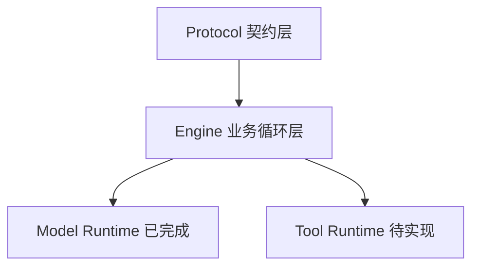
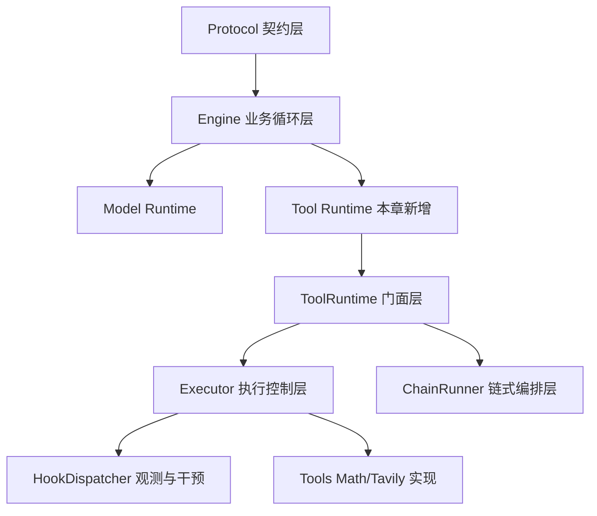
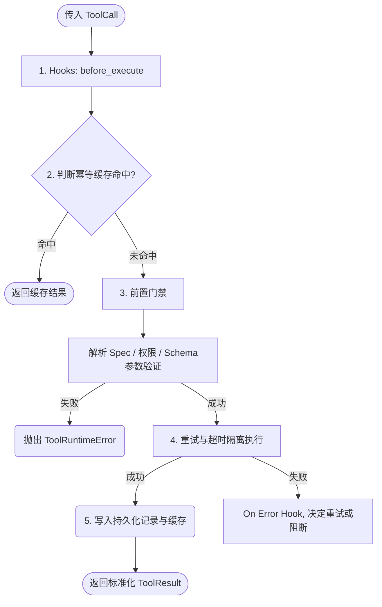
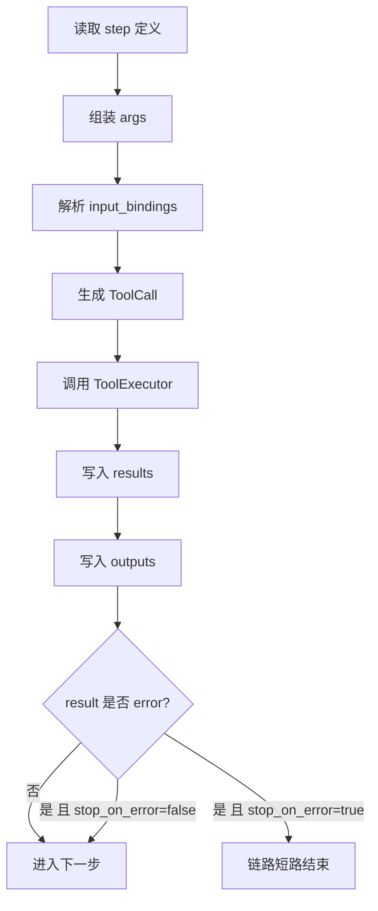
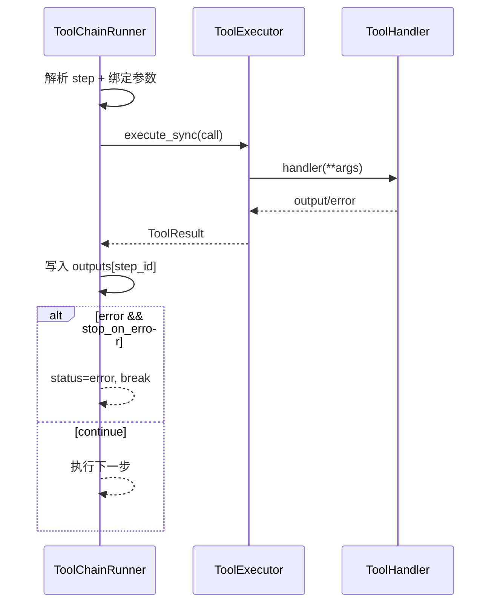
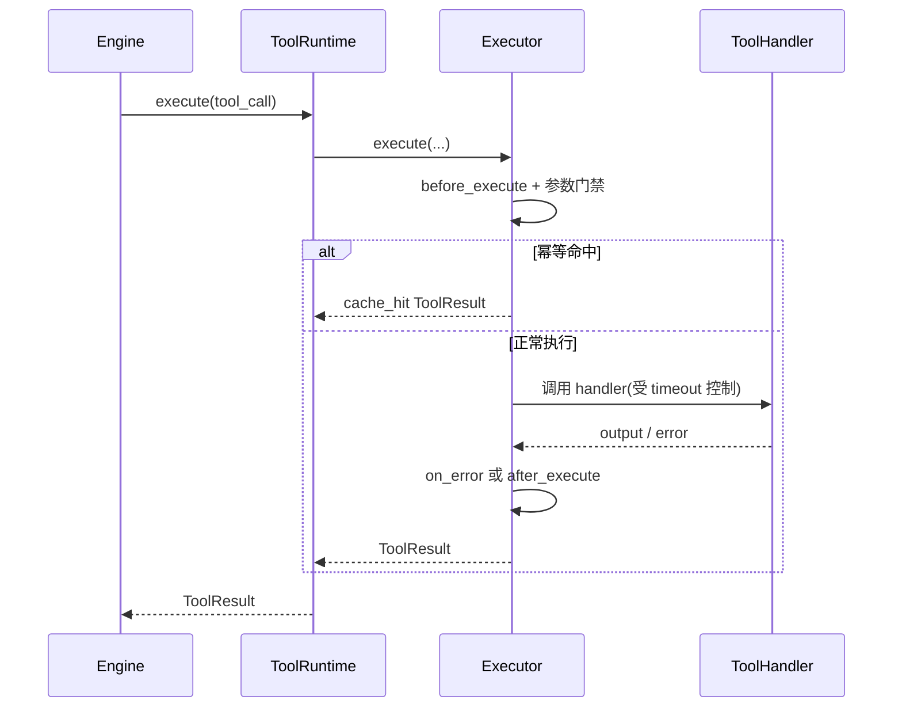

# 《从0到1工业级Agent框架打造》第五章：Tool Runtime 函数调用与隔离执行

## 1️⃣ 本章目标（新增系统能力）

本章完成后，系统将新增以下核心执行能力：

1. **统一工具注册与动态解析**：实现按名称和参数 Schema 动态路由到实际函数。
2. **防暴走隔离执行层**：通过多维策略（幂等缓存、前置拦截参数校验、超时控制、可自愈重试机制）防止工具执行导致主引擎崩溃。
3. **真实工具能力接入**：实现安全的 Python Math 表达式计算与 Tavily 官方网络搜索。
4. **工具全链路可观测**：支持 hooks（before_execute, on_event, on_error, after_execute）机制，与批量异步执行能力。

**本章在整体架构中的定位：**

* 属于核心动作执行层（Action Execution Layer）。
* 它填补了当前架构中“Engine 会产生 ToolCall 意图，却无法安全、可靠地执行真实动作”的缺口。
* 只有当 Model Runtime（大脑）与 Tool Runtime（手脚）都齐备，Engine 才能形成完整的“感知-思考-行动-反馈”闭环。

---

## 2️⃣ 架构位置说明（演进视角）

### 当前系统结构回顾



### 本章新增后的结构



必须说明：

* **新模块依赖谁**：Tool Runtime 依赖 Protocol（以 `ToolCall` 输入，`ToolResult` 输出），不依赖 Engine 或 Model Runtime。
* **谁依赖它**：Engine 后续在执行 (Act) 阶段将依赖它代理并保护所有的动作。
* **依赖方向**：严格按照内聚原则，Engine 依赖 Tool Runtime，Tool Runtime 绝不反向依赖 Engine。

---

## 3️⃣ 前置条件

1. Python >= 3.11
2. 已安装 `uv`
3. 已完成第四章（Model Runtime 可运行，且支持配置文件解析）。
4. 在仓库根目录执行命令

**环境复用验证命令：**

```bash
uv run pytest -q
```
或 PowerShell:
```powershell
uv run pytest -q
```

若失败，必须先修复上一章主流程。

---

## 4️⃣ 本章主线改动范围（强制声明）

### 代码目录

* `src/agent_forge/components/tool_runtime/`
* `examples/tool_runtime/`

### 测试目录

* `tests/unit/`

### 本章涉及的真实文件

* [src/agent_forge/components/tool_runtime/domain/schemas.py](../../src/agent_forge/components/tool_runtime/domain/schemas.py)
* [src/agent_forge/components/tool_runtime/domain/__init__.py](../../src/agent_forge/components/tool_runtime/domain/__init__.py)
* [src/agent_forge/components/tool_runtime/application/utils.py](../../src/agent_forge/components/tool_runtime/application/utils.py)
* [src/agent_forge/components/tool_runtime/application/hooks_dispatcher.py](../../src/agent_forge/components/tool_runtime/application/hooks_dispatcher.py)
* [src/agent_forge/components/tool_runtime/application/executor.py](../../src/agent_forge/components/tool_runtime/application/executor.py)
* [src/agent_forge/components/tool_runtime/application/chain_runner.py](../../src/agent_forge/components/tool_runtime/application/chain_runner.py)
* [src/agent_forge/components/tool_runtime/application/runtime.py](../../src/agent_forge/components/tool_runtime/application/runtime.py)
* [src/agent_forge/components/tool_runtime/application/__init__.py](../../src/agent_forge/components/tool_runtime/application/__init__.py)
* [src/agent_forge/components/tool_runtime/infrastructure/tools/python_math.py](../../src/agent_forge/components/tool_runtime/infrastructure/tools/python_math.py)
* [src/agent_forge/components/tool_runtime/infrastructure/tools/tavily_search.py](../../src/agent_forge/components/tool_runtime/infrastructure/tools/tavily_search.py)
* [src/agent_forge/components/tool_runtime/infrastructure/tools/__init__.py](../../src/agent_forge/components/tool_runtime/infrastructure/tools/__init__.py)
* [src/agent_forge/components/tool_runtime/infrastructure/__init__.py](../../src/agent_forge/components/tool_runtime/infrastructure/__init__.py)
* [src/agent_forge/components/tool_runtime/__init__.py](../../src/agent_forge/components/tool_runtime/__init__.py)
* [examples/tool_runtime/tool_runtime_demo.py](../../examples/tool_runtime/tool_runtime_demo.py)
* [tests/unit/test_tool_runtime.py](../../tests/unit/test_tool_runtime.py)
* [tests/unit/test_tool_runtime_engine_integration.py](../../tests/unit/test_tool_runtime_engine_integration.py)
* [tests/unit/test_tool_runtime_demo.py](../../tests/unit/test_tool_runtime_demo.py)

---

# 5️⃣ 实施步骤（架构驱动顺序）

---

## 本章怎么学（防止读懵）

1. **先讲“面”**：理解 Tool Runtime 在保护什么，而不是仅仅“怎么调用一个函数”。在真实系统中，大模型生成的函数名可能不存在、参数可能缺失或类型错误、工具代码可能死循环。
2. **切分模块**：我们将从 Domain 层契约开始，逐步实现拦截器（Hooks）、执行引擎（Executor）、门面（Runtime）与具体工具实现。
3. **验证闭环**：通过最终的 Demo 脚本完成“安全计算”与“外部网络检索”两条核心链路的真实验证。

---

## 第 1 步：主流程视角（先讲“面”）

Tool Runtime 的执行绝非简单的 `func(**args)`。它必须像沙箱一样保护上层应用：



核心设计包括：
* **门禁前置**：绝不允许非预期的结构化数据进入具体工具函数的栈内。
* **幂等防御**：网络重试产生相同 tool_call_id 时，不重复执行具有副作用的动作。

### 白话例子（先把抽象概念落到真实场景）

假设用户说：  
“帮我查一下 2024 年最低工资标准，再帮我算一下 3.5 年的赔偿基数。”

如果没有 Tool Runtime，常见翻车链路是：

1. 模型生成了不存在的工具名 `search_salary_policy_v2`；
2. 参数里把 `max_results` 写成 `"ten"`（字符串）；
3. 搜索工具网络抖动，30 秒没响应；
4. Engine 主流程被异常打断，用户只看到“系统错误”。

有了 Tool Runtime 后，对应处理是：

1. 工具名不存在 -> 直接返回 `TOOL_NOT_FOUND`，不炸主进程；
2. 参数类型错误 -> 返回 `TOOL_VALIDATION_ERROR`；
3. 超时 -> 返回 `TOOL_TIMEOUT`（可重试）；
4. 所有错误都结构化进入 `ToolResult`，Engine 能继续做反思与降级。

这就是“函数调用”与“隔离执行”的本质区别：不是为了能调用，而是为了**可控地调用**。

---

## 第 2 步：构建领域模型（Domain）

在这步建立 Tool Runtime 与其他系统通信的结构、工具的规格定义，以及统一异常管理。

文件：`src/agent_forge/components/tool_runtime/domain/schemas.py`

```bash
mkdir -p src/agent_forge/components/tool_runtime/domain
touch src/agent_forge/components/tool_runtime/domain/schemas.py
```

```powershell
New-Item -ItemType Directory -Force "src\agent_forge\components\tool_runtime\domain" | Out-Null
New-Item -ItemType File -Force "src\agent_forge\components\tool_runtime\domain\schemas.py" | Out-Null
```

完整代码：
[核心代码文件](../../src/agent_forge/components/tool_runtime/domain/schemas.py)

```python
"""Tool Runtime 组件领域模型。"""

from __future__ import annotations

from datetime import datetime, timezone
from typing import Any, Literal, Protocol

from pydantic import BaseModel, Field

from agent_forge.components.protocol import ErrorInfo, ToolCall, ToolResult, PROTOCOL_VERSION


def _now_iso() -> str:
    """统一记录时间格式。"""

    return datetime.now(timezone.utc).isoformat()


class ToolSpec(BaseModel):
    """工具规格定义。"""

    name: str = Field(..., min_length=1, description="工具名称")
    description: str = Field(default="", description="工具说明")
    args_schema: dict[str, Any] = Field(default_factory=dict, description="JSON Schema 风格参数定义")
    required_capabilities: set[str] = Field(default_factory=set, description="执行该工具所需能力集")
    sensitive_fields: set[str] = Field(default_factory=set, description="需要在记录中脱敏的参数字段")
    timeout_ms: int | None = Field(default=None, ge=1, description="工具级超时")
    side_effect_level: Literal["none", "low", "high"] = Field(default="none", description="副作用等级")
    protocol_version: str = Field(default=PROTOCOL_VERSION, description="协议版本")


class ToolExecutionRecord(BaseModel):
    """工具执行记录（用于回放与审计）。"""

    tool_call_id: str = Field(..., min_length=1, description="工具调用ID")
    tool_name: str = Field(..., min_length=1, description="工具名称")
    principal: str = Field(..., min_length=1, description="执行主体")
    status: Literal["ok", "error"] = Field(..., description="执行状态")
    args_masked: dict[str, Any] = Field(default_factory=dict, description="脱敏后的参数")
    output: dict[str, Any] = Field(default_factory=dict, description="输出")
    error: ErrorInfo | None = Field(default=None, description="错误")
    latency_ms: int = Field(default=0, ge=0, description="耗时")
    created_at: str = Field(default_factory=_now_iso, description="记录时间")
    protocol_version: str = Field(default=PROTOCOL_VERSION, description="协议版本")


class ToolRuntimeError(Exception):
    """Tool Runtime 内部统一异常。"""

    def __init__(self, error_code: str, message: str, retryable: bool = False):
        super().__init__(message)
        self.error_code = error_code
        self.message = message
        self.retryable = retryable


class ToolRuntimeEvent(BaseModel):
    """工具运行时事件（用于 hooks 与观测）。"""

    event_type: Literal[
        "before_execute",
        "after_execute",
        "error",
        "cache_hit",
        "chain_step_start",
        "chain_step_end",
    ] = Field(..., description="事件类型")
    tool_call_id: str = Field(default="", description="调用ID")
    tool_name: str = Field(default="", description="工具名")
    chain_id: str | None = Field(default=None, description="链路ID")
    step_id: str | None = Field(default=None, description="链路步骤ID")
    attempt: int = Field(default=0, ge=0, description="尝试次数")
    latency_ms: int | None = Field(default=None, ge=0, description="耗时")
    payload: dict[str, Any] = Field(default_factory=dict, description="扩展信息")
    error: ErrorInfo | None = Field(default=None, description="错误信息")
    created_at: str = Field(default_factory=_now_iso, description="创建时间")
    protocol_version: str = Field(default=PROTOCOL_VERSION, description="协议版本")


class ToolRuntimeHooks(Protocol):
    """工具运行时 hooks 协议。"""

    def before_execute(self, tool_call: ToolCall) -> ToolCall:
        """工具执行前钩子。"""

    def on_event(self, event: ToolRuntimeEvent) -> ToolRuntimeEvent | None:
        """事件钩子。"""

    def after_execute(self, result: ToolResult) -> ToolResult:
        """工具执行后钩子。"""

    def on_error(self, error: ToolRuntimeError, tool_call: ToolCall) -> ToolRuntimeError:
        """错误钩子。"""


class NoopToolRuntimeHooks:
    """默认空 hooks。"""

    def before_execute(self, tool_call: ToolCall) -> ToolCall:
        return tool_call

    def on_event(self, event: ToolRuntimeEvent) -> ToolRuntimeEvent | None:
        return event

    def after_execute(self, result: ToolResult) -> ToolResult:
        return result

    def on_error(self, error: ToolRuntimeError, tool_call: ToolCall) -> ToolRuntimeError:
        return error


class ToolChainStep(BaseModel):
    """工具链步骤。"""

    step_id: str = Field(..., min_length=1, description="步骤ID")
    tool_name: str = Field(..., min_length=1, description="工具名")
    args: dict[str, Any] = Field(default_factory=dict, description="固定参数")
    input_bindings: dict[str, str] = Field(default_factory=dict, description="动态参数绑定 arg -> step.path")
    principal: str | None = Field(default=None, description="步骤执行主体")
    capabilities: set[str] = Field(default_factory=set, description="步骤能力集")
    tool_call_id: str | None = Field(default=None, description="可选调用ID")
    stop_on_error: bool = Field(default=True, description="失败后是否终止链路")

```

### 代码工程讲解（四维强制）

1. **设计动机**：使用 `ToolSpec` 将“工具能干什么”、“入参结构(JSON Schema)” 和 “非功能约束(超时/重试)”进行封装，使得框架不需要硬编码去适应成百上千种不同的工具形态。
2. **架构位置**：属于纯数据结构层，依赖低层 Protocol 的基础数据协议，为上层的应用驱动逻辑提供实体定义。
3. **工程取舍**：我们使用 JSON Schema 定义参数，而不是原生的 Pydantic 模型，因为大模型通过 Function Calling 生成的天然结构正是 JSON Schema。
4. **边界条件与失败模式**：如果不定义 `ToolRuntimeError` 统合异常体系，具体工具内直接抛出如被除数为零等应用业务异常，会直接漏穿导致整个 Agent 主循环不可逆中断。

### 再讲透一点：为什么是这些字段，而不是更少？

1. `required_capabilities`：不是为了“复杂”，而是为了后面做租户隔离和权限治理时不返工。  
例子：`tavily_search` 可以只给企业版租户开放，`python_math` 对所有租户开放。
2. `sensitive_fields`：不是可有可无。你一旦把 `api_key/token/password` 直接写进记录，后面日志系统、追踪系统都会二次扩散敏感信息。
3. `stop_on_error`（链路步骤）：“失败继续”与“失败即停”是两个完全不同的业务语义，必须通过字段显式声明，不能靠隐式 if 判断。

### 创建导出文件

文件：`src/agent_forge/components/tool_runtime/domain/__init__.py`

```bash
touch src/agent_forge/components/tool_runtime/domain/__init__.py
```

```powershell
New-Item -ItemType File -Force "src\agent_forge\components\tool_runtime\domain\__init__.py" | Out-Null
```

[核心代码文件](../../src/agent_forge/components/tool_runtime/domain/__init__.py)

```python
"""Tool runtime domain exports."""

from agent_forge.components.tool_runtime.domain.schemas import (
    NoopToolRuntimeHooks,
    ToolChainStep,
    ToolExecutionRecord,
    ToolRuntimeEvent,
    ToolRuntimeError,
    ToolRuntimeHooks,
    ToolSpec,
)

__all__ = [
    "ToolSpec",
    "ToolExecutionRecord",
    "ToolRuntimeError",
    "ToolRuntimeEvent",
    "ToolRuntimeHooks",
    "NoopToolRuntimeHooks",
    "ToolChainStep",
]

```

---

## 第 3 步：执行上下文辅助组件 (Application/Utils & Hooks)

在此，我们构建两个极其基础的功能模块：记录参数脱敏与 Hooks 分发。

文件：`src/agent_forge/components/tool_runtime/application/utils.py`

```bash
mkdir -p src/agent_forge/components/tool_runtime/application
touch src/agent_forge/components/tool_runtime/application/utils.py
```

```powershell
New-Item -ItemType Directory -Force "src\agent_forge\components\tool_runtime\application" | Out-Null
New-Item -ItemType File -Force "src\agent_forge\components\tool_runtime\application\utils.py" | Out-Null
```

[核心代码文件](../../src/agent_forge/components/tool_runtime/application/utils.py)
```python
"""Tool Runtime application shared utilities."""

from __future__ import annotations

from typing import Any


def mask_sensitive_fields(args: dict[str, Any], sensitive_fields: set[str]) -> dict[str, Any]:
    """脱敏指定参数字段。

    Args:
        args: 原始参数字典。
        sensitive_fields: 需要脱敏的字段集合。

    Returns:
        dict[str, Any]: 脱敏后的参数副本。
    """
    masked = dict(args)
    for key in sensitive_fields:
        if key in masked:
            masked[key] = "***"
    return masked

```


文件：`src/agent_forge/components/tool_runtime/application/hooks_dispatcher.py`

```bash
touch src/agent_forge/components/tool_runtime/application/hooks_dispatcher.py
```

```powershell
New-Item -ItemType File -Force "src\agent_forge\components\tool_runtime\application\hooks_dispatcher.py" | Out-Null
```

[核心代码文件](../../src/agent_forge/components/tool_runtime/application/hooks_dispatcher.py)
```python
"""Tool Runtime hooks 分发器。"""

from __future__ import annotations

from agent_forge.components.protocol import ToolCall, ToolResult
from agent_forge.components.tool_runtime.domain.schemas import (
    NoopToolRuntimeHooks,
    ToolRuntimeError,
    ToolRuntimeEvent,
    ToolRuntimeHooks,
)


class HookDispatcher:
    """统一分发 hooks，隔离运行时与钩子细节。"""

    def __init__(self, hooks: list[ToolRuntimeHooks] | None = None) -> None:
        """初始化 hooks 分发器。

        Args:
            hooks: 可选 hooks 列表；为空时走 Noop hooks。
        """
        self._hooks = hooks or []
        self._noop = NoopToolRuntimeHooks()

    def add_hook(self, hook: ToolRuntimeHooks) -> None:
        """注册一个新的 hook。

        Args:
            hook: 需要纳入分发链的 hook 实现。
        """
        self._hooks.append(hook)

    def before_execute(self, tool_call: ToolCall) -> ToolCall:
        """分发 before_execute。

        Args:
            tool_call: 待执行的工具调用。

        Returns:
            ToolCall: 经过 hooks 处理后的调用对象。
        """
        call = tool_call
        if not self._hooks:
            return self._noop.before_execute(call)
        for hook in self._hooks:
            call = hook.before_execute(call)
        return call

    def after_execute(self, result: ToolResult) -> ToolResult:
        """分发 after_execute。

        Args:
            result: 原始执行结果。

        Returns:
            ToolResult: 经过 hooks 处理后的结果。
        """
        res = result
        if not self._hooks:
            return self._noop.after_execute(res)
        for hook in self._hooks:
            res = hook.after_execute(res)
        return res

    def on_error(self, error: ToolRuntimeError, tool_call: ToolCall) -> ToolRuntimeError:
        """分发 on_error。

        Args:
            error: 运行时错误对象。
            tool_call: 对应的工具调用。

        Returns:
            ToolRuntimeError: 经 hooks 处理后的错误对象。
        """
        err = error
        if not self._hooks:
            return self._noop.on_error(err, tool_call)
        for hook in self._hooks:
            err = hook.on_error(err, tool_call)
        return err

    def emit_event(self, event: ToolRuntimeEvent) -> None:
        """分发运行时事件。

        Args:
            event: 需要广播的运行时事件。
        """
        if not self._hooks:
            self._noop.on_event(event)
            return
        for hook in self._hooks:
            hook.on_event(event)

```
### 代码工程讲解（四维强制）

1. **设计动机**：通过代理模式 `HookDispatcher`，我们将事件的派发逻辑从巨型执行类中完全抽离出来，让主代码（`Executor`）保持清晰的功能边界。
2. **架构位置**：Hooks 作为业务定制系统的重要入口（例如植入鉴权、审计记录等能力），在被核心引擎通过事件触发时驱动。
3. **工程取舍**：直接用数组轮询来派发生命周期而非完全异步的 Pub/Sub 模式。原因是：在生命周期管理上我们需要严格强一致性，且 Hooks 本身应当非常轻量。
4. **边界条件与失败模式**：如果不提供默认的 `NoopToolRuntimeHooks` 空实现，在业务不需要外置能力时将发生高频的空指针判断噪音，极大增加代码复杂性。

### 通俗理解 Hooks（把它想成“机场安检 + 黑匣子”）

1. `before_execute`：像安检口，先看参数是否需要补标记/裁剪。  
例子：给所有外部工具调用自动打上 `trace_tag`。
2. `on_event`：像黑匣子，每一步都记下来。  
例子：统计某工具 1 小时内超时次数。
3. `on_error`：像故障总控，把底层杂乱异常统一翻译。  
例子：把三方 SDK 的 TimeoutError/SocketError 统一映射为 `TOOL_TIMEOUT`。
4. `after_execute`：像出关口，最后做结果清洗。  
例子：把返回体里过长文本裁剪到 2KB，防止上下文膨胀。

---

## 第 4 步：核心执行引擎 (Executor 与 ChainRunner)

ToolExecutor 承担了从接收 `ToolCall` 到产出 `ToolResult` 的所有硬核控制（幂等、校验、超时）。
而 ToolChainRunner 负责把一个输出绑定到另一个调用的输入，完成流水线。

创建命令：

```bash
touch src/agent_forge/components/tool_runtime/application/executor.py
```

```powershell
New-Item -ItemType File -Force "src\agent_forge\components\tool_runtime\application\executor.py" | Out-Null
```

[核心代码文件](../../src/agent_forge/components/tool_runtime/application/executor.py)

由于该文件包含极大量的防御控制逻辑（600+行），此处仅展示其最核心的同步执行主干，完整的异步和批量执行请参考源码。
> 提醒：本段是节选。你需要进入文件 [executor.py](../../src/agent_forge/components/tool_runtime/application/executor.py) 直接复制完整代码后再运行。

```python
"""核心执行引擎（摘录同步执行核心逻辑）。"""

    def execute(
        self,
        tool_call: ToolCall,
        spec: ToolSpec,
        handler: Callable[..., Any],
        principal: str,
        capabilities: set[str],
        hooks: HookDispatcher,
    ) -> ToolResult:
        """执行单一工具调用（同步阻塞机制）。"""
        
        # 1. 前置 Hook 拦截
        call = hooks.before_execute(tool_call)

        # 2. 幂等性防御（如果同样的ID在极短时间内已经被执行并缓存）
        if call.tool_call_id in self._cache:
            hooks.emit_event(
                ToolRuntimeEvent(
                    event_type="cache_hit",
                    tool_call_id=call.tool_call_id,
                    tool_name=call.tool_name,
                    payload={"cached_result": "..."}
                )
            )
            return self._cache[call.tool_call_id]

        # 3. 参数级拦截（缺失权限或格式不正确直接打断并返回 Error）
        try:
            self._validate_capabilities(spec, capabilities)
            self._validate_args(call.args, spec.args_schema)
        except ToolRuntimeError as e:
            return self._handle_terminal_error(e, call, principal, hooks)

        # 4. 进入真正的物理执行循环（涵盖重试与超时控制）
        return self._run_sync_with_retry(call, spec, handler, principal, hooks)
```


创建命令：

```bash
touch src/agent_forge/components/tool_runtime/application/chain_runner.py
```

```powershell
New-Item -ItemType File -Force "src\agent_forge\components\tool_runtime\application\chain_runner.py" | Out-Null
```

[核心代码文件](../../src/agent_forge/components/tool_runtime/application/chain_runner.py)
> 提醒：`chain_runner.py` 也属于大文件能力点，建议直接打开 [chain_runner.py](../../src/agent_forge/components/tool_runtime/application/chain_runner.py) 复制完整代码。

核心是建立动态上下文，解开 `{"q": "${step1.result.answer}"}` 的绑定。

下面补一个“可直接看懂”的 `ChainRunner` 核心示例（节选）：

```python
class ToolChainRunner:
    def run(self, chain_id: str, steps: list[ToolChainStep], principal: str | None = None) -> dict[str, Any]:
        outputs: dict[str, dict[str, Any]] = {}
        results: list[ToolResult] = []
        status = "ok"

        for step in steps:
            # 1) 组装当前步骤参数：固定参数 + 上一步输出绑定
            args = dict(step.args)
            for arg_name, binding in step.input_bindings.items():
                args[arg_name] = _resolve_binding(binding, outputs)

            call = ToolCall(
                tool_call_id=step.tool_call_id or f"{chain_id}:{step.step_id}",
                tool_name=step.tool_name,
                args=args,
                principal=step.principal or principal or "chain",
            )

            # 2) 执行单步（这里复用 ToolExecutor 的执行语义）
            result = self.execute_sync(call, step.principal or principal, step.capabilities or set())
            results.append(result)
            outputs[step.step_id] = result.output

            # 3) 失败短路：按 stop_on_error 决定是否提前终止
            if result.status == "error" and step.stop_on_error:
                status = "error"
                break

        return {"chain_id": chain_id, "status": status, "results": results, "outputs": outputs}
```

> 提醒：本段是节选。你需要进入文件 [chain_runner.py](../../src/agent_forge/components/tool_runtime/application/chain_runner.py) 复制完整代码后再运行。

### ChainRunner 代码讲解（重点：把“单点工具”编排成“可控流水线”）

先用一句人话理解它：  
`ToolExecutor` 解决“一个工具怎么安全执行”，`ToolChainRunner` 解决“多个工具怎么按顺序协作执行”。

#### 1. 主流程拆解（对应 `run` 方法）

1. 初始化运行容器：`outputs/results/status`。  
`outputs` 存步骤输出快照，`results` 存每步 `ToolResult`，`status` 是整条链最终状态。
2. 遍历步骤并组装参数：`args = 固定参数 + input_bindings`。  
绑定表达式（例如 `${step_seed.value}`）会通过 `_resolve_binding` 从历史 `outputs` 中取值。
3. 生成标准 `ToolCall`：补齐 `tool_call_id/tool_name/principal`。  
这里会把链路上下文（`chain_id:step_id`）转成可追踪调用 ID，便于回放和审计。
4. 复用 `ToolExecutor` 执行当前步骤。  
所以超时、重试、幂等、hook 都天然继承，不会在 ChainRunner 里重复造一套轮子。
5. 回写步骤结果：`results.append(result)` + `outputs[step_id] = result.output`。  
下一步绑定参数能否成功，完全依赖这一步是否把输出正确回写。
6. 按 `stop_on_error` 决定是否短路。  
`True` 时遇错即停，`False` 时继续执行后续步骤（常用于“尽量完成”链路）。

#### 2. 成功链路例子（最常见）

链路定义：

1. `step_seed`：返回 `{"value": 3}`
2. `step_mul`：参数 `x = ${step_seed.value}`，再乘以 10
3. `step_fmt`：把结果格式化成展示文本

运行后：

1. `outputs["step_seed"] = {"value": 3}`
2. `outputs["step_mul"] = {"value": 30}`
3. `outputs["step_fmt"] = {"text": "result=30"}`

这就是 ChainRunner 的核心价值：前一步输出，自动变成后一步输入，不需要手写胶水代码。

#### 3. 失败链路例子（你线上最容易遇到）

场景：`step_search` 超时返回 error。

1. 当 `stop_on_error=True`：  
链路立刻终止，`status="error"`，避免错误继续扩散到后续步骤。
2. 当 `stop_on_error=False`：  
链路继续跑后续步骤，但你要承担“后续步骤输入可能为空/默认值”的风险。

工程建议：

1. 对强依赖步骤（例如“先查证据再生成结论”）设 `stop_on_error=True`。  
2. 对弱依赖步骤（例如“附加推荐阅读”）可设 `stop_on_error=False`。

#### 4. 链式编排流程图（从数据流角度看）



#### 5. 链式编排时序图（从组件协作角度看）



#### 6. 工程取舍与边界（重点）

1. 为什么不在 ChainRunner 里直接执行 handler：  
为了复用 Executor 的统一安全语义，避免链路模式和单步模式行为不一致。
2. 为什么用 `outputs` 字典而不是“直接共享对象”：  
字典快照更容易审计和回放，也更容易定位“哪一步污染了数据”。
3. 绑定失败是高频故障点：  
例如 `${step_x.value}` 对应步骤不存在或字段缺失，会在解析阶段失败；要在教程示例里优先覆盖这类测试。
4. 长链路要防止上下文膨胀：  
如果每步输出都很大，建议在 `after_execute` hook 做裁剪，否则链路越长越慢。

### 代码工程讲解

1. **设计动机**：使用专门的 `ToolExecutor` 而不是简单的外层包装，是因为在实际 Agent 中有很多网络 IO 工具，必须严格防范超时（使用线程池或异步任务控制）和限制失败重爆破现象（控制最大尝试）。
2. **架构位置**：应用层 (Application Layer)。作为调用门面背后的苦力，不关心具体是哪种搜索工具或数学工具，只负责按照通用的安全基线压榨执行它们。
3. **工程取舍**：我们使用基于本地内存（LRU Cache）的简单幂等校验，而不是分布式 Redis。因为目前我们在做一个单机闭环框架。
4. **边界条件与失败模式**：如果工具内含有死循环且我们没有通过外置的 `ThreadPoolExecutor` 提供 `timeout` 机制强杀，那么一个有坑的外部工具即可整崩整个 Engine 进程。

### 一次完整执行时序（图文并茂）



看这个图时重点抓两点：

1. Engine 不需要知道工具内部细节，只拿结构化 `ToolResult`。  
2. 所有“危险路径”（超时、异常、重试）都在 Executor 内部闭环，不把不确定性扩散到主流程。

---

## 第 5 步：Runtime 接入网关 (Facade)

这是暴露给外界的唯一接口，引擎只需要调用 `runtime.execute`。

创建命令：

```bash
touch src/agent_forge/components/tool_runtime/application/runtime.py
```

```powershell
New-Item -ItemType File -Force "src\agent_forge\components\tool_runtime\application\runtime.py" | Out-Null
```

[核心代码文件](../../src/agent_forge/components/tool_runtime/application/runtime.py)
> 提醒：`runtime.py` 为门面核心，建议直接打开 [runtime.py](../../src/agent_forge/components/tool_runtime/application/runtime.py) 复制完整代码。

```python
"""Tool Runtime 门面层。"""

from __future__ import annotations

from typing import Any, Callable

from agent_forge.components.protocol import ToolCall, ToolResult
from agent_forge.components.tool_runtime.application.chain_runner import ToolChainRunner
from agent_forge.components.tool_runtime.application.executor import ToolExecutor
from agent_forge.components.tool_runtime.application.hooks_dispatcher import HookDispatcher
from agent_forge.components.tool_runtime.domain.schemas import (
    ToolChainStep,
    ToolExecutionRecord,
    ToolRuntimeHooks,
    ToolSpec,
)


class ToolRuntime:
    """Tool Runtime 门面，聚合所有工具执行能力。"""

    def __init__(self, max_retries: int = 1, default_timeout_ms: int = 30000, cache_size: int = 1000):
        self._specs: dict[str, ToolSpec] = {}
        self._handlers: dict[str, Callable[..., Any]] = {}
        self._hooks = HookDispatcher()
        self._executor = ToolExecutor(max_retries, default_timeout_ms, cache_size)
        self._chain_runner = ToolChainRunner(self._executor, self._specs, self._handlers, self._hooks)

    def register_tool(self, spec: ToolSpec, handler: Callable[..., Any]) -> None:
        """注册工具。"""
        if spec.name in self._specs:
            raise ValueError(f"工具 {spec.name} 已注册")
        self._specs[spec.name] = spec
        self._handlers[spec.name] = handler

    def execute(self, tool_call: ToolCall, principal: str = "system", capabilities: set[str] | None = None) -> ToolResult:
        """同步执行。"""
        spec = self._specs.get(tool_call.tool_name)
        if not spec:
            return self._executor._handle_terminal_error(
                ToolRuntimeError("TOOL_NOT_FOUND", f"未找到工具: {tool_call.tool_name}"),
                tool_call, principal, self._hooks
            )
        handler = self._handlers[tool_call.tool_name]
        return self._executor.execute(tool_call, spec, handler, principal, capabilities or set(), self._hooks)
```

### 第 5 步补充讲解（通俗版）

可以把 `ToolRuntime` 理解成“总调度台”，它不直接干重活，只负责三件事：

1. 注册表管理：知道“有哪些工具、每个工具怎么调”。
2. 路由分发：把单次调用交给 `Executor`，把链路调用交给 `ChainRunner`。
3. 对外稳定接口：上层只认 `execute/execute_async/run_chain`，不关心内部细节。

为什么这样分层？

1. 如果把执行细节也塞进门面类，后续增加批量执行、熔断、并发策略时门面会失控膨胀。
2. 门面越薄，上层依赖越稳定。你以后替换 `Executor` 内部实现时，Engine 代码不用跟着改。
3. 这也是“框架级可演进”的关键：接口稳定、内部可换。

真实失败例子：

1. 没有门面分层时，业务方可能直接调内部私有方法，导致版本升级后大量调用方断裂。
2. 有门面后，私有重构只影响组件内部，不影响外部调用。

建立应用层导出：

创建命令：

```bash
touch src/agent_forge/components/tool_runtime/application/__init__.py
```

```powershell
New-Item -ItemType File -Force "src\agent_forge\components\tool_runtime\application\__init__.py" | Out-Null
```

[核心代码文件](../../src/agent_forge/components/tool_runtime/application/__init__.py)

> 说明：`__init__.py` 这类“导出文件”逻辑简单，本章不做长篇讲解，重点放在执行与隔离控制主干代码。

---

## 第 6 步：具体工具基础设施适配（Infrastructure）

接下来我们将落地实战的工具供演示环境使用。一个是安全的 Python Ast Evaluator，另一个是联网的搜索集成。

创建命令：

```bash
mkdir -p src/agent_forge/components/tool_runtime/infrastructure/tools
touch src/agent_forge/components/tool_runtime/infrastructure/tools/python_math.py
```

```powershell
New-Item -ItemType Directory -Force "src\agent_forge\components\tool_runtime\infrastructure\tools" | Out-Null
New-Item -ItemType File -Force "src\agent_forge\components\tool_runtime\infrastructure\tools\python_math.py" | Out-Null
```

[核心代码文件](../../src/agent_forge/components/tool_runtime/infrastructure/tools/python_math.py)
> 提醒：该文件包含 AST 白名单与边界保护细节，请直接打开 [python_math.py](../../src/agent_forge/components/tool_runtime/infrastructure/tools/python_math.py) 获取完整代码。

创建命令：

```bash
touch src/agent_forge/components/tool_runtime/infrastructure/tools/tavily_search.py
```

```powershell
New-Item -ItemType File -Force "src\agent_forge\components\tool_runtime\infrastructure\tools\tavily_search.py" | Out-Null
```

[核心代码文件](../../src/agent_forge/components/tool_runtime/infrastructure/tools/tavily_search.py)
注意：执行这个搜索组件需要你在对应的环境变量或 `.env` 中提供 `AF_TAVILY_API_KEY`。
> 提醒：该文件包含 SDK 错误映射与参数归一化细节，请直接打开 [tavily_search.py](../../src/agent_forge/components/tool_runtime/infrastructure/tools/tavily_search.py) 获取完整代码。

创建基础设施与组件顶层导出：

```bash
touch src/agent_forge/components/tool_runtime/infrastructure/tools/__init__.py
touch src/agent_forge/components/tool_runtime/infrastructure/__init__.py
touch src/agent_forge/components/tool_runtime/__init__.py
```

```powershell
New-Item -ItemType File -Force "src\agent_forge\components\tool_runtime\infrastructure\tools\__init__.py" | Out-Null
New-Item -ItemType File -Force "src\agent_forge\components\tool_runtime\infrastructure\__init__.py" | Out-Null
New-Item -ItemType File -Force "src\agent_forge\components\tool_runtime\__init__.py" | Out-Null
```

[核心代码文件](../../src/agent_forge/components/tool_runtime/infrastructure/tools/__init__.py)

[核心代码文件](../../src/agent_forge/components/tool_runtime/infrastructure/__init__.py)

[核心代码文件](../../src/agent_forge/components/tool_runtime/__init__.py)

### 具体工具为什么这样设计

1. `python_math`：不是为了“炫技 AST”，而是为了避免 `eval` 直接执行任意代码。  
例子：`__import__('os').system('rm -rf /')` 在这里会被节点校验直接拦截。
2. `tavily_search`：不是为了“多一个搜索功能”，而是为了建立“外部 API 工具接入模板”。  
未来你接入天气、票务、ERP，都可以复用同样的参数校验 + 错误映射框架。
3. 二者组合价值：一个 CPU 轻工具 + 一个外部 I/O 工具，正好覆盖 Tool Runtime 最核心的两类执行场景。

### 补充讲解

为什么工具放在 `infrastructure/tools` 而不是直接写在 `runtime.py`？

1. 职责隔离：`runtime` 管“怎么调”，`tools` 管“具体做什么”。
2. 测试友好：你可以用 fake client 单测 `tavily_search`，不需要真实联网。
3. 演进友好：后续接更多工具（天气、OCR、数据库）时，只新增工具文件，不改门面主干。

真实例子：

1. `python_math` 解决“本地安全计算”场景，重点是 AST 白名单防注入。
2. `tavily_search` 解决“外部检索”场景，重点是参数归一化 + SDK 错误映射。
3. 两者一起，正好覆盖了最常见的两类工具风险：本地执行风险和网络依赖风险。

---

### 第7步：工具调用测试

文件：`examples/tool_runtime/tool_runtime_demo.py`

```bash
mkdir -p examples/tool_runtime
touch examples/tool_runtime/tool_runtime_demo.py
```

```powershell
New-Item -ItemType Directory -Force "examples\tool_runtime" | Out-Null
New-Item -ItemType File -Force "examples\tool_runtime\tool_runtime_demo.py" | Out-Null
```

[核心代码文件](../../examples/tool_runtime/tool_runtime_demo.py)

核心代码（节选）：

```python
def create_demo_runtime(tavily_tool: TavilySearchTool | None = None) -> ToolRuntime:
    runtime = ToolRuntime()
    runtime.register_tool(
        ToolSpec(name="python_math", args_schema={"type": "object", "properties": {"expression": {"type": "string"}}, "required": ["expression"]}),
        build_python_math_handler(PythonMathTool()),
    )
    runtime.register_tool(
        ToolSpec(name="tavily_search", args_schema={"type": "object", "properties": {"query": {"type": "string"}}, "required": ["query"]}),
        build_tavily_search_handler(tavily_tool or TavilySearchTool()),
    )
    return runtime

def run_tool_chain_once(runtime: ToolRuntime | None = None) -> dict[str, Any]:
    active_runtime = runtime or create_demo_runtime()
    if "seed" not in active_runtime._specs:
        active_runtime.register_tool(ToolSpec(name="seed"), lambda _: {"value": 6})
    if "mul" not in active_runtime._specs:
        active_runtime.register_tool(ToolSpec(name="mul"), lambda args: {"value": args["left"] * args["right"]})
    return active_runtime.run_chain(
        chain_id="demo_chain_001",
        steps=[
            ToolChainStep(step_id="step_seed", tool_name="seed"),
            ToolChainStep(step_id="step_mul", tool_name="mul", args={"right": 7}, input_bindings={"left": "step_seed.value"}),
        ],
        principal="demo",
    )
```

> 提醒：本段是节选。你需要进入文件 [tool_runtime_demo.py](../../examples/tool_runtime/tool_runtime_demo.py) 复制完整代码后再运行。

---

# 6️⃣ 运行与验证

我们将利用 `tool_runtime_demo.py` 来证明 Tool Runtime 的沙盒拦截、函数调用和链接机制有效！

### 添加config
需要在[settings.py](../../src/agent_forge/components/tool_runtime/__init__.py)中添加tavily_api_key 配置
```bash
tavily_api_key: str | None = Field(default=None, description="Tavily API Key")
```


### 安装依赖

如果是第一次接触这部分涉及的外部查询工具，你需要执行以下动作进行安装：

```bash
uv add tavily-python
```
### 验证一：运行独立与链式工具 Demo

```bash
uv run python examples/tool_runtime/tool_runtime_demo.py
```


**预期输出检查单：**

- [ ] 控制台输出“单次执行 (Math) 结果”。(能看见正确的计算答案)
- [ ] 尝试模拟执行 Tavily 网络搜索时，如果未配置 key，会准确提示报错，但这不会让主线程崩溃。
- [ ] 成功执行批量异步或工具链调用 (Chain)，其中 Step 2 的入参来自 Step 1 的执行返回值。
- [ ] 能在终端输出查看到类似“==== Hook: before_execute ===” 的拦截日志。

### 验证二：执行单元测试全覆盖度检查 (非强制但强烈建议)

```bash
uv run pytest tests/unit/test_tool_runtime.py
```
或 PowerShell:
```powershell
uv run pytest tests\unit\test_tool_runtime.py
```

全绿即代表功能组件行为标准符合契约要求。

---

# 7️⃣ 常见线上故障与破局

| 异常现象 | 可能原因 | 排障清单 / 破局动作 |
| --- | --- | --- |
| 调用工具直接抛出 `TimeoutError` 中断应用 | Executor 内部没有正确捕获异常，泄露到了 Facade。 | 检查 `executor.py` 中针对 `_run_with_timeout_sync` 的 Try Catch 块，一定要确保 `try` `except` 把所有原生的 Execution 超时转变成统一记录为 `ToolResult(status="error")`，而不能阻断主进程。 |
| 参数校验一直在失败并拒绝执行 | `args_schema` 与实际工具接收的不同步或者大模型乱造字段。| Tool Runtime 的策略不是死磕去修复，而是快速失败并抛出结构化的 `ToolRuntimeError`，依赖上一章讲的 Model Runtime "基于结构化错误的强制重新请求自愈"。 |
| Chain 获取不到上一个 Step 的参数 | JSON Path 的层级找错 | 在 `_resolve_binding` 方法检查取值逻辑，比如 `$step1.result.price` 层级是否真实存在于上一个 step 的返回值内。|

---

# 8️⃣ DoD (Definition of Done) Check

- [x] 代码层面：已经彻底实现包含 `Hook` 管理、超时剥离管控和核心链调用的 `ToolRuntime`。
- [x] 测试层面：Demo 能无缝安全地执行 Python String 的 Ast 解析。
- [x] 系统集成：完成向 Protocol 输出 `ToolResult` 的底层基础构建，给 Engine 提供了稳定无崩溃的执行通道。

---

> 🚀 **Next Chapter Preview:** 
> 在下一章中（《第六章：Memory 与状态留存》），我们将重点构建 Agent 的海马体组件——Memory。有了它，Agent 将具备长期记忆以及追踪短期会话流能力，彻底打通整个“无状态->有状态”的历史流闭环。
