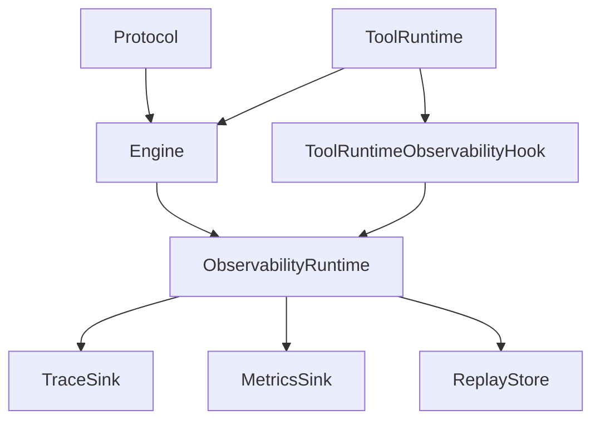
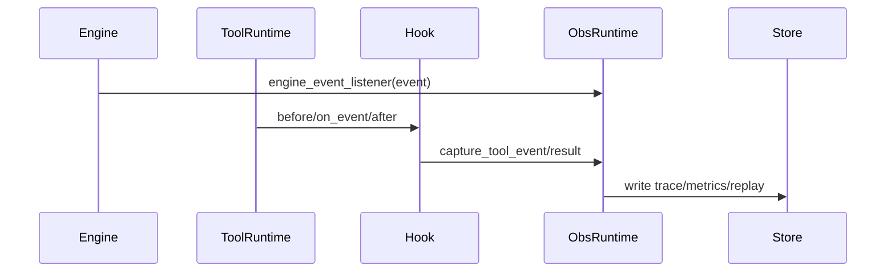
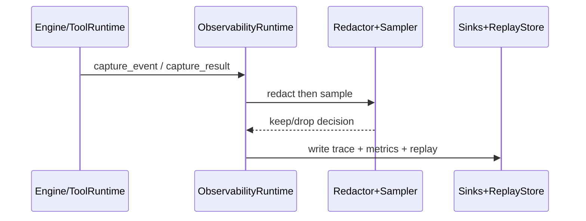

# 《从0到1工业级Agent框架打造》第六章：Observability 可观测与回放闭环

## 目标

本章交付 3 个能力：

1. Engine 与 Tool Runtime 的事件进入同一条观测链路。
2. 统一产出 `trace / metrics / replay`。
3. 支持采样、脱敏、导出、聚合指标。

## 架构位置说明（演进视角）



白话解释：

1. `trace`：一次任务全流程时间线。
2. `metrics`：统计数字（失败率、P95、吞吐）。
3. `replay`：按步骤重建当时发生了什么。

## 前置条件

1. Python >= 3.11
2. 已安装 `uv`
3. 已完成第五章 Tool Runtime
4. 在仓库根目录执行命令

## 环境准备与缺包兜底步骤

```codex
# 标准方式
uv sync --dev
uv run python -c "import agent_forge; print('agent_forge import ok')"
```

```codex
# 兜底方式（uv 不可用）
python -m pip install -U pydantic pytest
python -m pytest tests/unit/test_observability.py -q
```

## 本章主线改动范围（强制声明）

1. [schemas.py](../../src/agent_forge/components/observability/domain/schemas.py)
2. [interfaces.py](../../src/agent_forge/components/observability/application/interfaces.py)
3. [policies.py](../../src/agent_forge/components/observability/application/policies.py)
4. [runtime.py](../../src/agent_forge/components/observability/application/runtime.py)
5. [hooks.py](../../src/agent_forge/components/observability/application/hooks.py)
6. [memory.py](../../src/agent_forge/components/observability/infrastructure/memory.py)
7. [test_observability.py](../../tests/unit/test_observability.py)
8. [observability_demo.py](../../examples/observability/observability_demo.py)

## 实施步骤

### 第 1 步：先讲“面”——主流程



真实例子：

1. 成功链路：`echo` 执行成功后，`export()` 有 tool_runtime trace，`replay_structure()` 有对应 tool 记录。
2. 失败链路：调用不存在工具 `missing`，`ToolResult.status=error`，replay 仍保留失败记录。

关键澄清：

1. `engine_event_listener` 不是 Engine 的方法，它是 `ObservabilityRuntime` 提供的回调函数。
2. Engine 真正暴露的是构造参数 `event_listener`，注入方式是 `EngineLoop(..., event_listener=observability.engine_event_listener)`。

### 第 2 步：创建规则（重要）

本章严格采用“讲到哪，创建到哪”，每步都按这个顺序：

1. 先创建目录
2. 再创建 `__init__.py`（如果目录会被 import）
3. 最后创建当前文件

### 第 3 步：实现领域模型 `schemas.py`

源码：[schemas.py](../../src/agent_forge/components/observability/domain/schemas.py)

```codex
mkdir -p src/agent_forge/components/observability
mkdir -p src/agent_forge/components/observability/domain
touch src/agent_forge/components/observability/__init__.py
touch src/agent_forge/components/observability/domain/__init__.py
touch src/agent_forge/components/observability/domain/schemas.py

New-Item -ItemType Directory -Force src/agent_forge/components/observability
New-Item -ItemType Directory -Force src/agent_forge/components/observability/domain
New-Item -ItemType File src/agent_forge/components/observability/__init__.py
New-Item -ItemType File src/agent_forge/components/observability/domain/__init__.py
New-Item -ItemType File src/agent_forge/components/observability/domain/schemas.py
```

```python
"""Observability 组件领域模型。"""

from __future__ import annotations

from datetime import datetime, timezone
from typing import Any, Literal

from pydantic import BaseModel, Field

from agent_forge.components.protocol import PROTOCOL_VERSION


def _now_iso() -> str:
    """生成统一 UTC 时间。"""

    return datetime.now(timezone.utc).isoformat()


class SamplingPolicy(BaseModel):
    """采样策略。"""

    success_sample_rate: float = Field(default=0.1, ge=0.0, le=1.0, description="成功事件采样比例")
    keep_error_events: bool = Field(default=True, description="错误事件是否全量保留")


class RedactionPolicy(BaseModel):
    """脱敏策略。"""

    masked_keys: set[str] = Field(
        default_factory=lambda: {"api_key", "token", "password", "secret"},
        description="需要脱敏的字段键名（不区分大小写）",
    )
    mask_text: str = Field(default="***", min_length=1, description="脱敏替换文本")


class TraceRecord(BaseModel):
    """标准化 trace 记录。"""

    trace_id: str = Field(..., min_length=1, description="链路 ID")
    run_id: str = Field(..., min_length=1, description="运行 ID")
    step_id: str = Field(..., min_length=1, description="步骤 ID")
    parent_step_id: str | None = Field(default=None, description="父步骤 ID")
    event_type: str = Field(..., min_length=1, description="事件类型")
    source: Literal["engine", "tool_runtime"] = Field(..., description="事件来源")
    payload: dict[str, Any] = Field(default_factory=dict, description="事件 payload")
    error_code: str | None = Field(default=None, description="错误码")
    error_message: str | None = Field(default=None, description="错误信息")
    latency_ms: int | None = Field(default=None, ge=0, description="延迟毫秒")
    created_at: str = Field(default_factory=_now_iso, description="记录时间")
    protocol_version: str = Field(default=PROTOCOL_VERSION, description="协议版本")


class MetricPoint(BaseModel):
    """观测指标点。"""

    name: str = Field(..., min_length=1, description="指标名")
    value: float = Field(..., description="指标值")
    labels: dict[str, str] = Field(default_factory=dict, description="指标标签")
    created_at: str = Field(default_factory=_now_iso, description="记录时间")
    protocol_version: str = Field(default=PROTOCOL_VERSION, description="协议版本")


class ReplayStep(BaseModel):
    """回放步骤快照。"""

    step_id: str = Field(..., min_length=1, description="步骤 ID")
    parent_step_id: str | None = Field(default=None, description="父步骤 ID")
    event_type: str = Field(..., min_length=1, description="事件类型")
    source: str = Field(..., min_length=1, description="事件来源")
    payload: dict[str, Any] = Field(default_factory=dict, description="事件 payload")
    error_code: str | None = Field(default=None, description="错误码")
    created_at: str = Field(default_factory=_now_iso, description="记录时间")


class ReplayBundle(BaseModel):
    """回放聚合结果。"""

    trace_id: str = Field(..., min_length=1, description="链路 ID")
    run_id: str = Field(..., min_length=1, description="运行 ID")
    steps: list[ReplayStep] = Field(default_factory=list, description="步骤结构")
    tool_records: list[dict[str, Any]] = Field(default_factory=list, description="录制工具结果")
    generated_at: str = Field(default_factory=_now_iso, description="生成时间")
    protocol_version: str = Field(default=PROTOCOL_VERSION, description="协议版本")


class ExportEnvelope(BaseModel):
    """导出数据包。"""

    traces: list[TraceRecord] = Field(default_factory=list, description="trace 记录")
    metrics: list[MetricPoint] = Field(default_factory=list, description="指标记录")
    replay: ReplayBundle | None = Field(default=None, description="回放数据")
    protocol_version: str = Field(default=PROTOCOL_VERSION, description="协议版本")


```

代码讲解：

1. 先定义观测领域对象（TraceRecord/MetricPoint/ReplayBundle），后续所有层都围绕这个契约工作。
2. 失败模式：字段不完整时直接在 schema 层失败，避免脏数据进入存储。

#### 深度讲解升级：为什么 Schema 要先做厚

这一步的目标不是“定义几个类型”，而是先把观测数据契约钉死，避免后续实现各说各话。

1. 主流程拆解：
1. Engine/Hook 先把事件归一成 `TraceRecord`。
2. Sink 只接收 schema 对象，不接收裸字典。
3. 导出与回放统一走 `ExportEnvelope` 和 `ReplayBundle`。
2. 成功案例：
1. 一次工具超时后，`error_code`、`latency_ms`、`step_id` 都完整可查，直接按 `trace_id + run_id` 回放定位问题。
3. 失败案例：
1. 如果 `payload` 不做结构约束，聚合统计时会出现字段缺失和类型漂移，最终导致指标口径失真。
4. 工程取舍：
1. v1 用 Pydantic 强校验，写入成本略高，但换来数据质量稳定和演进可控。

### 第 4 步：实现接口层 `interfaces.py`

源码：[interfaces.py](../../src/agent_forge/components/observability/application/interfaces.py)

```codex
mkdir -p src/agent_forge/components/observability/application
touch src/agent_forge/components/observability/application/__init__.py
touch src/agent_forge/components/observability/application/interfaces.py

New-Item -ItemType Directory -Force src/agent_forge/components/observability/application
New-Item -ItemType File src/agent_forge/components/observability/application/__init__.py
New-Item -ItemType File src/agent_forge/components/observability/application/interfaces.py
```

```python
"""Observability 抽象接口。"""

from __future__ import annotations

from typing import Protocol

from agent_forge.components.observability.domain.schemas import MetricPoint, TraceRecord


class TraceSink(Protocol):
    """Trace 存储接口。"""

    def write_trace(self, record: TraceRecord) -> None:
        """写入一条 trace 记录。

        Args:
            record: 标准化 trace 记录。
        """

    def query_traces(self, trace_id: str | None = None, run_id: str | None = None) -> list[TraceRecord]:
        """按条件查询 trace 记录。

        Args:
            trace_id: 可选链路 ID。
            run_id: 可选运行 ID。

        Returns:
            list[TraceRecord]: 命中的 trace 列表。
        """


class MetricsSink(Protocol):
    """指标存储接口。"""

    def write_metric(self, point: MetricPoint) -> None:
        """写入一条指标记录。

        Args:
            point: 指标点对象。
        """

    def query_metrics(self, name: str | None = None) -> list[MetricPoint]:
        """查询指标记录。

        Args:
            name: 可选指标名。

        Returns:
            list[MetricPoint]: 命中的指标点列表。
        """


class ReplayStore(Protocol):
    """回放记录存储接口。"""

    def append_tool_record(self, trace_id: str, run_id: str, record: dict) -> None:
        """追加工具执行录制记录。

        Args:
            trace_id: 链路 ID。
            run_id: 运行 ID。
            record: 工具执行记录字典。
        """

    def get_tool_records(self, trace_id: str, run_id: str) -> list[dict]:
        """读取工具执行录制记录。

        Args:
            trace_id: 链路 ID。
            run_id: 运行 ID。

        Returns:
            list[dict]: 录制记录列表。
        """


```

代码讲解：

1. 把“怎么存”抽象成接口，才能后续替换存储而不动 runtime。
2. 失败模式：接口语义不一致会导致 replay/metrics 口径漂移。

#### 深度讲解升级：接口层为什么必须先抽象再落地

1. 主流程拆解：
1. `ObservabilityRuntime` 只依赖 `TraceSink/MetricsSink/ReplayStore` 抽象。
2. 存储实现（内存/文件/数据库）通过注入替换。
3. 上层调用不感知存储介质变化。
2. 成功案例：
1. 本地开发用 `InMemory*` 快速回归，线上替换持久化实现时，runtime 代码无需改动。
3. 失败案例：
1. 若 runtime 直接耦合数据库客户端，单测必须依赖外部基础设施，回归成本和故障面都会扩大。
4. 工程取舍：
1. 多一层接口会增加样板代码，但可换来可替换性、可测试性和长期稳定性。

### 第 5 步：实现策略层 `policies.py`

源码：[policies.py](../../src/agent_forge/components/observability/application/policies.py)

```codex
touch src/agent_forge/components/observability/application/policies.py
New-Item -ItemType File src/agent_forge/components/observability/application/policies.py
```

```python
"""Observability 策略实现。"""

from __future__ import annotations

import hashlib
from typing import Any

from agent_forge.components.observability.domain.schemas import RedactionPolicy, TraceRecord


class Sampler:
    """确定性采样器。"""

    def __init__(self, success_sample_rate: float = 0.1, keep_error_events: bool = True) -> None:
        """初始化采样器。

        Args:
            success_sample_rate: 成功事件采样比例。
            keep_error_events: 错误事件是否强制保留。
        """

        self.success_sample_rate = success_sample_rate
        self.keep_error_events = keep_error_events

    def should_keep(self, record: TraceRecord) -> bool:
        """判断记录是否保留。

        Args:
            record: 待采样记录。

        Returns:
            bool: 需要保留返回 True。
        """

        if self.keep_error_events and record.error_code:
            return True
        if self.success_sample_rate >= 1.0:
            return True
        if self.success_sample_rate <= 0.0:
            return False
        basis = f"{record.trace_id}:{record.run_id}:{record.step_id}:{record.event_type}"
        hashed = hashlib.sha1(basis.encode("utf-8")).hexdigest()[:8]
        ratio = int(hashed, 16) / 0xFFFFFFFF
        return ratio <= self.success_sample_rate


class Redactor:
    """递归脱敏器。"""

    def __init__(self, policy: RedactionPolicy | None = None) -> None:
        """初始化脱敏器。

        Args:
            policy: 脱敏策略，未传入则使用默认策略。
        """

        self.policy = policy or RedactionPolicy()
        self._masked_keys = {item.lower() for item in self.policy.masked_keys}

    def redact_payload(self, payload: dict[str, Any]) -> dict[str, Any]:
        """脱敏 payload。

        Args:
            payload: 原始 payload。

        Returns:
            dict[str, Any]: 脱敏后的 payload 副本。
        """

        return self._redact_value(payload)

    def _redact_value(self, value: Any) -> Any:
        """递归处理任意值。

        Args:
            value: 待处理值。

        Returns:
            Any: 脱敏结果。
        """

        if isinstance(value, dict):
            result: dict[str, Any] = {}
            for key, child in value.items():
                if key.lower() in self._masked_keys:
                    result[key] = self.policy.mask_text
                    continue
                result[key] = self._redact_value(child)
            return result
        if isinstance(value, list):
            return [self._redact_value(item) for item in value]
        return value


```

代码讲解：

1. 成功链路：成功事件按确定性哈希采样，统计可复现。
2. 失败链路：错误事件优先保留，避免故障“被抽样抽没了”。

#### 深度讲解升级：采样与脱敏是治理策略，不是日志技巧

1. 主流程拆解：
1. 先脱敏：写入前统一经过 `Redactor`。
2. 再采样：由 `Sampler` 决定是否保留 trace。
3. 指标独立：即使 trace 被采样丢弃，关键 metrics 仍持续记录。
2. 成功案例：
1. 成功请求按 10% 采样、错误请求 100% 保留，实现“成本可控 + 故障可追”。
3. 失败案例：
1. 如果先采样后脱敏，保留样本可能带明文敏感信息，合规直接失守。
4. 工程取舍：
1. 确定性采样（哈希）牺牲少量随机性，换来回放与对账可复现。

### 第 6 步：实现存储层 `memory.py`

源码：[memory.py](../../src/agent_forge/components/observability/infrastructure/memory.py)

```codex
mkdir -p src/agent_forge/components/observability/infrastructure
touch src/agent_forge/components/observability/infrastructure/__init__.py
touch src/agent_forge/components/observability/infrastructure/memory.py

New-Item -ItemType Directory -Force src/agent_forge/components/observability/infrastructure
New-Item -ItemType File src/agent_forge/components/observability/infrastructure/__init__.py
New-Item -ItemType File src/agent_forge/components/observability/infrastructure/memory.py
```

```python
"""Observability 内存存储实现。"""

from __future__ import annotations

from collections import defaultdict

from agent_forge.components.observability.domain.schemas import MetricPoint, TraceRecord


class InMemoryTraceSink:
    """内存 Trace 存储。"""

    def __init__(self) -> None:
        """初始化容器。"""

        self._records: list[TraceRecord] = []

    def write_trace(self, record: TraceRecord) -> None:
        """写入 trace 记录。

        Args:
            record: 标准化 trace 记录。
        """

        self._records.append(record)

    def query_traces(self, trace_id: str | None = None, run_id: str | None = None) -> list[TraceRecord]:
        """按条件查询 trace 记录。

        Args:
            trace_id: 可选链路 ID。
            run_id: 可选运行 ID。

        Returns:
            list[TraceRecord]: 命中的 trace 列表。
        """

        records = list(self._records)
        if trace_id is not None:
            records = [item for item in records if item.trace_id == trace_id]
        if run_id is not None:
            records = [item for item in records if item.run_id == run_id]
        return records


class InMemoryMetricsSink:
    """内存指标存储。"""

    def __init__(self) -> None:
        """初始化容器。"""

        self._points: list[MetricPoint] = []

    def write_metric(self, point: MetricPoint) -> None:
        """写入指标点。

        Args:
            point: 指标点对象。
        """

        self._points.append(point)

    def query_metrics(self, name: str | None = None) -> list[MetricPoint]:
        """查询指标点。

        Args:
            name: 可选指标名。

        Returns:
            list[MetricPoint]: 命中的指标点。
        """

        points = list(self._points)
        if name is not None:
            points = [item for item in points if item.name == name]
        return points


class InMemoryReplayStore:
    """内存回放数据存储。"""

    def __init__(self) -> None:
        """初始化容器。"""

        self._records: dict[tuple[str, str], list[dict]] = defaultdict(list)

    def append_tool_record(self, trace_id: str, run_id: str, record: dict) -> None:
        """追加工具录制记录。

        Args:
            trace_id: 链路 ID。
            run_id: 运行 ID。
            record: 录制记录。
        """

        self._records[(trace_id, run_id)].append(record)

    def get_tool_records(self, trace_id: str, run_id: str) -> list[dict]:
        """读取录制记录。

        Args:
            trace_id: 链路 ID。
            run_id: 运行 ID。

        Returns:
            list[dict]: 命中记录列表。
        """

        return list(self._records[(trace_id, run_id)])


```

代码讲解：

1. v1 用内存实现保证你本地可直接跑通。
2. 取舍：重启会丢数据，生产需替换为持久化实现。

#### 深度讲解升级：为什么 v1 先用内存存储

1. 主流程拆解：
1. `write_*` 负责最小写入语义。
2. `query_*` 负责按 trace/run 过滤读取。
3. `ReplayStore` 单独保存工具录制结果，避免和 trace 混装。
2. 成功案例：
1. 单测可以快速覆盖成功、失败、并发隔离主路径，反馈速度快。
3. 失败案例：
1. 若把 replay 混入 trace payload，回放阶段需要二次解析，复杂度和出错率都会上升。
4. 工程取舍：
1. 内存实现不抗重启，但教程阶段优先验证机制正确性，这是最小成本方案。

### 第 7 步：实现编排层 `runtime.py`

源码：[runtime.py](../../src/agent_forge/components/observability/application/runtime.py)

```codex
touch src/agent_forge/components/observability/application/runtime.py
New-Item -ItemType File src/agent_forge/components/observability/application/runtime.py
```

```python
"""Observability 运行时实现。"""

from __future__ import annotations

import math
from contextvars import ContextVar
from datetime import datetime
from typing import TYPE_CHECKING, Any

from agent_forge.components.observability.application.interfaces import MetricsSink, ReplayStore, TraceSink
from agent_forge.components.observability.application.policies import Redactor, Sampler
from agent_forge.components.observability.domain.schemas import (
    ExportEnvelope,
    MetricPoint,
    RedactionPolicy,
    ReplayBundle,
    ReplayStep,
    SamplingPolicy,
    TraceRecord,
)
from agent_forge.components.observability.infrastructure import InMemoryMetricsSink, InMemoryReplayStore, InMemoryTraceSink
from agent_forge.components.protocol import ExecutionEvent, ToolCall, ToolResult
from agent_forge.components.tool_runtime import ToolExecutionRecord, ToolRuntimeEvent

if TYPE_CHECKING:
    from agent_forge.components.observability.application.hooks import ToolRuntimeObservabilityHook


class ObservabilityRuntime:
    """统一观测运行时。"""

    def __init__(
        self,
        *,
        sampling_policy: SamplingPolicy | None = None,
        redaction_policy: RedactionPolicy | None = None,
        trace_sink: TraceSink | None = None,
        metrics_sink: MetricsSink | None = None,
        replay_store: ReplayStore | None = None,
    ) -> None:
        """初始化观测运行时。

        Args:
            sampling_policy: 采样策略。
            redaction_policy: 脱敏策略。
            trace_sink: trace 存储实现。
            metrics_sink: 指标存储实现。
            replay_store: 回放存储实现。
        """

        self.sampling_policy = sampling_policy or SamplingPolicy()
        self.redaction_policy = redaction_policy or RedactionPolicy()
        self.trace_sink = trace_sink or InMemoryTraceSink()
        self.metrics_sink = metrics_sink or InMemoryMetricsSink()
        self.replay_store = replay_store or InMemoryReplayStore()
        self.sampler = Sampler(
            success_sample_rate=self.sampling_policy.success_sample_rate,
            keep_error_events=self.sampling_policy.keep_error_events,
        )
        self.redactor = Redactor(self.redaction_policy)
        self._trace_id_var: ContextVar[str] = ContextVar("obs_trace_id", default="trace_unknown")
        self._run_id_var: ContextVar[str] = ContextVar("obs_run_id", default="run_unknown")

    def set_default_context(self, trace_id: str, run_id: str) -> None:
        """设置默认上下文。

        Args:
            trace_id: 默认链路 ID。
            run_id: 默认运行 ID。
        """

        self._trace_id_var.set(trace_id)
        self._run_id_var.set(run_id)

    def get_current_context(self) -> tuple[str, str]:
        """读取当前任务上下文。

        Returns:
            tuple[str, str]: 当前任务的 (trace_id, run_id)。
        """

        return self._trace_id_var.get(), self._run_id_var.get()

    def engine_event_listener(self, event: ExecutionEvent) -> None:
        """Engine 监听器入口。

        Args:
            event: Engine 事件对象。
        """

        self.capture_engine_event(event)

    def capture_engine_event(self, event: ExecutionEvent) -> None:
        """记录 Engine 事件。

        Args:
            event: Engine 事件对象。
        """

        payload = self.redactor.redact_payload(event.payload)
        record = TraceRecord(
            trace_id=event.trace_id,
            run_id=event.run_id,
            step_id=event.step_id,
            parent_step_id=event.parent_step_id,
            event_type=event.event_type,
            source="engine",
            payload=payload,
            error_code=event.error.error_code if event.error else None,
            error_message=event.error.error_message if event.error else None,
        )
        self._write_trace_and_metrics(record)

    def capture_tool_event(self, event: ToolRuntimeEvent, trace_id: str | None = None, run_id: str | None = None) -> None:
        """记录 Tool Runtime 事件。

        Args:
            event: ToolRuntime 事件对象。
            trace_id: 可选链路 ID（优先级高于 payload 与默认上下文）。
            run_id: 可选运行 ID（优先级高于 payload 与默认上下文）。
        """

        payload = self.redactor.redact_payload(event.payload)
        current_trace_id, current_run_id = self.get_current_context()
        resolved_trace_id = str(trace_id or payload.get("trace_id") or current_trace_id)
        resolved_run_id = str(run_id or payload.get("run_id") or current_run_id)
        record = TraceRecord(
            trace_id=resolved_trace_id,
            run_id=resolved_run_id,
            step_id=event.step_id or f"tool_{event.tool_call_id or 'unknown'}",
            parent_step_id=str(payload.get("parent_step_id")) if payload.get("parent_step_id") else None,
            event_type=event.event_type,
            source="tool_runtime",
            payload=payload,
            error_code=event.error.error_code if event.error else None,
            error_message=event.error.error_message if event.error else None,
            latency_ms=event.latency_ms,
        )
        self._write_trace_and_metrics(record)

    def capture_tool_result(
        self,
        tool_call: ToolCall,
        result: ToolResult,
        trace_id: str | None = None,
        run_id: str | None = None,
    ) -> None:
        """记录工具执行结果用于回放。

        Args:
            tool_call: 工具调用对象。
            result: 工具执行结果对象。
            trace_id: 可选链路 ID。
            run_id: 可选运行 ID。
        """

        record = ToolExecutionRecord(
            tool_call_id=tool_call.tool_call_id,
            tool_name=tool_call.tool_name,
            principal=tool_call.principal,
            status=result.status,
            args_masked=self.redactor.redact_payload(tool_call.args),
            output=self.redactor.redact_payload(result.output),
            error=result.error,
            latency_ms=result.latency_ms,
        )
        self.capture_tool_record(record, trace_id=trace_id, run_id=run_id)

    def capture_tool_record(self, record: ToolExecutionRecord, trace_id: str | None = None, run_id: str | None = None) -> None:
        """写入工具录制记录。

        Args:
            record: 结构化工具执行记录。
            trace_id: 可选链路 ID。
            run_id: 可选运行 ID。
        """

        current_trace_id, current_run_id = self.get_current_context()
        self.replay_store.append_tool_record(
            trace_id=trace_id or current_trace_id,
            run_id=run_id or current_run_id,
            record=record.model_dump(),
        )

    def build_tool_hook(self) -> "ToolRuntimeObservabilityHook":
        """构建 Tool Runtime 观测 hook。

        Returns:
            ToolRuntimeObservabilityHook: 可直接注册到 ToolRuntime 的 hook。
        """

        from agent_forge.components.observability.application.hooks import ToolRuntimeObservabilityHook

        return ToolRuntimeObservabilityHook(self)

    def replay_structure(self, trace_id: str, run_id: str) -> ReplayBundle:
        """按链路构建回放结构。

        Args:
            trace_id: 链路 ID。
            run_id: 运行 ID。

        Returns:
            ReplayBundle: 回放数据包。
        """

        traces = sorted(
            self.trace_sink.query_traces(trace_id=trace_id, run_id=run_id),
            key=lambda item: item.created_at,
        )
        steps = [
            ReplayStep(
                step_id=record.step_id,
                parent_step_id=record.parent_step_id,
                event_type=record.event_type,
                source=record.source,
                payload=record.payload,
                error_code=record.error_code,
                created_at=record.created_at,
            )
            for record in traces
        ]
        tool_records = self.replay_store.get_tool_records(trace_id=trace_id, run_id=run_id)
        return ReplayBundle(trace_id=trace_id, run_id=run_id, steps=steps, tool_records=tool_records)

    def export(self, trace_id: str | None = None, run_id: str | None = None) -> ExportEnvelope:
        """导出观测数据。

        Args:
            trace_id: 可选链路 ID。
            run_id: 可选运行 ID。

        Returns:
            ExportEnvelope: 导出数据包。
        """

        traces = self.trace_sink.query_traces(trace_id=trace_id, run_id=run_id)
        metrics = self.metrics_sink.query_metrics()
        replay = None
        if trace_id is not None and run_id is not None:
            replay = self.replay_structure(trace_id=trace_id, run_id=run_id)
        return ExportEnvelope(traces=traces, metrics=metrics, replay=replay)

    def aggregate_metrics(self, trace_id: str | None = None, run_id: str | None = None) -> dict[str, float]:
        """计算聚合指标。

        Args:
            trace_id: 可选链路 ID。
            run_id: 可选运行 ID。

        Returns:
            dict[str, float]: 聚合指标字典。
        """

        records = self.trace_sink.query_traces(trace_id=trace_id, run_id=run_id)
        total = len(records)
        errors = sum(1 for item in records if item.error_code is not None)
        retries = sum(1 for item in records if item.payload.get("decision") == "retry" or item.payload.get("attempt", 0) > 0)
        latencies = sorted(item.latency_ms for item in records if item.latency_ms is not None)
        unique_runs = {item.run_id for item in records}

        if total == 0:
            return {
                "success_rate": 0.0,
                "failure_rate": 0.0,
                "p95_latency_ms": 0.0,
                "retry_rate": 0.0,
                "throughput_runs_per_second": 0.0,
            }

        start = min(_parse_iso(item.created_at) for item in records)
        end = max(_parse_iso(item.created_at) for item in records)
        duration_sec = max((end - start).total_seconds(), 1.0)
        p95 = _p95(latencies) if latencies else 0.0
        return {
            "success_rate": round((total - errors) / total, 4),
            "failure_rate": round(errors / total, 4),
            "p95_latency_ms": round(p95, 3),
            "retry_rate": round(retries / total, 4),
            "throughput_runs_per_second": round(len(unique_runs) / duration_sec, 4),
        }

    def _write_trace_and_metrics(self, record: TraceRecord) -> None:
        """按策略写入 trace 和指标。

        Args:
            record: 标准化 trace 记录。
        """

        if self.sampler.should_keep(record):
            self.trace_sink.write_trace(record)
        self.metrics_sink.write_metric(
            MetricPoint(
                name="events_total",
                value=1.0,
                labels={
                    "source": record.source,
                    "event_type": record.event_type,
                    "status": "error" if record.error_code else "ok",
                },
            )
        )
        if record.latency_ms is not None:
            self.metrics_sink.write_metric(
                MetricPoint(
                    name="latency_ms",
                    value=float(record.latency_ms),
                    labels={"source": record.source, "event_type": record.event_type},
                )
            )


def _parse_iso(value: str) -> datetime:
    """解析 ISO 时间字符串。

    Args:
        value: ISO 时间字符串。

    Returns:
        datetime: 解析后的时间对象。
    """

    return datetime.fromisoformat(value.replace("Z", "+00:00"))


def _p95(values: list[int]) -> float:
    """计算 P95。

    Args:
        values: 排序后的整数列表。

    Returns:
        float: P95 数值。
    """

    if not values:
        return 0.0
    idx = max(0, math.ceil(len(values) * 0.95) - 1)
    return float(values[idx])

```

代码讲解（主流程 1/2/3/4）：

1. 入口归一：`capture_engine_event` / `capture_tool_event`
2. 治理执行：先脱敏，再采样
3. 指标落库：`events_total` + `latency_ms`
4. 回放收口：`capture_tool_result` 成功失败都写入 replay

#### 深度讲解升级：`ObservabilityRuntime` 的四段执行链



1. 主流程拆解：
1. 事件归一：把 Engine 与 ToolRuntime 事件统一成 `TraceRecord`。
2. 治理前置：先脱敏，再采样，保证“留存即合规”。
3. 双轨落库：trace 用于排障时序，metrics 用于统计门禁。
4. 回放收口：成功和失败都进入 replay，避免“只看见成功”。
2. 成功案例：
1. 调用 `missing` 工具后，replay 仍保留 `tool_call_id/status=error`，可快速判断是工具注册问题而不是网络问题。
3. 失败案例：
1. 如果 `capture_tool_result` 只记录成功路径，事故复盘会出现“失败步骤消失”。
4. 工程取舍：
1. 使用 `ContextVar` 做任务级上下文，理解成本更高，但彻底解决并发串线风险。

### 第 8 步：实现桥接层 `hooks.py`

源码：[hooks.py](../../src/agent_forge/components/observability/application/hooks.py)

```codex
touch src/agent_forge/components/observability/application/hooks.py
New-Item -ItemType File src/agent_forge/components/observability/application/hooks.py
```

```python
"""Tool Runtime -> Observability hooks。"""

from __future__ import annotations

from typing import TYPE_CHECKING

from agent_forge.components.protocol import ToolCall, ToolResult
from agent_forge.components.tool_runtime import ToolRuntimeError, ToolRuntimeEvent, ToolRuntimeHooks

if TYPE_CHECKING:
    from agent_forge.components.observability.application.runtime import ObservabilityRuntime


class ToolRuntimeObservabilityHook(ToolRuntimeHooks):
    """把 ToolRuntime 事件桥接到 ObservabilityRuntime。"""

    def __init__(self, runtime: "ObservabilityRuntime") -> None:
        """初始化 hook。

        Args:
            runtime: Observability 运行时实例。
        """

        self.runtime = runtime
        self._calls: dict[str, ToolCall] = {}
        self._contexts: dict[str, tuple[str, str]] = {}

    def before_execute(self, tool_call: ToolCall) -> ToolCall:
        """执行前记录调用参数。

        Args:
            tool_call: 工具调用对象。

        Returns:
            ToolCall: 原始调用对象（不改写）。
        """

        self._calls[tool_call.tool_call_id] = tool_call
        self._contexts[tool_call.tool_call_id] = self.runtime.get_current_context()
        return tool_call

    def on_event(self, event: ToolRuntimeEvent) -> ToolRuntimeEvent | None:
        """接收 ToolRuntime 事件并透传到观测运行时。

        Args:
            event: ToolRuntime 事件对象。

        Returns:
            ToolRuntimeEvent | None: 原样返回事件。
        """

        context = self._contexts.get(event.tool_call_id, self.runtime.get_current_context())
        self.runtime.capture_tool_event(event, trace_id=context[0], run_id=context[1])
        return event

    def after_execute(self, result: ToolResult) -> ToolResult:
        """在工具执行收尾后录制回放数据。

        Args:
            result: 工具执行结果。

        Returns:
            ToolResult: 原始结果。
        """

        tool_call = self._calls.pop(result.tool_call_id, None)
        context = self._contexts.pop(result.tool_call_id, self.runtime.get_current_context())
        if tool_call is not None:
            self.runtime.capture_tool_result(tool_call=tool_call, result=result, trace_id=context[0], run_id=context[1])
        return result

    def on_error(self, error: ToolRuntimeError, tool_call: ToolCall) -> ToolRuntimeError:
        """错误路径保持透传。

        Args:
            error: ToolRuntime 错误对象。
            tool_call: 当前工具调用。

        Returns:
            ToolRuntimeError: 原始错误对象。
        """

        self._calls[tool_call.tool_call_id] = tool_call
        if tool_call.tool_call_id not in self._contexts:
            self._contexts[tool_call.tool_call_id] = self.runtime.get_current_context()
        return error

```

代码讲解：

1. hook 只做桥接，不改业务语义。
2. 失败模式：只记录成功不记录失败，会导致 replay 不完整。

#### 深度讲解升级：Hook 的职责边界

1. Hook 只做桥接和补充上下文，不做业务决策。
2. `before_execute` 缓存调用参数，`after_execute` 统一收口写 replay。
3. `on_error` 不吞错，只透传并补齐观测上下文。

成功案例：
1. 工具执行失败时，Hook 仍可拿到同一 `tool_call_id` 的上下文并写入失败录制。

失败案例：
1. 如果 Hook 篡改业务结果，会造成 runtime 与 replay 语义分叉，排障会出现“日志说成功，用户看到失败”。

### 第 9 步：补齐测试 `test_observability.py`

源码：[test_observability.py](../../tests/unit/test_observability.py)

```codex
mkdir -p tests/unit
touch tests/unit/test_observability.py

New-Item -ItemType Directory -Force tests/unit
New-Item -ItemType File tests/unit/test_observability.py
```

```python
"""Observability 组件测试。"""

from __future__ import annotations

import asyncio

from agent_forge.components.engine import EngineLimits, EngineLoop, PlanStep, StepOutcome
from agent_forge.components.observability import ObservabilityRuntime, RedactionPolicy, SamplingPolicy
from agent_forge.components.protocol import AgentState, ErrorInfo, ToolCall, ToolResult, build_initial_state
from agent_forge.components.tool_runtime import ToolRuntime, ToolSpec


def test_observability_should_capture_engine_events_and_aggregate_metrics() -> None:
    observability = ObservabilityRuntime(sampling_policy=SamplingPolicy(success_sample_rate=1.0))
    state = build_initial_state("session_obs_engine")
    observability.set_default_context(trace_id=state.trace_id, run_id=state.run_id)
    engine = EngineLoop(
        limits=EngineLimits(max_steps=2, time_budget_ms=5000),
        event_listener=observability.engine_event_listener,
    )

    def plan_fn(_: AgentState) -> list[dict]:
        return [{"id": "s1", "name": "simple-step", "payload": {}}]

    async def act_fn(_: AgentState, __: PlanStep, ___: int) -> StepOutcome:
        return StepOutcome(status="ok", output={"message": "done"})

    updated = asyncio.run(engine.arun(state, plan_fn=plan_fn, act_fn=act_fn))
    assert updated.final_answer is not None
    exported = observability.export(trace_id=state.trace_id, run_id=state.run_id)
    assert len(exported.traces) >= 3
    metrics = observability.aggregate_metrics(trace_id=state.trace_id, run_id=state.run_id)
    assert metrics["success_rate"] > 0
    assert metrics["failure_rate"] == 0


def test_observability_should_redact_sensitive_fields() -> None:
    observability = ObservabilityRuntime(
        sampling_policy=SamplingPolicy(success_sample_rate=1.0),
        redaction_policy=RedactionPolicy(masked_keys={"token", "api_key"}),
    )
    state = build_initial_state("session_obs_redact")
    observability.set_default_context(trace_id=state.trace_id, run_id=state.run_id)

    call = ToolCall(
        tool_call_id="tc_redact",
        tool_name="echo",
        principal="tester",
        args={"token": "raw-secret", "query": "hello"},
    )
    result = ToolResult(tool_call_id="tc_redact", status="ok", output={"api_key": "raw-key", "value": "ok"})
    observability.capture_tool_result(tool_call=call, result=result)

    bundle = observability.replay_structure(trace_id=state.trace_id, run_id=state.run_id)
    assert len(bundle.tool_records) == 1
    assert bundle.tool_records[0]["args_masked"]["token"] == "***"
    assert bundle.tool_records[0]["output"]["api_key"] == "***"


def test_observability_should_capture_tool_runtime_hook_events() -> None:
    observability = ObservabilityRuntime(sampling_policy=SamplingPolicy(success_sample_rate=1.0))
    observability.set_default_context(trace_id="trace_tool", run_id="run_tool")
    runtime = ToolRuntime()
    runtime.register_hook(observability.build_tool_hook())
    runtime.register_tool(ToolSpec(name="echo"), lambda args: {"echo": args["text"]})

    result = runtime.execute(
        ToolCall(tool_call_id="tc_01", tool_name="echo", args={"text": "hello"}, principal="tester")
    )
    assert result.status == "ok"

    export = observability.export(trace_id="trace_tool", run_id="run_tool")
    assert any(item.source == "tool_runtime" for item in export.traces)
    replay = observability.replay_structure(trace_id="trace_tool", run_id="run_tool")
    assert len(replay.tool_records) == 1
    assert replay.tool_records[0]["tool_call_id"] == "tc_01"


def test_observability_should_keep_error_event_when_sampling_zero() -> None:
    observability = ObservabilityRuntime(
        sampling_policy=SamplingPolicy(success_sample_rate=0.0, keep_error_events=True),
    )
    state = build_initial_state("session_obs_error")
    observability.set_default_context(trace_id=state.trace_id, run_id=state.run_id)

    error_step = StepOutcome(
        status="error",
        output={},
        error=ErrorInfo(error_code="X_FAIL", error_message="boom", retryable=False),
    )

    def plan_fn(_: AgentState) -> list[dict]:
        return [{"id": "s1", "name": "fail-step", "payload": {}}]

    async def act_fn(_: AgentState, __: PlanStep, ___: int) -> StepOutcome:
        return error_step

    engine = EngineLoop(
        limits=EngineLimits(max_steps=2, time_budget_ms=5000, max_retry_per_step=0),
        event_listener=observability.engine_event_listener,
    )
    asyncio.run(engine.arun(state, plan_fn=plan_fn, act_fn=act_fn))

    export = observability.export(trace_id=state.trace_id, run_id=state.run_id)
    assert any(item.error_code == "X_FAIL" for item in export.traces)


def test_observability_should_record_failed_tool_result_in_replay() -> None:
    observability = ObservabilityRuntime(sampling_policy=SamplingPolicy(success_sample_rate=1.0))
    observability.set_default_context(trace_id="trace_fail_tool", run_id="run_fail_tool")
    runtime = ToolRuntime()
    runtime.register_hook(observability.build_tool_hook())

    result = runtime.execute(
        ToolCall(tool_call_id="tc_missing", tool_name="missing", args={}, principal="tester")
    )
    assert result.status == "error"
    replay = observability.replay_structure(trace_id="trace_fail_tool", run_id="run_fail_tool")
    assert len(replay.tool_records) == 1
    assert replay.tool_records[0]["status"] == "error"


def test_observability_should_not_mix_context_across_concurrent_tasks() -> None:
    observability = ObservabilityRuntime(sampling_policy=SamplingPolicy(success_sample_rate=1.0))
    runtime = ToolRuntime()
    runtime.register_hook(observability.build_tool_hook())
    runtime.register_tool(ToolSpec(name="echo"), lambda args: {"echo": args["text"]})

    async def _run_one(trace_id: str, run_id: str, call_id: str, text: str) -> None:
        observability.set_default_context(trace_id=trace_id, run_id=run_id)
        await runtime.execute_async(
            ToolCall(tool_call_id=call_id, tool_name="echo", args={"text": text}, principal="tester")
        )

    async def _run_both() -> None:
        await asyncio.gather(
            _run_one("trace_a", "run_a", "tc_a", "A"),
            _run_one("trace_b", "run_b", "tc_b", "B"),
        )

    asyncio.run(_run_both())

    replay_a = observability.replay_structure(trace_id="trace_a", run_id="run_a")
    replay_b = observability.replay_structure(trace_id="trace_b", run_id="run_b")
    assert len(replay_a.tool_records) == 1
    assert len(replay_b.tool_records) == 1
    assert replay_a.tool_records[0]["tool_call_id"] == "tc_a"
    assert replay_b.tool_records[0]["tool_call_id"] == "tc_b"

```

代码讲解：

1. 覆盖 6 个风险面：Engine 接入、hook 接入、脱敏、采样、失败回放、并发隔离。
2. 重点看失败用例：确保错误结果也能进入 replay。

#### 深度讲解升级：测试矩阵为什么是这 6 类

1. Engine 接入：验证 event_listener 不破坏旧调用链。
2. Hook 接入：验证 ToolRuntime 事件可完整桥接。
3. 脱敏：验证敏感字段不会明文落盘。
4. 采样：验证 0 采样时错误事件仍保留。
5. 失败回放：验证失败结果也能进入 replay。
6. 并发隔离：验证 `trace_id/run_id` 不串线。

测试取舍说明：
1. 这组用例优先覆盖最容易线上出故障的路径，不追求“只看覆盖率数字”。
2. 六类全部通过后，Observability 主机制已具备上线前评审价值。

### 第 10 步：补齐 examples `observability_demo.py`

源码：[observability_demo.py](../../examples/observability/observability_demo.py)

```codex
mkdir -p examples/observability
touch examples/observability/observability_demo.py

New-Item -ItemType Directory -Force examples/observability
New-Item -ItemType File examples/observability/observability_demo.py
```

```python
"""Chapter 06: Observability end-to-end runnable demo."""

from __future__ import annotations

import asyncio

from agent_forge.components.engine import EngineLimits, EngineLoop, PlanStep, StepOutcome
from agent_forge.components.observability import ObservabilityRuntime, SamplingPolicy
from agent_forge.components.protocol import AgentState, ToolCall, build_initial_state
from agent_forge.components.tool_runtime import PythonMathTool, ToolRuntime, ToolSpec, build_python_math_handler


def create_observability_runtime() -> ObservabilityRuntime:
    """Create runtime with full sampling for demonstration output."""

    return ObservabilityRuntime(sampling_policy=SamplingPolicy(success_sample_rate=1.0))


def create_tool_runtime(observability: ObservabilityRuntime) -> ToolRuntime:
    """Create ToolRuntime and register observability hook + python_math tool."""

    runtime = ToolRuntime()
    runtime.register_hook(observability.build_tool_hook())
    runtime.register_tool(
        ToolSpec(
            name="python_math",
            args_schema={
                "type": "object",
                "properties": {"expression": {"type": "string"}},
                "required": ["expression"],
            },
        ),
        build_python_math_handler(PythonMathTool()),
    )
    return runtime


def run_tool_runtime_path(observability: ObservabilityRuntime, runtime: ToolRuntime) -> tuple[str, str]:
    """Run one success + one failure tool call and return (trace_id, run_id)."""

    trace_id = "trace_obs_demo_tool"
    run_id = "run_obs_demo_tool"
    observability.set_default_context(trace_id=trace_id, run_id=run_id)

    success = runtime.execute(
        ToolCall(
            tool_call_id="tc_math_ok",
            tool_name="python_math",
            principal="demo_user",
            args={"expression": "(2 + 3) * 7"},
        )
    )
    failure = runtime.execute(
        ToolCall(
            tool_call_id="tc_math_missing",
            tool_name="missing_tool",
            principal="demo_user",
            args={},
        )
    )

    print("[tool_runtime] success:", success.status, success.output)
    print("[tool_runtime] failure:", failure.status, failure.error.error_code if failure.error else None)
    return trace_id, run_id


async def run_engine_path(observability: ObservabilityRuntime, runtime: ToolRuntime) -> tuple[str, str]:
    """Run Engine once with event_listener callback and return (trace_id, run_id)."""

    state = build_initial_state("session_obs_demo_engine")
    observability.set_default_context(trace_id=state.trace_id, run_id=state.run_id)

    engine = EngineLoop(
        limits=EngineLimits(max_steps=2, time_budget_ms=5000),
        event_listener=observability.engine_event_listener,
    )

    def plan_fn(_: AgentState) -> list[dict]:
        return [{"id": "step_math", "name": "tool_math", "payload": {"expression": "sqrt(16) + 1"}}]

    async def act_fn(_: AgentState, step: PlanStep, __: int) -> StepOutcome:
        call = ToolCall(
            tool_call_id=f"tc_{step.key}",
            tool_name="python_math",
            principal="demo_user",
            args={"expression": str(step.payload.get("expression", "1+1"))},
        )
        result = await runtime.execute_async(call)
        if result.status == "ok":
            return StepOutcome(status="ok", output=result.output)
        return StepOutcome(status="error", output=result.output, error=result.error)

    updated = await engine.arun(state, plan_fn=plan_fn, act_fn=act_fn)
    print("[engine] final status:", updated.final_answer.status if updated.final_answer else "none")
    return state.trace_id, state.run_id


def print_observability_summary(observability: ObservabilityRuntime, trace_id: str, run_id: str, title: str) -> None:
    """Print replay + metrics summary for one trace/run pair."""

    replay = observability.replay_structure(trace_id=trace_id, run_id=run_id)
    metrics = observability.aggregate_metrics(trace_id=trace_id, run_id=run_id)
    export = observability.export(trace_id=trace_id, run_id=run_id)
    print(f"[{title}] traces={len(export.traces)} tool_records={len(replay.tool_records)} metrics={metrics}")


def main() -> None:
    """Run chapter demo."""

    # 1. Build runtimes and register hook/tool.
    observability = create_observability_runtime()
    runtime = create_tool_runtime(observability)

    # 2. Run tool path: one success + one failure.
    tool_trace_id, tool_run_id = run_tool_runtime_path(observability, runtime)

    # 3. Run engine path with callback injection.
    engine_trace_id, engine_run_id = asyncio.run(run_engine_path(observability, runtime))

    # 4. Print observability summaries for both paths.
    print_observability_summary(observability, tool_trace_id, tool_run_id, "tool_path")
    print_observability_summary(observability, engine_trace_id, engine_run_id, "engine_path")


if __name__ == "__main__":
    main()
```

代码讲解：

1. 这份示例把“ToolRuntime 路径 + Engine 路径”一次性跑通，便于你看到两条观测链路都能落到同一个 runtime。
2. 失败链路也有明确演示：`missing_tool` 会产出 `error` 结果并进入 replay，而不是静默丢失。
3. 关键注入点是 `EngineLoop(..., event_listener=observability.engine_event_listener)`，这说明 Engine 提供的是回调插槽，Observability 提供的是回调实现。

## 运行命令

```codex
uv run --no-sync pytest tests/unit/test_observability.py -q
uv run --no-sync pytest tests/unit/test_tool_runtime.py -q
uv run --no-sync pytest tests/unit/test_engine.py -q
uv run --no-sync pytest -q
```

examples 运行命令：

```codex
uv run python examples/observability/observability_demo.py
```

## 增量闭环验证

1. Engine 接入 listener 后兼容旧调用方式。
2. ToolRuntime 成功/失败都进入 replay。
3. 并发场景 `trace_id/run_id` 不串线。
4. 指标聚合可直接导出并用于门禁。

## 验证清单

1. `test_observability.py` 通过
2. 失败回放用例通过
3. 并发隔离用例通过
4. 全量回归通过

## 常见问题

1. replay 只有成功记录：错误路径没有进入 `after_execute` 收口。
2. 并发串线：没有使用 `ContextVar` 做任务级上下文隔离。
3. 指标失真：采样口径与门禁口径混用。

## 本章 DoD

1. 代码 + 测试 + 教程齐全
2. trace / metrics / replay 全链路可用
3. 采样、脱敏、导出、聚合可验证
4. 接入不破坏向后兼容

## 下一章预告

下一章进入 Context Engineering，解决指令合并与 token 预算治理问题；否则长会话会持续放大上下文污染和成本失控。

