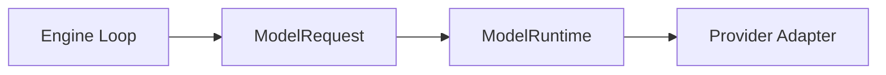
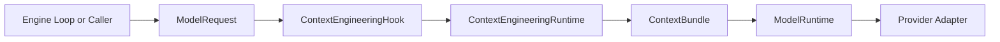
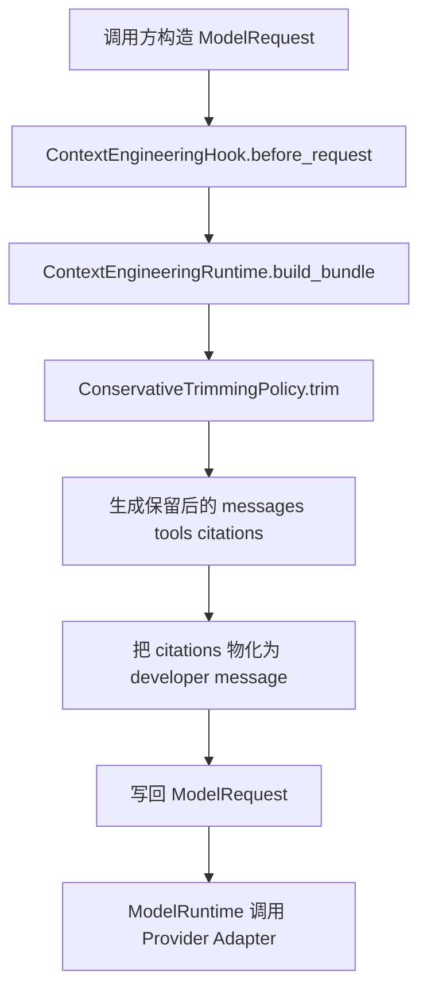
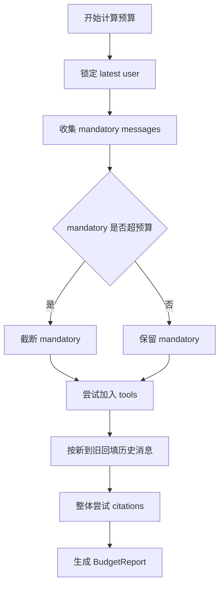
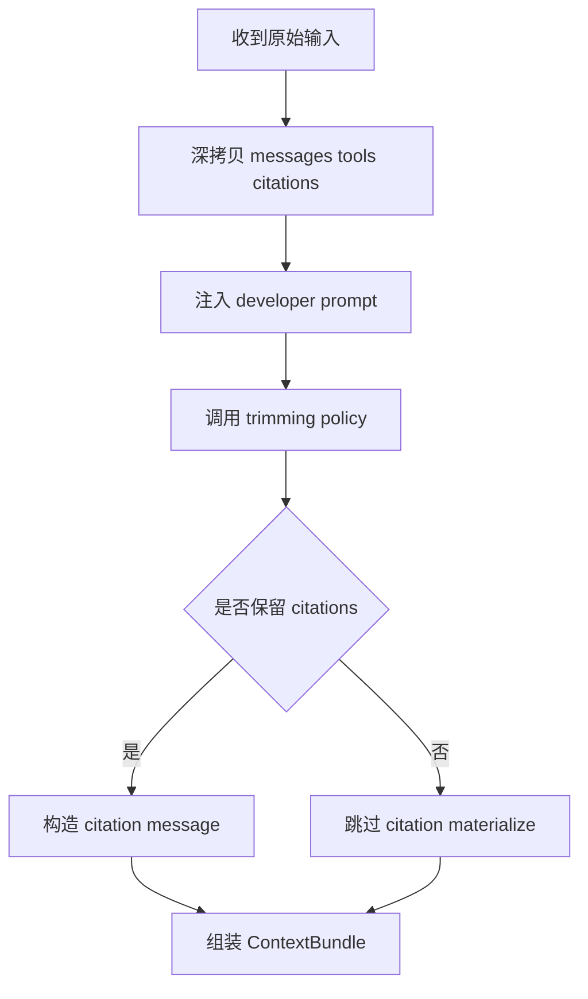
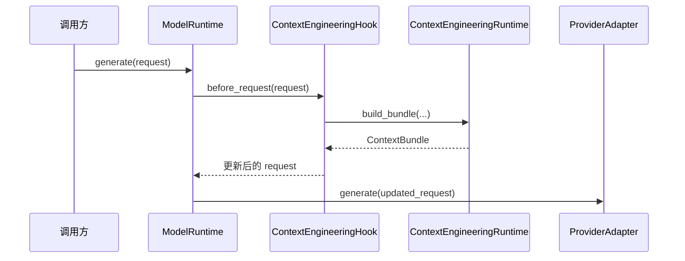
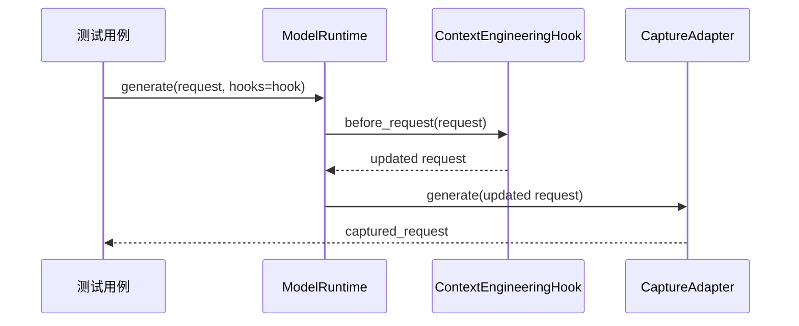
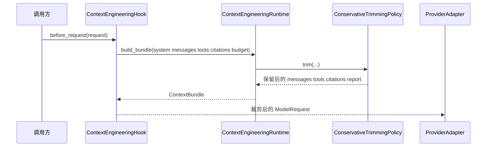

# 《从0到1工业级Agent框架打造》第七章：Context Engineering 上下文编排与预算治理

---

## 目标

这一章我们把 Agent 的“上下文治理”真正接到主链路里。

前面六章已经把协议、执行循环、模型运行时、工具运行时和可观测都搭起来了，但还有一个很现实的问题没有解决：**不是所有上下文都应该原样送进模型**。

只要你的会话一变长，这几个问题就会立刻出现：

1. 历史消息越来越多，模型输入很快超预算。
2. 工具 schema 很长，和旧历史消息混在一起时，很容易把关键指令挤掉。
3. 引用材料（citations）如果只是“记录下来”而没有真正进入模型上下文，模型回答时根本用不到它。
4. 如果没有预算报告，你看到的只是“模型突然答歪了”，而不知道到底是哪些内容被裁掉了。

所以本章要新增的不是一个“概念”，而是一套**真正参与主流程的上下文编排能力**。完成后，系统将新增以下能力：

1. 能把 `system_prompt`、历史消息、tools、citations 统一编排成 `ContextBundle`。
2. 能在固定预算下执行确定性的裁剪，而不是临时拼接字符串碰运气。
3. 能输出 `BudgetReport`，明确记录哪些内容被保留、哪些内容被裁掉、为什么被裁掉。
4. 能通过 `ContextEngineeringHook` 在 `ModelRuntime` 发请求前自动生效，而不需要你改业务调用方式。

**本章在整体架构中的定位：**

- 它属于模型调用前的“请求治理层”。
- 它解决的是“什么内容应该进入模型，以及超预算时怎么处理”的问题。
- 它必须在 Retrieval 和 Memory 之前讲清楚，因为后面检索出来的内容、长期记忆取回的内容，最终都要经过这一层治理，才能稳定送进模型。

一句话总结本章：

> 我们不是简单把上下文“传给模型”，而是先把上下文“治理好，再传给模型”。

---

## 2. 架构位置说明

先看前六章之后的主链路。



这条链路在“模型调用能跑起来”这件事上已经够用了，但它默认有一个危险前提：**调用方自己会把上下文准备好**。

这在短会话里勉强成立，在长会话里基本一定失效。因为真正的生产链路里，请求进入模型前要做的事情远不止“把 messages 列出来”：

- 哪些消息必须保留？
- 哪些旧历史可以裁掉？
- tools 是不是应该优先于旧对话？
- citations 是不是只是挂在 request 上，最后根本没进模型？
- 如果超预算，裁剪过程怎么审计？

所以这一章新增后的结构是下面这样：



这里有三个关键点必须先讲清楚：

1. `ContextEngineeringHook` 放在 `ModelRuntime` 前面，而不是 Engine 里面。因为它解决的是“发请求前如何整理上下文”，属于模型侧的请求治理，不应该污染 Engine 主循环。
2. `ContextEngineeringRuntime` 只负责“编排”和“裁剪”，不直接碰厂商 payload。这样它就不会和 OpenAI/DeepSeek 之类的协议细节耦合在一起。
3. `Provider Adapter` 仍然只负责“把标准化请求翻译成厂商请求”。它不应该知道什么叫 `BudgetReport`，也不应该替你决定丢哪条消息。

### 为什么必须插在这里，而不是别处？

如果你把上下文治理放进 Engine：

- Engine 会被迫知道模型预算、tools、citations 的细节。
- 后续一旦换模型、换预算策略、换裁剪规则，Engine 就要跟着改。
- 这会破坏我们前面一直坚持的依赖方向：Engine 调度流程，模型侧处理模型问题。

如果你把上下文治理放进 Provider Adapter：

- 适配器会从“协议翻译层”变成“业务裁剪层”。
- 不同 provider 的 payload 细节会反向污染上下文治理逻辑。
- 后续做回放、审计、替换策略时，测试会非常难写。

所以这一章的架构决策很明确：

> 上下文治理属于模型请求前的标准化步骤，最佳接入点就是 `ModelRuntime Hook`。

---

## 前置条件

开始前请先确认你已经完成前六章，并且当前仓库能正常跑通。

1. Python >= 3.11
2. 已安装 `uv`
3. 已完成第六章 Observability
4. 在仓库根目录执行下面命令可以通过

环境复用验证命令：

```codex
uv run --no-sync pytest -q
```

如果这里没有通过，先不要继续第七章。因为第七章不是单独 demo，它是接在现有主链路上的真实增量。

---

## 4. 本章主线改动范围

本章只围绕 `Context Engineering` 这个组件做增量，不跨组件乱改。

### 代码目录

- `src/agent_forge/components/context_engineering/`
- `src/agent_forge/components/model_runtime/`

### 测试目录

- `tests/unit/test_context_engineering.py`

### 本章涉及的真实文件

- [src/agent_forge/components/context_engineering/__init__.py](../../src/agent_forge/components/context_engineering/__init__.py)
- [src/agent_forge/components/context_engineering/domain/__init__.py](../../src/agent_forge/components/context_engineering/domain/__init__.py)
- [src/agent_forge/components/context_engineering/domain/schemas.py](../../src/agent_forge/components/context_engineering/domain/schemas.py)
- [src/agent_forge/components/context_engineering/infrastructure/__init__.py](../../src/agent_forge/components/context_engineering/infrastructure/__init__.py)
- [src/agent_forge/components/context_engineering/infrastructure/token_estimator.py](../../src/agent_forge/components/context_engineering/infrastructure/token_estimator.py)
- [src/agent_forge/components/context_engineering/application/__init__.py](../../src/agent_forge/components/context_engineering/application/__init__.py)
- [src/agent_forge/components/context_engineering/application/policies.py](../../src/agent_forge/components/context_engineering/application/policies.py)
- [src/agent_forge/components/context_engineering/application/runtime.py](../../src/agent_forge/components/context_engineering/application/runtime.py)
- [src/agent_forge/components/context_engineering/application/hooks.py](../../src/agent_forge/components/context_engineering/application/hooks.py)
- [examples/context_engineering/context_engineering_demo.py](../../examples/context_engineering/context_engineering_demo.py)
- [tests/unit/test_context_engineering.py](../../tests/unit/test_context_engineering.py)
- [tests/unit/test_context_engineering_demo.py](../../tests/unit/test_context_engineering_demo.py)
- [src/agent_forge/components/model_runtime/domain/schemas.py](../../src/agent_forge/components/model_runtime/domain/schemas.py)
- [src/agent_forge/components/model_runtime/infrastructure/adapters/base.py](../../src/agent_forge/components/model_runtime/infrastructure/adapters/base.py)

---

# 5. 实施步骤

---

## 第 1 步：先看主流程，不急着写代码

很多人学上下文工程，一上来就盯着“怎么裁 token”。这样很容易越学越乱，因为你会把局部策略当成主流程。

这一章先把主流程讲清楚。



这条链路里，真正最关键的是 4 个动作：

1. 先收集候选上下文：`system_prompt`、消息、tools、citations。
2. 再按预算规则做裁剪，而不是边拼边猜。
3. 裁完以后把 citations 变成模型能看懂的消息，而不是只留在内部报告里。
4. 最后把结果写回 `ModelRequest`，继续走原来的 `ModelRuntime` 主链路。

### 成功链路例子

假设现在有这样一条请求：

- `system_prompt`：要求必须输出结构化答案
- 历史消息：10 条
- tools：2 个
- citations：3 条
- 预算：只能保留 120 个输入 token

正常情况下，这一章的链路会这样工作：

1. 必保消息先留下：`developer` 指令、`latest user`、必要系统提示。
2. tools 如果还放得下，优先保留。
3. 旧历史消息从“最近的开始”往回补。
4. citations 最后尝试放入。
5. 最终得到一个没有超预算、而且模型仍然看得到核心约束的 `ContextBundle`。

### 失败链路例子

如果预算极小，比如只剩 10 个 token：

1. 系统不会粗暴把 `latest user` 丢掉。
2. 它会优先截断 mandatory message，而不是静默删除。
3. 报告里会明确写出：哪些 mandatory message 被截断了、citations 是否被丢弃、最新用户消息有没有被截断。

这就是为什么本章不是“把 messages 做个切片”那么简单。它真正解决的是：

> 当预算不够时，系统还能不能稳定保留最重要的上下文意图。

---

## 第 2 步：创建组件包与导出骨架

先把 `Context Engineering` 的包结构补齐。

### 2.1 创建组件根包导出

文件：[src/agent_forge/components/context_engineering/__init__.py](../../src/agent_forge/components/context_engineering/__init__.py)

```codex
New-Item -ItemType Directory -Force "src\agent_forge\components\context_engineering" | Out-Null
New-Item -ItemType File -Force "src\agent_forge\components\context_engineering\__init__.py" | Out-Null
```

```python
"""Context Engineering 组件导出。"""

from agent_forge.components.context_engineering.application import ContextEngineeringHook, ContextEngineeringRuntime
from agent_forge.components.context_engineering.domain import BudgetReport, CitationItem, ContextBudget, ContextBundle

__all__ = [
    "ContextEngineeringRuntime",
    "ContextEngineeringHook",
    "ContextBudget",
    "ContextBundle",
    "BudgetReport",
    "CitationItem",
]
```

### 2.2 创建领域层导出

文件：[src/agent_forge/components/context_engineering/domain/__init__.py](../../src/agent_forge/components/context_engineering/domain/__init__.py)

```codex
New-Item -ItemType Directory -Force "src\agent_forge\components\context_engineering\domain" | Out-Null
New-Item -ItemType File -Force "src\agent_forge\components\context_engineering\domain\__init__.py" | Out-Null
```

```python
"""Context Engineering 领域层导出。"""

from .schemas import BudgetReport, CitationItem, ContextBudget, ContextBundle

__all__ = ["ContextBudget", "CitationItem", "BudgetReport", "ContextBundle"]
```

### 2.3 创建基础设施层导出

文件：[src/agent_forge/components/context_engineering/infrastructure/__init__.py](../../src/agent_forge/components/context_engineering/infrastructure/__init__.py)

```codex
New-Item -ItemType Directory -Force "src\agent_forge\components\context_engineering\infrastructure" | Out-Null
New-Item -ItemType File -Force "src\agent_forge\components\context_engineering\infrastructure\__init__.py" | Out-Null
```

```python
"""Context Engineering 基础设施层导出。"""

from .token_estimator import CharTokenEstimator, build_citation_message, format_citations_as_text

__all__ = ["CharTokenEstimator", "build_citation_message", "format_citations_as_text"]
```

### 2.4 创建应用层导出

文件：[src/agent_forge/components/context_engineering/application/__init__.py](../../src/agent_forge/components/context_engineering/application/__init__.py)

```codex
New-Item -ItemType Directory -Force "src\agent_forge\components\context_engineering\application" | Out-Null
New-Item -ItemType File -Force "src\agent_forge\components\context_engineering\application\__init__.py" | Out-Null
```

```python
"""Context Engineering 应用层导出。"""

from .hooks import ContextEngineeringHook
from .runtime import ContextEngineeringRuntime

__all__ = ["ContextEngineeringRuntime", "ContextEngineeringHook"]
```

---

## 第 3 步：先定义领域对象，不要一开始就写裁剪逻辑

文件：[src/agent_forge/components/context_engineering/domain/schemas.py](../../src/agent_forge/components/context_engineering/domain/schemas.py)

```codex
New-Item -ItemType File -Force "src\agent_forge\components\context_engineering\domain\schemas.py" | Out-Null
```

```python
"""Context Engineering 领域模型定义。"""

from __future__ import annotations

from typing import Any

from pydantic import BaseModel, Field

from agent_forge.components.protocol import AgentMessage


class CitationItem(BaseModel):
    """结构化引用条目。"""

    source_id: str = Field(..., min_length=1, description="引用来源标识。")
    title: str = Field(..., min_length=1, description="引用标题。")
    url: str = Field(..., min_length=1, description="引用链接。")
    snippet: str = Field(default="", description="引用摘要片段。")
    score: float | None = Field(default=None, ge=0.0, le=1.0, description="可选检索分数。")


class ContextBudget(BaseModel):
    """上下文编排的 Token 预算配置。"""

    max_input_tokens: int = Field(default=2048, ge=1, description="模型最大输入 Token。")
    reserved_output_tokens: int = Field(default=512, ge=0, description="预留给输出的 Token。")
    min_latest_user_tokens: int = Field(
        default=64,
        ge=1,
        description="触发截断时，最新用户消息最少保留的 Token。",
    )

    @property
    def available_input_tokens(self) -> int:
        """返回扣除输出预留后的可用输入预算。"""

        return max(1, self.max_input_tokens - self.reserved_output_tokens)


class BudgetReport(BaseModel):
    """编排预算报告，用于审计与排障。"""

    available_tokens: int = Field(..., ge=1, description="可用输入预算。")
    total_estimated_tokens: int = Field(default=0, ge=0, description="裁剪前估算 Token。")
    kept_estimated_tokens: int = Field(default=0, ge=0, description="裁剪后估算 Token。")
    dropped_estimated_tokens: int = Field(default=0, ge=0, description="被裁掉的估算 Token。")
    kept_messages: int = Field(default=0, ge=0, description="保留消息数量。")
    dropped_messages: int = Field(default=0, ge=0, description="丢弃消息数量。")
    dropped_sections: list[str] = Field(default_factory=list, description="被裁掉的模块及原因。")
    truncated_latest_user: bool = Field(default=False, description="最新用户消息是否被截断。")


class ContextBundle(BaseModel):
    """传递给模型运行时的上下文产物。"""

    system_prompt: str | None = Field(default=None, description="最终 system 提示词。")
    messages: list[AgentMessage] = Field(default_factory=list, description="最终有序消息列表。")
    tools: list[dict[str, Any]] = Field(default_factory=list, description="传给模型的工具列表。")
    citations: list[CitationItem] = Field(default_factory=list, description="被纳入上下文的引用列表。")
    budget_report: BudgetReport = Field(..., description="预算报告。")
```

代码讲解：

1. `CitationItem`、`ContextBudget`、`BudgetReport`、`ContextBundle` 先把语义钉死，后面的策略层和 Hook 层都围绕这套对象工作。
2. `BudgetReport` 是这一章的关键，它保证裁剪不是“偷偷发生”，而是能解释清楚到底裁掉了什么。
3. 这层放在 `domain`，是因为它只表达组件语义，不依赖 provider，不依赖 Hook，也不依赖具体裁剪实现。

---

## 第 4 步：实现 Token 估算器和 citation 物化逻辑

文件：[src/agent_forge/components/context_engineering/infrastructure/token_estimator.py](../../src/agent_forge/components/context_engineering/infrastructure/token_estimator.py)

```codex
New-Item -ItemType File -Force "src\agent_forge\components\context_engineering\infrastructure\token_estimator.py" | Out-Null
```

```python
"""Context Engineering 的 Token 估算与引用渲染辅助。"""

from __future__ import annotations

from typing import Any

from agent_forge.components.context_engineering.domain import CitationItem
from agent_forge.components.protocol import AgentMessage


class CharTokenEstimator:
    """基于 `chars/4` 的确定性 Token 估算器。"""

    _MIN_TOKENS = 1
    _MESSAGE_ROLE_OVERHEAD = 4

    def estimate_text(self, text: str) -> int:
        normalized = text.strip()
        if not normalized:
            return self._MIN_TOKENS
        return max(self._MIN_TOKENS, (len(normalized) + 3) // 4)

    def estimate_message(self, message: AgentMessage) -> int:
        return self._MESSAGE_ROLE_OVERHEAD + self.estimate_text(message.content)

    def estimate_tool(self, tool_schema: dict[str, Any]) -> int:
        return self.estimate_text(str(tool_schema))

    def estimate_citation(self, citation: CitationItem) -> int:
        packed = f"{citation.title} {citation.url} {citation.snippet}"
        return self.estimate_text(packed)

    def estimate_citation_message(self, citations: list[CitationItem]) -> int:
        return self.estimate_message(build_citation_message(citations))

    def message_overhead_tokens(self) -> int:
        return self._MESSAGE_ROLE_OVERHEAD

    def truncate_text(self, text: str, max_tokens: int) -> str:
        marker = " ...(truncated)"
        max_chars = max(1, max_tokens * 4)
        if len(text) <= max_chars:
            return text
        if max_chars <= len(marker) + 1:
            return text[:max_chars]
        head_chars = max(1, max_chars - len(marker))
        return f"{text[:head_chars]}{marker}"


def format_citations_as_text(citations: list[CitationItem]) -> str:
    lines = ["回答时请使用以下引用："]
    for index, citation in enumerate(citations, start=1):
        lines.append(f"[{index}] {citation.title}")
        lines.append(f"URL: {citation.url}")
        if citation.snippet:
            lines.append(f"Snippet: {citation.snippet}")
    return "\n".join(lines)


def build_citation_message(citations: list[CitationItem]) -> AgentMessage:
    return AgentMessage(role="developer", content=format_citations_as_text(citations))
```

代码讲解：

1. 这里故意不用重型 tokenizer，而是先用 `chars/4` 做稳定、可测、无依赖的估算器。
2. `build_citation_message()` 是本章的关键支点，它确保 citations 不是只存在于内部字段里，而是真的进入模型消息。
3. `truncate_text()` 处理了一个很真实的边界：预算极小的时候，截断标记本身也可能把文本再次撑出预算，所以要做兜底分支。

---

## 第 5 步：实现保守裁剪策略

现在才轮到真正的裁剪逻辑。

这一章我们不做“最聪明”的策略，而做“最稳”的策略。因为在上下文工程里，**可预测**通常比“偶尔更聪明”更重要。

文件：[src/agent_forge/components/context_engineering/application/policies.py](../../src/agent_forge/components/context_engineering/application/policies.py)

```codex
New-Item -ItemType File -Force "src\agent_forge\components\context_engineering\application\policies.py" | Out-Null
```

```python
"""Context Engineering 裁剪策略。"""

from __future__ import annotations

from typing import Any

from agent_forge.components.context_engineering.domain import BudgetReport, CitationItem, ContextBudget
from agent_forge.components.context_engineering.infrastructure import CharTokenEstimator
from agent_forge.components.protocol import AgentMessage


class ConservativeTrimmingPolicy:
    """保守裁剪策略：优先保留指令与最新用户意图。"""

    def trim(
        self,
        *,
        system_prompt: str | None,
        messages: list[AgentMessage],
        tools: list[dict[str, Any]],
        citations: list[CitationItem],
        budget: ContextBudget,
        estimator: CharTokenEstimator,
    ) -> tuple[list[AgentMessage], list[dict[str, Any]], list[CitationItem], BudgetReport]:
        """按确定性优先级执行上下文裁剪。"""

        # 1. 初始化预算账本与输入状态。
        available = budget.available_input_tokens
        kept_messages: dict[int, AgentMessage] = {}
        dropped_sections: list[str] = []
        used_tokens = estimator.estimate_text(system_prompt or "")
        latest_user_idx = _find_latest_user_index(messages)
        mandatory_indexes = {
            idx for idx, msg in enumerate(messages) if msg.role in {"system", "developer"}
        }
        if latest_user_idx is not None:
            mandatory_indexes.add(latest_user_idx)
        truncated_latest_user = False

        # 2. 先处理必保消息；预算紧张时改为截断而非丢弃。
        ordered_mandatory_indexes = sorted(mandatory_indexes)
        for position, idx in enumerate(ordered_mandatory_indexes):
            candidate = messages[idx].model_copy(deep=True)
            cost = estimator.estimate_message(candidate)
            remaining_mandatory = len(ordered_mandatory_indexes) - position - 1
            minimum_reserved_for_rest = remaining_mandatory * (estimator.message_overhead_tokens() + 1)
            remaining = max(0, available - used_tokens)
            allowed_for_current = max(1, remaining - minimum_reserved_for_rest)
            if cost <= remaining and (remaining - cost) >= minimum_reserved_for_rest:
                kept_messages[idx] = candidate
                used_tokens += cost
                continue
            content_budget = max(1, allowed_for_current - estimator.message_overhead_tokens())
            candidate.content = estimator.truncate_text(candidate.content, content_budget)
            kept_messages[idx] = candidate
            used_tokens = min(available, used_tokens + estimator.estimate_message(candidate))
            if latest_user_idx == idx:
                truncated_latest_user = True
                dropped_sections.append("latest_user_truncated")
            else:
                dropped_sections.append(f"mandatory_message_truncated:{idx}")

        # 3. 工具优先于可选历史消息。
        kept_tools: list[dict[str, Any]] = []
        tools_cost = sum(estimator.estimate_tool(item) for item in tools)
        if used_tokens + tools_cost <= available:
            kept_tools = [dict(item) for item in tools]
            used_tokens += tools_cost
        elif tools:
            dropped_sections.append("tools_dropped")

        # 4. 在剩余预算中按“新到旧”回填可选历史消息。
        optional_indexes = [idx for idx in range(len(messages) - 1, -1, -1) if idx not in mandatory_indexes]
        for idx in optional_indexes:
            candidate = messages[idx].model_copy(deep=True)
            cost = estimator.estimate_message(candidate)
            if used_tokens + cost > available:
                continue
            kept_messages[idx] = candidate
            used_tokens += cost

        # 5. 引用最后处理，并按“单条合成消息”估算，确保预算与最终载荷一致。
        kept_citations: list[CitationItem] = []
        if citations:
            citations_cost = estimator.estimate_citation_message(citations)
            if used_tokens + citations_cost <= available:
                kept_citations = [citation.model_copy(deep=True) for citation in citations]
                used_tokens += citations_cost
            else:
                dropped_sections.append("citations_dropped")

        ordered_messages = [kept_messages[idx] for idx in sorted(kept_messages.keys())]
        total_estimated = (
            estimator.estimate_text(system_prompt or "")
            + sum(estimator.estimate_message(item) for item in messages)
            + sum(estimator.estimate_tool(item) for item in tools)
            + (estimator.estimate_citation_message(citations) if citations else 0)
        )
        kept_estimated = (
            estimator.estimate_text(system_prompt or "")
            + sum(estimator.estimate_message(item) for item in ordered_messages)
            + sum(estimator.estimate_tool(item) for item in kept_tools)
            + (estimator.estimate_citation_message(kept_citations) if kept_citations else 0)
        )
        report = BudgetReport(
            available_tokens=available,
            total_estimated_tokens=total_estimated,
            kept_estimated_tokens=kept_estimated,
            dropped_estimated_tokens=max(0, total_estimated - kept_estimated),
            kept_messages=len(ordered_messages),
            dropped_messages=max(0, len(messages) - len(ordered_messages)),
            dropped_sections=_dedup_preserve_order(dropped_sections),
            truncated_latest_user=truncated_latest_user,
        )
        return ordered_messages, kept_tools, kept_citations, report


def _find_latest_user_index(messages: list[AgentMessage]) -> int | None:
    for idx in range(len(messages) - 1, -1, -1):
        if messages[idx].role == "user":
            return idx
    return None


def _dedup_preserve_order(items: list[str]) -> list[str]:
    seen: set[str] = set()
    output: list[str] = []
    for item in items:
        if item in seen:
            continue
        seen.add(item)
        output.append(item)
    return output
```

### 代码讲解

1. 这份策略保护的不是“尽量多留内容”，而是“在预算不够时，优先保住最关键的指令和最新用户意图”。
2. 这里的优先级非常明确：`system / developer / latest user` 必保，`tools` 高于旧历史，`citations` 最后再尝试放入。
3. mandatory message 在紧预算下不直接丢弃，而是改为截断，这是本章最关键的生产级差异之一。否则系统虽然还能生成，但语义已经悄悄变了。
4. citations 不做逐条散装估算，而是按最终“引用合成消息”整体估算，这样预算报告和真实载荷才一致。
5. 这套策略故意不追求最优，而追求可预测。因为第七章先要把稳定行为钉住，后面才谈更聪明的裁剪。


#### 主流程时间线

可以把这份策略理解成一个“预算安检员”。它不是看到什么都想保，而是按固定次序把真正不能丢的内容先锁住。时间线是这样的：

1. 先用 `available_tokens()` 算出本轮真正可用的输入预算。
2. 再从整段消息里找出 `latest user`，因为这是当前回合最不能误解的一条输入。
3. 接着收集 mandatory message，也就是 `developer / latest user` 这类必须保住的消息。
4. 如果 mandatory 自己都装不下，就进入截断分支，而不是直接删除。
5. mandatory 稳住以后，再尝试放入 tools。
6. tools 之后才轮到可选历史消息，而且按“越近越优先”的顺序回填。
7. citations 最后再整体尝试一次，因为它们是增强信息，不是当前轮的主指令。
8. 最后把所有保留和丢弃结果写进 `BudgetReport`，形成可解释闭环。



#### 成功链路例子

假设当前请求包含下面这些内容：

1. system prompt：告诉模型“你是企业内部的 Agent”。
2. developer prompt：要求输出 JSON。
3. latest user：用户刚刚问“请总结这段日志里的根因”。
4. tools：有一个 `search_logs` 工具。
5. 旧历史：前两轮关于别的报错的讨论。
6. citations：检索回来的两段日志片段。

如果预算还算宽松，这套策略会保住 `system/developer/latest user/tools`，再尽量放入最近历史，最后把 citations 合成一条引用消息。最后模型看到的上下文是“主指令完整、用户问题完整、工具可用、证据可见”的状态。

#### 失败链路例子

更真实的情况是预算突然变小。比如 tools 定义很长，latest user 里还粘了一大段错误堆栈。这时系统不会因为预算紧张就把 latest user 整条丢掉，而是优先截断 mandatory，再放弃 citations，最后放弃旧历史。这样做的代价是上下文信息变少，但不会把本轮用户意图直接抹掉。

#### 为什么这里不用更聪明的策略

你可能会想到另外几种方案：

1. 按 embedding 相似度删历史。
2. 给每条消息打分，再走全局最优选择。
3. 对 citations 做逐条细粒度裁剪。

这些方案并不是错，而是不适合第七章当下的目标。我们这一章先要锁住三个性质：行为稳定、结果可解释、测试容易写。如果现在就引入打分器或检索相关度模型，读者会一下子同时面对“上下文治理”和“排序模型”两个复杂问题，学习曲线会断。

#### 边界与风险

这份保守策略也有边界：

1. 它不保证“语义最优”，只保证“优先级最稳定”。
2. 如果 latest user 自己就极长，最后仍然只能保留一段截断版本。
3. citations 现在按整包尝试，不会细粒度保半条 snippet。这样更稳，但可利用率会低一点。
4. tools 优先于旧历史是工程取舍，不是永恒真理。对纯对话型场景，未来可能要引入另一套策略。

---

## 第 6 步：实现编排运行时，把输入变成 `ContextBundle`

有了领域对象和裁剪策略以后，我们需要一个真正的编排入口，把原始请求变成最终产物。

文件：[src/agent_forge/components/context_engineering/application/runtime.py](../../src/agent_forge/components/context_engineering/application/runtime.py)

```codex
New-Item -ItemType File -Force "src\agent_forge\components\context_engineering\application\runtime.py" | Out-Null
```

```python
"""Context Engineering 运行时。"""

from __future__ import annotations

from typing import Any

from agent_forge.components.context_engineering.application.policies import ConservativeTrimmingPolicy
from agent_forge.components.context_engineering.domain import CitationItem, ContextBudget, ContextBundle
from agent_forge.components.context_engineering.infrastructure import CharTokenEstimator, build_citation_message
from agent_forge.components.protocol import AgentMessage


class ContextEngineeringRuntime:
    """基于确定性预算策略生成 ContextBundle。"""

    def __init__(
        self,
        *,
        estimator: CharTokenEstimator | None = None,
        trimming_policy: ConservativeTrimmingPolicy | None = None,
    ) -> None:
        self._estimator = estimator or CharTokenEstimator()
        self._trimming_policy = trimming_policy or ConservativeTrimmingPolicy()

    def build_bundle(
        self,
        *,
        system_prompt: str | None,
        messages: list[AgentMessage],
        tools: list[dict[str, Any]] | None = None,
        citations: list[CitationItem] | None = None,
        budget: ContextBudget | None = None,
        developer_prompt: str | None = None,
    ) -> ContextBundle:
        """构建标准化的上下文产物。"""

        # 1. 规范化输入并深拷贝，避免污染调用方对象。
        active_budget = budget or ContextBudget()
        normalized_messages = [item.model_copy(deep=True) for item in messages]
        normalized_tools = [dict(item) for item in (tools or [])]
        normalized_citations = [item.model_copy(deep=True) for item in (citations or [])]

        # 2. 将 developer_prompt 作为高优先级消息注入。
        if developer_prompt:
            normalized_messages.insert(
                0,
                AgentMessage(role="developer", content=developer_prompt),
            )

        # 3. 交给策略层执行裁剪，并组装最终 ContextBundle。
        kept_messages, kept_tools, kept_citations, report = self._trimming_policy.trim(
            system_prompt=system_prompt,
            messages=normalized_messages,
            tools=normalized_tools,
            citations=normalized_citations,
            budget=active_budget,
            estimator=self._estimator,
        )
        if kept_citations:
            kept_messages.append(build_citation_message(kept_citations))
            report = report.model_copy(update={"kept_messages": report.kept_messages + 1})

        return ContextBundle(
            system_prompt=system_prompt,
            messages=kept_messages,
            tools=kept_tools,
            citations=kept_citations,
            budget_report=report,
        )
```

### 代码讲解

1. `ContextEngineeringRuntime` 是本章真正的编排入口，它做的不是“再写一层转发”，而是把规范化、裁剪、组装集中到一个地方。
2. 深拷贝不是多余操作。后面策略层可能会截断 message content，如果直接改原对象，会把调用方输入一并污染掉。
3. `developer_prompt` 会被注入成一条高优先级 `developer` 消息，这样它天然会进入 mandatory 范围。
4. citations 的“是否保留”由策略决定，但“如何物化成最终消息”由 runtime 统一负责，这样职责更清晰。
5. 如果保留下来的 citations 最终没被追加成消息，模型其实看不到它们。所以 `build_citation_message()` 是这一步的关键闭环。


#### 主流程拆解

如果把策略层比作“决定谁留下”，那 `ContextEngineeringRuntime` 就是“把留下的人真正排好队”。它的执行时间线可以直接按代码走一遍：

1. 先深拷贝 `messages/tools/citations`，保证后续裁剪不会污染调用方原始输入。
2. 如果有 `developer_prompt`，就把它包装成一条 `developer` 消息插入消息列表。
3. 统一预算对象，调用 `ConservativeTrimmingPolicy.trim(...)` 做保留/裁剪决策。
4. 如果 citations 被保留下来，再调用 `build_citation_message()` 把它们物化成模型真正能看见的一条消息。
5. 最后把 `system_prompt/messages/tools/citations/budget_report` 组装成 `ContextBundle` 返回。

这里最容易被忽略的一点是：**策略层返回的是“哪些内容应该保留”，运行时层负责把这些内容变成“模型最终看到的具体形状”**。这两个职责如果混在一起，后面你很难解释到底是“策略错了”还是“组装错了”。



#### 成功链路例子

假设你传入：system prompt、一段 developer prompt、三条历史消息、一组 tools、两条 citations。`ContextEngineeringRuntime` 不会立刻把它们发给模型，而是先规范化，再交给策略。策略决定保留 latest user、一条最近 assistant 消息、tools 和 citations 后，runtime 再把 citations 合成为 developer 消息，最终得到一个结构完整的 `ContextBundle`。这时 `bundle.citations` 和 `bundle.messages` 是一致的，不会出现“报告里说保留了引用，但模型根本没看到”的假成功。

#### 失败链路例子

如果预算极小，策略可能只留下 system、developer、latest user，并在 `BudgetReport` 里记录 `citations_dropped`。runtime 这时不会强行再塞一条引用消息，因为那会把已经达标的预算再次撑爆。换句话说，runtime 的职责不是“尽量多塞点信息”，而是“忠实执行策略结果”。

#### 为什么 citations 物化放在 runtime，而不是 policy 或 hook

这是本章一个很关键的工程取舍。

1. 不放在 policy：因为 policy 只该关心裁剪决策，不该知道消息最终怎么渲染。
2. 不放在 hook：因为 hook 负责接线，不该承担上下文内容拼装逻辑。
3. 放在 runtime：最合理，因为它天然就是“把输入编排成最终 bundle”的地方。

这样分层以后，后面你要把 citations 从 developer 消息改成 system 附加块，或者改成 provider 原生 citation 字段，都只需要调整 runtime，不必重写裁剪策略。

#### 边界与失败模式

1. `developer_prompt` 被注入后会抬升到 mandatory 优先级，所以它本质上是在影响裁剪结果。
2. 深拷贝是有成本的，但这里优先要的是正确性和无副作用。
3. 如果 `build_citation_message()` 的格式与 estimator 不一致，就会出现“预算报告通过，真实请求超限”的问题，所以这两处必须一起维护。

---

## 第 7 步：用 Hook 把它接进 `ModelRuntime`

前面的代码到这里，其实还只是一个“可被调用的能力”。如果你不把它接进 `ModelRuntime`，它仍然只是一个好看的工具类。

文件：[src/agent_forge/components/context_engineering/application/hooks.py](../../src/agent_forge/components/context_engineering/application/hooks.py)

```codex
New-Item -ItemType File -Force "src\agent_forge\components\context_engineering\application\hooks.py" | Out-Null
```

```python
"""Context Engineering 的 ModelRuntime Hook 集成。"""

from __future__ import annotations

from typing import Any

from agent_forge.components.context_engineering.application.runtime import ContextEngineeringRuntime
from agent_forge.components.context_engineering.domain import CitationItem, ContextBudget
from agent_forge.components.model_runtime.domain import ModelRequest, ModelResponse, ModelRuntimeHooks, ModelStreamEvent


class ContextEngineeringHook(ModelRuntimeHooks):
    """在模型请求发出前执行上下文编排与裁剪。"""

    def __init__(
        self,
        runtime: ContextEngineeringRuntime,
        *,
        budget: ContextBudget,
        citations: list[CitationItem] | None = None,
        tools: list[dict[str, Any]] | None = None,
        developer_prompt: str | None = None,
    ) -> None:
        self._runtime = runtime
        self._budget = budget
        self._citations = [item.model_copy(deep=True) for item in (citations or [])]
        self._tools = [dict(item) for item in (tools or [])]
        self._developer_prompt = developer_prompt

    def before_request(self, request: ModelRequest) -> ModelRequest:
        """在适配器调用前构建并裁剪模型上下文。"""

        # 1. 从 request 透传参数中解析动态输入源。
        extra = request.extra_kwargs()
        citations = self._resolve_citations(extra.get("citations"))
        tools = self._resolve_tools(extra.get("tools"), request.tools)

        # 2. 按确定性预算策略构建 ContextBundle。
        bundle = self._runtime.build_bundle(
            system_prompt=request.system_prompt,
            messages=request.messages,
            tools=tools,
            citations=citations,
            budget=self._budget,
            developer_prompt=self._developer_prompt,
        )

        # 3. 返回拷贝后的请求，并附带预算报告供观测使用。
        updated = request.model_copy(deep=True)
        updated.messages = bundle.messages
        updated.system_prompt = bundle.system_prompt
        updated.tools = bundle.tools
        setattr(updated, "context_budget_report", bundle.budget_report.model_dump())
        return updated

    def on_stream_event(self, event: ModelStreamEvent) -> ModelStreamEvent:
        return event

    def after_response(self, response: ModelResponse) -> ModelResponse:
        return response

    def _resolve_citations(self, raw: Any) -> list[CitationItem]:
        if raw is None:
            return [item.model_copy(deep=True) for item in self._citations]
        if not isinstance(raw, list):
            return []
        output: list[CitationItem] = []
        for item in raw:
            if isinstance(item, CitationItem):
                output.append(item.model_copy(deep=True))
                continue
            if isinstance(item, dict):
                output.append(CitationItem(**item))
        return output

    def _resolve_tools(self, raw: Any, request_tools: list[dict[str, Any]] | None) -> list[dict[str, Any]]:
        if raw is None:
            if request_tools is not None:
                return [dict(item) for item in request_tools]
            return [dict(item) for item in self._tools]
        if not isinstance(raw, list):
            return []
        output: list[dict[str, Any]] = []
        for item in raw:
            if isinstance(item, dict):
                output.append(dict(item))
        return output
```

### 代码讲解

1. 这一层 Hook 的真正价值是：不改 `ModelRuntime.generate()` 的公开用法，也能把上下文治理稳定插入到发请求前。
2. `_resolve_tools()` 必须优先保留 `request.tools`，否则调用方原本显式传入的工具会在挂 Hook 后悄悄丢掉。
3. `context_budget_report` 挂在 request 上是为了观测和排障，不是为了发给 provider。后面的 adapter 层会负责过滤它。
4. `on_stream_event()` 和 `after_response()` 这里保持 no-op，是因为本章职责明确只覆盖“请求发出前”的阶段，不额外污染流式和响应后处理。

#### 请求进入模型前到底发生了什么

这一层最适合用时序图理解，因为 Hook 的价值本来就不在“写了多少代码”，而在“它插在了链路的哪个时间点”。



换句话说，Hook 做的不是“重写模型运行时”，而是“在请求真正发出前，替模型运行时做一次上下文治理”。这就是为什么它能做到既不破坏公开接口，又能把新能力无缝接进主流程。

#### 工具优先级是怎么落地的

这里要特别注意 `_resolve_tools()` 的优先级链。它不是随便取一个列表，而是有明确次序：

1. 如果调用方在 request extra 里显式传了 `tools`，优先用这一份。
2. 如果 extra 没传，再看 `request.tools`。
3. 如果 request 本身也没带，再退回 Hook 初始化时的默认 tools。

这个顺序不是细节，而是兼容性契约。因为调用方可能有两种接入方式：一种是在构造 `ModelRequest` 时就带工具；另一种是在更高层动态注入。如果这里顺序写错，表面上代码还能跑，实际上工具能力会被静默覆盖。

#### 成功链路例子

一个典型成功链路是：调用方只关心传 `ModelRequest(messages=..., tools=...)`，并不知道 Context Engineering 的存在。Hook 拦截请求后，自动补 developer prompt、裁掉旧历史、保留 request.tools、生成预算报告，再把更新后的 request 继续交给 `ModelRuntime`。调用方感知不到中间过程，但模型拿到的是经过治理后的上下文。

#### 失败链路例子

一个很容易踩坑的失败链路是：Hook 只读自己的默认 tools，不继承 `request.tools`。这样你本地测试可能还过，因为默认 tools 刚好能跑；一到线上，某些调用方动态传入的工具就会被悄悄吃掉。我们这轮修复专门把这个问题锁进了实现和测试里。

另一个失败点是把 `context_budget_report` 直接透传给 provider。它是内部观测字段，不是厂商 API 的标准参数。如果 adapter 不过滤，线上就可能收到 `BadRequest`。所以这一章的正确闭环不是“Hook 挂上去就完事”，而是“Hook 写入内部字段，adapter 负责过滤内部字段”。

#### 为什么这里选 Hook，不直接改 Engine 或 Adapter

1. 不直接改 Engine：因为 Context Engineering 属于模型请求前治理，不应该把 Engine 主循环变成一个知道太多细节的调度中心。
2. 不直接改 Adapter：因为 Adapter 的职责是 provider 序列化和调用，不该反过来承担业务级上下文编排。
3. 选 Hook：最符合可插拔设计。以后你想禁用、替换、叠加别的治理逻辑，都能沿着同一扩展点做。

#### 边界与风险

1. 当前 Hook 只实现 `before_request`，说明本章边界严格限定在“发请求前”。
2. `on_stream_event()` 和 `after_response()` 保持 no-op，不是漏写，而是明确不在这一章扩大职责。
3. Hook 可以写内部字段到 request，但不能假设这些字段一定会被厂商识别；真正的 API 清洗仍然属于 adapter。

---

## 第 8 步：看懂它怎么和 `ModelRuntime` 安全衔接

这一节不新建文件，但你必须读懂。因为很多人会误以为：

- `context_budget_report` 挂到请求上以后，就会自动发给 OpenAI
- 或者 `citations` 放在 `ModelRequest(..., citations=[...])` 里，模型就能自动看到

这两个理解都是错的。

### 8.1 `ModelRequest` 为什么能挂扩展字段

先看 [src/agent_forge/components/model_runtime/domain/schemas.py](../../src/agent_forge/components/model_runtime/domain/schemas.py) 里的核心定义：

```python
class ModelRequest(BaseModel):
    """统一模型调用请求。"""

    model_config = ConfigDict(extra="allow")
    messages: list[AgentMessage] = Field(..., description="上下文消息列表")
    system_prompt: str | None = Field(default=None, description="系统提示词（若单独提供）")
    tools: list[dict[str, Any]] | None = Field(default=None, description="可用工具列表")

    def extra_kwargs(self) -> dict[str, Any]:
        return dict(self.model_extra or {})
```

代码讲解：

1. `extra="allow"` 代表 `ModelRequest` 可以临时挂额外字段，所以 Hook 才能读取 `citations`，并把 `context_budget_report` 挂回 request。
2. 但“挂在 request 上”不等于“自动进入 provider payload”。这只是运行时扩展字段。

### 8.2 为什么内部字段不会被透传给厂商 API

再看 [src/agent_forge/components/model_runtime/infrastructure/adapters/base.py](../../src/agent_forge/components/model_runtime/infrastructure/adapters/base.py) 里的这段逻辑：

```python
_INTERNAL_REQUEST_EXTRA_KEYS = {
    "context_budget_report",
    "citations",
    "tools",
}
```

以及 payload 合并逻辑：

```python
merged_kwargs: dict[str, Any] = {}
merged_kwargs.update(request.extra_kwargs())
merged_kwargs.update(kwargs)
merged_kwargs.pop("request_id", None)
for key in _INTERNAL_REQUEST_EXTRA_KEYS:
    merged_kwargs.pop(key, None)
```

代码讲解：

1. `context_budget_report` 只是内部诊断信息，绝不能发给 provider。
2. `citations` 是输入辅助字段，不是厂商通用 payload 字段。
3. 真正给模型看的引用已经在第七章被物化成 `developer` 消息，所以这里必须过滤原始 `citations`。
4. `tools` 要走 `ModelRequest.tools` 正式字段，而不是 extra kwargs。

一句话总结：

> 第七章不是把内部字段直接塞给厂商 API，而是先把真正该入模的内容标准化，再把内部字段过滤掉。

---

## 第 9 步：补齐单元测试，用测试把行为钉死

上下文工程这种组件，如果没有测试，后面很容易在“再优化一点策略”时把关键语义改坏。

文件：[tests/unit/test_context_engineering.py](../../tests/unit/test_context_engineering.py)

```codex
New-Item -ItemType File -Force "tests\unit\test_context_engineering.py" | Out-Null
```

```python
"""Context Engineering 组件测试。"""

from __future__ import annotations

import time
from collections.abc import Iterator
from typing import Any

from agent_forge.components.context_engineering import (
    CitationItem,
    ContextBudget,
    ContextEngineeringHook,
    ContextEngineeringRuntime,
)
from agent_forge.components.model_runtime import ModelRequest, ModelResponse, ModelRuntime, ModelStats, ProviderAdapter
from agent_forge.components.model_runtime.domain import ModelStreamEvent
from agent_forge.components.protocol import AgentMessage


class _CaptureAdapter(ProviderAdapter):
    """用于断言 Hook 行为的请求捕获适配器。"""

    def __init__(self) -> None:
        self.captured_request: ModelRequest | None = None

    def generate(self, request: ModelRequest, **kwargs: Any) -> ModelResponse:
        self.captured_request = request
        return ModelResponse(content='{"ok": true}', stats=ModelStats(total_tokens=1))

    def generate_stream(self, request: ModelRequest, **kwargs: Any) -> Iterator[ModelStreamEvent]:
        now = int(time.time() * 1000)
        yield ModelStreamEvent(event_type="start", request_id=request.request_id or "req_ctx", sequence=0, timestamp_ms=now)
        yield ModelStreamEvent(
            event_type="end",
            request_id=request.request_id or "req_ctx",
            sequence=1,
            content='{"ok": true}',
            timestamp_ms=now,
        )


def _msg(role: str, content: str) -> AgentMessage:
    return AgentMessage(role=role, content=content)


def test_context_engineering_should_keep_all_content_when_budget_is_sufficient() -> None:
    runtime = ContextEngineeringRuntime()
    messages = [
        _msg("user", "hello"),
        _msg("assistant", "world"),
    ]
    tools = [{"type": "function", "function": {"name": "echo", "description": "echo text"}}]
    citations = [
        CitationItem(source_id="doc-1", title="Doc 1", url="https://example.com/1", snippet="snippet"),
    ]
    bundle = runtime.build_bundle(
        system_prompt="You are helpful.",
        messages=messages,
        tools=tools,
        citations=citations,
        budget=ContextBudget(max_input_tokens=500, reserved_output_tokens=32),
    )

    assert len(bundle.messages) == 3
    assert len(bundle.tools) == 1
    assert len(bundle.citations) == 1
    assert bundle.budget_report.dropped_messages == 0
    assert bundle.budget_report.dropped_sections == []
    assert any("回答时请使用以下引用：" in item.content for item in bundle.messages)


def test_context_engineering_should_trim_old_history_when_budget_is_small() -> None:
    runtime = ContextEngineeringRuntime()
    messages = [
        _msg("user", "old-user-" + ("A" * 200)),
        _msg("assistant", "old-assistant-" + ("B" * 200)),
        _msg("user", "latest-user-" + ("C" * 120)),
    ]
    bundle = runtime.build_bundle(
        system_prompt="system",
        messages=messages,
        tools=[],
        citations=[],
        budget=ContextBudget(max_input_tokens=120, reserved_output_tokens=40),
    )

    kept_contents = [item.content for item in bundle.messages]
    assert any("latest-user-" in item for item in kept_contents)
    assert not any("old-user-" in item for item in kept_contents)
    assert bundle.budget_report.dropped_messages >= 1
    assert bundle.budget_report.kept_estimated_tokens <= bundle.budget_report.available_tokens


def test_context_engineering_should_prioritize_tools_over_optional_history() -> None:
    runtime = ContextEngineeringRuntime()
    messages = [
        _msg("assistant", "old-history-" + ("X" * 220)),
        _msg("user", "latest-user"),
    ]
    tools = [{"type": "function", "function": {"name": "search", "description": "lookup data"}}]
    bundle = runtime.build_bundle(
        system_prompt="system",
        messages=messages,
        tools=tools,
        citations=[],
        budget=ContextBudget(max_input_tokens=100, reserved_output_tokens=40),
    )

    assert len(bundle.tools) == 1
    assert not any("old-history-" in item.content for item in bundle.messages)


def test_context_engineering_should_report_citation_drop_when_budget_exceeded() -> None:
    runtime = ContextEngineeringRuntime()
    citations = [
        CitationItem(
            source_id="doc-1",
            title="Document 1",
            url="https://example.com/doc-1",
            snippet="S" * 300,
        )
    ]
    bundle = runtime.build_bundle(
        system_prompt="system",
        messages=[_msg("user", "latest-user")],
        tools=[],
        citations=citations,
        budget=ContextBudget(max_input_tokens=80, reserved_output_tokens=30),
    )

    assert bundle.budget_report.available_tokens > 0
    assert bundle.budget_report.total_estimated_tokens >= bundle.budget_report.kept_estimated_tokens
    assert "citations_dropped" in bundle.budget_report.dropped_sections


def test_context_engineering_should_materialize_kept_citations_into_messages() -> None:
    runtime = ContextEngineeringRuntime()
    bundle = runtime.build_bundle(
        system_prompt="system",
        messages=[_msg("user", "latest-user")],
        tools=[],
        citations=[
            CitationItem(
                source_id="doc-1",
                title="Document 1",
                url="https://example.com/doc-1",
                snippet="important fact",
            )
        ],
        budget=ContextBudget(max_input_tokens=300, reserved_output_tokens=40),
    )

    assert len(bundle.citations) == 1
    assert any("回答时请使用以下引用：" in item.content for item in bundle.messages)
    assert any("Document 1" in item.content for item in bundle.messages)


def test_context_engineering_hook_should_integrate_with_model_runtime() -> None:
    adapter = _CaptureAdapter()
    runtime = ModelRuntime(adapter=adapter)
    context_runtime = ContextEngineeringRuntime()
    hook = ContextEngineeringHook(
        context_runtime,
        budget=ContextBudget(max_input_tokens=120, reserved_output_tokens=40),
        developer_prompt="必须输出 JSON",
        tools=[{"type": "function", "function": {"name": "echo", "description": "echo"}}],
    )
    request = ModelRequest(
        messages=[
            _msg("assistant", "old-history-" + ("D" * 220)),
            _msg("user", "latest-user"),
        ],
        citations=[
            {
                "source_id": "doc-1",
                "title": "Document 1",
                "url": "https://example.com/doc-1",
                "snippet": "important fact",
            }
        ],
    )

    runtime.generate(request, hooks=hook)
    captured = adapter.captured_request

    assert captured is not None
    assert captured.tools is not None and len(captured.tools) == 1
    assert any(item.role == "developer" for item in captured.messages)
    assert any("Document 1" in item.content for item in captured.messages)
    report = captured.extra_kwargs().get("context_budget_report")
    assert isinstance(report, dict)
    assert "available_tokens" in report


def test_context_engineering_hook_should_preserve_request_tools() -> None:
    adapter = _CaptureAdapter()
    runtime = ModelRuntime(adapter=adapter)
    context_runtime = ContextEngineeringRuntime()
    hook = ContextEngineeringHook(
        context_runtime,
        budget=ContextBudget(max_input_tokens=120, reserved_output_tokens=40),
    )
    request = ModelRequest(
        messages=[_msg("user", "latest-user")],
        tools=[{"type": "function", "function": {"name": "request_tool", "description": "from request"}}],
    )

    runtime.generate(request, hooks=hook)
    captured = adapter.captured_request

    assert captured is not None
    assert captured.tools is not None
    assert captured.tools[0]["function"]["name"] == "request_tool"


def test_context_engineering_should_truncate_latest_user_for_tiny_budget() -> None:
    runtime = ContextEngineeringRuntime()
    bundle = runtime.build_bundle(
        system_prompt="system",
        messages=[_msg("user", "latest-user-" + ("Q" * 600))],
        tools=[],
        citations=[],
        budget=ContextBudget(max_input_tokens=30, reserved_output_tokens=20, min_latest_user_tokens=2),
    )

    assert len(bundle.messages) == 1
    assert bundle.budget_report.truncated_latest_user is True
    assert len(bundle.messages[0].content) < len("latest-user-" + ("Q" * 600))
    assert bundle.budget_report.kept_estimated_tokens <= bundle.budget_report.available_tokens


def test_context_engineering_should_not_drop_mandatory_messages_under_tight_budget() -> None:
    runtime = ContextEngineeringRuntime()
    bundle = runtime.build_bundle(
        system_prompt="system",
        messages=[
            _msg("developer", "developer-guidance-" + ("D" * 200)),
            _msg("user", "latest-user-" + ("U" * 200)),
        ],
        tools=[],
        citations=[],
        budget=ContextBudget(max_input_tokens=70, reserved_output_tokens=40),
    )

    roles = [item.role for item in bundle.messages]
    assert "developer" in roles
    assert "user" in roles
    assert bundle.budget_report.kept_estimated_tokens <= bundle.budget_report.available_tokens
```

### 测试讲解

1. 这组测试锁住的是关键行为不变量，不是单纯刷覆盖率。
2. `budget is sufficient` 验证预算够时不要发生多余裁剪。
3. `trim old history` 验证预算紧张时旧历史先让位给最新用户意图。
4. `prioritize tools` 验证工具优先级高于可选历史消息。
5. `materialize citations` 验证 citations 不是“记在字段里就算保留”，而是必须真正进入消息。
6. `hook should integrate` 验证第七章代码真的接进了 `ModelRuntime` 主链路。
7. `preserve request tools` 防止一挂 Hook 就把调用方原本传入的工具覆盖掉。
8. `truncate latest user` 和 `not drop mandatory messages` 把极限预算下的行为边界钉死。

#### 逐条读懂这些测试到底在证明什么

第一次看这组测试时，很多人会觉得“我知道断言写了什么，但不知道它为什么足够证明实现正确”。这里我们把每一类测试拆开讲。

#### 1. 预算充足时不乱裁

`test_context_engineering_should_keep_all_content_when_budget_is_sufficient()` 的输入很简单：短消息、一个工具、一条 citation、宽松预算。它断言了四件事：

1. `messages/tools/citations` 都还在。
2. `dropped_messages == 0`。
3. `dropped_sections == []`。
4. 最终消息里确实出现了“回答时请使用以下引用：”。

这四个断言合起来证明的不是“函数跑完了”，而是“预算足够时系统不会过度保守，误删本来应该保留的内容”。这是所有裁剪策略最容易忽略的一类回归，因为很多实现只关注“超预算怎么删”，却忘了“预算够时不该乱动”。

#### 2. 为什么旧历史会先被删

`test_context_engineering_should_trim_old_history_when_budget_is_small()` 故意构造了两条很长的旧消息，再拼上一条最新用户消息。这里真正关键的断言不是 `dropped_messages >= 1`，而是这两个：

1. `latest-user-` 还在。
2. `old-user-` 不在了。

也就是说，这条测试不是泛泛证明“发生了裁剪”，而是明确证明“裁剪顺序符合我们的优先级设计”。如果未来有人把策略改成随机删、平均删，或者先删最新消息，这条测试会第一时间红掉。

#### 3. 为什么 tools 优先级必须单独测

`test_context_engineering_should_prioritize_tools_over_optional_history()` 看起来像前一条测试的变种，但其实它锁的是另一条独立语义：工具定义不是普通历史消息。

输入里只有两类可竞争内容：

1. 一条很长的旧 assistant 历史。
2. 一组 tools。

最后断言 `len(bundle.tools) == 1` 且旧历史被清掉，证明了“预算不足时，系统宁可牺牲旧对话，也不牺牲执行能力”。这条测试对 Agent 尤其重要，因为工具一旦丢掉，模型可能从“能调用外部能力”瞬间退化成“只能空口回答”。

#### 4. 为什么 citations 要分成两条测试

本章对 citations 的要求其实有两层，所以我们用了两条测试分别锁住：

1. `test_context_engineering_should_report_citation_drop_when_budget_exceeded()`：锁住“预算不够时要明确记录 citations 被丢弃”。
2. `test_context_engineering_should_materialize_kept_citations_into_messages()`：锁住“预算够时 citations 必须真正进入消息，而不是只存在于字段里”。

很多实现只做到了第一层，也就是 `bundle.citations` 里有数据，但模型实际根本看不到。第二条测试就是专门防这种“看起来保留了，实际上没入模”的假成功。

#### 5. Hook 集成测试为什么重要

`test_context_engineering_hook_should_integrate_with_model_runtime()` 不是在重复 runtime 单测，而是在验证“第七章代码到底有没有真正接进主链路”。它借助 `_CaptureAdapter` 把最终 request 抓出来，再断言：

1. `captured.tools` 仍然存在。
2. `captured.messages` 里出现 `developer` 消息。
3. `captured.messages` 里出现 citation 内容。
4. `context_budget_report` 已经挂回 request。

这条测试的工程意义很大。因为如果只测 `ContextEngineeringRuntime.build_bundle()`，你最多只能证明“这个工具类自己没问题”；但用户真正会踩坑的地方往往是“类写对了，主链路没接进去”。



#### 6. request.tools 保留测试为什么不能省

`test_context_engineering_hook_should_preserve_request_tools()` 是一条典型的“防语义回归测试”。它看起来断言很少，只有一句：

1. 最终工具名还是 `request_tool`。

但它锁住的是一个很容易在线上出事的问题：挂上 Hook 后，调用方自己传的工具会不会被默认工具覆盖。这个问题如果只靠肉眼读代码，很容易漏；用单测锁住以后，谁再改 `_resolve_tools()` 顺序，都会立刻付出代价。

#### 7. 极小预算边界为什么要专门立测试

最后两条测试是这章最像“生产事故保险丝”的部分：

1. `test_context_engineering_should_truncate_latest_user_for_tiny_budget()` 锁住 latest user 在极小预算下也要尽量保留，不允许整条消失。
2. `test_context_engineering_should_not_drop_mandatory_messages_under_tight_budget()` 锁住 mandatory message 即使要截断，也不能直接掉出最终消息列表。

这两条测试的价值，不是证明“截断函数写对了”，而是证明“系统在最难看的预算条件下，仍然坚持核心语义”。很多框架平时看起来都正常，真正线上出问题往往就是在这种超紧预算边界。

#### 读这组测试时的正确姿势

建议你不是按文件从上往下机械地看，而是按下面顺序读：

1. 先看 `budget is sufficient`，建立“预算够时不乱动”的基线。
2. 再看 `trim old history` 和 `prioritize tools`，理解优先级顺序。
3. 然后看两条 citations 测试，理解“记录保留”和“真正入模”不是一回事。
4. 最后看 Hook 和极限预算测试，理解第七章为什么已经是主链路能力，而不是一个孤立工具类。

---

## 第 10 步：用一个完整例子把整条链路串起来

到这里你已经看过源码了，但很多人还是会觉得“每个文件都懂一点，合起来还是抽象”。

我们用一个完整例子，把整个链路串一遍。

### 输入请求

```python
request = ModelRequest(
    messages=[
        AgentMessage(role="assistant", content="old-history-" + ("D" * 220)),
        AgentMessage(role="user", content="latest-user"),
    ],
    citations=[
        {
            "source_id": "doc-1",
            "title": "Document 1",
            "url": "https://example.com/doc-1",
            "snippet": "important fact",
        }
    ],
)
```

同时挂上这个 Hook：

```python
hook = ContextEngineeringHook(
    ContextEngineeringRuntime(),
    budget=ContextBudget(max_input_tokens=120, reserved_output_tokens=40),
    developer_prompt="必须输出 JSON",
    tools=[{"type": "function", "function": {"name": "echo", "description": "echo"}}],
)
```

### 运行过程



### 最终结果会发生什么

1. `developer_prompt` 会先变成一条高优先级 `developer` 消息。
2. 最新 `user` 消息会被视为 mandatory。
3. 旧的 `assistant` 历史消息如果预算不够，可能被裁掉。
4. citations 如果预算够，会变成一条 `developer` 消息注入最终 messages。
5. budget report 会挂在 request 上，供后续观测读取。
6. provider 真正拿到的 payload 里，不会有 `context_budget_report` 和原始 `citations` 字段。

---

## 第 11 步：补一个真正可运行的 examples 示例

前面的单测很适合锁行为，但对第一次学这一章的读者来说，**单测更像验收清单，不像演示链路**。所以这一节我们补一个真正能跑的 examples 脚本，把“裁剪前候选输入 -> Hook 改写后的 request -> 最终预算报告”完整打印出来。

### 11.1 创建示例脚本

文件：[examples/context_engineering/context_engineering_demo.py](../../examples/context_engineering/context_engineering_demo.py)

```codex
New-Item -ItemType Directory -Force "examples\context_engineering" | Out-Null
New-Item -ItemType File -Force "examples\context_engineering\context_engineering_demo.py" | Out-Null
```

```python
"""第七章：Context Engineering 端到端可运行示例。"""

from __future__ import annotations

import json
from collections.abc import Iterator
from typing import Any

from agent_forge.components.context_engineering import (
    CitationItem,
    ContextBudget,
    ContextEngineeringHook,
    ContextEngineeringRuntime,
)
from agent_forge.components.model_runtime import (
    ModelRequest,
    ModelResponse,
    ModelRuntime,
    ModelStats,
    ProviderAdapter,
)
from agent_forge.components.model_runtime.domain import ModelStreamEvent
from agent_forge.components.protocol import AgentMessage


class DemoCaptureAdapter(ProviderAdapter):
    """用于演示 Hook 改写结果的捕获适配器。"""

    def __init__(self) -> None:
        self.captured_request: ModelRequest | None = None

    def generate(self, request: ModelRequest, **kwargs: Any) -> ModelResponse:
        """捕获最终请求并返回固定响应。"""

        self.captured_request = request
        return ModelResponse(
            content='{"status":"ok","message":"context engineered"}',
            stats=ModelStats(total_tokens=32, prompt_tokens=24, completion_tokens=8, latency_ms=10),
        )

    def generate_stream(self, request: ModelRequest, **kwargs: Any) -> Iterator[ModelStreamEvent]:
        """返回最小流式事件，满足抽象接口要求。"""

        yield ModelStreamEvent(
            event_type="start",
            request_id=request.request_id or "ctx_demo",
            sequence=0,
            timestamp_ms=0,
        )
        yield ModelStreamEvent(
            event_type="end",
            request_id=request.request_id or "ctx_demo",
            sequence=1,
            content='{"status":"ok"}',
            timestamp_ms=0,
        )


def build_demo_runtime() -> tuple[ModelRuntime, DemoCaptureAdapter]:
    """构造演示用的 ModelRuntime 与捕获适配器。"""

    adapter = DemoCaptureAdapter()
    return ModelRuntime(adapter=adapter), adapter


def build_demo_hook() -> ContextEngineeringHook:
    """构造演示用的 ContextEngineeringHook。"""

    runtime = ContextEngineeringRuntime()
    return ContextEngineeringHook(
        runtime,
        budget=ContextBudget(max_input_tokens=220, reserved_output_tokens=40, min_latest_user_tokens=8),
        developer_prompt="必须输出 JSON，并优先使用保留下来的引用。",
        tools=[
            {
                "type": "function",
                "function": {
                    "name": "search_policy",
                    "description": "查询制度材料",
                },
            }
        ],
    )


def build_demo_request() -> ModelRequest:
    """构造一个会触发裁剪的长上下文请求。"""

    return ModelRequest(
        system_prompt="你是一名严谨的政策分析助手。",
        messages=[
            AgentMessage(role="assistant", content="old-summary-" + ("A" * 180)),
            AgentMessage(role="user", content="old-question-" + ("B" * 320)),
            AgentMessage(role="assistant", content="middle-summary-" + ("C" * 220)),
            AgentMessage(
                role="user",
                content="latest-user-请结合制度材料说明试用期工资和转正工资的关系。" + ("D" * 96),
            ),
        ],
        citations=[
            CitationItem(
                source_id="policy-001",
                title="劳动合同管理办法",
                url="https://example.com/policy-001",
                snippet="试用期工资不得低于转正工资的一定比例。",
            ).model_dump(),
            CitationItem(
                source_id="policy-002",
                title="工资支付实施细则",
                url="https://example.com/policy-002",
                snippet="工资支付规则应与劳动合同和制度文件一致。",
            ).model_dump(),
        ],
        request_id="ctx_demo_request",
    )


def run_demo() -> dict[str, Any]:
    """运行演示并返回可断言的结果结构。"""

    # 1. 构造运行时与 Hook，形成“请求进入模型前”的治理链路。
    runtime, adapter = build_demo_runtime()
    hook = build_demo_hook()

    # 2. 构造长上下文请求，让裁剪策略有机会真正生效。
    request = build_demo_request()

    # 3. 通过 ModelRuntime 触发 Hook，拿到被改写后的最终请求。
    response = runtime.generate(request, hooks=hook)
    captured = adapter.captured_request
    if captured is None:
        raise RuntimeError("演示失败：未捕获到最终请求。")

    # 4. 提取对教程最有解释价值的输出：消息、工具和预算报告。
    budget_report = captured.extra_kwargs().get("context_budget_report", {})
    return {
        "response_content": response.content,
        "final_system_prompt": captured.system_prompt,
        "final_messages": [
            {"role": item.role, "content": item.content}
            for item in captured.messages
        ],
        "final_tools": captured.tools or [],
        "budget_report": budget_report,
    }


def print_demo_result(result: dict[str, Any]) -> None:
    """以适合教程展示的方式打印演示结果。"""

    print("=== response ===")
    print(result["response_content"])
    print()

    print("=== final messages ===")
    for index, message in enumerate(result["final_messages"], start=1):
        content = message["content"]
        preview = content if len(content) <= 120 else content[:120] + "..."
        print(f"[{index}] role={message['role']} content={preview}")
    print()

    print("=== final tools ===")
    print(json.dumps(result["final_tools"], ensure_ascii=False, indent=2))
    print()

    print("=== budget report ===")
    print(json.dumps(result["budget_report"], ensure_ascii=False, indent=2))


def main() -> None:
    """运行第七章示例。"""

    # 1. 执行完整示例，得到最终请求与预算报告。
    result = run_demo()

    # 2. 打印关键输出，帮助读者观察裁剪后的真实上下文。
    print_demo_result(result)


if __name__ == "__main__":
    main()
```

#### 代码讲解

1. 这个示例故意不用真实 OpenAI/DeepSeek 适配器，而是自己做了一个 `DemoCaptureAdapter`。原因不是偷懒，而是我们这一章真正想观察的是“Hook 改写后的 request 长什么样”，不是厂商返回了什么内容。
2. `build_demo_request()` 故意构造了长历史、长最新用户消息和两条 citations，这样示例运行时才会真的触发裁剪，而不是走一条“预算太宽松，什么都不变”的假链路。
3. `run_demo()` 返回的是结构化结果，而不是只在函数里 `print()`。这样它既适合教程展示，也适合测试直接断言。
4. `print_demo_result()` 则专门负责把这些结构化结果变成读者一眼能看懂的输出。教程里你可以直接带读者看：
   - 最终还剩哪些 messages
   - 最终 tools 是什么
   - `budget_report` 怎么记录这次裁剪

#### 成功链路例子

运行这个示例时，你通常会看到：

1. 老旧历史消息被部分裁掉。
2. `developer_prompt` 以 `developer` 消息身份进入最终上下文。
3. tools 仍然被保留下来，没有被旧历史挤掉。
4. `budget_report` 里能看到 `available_tokens`、`kept_estimated_tokens` 等字段。

#### 失败链路例子

如果你把 `build_demo_request()` 里最新用户消息改得更长，或者把 `max_input_tokens` 调得更小，示例会很直观地表现出：

1. `latest user` 被截断，而不是直接消失。
2. citations 可能被整体丢弃。
3. `budget_report` 会明确记录 `citations_dropped`，帮助你判断这次回答为什么没有用上引用。

这比只看单测更适合第一次理解本章主流程。

### 11.2 给示例补测试

文件：[tests/unit/test_context_engineering_demo.py](../../tests/unit/test_context_engineering_demo.py)

```codex
New-Item -ItemType File -Force "tests\unit\test_context_engineering_demo.py" | Out-Null
```

```python
"""Context Engineering 示例脚本测试。"""

from __future__ import annotations

import importlib.util
from pathlib import Path


def _load_demo_module():
    """按文件路径加载 examples 脚本，避免把 examples 目录当成包。"""

    file_path = Path("examples/context_engineering/context_engineering_demo.py")
    spec = importlib.util.spec_from_file_location("context_engineering_demo", file_path)
    if spec is None or spec.loader is None:
        raise RuntimeError("无法加载 context_engineering_demo.py")
    module = importlib.util.module_from_spec(spec)
    spec.loader.exec_module(module)
    return module


def test_context_engineering_demo_should_show_trimmed_request() -> None:
    """示例脚本应展示被 Hook 改写后的最终请求。"""

    result = _load_demo_module().run_demo()

    assert result["response_content"] == '{"status":"ok","message":"context engineered"}'
    assert result["final_tools"][0]["function"]["name"] == "search_policy"
    assert any(item["role"] == "developer" for item in result["final_messages"])
    assert result["budget_report"]["available_tokens"] > 0
    assert "citations_dropped" in result["budget_report"]["dropped_sections"]


def test_context_engineering_demo_should_drop_old_history_under_budget() -> None:
    """示例脚本应体现旧历史让位给关键上下文。"""

    result = _load_demo_module().run_demo()
    contents = [item["content"] for item in result["final_messages"]]

    assert not any("old-question-" in item for item in contents)
    assert any("latest-user-" in item for item in contents)
```

#### 代码讲解

1. 示例脚本如果没有测试，后面很容易在“只是改一下演示输出”时把核心逻辑悄悄改坏。
2. 第一条测试验证这份 example 真正展示了 Hook 改写后的请求，而且预算报告里明确记录了 `citations_dropped`，说明这不是“引用凭空消失”，而是一次可解释的预算退化。
3. 第二条测试验证这份 example 真的体现了第七章的主旨：预算紧张时，旧历史应该让位给关键上下文。

#### 这两条 example 测试分别锁什么

很多人会低估 example 测试，觉得“示例能跑就行”。但教程里的 example 一旦失真，读者学到的就是错的，所以这里必须把 example 也当正式交付物来保护。

#### 第一条：这个示例展示的是不是第七章真正想教的东西

`test_context_engineering_demo_should_show_trimmed_request()` 核心锁了五件事：

1. 返回内容来自 demo adapter，而不是某个偶然的真实厂商响应。
2. `final_tools` 里还保留 `search_policy`。
3. `final_messages` 里确实有 `developer` 消息。
4. `budget_report.available_tokens > 0`，说明预算对象真的参与了运行。
5. `citations_dropped` 出现在报告里，说明示例确实展示了“可解释退化”。

也就是说，这条测试保护的是“这个示例到底是不是本章主线的一个真实缩影”。如果以后有人把 example 改成一个预算宽松、什么都不裁的脚本，这条测试就该红。

#### 第二条：这个示例有没有把最关键的裁剪现象表现出来

`test_context_engineering_demo_should_drop_old_history_under_budget()` 只盯两件事：

1. `old-question-` 不在最终消息里。
2. `latest-user-` 还在最终消息里。

这和正文前面的单测思路是一致的，但这里它保护的是“教程里的演示输出仍然符合第七章叙事”。因为对第一次学这章的人来说，看到旧历史被删、最新用户消息留下，比读十段抽象解释更直观。

#### 为什么 example 测试和单元测试不能互相替代

它们关注的东西不同：

1. 单元测试关注“组件语义有没有被改坏”。
2. example 测试关注“教程里的演示入口有没有偏离主线”。

前者更像保险丝，后者更像教学护栏。两者一起存在，这章教程才不会慢慢退化成“代码是对的，但示例已经不说明问题”。

---

## 运行命令

先跑本章单测：

```codex
uv run --no-sync pytest tests/unit/test_context_engineering.py -q
uv run --no-sync pytest tests/unit/test_context_engineering_demo.py -q
```

再跑回归，确保第七章接进主链路后没有破坏前面章节：

```codex
uv run --no-sync pytest -q
```

如果你想单独验证 `ModelRuntime` 对内部 extra 字段的过滤行为，也可以补跑相关测试文件：

```codex
uv run --no-sync pytest tests/unit/test_model_runtime.py -q
```

examples 运行命令：

```codex
uv run python examples/context_engineering/context_engineering_demo.py
```

---

## 增量闭环验证

这一章完成后，你应该能确认以下闭环已经成立：

1. `Context Engineering` 不再只是一个独立工具类，而是真正接进了 `ModelRuntime Hook`。
2. messages、tools、citations 能统一进入 `ContextBundle`。
3. 预算不足时，裁剪行为是确定性的，不是随机拼接。
4. citations 保留时会真正进入模型消息，而不是只存在于内部对象里。
5. `BudgetReport` 能记录裁剪结果，方便后续观测与排障。
6. 内部扩展字段不会被 provider payload 误透传。

## 验证清单

- [ ] `tests/unit/test_context_engineering.py` 通过
- [ ] 全量 `uv run --no-sync pytest -q` 通过
- [ ] 你能解释 `ContextBundle` 和 `BudgetReport` 的区别
- [ ] 你能解释为什么 citations 必须物化成 developer message
- [ ] 你能解释为什么 tools 优先级高于旧历史消息
- [ ] 你能解释为什么 `ContextEngineeringHook` 放在 `ModelRuntime` 前，而不是 Engine 里
- [ ] 你知道 `context_budget_report` 为什么不能透传给厂商 API

---

## 常见问题

### 1. 你把 citations 挂到了 `ModelRequest` 上，但模型回答根本没用到引用

原因：

- 你只是把 `citations` 放进了 request extra 字段
- 但没有把保留下来的 citations 物化成消息

修复：

1. 检查 [token_estimator.py](../../src/agent_forge/components/context_engineering/infrastructure/token_estimator.py) 里的 `build_citation_message()` 是否存在。
2. 检查 [runtime.py](../../src/agent_forge/components/context_engineering/application/runtime.py) 里 `if kept_citations: kept_messages.append(build_citation_message(...))` 是否存在。
3. 重跑：

```codex
uv run --no-sync pytest tests/unit/test_context_engineering.py -q
```

### 2. 一挂 Hook，调用方原本传入的 tools 丢了

原因：

- Hook 只用了默认 tools，没有优先保留 `request.tools`

修复：

1. 检查 [hooks.py](../../src/agent_forge/components/context_engineering/application/hooks.py) 里的 `_resolve_tools()`。
2. 确认它的优先级是：`extra tools` -> `request.tools` -> `hook 默认 tools`。
3. 重跑对应测试：

```codex
uv run --no-sync pytest tests/unit/test_context_engineering.py -q
```

### 3. 预算非常小时，latest user 直接没了

原因：

- 裁剪策略把 mandatory message 当普通消息处理了
- 或者截断逻辑没有给 latest user 留最小空间

修复：

1. 检查 [policies.py](../../src/agent_forge/components/context_engineering/application/policies.py) 中 `mandatory_indexes` 的构建逻辑。
2. 确认 latest user 被加入 mandatory 集合。
3. 确认超预算时走的是“截断”而不是“直接丢弃”。

### 4. provider 报 `BadRequest`，提示 payload 里有未知字段

原因：

- 内部字段被错误透传到了厂商 API

修复：

1. 检查 [base.py](../../src/agent_forge/components/model_runtime/infrastructure/adapters/base.py) 里的 `_INTERNAL_REQUEST_EXTRA_KEYS`。
2. 确认 `context_budget_report`、`citations`、`tools` 已被过滤。
3. 确认真正的 tools 走的是 `ModelRequest.tools` 正式字段。

### 5. 手把手照做时导入报错

原因通常只有两种：

1. 你漏建了 `__init__.py`
2. 你把文件建错目录了

修复：

- 对照本章第 2 步，确认这 4 个文件都存在：
  - `context_engineering/__init__.py`
  - `context_engineering/domain/__init__.py`
  - `context_engineering/application/__init__.py`
  - `context_engineering/infrastructure/__init__.py`

---

## 本章 DoD

做到这里，本章才算真正完成：

1. `Context Engineering` 组件已作为真实主链路能力接入 `ModelRuntime`。
2. `ContextBundle / ContextBudget / BudgetReport / CitationItem` 语义清晰且测试覆盖完整。
3. 预算裁剪行为具备确定性，并能解释为什么裁、裁了什么。
4. citations 在保留时会真正进入模型消息。
5. 内部调试字段不会污染厂商 API 请求。
6. 全量测试通过，且没有破坏前六章行为。

---

## 下一章预告

做到这一步，系统已经能“治理上下文”，但它还不会“主动找上下文”。

这正是下一章 Retrieval 要解决的问题。

如果不引入 Retrieval，会出现一个很典型的工程瓶颈：

- 第七章已经会精打细算地管理预算
- 但系统仍然只能在“调用方手里已有内容”的范围内做裁剪
- 它不会主动从知识库里找最相关的材料回来

所以第八章要补的不是“又一个概念”，而是：

> 在预算治理已经稳定之后，系统如何把真正相关的外部知识拉回上下文，并且可引用、可重放、可评估。
