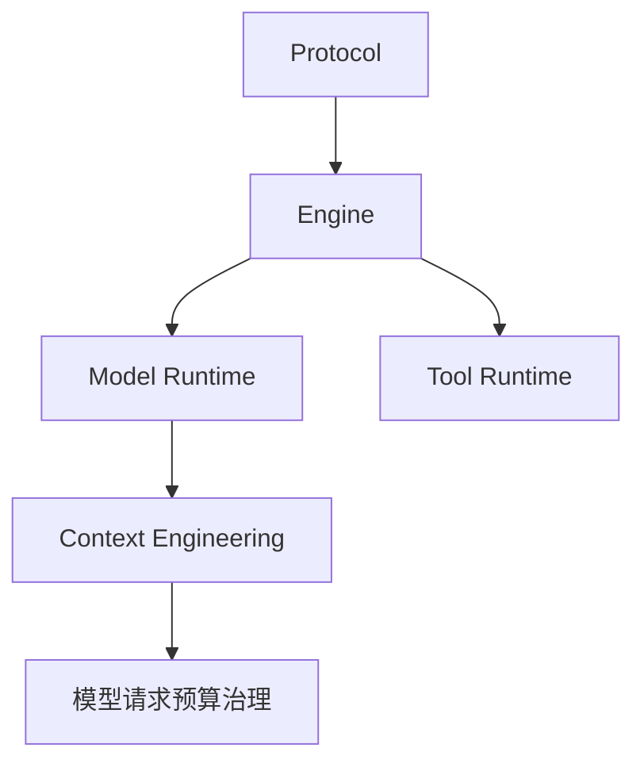
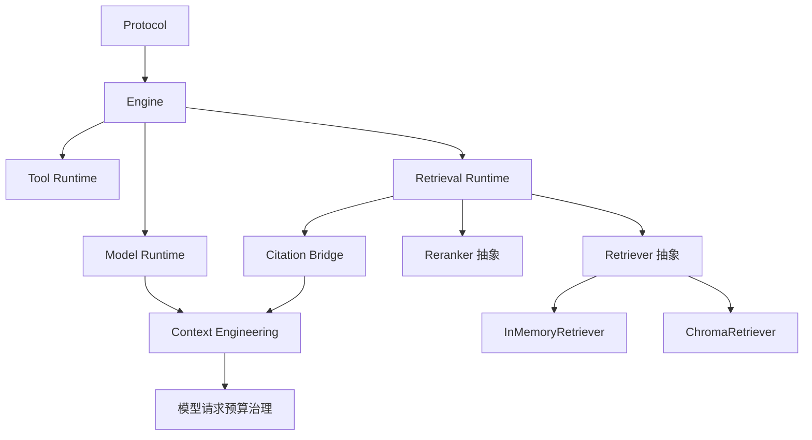
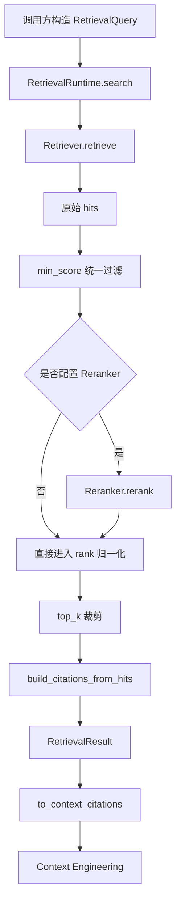
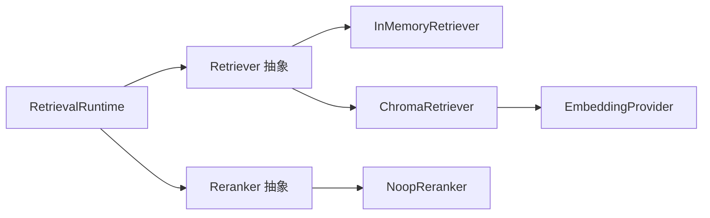

# 《从0到1工业级Agent框架打造》第八章：Retrieval 检索召回与引用标准化

## 目标

到第八章，我们终于要把 Agent 的“外部知识入口”补齐。

前面几章已经把协议、执行循环、模型适配、工具执行、可观测、上下文治理都搭起来了，但系统依然缺一个很关键的能力：当模型不知道答案时，系统怎么从外部知识源里把相关内容稳定地找回来，并且把这些内容整理成后续章节能继续消费的标准结构。

本章完成后，系统将新增以下能力：

1. 统一检索抽象：落地 `Retriever / Reranker / EmbeddingProvider` 协议，以及 `RetrievalQuery / RetrievalResult / RetrievedDocument / RetrievedCitation` 这组标准类型。
2. 检索运行时编排：实现 `RetrievalRuntime`，把“召回 -> 可选重排 -> rank 重写 -> citations 标准化”稳定收口。
3. 双轨后端实现：同时提供可离线运行的 `InMemoryRetriever` 和真实向量库适配示例 `ChromaRetriever`。
4. 引用桥接能力：把 Retrieval 产出的引用标准化后，再桥接给上一章的 Context Engineering，而不是直接把后端对象塞进模型上下文。
5. 真实 examples 与测试闭环：补齐 `examples/retrieval/retrieval_demo.py` 和三组测试，让读者不仅能看懂代码，还能看懂“为什么这样设计”。

这一章在整体架构里的定位很明确：

- 它属于外部知识访问层（Knowledge Access Layer）。
- 它解决的是“模型需要外部知识时，如何召回、如何标准化、如何可追踪”的问题。
- 它现在还不负责把引用直接拼进模型请求，也还不负责把 Retrieval 接进 Engine 主循环。那是下一阶段才做的主链路集成工作。

一句话先把本章主线说透：

> 第八章要做的不是“教你怎么用某个向量库”，而是先把一个不会锁死用户技术选型的通用 Retrieval 框架搭出来，再用 Chroma 证明这套抽象确实能接真实后端。

## 如果你第一次接触 Retrieval，先记这 3 句话

1. Retrieval 不是“接一个向量库 SDK”这么简单，而是先定义检索请求、检索结果、引用和运行时编排这些通用边界。
2. 这一章的重点不是某个后端有多强，而是框架能不能在不锁死技术选型的前提下接真实后端。
3. `Retriever` 负责找内容，`Reranker` 负责重排，`Citation Bridge` 负责把结果安全送给下游。

第一次读这一章时，先抓住这条主线：

`RetrievalQuery -> Retriever -> RetrievalRuntime -> RetrievedCitation -> Citation Bridge`

先看懂“为什么 Retrieval 要独立成组件”，再去看 `InMemoryRetriever`、`ChromaRetriever` 和测试细节，会更顺。

## 2. 架构位置说明

### 当前系统结构回顾



到这里为止，系统已经会：

1. 用 `Protocol` 表达统一消息和执行状态。
2. 用 `Engine` 跑 `plan -> act -> observe -> reflect -> update -> finish`。
3. 用 `Model Runtime` 安全调用模型。
4. 用 `Tool Runtime` 安全执行工具。
5. 用 `Observability` 做 trace / replay。
6. 用 `Context Engineering` 治理模型输入预算。

但系统还不会：

- 根据用户问题从外部知识源中召回候选文档。
- 把召回结果变成后续可消费的标准引用结构。
- 保持“后端可替换、输出可追溯、测试可稳定”的检索闭环。

### 本章新增后的结构



这一层的依赖边界必须看清楚：

- `RetrievalRuntime` 依赖 `Retriever` 和可选 `Reranker`，不依赖 Engine。
- `ChromaRetriever` 只是某个真实后端适配器，不是框架公共接口的一部分。
- `Citation Bridge` 只负责把 Retrieval 引用转换成 Context Engineering 能用的结构，不直接拼 `developer` 消息。
- `Context Engineering` 依赖桥接后的 `CitationItem`，不依赖具体向量库。

### 为什么必须把 Retrieval 放在这里，而不是别处？

如果你把 Retrieval 直接塞进 `ModelRuntime`，会立刻出现两个问题：

1. `ModelRuntime` 会从“模型适配层”变成“模型 + 检索编排层”，职责污染。
2. 一旦某家向量库的调用方式进入 `ModelRuntime`，后面所有模型请求都会被检索后端反向塑形。

如果你把 Retrieval 直接塞进 `Context Engineering`，问题也一样明显：

1. `Context Engineering` 的职责是“治理输入上下文”，不是“产生外部知识”。
2. 这样会让上一章的 `CitationItem` 失去“标准下游结构”的意义，反而把检索逻辑回灌进去。

所以本章的正确位置就是：

> Retrieval 先独立成一个组件，负责找内容、排顺序、产标准引用；Context Engineering 再决定这些引用怎么进模型。

## 名词速览

很多读者第一次看 Retrieval 代码时，不是卡在语法上，而是卡在“这些词到底在这一章里各自指什么”。下面先把高频名词统一一下：

1. `Retrieval`：检索组件总称。它不是某个类名，而是这一整层能力的名字。
2. `Retriever`：检索器协议。任何一个真正负责把候选文档找出来的后端，都要实现这套接口。
3. `Reranker`：重排器协议。它不负责召回新文档，只负责把已经召回出来的候选重新排序。
4. `EmbeddingProvider`：向量化提供者。它只负责把文本变成向量，不负责存储、不负责查询。
5. `RetrievalHit`：单条命中结果。它表示“某份文档命中了这次检索请求”，里面包含文档、分数和最终 rank。
6. `RetrievedCitation`：检索层自己的引用对象。它已经比原始文档更轻，但还没有变成 Context Engineering 的内部结构。
7. `Citation Bridge`：桥接层。它负责把 Retrieval 的引用对象转换成上一章能消费的 `CitationItem`。
8. `backend`：后端实现。比如 `InMemoryRetriever` 是本地基线后端，`ChromaRetriever` 是真实向量库后端示例。
9. `top_k`：最终最多保留多少条命中。这里说的是最终输出条数，不是后端内部一定只会取这么多候选。
10. `min_score`：最低分门槛。低于这个分数的候选，即使后端返回了，也会在 runtime 层被统一过滤掉。
11. `upsert`：更新或插入。意思是“如果文档已存在就更新，不存在就写入”，这是很多向量库常见的写入接口语义。
12. `where`：向量库过滤条件。它不是 Python 语法，而是传给 Chroma 这类后端的结构化过滤表达式。

先记住一个最关键的分工：

1. `Retriever` 负责“找”。
2. `Reranker` 负责“重新排”。
3. `Citation Bridge` 负责“把结果送给下游”。

## 前置条件

1. Python >= 3.11。
2. 已安装 `uv`。
3. 已完成前七章，尤其是上一章 `Context Engineering` 已可运行。
4. 当前在仓库根目录 `build_agent` 下执行命令。

### 环境复用验证

```codex
uv run --no-sync pytest -q
```

如果这里已经报错，不要直接进入第八章，先把前七章主线修好。

### 本章环境准备与缺包兜底

如果你只想先跑可离线路径：

```codex
uv sync --dev
```

如果你要同时跑真实向量库示例 `ChromaRetriever`：

```codex
uv sync --dev --extra retrieval-chroma
```

如果你执行 example 时遇到 `未安装 chromadb`，优先执行上面第二条命令，而不是去手动 `pip install chromadb`。原因很简单：本项目所有环境依赖都统一由 `uv` 管理，这样教程、测试和你的本地环境才一致。

## 4. 本章主线改动范围

### 代码目录

- `src/agent_forge/components/retrieval/`
- `examples/retrieval/`

### 测试目录

- `tests/unit/test_retrieval.py`
- `tests/unit/test_retrieval_chroma.py`
- `tests/unit/test_retrieval_demo.py`

### 本章涉及的真实文件

- [src/agent_forge/components/retrieval/__init__.py](../../src/agent_forge/components/retrieval/__init__.py)
- [src/agent_forge/components/retrieval/domain/__init__.py](../../src/agent_forge/components/retrieval/domain/__init__.py)
- [src/agent_forge/components/retrieval/domain/schemas.py](../../src/agent_forge/components/retrieval/domain/schemas.py)
- [src/agent_forge/components/retrieval/application/__init__.py](../../src/agent_forge/components/retrieval/application/__init__.py)
- [src/agent_forge/components/retrieval/application/runtime.py](../../src/agent_forge/components/retrieval/application/runtime.py)
- [src/agent_forge/components/retrieval/application/bridges.py](../../src/agent_forge/components/retrieval/application/bridges.py)
- [src/agent_forge/components/retrieval/infrastructure/__init__.py](../../src/agent_forge/components/retrieval/infrastructure/__init__.py)
- [src/agent_forge/components/retrieval/infrastructure/helpers.py](../../src/agent_forge/components/retrieval/infrastructure/helpers.py)
- [src/agent_forge/components/retrieval/infrastructure/rerankers.py](../../src/agent_forge/components/retrieval/infrastructure/rerankers.py)
- [src/agent_forge/components/retrieval/infrastructure/in_memory.py](../../src/agent_forge/components/retrieval/infrastructure/in_memory.py)
- [src/agent_forge/components/retrieval/infrastructure/chroma.py](../../src/agent_forge/components/retrieval/infrastructure/chroma.py)
- [examples/retrieval/retrieval_demo.py](../../examples/retrieval/retrieval_demo.py)
- [tests/unit/test_retrieval.py](../../tests/unit/test_retrieval.py)
- [tests/unit/test_retrieval_chroma.py](../../tests/unit/test_retrieval_chroma.py)
- [tests/unit/test_retrieval_demo.py](../../tests/unit/test_retrieval_demo.py)

# 5. 实施步骤

## 本章怎么学

这一章很容易看乱，因为你会同时看到“抽象层”和“真实后端示例”。

正确的阅读顺序是：

1. 先看主流程，知道 Retrieval 到底接在系统哪一层。
2. 再看 domain，理解这一章到底定义了哪些固定输入输出。
3. 然后看 runtime，理解为什么统一过滤、top_k 和 rank 要放在编排层。
4. 再看两个后端：一个负责离线可跑，一个负责证明这套抽象能接真实向量库。
5. 最后看 examples 和 tests，确认这不是“概念代码”，而是真能跑、真能测、真能解释的工程增量。

---

## 第 1 步：先把 Retrieval 主流程讲透，不急着写代码

如果只用一句话描述 `RetrievalRuntime.search()`，它做的是：

> 收到一个标准检索请求，交给某个 `Retriever` 去找候选，必要时再经过 `Reranker` 调整顺序，最后输出标准命中结果和标准引用结果。

主流程图如下：



再看双轨后端结构：



### 成功链路例子

假设用户问：“请帮我找和 retrieval adapter 相关的设计说明。”

系统会这样走：

1. 调用方构造 `RetrievalQuery(query_text="retrieval adapter", top_k=2)`。
2. `RetrievalRuntime` 调用当前注入的检索器，比如 `InMemoryRetriever`。
3. 检索器返回一组 `RetrievalHit`。
4. runtime 统一过滤分数、写入 rank、裁到 `top_k`。
5. runtime 再从最终 hits 里生成 `RetrievedCitation`。
6. 后续如果要交给上一章，就通过 `to_context_citations()` 转成 `CitationItem`。

### 失败链路例子

更真实的情况是：

1. 你用了 `ChromaRetriever`。
2. 文档 metadata 里塞了 list 或 dict。
3. 真实向量库不接受这种类型。
4. 如果没有适配层收口，运行时会在真实写入阶段炸掉，错误既不稳定，也不好解释。本章现在的设计是：

- domain 层允许 `metadata: dict[str, Any]` 保持开放。
- 但 `ChromaRetriever` 写入前会强制收口，只允许标量类型。
- 遇到不兼容值时，直接抛出清晰错误，不让错误拖到更深的下游。

这就是这一章的工程风格：抽象保持通用，适配层承担真实后端约束。

---

## 第 2 步：创建组件包与导出骨架

这一章先把 Retrieval 的包结构搭起来。这样后面每个文件的角色会非常清楚。

### 2.1 创建组件根包导出

文件：[src/agent_forge/components/retrieval/__init__.py](../../src/agent_forge/components/retrieval/__init__.py)

```codex
New-Item -ItemType Directory -Force "src\agent_forge\components\retrieval" | Out-Null
New-Item -ItemType File -Force "src\agent_forge\components\retrieval\__init__.py" | Out-Null
```

```python
"""Retrieval 组件导出。"""

from agent_forge.components.retrieval.application import RetrievalRuntime, build_citations_from_hits, to_context_citations
from agent_forge.components.retrieval.domain import (
    EmbeddingProvider,
    RetrievedCitation,
    RetrievedDocument,
    RetrievalFilters,
    RetrievalHit,
    RetrievalQuery,
    RetrievalResult,
    Reranker,
    Retriever,
)
from agent_forge.components.retrieval.infrastructure import ChromaRetriever, InMemoryRetriever, NoopReranker

__all__ = [
    "EmbeddingProvider",
    "Retriever",
    "Reranker",
    "RetrievalFilters",
    "RetrievalQuery",
    "RetrievedDocument",
    "RetrievedCitation",
    "RetrievalHit",
    "RetrievalResult",
    "RetrievalRuntime",
    "build_citations_from_hits",
    "to_context_citations",
    "InMemoryRetriever",
    "NoopReranker",
    "ChromaRetriever",
]
```

代码讲解：

1. 这层只是门面导出，不做业务逻辑。
2. 但它很重要，因为这一章后面的 example 和测试都通过这里导入，读者也最容易看到组件的公共边界。
3. 这里把 `ChromaRetriever` 一起导出，不代表框架绑定 Chroma，只代表仓库自带一个真实后端适配示例。

### 2.2 创建领域层导出

文件：[src/agent_forge/components/retrieval/domain/__init__.py](../../src/agent_forge/components/retrieval/domain/__init__.py)

```codex
New-Item -ItemType Directory -Force "src\agent_forge\components\retrieval\domain" | Out-Null
New-Item -ItemType File -Force "src\agent_forge\components\retrieval\domain\__init__.py" | Out-Null
```

```python
"""Retrieval 领域导出。"""

from .schemas import (
    EmbeddingProvider,
    RetrievedCitation,
    RetrievedDocument,
    RetrievalFilters,
    RetrievalHit,
    RetrievalQuery,
    RetrievalResult,
    Reranker,
    Retriever,
)

__all__ = [
    "EmbeddingProvider",
    "Retriever",
    "Reranker",
    "RetrievalFilters",
    "RetrievalQuery",
    "RetrievedDocument",
    "RetrievedCitation",
    "RetrievalHit",
    "RetrievalResult",
]
```

### 2.3 创建应用层导出

文件：[src/agent_forge/components/retrieval/application/__init__.py](../../src/agent_forge/components/retrieval/application/__init__.py)

```codex
New-Item -ItemType Directory -Force "src\agent_forge\components\retrieval\application" | Out-Null
New-Item -ItemType File -Force "src\agent_forge\components\retrieval\application\__init__.py" | Out-Null
```

```python
"""Retrieval 应用层导出。"""

from .bridges import build_citations_from_hits, to_context_citations
from .runtime import RetrievalRuntime

__all__ = ["RetrievalRuntime", "build_citations_from_hits", "to_context_citations"]
```

### 2.4 创建基础设施层导出

文件：[src/agent_forge/components/retrieval/infrastructure/__init__.py](../../src/agent_forge/components/retrieval/infrastructure/__init__.py)

```codex
New-Item -ItemType Directory -Force "src\agent_forge\components\retrieval\infrastructure" | Out-Null
New-Item -ItemType File -Force "src\agent_forge\components\retrieval\infrastructure\__init__.py" | Out-Null
```

```python
"""Retrieval 基础设施导出。"""

from .chroma import ChromaRetriever
from .in_memory import InMemoryRetriever
from .rerankers import NoopReranker

__all__ = ["InMemoryRetriever", "NoopReranker", "ChromaRetriever"]
```

代码讲解：

1. domain / application / infrastructure 三层分开后，后面你一眼就能看出哪些是组件语义，哪些是编排逻辑，哪些是后端适配。
2. 这对 Retrieval 尤其重要，因为这章最容易被某个真实向量库带偏。
3. 如果不先把分层定住，后面 `ChromaRetriever` 很容易一路倒灌，把整个组件写成某个 SDK 的包装层。

---

## 第 3 步：先定义领域模型，把输入输出钉死

这一步是本章最重要的基础。

Retrieval 框架通不通用，不是看你接没接 Chroma，而是看你有没有先把“请求长什么样、结果长什么样、后端协议长什么样”设计干净。

文件：[src/agent_forge/components/retrieval/domain/schemas.py](../../src/agent_forge/components/retrieval/domain/schemas.py)

```codex
New-Item -ItemType File -Force "src\agent_forge\components\retrieval\domain\schemas.py" | Out-Null
```

```python
"""Retrieval 领域模型定义。"""

from __future__ import annotations

from typing import Any, Protocol

from pydantic import BaseModel, Field


class RetrievalFilters(BaseModel):
    """通用检索过滤条件。"""

    document_ids: list[str] = Field(default_factory=list, description="限定可命中的文档 ID 列表。")
    source_uris: list[str] = Field(default_factory=list, description="限定可命中的来源 URI 列表。")
    metadata_equals: dict[str, Any] = Field(default_factory=dict, description="要求严格相等的元数据键值。")


class RetrievalQuery(BaseModel):
    """标准化检索请求。"""

    query_text: str = Field(..., min_length=1, description="检索查询文本。")
    top_k: int = Field(default=5, ge=1, description="返回命中数上限。")
    min_score: float | None = Field(default=None, description="最低可接受分数。")
    filters: RetrievalFilters = Field(default_factory=RetrievalFilters, description="通用过滤条件。")
    trace_id: str | None = Field(default=None, description="可选 trace 标识。")
    run_id: str | None = Field(default=None, description="可选 run 标识。")


class RetrievedDocument(BaseModel):
    """标准化文档实体。"""

    document_id: str = Field(..., min_length=1, description="文档唯一标识。")
    content: str = Field(..., description="文档正文内容。")
    title: str = Field(default="", description="文档标题。")
    source_uri: str = Field(default="", description="文档来源 URI。")
    metadata: dict[str, Any] = Field(default_factory=dict, description="通用元数据。")


class RetrievedCitation(BaseModel):
    """标准化引用条目。"""

    document_id: str = Field(..., min_length=1, description="引用对应的文档 ID。")
    title: str = Field(default="", description="引用标题。")
    source_uri: str = Field(default="", description="引用来源 URI。")
    snippet: str = Field(default="", description="引用摘要片段。")
    score: float | None = Field(default=None, description="可选检索得分。")


class RetrievalHit(BaseModel):
    """单条检索命中。"""

    document: RetrievedDocument = Field(..., description="命中文档。")
    score: float = Field(default=0.0, description="命中分数。")
    rank: int = Field(default=0, ge=0, description="最终排序名次，从 1 开始写入。")


class RetrievalResult(BaseModel):
    """统一检索结果。"""

    hits: list[RetrievalHit] = Field(default_factory=list, description="最终命中列表。")
    citations: list[RetrievedCitation] = Field(default_factory=list, description="标准化引用列表。")
    backend_name: str = Field(..., min_length=1, description="检索后端名称。")
    retriever_version: str = Field(..., min_length=1, description="检索器版本。")
    reranker_version: str = Field(..., min_length=1, description="重排器版本。")
    total_candidates: int = Field(default=0, ge=0, description="进入最终裁剪前的候选总数。")


class Retriever(Protocol):
    """检索器协议。"""

    backend_name: str
    retriever_version: str

    def retrieve(self, query: RetrievalQuery) -> list[RetrievalHit]:
        """执行检索。"""


class Reranker(Protocol):
    """重排器协议。"""

    reranker_name: str
    reranker_version: str

    def rerank(self, query: RetrievalQuery, hits: list[RetrievalHit]) -> list[RetrievalHit]:
        """执行重排。"""


class EmbeddingProvider(Protocol):
    """向量嵌入提供者协议。"""

    provider_name: str
    provider_version: str

    def embed_query(self, text: str) -> list[float]:
        """对单条查询文本做向量化。"""

    def embed_documents(self, texts: list[str]) -> list[list[float]]:
        """对多条文档文本做向量化。"""
```

### 代码讲解

1. 这一层做的事情只有一个：把 Retrieval 组件的语言定义清楚。
2. 如果这里不用显式模型，而是一路用 dict 传来传去，后面一定会出现后端专属字段污染公共接口的问题。
3. `metadata: dict[str, Any]` 故意保持开放，因为抽象层应该中立；真实向量库的限制应该由适配层收口，而不是在 domain 层就写死。
4. `trace_id / run_id` 先放在 query 扩展位，是为了后续接可观测与评估时不用回头改公共接口。

### 名词对位讲解

为了避免你看完字段还是容易混，这里再把几个核心对象用一句人话对齐一下：

1. `RetrievalQuery`：这次我要查什么。
2. `RetrievalFilters`：这次允许在哪些文档里查。
3. `RetrievedDocument`：真正被找回来的文档标准形态。
4. `RetrievalHit`：这份文档为什么算命中，以及它的分数和顺序。
5. `RetrievedCitation`：把命中文档压缩成“能被回答阶段引用”的轻量结构。
6. `RetrievalResult`：这一整次检索最终要交出去的总结果包。

如果你把这几个类看成一条流水线，顺序就是：

`RetrievalQuery -> RetrievalHit -> RetrievedCitation -> RetrievalResult`

这里最容易误解的一点是：

1. `RetrievedDocument` 不是最终要直接喂给模型的东西。
2. `RetrievedCitation` 也不是上一章最终内部使用的 `CitationItem`。
3. 真正进入下游之前，中间还要过 bridge。

---

## 第 4 步：实现 RetrievalRuntime，把统一编排放在运行时

文件：[src/agent_forge/components/retrieval/application/runtime.py](../../src/agent_forge/components/retrieval/application/runtime.py)

```codex
New-Item -ItemType File -Force "src\agent_forge\components\retrieval\application\runtime.py" | Out-Null
```

```python
"""Retrieval 运行时。"""

from __future__ import annotations

from agent_forge.components.retrieval.application.bridges import build_citations_from_hits
from agent_forge.components.retrieval.domain import RetrievalHit, RetrievalQuery, RetrievalResult, Reranker, Retriever


class RetrievalRuntime:
    """编排检索与重排流水线。"""

    def __init__(self, retriever: Retriever, reranker: Reranker | None = None) -> None:
        self._retriever = retriever
        self._reranker = reranker

    def search(self, query: RetrievalQuery) -> RetrievalResult:
        # 1. 先调用检索器拿到原始候选，保留候选总量用于后续评测与审计。
        raw_hits = self._retriever.retrieve(query)
        total_candidates = len(raw_hits)

        # 2. 在运行时统一执行最小分数过滤，避免把这个规则绑死到任一后端。
        filtered_hits = _apply_score_filter(raw_hits, query.min_score)

        # 3. 若配置了重排器，则在统一抽象层执行重排；否则走直通路径。
        ranked_hits = filtered_hits if self._reranker is None else self._reranker.rerank(query, filtered_hits)

        # 4. 最终在运行时统一裁到 top_k 并写入 rank，保证不同后端输出形状一致。
        final_hits = _normalize_ranks(ranked_hits[: query.top_k])

        # 5. 用最终命中构造标准化 citations，形成可直接交给上下文工程的桥接结果。
        citations = build_citations_from_hits(final_hits)
        reranker_version = "none" if self._reranker is None else self._reranker.reranker_version

        return RetrievalResult(
            hits=final_hits,
            citations=citations,
            backend_name=self._retriever.backend_name,
            retriever_version=self._retriever.retriever_version,
            reranker_version=reranker_version,
            total_candidates=total_candidates,
        )


def _apply_score_filter(hits: list[RetrievalHit], min_score: float | None) -> list[RetrievalHit]:
    if min_score is None:
        return [item.model_copy(deep=True) for item in hits]
    return [item.model_copy(deep=True) for item in hits if item.score >= min_score]


def _normalize_ranks(hits: list[RetrievalHit]) -> list[RetrievalHit]:
    output: list[RetrievalHit] = []
    for index, hit in enumerate(hits, start=1):
        copied = hit.model_copy(deep=True)
        copied.rank = index
        output.append(copied)
    return output
```

### 代码讲解

1. runtime 不自己接具体向量库，也不自己决定引用怎么进模型消息。
2. 它只做一件事：把不同后端、不同可选重排、不同分数策略，统一收口成一套稳定输出。
3. `min_score`、`top_k`、`rank` 如果都交给后端自己处理，整个框架就会变成“每个后端一套语义”。
4. 本章选择反过来：后端负责给候选，runtime 负责定义最终结果语义。

### 名词对位讲解

这一段里有四个容易看混的词，最好在这里就压住：

1. `raw_hits`：后端原样交回来的候选。它只说明“这些文档可能相关”，还不是最终结果。
2. `filtered_hits`：runtime 按统一规则过滤之后留下来的候选。这里主要做的是 `min_score` 过滤。
3. `ranked_hits`：如果配置了 `Reranker`，这里是重排之后的顺序；如果没有重排器，这里和 `filtered_hits` 是同一语义层。
4. `final_hits`：最终对外返回的命中。它已经被裁到 `top_k`，并且 rank 已经统一重写。

也就是说，这几个变量不是“为了拆变量而拆变量”，而是在显式表达流水线的阶段边界：

1. 先拿候选。
2. 再过滤。
3. 再决定顺序。
4. 最后再封装输出。
---

## 第 5 步：实现 Citation Bridge，给上一章留标准接口

Retrieval 自己产出的 citation，不应该直接长成 Context Engineering 的内部结构。否则两章会强耦合，后面哪怕只改一个字段名，两个组件都得一起动。

### 5.1 实现 bridges.py

文件：[src/agent_forge/components/retrieval/application/bridges.py](../../src/agent_forge/components/retrieval/application/bridges.py)

```codex
New-Item -ItemType File -Force "src\agent_forge\components\retrieval\application\bridges.py" | Out-Null
```

```python
"""Retrieval 与上下游组件的桥接工具。"""

from __future__ import annotations

from agent_forge.components.context_engineering import CitationItem
from agent_forge.components.retrieval.domain import RetrievedCitation, RetrievalHit


def build_citations_from_hits(hits: list[RetrievalHit], max_snippet_chars: int = 240) -> list[RetrievedCitation]:
    citations: list[RetrievedCitation] = []
    for hit in hits:
        document = hit.document
        snippet = document.content[:max_snippet_chars].strip()
        citations.append(
            RetrievedCitation(
                document_id=document.document_id,
                title=document.title or document.document_id,
                source_uri=document.source_uri,
                snippet=snippet,
                score=hit.score,
            )
        )
    return citations


def to_context_citations(citations: list[RetrievedCitation]) -> list[CitationItem]:
    output: list[CitationItem] = []
    for item in citations:
        output.append(
            CitationItem(
                source_id=item.document_id,
                title=item.title or item.document_id,
                url=item.source_uri or item.document_id,
                snippet=item.snippet,
                score=item.score,
            )
        )
    return output
```

### 代码讲解

1. 这一层做的是桥接，不是合并组件。
2. `RetrievedCitation` 表达的是 Retrieval 自己的语义；上一章的 `CitationItem` 表达的是 Context Engineering 的语义。
3. 桥接函数的存在，就是为了让 Retrieval 知道“如何把数据桥接出去”，但不知道“下游最终怎么消费”。

### 名词对位讲解

这里最容易混淆的两个词就是 `citation` 和 `bridge`：

1. `citation`：引用本身，重点是“回答时需要引用哪些外部证据”。
2. `bridge`：桥接动作，重点是“如何把这一章的结果转换成上一章能消费的结构”。

所以不要把这两个概念混在一起：

1. `build_citations_from_hits()` 在做“生成引用”。
2. `to_context_citations()` 在做“跨组件转换”。

前者解决 Retrieval 域内部的标准化问题，后者解决组件边界问题。

### 5.2 实现通用过滤辅助和基线重排器

文件：[src/agent_forge/components/retrieval/infrastructure/helpers.py](../../src/agent_forge/components/retrieval/infrastructure/helpers.py)

```codex
New-Item -ItemType File -Force "src\agent_forge\components\retrieval\infrastructure\helpers.py" | Out-Null
```

```python
"""Retrieval 基础设施辅助函数。"""

from __future__ import annotations

from agent_forge.components.retrieval.domain import RetrievedDocument, RetrievalFilters


def matches_filters(document: RetrievedDocument, filters: RetrievalFilters) -> bool:
    if filters.document_ids and document.document_id not in filters.document_ids:
        return False
    if filters.source_uris and document.source_uri not in filters.source_uris:
        return False
    for key, value in filters.metadata_equals.items():
        if document.metadata.get(key) != value:
            return False
    return True
```

文件：[src/agent_forge/components/retrieval/infrastructure/rerankers.py](../../src/agent_forge/components/retrieval/infrastructure/rerankers.py)

```codex
New-Item -ItemType File -Force "src\agent_forge\components\retrieval\infrastructure\rerankers.py" | Out-Null
```

```python
"""Retrieval 基线重排器。"""

from __future__ import annotations

from agent_forge.components.retrieval.domain import RetrievalHit, RetrievalQuery


class NoopReranker:
    """不改变顺序的基线重排器。"""

    reranker_name = "noop"
    reranker_version = "none"

    def rerank(self, query: RetrievalQuery, hits: list[RetrievalHit]) -> list[RetrievalHit]:
        return [item.model_copy(deep=True) for item in hits]
```

代码讲解：

1. `matches_filters()` 是两个后端共享的最小过滤语义定义。只要两个后端最终都服从它，框架层过滤行为就不容易飘。
2. `NoopReranker` 看起来很简单，但它的意义不是省事，而是把 reranker 抽象先站稳。这样本章就能先完成通用接口，而不需要一口气把真实 rerank 服务也绑进来。

---

## 第 6 步：实现可离线基线后端 InMemoryRetriever

`InMemoryRetriever` 不是玩具代码，而是这一章的离线基线后端。它的作用是保证：

1. 没有任何外部依赖时，这一章依然能完整跑通。
2. 测试不依赖真实向量库，也能稳定验证主线行为。
3. 框架抽象先站稳，再去接真实后端。

文件：[src/agent_forge/components/retrieval/infrastructure/in_memory.py](../../src/agent_forge/components/retrieval/infrastructure/in_memory.py)

```codex
New-Item -ItemType File -Force "src\agent_forge\components\retrieval\infrastructure\in_memory.py" | Out-Null
```

```python
"""可离线运行的内存检索实现。"""

from __future__ import annotations

import re

from agent_forge.components.retrieval.domain import RetrievedDocument, RetrievalHit, RetrievalQuery
from agent_forge.components.retrieval.infrastructure.helpers import matches_filters


class InMemoryRetriever:
    """基于内存文档集的稳定检索器。"""

    def __init__(
        self,
        documents: list[RetrievedDocument],
        *,
        backend_name: str = "inmemory",
        retriever_version: str = "inmemory-v1",
    ) -> None:
        self.backend_name = backend_name
        self.retriever_version = retriever_version
        self._documents = [item.model_copy(deep=True) for item in documents]

    def retrieve(self, query: RetrievalQuery) -> list[RetrievalHit]:
        # 1. 先做通用过滤，保证框架层 filters 语义在本地后端也成立。
        candidates = [doc for doc in self._documents if matches_filters(doc, query.filters)]
        query_terms = _tokenize(query.query_text)
        hits: list[RetrievalHit] = []

        # 2. 对每篇候选文档计算稳定分数；这里追求可预测，而不是追求检索效果最优。
        for document in candidates:
            score = _score_document(query.query_text, query_terms, document)
            if score <= 0:
                continue
            hits.append(
                RetrievalHit(
                    document=document.model_copy(deep=True),
                    score=score,
                )
            )

        # 3. 最终按分数和 document_id 稳定排序，避免测试与回放结果抖动。
        hits.sort(key=lambda item: (-item.score, item.document.document_id))
        return hits


def _tokenize(text: str) -> list[str]:
    return [item for item in re.split(r"\W+", text.lower()) if item]


def _score_document(query_text: str, query_terms: list[str], document: RetrievedDocument) -> float:
    haystack = f"{document.title} {document.content}".lower()
    if not haystack.strip():
        return 0.0
    if query_text.lower() in haystack:
        return 1.0
    if not query_terms:
        return 0.0
    matched = sum(1 for term in query_terms if term in haystack)
    return matched / len(query_terms)
```

### 代码讲解

1. `InMemoryRetriever` 的目标不是检索效果最好，而是框架行为最稳定。
2. 先过滤再评分，意味着框架层 `filters` 语义优先，也保证 `InMemoryRetriever` 和 `ChromaRetriever` 至少朝着同一个语义方向靠齐。
3. 如果文档正文为空，或者 query 拆词后没有有效词元，检索不到是正常业务分支，不是系统级错误。
4. 在这个阶段，稳定和可解释，比更高的召回效果更重要。

### 名词对位讲解

这一段里还有三个工程词，最好顺手讲清：

1. `tokenize`：这里不是大模型 tokenizer，而是最简单的检索分词动作，目的是把句子切成可比较的词元集合。
2. `score`：这里不是模型置信度，也不是概率，只是当前后端定义的“相关性分数”。
3. `stable sort`：稳定排序。意思是当两条结果分数一样时，排序规则仍然固定，不会一次一个样。

---

## 第 7 步：实现真实向量库适配示例 ChromaRetriever

这一步的目标不是告诉读者框架只能用 Chroma，而是证明：我们前面设计的通用 Retrieval 抽象，真的能接上一个真实向量库，而且不会把整个框架反向绑死到这个后端上。

文件：[src/agent_forge/components/retrieval/infrastructure/chroma.py](../../src/agent_forge/components/retrieval/infrastructure/chroma.py)

```codex
New-Item -ItemType File -Force "src\agent_forge\components\retrieval\infrastructure\chroma.py" | Out-Null
```

```python
"""Chroma 向量检索适配器。"""

from __future__ import annotations

import importlib
from typing import Any

from agent_forge.components.retrieval.domain import (
    EmbeddingProvider,
    RetrievedDocument,
    RetrievalFilters,
    RetrievalHit,
    RetrievalQuery,
)
from agent_forge.components.retrieval.infrastructure.helpers import matches_filters


class ChromaRetriever:
    """基于 Chroma 的真实向量检索适配器。"""

    def __init__(
        self,
        *,
        embedding_provider: EmbeddingProvider,
        collection: Any | None = None,
        client: Any | None = None,
        collection_name: str = "agent_forge_retrieval",
        backend_name: str = "chroma",
        retriever_version: str = "chroma-v1",
    ) -> None:
        self.backend_name = backend_name
        self.retriever_version = retriever_version
        self._embedding_provider = embedding_provider
        self._collection = self._resolve_collection(collection=collection, client=client, collection_name=collection_name)

    def upsert_documents(self, documents: list[RetrievedDocument]) -> None:
        if not documents:
            return
        ids = [item.document_id for item in documents]
        texts = [item.content for item in documents]
        metadatas = [_document_to_metadata(item) for item in documents]
        embeddings = self._embedding_provider.embed_documents(texts)
        if hasattr(self._collection, "upsert"):
            self._collection.upsert(ids=ids, documents=texts, metadatas=metadatas, embeddings=embeddings)
            return
        self._collection.add(ids=ids, documents=texts, metadatas=metadatas, embeddings=embeddings)

    def retrieve(self, query: RetrievalQuery) -> list[RetrievalHit]:
        query_vector = self._embedding_provider.embed_query(query.query_text)
        query_kwargs: dict[str, Any] = {
            "query_embeddings": [query_vector],
            "n_results": max(query.top_k, query.top_k * 3),
            "include": ["documents", "metadatas", "distances"],
        }
        where = _build_where(query.filters)
        if where:
            query_kwargs["where"] = where
        result = self._collection.query(**query_kwargs)
        hits = _hits_from_chroma_result(result)
        filtered_hits = [item for item in hits if matches_filters(item.document, query.filters)]
        filtered_hits.sort(key=lambda item: (-item.score, item.document.document_id))
        return filtered_hits

    def _resolve_collection(self, *, collection: Any | None, client: Any | None, collection_name: str) -> Any:
        if collection is not None:
            return collection
        if client is not None:
            return client.get_or_create_collection(name=collection_name)
        try:
            chromadb = importlib.import_module("chromadb")
        except ModuleNotFoundError as exc:
            raise RuntimeError(
                "未安装 chromadb，无法初始化 ChromaRetriever。请安装可选依赖 `agent-forge[retrieval-chroma]`，或显式注入 collection/client。"
            ) from exc
        return chromadb.EphemeralClient().get_or_create_collection(name=collection_name)


def _document_to_metadata(document: RetrievedDocument) -> dict[str, Any]:
    metadata: dict[str, Any] = {}
    for key, value in document.metadata.items():
        if value is None:
            continue
        metadata[key] = _coerce_metadata_value(key, value)
    metadata["document_id"] = document.document_id
    metadata["title"] = document.title
    metadata["source_uri"] = document.source_uri
    return metadata


def _coerce_metadata_value(key: str, value: Any) -> str | int | float | bool:
    if isinstance(value, bool):
        return value
    if isinstance(value, (str, int, float)):
        return value
    raise ValueError(
        f"ChromaRetriever 仅支持标量 metadata，字段 `{key}` 的值类型为 `{type(value).__name__}`。"
    )


def _build_where(filters: RetrievalFilters) -> dict[str, Any] | None:
    conditions: list[dict[str, Any]] = []
    if filters.document_ids:
        conditions.append(_build_scalar_or_in_condition("document_id", filters.document_ids))
    if filters.source_uris:
        conditions.append(_build_scalar_or_in_condition("source_uri", filters.source_uris))
    for key, value in filters.metadata_equals.items():
        if value is None:
            continue
        conditions.append({key: _coerce_metadata_value(key, value)})
    if not conditions:
        return None
    if len(conditions) == 1:
        return conditions[0]
    return {"$and": conditions}


def _build_scalar_or_in_condition(field_name: str, values: list[str]) -> dict[str, Any]:
    if len(values) == 1:
        return {field_name: values[0]}
    return {field_name: {"$in": values}}


def _hits_from_chroma_result(result: dict[str, Any]) -> list[RetrievalHit]:
    ids = _first_or_empty(result.get("ids"))
    documents = _first_or_empty(result.get("documents"))
    metadatas = _first_or_empty(result.get("metadatas"))
    distances = _first_or_empty(result.get("distances"))
    hits: list[RetrievalHit] = []
    for index, document_id in enumerate(ids):
        metadata = metadatas[index] if index < len(metadatas) and isinstance(metadatas[index], dict) else {}
        content = documents[index] if index < len(documents) else ""
        distance = distances[index] if index < len(distances) else None
        score = _distance_to_score(distance)
        hits.append(
            RetrievalHit(
                document=RetrievedDocument(
                    document_id=str(metadata.get("document_id") or document_id),
                    content=str(content),
                    title=str(metadata.get("title", "")),
                    source_uri=str(metadata.get("source_uri", "")),
                    metadata={key: value for key, value in metadata.items() if key not in {"document_id", "title", "source_uri"}},
                ),
                score=score,
            )
        )
    return hits


def _distance_to_score(distance: Any) -> float:
    if not isinstance(distance, (int, float)):
        return 0.0
    if distance <= 0:
        return 1.0
    return 1.0 / (1.0 + float(distance))


def _first_or_empty(payload: Any) -> list[Any]:
    if not isinstance(payload, list) or not payload:
        return []
    head = payload[0]
    return head if isinstance(head, list) else payload
```

### 代码讲解

1. `ChromaRetriever` 的价值，不是会调 Chroma API，而是把框架标准文档写进真实向量库，再把真实向量库结果拉回框架标准结构。
2. `EmbeddingProvider` 必须注入，而不是写死 OpenAI。这样向量库选择和 embedding 选择不会被绑成一件事。
3. `metadata` 在这里收口，而不是前面就限制，是因为抽象层应该开放，适配层应该承担真实约束。
4. filters 现在会尽量下推成 `where`，再用 `matches_filters()` 做兜底，这样能最大程度保持和 `InMemoryRetriever` 一致的过滤语义。
5. 这一章不接真实 reranker，不是做不了，而是避免把“检索抽象、向量库接入、embedding 注入、重排技术选型”四件事一次性压给读者。

### 名词对位讲解

这一段第一次出现了很多真实向量库术语，如果这里不解释，读者很容易把“框架词”和“后端词”混在一起：

1. `collection`：可以理解成 Chroma 里的一个文档集合，类似“这批向量存在哪个逻辑容器里”。
2. `embedding`：把文本转换成数值向量后的结果。向量库本身不生产语义，它只存储和比较这些向量。
3. `distance`：向量距离。很多向量库返回的是“距离越小越相似”，而框架对外更习惯暴露“分数越高越相关”，所以这里需要转换。
4. `metadata`：附加在文档上的结构化字段，比如主题、来源、标签。它不是正文，但会影响过滤和回溯。
5. `where`：传给 Chroma 的过滤表达式。它的作用相当于“先限定范围，再在范围内做向量查询”。
6. `upsert`：已有就更新，没有就插入。这个词在向量库和搜索索引里很常见。

把这些词压缩成一句话就是：

`embedding_provider` 负责把文本变成向量，`collection` 负责存这些向量，`where` 负责限定检索范围，`distance` 最后再被换算成主线框架可理解的 `score`。
---

## 第 8 步：补一个真实可运行的 Retrieval example

这里要先强调一个规则：`examples/` 是示例目录，不是包目录，所以这里不创建 `__init__.py`。

### 8.1 创建 example 脚本

文件：[examples/retrieval/retrieval_demo.py](../../examples/retrieval/retrieval_demo.py)

```codex
New-Item -ItemType Directory -Force "examples\retrieval" | Out-Null
New-Item -ItemType File -Force "examples\retrieval\retrieval_demo.py" | Out-Null
```

```python
"""第八章：Retrieval 可运行示例。"""

from __future__ import annotations

import json
from typing import Any

from agent_forge.components.retrieval import (
    ChromaRetriever,
    InMemoryRetriever,
    RetrievedDocument,
    RetrievalQuery,
    RetrievalRuntime,
)


class LocalHashEmbeddingProvider:
    """示例用本地嵌入器，避免把示例绑死到外部 API。"""

    provider_name = "local-hash"
    provider_version = "local-hash-v1"

    def embed_query(self, text: str) -> list[float]:
        return self._embed(text)

    def embed_documents(self, texts: list[str]) -> list[list[float]]:
        return [self._embed(text) for text in texts]

    def _embed(self, text: str) -> list[float]:
        lowered = text.lower()
        return [
            float(len(lowered)),
            float(lowered.count("retrieval")),
            float(lowered.count("vector")),
            float(lowered.count("policy")),
        ]


def build_demo_documents() -> list[RetrievedDocument]:
    return [
        RetrievedDocument(
            document_id="doc-1",
            title="Retrieval Architecture",
            content="Retrieval architecture should keep retriever and reranker pluggable.",
            source_uri="memory://doc-1",
            metadata={"topic": "retrieval"},
        ),
        RetrievedDocument(
            document_id="doc-2",
            title="Vector Database Integration",
            content="Vector database integration should stay behind a stable adapter interface.",
            source_uri="memory://doc-2",
            metadata={"topic": "vector"},
        ),
        RetrievedDocument(
            document_id="doc-3",
            title="Policy Search Notes",
            content="Policy search requires citations that can be forwarded into context engineering.",
            source_uri="memory://doc-3",
            metadata={"topic": "policy"},
        ),
    ]


def run_inmemory_demo() -> dict[str, Any]:
    runtime = RetrievalRuntime(InMemoryRetriever(build_demo_documents()))
    result = runtime.search(RetrievalQuery(query_text="retrieval vector adapter", top_k=2))
    return {
        "backend_name": result.backend_name,
        "retriever_version": result.retriever_version,
        "reranker_version": result.reranker_version,
        "hits": [
            {
                "document_id": item.document.document_id,
                "title": item.document.title,
                "score": item.score,
                "rank": item.rank,
            }
            for item in result.hits
        ],
        "citations": [item.model_dump() for item in result.citations],
    }


def run_chroma_demo() -> dict[str, Any]:
    embedding_provider = LocalHashEmbeddingProvider()
    try:
        retriever = ChromaRetriever(embedding_provider=embedding_provider)
    except RuntimeError as exc:
        return {
            "available": False,
            "reason": str(exc),
            "hits": [],
        }

    try:
        retriever.upsert_documents(build_demo_documents())
        hits = retriever.retrieve(RetrievalQuery(query_text="vector adapter", top_k=2))
    except Exception as exc:
        return {
            "available": False,
            "reason": f"Chroma 检索运行失败: {exc}",
            "hits": [],
        }
    return {
        "available": True,
        "backend_name": retriever.backend_name,
        "retriever_version": retriever.retriever_version,
        "hits": [
            {
                "document_id": item.document.document_id,
                "title": item.document.title,
                "score": item.score,
            }
            for item in hits
        ],
    }


def run_demo() -> dict[str, Any]:
    return {
        "inmemory": run_inmemory_demo(),
        "chroma": run_chroma_demo(),
    }


def print_demo_result(result: dict[str, Any]) -> None:
    print("=== inmemory ===")
    print(json.dumps(result["inmemory"], ensure_ascii=False, indent=2))
    print()
    print("=== chroma ===")
    print(json.dumps(result["chroma"], ensure_ascii=False, indent=2))


def main() -> None:
    result = run_demo()
    print_demo_result(result)


if __name__ == "__main__":
    main()
```

### 代码讲解

1. example 必须同时有两条路径：`inmemory` 负责保证仓库永远可离线跑通；`chroma` 负责证明抽象层确实能接真实向量库。
2. 这里的 `LocalHashEmbeddingProvider` 是为了让真实向量库路径在仓库里可运行，不代表完整生产 embedding 服务已经接入。
3. Chroma 路径做了两层可解释降级：初始化失败和运行期失败。这样示例更稳，读者更容易定位问题。

---

## 第 9 步：补齐单元测试和 example 测试，把行为钉死

### 9.1 Retrieval 主线测试

文件：[tests/unit/test_retrieval.py](../../tests/unit/test_retrieval.py)

```codex
New-Item -ItemType File -Force "tests\unit\test_retrieval.py" | Out-Null
```

```python
"""Retrieval 组件单元测试。"""

from __future__ import annotations

from agent_forge.components.context_engineering import ContextBudget, ContextEngineeringRuntime
from agent_forge.components.retrieval import (
    InMemoryRetriever,
    RetrievedDocument,
    RetrievalFilters,
    RetrievalHit,
    RetrievalQuery,
    RetrievalRuntime,
    build_citations_from_hits,
    to_context_citations,
)


class _ReverseScoreReranker:
    reranker_name = "reverse-score"
    reranker_version = "reverse-score-v1"

    def rerank(self, query: RetrievalQuery, hits: list[RetrievalHit]) -> list[RetrievalHit]:
        return sorted([item.model_copy(deep=True) for item in hits], key=lambda item: item.score)


def _documents() -> list[RetrievedDocument]:
    return [
        RetrievedDocument(
            document_id="doc-1",
            title="Python Tool Runtime",
            content="Python tool runtime supports timeout and retry policies.",
            source_uri="memory://doc-1",
            metadata={"topic": "tool"},
        ),
        RetrievedDocument(
            document_id="doc-2",
            title="Retrieval with Vectors",
            content="Vector retrieval needs embeddings and stable citations.",
            source_uri="memory://doc-2",
            metadata={"topic": "retrieval"},
        ),
        RetrievedDocument(
            document_id="doc-3",
            title="Agent Planning",
            content="Planning and reflection are engine responsibilities.",
            source_uri="memory://doc-3",
            metadata={"topic": "engine"},
        ),
    ]


def test_in_memory_retriever_should_return_sorted_hits() -> None:
    retriever = InMemoryRetriever(_documents())
    hits = retriever.retrieve(RetrievalQuery(query_text="retrieval embeddings", top_k=3))
    assert len(hits) >= 1
    assert hits[0].document.document_id == "doc-2"
    assert hits[0].score >= hits[-1].score


def test_retrieval_runtime_should_build_result_with_versions_and_citations() -> None:
    runtime = RetrievalRuntime(InMemoryRetriever(_documents()))
    result = runtime.search(RetrievalQuery(query_text="tool runtime retry", top_k=2))
    assert result.backend_name == "inmemory"
    assert result.retriever_version == "inmemory-v1"
    assert result.reranker_version == "none"
    assert result.total_candidates >= len(result.hits)
    assert len(result.citations) == len(result.hits)


def test_retrieval_runtime_should_apply_reranker_and_rewrite_rank() -> None:
    runtime = RetrievalRuntime(InMemoryRetriever(_documents()), reranker=_ReverseScoreReranker())
    result = runtime.search(RetrievalQuery(query_text="retrieval vector embeddings", top_k=2))
    assert len(result.hits) >= 1
    assert result.reranker_version == "reverse-score-v1"
    assert [item.rank for item in result.hits] == list(range(1, len(result.hits) + 1))


def test_retriever_should_apply_filters() -> None:
    retriever = InMemoryRetriever(_documents())
    hits = retriever.retrieve(
        RetrievalQuery(
            query_text="runtime retry",
            filters=RetrievalFilters(metadata_equals={"topic": "tool"}),
        )
    )
    assert len(hits) == 1
    assert hits[0].document.document_id == "doc-1"


def test_retrieval_runtime_should_return_empty_result_for_no_hit() -> None:
    runtime = RetrievalRuntime(InMemoryRetriever(_documents()))
    result = runtime.search(RetrievalQuery(query_text="nonexistent phrase", top_k=3))
    assert result.hits == []
    assert result.citations == []
    assert result.total_candidates == 0


def test_build_citations_and_context_bridge_should_work() -> None:
    runtime = RetrievalRuntime(InMemoryRetriever(_documents()))
    result = runtime.search(RetrievalQuery(query_text="vector embeddings", top_k=1))
    citations = build_citations_from_hits(result.hits)
    context_citations = to_context_citations(citations)
    context_runtime = ContextEngineeringRuntime()
    bundle = context_runtime.build_bundle(
        system_prompt="system",
        messages=[],
        citations=context_citations,
        tools=[],
        budget=ContextBudget(max_input_tokens=300, reserved_output_tokens=50),
    )
    assert len(context_citations) == 1
    assert len(bundle.citations) == 1
    assert any("回答时请使用以下引用：" in item.content for item in bundle.messages)


def test_retrieval_runtime_should_apply_min_score_and_top_k() -> None:
    runtime = RetrievalRuntime(InMemoryRetriever(_documents()))
    result = runtime.search(RetrievalQuery(query_text="retrieval embeddings", top_k=1, min_score=0.5))
    assert len(result.hits) == 1
    assert result.hits[0].score >= 0.5
```

### 测试讲解

1. `test_in_memory_retriever_should_return_sorted_hits` 锁定本地后端的稳定排序语义。
2. `test_retrieval_runtime_should_build_result_with_versions_and_citations` 锁定 runtime 输出形状和版本字段。
3. `test_retrieval_runtime_should_apply_reranker_and_rewrite_rank` 锁定“重排存在时，最终 rank 仍由 runtime 统一重写”。
4. `test_retriever_should_apply_filters` 锁定 filters 在本地后端的语义。
5. `test_retrieval_runtime_should_return_empty_result_for_no_hit` 锁定空命中走正常业务分支，而不是抛异常。
6. `test_build_citations_and_context_bridge_should_work` 锁定这一章和上一章的桥接关系真的成立。
7. `test_retrieval_runtime_should_apply_min_score_and_top_k` 锁定统一过滤和 top_k 收口确实在 runtime 生效。

### 名词对位讲解

测试段里还有一个经常让初学者困惑的词：`行为不变量`。

这里说的“不变量”，不是指数学公式，而是指“无论以后怎么重构，这条行为都不能变”。比如：

1. 有 reranker 时，最终 rank 仍然要由 runtime 统一写回。
2. 空命中要返回空结果，而不是抛异常。
3. citation bridge 要真的能把结果交给上一章，而不是只在类型层面看起来兼容。

所以这一节测试不是在验证“今天这份代码能跑”，而是在给未来重构立护栏。
### 9.2 Chroma 适配层测试

文件：[tests/unit/test_retrieval_chroma.py](../../tests/unit/test_retrieval_chroma.py)

```codex
New-Item -ItemType File -Force "tests\unit\test_retrieval_chroma.py" | Out-Null
```

```python
"""ChromaRetriever 单元测试。"""

from __future__ import annotations

import importlib

import pytest

from agent_forge.components.retrieval import ChromaRetriever, RetrievedDocument, RetrievalQuery


class _FakeEmbeddingProvider:
    provider_name = "fake-embedding"
    provider_version = "fake-embedding-v1"

    def embed_query(self, text: str) -> list[float]:
        return [float(len(text)), 1.0]

    def embed_documents(self, texts: list[str]) -> list[list[float]]:
        return [[float(len(text)), 1.0] for text in texts]


class _FakeCollection:
    def __init__(self) -> None:
        self.upsert_payload: dict[str, object] | None = None
        self.query_payload: dict[str, object] | None = None

    def upsert(self, **kwargs: object) -> None:
        self.upsert_payload = kwargs

    def query(self, **kwargs: object) -> dict[str, object]:
        self.query_payload = kwargs
        return {
            "ids": [["doc-1", "doc-2"]],
            "documents": [["vector search document", "other content"]],
            "metadatas": [[
                {"document_id": "doc-1", "title": "Doc 1", "source_uri": "memory://doc-1", "topic": "retrieval"},
                {"document_id": "doc-2", "title": "Doc 2", "source_uri": "memory://doc-2", "topic": "other"},
            ]],
            "distances": [[0.1, 0.9]],
        }


def test_chroma_retriever_should_upsert_documents_using_embedding_provider() -> None:
    collection = _FakeCollection()
    retriever = ChromaRetriever(collection=collection, embedding_provider=_FakeEmbeddingProvider())
    retriever.upsert_documents(
        [
            RetrievedDocument(
                document_id="doc-1",
                title="Doc 1",
                content="vector search document",
                source_uri="memory://doc-1",
                metadata={"topic": "retrieval"},
            )
        ]
    )
    assert collection.upsert_payload is not None
    assert collection.upsert_payload["ids"] == ["doc-1"]
    assert collection.upsert_payload["embeddings"] == [[22.0, 1.0]]


def test_chroma_retriever_should_query_and_standardize_results() -> None:
    collection = _FakeCollection()
    retriever = ChromaRetriever(collection=collection, embedding_provider=_FakeEmbeddingProvider())
    hits = retriever.retrieve(RetrievalQuery(query_text="vector search", top_k=2))
    assert len(hits) == 2
    assert hits[0].document.document_id == "doc-1"
    assert hits[0].score > hits[1].score
    assert collection.query_payload is not None
    assert "where" not in collection.query_payload


def test_chroma_retriever_should_translate_filters_into_where_clause() -> None:
    collection = _FakeCollection()
    retriever = ChromaRetriever(collection=collection, embedding_provider=_FakeEmbeddingProvider())
    retriever.retrieve(
        RetrievalQuery(
            query_text="vector search",
            top_k=2,
            filters={
                "document_ids": ["doc-1"],
                "metadata_equals": {"topic": "retrieval"},
            },
        )
    )
    assert collection.query_payload is not None
    where = collection.query_payload.get("where")
    assert isinstance(where, dict)
    assert "$and" in where


def test_chroma_retriever_should_reject_unsupported_metadata_type() -> None:
    collection = _FakeCollection()
    retriever = ChromaRetriever(collection=collection, embedding_provider=_FakeEmbeddingProvider())
    with pytest.raises(ValueError) as excinfo:
        retriever.upsert_documents(
            [
                RetrievedDocument(
                    document_id="doc-1",
                    title="Doc 1",
                    content="vector search document",
                    source_uri="memory://doc-1",
                    metadata={"tags": ["retrieval", "vector"]},
                )
            ]
        )
    assert "仅支持标量 metadata" in str(excinfo.value)


def test_chroma_retriever_should_raise_clear_error_when_dependency_missing(monkeypatch: pytest.MonkeyPatch) -> None:
    original_import_module = importlib.import_module

    def _fake_import_module(name: str):
        if name == "chromadb":
            raise ModuleNotFoundError("chromadb")
        return original_import_module(name)

    monkeypatch.setattr(importlib, "import_module", _fake_import_module)
    with pytest.raises(RuntimeError) as excinfo:
        ChromaRetriever(embedding_provider=_FakeEmbeddingProvider())
    assert "retrieval-chroma" in str(excinfo.value)
```

### 测试讲解

1. `should_translate_filters_into_where_clause` 锁的是 filters 已经尽量下推，而不是全靠客户端过滤。
2. `should_reject_unsupported_metadata_type` 锁的是 metadata 收口必须发生在适配层入口，而不是拖到后端深处报一个读不懂的错。
3. `should_raise_clear_error_when_dependency_missing` 锁的是没装 Chroma 依赖时，用户看到的是明确指引，而不是神秘 ImportError。

### 9.3 example 测试

文件：[tests/unit/test_retrieval_demo.py](../../tests/unit/test_retrieval_demo.py)

```codex
New-Item -ItemType File -Force "tests\unit\test_retrieval_demo.py" | Out-Null
```

```python
"""Retrieval 示例脚本测试。"""

from __future__ import annotations

import importlib.util
from pathlib import Path


def _load_demo_module():
    file_path = Path("examples/retrieval/retrieval_demo.py")
    spec = importlib.util.spec_from_file_location("retrieval_demo", file_path)
    if spec is None or spec.loader is None:
        raise RuntimeError("无法加载 retrieval_demo.py")
    module = importlib.util.module_from_spec(spec)
    spec.loader.exec_module(module)
    return module


def test_retrieval_demo_should_show_inmemory_result() -> None:
    result = _load_demo_module().run_demo()
    inmemory = result["inmemory"]
    assert inmemory["backend_name"] == "inmemory"
    assert inmemory["retriever_version"] == "inmemory-v1"
    assert len(inmemory["hits"]) >= 1
    assert len(inmemory["citations"]) == len(inmemory["hits"])


def test_retrieval_demo_should_gracefully_handle_optional_chroma_path() -> None:
    result = _load_demo_module().run_demo()
    chroma = result["chroma"]
    assert "available" in chroma
    if chroma["available"]:
        assert chroma["backend_name"] == "chroma"
        assert len(chroma["hits"]) >= 1
    else:
        assert "retrieval-chroma" in chroma["reason"]


def test_retrieval_demo_should_gracefully_handle_chroma_runtime_failure() -> None:
    module = _load_demo_module()
    original = module.ChromaRetriever

    class _BrokenChromaRetriever:
        def __init__(self, *args, **kwargs):
            self.backend_name = "chroma"
            self.retriever_version = "chroma-v1"

        def upsert_documents(self, documents):
            raise ValueError("bad metadata")

    module.ChromaRetriever = _BrokenChromaRetriever
    try:
        result = module.run_chroma_demo()
    finally:
        module.ChromaRetriever = original

    assert result["available"] is False
    assert "Chroma 检索运行失败" in result["reason"]
```

### 测试讲解

这组测试和主线单测不一样，它更像教学护栏：

1. example 至少永远要有一条可离线路径可跑。
2. Chroma 这条真实后端示例不能因为缺依赖就直接把教程打死。
3. 就算 Chroma 安装了，运行期失败时也必须有可解释降级。

## 运行命令

### 1. 安装主线依赖

```codex
uv sync --dev
```

### 2. 如果你要跑 Chroma 示例，再安装可选依赖

```codex
uv sync --dev --extra retrieval-chroma
```

### 3. 运行 Retrieval example

```codex
uv run python examples/retrieval/retrieval_demo.py
```

### 4. 运行 Retrieval 主线测试

```codex
uv run --no-sync pytest tests/unit/test_retrieval.py -q
```

### 5. 运行 Chroma 适配层测试

```codex
uv run --no-sync pytest tests/unit/test_retrieval_chroma.py -q
```

### 6. 运行 example 测试

```codex
uv run --no-sync pytest tests/unit/test_retrieval_demo.py -q
```

### 7. 做全量回归

```codex
uv run --no-sync pytest -q
```

## 增量闭环验证

这一章完成后，你至少应该验证这三条闭环：

1. 离线路径闭环：`InMemoryRetriever` + `RetrievalRuntime` + citations bridge 能跑通。
2. 真实后端示例闭环：`ChromaRetriever` 至少能完成初始化、写入、查询这条路径，或者在失败时给出可解释降级。
3. 上下游桥接闭环：Retrieval 产出的 citations 真的能被上一章吃进去，而不是停留在“看起来像能接”。

## 验证清单

当你完成本章后，至少要逐项确认下面这些事情：

1. 你能说清 Retrieval 在整条 Agent 链路里的边界：它负责召回、重排、引用标准化，但不直接改 `ModelRequest`，也不负责把 citations 渲染成 developer 消息。
2. 你能说清为什么要同时保留 `InMemoryRetriever` 和 `ChromaRetriever`：前者保证框架基线离线可跑，后者证明框架可以对接真实向量库。
3. 你能说清 `RetrievalRuntime.search()` 的四步主流程：先召回，再过滤最低分，再可选重排，最后统一 rank 和 citations。
4. 你能说清为什么 `RetrievedCitation` 和上一章的 `CitationItem` 没有直接合并成一个类：前者属于检索域，后者属于上下文编排域，中间要有桥接层。
5. 你能独立运行 `examples/retrieval/retrieval_demo.py`，并理解为什么它要同时展示本地路径和 Chroma 路径。
6. 你能独立运行三组测试，并知道它们分别在锁什么：
   - `test_retrieval.py` 锁主线行为不变量；
   - `test_retrieval_chroma.py` 锁真实适配层边界；
   - `test_retrieval_demo.py` 锁教程示例不会失真。
7. 你能解释为什么 `metadata` 在 domain 层允许开放字典，但在 Chroma 适配层必须收口成标量类型。
8. 你能解释为什么第八章先不把 Retrieval 接进 Engine 主循环：因为本章先解决“检索框架自身是否成立”，下一阶段再解决“如何进入主链路”。

## 常见问题

### 1. 为什么这一章没有直接把 Retrieval 接到 Engine 里？

因为这一章要先把 Retrieval 组件本身做扎实。

如果现在就把检索逻辑硬塞进 Engine 主循环，你看到的会是一堆接线代码，而不是 Retrieval 自己的抽象边界。这样读者最后往往只学会“怎么接”，却没学会“这个组件到底该怎么设计”。

所以第八章先做两件事：

1. 把通用检索接口、运行时、引用桥接先做完整。
2. 用 `InMemoryRetriever` 和 `ChromaRetriever` 证明这套抽象既能离线跑，也能接真实后端。

等这一层稳定了，再接主链路，成本才低。

### 2. 为什么不能直接把 Retrieval 抽象做成某个向量库 SDK 的壳？

因为你的目标是做通用框架，不是做某一个向量库的 Python 包二次封装。

如果 `RetrievalQuery`、`RetrievalResult`、`Retriever` 这些核心接口一开始就长成某家 SDK 的样子，后面你再想接别的向量库、混合检索或外部 reranker，就一定会被第一版接口反噬。

所以这一章刻意把抽象层和适配层拆开：

1. domain/application 只说框架自己的语言。
2. infrastructure 再去处理 Chroma 这种具体后端。

### 3. 为什么这一章只提供 `NoopReranker`，没有接真实 reranker？

因为本章的重点是先把检索主干打通，而不是一下子把检索、重排、融合全塞进来。

这里保留 `Reranker` 协议，是为了先把扩展点定义清楚。这样后面你要接 Cross Encoder、第三方 rerank API，或者自己做规则重排，都不用反改 RetrievalRuntime 主流程。

换句话说：

1. 接口先定义。
2. 主流程先留位。
3. 真实 reranker 放到后续章节或后续迭代。

这比一开始就为了“看起来完整”把实现写死要稳得多。

### 4. 为什么 `metadata` 在 domain 层是开放的，但 Chroma 里又要限制类型？

因为这两个层级解决的问题不一样。

在 domain 层，`RetrievedDocument.metadata` 是框架内部的通用扩展位。你不能一开始就把所有后端都限制成某一个存储引擎的类型系统。

但到了 Chroma 适配层，情况就变了：你已经在和真实向量库打交道，而真实后端对 metadata 的值类型是有限制的。如果这里不收口，错误就会在更深的调用栈里隐式炸开，读者和使用者都很难排查。

所以当前做法是：

1. domain 层保持开放；
2. 适配层在边界处收口；
3. 一旦发现不兼容值，尽早给出明确错误。

### 5. 为什么 `RetrievedCitation` 不能直接拿去给 Context Engineering 用？

因为两个组件的职责边界不同。

`RetrievedCitation` 是 Retrieval 领域里的结果对象，它的重点是“这条引用来自哪份文档、内容片段是什么、检索结果长什么样”。

而上一章 `CitationItem` 的重点是“上下文编排层怎么吃这条引用”。这两个对象相似，但不是同一个问题域。

如果为了省一个桥接函数就把两个域对象强行合并，后面不是 Retrieval 被 Context Engineering 污染，就是 Context Engineering 被 Retrieval 反向牵制。

所以这里专门保留：

1. Retrieval 负责产出 `RetrievedCitation`；
2. bridge 负责转换；
3. Context Engineering 只消费自己的 `CitationItem`。

### 6. 为什么 example 里要同时写 InMemory 和 Chroma 两条路径？

因为只写其中一条都不够。

只写 `InMemoryRetriever`，读者会觉得这章只是“演示框架抽象”，缺少真实接入感。

只写 `ChromaRetriever`，教程又会被安装依赖、环境差异、真实后端问题拖住，失去“任何人都能先跑通主线”的教学稳定性。

双轨路径正好分别解决两件事：

1. `InMemoryRetriever` 负责保证仓库内永远有一条稳定的基线演示路径。
2. `ChromaRetriever` 负责证明这套框架抽象能落到真实向量库上。

### 7. 为什么 Chroma example 失败时不是直接抛异常，而是可解释降级？

因为 example 的职责不是把用户的环境问题无限放大，而是把“这条路径的真实边界”讲清楚。

如果没装可选依赖，或者运行时写入/查询失败，直接让脚本崩溃，只会让读者停在环境排错上，而看不到本章真正想讲的架构边界。

所以当前 example 的做法是：

1. 成功时展示真实向量库路径结果；
2. 失败时明确告诉你失败发生在哪个阶段；
3. 同时保住本地基线路径，保证教程还能继续学下去。

### 8. 为什么 `where` 条件要尽量下推到 Chroma，而不是先查一批再客户端过滤？

因为这会直接影响跨后端语义一致性。

如果 `InMemoryRetriever` 是“先按 filters 过滤再评分”，而 `ChromaRetriever` 却是“先向量召回前几条再客户端过滤”，那两个后端面对同一份 `RetrievalFilters` 时，可能给出完全不同的结果。

这对通用框架是很糟糕的，因为调用方会误以为 filters 是稳定语义，实际却只是“某些后端近似支持”。

所以当前优先策略是：

1. 能下推的过滤尽量下推；
2. 让真实后端尽量对齐基线后端的语义；
3. 减少跨后端行为漂移。

## 本章 DoD

当你满足下面这些条件，就说明第八章不是“看过了”，而是“真正做完了”：

1. 你已经按教程把 Retrieval 相关文件逐个创建出来，并能解释每个文件在主流程里的位置。
2. 你已经成功运行 `examples/retrieval/retrieval_demo.py`，看过 `InMemoryRetriever` 和 `ChromaRetriever` 两条路径的结果。
3. 你已经跑过 `test_retrieval.py`、`test_retrieval_chroma.py`、`test_retrieval_demo.py`，并能说明每组测试各自保护什么。
4. 你能自己复述 `RetrievalRuntime.search()` 的执行链路，而不是只会照着代码读。
5. 你能说明为什么第八章的 Retrieval 设计不会把框架锁死到某个向量库或某个 reranker。
6. 你能说明 Retrieval 和 Context Engineering 的交界面在哪里，以及为什么要保留 bridge 层。

## 下一章预告

第八章解决的是“如何把外部知识找回来，并整理成标准化结果”。

下一章如果继续往主线推进，重点就不再是“怎么检索”，而是“检索出来的东西如何进入 Agent 主流程，什么时候触发，和 Memory / Context Engineering / Engine 怎么协同”。

也就是说：

1. 第八章先把 Retrieval 组件自身做厚；
2. 下一章再解决它如何真正进入主链路。

