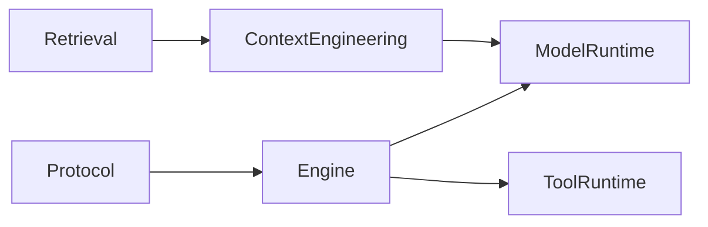
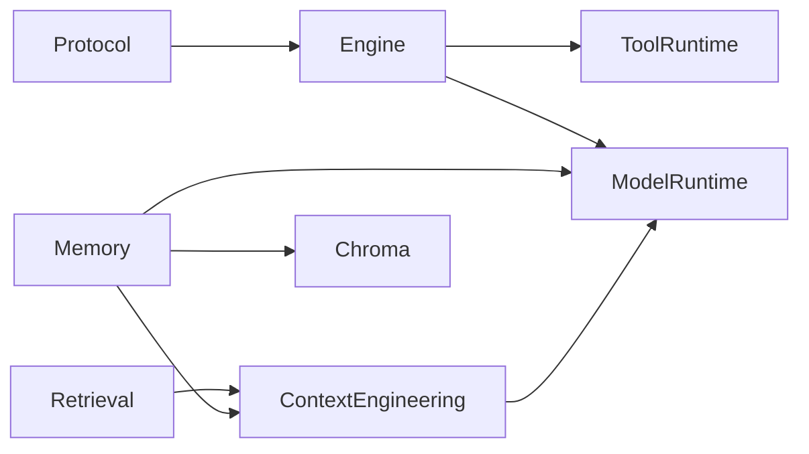
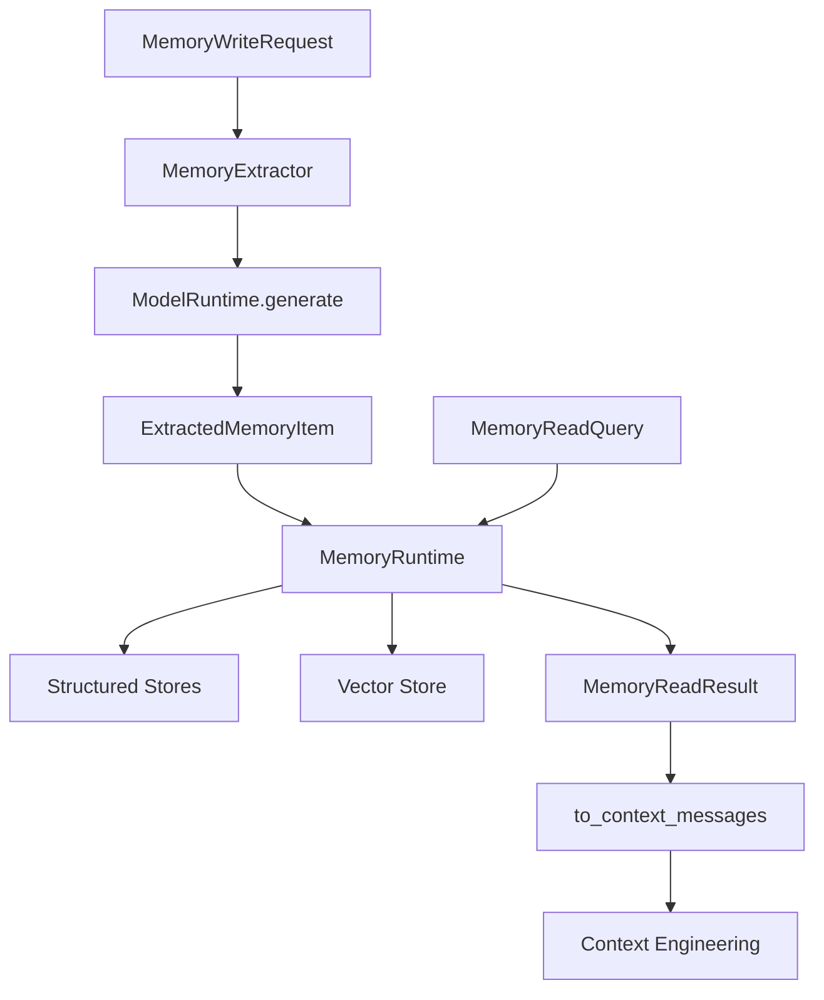
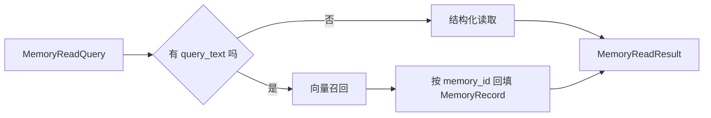

# 第九章：Memory 双层记忆写入与语义召回

## 目标

这一章完成后，系统会新增一套真正可落地的 `Memory` 组件，具备 4 个能力：

1. 能把一次运行里的关键信息抽取成结构化记忆，而不是把整段聊天记录原样堆进去。
2. 能同时写入 `session memory` 和 `long_term memory`，把“当前会话上下文”和“跨会话稳定知识”分开治理。
3. 能把结构化记忆同步写入向量库，让后续语义召回有真实索引，而不是只靠列表遍历。
4. 能把读回的记忆桥接给 `Context Engineering`，形成“抽取 -> 存储 -> 召回 -> 入模”的完整闭环。

本章属于核心运行时层和知识治理层之间的承上启下章节。

- 往前承接：`Model Runtime`、`Context Engineering`、`Retrieval`
- 往后铺路：后续把 Memory 正式接进 Engine 主链路时，不需要推翻这一章的结构

## 如果你第一次接触 Memory，先记这 3 句话

1. Memory 不是聊天记录备份，它是把“对以后还有价值的信息”沉淀成可读、可查、可召回的结构。
2. 这一章的关键不是“存下来”三个字，而是“怎么抽、存哪里、怎么按隔离键读回来、怎么再送回上下文”。
3. 这套设计里，结构化 store 是事实源，向量 store 是语义索引，两者双写但不混在一起。

## 名词速览

- `session memory`：只在当前会话里有价值的记忆，比如这次任务的小结、这轮对话里的临时约束。
- `long_term memory`：跨会话仍然有价值的记忆，比如稳定偏好、长期事实、重要背景。
- `MemoryExtractor`：负责把输入上下文交给 `ModelRuntime` 做结构化抽取，不直接依赖任何厂商 SDK。
- `MemoryRuntime`：这章真正的门面层，负责抽取、写入、读取、失效和桥接。
- `MemoryRecord`：一条真正落地的记忆记录，是结构化 store 和向量 store 共享的核心对象。
- `record_key`：同类记忆的逻辑主键。首版冲突策略是 `last-write-wins`，靠它判断“这是不是同一类记忆的更新”。
- `scope=None`：不是“随便查”。当前正式规则是：有 `session_id` 时读取“当前 session + long_term”；没有 `session_id` 时只读 `long_term`。
- `invalidate()`：不是物理删除结构化记忆，而是把记录标记成失效；向量层若后端不支持安全 metadata 合并，允许用 `delete` 做降级。

## 架构位置说明

### 当前系统结构回顾



### 本章新增后的结构



这一章故意把 `Memory` 先做成独立 `Runtime`，暂时不直接改 `EngineLoop`。原因有两个：

1. 先把记忆的抽取、写入、读取、失效、向量化边界收口，再考虑接入主循环，风险最低。
2. 一旦这层边界稳定，后面无论是 `finish` 后自动写记忆，还是在规划前先查记忆，都只是在主链路上“接线”，不是重做组件。

## 前置条件

1. Python >= 3.11
2. 已安装 `uv`
3. 已完成第 8 章 Retrieval
4. 当前仓库已经通过前面章节的基线测试

## 环境准备与缺包兜底步骤

先确认基础环境正常：

```codex
uv sync --dev
uv run --no-sync pytest -q
```

如果你要把 Chroma 路径也按教程完整跑通，再安装可选依赖：

```codex
uv sync --dev --extra memory-chroma
```

如果你暂时不装 `chromadb`，也没关系：

1. 本章的结构化写入、结构化读取、bridge、主测试都能照常完成。
2. `examples/memory/memory_demo.py` 会在缺依赖时走可解释降级。
3. `memory_vector_demo.py` 使用 fake collection，仍然可以把向量链路讲清楚。

## 本章主线改动范围

### 代码目录

- `src/agent_forge/components/memory/`
- `examples/memory/`
- `tests/unit/test_memory*.py`

### 本章涉及的真实文件

- [src/agent_forge/components/memory/__init__.py](../../src/agent_forge/components/memory/__init__.py)
- [src/agent_forge/components/memory/domain/__init__.py](../../src/agent_forge/components/memory/domain/__init__.py)
- [src/agent_forge/components/memory/domain/schemas.py](../../src/agent_forge/components/memory/domain/schemas.py)
- [src/agent_forge/components/memory/application/__init__.py](../../src/agent_forge/components/memory/application/__init__.py)
- [src/agent_forge/components/memory/application/extractor.py](../../src/agent_forge/components/memory/application/extractor.py)
- [src/agent_forge/components/memory/application/runtime.py](../../src/agent_forge/components/memory/application/runtime.py)
- [src/agent_forge/components/memory/application/bridges.py](../../src/agent_forge/components/memory/application/bridges.py)
- [src/agent_forge/components/memory/infrastructure/__init__.py](../../src/agent_forge/components/memory/infrastructure/__init__.py)
- [src/agent_forge/components/memory/infrastructure/stores.py](../../src/agent_forge/components/memory/infrastructure/stores.py)
- [src/agent_forge/components/memory/infrastructure/chroma.py](../../src/agent_forge/components/memory/infrastructure/chroma.py)
- [examples/memory/memory_demo.py](../../examples/memory/memory_demo.py)
- [examples/memory/memory_vector_demo.py](../../examples/memory/memory_vector_demo.py)
- [examples/memory/memory_bridge_demo.py](../../examples/memory/memory_bridge_demo.py)
- [tests/unit/test_memory.py](../../tests/unit/test_memory.py)
- [tests/unit/test_memory_chroma.py](../../tests/unit/test_memory_chroma.py)
- [tests/unit/test_memory_context_bridge.py](../../tests/unit/test_memory_context_bridge.py)
- [tests/unit/test_memory_demo.py](../../tests/unit/test_memory_demo.py)
- [tests/unit/test_memory_vector_demo.py](../../tests/unit/test_memory_vector_demo.py)
- [tests/unit/test_memory_bridge_demo.py](../../tests/unit/test_memory_bridge_demo.py)

---

# 5. 实施步骤

## 第 1 步：先看主流程，别急着写代码





### 主流程拆解

1. 写入时，`MemoryRuntime` 先校验请求，再交给 `MemoryExtractor` 走 `ModelRuntime` 做结构化抽取。
2. 抽取出来的不是自由文本，而是 `ExtractedMemoryItem` 列表。
3. `MemoryRuntime` 再把抽取项转成正式 `MemoryRecord`。
4. 结构化 store 先写，向量 store 后写。这样语义索引坏了，也不会把事实源带崩。
5. 读取时，如果有 `query_text`，先走向量召回，再按 `memory_id` 回填结构化记录；如果没有，就只走结构化读取。
6. 最后通过 `to_context_messages(...)` 变成 `Context Engineering` 可以消费的消息结构。

### 为什么本章不直接改 Engine

如果一上来就把 Memory 硬接进 `EngineLoop`，你会同时面对 3 个问题：

1. 抽取提示词和输出 schema 还没稳定。
2. `session` 和 `long_term` 的隔离语义还没验证。
3. 向量层真实后端还没跑过闭环。

所以先把 Memory 自己做稳，再接主链路，工程上更合理。

---

## 第 2 步：创建 Memory 包骨架

先把包目录建出来。这里要注意两点：

1. `src/agent_forge/components/memory/` 下的三个层级目录都是 Python 包，所以必须补 `__init__.py`。
2. `examples/memory/` 只是示例目录，不是包，不创建 `__init__.py`。

```codex
New-Item -ItemType Directory src/agent_forge/components/memory
New-Item -ItemType Directory src/agent_forge/components/memory/domain
New-Item -ItemType Directory src/agent_forge/components/memory/application
New-Item -ItemType Directory src/agent_forge/components/memory/infrastructure
```

```codex
New-Item -ItemType File src\agent_forge\components\memory\__init__.py
```

文件：[__init__.py](../../src/agent_forge/components/memory/__init__.py)

```python
"""Memory 组件导出。"""

from agent_forge.components.memory.application import MemoryExtractor, MemoryRuntime, to_context_messages
from agent_forge.components.memory.domain import (
    ExtractedMemoryItem,
    MemoryCategory,
    MemoryReadQuery,
    MemoryReadResult,
    MemoryRecord,
    MemoryScope,
    MemorySource,
    MemorySourceType,
    MemoryTrigger,
    MemoryVectorDocument,
    MemoryVectorHit,
    MemoryVectorStore,
    MemoryWriteRequest,
    MemoryWriteResult,
)
from agent_forge.components.memory.infrastructure import (
    ChromaMemoryVectorStore,
    InMemoryLongTermMemoryStore,
    InMemorySessionMemoryStore,
)

__all__ = [
    "MemoryScope",
    "MemoryTrigger",
    "MemoryCategory",
    "MemorySourceType",
    "MemorySource",
    "ExtractedMemoryItem",
    "MemoryRecord",
    "MemoryWriteRequest",
    "MemoryWriteResult",
    "MemoryReadQuery",
    "MemoryReadResult",
    "MemoryVectorDocument",
    "MemoryVectorHit",
    "MemoryVectorStore",
    "MemoryExtractor",
    "MemoryRuntime",
    "to_context_messages",
    "InMemorySessionMemoryStore",
    "InMemoryLongTermMemoryStore",
    "ChromaMemoryVectorStore",
]

```

```codex
New-Item -ItemType File src\agent_forge\components\memory\domain\__init__.py
```

文件：[domain/__init__.py](../../src/agent_forge/components/memory/domain/__init__.py)

```python
"""Memory 组件领域层导出。"""

from agent_forge.components.memory.domain.schemas import (
    ExtractedMemoryItem,
    MemoryCategory,
    MemoryModelRuntime,
    MemoryReadQuery,
    MemoryReadResult,
    MemoryRecord,
    MemoryScope,
    MemorySource,
    MemorySourceType,
    MemoryStructuredStore,
    MemoryTrigger,
    MemoryVectorDocument,
    MemoryVectorHit,
    MemoryVectorStore,
    MemoryWriteRequest,
    MemoryWriteResult,
)

__all__ = [
    "MemoryScope",
    "MemoryTrigger",
    "MemoryCategory",
    "MemorySourceType",
    "MemorySource",
    "ExtractedMemoryItem",
    "MemoryRecord",
    "MemoryWriteRequest",
    "MemoryWriteResult",
    "MemoryReadQuery",
    "MemoryReadResult",
    "MemoryVectorDocument",
    "MemoryVectorHit",
    "MemoryStructuredStore",
    "MemoryVectorStore",
    "MemoryModelRuntime",
]
```

```codex
New-Item -ItemType File src\agent_forge\components\memory\application\__init__.py
```

文件：[application/__init__.py](../../src/agent_forge/components/memory/application/__init__.py)

```python
"""Memory 组件应用层导出。"""

from agent_forge.components.memory.application.bridges import to_context_messages
from agent_forge.components.memory.application.extractor import MemoryExtractor
from agent_forge.components.memory.application.runtime import MemoryRuntime

__all__ = [
    "MemoryRuntime",
    "MemoryExtractor",
    "to_context_messages",
]
```

```codex
New-Item -ItemType File src\agent_forge\components\memory\infrastructure\__init__.py
```

文件：[infrastructure/__init__.py](../../src/agent_forge/components/memory/infrastructure/__init__.py)

```python
"""Memory 基础设施层导出。"""

from agent_forge.components.memory.infrastructure.chroma import ChromaMemoryVectorStore
from agent_forge.components.memory.infrastructure.stores import (
    InMemoryLongTermMemoryStore,
    InMemorySessionMemoryStore,
)

__all__ = [
    "InMemorySessionMemoryStore",
    "InMemoryLongTermMemoryStore",
    "ChromaMemoryVectorStore",
]
```

### 代码讲解

这些 `__init__.py` 看起来简单，但它们在工程上有两个作用：

1. 把 `Memory` 组件的公开表面固定下来。后面教程和业务层都只依赖导出的名字，不要到处跨层 import。
2. 让读者跟着教程创建文件时不会因为漏掉 `__init__.py` 直接在第一个 import 处崩掉。

成功链路：读者按这里创建完包骨架后，后面的 `from agent_forge.components.memory import ...` 能直接跑。  
失败链路：如果你漏掉 `domain/__init__.py` 或 `application/__init__.py`，测试和 example 很快就会在导入阶段报错。

---

## 第 3 步：定义领域模型，让 Memory 先有统一语言

```codex
New-Item -ItemType File src\agent_forge\components\memory\domain\schemas.py
```

文件：[schemas.py](../../src/agent_forge/components/memory/domain/schemas.py)

```python
"""Memory 组件领域模型。"""

from __future__ import annotations

from datetime import datetime, timezone
from typing import Any, Literal, Protocol
from uuid import uuid4

from pydantic import BaseModel, Field, field_validator

from agent_forge.components.model_runtime import ModelRequest, ModelResponse
from agent_forge.components.protocol import AgentMessage, AgentState, FinalAnswer, ToolResult


MemoryScope = Literal["session", "long_term"]
MemoryTrigger = Literal["finish", "fact", "preference"]
MemoryCategory = Literal["summary", "fact", "preference", "other"]
MemorySourceType = Literal["final_answer", "agent_message", "tool_result", "retrieval_citation"]


def now_iso() -> str:
    """返回统一的 UTC ISO 时间字符串。

    Returns:
        str: 当前 UTC 时间。
    """

    return datetime.now(timezone.utc).isoformat()


class MemorySource(BaseModel):
    """记忆来源信息。"""

    source_type: MemorySourceType = Field(..., description="来源类型")
    source_id: str | None = Field(default=None, description="来源对象 ID")
    source_excerpt: str = Field(default="", description="来源片段")
    trace_id: str | None = Field(default=None, description="来源 trace_id")
    run_id: str | None = Field(default=None, description="来源 run_id")


class ExtractedMemoryItem(BaseModel):
    """LLM 结构化抽取后返回的单条记忆候选。"""

    scope: MemoryScope = Field(..., description="记忆作用域")
    category: MemoryCategory = Field(..., description="记忆分类")
    record_key: str = Field(..., min_length=1, description="逻辑主键")
    content: str = Field(..., min_length=1, description="完整内容")
    summary: str = Field(default="", description="摘要")
    metadata: dict[str, Any] = Field(default_factory=dict, description="附加元数据")
    source_type: MemorySourceType | None = Field(default=None, description="来源类型")
    source_id: str | None = Field(default=None, description="来源对象 ID")
    source_excerpt: str = Field(default="", description="来源摘录")
    expires_at: str | None = Field(default=None, description="过期时间")


class MemoryRecord(BaseModel):
    """结构化记忆记录。"""

    memory_id: str = Field(default_factory=lambda: f"mem_{uuid4().hex}", description="记忆 ID")
    record_key: str = Field(..., min_length=1, description="逻辑冲突键")
    scope: MemoryScope = Field(..., description="记忆范围")
    tenant_id: str = Field(..., min_length=1, description="租户隔离键")
    user_id: str = Field(..., min_length=1, description="用户隔离键")
    session_id: str | None = Field(default=None, description="会话隔离键")
    category: MemoryCategory = Field(..., description="记忆类别")
    content: str = Field(..., min_length=1, description="记忆正文")
    summary: str = Field(default="", description="记忆摘要")
    metadata: dict[str, Any] = Field(default_factory=dict, description="扩展元数据")
    source: MemorySource = Field(..., description="来源信息")
    created_at: str = Field(default_factory=now_iso, description="创建时间")
    updated_at: str = Field(default_factory=now_iso, description="更新时间")
    expires_at: str | None = Field(default=None, description="过期时间")
    version: int = Field(default=1, ge=1, description="版本号")
    invalidated: bool = Field(default=False, description="是否已失效")

    @field_validator("session_id")
    @classmethod
    def _validate_session_id(cls, value: str | None, info: Any) -> str | None:
        """校验 session 记忆必须带 session_id。

        Args:
            value: 输入的 session_id。
            info: Pydantic 校验上下文。

        Returns:
            str | None: 校验后的 session_id。

        Raises:
            ValueError: 当 session 记忆缺少 session_id 时抛出。
        """

        scope = info.data.get("scope")
        if scope == "session" and not value:
            raise ValueError("session scope 的记忆必须提供 session_id")
        return value


class MemoryWriteRequest(BaseModel):
    """Memory 写入请求。"""

    tenant_id: str = Field(..., min_length=1, description="租户隔离键")
    user_id: str = Field(..., min_length=1, description="用户隔离键")
    session_id: str | None = Field(default=None, description="会话隔离键")
    trigger: MemoryTrigger = Field(..., description="写入触发器")
    agent_state: AgentState | None = Field(default=None, description="完整运行状态")
    final_answer: FinalAnswer | None = Field(default=None, description="最终答案")
    messages: list[AgentMessage] = Field(default_factory=list, description="辅助消息")
    tool_results: list[ToolResult] = Field(default_factory=list, description="辅助工具结果")
    extracted_items: list[ExtractedMemoryItem] = Field(default_factory=list, description="已抽取记忆项")
    metadata: dict[str, Any] = Field(default_factory=dict, description="扩展元数据")
    trace_id: str | None = Field(default=None, description="来源 trace_id")
    run_id: str | None = Field(default=None, description="来源 run_id")


class MemoryWriteResult(BaseModel):
    """Memory 写入结果。"""

    records: list[MemoryRecord] = Field(default_factory=list, description="写入后的最终记录")
    extracted_count: int = Field(default=0, ge=0, description="抽取出的记忆项数量")
    structured_written_count: int = Field(default=0, ge=0, description="结构化写入数")
    vector_written_count: int = Field(default=0, ge=0, description="向量写入数")
    trigger: MemoryTrigger = Field(..., description="本次触发器")
    trace_id: str | None = Field(default=None, description="trace_id")
    run_id: str | None = Field(default=None, description="run_id")


class MemoryReadQuery(BaseModel):
    """Memory 读取请求。"""

    tenant_id: str = Field(..., min_length=1, description="租户隔离键")
    user_id: str = Field(..., min_length=1, description="用户隔离键")
    session_id: str | None = Field(default=None, description="会话隔离键")
    scope: MemoryScope | None = Field(default=None, description="读取范围")
    categories: list[MemoryCategory] = Field(default_factory=list, description="限定类别")
    top_k: int = Field(default=5, ge=1, description="返回上限")
    include_invalidated: bool = Field(default=False, description="是否包含已失效记录")
    query_text: str | None = Field(default=None, description="语义检索文本")


class MemoryReadResult(BaseModel):
    """Memory 读取结果。"""

    records: list[MemoryRecord] = Field(default_factory=list, description="读取结果")
    total_matched: int = Field(default=0, ge=0, description="匹配总数")
    scope: MemoryScope | None = Field(default=None, description="实际范围")
    from_vector_search: bool = Field(default=False, description="是否来自向量查询")
    read_trace: dict[str, Any] = Field(default_factory=dict, description="最小解释信息")


class MemoryVectorDocument(BaseModel):
    """向量库存储文档。"""

    memory_id: str = Field(..., min_length=1, description="记忆 ID")
    text: str = Field(..., min_length=1, description="向量化文本")
    metadata: dict[str, Any] = Field(default_factory=dict, description="向量元数据")


class MemoryVectorHit(BaseModel):
    """向量命中结果。"""

    memory_id: str = Field(..., min_length=1, description="命中的记忆 ID")
    score: float = Field(default=0.0, description="相似度分数")
    metadata: dict[str, Any] = Field(default_factory=dict, description="命中元数据")


class MemoryStructuredStore(Protocol):
    """结构化记忆存储接口。"""

    def upsert(self, records: list[MemoryRecord]) -> list[MemoryRecord]:
        """写入或覆盖结构化记忆。

        Args:
            records: 待写入记录。

        Returns:
            list[MemoryRecord]: 实际持久化后的记录。
        """

    def query(self, query: MemoryReadQuery) -> list[MemoryRecord]:
        """查询结构化记忆。

        Args:
            query: 查询请求。

        Returns:
            list[MemoryRecord]: 命中的记录。
        """

    def get_by_ids(
        self,
        *,
        tenant_id: str,
        user_id: str,
        session_id: str | None,
        memory_ids: list[str],
        include_invalidated: bool = False,
    ) -> list[MemoryRecord]:
        """按 ID 批量读取。

        Args:
            tenant_id: 租户 ID。
            user_id: 用户 ID。
            session_id: 会话 ID。
            memory_ids: 记忆 ID 列表。
            include_invalidated: 是否包含已失效记录。

        Returns:
            list[MemoryRecord]: 命中的记录。
        """

    def invalidate(
        self,
        *,
        tenant_id: str,
        user_id: str,
        session_id: str | None,
        memory_ids: list[str],
    ) -> int:
        """失效指定记录。

        Args:
            tenant_id: 租户 ID。
            user_id: 用户 ID。
            session_id: 会话 ID。
            memory_ids: 记忆 ID 列表。

        Returns:
            int: 实际失效数量。
        """


class MemoryVectorStore(Protocol):
    """向量记忆存储接口。"""

    backend_name: str
    backend_version: str

    def upsert(self, records: list[MemoryRecord]) -> int:
        """写入向量记忆。

        Args:
            records: 待写入记录。

        Returns:
            int: 实际写入数量。
        """

    def query(self, query: MemoryReadQuery) -> list[MemoryVectorHit]:
        """执行向量查询。

        Args:
            query: 查询请求。

        Returns:
            list[MemoryVectorHit]: 命中结果。
        """

    def invalidate(
        self,
        *,
        tenant_id: str,
        user_id: str,
        session_id: str | None,
        memory_ids: list[str],
    ) -> int:
        """失效向量记忆。

        Args:
            tenant_id: 租户 ID。
            user_id: 用户 ID。
            session_id: 会话 ID。
            memory_ids: 记忆 ID 列表。

        Returns:
            int: 实际失效数量。
        """


class MemoryModelRuntime(Protocol):
    """供 MemoryExtractor 使用的最小模型运行时接口。"""

    def generate(self, request: ModelRequest, **kwargs: Any) -> ModelResponse:
        """执行结构化抽取。

        Args:
            request: 模型请求。
            **kwargs: 运行时参数。

        Returns:
            ModelResponse: 结构化抽取响应。
        """
```

### 代码讲解

这一层解决的是“Memory 组件内部和外部到底说什么语言”的问题。

#### 1. 为什么这里要先建模，而不是先写 store

如果你先写存储，再回头补模型，会出现两个坏结果：

1. 结构化 store 一套字段，向量 store 一套字段，bridge 再自己拼第三套字段。
2. 后面你想接 `Context Engineering`、`Retrieval` 或 `Observability` 时，根本不知道哪一层算权威语义。

所以这一章先把 `MemoryRecord / MemoryWriteRequest / MemoryReadQuery / MemoryReadResult / ExtractedMemoryItem` 这几类对象定下来，再往后推。

#### 2. 这一层最关键的 5 个对象

1. `ExtractedMemoryItem`：LLM 抽取层的输出。
2. `MemoryRecord`：正式落库对象。
3. `MemoryWriteRequest`：把一次写入要用到的上下文收口。
4. `MemoryReadQuery`：把结构化读和语义读的入口统一起来。
5. `MemoryStructuredStore / MemoryVectorStore`：先定义抽象，再落地实现。

#### 3. 这一层最重要的边界

- `session memory` 必须带 `session_id`
- `long_term memory` 不要求 `session_id`
- 所有请求都必须显式带 `tenant_id / user_id`
- `MemorySource` 必须保留来源线索

#### 成功链路

抽取层产出 `ExtractedMemoryItem`，runtime 再把它收口成正式 `MemoryRecord`。

#### 失败链路

如果没有 `record_key`，`last-write-wins` 就失去依据；如果 `session` 记录没带 `session_id`，隔离语义会直接失真。

---

## 第 4 步：实现 MemoryExtractor，把抽取统一走 ModelRuntime

```codex
New-Item -ItemType File src\agent_forge\components\memory\application\extractor.py
```

文件：[extractor.py](../../src/agent_forge/components/memory/application/extractor.py)

```python
"""基于 ModelRuntime 的记忆抽取器。"""

from __future__ import annotations

from typing import Any

from agent_forge.components.memory.domain import (
    ExtractedMemoryItem,
    MemoryModelRuntime,
    MemoryWriteRequest,
)
from agent_forge.components.model_runtime import ModelRequest
from agent_forge.components.protocol import AgentMessage


class MemoryExtractor:
    """通过 ModelRuntime 执行结构化记忆抽取。"""

    def __init__(self, model_runtime: MemoryModelRuntime, model: str | None = None) -> None:
        """初始化抽取器。

        Args:
            model_runtime: 统一模型运行时。
            model: 可选模型覆盖名。

        Returns:
            None.
        """

        self._model_runtime = model_runtime
        self._model = model

    def extract(self, request: MemoryWriteRequest) -> list[ExtractedMemoryItem]:
        """按触发器执行记忆抽取。

        Args:
            request: 写入请求。

        Returns:
            list[ExtractedMemoryItem]: 标准化记忆项。
        """

        # 1. 允许上游直接提供抽取结果，用于测试或人工写入路径。
        if request.extracted_items:
            return [item.model_copy(deep=True) for item in request.extracted_items]

        # 2. 根据 trigger 构造抽取输入，保持 finish/fact/preference 语义分离。
        if request.trigger == "finish":
            return self.extract_from_finish(request)
        if request.trigger == "fact":
            return self.extract_facts(request)
        return self.extract_preferences(request)

    def extract_from_finish(self, request: MemoryWriteRequest) -> list[ExtractedMemoryItem]:
        """从最终答案抽取摘要记忆。

        Args:
            request: 写入请求。

        Returns:
            list[ExtractedMemoryItem]: 摘要记忆。
        """

        return self._extract_with_schema(
            request=request,
            task_name="finish_summary",
            instruction=(
                "你是 Memory 抽取器。请从最终答案中提炼会话摘要和长期摘要候选。"
                "只输出结构化 JSON，不要解释。"
            ),
            messages=self._build_finish_messages(request),
        )

    def extract_facts(self, request: MemoryWriteRequest) -> list[ExtractedMemoryItem]:
        """抽取事实类记忆。

        Args:
            request: 写入请求。

        Returns:
            list[ExtractedMemoryItem]: 事实记忆。
        """

        return self._extract_with_schema(
            request=request,
            task_name="facts",
            instruction=(
                "你是 Memory 抽取器。请从消息、最终答案和工具结果中抽取可长期复用的事实。"
                "不要编造，只保留明确事实。只输出结构化 JSON。"
            ),
            messages=self._build_fact_messages(request),
        )

    def extract_preferences(self, request: MemoryWriteRequest) -> list[ExtractedMemoryItem]:
        """抽取偏好类记忆。

        Args:
            request: 写入请求。

        Returns:
            list[ExtractedMemoryItem]: 偏好记忆。
        """

        return self._extract_with_schema(
            request=request,
            task_name="preferences",
            instruction=(
                "你是 Memory 抽取器。请从用户消息中抽取稳定偏好，如语言、输出格式、固定要求。"
                "不要抽取一次性临时请求。只输出结构化 JSON。"
            ),
            messages=self._build_preference_messages(request),
        )

    def _extract_with_schema(
        self,
        *,
        request: MemoryWriteRequest,
        task_name: str,
        instruction: str,
        messages: list[AgentMessage],
    ) -> list[ExtractedMemoryItem]:
        """执行一次结构化抽取。

        Args:
            request: 写入请求。
            task_name: 抽取任务名。
            instruction: 系统指令。
            messages: 送入模型的消息。

        Returns:
            list[ExtractedMemoryItem]: 规范化后的记忆项。
        """

        model_request = ModelRequest(
            messages=messages,
            system_prompt=instruction,
            model=self._model,
            temperature=0.0,
            response_schema=_memory_extraction_schema(task_name),
        )
        response = self._model_runtime.generate(model_request)
        raw_items = (response.parsed_output or {}).get("items", [])
        if not isinstance(raw_items, list):
            return []
        output: list[ExtractedMemoryItem] = []
        for item in raw_items:
            if not isinstance(item, dict):
                continue
            output.append(ExtractedMemoryItem.model_validate(item))
        return output

    def _build_finish_messages(self, request: MemoryWriteRequest) -> list[AgentMessage]:
        """构造 finish 抽取消息。

        Args:
            request: 写入请求。

        Returns:
            list[AgentMessage]: 模型输入消息。
        """

        final_answer = request.final_answer or (request.agent_state.final_answer if request.agent_state else None)
        if final_answer is None:
            return [AgentMessage(role="user", content="没有 final_answer，可返回空 items。")]
        return [
            AgentMessage(role="user", content=f"最终摘要: {final_answer.summary}"),
            AgentMessage(role="user", content=f"最终输出: {final_answer.output}"),
        ]

    def _build_fact_messages(self, request: MemoryWriteRequest) -> list[AgentMessage]:
        """构造事实抽取消息。

        Args:
            request: 写入请求。

        Returns:
            list[AgentMessage]: 模型输入消息。
        """

        messages: list[AgentMessage] = []
        for message in request.messages or (request.agent_state.messages if request.agent_state else []):
            messages.append(message.model_copy(deep=True))
        final_answer = request.final_answer or (request.agent_state.final_answer if request.agent_state else None)
        if final_answer is not None:
            messages.append(AgentMessage(role="assistant", content=f"final_answer: {final_answer.output}"))
        for result in request.tool_results or (request.agent_state.tool_results if request.agent_state else []):
            if result.status != "ok":
                continue
            messages.append(AgentMessage(role="tool", content=f"tool_result[{result.tool_call_id}]: {result.output}"))
        if not messages:
            messages.append(AgentMessage(role="user", content="没有可抽取的事实，可返回空 items。"))
        return messages

    def _build_preference_messages(self, request: MemoryWriteRequest) -> list[AgentMessage]:
        """构造偏好抽取消息。

        Args:
            request: 写入请求。

        Returns:
            list[AgentMessage]: 模型输入消息。
        """

        source_messages = request.messages or (request.agent_state.messages if request.agent_state else [])
        user_messages = [item.model_copy(deep=True) for item in source_messages if item.role == "user"]
        if not user_messages:
            return [AgentMessage(role="user", content="没有用户消息，可返回空 items。")]
        return user_messages


def _memory_extraction_schema(task_name: str) -> dict[str, Any]:
    """返回统一的记忆抽取 schema。

    Args:
        task_name: 抽取任务名。

    Returns:
        dict[str, Any]: JSON schema。
    """

    return {
        "type": "object",
        "title": f"memory_extraction_{task_name}",
        "required": ["items"],
        "properties": {
            "items": {
                "type": "array",
                "items": {
                    "type": "object",
                    "required": ["scope", "category", "record_key", "content"],
                    "properties": {
                        "scope": {"type": "string", "enum": ["session", "long_term"]},
                        "category": {"type": "string", "enum": ["summary", "fact", "preference", "other"]},
                        "record_key": {"type": "string"},
                        "content": {"type": "string"},
                        "summary": {"type": "string"},
                        "source_type": {"type": ["string", "null"], "enum": ["final_answer", "agent_message", "tool_result", "retrieval_citation", None]},
                        "source_id": {"type": ["string", "null"]},
                        "source_excerpt": {"type": "string"},
                        "expires_at": {"type": ["string", "null"]},
                        "metadata": {"type": "object"},
                    },
                },
            }
        },
    }

```

### 代码讲解

`MemoryExtractor` 是这一章最关键的设计点之一，因为它决定了 Memory 到底是不是一个通用框架。

#### 1. 为什么抽取必须走 ModelRuntime

如果你在 Memory 里直接写 OpenAI 或 DeepSeek SDK，会立刻有 3 个问题：

1. Memory 组件被某个厂商绑死。
2. 配置、错误处理、结构化输出约束会和第四章 `ModelRuntime` 重复一遍。
3. 后面换模型或做统一观测时，Memory 会变成系统里的特例。

#### 2. 这段代码在做什么

1. `extract(...)`：优先消费显式 `extracted_items`。
2. `extract_from_finish(...)`：抽摘要型记忆。
3. `extract_facts(...)`：从消息、最终答案和工具结果抽事实。
4. `extract_preferences(...)`：只从用户消息抽稳定偏好。
5. `_extract_with_schema(...)`：真正调用 `ModelRuntime.generate(...)`。

#### 3. 为什么这里要坚持结构化输出 schema

Memory 不是聊天展示层，而是知识治理层。这里如果接受自由文本，后面根本没法稳定区分 `scope/category/record_key`。

#### 成功链路

模型返回结构化 `items`，每一条都能被校验成 `ExtractedMemoryItem`。

#### 再给你 3 个具体抽取例子

1. `finish` 抽取例子：
   - 输入里有 `FinalAnswer(output="用户要一份面向 CEO 的周报")`。
   - 模型应返回一条 `scope=session`、`category=summary`、`record_key=session_summary` 的摘要记忆。
   - 这类记忆解决的是“本轮到底聊完了什么”。
2. `fact` 抽取例子：
   - 输入里有工具结果：“客户明确要求下周提交融资材料”。
   - 模型应返回一条 `category=fact`、`record_key=financing_deadline` 的事实记忆。
   - 这类记忆解决的是“后面还要反复引用的业务事实”。
3. `preference` 抽取例子：
   - 输入里有用户消息：“以后都用要点式中文回复我”。
   - 模型应返回一条 `scope=long_term`、`category=preference` 的长期偏好记忆。
   - 这类记忆解决的是“跨会话仍然成立的用户习惯”。

#### 失败链路

模型没按 schema 返回时直接退化成空列表，不把 runtime 打崩。

---

## 第 5 步：实现 MemoryRuntime，把 Memory 真正跑起来

```codex
New-Item -ItemType File src\agent_forge\components\memory\application\runtime.py
```

文件：[runtime.py](../../src/agent_forge/components/memory/application/runtime.py)

```python
"""Memory 运行时。"""

from __future__ import annotations

from collections import defaultdict

from agent_forge.components.memory.application.extractor import MemoryExtractor
from agent_forge.components.memory.domain import (
    MemoryReadQuery,
    MemoryReadResult,
    MemoryRecord,
    MemoryScope,
    MemoryStructuredStore,
    MemoryTrigger,
    MemoryVectorStore,
    MemoryWriteRequest,
    MemoryWriteResult,
    MemorySource,
)


class MemoryRuntime:
    """统一编排抽取、结构化存储和向量存储。"""

    def __init__(
        self,
        *,
        extractor: MemoryExtractor,
        session_store: MemoryStructuredStore,
        long_term_store: MemoryStructuredStore,
        vector_store: MemoryVectorStore | None = None,
    ) -> None:
        """初始化 MemoryRuntime。

        Args:
            extractor: 记忆抽取器。
            session_store: session 结构化存储。
            long_term_store: long-term 结构化存储。
            vector_store: 可选向量存储。

        Returns:
            None.
        """

        self._extractor = extractor
        self._session_store = session_store
        self._long_term_store = long_term_store
        self._vector_store = vector_store

    def write(self, request: MemoryWriteRequest) -> MemoryWriteResult:
        """执行一次记忆写入。

        Args:
            request: 写入请求。

        Returns:
            MemoryWriteResult: 最终写入结果。
        """

        # 1. 先校验隔离键，避免 Memory 组件默认兜底导致跨租户串写。
        _validate_write_request(request)

        # 2. 再按 trigger 调用抽取器，得到标准化的记忆项。
        extracted_items = self._extractor.extract(request)
        if not extracted_items:
            return MemoryWriteResult(
                trigger=request.trigger,
                trace_id=request.trace_id,
                run_id=request.run_id,
            )

        # 3. 把抽取项转换成结构化记录，并写入对应 scope 的 store。
        records = [self._build_record(request=request, item=item) for item in extracted_items]
        stored_records = self._write_structured_records(records)

        # 4. 最后把已确认持久化的记录同步写入向量库，保证结构化层是真源。
        vector_written_count = 0
        if self._vector_store is not None:
            vector_written_count = self._vector_store.upsert(stored_records)

        return MemoryWriteResult(
            records=stored_records,
            extracted_count=len(extracted_items),
            structured_written_count=len(stored_records),
            vector_written_count=vector_written_count,
            trigger=request.trigger,
            trace_id=request.trace_id,
            run_id=request.run_id,
        )

    def read(self, query: MemoryReadQuery) -> MemoryReadResult:
        """读取记忆。

        Args:
            query: 查询请求。

        Returns:
            MemoryReadResult: 读取结果。
        """

        # 1. 先校验隔离键，避免读路径出现跨租户泄漏。
        _validate_read_query(query)

        # 2. 有 query_text 且配置了向量库时，先走语义召回，再回填结构化记录。
        if query.query_text and self._vector_store is not None:
            hits = self._query_vector(query)
            records = self._get_records_by_vector_hits(query=query, hits=hits)
            return MemoryReadResult(
                records=records,
                total_matched=len(records),
                scope=query.scope,
                from_vector_search=True,
                read_trace={
                    "mode": "vector",
                    "backend_name": self._vector_store.backend_name,
                    "backend_version": self._vector_store.backend_version,
                    "matched_memory_ids": [item.memory_id for item in hits],
                },
            )

        # 3. 否则走结构化读取，保持 explainable read 的可预测语义。
        records = self._query_structured(query)
        return MemoryReadResult(
            records=records,
            total_matched=len(records),
            scope=query.scope,
            from_vector_search=False,
            read_trace={
                "mode": "structured",
                "scopes": _resolved_scopes(query.scope, query.session_id),
            },
        )

    def invalidate(
        self,
        *,
        tenant_id: str,
        user_id: str,
        session_id: str | None,
        memory_ids: list[str],
    ) -> int:
        """失效指定记忆。

        Args:
            tenant_id: 租户 ID。
            user_id: 用户 ID。
            session_id: 会话 ID。
            memory_ids: 待失效记忆 ID。

        Returns:
            int: 实际失效数量。
        """

        count = 0
        count += self._session_store.invalidate(
            tenant_id=tenant_id,
            user_id=user_id,
            session_id=session_id,
            memory_ids=memory_ids,
        )
        count += self._long_term_store.invalidate(
            tenant_id=tenant_id,
            user_id=user_id,
            session_id=None,
            memory_ids=memory_ids,
        )
        if self._vector_store is not None:
            self._vector_store.invalidate(
                tenant_id=tenant_id,
                user_id=user_id,
                session_id=session_id,
                memory_ids=memory_ids,
            )
        return count

    def _build_record(self, *, request: MemoryWriteRequest, item: object) -> MemoryRecord:
        """把抽取结果转换为记忆记录。

        Args:
            request: 写入请求。
            item: 抽取项。

        Returns:
            MemoryRecord: 结构化记忆记录。
        """

        source = MemorySource(
            source_type=getattr(item, "source_type", None) or _resolve_source_type(request.trigger),
            source_id=getattr(item, "source_id", None),
            source_excerpt=getattr(item, "source_excerpt"),
            trace_id=request.trace_id or (request.agent_state.trace_id if request.agent_state else None),
            run_id=request.run_id or (request.agent_state.run_id if request.agent_state else None),
        )
        return MemoryRecord(
            record_key=getattr(item, "record_key"),
            scope=getattr(item, "scope"),
            tenant_id=request.tenant_id,
            user_id=request.user_id,
            session_id=request.session_id if getattr(item, "scope") == "session" else None,
            category=getattr(item, "category"),
            content=getattr(item, "content"),
            summary=getattr(item, "summary"),
            metadata={**request.metadata, **getattr(item, "metadata")},
            source=source,
            expires_at=getattr(item, "expires_at"),
        )

    def _write_structured_records(self, records: list[MemoryRecord]) -> list[MemoryRecord]:
        """写入结构化存储。

        Args:
            records: 待写入记录。

        Returns:
            list[MemoryRecord]: 实际写入后的记录。
        """

        grouped: dict[MemoryScope, list[MemoryRecord]] = defaultdict(list)
        for record in records:
            grouped[record.scope].append(record)

        stored: list[MemoryRecord] = []
        if grouped["session"]:
            stored.extend(self._session_store.upsert(grouped["session"]))
        if grouped["long_term"]:
            stored.extend(self._long_term_store.upsert(grouped["long_term"]))
        stored.sort(key=lambda item: (item.updated_at, item.memory_id), reverse=True)
        return stored

    def _query_vector(self, query: MemoryReadQuery) -> list[object]:
        """按统一 scope 语义执行向量查询。

        Args:
            query: 查询请求。

        Returns:
            list[object]: 向量命中结果。
        """

        if query.scope is not None:
            return self._vector_store.query(query)
        if query.session_id:
            session_hits = self._vector_store.query(query.model_copy(update={"scope": "session"}))
            long_term_hits = self._vector_store.query(
                query.model_copy(update={"scope": "long_term", "session_id": None})
            )
            return _merge_vector_hits(session_hits, long_term_hits, top_k=query.top_k)
        return self._vector_store.query(query.model_copy(update={"scope": "long_term", "session_id": None}))

    def _query_structured(self, query: MemoryReadQuery) -> list[MemoryRecord]:
        """按统一 scope 语义查询结构化存储。

        Args:
            query: 查询请求。

        Returns:
            list[MemoryRecord]: 结构化命中。
        """

        output: list[MemoryRecord] = []
        if query.scope == "session":
            output.extend(self._session_store.query(query))
        elif query.scope == "long_term":
            output.extend(self._long_term_store.query(query.model_copy(update={"session_id": None, "scope": "long_term"})))
        elif query.session_id:
            output.extend(self._session_store.query(query.model_copy(update={"scope": "session"})))
            output.extend(
                self._long_term_store.query(query.model_copy(update={"session_id": None, "scope": "long_term"}))
            )
        else:
            output.extend(self._long_term_store.query(query.model_copy(update={"session_id": None, "scope": "long_term"})))
        output.sort(key=lambda item: (item.updated_at, item.memory_id), reverse=True)
        return output[: query.top_k]

    def _get_records_by_vector_hits(self, *, query: MemoryReadQuery, hits: list[object]) -> list[MemoryRecord]:
        """把向量命中回填为结构化记录。

        Args:
            query: 查询请求。
            hits: 向量命中结果。

        Returns:
            list[MemoryRecord]: 对应记录。
        """

        if not hits:
            return []

        memory_ids = [str(getattr(item, "memory_id")) for item in hits]
        lookup: dict[str, MemoryRecord] = {}
        if query.scope == "session":
            for item in self._session_store.get_by_ids(
                tenant_id=query.tenant_id,
                user_id=query.user_id,
                session_id=query.session_id,
                memory_ids=memory_ids,
                include_invalidated=query.include_invalidated,
            ):
                lookup[item.memory_id] = item
        elif query.scope == "long_term":
            for item in self._long_term_store.get_by_ids(
                tenant_id=query.tenant_id,
                user_id=query.user_id,
                session_id=None,
                memory_ids=memory_ids,
                include_invalidated=query.include_invalidated,
            ):
                lookup[item.memory_id] = item
        elif query.session_id:
            for item in self._session_store.get_by_ids(
                tenant_id=query.tenant_id,
                user_id=query.user_id,
                session_id=query.session_id,
                memory_ids=memory_ids,
                include_invalidated=query.include_invalidated,
            ):
                lookup[item.memory_id] = item
            for item in self._long_term_store.get_by_ids(
                tenant_id=query.tenant_id,
                user_id=query.user_id,
                session_id=None,
                memory_ids=memory_ids,
                include_invalidated=query.include_invalidated,
            ):
                lookup[item.memory_id] = item
        else:
            for item in self._long_term_store.get_by_ids(
                tenant_id=query.tenant_id,
                user_id=query.user_id,
                session_id=None,
                memory_ids=memory_ids,
                include_invalidated=query.include_invalidated,
            ):
                lookup[item.memory_id] = item
        return [lookup[memory_id] for memory_id in memory_ids if memory_id in lookup][: query.top_k]


def _validate_write_request(request: MemoryWriteRequest) -> None:
    """校验写入请求。

    Args:
        request: 写入请求。

    Returns:
        None.

    Raises:
        ValueError: 当隔离键非法时抛出。
    """

    if not request.tenant_id.strip():
        raise ValueError("tenant_id 不能为空")
    if not request.user_id.strip():
        raise ValueError("user_id 不能为空")
    if request.trigger in {"finish", "fact", "preference"} and not request.session_id:
        raise ValueError("Memory 首版写入必须提供 session_id")


def _validate_read_query(query: MemoryReadQuery) -> None:
    """校验读取请求。

    Args:
        query: 读取请求。

    Returns:
        None.

    Raises:
        ValueError: 当隔离键非法时抛出。
    """

    if not query.tenant_id.strip():
        raise ValueError("tenant_id 不能为空")
    if not query.user_id.strip():
        raise ValueError("user_id 不能为空")
    if query.scope == "session" and not query.session_id:
        raise ValueError("读取 session memory 时必须提供 session_id")


def _resolved_scopes(scope: MemoryScope | None, session_id: str | None) -> list[MemoryScope]:
    """把 scope 参数解析为实é™
访问范围。

    Args:
        scope: 显式传入的 scope。
        session_id: 当前查询携带的 session_id。

    Returns:
        list[MemoryScope]: 解析后的范围。
    """

    if scope is not None:
        return [scope]
    if session_id:
        return ["session", "long_term"]
    return ["long_term"]


def _merge_vector_hits(*groups: list[object], top_k: int) -> list[object]:
    """合并多路向量命中，并按 score 去重排序。

    Args:
        *groups: 多组向量命中。
        top_k: 最终保留数量。

    Returns:
        list[object]: 合并后的命中列表。
    """

    lookup: dict[str, object] = {}
    scores: dict[str, float] = {}
    for group in groups:
        for hit in group:
            memory_id = str(getattr(hit, "memory_id"))
            score = float(getattr(hit, "score", 0.0))
            if memory_id in scores and scores[memory_id] >= score:
                continue
            lookup[memory_id] = hit
            scores[memory_id] = score
    merged = list(lookup.values())
    merged.sort(key=lambda item: (-float(getattr(item, "score", 0.0)), str(getattr(item, "memory_id"))))
    return merged[:top_k]


def _resolve_source_type(trigger: MemoryTrigger) -> str:
    """把 trigger 映射到默认来源类型。

    Args:
        trigger: 写入触发器。

    Returns:
        str: 来源类型。
    """

    if trigger == "finish":
        return "final_answer"
    if trigger == "fact":
        return "tool_result"
    return "agent_message"
```

### 代码讲解

`MemoryRuntime` 是这一章真正的门面层。第一次看这段代码时，先抓 4 件事：`write()`、`read()`、`invalidate()`、`scope=None` 的收口。

#### 1. `write()` 的主流程

顺序不能乱：校验请求 -> 抽取 -> 建记录 -> 先写结构化 store -> 再写向量 store -> 返回结果。

#### 2. `_build_record(...)` 真正收口了什么

1. 把 `ExtractedMemoryItem` 转成正式 `MemoryRecord`。
2. 合并 request 级和 item 级 metadata。
3. 把来源线索统一收口成 `MemorySource`。

#### 3. `read()` 为什么要分结构化读和语义读

- 没有 `query_text`：直接查 store
- 有 `query_text`：先查向量层，再按 `memory_id` 回填正式记录

#### 4. `scope=None` 的正式语义

- `scope='session'`：只查当前 session
- `scope='long_term'`：只查长期记忆
- `scope=None` 且有 `session_id`：查当前 session + long_term
- `scope=None` 且没有 `session_id`：只查 long_term

这样是为了避免跨 session 污染。

#### 5. `invalidate()` 的真实边界

结构化层标记失效，向量层则根据后端能力选择 merge metadata 或 delete 降级。

#### 再给你 4 个具体读取例子

1. `scope='session'`：
   - 你只想拿本轮摘要。
   - 典型场景是“给下一次模型调用补本轮上下文”。
2. `scope='long_term'`：
   - 你只想拿长期偏好和稳定事实。
   - 典型场景是“跨会话继续沿用用户偏好”。
3. `scope=None + session_id='session_demo'`：
   - 你想同时拿当前 session 和记忆库里的长期偏好。
   - 典型场景是“生成回答前，把本轮摘要和长期习惯一起送回上下文”。
4. `scope=None + session_id=None`：
   - 这时只读 `long_term`。
   - 目的不是省事，而是明确避免把别的 session 私有记忆误召回进来。

#### 成功链路

一条长期偏好记忆被双写后，既能结构化读回，也能语义召回。

#### 失败链路

抽取为空时返回空结果；向量层缺失时结构化写入仍成功；不安全的失效后端会被明确拒绝。

---

## 第 6 步：实现 bridge，把 Memory 结果变成可入模的消息

```codex
New-Item -ItemType File src\agent_forge\components\memory\application\bridges.py
```

文件：[bridges.py](../../src/agent_forge/components/memory/application/bridges.py)

```python
"""Memory 到上下文层的桥接函数。"""

from __future__ import annotations

from agent_forge.components.memory.domain import MemoryReadResult, MemoryRecord
from agent_forge.components.protocol import AgentMessage


def to_context_messages(result: MemoryReadResult, role: str = "developer") -> list[AgentMessage]:
    """把记忆读取结果桥接为上下文消息。

    Args:
        result: 读取结果。
        role: 注入到上下文中的消息角色。

    Returns:
        list[AgentMessage]: 可被上下文编排层继续消费的消息列表。
    """

    messages: list[AgentMessage] = []
    for record in result.records:
        messages.append(
            AgentMessage(
                role=role,  # type: ignore[arg-type]
                content=_format_memory_record(record),
                metadata={
                    "memory_id": record.memory_id,
                    "memory_scope": record.scope,
                    "memory_category": record.category,
                },
            )
        )
    return messages


def _format_memory_record(record: MemoryRecord) -> str:
    """格式化单条记忆为上下文文本。

    Args:
        record: 记忆记录。

    Returns:
        str: 结构化文本片段。
    """

    summary = record.summary or record.content
    return (
        f"[记忆][{record.scope}/{record.category}] {summary}\n"
        f"- key: {record.record_key}\n"
        f"- source: {record.source.source_type}\n"
        f"- updated_at: {record.updated_at}"
    )
```

### 代码讲解

这段代码很短，但位置非常重要。

#### 1. 为什么需要单独 bridge

Memory 读出来的是 `MemoryRecord`，模型上下文层不应该直接认识这种工程对象。

#### 2. 为什么默认 role 用 `developer`

因为这层更像开发侧注入的辅助上下文，不是用户最新指令，也不是工具原始输出。

#### 3. 为什么格式里保留标签

输出里保留 `scope/category/record_key/source_type/updated_at`，是为了让预算治理和排障有依据。

#### 再给你 2 个 bridge 前后对照例子

1. 偏好记忆桥接前后：
   - 原始 `MemoryRecord` 里可能是：`scope=long_term`、`category=preference`、`summary=偏好简洁要点式`。
   - bridge 后会变成：`[记忆][long_term/preference] 偏好简洁要点式`。
   - 这样模型看到的是“可以消费的上下文文本”，不是 Python 对象。
2. 事实记忆桥接前后：
   - 原始 `MemoryRecord` 里可能是：`scope=session`、`category=fact`、`summary=下周提交融资材料`。
   - bridge 后会变成：`[记忆][session/fact] 下周提交融资材料`。
   - 这样后面的 Context Engineering 才能把它和普通消息放到同一治理链路里。

#### 失败链路

如果你直接把 `MemoryRecord` 往下传，后面的运行时要么看不懂，要么会被迫再发明一套自己的格式。

---

## 第 7 步：实现结构化 store，先把事实源做稳

```codex
New-Item -ItemType File src\agent_forge\components\memory\infrastructure\stores.py
```

文件：[stores.py](../../src/agent_forge/components/memory/infrastructure/stores.py)

```python
"""Memory 结构化存储实现。"""

from __future__ import annotations

from collections import defaultdict

from agent_forge.components.memory.domain import MemoryReadQuery, MemoryRecord
from agent_forge.components.memory.domain.schemas import now_iso


class _BaseInMemoryMemoryStore:
    """内存结构化存储基类。"""

    def __init__(self) -> None:
        """初始化内存存储。

        Returns:
            None.
        """

        self._records_by_partition: dict[str, dict[str, MemoryRecord]] = defaultdict(dict)

    def upsert(self, records: list[MemoryRecord]) -> list[MemoryRecord]:
        """写入或覆盖记录。

        Args:
            records: 待写入记录。

        Returns:
            list[MemoryRecord]: 实际写入后的记录。
        """

        stored: list[MemoryRecord] = []
        for record in records:
            partition = self._partition_key(record)
            current = self._records_by_partition[partition].get(record.record_key)
            if current is None:
                self._records_by_partition[partition][record.record_key] = record.model_copy(deep=True)
                stored.append(self._records_by_partition[partition][record.record_key].model_copy(deep=True))
                continue
            updated = record.model_copy(
                update={
                    "memory_id": current.memory_id,
                    "created_at": current.created_at,
                    "updated_at": now_iso(),
                    "version": current.version + 1,
                }
            )
            self._records_by_partition[partition][record.record_key] = updated
            stored.append(updated.model_copy(deep=True))
        return stored

    def query(self, query: MemoryReadQuery) -> list[MemoryRecord]:
        """查询记录。

        Args:
            query: 查询请求。

        Returns:
            list[MemoryRecord]: 命中的记录。
        """

        results: list[MemoryRecord] = []
        for record in self._iter_partition_records(query=query):
            if query.categories and record.category not in query.categories:
                continue
            if not query.include_invalidated and record.invalidated:
                continue
            results.append(record.model_copy(deep=True))
        results.sort(key=lambda item: (item.updated_at, item.memory_id), reverse=True)
        return results[: query.top_k]

    def get_by_ids(
        self,
        *,
        tenant_id: str,
        user_id: str,
        session_id: str | None,
        memory_ids: list[str],
        include_invalidated: bool = False,
    ) -> list[MemoryRecord]:
        """按 ID 读取记录。

        Args:
            tenant_id: 租户 ID。
            user_id: 用户 ID。
            session_id: 会话 ID。
            memory_ids: 记忆 ID 列表。
            include_invalidated: 是否包含已失效记录。

        Returns:
            list[MemoryRecord]: 命中的记录。
        """

        query = MemoryReadQuery(
            tenant_id=tenant_id,
            user_id=user_id,
            session_id=session_id,
            scope=self._scope_name(),
            top_k=max(len(memory_ids), 1),
            include_invalidated=include_invalidated,
        )
        lookup: dict[str, MemoryRecord] = {}
        for item in self._iter_partition_records(query=query, raw=True):
            if item.memory_id not in memory_ids:
                continue
            if item.invalidated and not include_invalidated:
                continue
            lookup[item.memory_id] = item
        return [lookup[memory_id].model_copy(deep=True) for memory_id in memory_ids if memory_id in lookup]

    def invalidate(
        self,
        *,
        tenant_id: str,
        user_id: str,
        session_id: str | None,
        memory_ids: list[str],
    ) -> int:
        """失效记录。

        Args:
            tenant_id: 租户 ID。
            user_id: 用户 ID。
            session_id: 会话 ID。
            memory_ids: 记忆 ID 列表。

        Returns:
            int: 实际失效数量。
        """

        count = 0
        for record in self._iter_partition_records(
            query=MemoryReadQuery(
                tenant_id=tenant_id,
                user_id=user_id,
                session_id=session_id,
                scope=self._scope_name(),
                top_k=max(len(memory_ids), 1),
                include_invalidated=True,
            ),
            raw=True,
        ):
            if record.memory_id not in memory_ids or record.invalidated:
                continue
            record.invalidated = True
            record.updated_at = now_iso()
            count += 1
        return count

    def _iter_partition_records(self, *, query: MemoryReadQuery, raw: bool = False) -> list[MemoryRecord]:
        """遍历查询范围内的记录。

        Args:
            query: 查询请求。
            raw: 是否返回底层对象引用。

        Returns:
            list[MemoryRecord]: 记录列表。
        """

        records: list[MemoryRecord] = []
        for partition in self._partition_candidates(query):
            for record in self._records_by_partition.get(partition, {}).values():
                records.append(record if raw else record.model_copy(deep=True))
        return records

    def _partition_candidates(self, query: MemoryReadQuery) -> list[str]:
        """返回候选分区。

        Args:
            query: 查询请求。

        Returns:
            list[str]: 分区键列表。
        """

        return [self._partition_key_from_query(query)]

    def _partition_key(self, record: MemoryRecord) -> str:
        """由记录生成分区键。

        Args:
            record: 记忆记录。

        Returns:
            str: 分区键。
        """

        raise NotImplementedError

    def _partition_key_from_query(self, query: MemoryReadQuery) -> str:
        """由查询生成分区键。

        Args:
            query: 读取请求。

        Returns:
            str: 分区键。
        """

        raise NotImplementedError

    def _scope_name(self) -> str:
        """返回当前 store scope。

        Returns:
            str: scope 名称。
        """

        raise NotImplementedError


class InMemorySessionMemoryStore(_BaseInMemoryMemoryStore):
    """session 结构化记忆存储。"""

    def _partition_key(self, record: MemoryRecord) -> str:
        return f"{record.tenant_id}:{record.user_id}:{record.session_id}"

    def _partition_key_from_query(self, query: MemoryReadQuery) -> str:
        return f"{query.tenant_id}:{query.user_id}:{query.session_id}"

    def _scope_name(self) -> str:
        return "session"


class InMemoryLongTermMemoryStore(_BaseInMemoryMemoryStore):
    """long-term 结构化记忆存储。"""

    def _partition_key(self, record: MemoryRecord) -> str:
        return f"{record.tenant_id}:{record.user_id}"

    def _partition_key_from_query(self, query: MemoryReadQuery) -> str:
        return f"{query.tenant_id}:{query.user_id}"

    def _scope_name(self) -> str:
        return "long_term"
```

### 代码讲解

这一层不是玩具，而是 Memory 结构和语义的最小稳定事实源。

#### 1. 为什么先做 InMemory store

你现在最先需要验证的是 `record_key` 冲突、`tenant/user/session` 分区、`get_by_ids()` 和 `invalidate()` 语义。它们和数据库选型无关。

#### 2. 首版冲突策略为什么是 `last-write-wins`

这是保守但稳定的首版策略：同一 `record_key` 更新时保留原 `memory_id` 和 `created_at`，递增 `version`。

#### 3. 为什么 `get_by_ids()` 不能偷懒复用普通查询

因为这轮代码里已经修过真实问题：如果混进排序和 `top_k` 路径，在记录变多时可能漏掉目标 `memory_id`。

#### 成功链路

同一个 `record_key` 连续写两次，`memory_id` 不变、`version` 递增。

#### 失败链路

如果 session store 不按 `tenant:user:session_id` 分区，同一用户多会话会互相污染。

---

## 第 8 步：实现 Chroma 向量 store，把语义召回接上真实后端

```codex
New-Item -ItemType File src\agent_forge\components\memory\infrastructure\chroma.py
```

文件：[chroma.py](../../src/agent_forge/components/memory/infrastructure/chroma.py)

```python
"""Memory 的 Chroma 向量存储实现。"""

from __future__ import annotations

import importlib
from typing import Any

from agent_forge.components.memory.domain import MemoryReadQuery, MemoryRecord, MemoryVectorHit
from agent_forge.components.retrieval import EmbeddingProvider


class ChromaMemoryVectorStore:
    """基于 Chroma 的向量记忆存储。"""

    backend_name = "chroma_memory"
    backend_version = "chroma-memory-v1"

    def __init__(
        self,
        *,
        embedding_provider: EmbeddingProvider,
        collection: Any | None = None,
        client: Any | None = None,
        collection_name: str = "agent_forge_memory",
    ) -> None:
        """初始化 ChromaMemoryVectorStore。

        Args:
            embedding_provider: 向量提供器。
            collection: 可选已存在 collection。
            client: 可选 Chroma client。
            collection_name: collection 名称。

        Returns:
            None.

        Raises:
            RuntimeError: 当未安装 chromadb 且没有注入 collection/client 时抛出。
        """

        self._embedding_provider = embedding_provider
        self._collection = self._resolve_collection(collection=collection, client=client, collection_name=collection_name)

    def upsert(self, records: list[MemoryRecord]) -> int:
        """写入向量记忆。

        Args:
            records: 待写入记录。

        Returns:
            int: 实际写入数量。
        """

        if not records:
            return 0
        ids = [record.memory_id for record in records]
        texts = [_record_to_vector_text(record) for record in records]
        metadatas = [_record_to_metadata(record) for record in records]
        embeddings = self._embedding_provider.embed_documents(texts)
        if hasattr(self._collection, "upsert"):
            self._collection.upsert(ids=ids, documents=texts, metadatas=metadatas, embeddings=embeddings)
        else:
            self._collection.add(ids=ids, documents=texts, metadatas=metadatas, embeddings=embeddings)
        return len(records)

    def query(self, query: MemoryReadQuery) -> list[MemoryVectorHit]:
        """执行向量查询。

        Args:
            query: 查询请求。

        Returns:
            list[MemoryVectorHit]: 命中结果。
        """

        if not query.query_text:
            return []
        query_vector = self._embedding_provider.embed_query(query.query_text)
        query_kwargs: dict[str, Any] = {
            "query_embeddings": [query_vector],
            "n_results": query.top_k,
            "include": ["metadatas", "distances"],
        }
        where = _build_where(query)
        if where:
            query_kwargs["where"] = where
        result = self._collection.query(**query_kwargs)
        return _hits_from_query_result(result)

    def invalidate(
        self,
        *,
        tenant_id: str,
        user_id: str,
        session_id: str | None,
        memory_ids: list[str],
    ) -> int:
        """失效向量记录。

        Args:
            tenant_id: 租户 ID。
            user_id: 用户 ID。
            session_id: 会话 ID。
            memory_ids: 待失效记忆 ID。

        Returns:
            int: 实际失效数量。
        """

        if not memory_ids:
            return 0
        if hasattr(self._collection, "delete") and not hasattr(self._collection, "get"):
            self._collection.delete(ids=memory_ids)
            return len(memory_ids)
        if not hasattr(self._collection, "update") or not hasattr(self._collection, "get"):
            raise RuntimeError(
                "ChromaMemoryVectorStore.invalidate 需要 collection.get + collection.update，"
                "或者至少支持 collection.delete。"
            )
        existing = self._load_existing_metadatas(memory_ids)
        payload = []
        for index, memory_id in enumerate(memory_ids):
            current = existing[index] if index < len(existing) else {}
            merged = dict(current)
            merged.setdefault("memory_id", memory_id)
            merged.setdefault("tenant_id", tenant_id)
            merged.setdefault("user_id", user_id)
            merged.setdefault("session_id", session_id or "")
            merged["invalidated"] = True
            payload.append(merged)
        self._collection.update(ids=memory_ids, metadatas=payload)
        return len(memory_ids)

    def _resolve_collection(self, *, collection: Any | None, client: Any | None, collection_name: str) -> Any:
        """解析 collection。

        Args:
            collection: 可选 collection。
            client: 可选 client。
            collection_name: collection 名。

        Returns:
            Any: 可用 collection。

        Raises:
            RuntimeError: 当缺少 chromadb 依赖时抛出。
        """

        if collection is not None:
            return collection
        if client is not None:
            return client.get_or_create_collection(name=collection_name)
        try:
            chromadb = importlib.import_module("chromadb")
        except ModuleNotFoundError as exc:
            raise RuntimeError(
                "使用 ChromaMemoryVectorStore 需要安装 `agent-forge[memory-chroma]`，"
                "或手动注入可用的 collection/client。"
            ) from exc
        return chromadb.EphemeralClient().get_or_create_collection(name=collection_name)

    def _load_existing_metadatas(self, memory_ids: list[str]) -> list[dict[str, Any]]:
        """批量读取已有 metadata，供 invalidate 时做安全合并。

        Args:
            memory_ids: 需要查询的记忆 ID 列表。

        Returns:
            list[dict[str, Any]]: 与 memory_ids 顺序对齐的 metadata 列表。
        """

        if not hasattr(self._collection, "get"):
            return [{} for _ in memory_ids]
        result = self._collection.get(ids=memory_ids, include=["metadatas"])
        metadatas = _first_or_empty(result.get("metadatas"))
        lookup: dict[str, dict[str, Any]] = {}
        ids = _first_or_empty(result.get("ids"))
        for index, memory_id in enumerate(ids):
            metadata = metadatas[index] if index < len(metadatas) and isinstance(metadatas[index], dict) else {}
            lookup[str(memory_id)] = dict(metadata)
        return [lookup.get(memory_id, {}) for memory_id in memory_ids]


def _record_to_vector_text(record: MemoryRecord) -> str:
    """把记忆记录转换为向量文本。

    Args:
        record: 记忆记录。

    Returns:
        str: 向量化文本。
    """

    summary = record.summary.strip()
    if summary:
        return f"{summary}\n{record.content}"
    return record.content


def _record_to_metadata(record: MemoryRecord) -> dict[str, str | int | float | bool]:
    """转换向量 metadata。

    Args:
        record: 记忆记录。

    Returns:
        dict[str, str | int | float | bool]: Chroma 可接受的 metadata。

    Raises:
        ValueError: 当 metadata 含不支持类型时抛出。
    """

    metadata: dict[str, str | int | float | bool] = {
        "memory_id": record.memory_id,
        "record_key": record.record_key,
        "tenant_id": record.tenant_id,
        "user_id": record.user_id,
        "session_id": record.session_id or "",
        "scope": record.scope,
        "category": record.category,
        "invalidated": record.invalidated,
        "created_at": record.created_at,
    }
    for key, value in record.metadata.items():
        if value is None:
            continue
        metadata[key] = _coerce_metadata_value(key, value)
    return metadata


def _coerce_metadata_value(key: str, value: Any) -> str | int | float | bool:
    """收口 metadata 类型。

    Args:
        key: 字段名。
        value: 字段值。

    Returns:
        str | int | float | bool: Chroma 可接受类型。

    Raises:
        ValueError: 当值类型不受支持时抛出。
    """

    if isinstance(value, bool):
        return value
    if isinstance(value, (str, int, float)):
        return value
    raise ValueError(f"ChromaMemoryVectorStore 不支持 metadata 字段 `{key}` 的 `{type(value).__name__}` 类型")


def _build_where(query: MemoryReadQuery) -> dict[str, Any] | None:
    """构造 Chroma where 条件。

    Args:
        query: 查询请求。

    Returns:
        dict[str, Any] | None: where 条件。
    """

    conditions: list[dict[str, Any]] = [
        {"tenant_id": query.tenant_id},
        {"user_id": query.user_id},
    ]
    if query.scope is not None:
        conditions.append({"scope": query.scope})
    if query.scope == "session":
        conditions.append({"session_id": query.session_id or ""})
    if query.categories:
        conditions.append({"category": {"$in": query.categories}})
    if not query.include_invalidated:
        conditions.append({"invalidated": False})
    if len(conditions) == 1:
        return conditions[0]
    return {"$and": conditions}


def _hits_from_query_result(result: dict[str, Any]) -> list[MemoryVectorHit]:
    """把 Chroma 查询结果转成 MemoryVectorHit。

    Args:
        result: Chroma 原始结果。

    Returns:
        list[MemoryVectorHit]: 命中结果。
    """

    ids = _first_or_empty(result.get("ids"))
    metadatas = _first_or_empty(result.get("metadatas"))
    distances = _first_or_empty(result.get("distances"))
    hits: list[MemoryVectorHit] = []
    for index, memory_id in enumerate(ids):
        metadata = metadatas[index] if index < len(metadatas) and isinstance(metadatas[index], dict) else {}
        distance = distances[index] if index < len(distances) else None
        hits.append(
            MemoryVectorHit(
                memory_id=str(metadata.get("memory_id") or memory_id),
                score=_distance_to_score(distance),
                metadata=dict(metadata),
            )
        )
    hits.sort(key=lambda item: (-item.score, item.memory_id))
    return hits


def _distance_to_score(distance: Any) -> float:
    """把 distance 转为 score。

    Args:
        distance: 原始 distance。

    Returns:
        float: 相似度分数。
    """

    if not isinstance(distance, (int, float)):
        return 0.0
    if distance <= 0:
        return 1.0
    return 1.0 / (1.0 + float(distance))


def _first_or_empty(payload: Any) -> list[Any]:
    """从 Chroma 返回值中取第一层结果。

    Args:
        payload: 原始 payload。

    Returns:
        list[Any]: 第一层结果。
    """

    if not isinstance(payload, list) or not payload:
        return []
    head = payload[0]
    return head if isinstance(head, list) else payload
```

### 代码讲解

这一段最容易写成“厂商 SDK 包装”，但我们要避免那种写法。

#### 1. 为什么 Memory 不直接复用 Retrieval 的 ChromaRetriever

两者都用 Chroma，但语义完全不同：Retrieval 查外部知识，Memory 查内部记忆。

#### 2. `upsert()` 在做什么

记录 -> 向量文本 -> metadata -> embeddings -> collection.upsert/add。

#### 3. 为什么 metadata 要单独收口

domain 层允许 `dict[str, Any]`，真实向量后端却不能接受任意 Python 对象，所以必须在适配层做 `_coerce_metadata_value(...)`。

#### 4. `_build_where(...)` 的意义

它把 `tenant_id/user_id/scope/session_id/category/invalidated` 下推到 Chroma，尽量保证和结构化层一致。

#### 5. `invalidate()` 的正式边界

- 有 `get + update`：合并 metadata 并标记失效
- 只有 `delete`：允许删除作为降级
- 两者都没有：直接报错

#### 再给你 2 个 Chroma 适配层例子

1. 合法 metadata 例子：
   - `category='preference'`、`scope='long_term'`、`invalidated=False`、`tenant_id='tenant_demo'`。
   - 这些都是标量值，适配层会稳定写进 Chroma。
2. 非法 metadata 例子：
   - 如果你把 `metadata={'tags': ['融资', '周报']}` 直接塞进去，`tags` 是 `list`。
   - 适配层会立刻报错，而不是把问题拖到真实后端里变成更难排查的线上故障。

#### 成功链路

长期偏好被向量化，后面可以按 `query_text` 用 where 限定出同一用户、同一 scope 的命中。

#### 失败链路

metadata 里塞了 `list` 或 `dict` 时，适配层立刻报错，而不是拖到线上排查。

---

## 第 9 步：补 example，把“能跑”这件事做完整

> 这里再次强调：`examples/memory/` 只是示例目录，不创建 `__init__.py`。

```codex
New-Item -ItemType Directory examples/memory
New-Item -ItemType File examples/memory/memory_demo.py
```

文件：[memory_demo.py](../../examples/memory/memory_demo.py)

```python
"""Memory 组件示例。"""

from __future__ import annotations

from typing import Any

from agent_forge.components.memory import (
    ChromaMemoryVectorStore,
    MemoryExtractor,
    MemoryReadQuery,
    MemoryRuntime,
    MemoryWriteRequest,
    InMemoryLongTermMemoryStore,
    InMemorySessionMemoryStore,
)
from agent_forge.components.model_runtime import ModelRequest, ModelResponse, ModelStats
from agent_forge.components.protocol import AgentMessage, FinalAnswer


class DemoModelRuntime:
    """示例用假模型运行时。"""

    def generate(self, request: ModelRequest, **kwargs: Any) -> ModelResponse:
        """返回固定结构化抽取结果。

        Args:
            request: 模型请求。
            **kwargs: 额外参数。

        Returns:
            ModelResponse: 固定响应。
        """

        return ModelResponse(
            content='{"items": []}',
            parsed_output={
                "items": [
                    {
                        "scope": "session",
                        "category": "summary",
                        "record_key": "session_summary",
                        "content": "用户本轮想要一份面向 CEO 的周报。",
                        "summary": "CEO 周报请求",
                        "source_excerpt": "面向 CEO 的周报",
                        "metadata": {"origin": "demo"},
                    },
                    {
                        "scope": "long_term",
                        "category": "preference",
                        "record_key": "preference_report_style",
                        "content": "用户偏好简洁、要点式输出。",
                        "summary": "偏好简洁要点式",
                        "source_excerpt": "简洁、要点式输出",
                        "metadata": {"origin": "demo"},
                    },
                ]
            },
            stats=ModelStats(total_tokens=32),
        )


class LocalHashEmbeddingProvider:
    """示例本地 embedding provider。"""

    provider_name = "local-hash"
    provider_version = "local-hash-v1"

    def embed_query(self, text: str) -> list[float]:
        """生成查询向量。

        Args:
            text: 输入文本。

        Returns:
            list[float]: 简单向量。
        """

        return [float(len(text)), float(sum(ord(ch) for ch in text) % 97)]

    def embed_documents(self, texts: list[str]) -> list[list[float]]:
        """生成文档向量。

        Args:
            texts: 文本列表。

        Returns:
            list[list[float]]: 简单向量列表。
        """

        return [self.embed_query(text) for text in texts]


def run_demo() -> dict[str, Any]:
    """运行 Memory 示例。

    Returns:
        dict[str, Any]: 示例结果。
    """

    extractor = MemoryExtractor(model_runtime=DemoModelRuntime())
    session_store = InMemorySessionMemoryStore()
    long_term_store = InMemoryLongTermMemoryStore()
    vector_status = "disabled"
    vector_store = None
    try:
        vector_store = ChromaMemoryVectorStore(embedding_provider=LocalHashEmbeddingProvider())
        vector_status = "enabled"
    except RuntimeError as exc:
        vector_status = f"disabled:{exc}"

    runtime = MemoryRuntime(
        extractor=extractor,
        session_store=session_store,
        long_term_store=long_term_store,
        vector_store=vector_store,
    )
    write_result = runtime.write(
        MemoryWriteRequest(
            tenant_id="tenant_demo",
            user_id="user_demo",
            session_id="session_demo",
            trigger="finish",
            messages=[AgentMessage(role="user", content="请帮我生成一份面向 CEO 的简洁周报。")],
            final_answer=FinalAnswer(
                status="success",
                summary="完成周报提炼",
                output={"report_style": "brief", "audience": "CEO"},
            ),
        )
    )
    structured_read = runtime.read(
        MemoryReadQuery(
            tenant_id="tenant_demo",
            user_id="user_demo",
            session_id="session_demo",
            scope="session",
            top_k=5,
        )
    )
    semantic_read = runtime.read(
        MemoryReadQuery(
            tenant_id="tenant_demo",
            user_id="user_demo",
            session_id="session_demo",
            scope="long_term",
            top_k=5,
            query_text="用户喜欢什么输出风格",
        )
    )
    return {
        "vector_status": vector_status,
        "written_count": len(write_result.records),
        "session_records": [item.summary or item.content for item in structured_read.records],
        "long_term_records": [item.summary or item.content for item in semantic_read.records],
    }


if __name__ == "__main__":
    print(run_demo())
```

### 代码讲解

这个 example 的价值不在“抽取得多聪明”，而在于它给读者一条最短路径去验证 `MemoryExtractor + MemoryRuntime + 双层结构化记忆 + 可选向量层`。

#### 这个 example 最适合什么场景先看

1. 你第一次接触 Memory，只想先确认“抽取 + 双层写入”有没有跑通。
2. 你现在还没装 `chromadb`，但想先把主组件逻辑跑起来。
3. 你想先看最短 happy path，再进入向量库和 bridge。

---

## 第 9 步（续）：补向量读回 example

```codex
New-Item -ItemType File examples/memory/memory_vector_demo.py
```

文件：[memory_vector_demo.py](../../examples/memory/memory_vector_demo.py)

```python
"""Memory 向量检索示例。"""

from __future__ import annotations

from typing import Any

from agent_forge.components.memory import (
    ChromaMemoryVectorStore,
    MemoryExtractor,
    MemoryReadQuery,
    MemoryRuntime,
    MemoryWriteRequest,
    InMemoryLongTermMemoryStore,
    InMemorySessionMemoryStore,
)
from agent_forge.components.model_runtime import ModelRequest, ModelResponse, ModelStats


class DemoVectorModelRuntime:
    """返回固定长期记忆的假模型运行时。"""

    def generate(self, request: ModelRequest, **kwargs: Any) -> ModelResponse:
        """返回固定抽取结果。

        Args:
            request: 模型请求。
            **kwargs: 额外参数。

        Returns:
            ModelResponse: 结构化抽取结果。
        """

        return ModelResponse(
            content='{"items": []}',
            parsed_output={
                "items": [
                    {
                        "scope": "long_term",
                        "category": "preference",
                        "record_key": "pref_tone",
                        "content": "用户偏好正式、简洁、结论前置的汇报风格。",
                        "summary": "偏好正式简洁结论前置",
                        "source_excerpt": "正式、简洁、结论前置",
                        "metadata": {"origin": "vector_demo"},
                    }
                ]
            },
            stats=ModelStats(total_tokens=24),
        )


class LocalHashEmbeddingProvider:
    """示例本地 embedding provider。"""

    provider_name = "local-hash"
    provider_version = "local-hash-v1"

    def embed_query(self, text: str) -> list[float]:
        """生成查询向量。

        Args:
            text: 输入文本。

        Returns:
            list[float]: 简单向量。
        """

        return [float(len(text)), float(sum(ord(ch) for ch in text) % 97)]

    def embed_documents(self, texts: list[str]) -> list[list[float]]:
        """生成文档向量。

        Args:
            texts: 文本列表。

        Returns:
            list[list[float]]: 简单向量列表。
        """

        return [self.embed_query(text) for text in texts]


class FakeCollection:
    """最小 Chroma collection 假实现。"""

    def __init__(self) -> None:
        self.records: dict[str, dict[str, Any]] = {}

    def upsert(
        self,
        *,
        ids: list[str],
        documents: list[str],
        metadatas: list[dict[str, Any]],
        embeddings: list[list[float]],
    ) -> None:
        """写入记录。

        Args:
            ids: 文档 ID。
            documents: 文本内容。
            metadatas: 元数据。
            embeddings: 向量。

        Returns:
            None.
        """

        for index, memory_id in enumerate(ids):
            self.records[memory_id] = {
                "document": documents[index],
                "metadata": metadatas[index],
                "embedding": embeddings[index],
            }

    def query(
        self,
        *,
        query_embeddings: list[list[float]],
        n_results: int,
        include: list[str],
        where: dict[str, Any] | None = None,
    ) -> dict[str, Any]:
        """执行最小相似度查询。

        Args:
            query_embeddings: 查询向量。
            n_results: 返回数量。
            include: 返回字段。
            where: 过滤条件。

        Returns:
            dict[str, Any]: 模拟 Chroma 结果。
        """

        _ = include
        query_vector = query_embeddings[0]
        candidates: list[tuple[str, dict[str, Any], float]] = []
        for memory_id, payload in self.records.items():
            metadata = payload["metadata"]
            if where and not _matches_where(metadata, where):
                continue
            embedding = payload["embedding"]
            distance = abs(query_vector[0] - embedding[0]) + abs(query_vector[1] - embedding[1])
            candidates.append((memory_id, metadata, distance))
        candidates.sort(key=lambda item: item[2])
        picked = candidates[:n_results]
        return {
            "ids": [[item[0] for item in picked]],
            "metadatas": [[item[1] for item in picked]],
            "distances": [[item[2] for item in picked]],
        }


def _matches_where(metadata: dict[str, Any], where: dict[str, Any]) -> bool:
    """解析 where 条件，模拟 Chroma 的 metadata 过滤行为。

    Args:
        metadata: 当前候选记录的 metadata。
        where: Chroma 风格的 where 条件。

    Returns:
        bool: 当前 metadata 是否满足过滤条件。
    """

    if "$and" in where:
        return all(_matches_where(metadata, condition) for condition in where["$and"] if isinstance(condition, dict))
    for key, expected in where.items():
        if isinstance(expected, dict) and "$in" in expected:
            if metadata.get(key) not in expected["$in"]:
                return False
            continue
        if metadata.get(key) != expected:
            return False
    return True


def run_vector_demo() -> dict[str, Any]:
    """运行向量检索示例。

    Returns:
        dict[str, Any]: 示例结果。
    """

    runtime = MemoryRuntime(
        extractor=MemoryExtractor(model_runtime=DemoVectorModelRuntime()),
        session_store=InMemorySessionMemoryStore(),
        long_term_store=InMemoryLongTermMemoryStore(),
        vector_store=ChromaMemoryVectorStore(
            collection=FakeCollection(),
            embedding_provider=LocalHashEmbeddingProvider(),
        ),
    )
    write_result = runtime.write(
        MemoryWriteRequest(
            tenant_id="tenant_demo",
            user_id="user_demo",
            session_id="session_demo",
            trigger="preference",
        )
    )
    read_result = runtime.read(
        MemoryReadQuery(
            tenant_id="tenant_demo",
            user_id="user_demo",
            session_id="session_demo",
            scope="long_term",
            top_k=3,
            query_text="用户喜欢什么汇报风格",
        )
    )
    return {
        "written_count": len(write_result.records),
        "vector_match_count": len(read_result.records),
        "matched_summaries": [item.summary for item in read_result.records],
        "read_mode": read_result.read_trace.get("mode"),
    }


if __name__ == "__main__":
    print(run_vector_demo())
```

### 代码讲解

它使用 `FakeCollection` 不是为了偷工减料，而是为了让教程在没装 `chromadb` 时仍然能把 `where`、embedding、距离分数和回填机制讲清楚。

#### 这个 example 最适合什么场景先看

1. 你已经理解结构化写入，接下来只想验证“向量写入 -> 语义读回”。
2. 你正在排查 `query_text`、`where`、`scope/category` 过滤是否工作正常。
3. 你想先把 Chroma 这层跑通，再回头理解 bridge。

---

## 第 9 步（续）：补 bridge example，把“记忆如何回到上下文”讲透

```codex
New-Item -ItemType File examples/memory/memory_bridge_demo.py
```

文件：[memory_bridge_demo.py](../../examples/memory/memory_bridge_demo.py)

```python
"""Memory 桥接到 Context Engineering 的演示脚本。"""

from __future__ import annotations

from typing import Any

from agent_forge.components.memory import MemoryReadQuery, MemoryRuntime, to_context_messages

from examples.memory.memory_demo import DemoModelRuntime
from agent_forge.components.memory import (
    MemoryExtractor,
    MemoryWriteRequest,
    InMemoryLongTermMemoryStore,
    InMemorySessionMemoryStore,
)


def run_bridge_demo() -> dict[str, Any]:
    """演示记忆写入后如何桥接成上下文消息。

    Returns:
        dict[str, Any]: 桥接结果摘要。
    """

    runtime = MemoryRuntime(
        extractor=MemoryExtractor(model_runtime=DemoModelRuntime()),
        session_store=InMemorySessionMemoryStore(),
        long_term_store=InMemoryLongTermMemoryStore(),
    )
    runtime.write(
        MemoryWriteRequest(
            tenant_id="tenant_demo",
            user_id="user_demo",
            session_id="session_demo",
            trigger="finish",
        )
    )
    read_result = runtime.read(
        MemoryReadQuery(
            tenant_id="tenant_demo",
            user_id="user_demo",
            session_id="session_demo",
            scope=None,
            top_k=5,
        )
    )
    messages = to_context_messages(read_result)
    return {
        "record_count": len(read_result.records),
        "message_count": len(messages),
        "message_roles": [item.role for item in messages],
        "first_message": messages[0].content if messages else "",
    }


if __name__ == "__main__":
    print(run_bridge_demo())
```

### 代码讲解

前两个 example 解决的是“怎么写进去”和“怎么语义读回来”，但读者真正落地时最常卡住的是第三步：记忆读回之后，到底怎么重新变成模型可消费的上下文消息。

这个 example 就是专门补这一段链路。

#### 主流程拆解

1. 先用 `DemoModelRuntime` 写入两条记忆：一条 session 摘要，一条长期偏好。
2. 再用 `scope=None + session_id=session_demo` 读取。
3. 按本章正式语义，这一步会拿到“当前 session + long_term”。
4. 最后通过 `to_context_messages(...)` 统一变成 `developer` 消息列表。

#### 成功链路

如果一切正常，你会得到两条 `developer` 消息：

1. 一条代表当前会话摘要
2. 一条代表长期偏好

这就说明 Memory 已经不只是“存起来了”，而是真的能重新进入上下文治理链路。

#### 失败链路

这里最常见的错误有两种：

1. 直接把 `MemoryRecord` 原样塞给 `Context Engineering`
2. 读到记忆后只打印出来，没有走 bridge

前者会把存储对象和上下文对象混在一起，后者会让 Memory 停在“可存可查”，却接不回模型链路。

#### 为什么这个 example 必须单独存在

第七章回答的是“上下文怎么治理”，第九章回答的是“记忆怎么进入上下文”。如果没有这段 example，读者很容易看懂双写和向量召回，却看不懂 Memory 在整条 Agent 链路中的真正位置。

#### 再给你 3 个最常见场景

1. `finish` 后写摘要，再桥接进上下文：
   - 适合会话总结和本轮约束回填。
2. `preference` 写长期偏好，再桥接进上下文：
   - 适合把语言偏好、输出格式、汇报风格重新送回模型。
3. `fact` 经向量召回读回，再桥接进上下文：
   - 适合补回历史事实和长期背景。


#### 这个 example 最适合什么场景先看

1. 你已经看懂“能存”和“能查”，现在要确认“能不能重新入模”。
2. 你想给第七章 Context Engineering 喂记忆，但不知道中间该如何转成消息。
3. 你想排查 Memory 为什么“看起来有结果”，却没有真正参与模型上下文。

---

## 第 10 步：补齐测试，让 Memory 有真正的工程护栏

```codex
New-Item -ItemType File tests/unit/test_memory.py
```

文件：[test_memory.py](../../tests/unit/test_memory.py)

```python
"""Memory 主流程测试。"""

from __future__ import annotations

from typing import Any

import pytest

from agent_forge.components.memory import (
    MemoryExtractor,
    MemoryReadQuery,
    MemoryRuntime,
    MemoryVectorHit,
    MemoryWriteRequest,
    InMemoryLongTermMemoryStore,
    InMemorySessionMemoryStore,
)
from agent_forge.components.model_runtime import ModelRequest, ModelResponse, ModelStats
from agent_forge.components.protocol import AgentMessage, AgentState, FinalAnswer, ToolResult


class _FakeVectorStore:
    """根据 scope 返回固定命中的假向量存储。"""

    backend_name = "fake-memory-vector"
    backend_version = "fake-memory-vector-v1"

    def __init__(self, hits_by_scope: dict[str, list[MemoryVectorHit]] | None = None, default_hits: list[MemoryVectorHit] | None = None) -> None:
        self.hits_by_scope = hits_by_scope or {}
        self.default_hits = default_hits or []
        self.queries: list[MemoryReadQuery] = []

    def upsert(self, records: list[object]) -> int:
        return len(records)

    def query(self, query: MemoryReadQuery) -> list[MemoryVectorHit]:
        self.queries.append(query)
        if query.scope is None:
            return list(self.default_hits)
        return list(self.hits_by_scope.get(query.scope, self.default_hits))

    def invalidate(self, **kwargs: Any) -> int:
        return len(kwargs.get("memory_ids", []))


class _FakeModelRuntime:
    """返回固定抽取结果的假模型运行时。"""

    def __init__(self, payload: dict[str, Any]) -> None:
        self.payload = payload
        self.requests: list[ModelRequest] = []

    def generate(self, request: ModelRequest, **kwargs: Any) -> ModelResponse:
        self.requests.append(request)
        return ModelResponse(
            content='{"items": []}',
            parsed_output=self.payload,
            stats=ModelStats(total_tokens=16),
        )


def _build_runtime(payload: dict[str, Any]) -> tuple[MemoryRuntime, _FakeModelRuntime]:
    fake_runtime = _FakeModelRuntime(payload)
    runtime = MemoryRuntime(
        extractor=MemoryExtractor(model_runtime=fake_runtime),
        session_store=InMemorySessionMemoryStore(),
        long_term_store=InMemoryLongTermMemoryStore(),
    )
    return runtime, fake_runtime


def test_memory_should_write_finish_summary_into_both_scopes() -> None:
    runtime, fake_runtime = _build_runtime(
        {
            "items": [
                {
                    "scope": "session",
                    "category": "summary",
                    "record_key": "session_summary",
                    "content": "本轮完成了董事会摘要整理。",
                    "summary": "董事会摘要整理",
                    "source_excerpt": "董事会摘要",
                },
                {
                    "scope": "long_term",
                    "category": "summary",
                    "record_key": "long_term_summary",
                    "content": "用户长期关注董事会汇报质量。",
                    "summary": "长期关注董事会汇报",
                    "source_excerpt": "关注董事会汇报",
                },
            ]
        }
    )

    result = runtime.write(
        MemoryWriteRequest(
            tenant_id="tenant_a",
            user_id="user_a",
            session_id="session_a",
            trigger="finish",
            final_answer=FinalAnswer(status="success", summary="完成", output={"ok": True}),
        )
    )

    assert len(result.records) == 2
    assert result.extracted_count == 2
    assert fake_runtime.requests[0].response_schema is not None


def test_memory_should_extract_fact_memories_from_state() -> None:
    runtime, _ = _build_runtime(
        {
            "items": [
                {
                    "scope": "long_term",
                    "category": "fact",
                    "record_key": "company_stage",
                    "content": "公司已经进入 A 轮融资准备阶段。",
                    "summary": "公司处于 A 轮准备期",
                    "source_excerpt": "融资状态来自最新工具结果",
                }
            ],
        }
    )
    state = AgentState(session_id="session_a")
    state.messages.append(AgentMessage(role="user", content="我们正在准备 A 轮融资材料。"))
    state.tool_results.append(ToolResult(tool_call_id="tc1", status="ok", output={"finance_stage": "Series A prep"}))

    result = runtime.write(
        MemoryWriteRequest(
            tenant_id="tenant_a",
            user_id="user_a",
            session_id="session_a",
            trigger="fact",
            agent_state=state,
        )
    )

    assert len(result.records) == 1
    assert result.records[0].category == "fact"
    assert result.records[0].scope == "long_term"


def test_memory_should_ignore_failed_tool_results_when_extracting_facts() -> None:
    runtime, fake_runtime = _build_runtime({"items": []})
    state = AgentState(session_id="session_a")
    state.tool_results.append(ToolResult(tool_call_id="tc_ok", status="ok", output={"finance_stage": "Series A prep"}))
    state.tool_results.append(
        ToolResult(
            tool_call_id="tc_fail",
            status="error",
            output={"message": "bad"},
            error=None,
        )
    )

    runtime.write(
        MemoryWriteRequest(
            tenant_id="tenant_a",
            user_id="user_a",
            session_id="session_a",
            trigger="fact",
            agent_state=state,
        )
    )

    tool_messages = [item for item in fake_runtime.requests[0].messages if item.role == "tool"]
    assert len(tool_messages) == 1
    assert "tc_ok" in tool_messages[0].content


def test_memory_should_extract_preference_memories() -> None:
    runtime, _ = _build_runtime(
        {
            "items": [
                {
                    "scope": "long_term",
                    "category": "preference",
                    "record_key": "pref_language",
                    "content": "用户偏好中文输出。",
                    "summary": "偏好中文输出",
                    "source_excerpt": "请默认用中文",
                }
            ]
        }
    )

    result = runtime.write(
        MemoryWriteRequest(
            tenant_id="tenant_a",
            user_id="user_a",
            session_id="session_a",
            trigger="preference",
            messages=[AgentMessage(role="user", content="之后请默认用中文回答。")],
        )
    )

    assert len(result.records) == 1
    assert result.records[0].category == "preference"


def test_memory_should_apply_last_write_wins_for_same_record_key() -> None:
    runtime, _ = _build_runtime(
        {
            "items": [
                {
                    "scope": "long_term",
                    "category": "preference",
                    "record_key": "pref_format",
                    "content": "用户偏好条列式输出。",
                    "summary": "偏好条列式",
                    "source_excerpt": "条列式",
                }
            ]
        }
    )
    first = runtime.write(
        MemoryWriteRequest(
            tenant_id="tenant_a",
            user_id="user_a",
            session_id="session_a",
            trigger="preference",
        )
    )
    runtime._extractor = MemoryExtractor(  # type: ignore[attr-defined]
        model_runtime=_FakeModelRuntime(
            {
                "items": [
                    {
                        "scope": "long_term",
                        "category": "preference",
                        "record_key": "pref_format",
                        "content": "用户偏好表格输出。",
                        "summary": "偏好表格输出",
                        "source_excerpt": "表格输出",
                    }
                ]
            }
        )
    )
    second = runtime.write(
        MemoryWriteRequest(
            tenant_id="tenant_a",
            user_id="user_a",
            session_id="session_a",
            trigger="preference",
        )
    )

    assert first.records[0].memory_id == second.records[0].memory_id
    assert second.records[0].version == 2
    assert second.records[0].summary == "偏好表格输出"


def test_memory_should_isolate_reads_by_tenant_user_and_session() -> None:
    runtime, _ = _build_runtime(
        {
            "items": [
                {
                    "scope": "session",
                    "category": "summary",
                    "record_key": "session_summary",
                    "content": "会话摘要 A",
                    "summary": "摘要 A",
                    "source_excerpt": "摘要 A",
                }
            ]
        }
    )
    runtime.write(MemoryWriteRequest(tenant_id="tenant_a", user_id="user_a", session_id="session_a", trigger="finish"))
    runtime.write(MemoryWriteRequest(tenant_id="tenant_a", user_id="user_a", session_id="session_b", trigger="finish"))

    read_a = runtime.read(
        MemoryReadQuery(
            tenant_id="tenant_a",
            user_id="user_a",
            session_id="session_a",
            scope="session",
            top_k=5,
        )
    )

    assert len(read_a.records) == 1
    assert read_a.records[0].session_id == "session_a"


def test_memory_should_invalidate_records() -> None:
    runtime, _ = _build_runtime(
        {
            "items": [
                {
                    "scope": "long_term",
                    "category": "fact",
                    "record_key": "customer_plan",
                    "content": "客户计划下月上线。",
                    "summary": "客户下月上线",
                    "source_excerpt": "下月上线",
                }
            ]
        }
    )
    result = runtime.write(
        MemoryWriteRequest(
            tenant_id="tenant_a",
            user_id="user_a",
            session_id="session_a",
            trigger="fact",
        )
    )

    invalidated = runtime.invalidate(
        tenant_id="tenant_a",
        user_id="user_a",
        session_id="session_a",
        memory_ids=[result.records[0].memory_id],
    )
    read_result = runtime.read(
        MemoryReadQuery(
            tenant_id="tenant_a",
            user_id="user_a",
            session_id="session_a",
            scope="long_term",
            top_k=5,
        )
    )

    assert invalidated >= 1
    assert read_result.records == []


def test_memory_should_return_empty_result_when_extractor_returns_nothing() -> None:
    runtime, _ = _build_runtime({"items": []})

    result = runtime.write(
        MemoryWriteRequest(
            tenant_id="tenant_a",
            user_id="user_a",
            session_id="session_a",
            trigger="finish",
        )
    )

    assert result.records == []
    assert result.structured_written_count == 0


def test_memory_should_reject_missing_session_id_for_session_write() -> None:
    runtime, _ = _build_runtime({"items": []})

    with pytest.raises(ValueError):
        runtime.write(
            MemoryWriteRequest(
                tenant_id="tenant_a",
                user_id="user_a",
                session_id=None,
                trigger="finish",
            )
        )


def test_memory_store_get_by_ids_should_not_be_affected_by_top_k_ordering() -> None:
    store = InMemoryLongTermMemoryStore()
    records = [
        _build_runtime(
            {
                "items": [
                    {
                        "scope": "long_term",
                        "category": "fact",
                        "record_key": f"fact_{index}",
                        "content": f"事实 {index}",
                        "summary": f"摘要 {index}",
                        "source_excerpt": f"来源 {index}",
                    }
                ]
            }
        )[0].write(
            MemoryWriteRequest(
                tenant_id="tenant_a",
                user_id="user_a",
                session_id="session_a",
                trigger="fact",
            )
        ).records[0]
        for index in range(3)
    ]
    for record in records:
        store.upsert([record])

    result = store.get_by_ids(
        tenant_id="tenant_a",
        user_id="user_a",
        session_id=None,
        memory_ids=[records[0].memory_id],
    )

    assert len(result) == 1
    assert result[0].memory_id == records[0].memory_id


def test_memory_should_read_current_session_and_long_term_when_scope_is_unspecified_with_session_id() -> None:
    runtime, _ = _build_runtime({"items": []})
    session_result = runtime.write(
        MemoryWriteRequest(
            tenant_id="tenant_a",
            user_id="user_a",
            session_id="session_a",
            trigger="finish",
            extracted_items=[
                {
                    "scope": "session",
                    "category": "summary",
                    "record_key": "session_summary",
                    "content": "当前会话正在准备董事会会议纪要。",
                    "summary": "准备董事会纪要",
                    "source_excerpt": "董事会会议纪要",
                }
            ],
        )
    )
    long_term_result = runtime.write(
        MemoryWriteRequest(
            tenant_id="tenant_a",
            user_id="user_a",
            session_id="session_a",
            trigger="fact",
            extracted_items=[
                {
                    "scope": "long_term",
                    "category": "fact",
                    "record_key": "company_stage",
                    "content": "客户已经明确要求下周提交融资材料。",
                    "summary": "下周提交融资材料",
                    "source_excerpt": "年度报告投露",
                }
            ],
        )
    )
    runtime._vector_store = _FakeVectorStore(  # type: ignore[attr-defined]
        hits_by_scope={
            "session": [MemoryVectorHit(memory_id=session_result.records[0].memory_id, score=0.95, metadata={"scope": "session", "session_id": "session_a"})],
            "long_term": [MemoryVectorHit(memory_id=long_term_result.records[0].memory_id, score=0.90, metadata={"scope": "long_term"})],
        }
    )

    result = runtime.read(
        MemoryReadQuery(
            tenant_id="tenant_a",
            user_id="user_a",
            session_id="session_a",
            scope=None,
            top_k=5,
            query_text="董事会纪要和年度报告",
        )
    )

    assert len(result.records) == 2
    assert {item.scope for item in result.records} == {"session", "long_term"}


def test_memory_should_treat_scope_none_without_session_id_as_long_term_only_for_vector_reads() -> None:
    runtime, _ = _build_runtime({"items": []})
    runtime._vector_store = _FakeVectorStore(  # type: ignore[attr-defined]
        hits_by_scope={
            "long_term": [MemoryVectorHit(memory_id="mem_long", score=0.88, metadata={"scope": "long_term"})],
        }
    )

    runtime.read(
        MemoryReadQuery(
            tenant_id="tenant_a",
            user_id="user_a",
            session_id=None,
            scope=None,
            top_k=5,
            query_text="长期偏好",
        )
    )

    assert len(runtime._vector_store.queries) == 1  # type: ignore[attr-defined]
    assert runtime._vector_store.queries[0].scope == "long_term"  # type: ignore[attr-defined]
    assert runtime._vector_store.queries[0].session_id is None  # type: ignore[attr-defined]


def test_memory_should_keep_explicit_source_type_from_extracted_item() -> None:
    runtime, _ = _build_runtime(
        {
            "items": [
                {
                    "scope": "long_term",
                    "category": "fact",
                    "record_key": "retrieval_fact",
                    "content": "年报明确写明公司今年会把重点放在现金流管理。",
                    "summary": "年报提到现金流管理优先",
                    "source_type": "retrieval_citation",
                    "source_id": "cite_annual_report",
                    "source_excerpt": "引自 2025 年公司年报",
                }
            ]
        }
    )

    result = runtime.write(
        MemoryWriteRequest(
            tenant_id="tenant_a",
            user_id="user_a",
            session_id="session_a",
            trigger="fact",
        )
    )

    assert len(result.records) == 1
    assert result.records[0].source.source_type == "retrieval_citation"
    assert result.records[0].source.source_id == "cite_annual_report"

```

### 代码讲解

第一次看这份测试时，先抓 5 类行为：三种触发写入、`last-write-wins`、`tenant/user/session` 隔离、`scope=None` 规则、来源解释继承。它们不是零散断言，而是一组 Memory 运行时护栏。

#### 再给你 4 个“输入 -> 输出 -> 为什么这样设计”的测试例子

1. `finish` 写入例子：
   - 输入：`trigger='finish'`，模型返回一条 `session/summary` 和记忆摘要。
   - 输出：`MemoryRuntime.write()` 至少写进 session store。
   - 设计原因：这证明“会话收尾摘要”不是概念，而是正式写入链路的一部分。
2. `last-write-wins` 例子：
   - 输入：同一个 `record_key` 连续写两次，第二次内容更新。
   - 输出：保留原 `memory_id`，`version` 递增，内容更新为最新值。
   - 设计原因：偏好和事实都可能被后续信息修正，首版必须先把冲突语义收口。
3. `scope=None + session_id` 例子：
   - 输入：同时存在 session 摘要和 long-term 偏好，再发起 `scope=None` 读取。
   - 输出：能同时读到“当前 session + long_term”。
   - 设计原因：这是第九章最容易写错的边界之一，必须用测试把正式语义钉死。
4. 来源继承例子：
   - 输入：抽取结果里显式给出 `source_type='retrieval_citation'`。
   - 输出：最终 `MemoryRecord.source` 仍然是 `retrieval_citation`，不会被 runtime 粗暴改写。
   - 设计原因：如果这条护栏没锁住，后面的审计、回放和排障都会失真。

---

## 第 10 步（续）：补 Chroma 适配层测试

```codex
New-Item -ItemType File tests/unit/test_memory_chroma.py
```

文件：[test_memory_chroma.py](../../tests/unit/test_memory_chroma.py)

```python
"""Memory Chroma 向量层测试。"""

from __future__ import annotations

import importlib
from typing import Any

import pytest

from agent_forge.components.memory import ChromaMemoryVectorStore, MemoryReadQuery, MemoryRecord, MemorySource


class _FakeEmbeddingProvider:
    provider_name = "fake-embedding"
    provider_version = "fake-embedding-v1"

    def embed_query(self, text: str) -> list[float]:
        return [float(len(text)), 1.0]

    def embed_documents(self, texts: list[str]) -> list[list[float]]:
        return [[float(len(item)), 1.0] for item in texts]


class _FakeCollection:
    def __init__(self) -> None:
        self.upsert_payload: dict[str, Any] | None = None
        self.query_payload: dict[str, Any] | None = None
        self.update_payload: dict[str, Any] | None = None
        self.get_payload: dict[str, Any] | None = None
        self.seed_metadata: dict[str, Any] = {
            "memory_id": "mem_1",
            "tenant_id": "tenant_a",
            "user_id": "user_a",
            "session_id": "",
            "scope": "long_term",
            "category": "preference",
            "record_key": "pref_format",
            "invalidated": False,
        }

    def upsert(self, **kwargs: Any) -> None:
        self.upsert_payload = kwargs

    def query(self, **kwargs: Any) -> dict[str, Any]:
        self.query_payload = kwargs
        return {
            "ids": [["mem_1"]],
            "metadatas": [[{"memory_id": "mem_1", "tenant_id": "tenant_a", "user_id": "user_a", "scope": "long_term"}]],
            "distances": [[0.1]],
        }

    def get(self, **kwargs: Any) -> dict[str, Any]:
        self.get_payload = kwargs
        return {
            "ids": [["mem_1"]],
            "metadatas": [[dict(self.seed_metadata)]],
        }

    def update(self, **kwargs: Any) -> None:
        self.update_payload = kwargs


class _DeleteOnlyCollection:
    def __init__(self) -> None:
        self.delete_payload: dict[str, Any] | None = None

    def delete(self, **kwargs: Any) -> None:
        self.delete_payload = kwargs


class _UpdateOnlyCollection:
    def __init__(self) -> None:
        self.update_payload: dict[str, Any] | None = None

    def update(self, **kwargs: Any) -> None:
        self.update_payload = kwargs


def _record(**kwargs: Any) -> MemoryRecord:
    metadata = kwargs.pop("metadata", {})
    return MemoryRecord(
        memory_id="mem_1",
        record_key="pref_format",
        scope="long_term",
        tenant_id="tenant_a",
        user_id="user_a",
        session_id=None,
        category="preference",
        content="用户偏好条列式输出。",
        summary="偏好条列式",
        source=MemorySource(source_type="agent_message", source_excerpt="条列式"),
        metadata=metadata,
        **kwargs,
    )


def test_memory_chroma_store_should_upsert_records() -> None:
    collection = _FakeCollection()
    store = ChromaMemoryVectorStore(collection=collection, embedding_provider=_FakeEmbeddingProvider())

    count = store.upsert([_record()])

    assert count == 1
    assert collection.upsert_payload is not None
    assert collection.upsert_payload["ids"] == ["mem_1"]
    assert collection.upsert_payload["embeddings"] == [[16.0, 1.0]]


def test_memory_chroma_store_should_translate_query_into_where_clause() -> None:
    collection = _FakeCollection()
    store = ChromaMemoryVectorStore(collection=collection, embedding_provider=_FakeEmbeddingProvider())

    hits = store.query(
        MemoryReadQuery(
            tenant_id="tenant_a",
            user_id="user_a",
            session_id="session_a",
            scope="long_term",
            categories=["preference"],
            top_k=3,
            query_text="输出偏好",
        )
    )

    assert len(hits) == 1
    assert collection.query_payload is not None
    where = collection.query_payload.get("where")
    assert isinstance(where, dict)
    assert "$and" in where


def test_memory_chroma_store_should_invalidate_records() -> None:
    collection = _FakeCollection()
    store = ChromaMemoryVectorStore(collection=collection, embedding_provider=_FakeEmbeddingProvider())

    count = store.invalidate(
        tenant_id="tenant_a",
        user_id="user_a",
        session_id="session_a",
        memory_ids=["mem_1"],
    )

    assert count == 1
    assert collection.update_payload is not None
    assert collection.update_payload["ids"] == ["mem_1"]


def test_memory_chroma_store_should_reject_unsupported_metadata_type() -> None:
    collection = _FakeCollection()
    store = ChromaMemoryVectorStore(collection=collection, embedding_provider=_FakeEmbeddingProvider())

    with pytest.raises(ValueError):
        store.upsert([_record(metadata={"tags": ["a", "b"]})])


def test_memory_chroma_store_should_raise_clear_error_when_dependency_missing(monkeypatch: pytest.MonkeyPatch) -> None:
    original_import_module = importlib.import_module

    def _fake_import(name: str):
        if name == "chromadb":
            raise ModuleNotFoundError("chromadb")
        return original_import_module(name)

    monkeypatch.setattr(importlib, "import_module", _fake_import)

    with pytest.raises(RuntimeError) as excinfo:
        ChromaMemoryVectorStore(embedding_provider=_FakeEmbeddingProvider())

    assert "memory-chroma" in str(excinfo.value)


def test_memory_chroma_store_should_preserve_existing_metadata_when_invalidating() -> None:
    collection = _FakeCollection()
    store = ChromaMemoryVectorStore(collection=collection, embedding_provider=_FakeEmbeddingProvider())

    count = store.invalidate(
        tenant_id="tenant_a",
        user_id="user_a",
        session_id=None,
        memory_ids=["mem_1"],
    )

    assert count == 1
    assert collection.get_payload is not None
    assert collection.update_payload is not None
    metadata = collection.update_payload["metadatas"][0]
    assert metadata["memory_id"] == "mem_1"
    assert metadata["scope"] == "long_term"
    assert metadata["category"] == "preference"
    assert metadata["record_key"] == "pref_format"
    assert metadata["invalidated"] is True


def test_memory_chroma_store_should_fallback_to_delete_when_get_is_unavailable() -> None:
    collection = _DeleteOnlyCollection()
    store = ChromaMemoryVectorStore(collection=collection, embedding_provider=_FakeEmbeddingProvider())

    count = store.invalidate(tenant_id="tenant_a", user_id="user_a", session_id=None, memory_ids=["mem_1"])

    assert count == 1
    assert collection.delete_payload is not None
    assert collection.delete_payload["ids"] == ["mem_1"]


def test_memory_chroma_store_should_raise_when_invalidate_cannot_merge_or_delete() -> None:
    collection = _UpdateOnlyCollection()
    store = ChromaMemoryVectorStore(collection=collection, embedding_provider=_FakeEmbeddingProvider())

    with pytest.raises(RuntimeError):
        store.invalidate(tenant_id="tenant_a", user_id="user_a", session_id=None, memory_ids=["mem_1"])
```

### 代码讲解

重点看：`upsert()` 是否真的写入 embeddings、`query()` 是否真的带 `where`、`invalidate()` 是否在 merge metadata、delete 降级与 unsafe backend 报错是否符合约束。

#### 再给你 3 个适配层测试例子

1. `where` 下推例子：
   - 输入：`tenant_id + user_id + scope + categories` 的 `MemoryReadQuery`。
   - 输出：fake collection 收到带 `$and` 条件的 `where`。
   - 设计原因：这证明过滤不是在 Python 层拍脑袋补，而是真的被下推到了向量后端。
2. metadata 合并失效例子：
   - 输入：已有 `scope/category/record_key` 的旧 metadata，再执行 `invalidate()`。
   - 输出：`invalidated=True` 被补上，但原 metadata 关键字段还在。
   - 设计原因：这条测试直接防止“失效操作把索引 metadata 覆盖坏”的线上事故。
3. 不安全后端例子：
   - 输入：只有 `update`、没有 `get` 和 `delete` 的 collection。
   - 输出：直接抛错，而不是静默继续。
   - 设计原因：Memory 的设计取向是明确失败，也不接受伪成功。

---

## 第 10 步（续）：补 bridge 测试

```codex
New-Item -ItemType File tests/unit/test_memory_context_bridge.py
```

文件：[test_memory_context_bridge.py](../../tests/unit/test_memory_context_bridge.py)

```python
"""Memory 到上下文桥接测试。"""

from __future__ import annotations

from agent_forge.components.memory import MemoryReadResult, MemoryRecord, MemorySource, to_context_messages


def test_memory_bridge_should_convert_records_into_context_messages() -> None:
    result = MemoryReadResult(
        records=[
            MemoryRecord(
                record_key="pref_language",
                scope="long_term",
                tenant_id="tenant_a",
                user_id="user_a",
                session_id=None,
                category="preference",
                content="用户偏好中文输出。",
                summary="偏好中文输出",
                source=MemorySource(source_type="agent_message", source_excerpt="请用中文"),
            )
        ],
        total_matched=1,
        scope="long_term",
    )

    messages = to_context_messages(result)

    assert len(messages) == 1
    assert messages[0].role == "developer"
    assert "偏好中文输出" in messages[0].content


def test_memory_bridge_should_keep_scope_and_category_labels() -> None:
    result = MemoryReadResult(
        records=[
            MemoryRecord(
                record_key="session_summary",
                scope="session",
                tenant_id="tenant_a",
                user_id="user_a",
                session_id="session_a",
                category="summary",
                content="会话摘要",
                summary="会话摘要",
                source=MemorySource(source_type="final_answer", source_excerpt="会话摘要"),
            ),
            MemoryRecord(
                record_key="customer_stage",
                scope="long_term",
                tenant_id="tenant_a",
                user_id="user_a",
                session_id=None,
                category="fact",
                content="客户正在准备 A 轮融资。",
                summary="客户准备 A 轮融资",
                source=MemorySource(source_type="tool_result", source_excerpt="A 轮融资"),
            ),
        ],
        total_matched=2,
    )

    messages = to_context_messages(result)

    assert "[记忆][session/summary]" in messages[0].content
    assert "[记忆][long_term/fact]" in messages[1].content
```

### 代码讲解

如果这里不测，后面最常见的问题就是：记忆能写，能读，但一到上下文桥接就标签丢失、role 错乱。

#### 再给你 2 个 bridge 测试例子

1. session 摘要桥接例子：
   - 输入：一条 `scope=session`、`category=summary` 的记忆。
   - 输出：桥接后的消息里必须出现 `[记忆][session/summary]`。
   - 设计原因：这不是展示文案问题，而是下游上下文治理要靠这个标签区分记忆来源。
2. long-term 事实桥接例子：
   - 输入：一条 `scope=long_term`、`category=fact` 的记忆。
   - 输出：桥接后的消息里必须出现 `[记忆][long_term/fact]`。
   - 设计原因：如果 scope/category 被桥接层吃掉，Context Engineering 就没法稳定裁剪和解释。

---

## 第 10 步（续）：补 example 测试

```codex
New-Item -ItemType File tests/unit/test_memory_demo.py
```

文件：[test_memory_demo.py](../../tests/unit/test_memory_demo.py)

```python
"""Memory 示例测试。"""

from __future__ import annotations

from examples.memory.memory_demo import run_demo


def test_memory_demo_should_return_written_records() -> None:
    result = run_demo()

    assert result["written_count"] == 2
    assert any("CEO 周报请求" in item for item in result["session_records"])


def test_memory_demo_should_keep_long_term_records_even_without_chroma_dependency() -> None:
    result = run_demo()

    assert isinstance(result["vector_status"], str)
    assert any("偏好简洁要点式" in item for item in result["long_term_records"])
```

```codex
New-Item -ItemType File tests/unit/test_memory_vector_demo.py
```

文件：[test_memory_vector_demo.py](../../tests/unit/test_memory_vector_demo.py)

```python
"""Memory 向量示例测试。"""

from __future__ import annotations

from examples.memory.memory_vector_demo import run_vector_demo


def test_memory_vector_demo_should_write_and_read_back_records() -> None:
    result = run_vector_demo()

    assert result["written_count"] == 1
    assert result["vector_match_count"] == 1
    assert result["read_mode"] == "vector"
    assert any("偏好正式简洁结论前置" in item for item in result["matched_summaries"])
```

```codex
New-Item -ItemType File tests/unit/test_memory_bridge_demo.py
```

文件：[test_memory_bridge_demo.py](../../tests/unit/test_memory_bridge_demo.py)

```python
"""Memory bridge example 测试。"""

from __future__ import annotations

from examples.memory.memory_bridge_demo import run_bridge_demo


def test_memory_bridge_demo_should_convert_records_into_context_messages() -> None:
    result = run_bridge_demo()

    assert result["record_count"] == 2
    assert result["message_count"] == 2
    assert result["message_roles"] == ["developer", "developer"]
    assert "[记忆][" in result["first_message"]
    assert any(label in result["first_message"] for label in ["[记忆][session/summary]", "[记忆][long_term/preference]"])
```

### 代码讲解

example 测试保护的是“教学链路”，不是业务逻辑的可选点。它确保读者拿到的示例脚本不会先于主代码漂移。

这 3 条 example test 分别保护不同链路：

1. `test_memory_demo.py`
   - 保护“抽取 -> 双写 -> 结构化读取”。
2. `test_memory_vector_demo.py`
   - 保护“向量写入 -> 向量召回 -> 结构化回填”。
3. `test_memory_bridge_demo.py`
   - 保护“记忆读取 -> bridge -> 上下文消息”。

#### 再给你 3 个 example 测试例子

1. `memory_demo.py` 的例子：
   - 输入：fake runtime 固定返回一条 session 摘要和一条长期偏好。
   - 输出：`written_count == 2`，并且结构化读取能看到 CEO 周报请求。
   - 设计原因：这是第九章最短的“从抽取到双写”证明链。
2. `memory_vector_demo.py` 的例子：
   - 输入：长期偏好被写进 fake collection，再用 `query_text` 发起语义读取。
   - 输出：`read_mode == 'vector'`，且命中 `matched_summaries`。
   - 设计原因：这证明向量层不是摆设，真正参与了读取路径。
3. `memory_bridge_demo.py` 的例子：
   - 输入：读取结果再走 `to_context_messages(...)`。
   - 输出：消息数和记录数对上，`role` 是 `developer`，首条消息带 `[记忆][...]` 标签。
   - 设计原因：这证明 Memory 已经不只是“存取组件”，而是能回到模型链路的组件。

如果这里不测，最常见的问题就是 example 本身还能跑，但：

1. bridge 后的 role 变了
2. 标签格式漂移了
3. Memory 虽然能读出来，却没有真正回到上下文里

---

## 运行命令

### 1. 先跑 Memory 主测试

```codex
uv run --no-sync pytest tests/unit/test_memory.py tests/unit/test_memory_chroma.py tests/unit/test_memory_context_bridge.py tests/unit/test_memory_demo.py tests/unit/test_memory_vector_demo.py tests/unit/test_memory_bridge_demo.py -q
```

### 2. 再跑全量回归

```codex
uv run --no-sync pytest -q
```

### 3. 手动跑 example

```codex
uv run --no-sync python examples/memory/memory_demo.py
```

```codex
uv run --no-sync python examples/memory/memory_bridge_demo.py
```

```codex
uv run --no-sync python examples/memory/memory_vector_demo.py
```

如果你已经装了 Chroma 可选依赖，还可以再次执行：

```codex
uv sync --dev --extra memory-chroma
uv run --no-sync python examples/memory/memory_demo.py
```

## 增量闭环验证

你至少要完成下面这 4 个检查，才算真正复现了这一章：

1. `MemoryExtractor` 能通过 `ModelRuntime` 得到结构化抽取结果。
2. `MemoryRuntime.write()` 能把抽取结果写入 `session` 和 `long_term`。
3. `MemoryRuntime.read(query_text=...)` 能先走向量层，再回填结构化记录。
4. `to_context_messages(...)` 能把结果桥接成上下文消息。

如果你只做到了“能写入”，还不算完成；因为这一章的重点是“写入 + 召回 + 桥接”的整条链。

## 验证清单

1. `src/agent_forge/components/memory/` 三层目录都已创建，并补齐 `__init__.py`
2. `examples/memory/` 已创建，但没有错误地加 `__init__.py`
3. `test_memory.py`、`test_memory_chroma.py`、`test_memory_context_bridge.py`、`test_memory_demo.py`、`test_memory_vector_demo.py`、`test_memory_bridge_demo.py` 都存在并可运行
4. `scope=None` 的语义你已经理解并能复述
5. 你知道结构化 store 是事实源，向量 store 是索引层
6. 你知道 `invalidate()` 在 delete 降级路径下会牺牲向量层的失效可追溯性

## 再给你 4 个最常见业务落地场景

1. 销售 Agent
   - 本轮 session 里记住“客户本周要董事会纪要”。
   - long-term 里记住“客户偏好正式、结论前置的汇报风格”。
   - 下一次生成纪要前，把两类记忆一起桥接回上下文。
2. 投研 Agent
   - `fact` 写入“公司今年重点转向现金流管理”。
   - 后续再问公司经营重点时，先走语义召回，再把事实桥接回模型。
   - 这类场景最能体现“结构化真源 + 向量索引”的价值。
3. 助理 Agent
   - 用户反复强调“以后都用中文、要点式、不要寒暄”。
   - 这些都不该停留在聊天记录里，而应该沉淀成长期偏好记忆。
   - 下次会话开始时，就可以直接桥接进上下文。
4. 复杂多轮协作 Agent
   - 本轮 finish 时先写摘要记忆。
   - 下轮继续处理同一任务时，先读当前 session 摘要，再补 long-term 偏好和历史事实。
   - 这就是第九章真正要解决的“跨轮不丢上下文，但又不靠硬塞全部聊天记录”的问题。

## 常见问题

### 1. 为什么 Memory 不能直接存整段聊天记录？

因为聊天记录不是记忆。整段对话原样存下来，会同时带来一次性上下文噪音、分类困难和冲突治理失控。

具体例子：

- “今天先给我一个 CEO 周报，顺便把上周融资会议也带一下” 这种消息里，真正该沉淀的可能只是“CEO 周报请求”和“融资会议背景”，不是整段聊天原文。

### 2. 为什么抽取要走 ModelRuntime，而不是在 Memory 里直接调 SDK？

因为 Memory 不应该成为系统里第二套模型调用栈。走 `ModelRuntime` 才能复用统一模型适配和结构化输出边界。

具体例子：

- 如果第四章已经把 JSON schema、异常收口、厂商适配都做好了，第九章再自己直连 SDK，后面一换模型，你就要改两套地方。

### 3. 为什么要双写到结构化 store 和向量 store？

结构化 store 保存“真相”，向量 store 提供“语义召回入口”。只要一层都会让系统要么查不准，要么管不住。

具体例子：

- 只写结构化 store：你知道用户偏好“正式简洁”，但后面用户问“他喜欢什么汇报风格”时，很难靠关键词稳定召回。
- 只写向量 store：你能召回个大概，但没法可靠做冲突治理、失效、版本和来源追踪。

### 4. `scope=None` 为什么不是直接查全部？

因为“查全部”会把 session-local 记忆跨会话带出来。当前正式规则是：有 `session_id` 查当前 session + long_term；没有 `session_id` 只查 long_term。

具体例子：

- 你在 `session_a` 里记了“这周先做董事会纪要”，到了 `session_b` 不应该因为一句相似的查询，就把 `session_a` 的临时任务背景直接拖出来。

### 5. `invalidate()` 为什么对某些后端直接报错？

因为静默执行不安全更新，比明确失败更危险。metadata 一旦被覆盖坏，后面的过滤和回填都会出问题。

具体例子：

- 如果失效时把 `scope/category/record_key` 覆盖丢了，后面你看到的不是“没有命中”，而是“命中了但语义已经坏了”，这种问题比直接报错更难排查。

### 6. 为什么 Memory 的 bridge 不直接复用 Retrieval citation？

因为 Retrieval citation 是外部知识证据，Memory 是系统内部沉淀的状态化知识，语义不同。

具体例子：

- “年报里写了现金流优先” 是 citation。
- “用户长期偏好结论前置” 是 memory。
- 这两类信息都能进入上下文，但标记方式、裁剪策略和解释口径都不该混在一起。

## 本章 DoD

1. `MemoryExtractor` 已经通过 `ModelRuntime` 做结构化抽取
2. `MemoryRuntime` 已能完成写入、读取、失效和桥接
3. `InMemorySessionMemoryStore` 与 `InMemoryLongTermMemoryStore` 已正常工作
4. `ChromaMemoryVectorStore` 已接通真实向量库适配边界
5. examples 和 tests 都能按教程复现
6. 本章实现没有占位代码，且不需要在下一章推翻重做

## 下一章预告

走到这里，系统已经能“记住”信息了，但还缺一个关键问题：怎么判断系统这次回答到底做得好不好。

如果不补这一层，后面你只能看到系统能规划、能调用工具、能写记忆、能召回上下文，但你依然不知道这次输出是否满足目标、这次工具调用是否真的有效、这次计划和记忆是在帮忙还是在制造噪音。

所以下一章最合理的演进方向，就是补 `Evaluator`：把“能运行的 Agent 系统”继续推进成“能被评估、能被比较、能被持续优化的 Agent 系统”。
