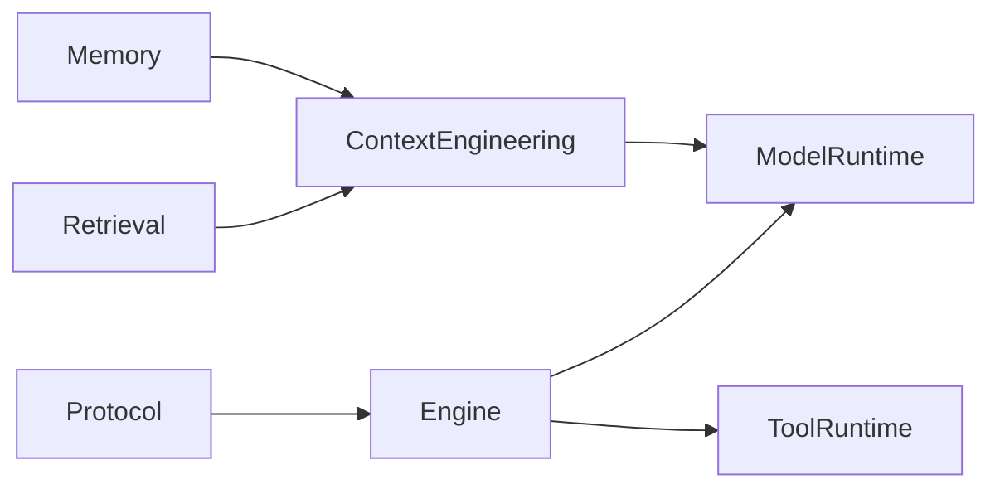
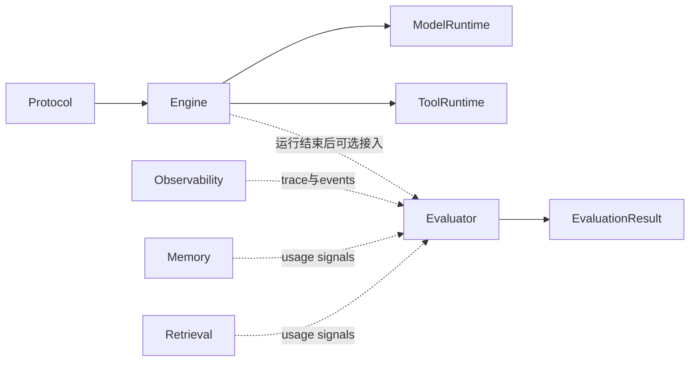
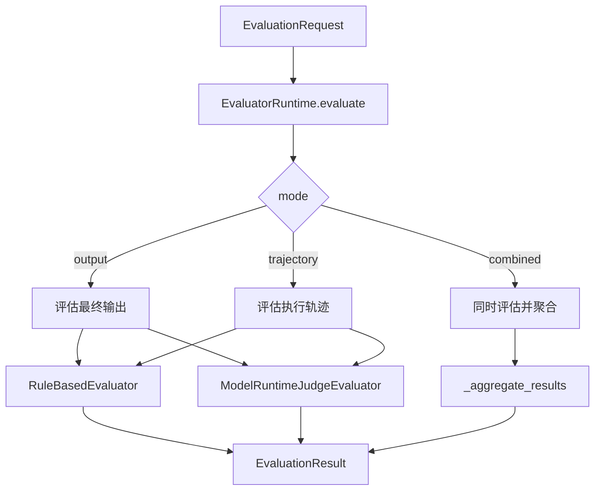

# 第十章：Evaluator 结果评估与轨迹评分

## 目标

这一章要把 `Evaluator` 组件从 0 搭出来，并且让它真正可用。读完后，读者应该能回答 4 个问题：

1. 为什么 Agent 框架不能只关心“能不能跑”，还必须关心“跑得好不好”。
2. 为什么最终答案评估不够，还必须看执行轨迹、工具调用、replan 和效率。
3. 如何把规则评估和 LLM judge 统一收口成结构化 `EvaluationResult`。
4. 如何让 Evaluator 不只是打分器，还能成为 A/B 对比和回归评估的基础设施。

本章会完整复现 `Evaluator` 组件，包括：

- 领域对象与对外导出
- `EvaluatorRuntime`
- `RuleBasedEvaluator`
- `ModelRuntimeJudgeEvaluator`
- 结果对比 example
- 全套单元测试与 example 测试

## 如果你第一次接触 Evaluator，先记这 3 句话

1. Evaluator 不是为了“写个分数好看”，而是为了判断 Agent 的结果是否可信、轨迹是否合理。
2. 一个生产级 Agent 不能只看最终输出，还要看它是如何得到这个输出的。
3. 本章的 `EvaluatorRuntime` 先作为独立 runtime 存在，不直接侵入 Engine 主链路，这样边界更清楚，也更容易测试。

## 如果你现在只想先抓主线，先看这 4 句话

1. `EvaluationRequest` 是评估输入容器，里面不只放答案，还会放轨迹、rubric 和参考信息。
2. `EvaluatorRuntime` 是编排层，负责决定走 output、trajectory 还是 combined。
3. `RuleBasedEvaluator` 负责稳定基线，`ModelRuntimeJudgeEvaluator` 负责补语义判断。
4. `compare()` 负责把多个评估结果转成可比较结论，它不是附属工具，而是 Evaluator 的核心能力之一。

如果你第一次读这章，建议顺序是：

1. 先看“架构位置说明”
2. 再看“第 1 步：主流程”
3. 再看 `runtime.py`
4. 最后再看 `rules.py`、`judge.py` 和测试

## 名词速览

- `EvaluationRequest`：一次评估请求，里面包含任务输入、最终答案、事件轨迹、rubric 等信息。
- `EvaluationResult`：一次评估的结构化输出，包含 verdict、总分、分维度得分、优缺点和建议。
- `output evaluation`：只看最终答案好不好。
- `trajectory evaluation`：看执行轨迹是否合理，例如有没有无效重试、replan 是否合理、工具是否用对。
- `combined evaluation`：同时评 output 和 trajectory，并聚合成一个结果。
- `rubric`：评分规则，定义要看哪些维度、每个维度权重多少、多少分算通过。
- `RuleBasedEvaluator`：规则评估器，稳定、可测、适合做回归基线。
- `ModelRuntimeJudgeEvaluator`：基于 `ModelRuntime` 的 judge 评估器，用结构化输出让模型来做辅助判断。
- `candidate_id`：比较多个评估结果时的稳定候选标识。就算没有 `trace_id/run_id`，也能知道到底是谁赢了。

## 架构位置说明

### 先看全局链路



### 再看 Evaluator 放进来之后的链路



这章先做 3 个非常重要的边界约束：

1. `EvaluatorRuntime` 是独立 runtime，不修改 `EngineLoop`。
2. LLM judge 统一走 `ModelRuntime`，不让 Evaluator 直接连模型 SDK。
3. `Evaluator` 不直接依赖 `RetrievalRuntime` 和 `MemoryRuntime`，而是通过 `FinalAnswer`、`ExecutionEvent` 和可选参考信息来完成评估。

### 为什么现在要引入 Evaluator

如果一个 Agent 只能“跑通”，但不能回答下面这些问题，它就还不是一个可持续优化的系统：

- 这次结果到底好不好？
- 是答案本身错了，还是轨迹设计有问题？
- 两个版本谁更好？
- 为什么这个版本分更低？

前面几章已经把协议、执行、模型、工具、可观测、上下文、检索、记忆都搭起来了。到了这里，系统终于具备了一个现实需求：**比较和评估**。

### 先用一个具体业务例子把这一章串起来

假设你在做一个投研 Agent，用户输入：

> 帮我总结这份财报里最值得关注的三项风险，并给出一句结论。

现在你有两个版本：

- 版本 A：
  - 输出较短，但三项风险都对
  - 只调用了一次检索
  - 没有重试，也没有 replan
- 版本 B：
  - 输出更长，看起来更“像样”
  - 中途一次工具失败
  - 多做了两轮重试
  - 还进行了一次 replan

这时你会碰到 4 个非常现实的问题：

1. 两个版本谁的最终答案更好？
2. 版本 B 虽然字多，但值不值得上线？
3. 那次 replan 是合理自救，还是无意义折腾？
4. 以后你改了 Prompt 或工具策略，怎么知道新版本有没有退化？

Evaluator 就是在回答这 4 个问题。

## 前置条件

在开始本章前，建议你已经完成：

- 第一章 `Bootstrap`
- 第二章 `Protocol`
- 第三章 `Engine`
- 第四章 `Model Runtime`
- 第五章 `Tool Runtime`
- 第六章 `Observability`
- 第七章 `Context Engineering`
- 第八章 `Retrieval`
- 第九章 `Memory`

另外，当前仓库里的 Evaluator 代码依赖这些真实文件：

- [runtime.py](D:/code/build_agent/src/agent_forge/components/evaluator/application/runtime.py)
- [rules.py](D:/code/build_agent/src/agent_forge/components/evaluator/infrastructure/rules.py)
- [judge.py](D:/code/build_agent/src/agent_forge/components/evaluator/infrastructure/judge.py)
- [test_evaluator.py](D:/code/build_agent/tests/unit/test_evaluator.py)

## 环境准备与缺包兜底步骤

先确认你在仓库根目录：

```codex
Get-Location
```

确认 `uv` 可用：

```codex
uv --version
```

如果你只想跑 Evaluator 相关测试：

```codex
uv run --no-sync pytest tests/unit/test_evaluator.py tests/unit/test_evaluator_judge.py tests/unit/test_evaluator_demo.py tests/unit/test_evaluator_compare_demo.py -q
```

如果你的环境没有同步依赖，先执行：

```codex
uv sync
```

如果你只想验证整个项目当前基线：

```codex
uv run --no-sync pytest -q
```

## 本章主线改动范围

这一章会实现并讲透这些文件：

- [__init__.py](D:/code/build_agent/src/agent_forge/components/evaluator/__init__.py)
- [schemas.py](D:/code/build_agent/src/agent_forge/components/evaluator/domain/schemas.py)
- [runtime.py](D:/code/build_agent/src/agent_forge/components/evaluator/application/runtime.py)
- [rules.py](D:/code/build_agent/src/agent_forge/components/evaluator/infrastructure/rules.py)
- [judge.py](D:/code/build_agent/src/agent_forge/components/evaluator/infrastructure/judge.py)
- [evaluator_demo.py](D:/code/build_agent/examples/evaluator/evaluator_demo.py)
- [evaluator_compare_demo.py](D:/code/build_agent/examples/evaluator/evaluator_compare_demo.py)
- [test_evaluator.py](D:/code/build_agent/tests/unit/test_evaluator.py)
- [test_evaluator_judge.py](D:/code/build_agent/tests/unit/test_evaluator_judge.py)
- [test_evaluator_demo.py](D:/code/build_agent/tests/unit/test_evaluator_demo.py)
- [test_evaluator_compare_demo.py](D:/code/build_agent/tests/unit/test_evaluator_compare_demo.py)

# 5. 实施步骤

## 第 1 步：先看懂 Evaluator 的主流程



这条链路里最关键的工程判断有 3 个：

1. `EvaluatorRuntime` 负责“编排评估”，不负责把所有规则和 judge 逻辑都塞进一个文件里。
2. `RuleBasedEvaluator` 和 `ModelRuntimeJudgeEvaluator` 必须并存。前者给你稳定基线，后者给你更强的语义判断能力。
3. `compare()` 必须是 runtime 的一等能力，因为评估不只是看单次得分，还要看多个候选谁更好。

举个很具体的例子：

- 候选 A：答案短，但完全正确，轨迹只调用一次工具。
- 候选 B：答案看起来更丰富，但有两次无效重试，最后还多做了一轮 replan。

这时仅看“有没有输出”完全不够，你需要：

1. 用 `output evaluation` 看答案本身。
2. 用 `trajectory evaluation` 看轨迹是否浪费。
3. 用 `combined` 看最终综合判断。
4. 用 `compare()` 确认到底哪个版本更值得上线。

## 第 2 步：创建包骨架和导出入口

先创建目录：

```codex
New-Item -ItemType Directory -Force src/agent_forge/components/evaluator
New-Item -ItemType Directory -Force src/agent_forge/components/evaluator/domain
New-Item -ItemType Directory -Force src/agent_forge/components/evaluator/application
New-Item -ItemType Directory -Force src/agent_forge/components/evaluator/infrastructure
New-Item -ItemType Directory -Force examples/evaluator
New-Item -ItemType Directory -Force tests/unit
```

### 2.1 创建 `src/agent_forge/components/evaluator/__init__.py`

```codex
New-Item -ItemType File -Force src/agent_forge/components/evaluator/__init__.py
```

文件：[ __init__.py ](D:/code/build_agent/src/agent_forge/components/evaluator/__init__.py)
```python
"""Evaluator 组件导出。"""

from agent_forge.components.evaluator.application import EvaluatorRuntime, summarize_events
from agent_forge.components.evaluator.domain import (
    EvaluationDimension,
    EvaluationMode,
    EvaluationRequest,
    EvaluationResult,
    EvaluationRubric,
    EvaluationScore,
    EvaluationVerdict,
    TrajectorySummary,
)
from agent_forge.components.evaluator.infrastructure import ModelRuntimeJudgeEvaluator, RuleBasedEvaluator

__all__ = [
    "EvaluationDimension",
    "EvaluationMode",
    "EvaluationRequest",
    "EvaluationResult",
    "EvaluationRubric",
    "EvaluationScore",
    "EvaluationVerdict",
    "TrajectorySummary",
    "EvaluatorRuntime",
    "summarize_events",
    "RuleBasedEvaluator",
    "ModelRuntimeJudgeEvaluator",
]
```

### 代码讲解

这个文件的职责不是“为了凑包结构”，而是定义 Evaluator 组件的公共出口。

为什么必须先把这个出口收好？

1. 教程里后面每一步都会从这里回看组件到底对外承诺了什么。
2. 如果入口导出混乱，后面用户在 examples 和 tests 里导入会非常痛苦。
3. 统一出口还能逼你思考：哪些类型是公共契约，哪些只是内部实现细节。

### 2.2 创建 `src/agent_forge/components/evaluator/domain/__init__.py`

```codex
New-Item -ItemType File -Force src/agent_forge/components/evaluator/domain/__init__.py
```

文件：[ __init__.py ](D:/code/build_agent/src/agent_forge/components/evaluator/domain/__init__.py)
```python
"""Evaluator 领域导出。"""

from agent_forge.components.evaluator.domain.schemas import (
    EvaluationDimension,
    EvaluationMode,
    EvaluationRequest,
    EvaluationResult,
    EvaluationRubric,
    EvaluationScore,
    EvaluationVerdict,
    Evaluator,
    EvaluatorModelRuntime,
    TrajectorySummary,
)

__all__ = [
    "EvaluationDimension",
    "EvaluationMode",
    "EvaluationRequest",
    "EvaluationResult",
    "EvaluationRubric",
    "EvaluationScore",
    "EvaluationVerdict",
    "TrajectorySummary",
    "Evaluator",
    "EvaluatorModelRuntime",
]
```

### 代码讲解

这里的作用是把领域层对象集中导出。评估系统最怕的一件事，就是调用方直接越层依赖基础设施实现。这个 `__init__.py` 的存在，就是在约束这种依赖方向。

### 2.3 创建 `src/agent_forge/components/evaluator/application/__init__.py`

```codex
New-Item -ItemType File -Force src/agent_forge/components/evaluator/application/__init__.py
```

文件：[ __init__.py ](D:/code/build_agent/src/agent_forge/components/evaluator/application/__init__.py)
```python
"""Evaluator 应用层导出。"""

from agent_forge.components.evaluator.application.runtime import EvaluatorRuntime, summarize_events

__all__ = ["EvaluatorRuntime", "summarize_events"]
```

### 2.4 创建 `src/agent_forge/components/evaluator/infrastructure/__init__.py`

```codex
New-Item -ItemType File -Force src/agent_forge/components/evaluator/infrastructure/__init__.py
```

文件：[ __init__.py ](D:/code/build_agent/src/agent_forge/components/evaluator/infrastructure/__init__.py)
```python
"""Evaluator 基础设施导出。"""

from agent_forge.components.evaluator.infrastructure.judge import ModelRuntimeJudgeEvaluator
from agent_forge.components.evaluator.infrastructure.rules import RuleBasedEvaluator

__all__ = ["RuleBasedEvaluator", "ModelRuntimeJudgeEvaluator"]
```

### 代码讲解

application 和 infrastructure 两层的导出分开，是为了让读者在第一次阅读时就能感受到边界：

- application 负责组织流程
- infrastructure 负责提供具体评估器实现

## 第 3 步：定义 Evaluator 的领域模型

### 3.1 创建 `src/agent_forge/components/evaluator/domain/schemas.py`

```codex
New-Item -ItemType File -Force src/agent_forge/components/evaluator/domain/schemas.py
```

文件：[ schemas.py ](D:/code/build_agent/src/agent_forge/components/evaluator/domain/schemas.py)
```python
"""Evaluator 领域模型。"""

from __future__ import annotations

from datetime import datetime, timezone
from typing import Any, Literal, Protocol

from pydantic import BaseModel, Field

from agent_forge.components.model_runtime import ModelRequest, ModelResponse
from agent_forge.components.protocol import AgentState, ExecutionEvent, FinalAnswer


EvaluationMode = Literal["output", "trajectory", "combined"]
EvaluationVerdict = Literal["pass", "warning", "fail"]
EvaluationDimension = Literal[
    "correctness",
    "groundedness",
    "completeness",
    "instruction_following",
    "tool_effectiveness",
    "efficiency",
    "memory_usefulness",
]


def now_iso() -> str:
    """返回统一的 UTC 时间字符串。"""

    return datetime.now(timezone.utc).isoformat()


class EvaluationRubric(BaseModel):
    """评估 rubric。"""

    name: str = Field(..., min_length=1, description="rubric 名称")
    dimensions: list[EvaluationDimension] = Field(default_factory=list, description="启用的评估维度")
    weights: dict[EvaluationDimension, float] = Field(default_factory=dict, description="维度权重")
    pass_threshold: float = Field(default=0.75, ge=0.0, le=1.0, description="通过阈值")
    instructions: str = Field(default="", description="补充评估说明")


class EvaluationScore(BaseModel):
    """单维度评分。"""

    dimension: EvaluationDimension = Field(..., description="评估维度")
    score: float = Field(..., ge=0.0, le=1.0, description="归一化分数")
    reason: str = Field(default="", description="评分理由")
    evidence: list[str] = Field(default_factory=list, description="证据片段")


class TrajectorySummary(BaseModel):
    """执行轨迹摘要。"""

    total_events: int = Field(default=0, ge=0, description="事件总数")
    total_tool_calls: int = Field(default=0, ge=0, description="工具调用数")
    total_tool_errors: int = Field(default=0, ge=0, description="工具错误数")
    total_replans: int = Field(default=0, ge=0, description="replan 次数")
    total_errors: int = Field(default=0, ge=0, description="error 事件数")
    unique_event_types: list[str] = Field(default_factory=list, description="事件类型列表")
    notes: list[str] = Field(default_factory=list, description="轨迹观察备注")


class EvaluationResult(BaseModel):
    """评估结果。"""

    verdict: EvaluationVerdict = Field(..., description="总体判定")
    total_score: float = Field(..., ge=0.0, le=1.0, description="总分")
    scores: list[EvaluationScore] = Field(default_factory=list, description="维度评分明细")
    summary: str = Field(default="", description="总体摘要")
    strengths: list[str] = Field(default_factory=list, description="优点")
    weaknesses: list[str] = Field(default_factory=list, description="缺点")
    suggestions: list[str] = Field(default_factory=list, description="优化建议")
    evaluator_name: str = Field(..., min_length=1, description="评估器名称")
    evaluator_version: str = Field(..., min_length=1, description="评估器版本")
    mode: EvaluationMode = Field(..., description="评估模式")
    trace_id: str | None = Field(default=None, description="trace_id")
    run_id: str | None = Field(default=None, description="run_id")
    metadata: dict[str, Any] = Field(default_factory=dict, description="附加信息")
    created_at: str = Field(default_factory=now_iso, description="结果生成时间")


class EvaluationRequest(BaseModel):
    """评估请求。"""

    trace_id: str | None = Field(default=None, description="trace_id")
    run_id: str | None = Field(default=None, description="run_id")
    task_input: str = Field(default="", description="任务输入")
    final_answer: FinalAnswer | None = Field(default=None, description="最终答案")
    agent_state: AgentState | None = Field(default=None, description="完整状态")
    events: list[ExecutionEvent] = Field(default_factory=list, description="执行事件")
    expected_answer: str | None = Field(default=None, description="期望答案")
    reference_facts: list[str] = Field(default_factory=list, description="参考事实")
    rubric: EvaluationRubric | None = Field(default=None, description="rubric")
    mode: EvaluationMode = Field(default="combined", description="评估模式")


class Evaluator(Protocol):
    """统一评估器协议。"""

    evaluator_name: str
    evaluator_version: str

    def evaluate(self, request: EvaluationRequest) -> EvaluationResult:
        """执行一次评估。"""


class EvaluatorModelRuntime(Protocol):
    """给 LLM judge 复用的最小 ModelRuntime 协议。"""

    def generate(self, request: ModelRequest, **kwargs: Any) -> ModelResponse:
        """执行结构化 judge 调用。"""
```

### 代码讲解

这一层决定的是：**什么叫一次评估请求，什么叫一个可比较的评估结果。**

先抓最关键的 5 个对象：

1. `EvaluationRequest`
2. `EvaluationRubric`
3. `EvaluationScore`
4. `EvaluationResult`
5. `TrajectorySummary`

#### 1. `EvaluationRequest` 为什么要这么厚

如果你只传一个 `final_answer`，那你最多只能做一个“答案像不像那么回事”的轻评估。但生产场景里通常需要更多上下文：

- 用户原始任务是什么
- 最终答案是什么
- 轨迹里发生过什么
- 有没有参考答案或参考事实
- 当前 rubric 想看哪些维度

举个例子：

- 任务输入：`帮我总结这份财报的三点风险`
- 最终答案：输出了 3 条风险
- 轨迹：中间调用了两次检索，一次工具失败，一次 replan

如果没有 `events`，你根本看不出来这个结果是稳稳得到的，还是“碰巧答对了”。

#### 2. `EvaluationRubric` 为什么不是可选装饰

上一轮代码质检已经证明：如果 rubric 只是挂在 schema 上而不参与评分，它就是假的接口。现在它已经真实参与：

- 限制评估维度
- 控制维度权重
- 控制 pass 阈值

例子：

- 场景 A：内部知识问答  
  你更看重 `correctness + groundedness`
- 场景 B：助手输出格式检查  
  你更看重 `instruction_following + completeness`

如果 rubric 不能真的改变评估行为，Evaluator 就没有工程价值。

#### 3. `EvaluationResult` 为什么必须结构化

一个只有 `score=0.74` 的结果几乎没法排障。你需要的是：

- verdict
- total_score
- 各维度分数
- 为什么扣分
- 证据是什么
- 建议怎么改

这就是为什么 `EvaluationResult` 必须是个厚对象，而不是一个浮点数。

#### 4. `TrajectorySummary` 为什么单独建模

轨迹评估不是直接把整串 events 塞给每个评估器。这样做会让每个评估器都重复做一遍事件归纳。

更合理的做法是：

1. 先把 events 归纳成 `TrajectorySummary`
2. 再把 summary 交给规则评估和 judge

这样可以减少重复逻辑，也更容易测试。

## 第 4 步：实现 EvaluatorRuntime

### 4.1 创建 `src/agent_forge/components/evaluator/application/runtime.py`

```codex
New-Item -ItemType File -Force src/agent_forge/components/evaluator/application/runtime.py
```

文件：[ runtime.py ](D:/code/build_agent/src/agent_forge/components/evaluator/application/runtime.py)
```python
"""Evaluator 运行时。"""

from __future__ import annotations

from typing import Any

from agent_forge.components.evaluator.domain import (
    EvaluationRequest,
    EvaluationResult,
    EvaluationScore,
    EvaluationVerdict,
    Evaluator,
    TrajectorySummary,
)


class EvaluatorRuntime:
    """统一编排规则评估与 LLM judge。"""

    def __init__(self, *, evaluators: list[Evaluator]) -> None:
        self._evaluators = evaluators

    def evaluate(self, request: EvaluationRequest) -> EvaluationResult:
        results = [evaluator.evaluate(request) for evaluator in self._evaluators]
        if not results:
            raise ValueError("EvaluatorRuntime 至少需要一个 evaluator")
        if len(results) == 1:
            return results[0]
        return _aggregate_results(results=results, request=request)

    def evaluate_output(self, request: EvaluationRequest) -> EvaluationResult:
        return self.evaluate(request.model_copy(update={"mode": "output"}))

    def evaluate_trajectory(self, request: EvaluationRequest) -> EvaluationResult:
        return self.evaluate(request.model_copy(update={"mode": "trajectory"}))

    def evaluate_combined(self, request: EvaluationRequest) -> EvaluationResult:
        return self.evaluate(request.model_copy(update={"mode": "combined"}))

    def compare(self, results: list[EvaluationResult]) -> dict[str, Any]:
        if not results:
            return {"winner": None, "ranking": [], "score_gap": 0.0}
        ranking = sorted(results, key=lambda item: item.total_score, reverse=True)
        winner = ranking[0]
        runner_up = ranking[1] if len(ranking) > 1 else None
        return {
            "winner": _build_candidate_entry(result=winner, index=0),
            "winner_summary": winner.summary,
            "ranking": [_build_candidate_entry(result=item, index=index) for index, item in enumerate(ranking)],
            "score_gap": round(winner.total_score - (runner_up.total_score if runner_up else 0.0), 4),
        }

    def summarize_events(self, events: list[object]) -> TrajectorySummary:
        return summarize_events(events)


def summarize_events(events: list[object]) -> TrajectorySummary:
    total_tool_calls = 0
    total_tool_errors = 0
    total_errors = 0
    total_replans = 0
    seen_replan_revisions: set[int] = set()
    event_types: list[str] = []
    notes: list[str] = []
    for event in events:
        event_type = getattr(event, "event_type", "")
        payload = getattr(event, "payload", {}) or {}
        event_types.append(event_type)
        if event_type == "tool_call":
            total_tool_calls += 1
        if event_type == "tool_result" and payload.get("status") == "error":
            total_tool_errors += 1
        if event_type == "error":
            total_errors += 1
        if payload.get("plan_revision", 0) and payload.get("plan_origin") == "replan":
            seen_replan_revisions.add(int(payload["plan_revision"]))
        if payload.get("replan_count"):
            total_replans = max(total_replans, int(payload["replan_count"]))
    total_replans = max(total_replans, len(seen_replan_revisions))
    if total_tool_errors:
        notes.append("轨迹中出现工具失败")
    if total_replans:
        notes.append("轨迹中出现计划修订")
    return TrajectorySummary(
        total_events=len(events),
        total_tool_calls=total_tool_calls,
        total_tool_errors=total_tool_errors,
        total_replans=total_replans,
        total_errors=total_errors,
        unique_event_types=sorted(set(event_types)),
        notes=notes,
    )


def _aggregate_results(*, results: list[EvaluationResult], request: EvaluationRequest) -> EvaluationResult:
    merged_scores = _filter_scores_by_rubric(scores=_aggregate_scores_by_dimension(results), request=request)
    strengths: list[str] = []
    weaknesses: list[str] = []
    suggestions: list[str] = []
    for result in results:
        strengths.extend(result.strengths)
        weaknesses.extend(result.weaknesses)
        suggestions.extend(result.suggestions)
    avg_score = _calculate_total_score(scores=merged_scores, request=request)
    verdict = _score_to_verdict(avg_score, request)
    return EvaluationResult(
        verdict=verdict,
        total_score=avg_score,
        scores=merged_scores,
        summary=f"聚合了 {len(results)} 个 evaluator 的结果",
        strengths=_dedupe(strengths),
        weaknesses=_dedupe(weaknesses),
        suggestions=_dedupe(suggestions),
        evaluator_name="aggregated_evaluator",
        evaluator_version="aggregated-v1",
        mode=request.mode,
        trace_id=request.trace_id,
        run_id=request.run_id,
        metadata={
            "source_evaluators": [item.evaluator_name for item in results],
            "aggregated_dimensions": [item.dimension for item in merged_scores],
        },
    )


def _score_to_verdict(score: float, request: EvaluationRequest) -> EvaluationVerdict:
    threshold = request.rubric.pass_threshold if request.rubric else 0.75
    if score >= threshold:
        return "pass"
    if score >= max(threshold - 0.25, 0.5):
        return "warning"
    return "fail"


def _dedupe(items: list[str]) -> list[str]:
    output: list[str] = []
    seen: set[str] = set()
    for item in items:
        if not item or item in seen:
            continue
        seen.add(item)
        output.append(item)
    return output


def _build_candidate_entry(*, result: EvaluationResult, index: int) -> dict[str, Any]:
    return {
        "candidate_id": _candidate_id(result=result, index=index),
        "trace_id": result.trace_id,
        "run_id": result.run_id,
        "evaluator": result.evaluator_name,
        "mode": result.mode,
        "score": result.total_score,
        "verdict": result.verdict,
    }


def _candidate_id(*, result: EvaluationResult, index: int) -> str:
    if result.trace_id and result.run_id:
        return f"{result.trace_id}:{result.run_id}"
    if result.run_id:
        return f"run:{result.run_id}"
    if result.trace_id:
        return f"trace:{result.trace_id}"
    return f"{result.evaluator_name}:{result.mode}:{index}"


def _calculate_total_score(*, scores: list[EvaluationScore], request: EvaluationRequest) -> float:
    active_scores = _filter_scores_by_rubric(scores=scores, request=request)
    if not active_scores:
        return 0.0
    weights = _build_weight_map(active_scores=active_scores, request=request)
    weighted_sum = sum(item.score * weights[item.dimension] for item in active_scores)
    total_weight = sum(weights[item.dimension] for item in active_scores)
    return round(weighted_sum / total_weight, 4) if total_weight else 0.0


def _filter_scores_by_rubric(*, scores: list[EvaluationScore], request: EvaluationRequest) -> list[EvaluationScore]:
    if not request.rubric or not request.rubric.dimensions:
        return scores
    allowed = set(request.rubric.dimensions)
    return [item for item in scores if item.dimension in allowed]


def _build_weight_map(*, active_scores: list[EvaluationScore], request: EvaluationRequest) -> dict[str, float]:
    configured = request.rubric.weights if request.rubric else {}
    weights: dict[str, float] = {}
    for item in active_scores:
        raw_weight = configured.get(item.dimension, 1.0)
        weights[item.dimension] = raw_weight if raw_weight > 0 else 1.0
    return weights


def _aggregate_scores_by_dimension(results: list[EvaluationResult]) -> list[EvaluationScore]:
    grouped: dict[str, list[EvaluationScore]] = {}
    for result in results:
        for score in result.scores:
            grouped.setdefault(score.dimension, []).append(score)

    aggregated: list[EvaluationScore] = []
    for dimension, dimension_scores in grouped.items():
        avg_score = round(sum(item.score for item in dimension_scores) / len(dimension_scores), 4)
        reasons = _dedupe([item.reason for item in dimension_scores])
        evidence = _dedupe([e for item in dimension_scores for e in item.evidence])
        aggregated.append(
            EvaluationScore(
                dimension=dimension,  # type: ignore[arg-type]
                score=avg_score,
                reason="；".join(reasons),
                evidence=evidence,
            )
        )
    return sorted(aggregated, key=lambda item: item.dimension)
```

### 代码讲解

这个文件是本章主脑。第一次读它，先抓这 5 件事：

1. `evaluate()` 怎么分发 mode
2. `summarize_events()` 怎么把轨迹压成 summary
3. `_aggregate_results()` 怎么做多评估器聚合
4. `compare()` 怎么比较多个候选
5. `candidate_id` 为什么必须存在

#### 第一次读 `runtime.py`，建议只看这 4 个函数

如果你第一次看这个文件，不要试图把每一行都吃透。先抓这 4 个函数：

1. `evaluate()`
2. `summarize_events()`
3. `_aggregate_results()`
4. `compare()`

为什么是这 4 个？

- `evaluate()` 决定入口
- `summarize_events()` 决定轨迹评估材料
- `_aggregate_results()` 决定多评估器怎么合成一个结果
- `compare()` 决定这个组件能不能真正进入实验和回归场景

你先把这 4 个点看顺了，再回来看细节，就不会觉得这个文件像一团逻辑缠在一起。

#### `evaluate()` 的职责

它解决的是“收到一个请求后，应该走哪条评估路径”。

这里最容易犯的错误，是把 output、trajectory、combined 的细节全部塞进一个巨大的 if/else 里。现在的实现把它拆成：

- `evaluate_output(...)`
- `evaluate_trajectory(...)`
- `evaluate_combined(...)`

这样后面扩展新的 mode 或新的 evaluator，边界更稳。

这里给一个最小输入输出例子：

- 输入：
  - `mode="output"`
  - `final_answer.output={"answer": "这家公司最大的风险是现金流压力"}`
  - `reference_facts=["现金流承压", "负债水平上升"]`
- 输出：
  - 一个 `EvaluationResult`
  - 里面至少有 `verdict / total_score / scores / strengths / weaknesses`

也就是说，`evaluate()` 的价值不是“帮你调用一下 evaluator”，而是把一坨原始材料收口成统一结果。

#### `summarize_events()` 的职责

它做的不是简单统计，而是把 Engine 轨迹压成评估可用的结构化摘要。

这里有一个非常关键的修复点：

- 同一轮 `replan` 可能在多个事件里出现
- 如果按事件数直接累加，会把一次 replan 算成两次甚至更多次
- 现在改成按唯一 `plan_revision` 去重计数

这是典型的“看起来只是统计细节，实际上会直接影响 efficiency 分数”的问题。

这里再给一个具体轨迹例子：

- event 1：`plan`，`plan_revision=0`
- event 2：`tool_end`，某次工具调用失败
- event 3：`reflect`，决定 `replan`
- event 4：`plan`，`plan_revision=1`，`plan_origin="replan"`
- event 5：`finish`，同样带着 `plan_revision=1`

如果你按事件数粗暴统计，会把 revision 1 记两次。  
现在按唯一 revision 去重，就是为了让“同一轮 replan”只影响一次评估。

#### `_aggregate_results()` 的职责

这个函数要解决“多个 evaluator 同时参与时，怎么聚合结果”。

之前一个常见错误是：

1. 每个 evaluator 先出一个总分
2. 再对总分做简单平均

这个做法很粗，因为：

- 一个只评 1 个维度的 evaluator
- 和一个评 7 个维度的 evaluator

会被赋予相同权重。现在改成：

1. 先按维度聚合 `scores`
2. 再按 rubric 计算加权总分

这才是一个更可解释的聚合逻辑。

你可以把它理解成：

- 规则评估器像“稳定监考老师”
- judge 评估器像“补充语义判断的复核老师”

真正合理的做法，不是先让每个老师给一个总分再平均，而是：

1. 先看每个维度上大家怎么打
2. 再按 rubric 算综合结果

这样你后面追查“为什么 completeness 低、为什么 groundedness 低”时，才找得到原因。

#### `compare()` 的职责

`compare()` 的目标不是告诉你“哪个 evaluator 名字赢了”，而是告诉你：

- 哪个候选 run 赢了
- 为什么赢
- 排名顺序是什么

所以这里必须返回 run 级信息，例如：

- `trace_id`
- `run_id`
- `candidate_id`
- `score`
- `verdict`

如果没有 `candidate_id`，一旦某个结果缺少 `trace_id/run_id`，对比结果就会变得不可定位。

再给一个很实用的场景：

- 你在一条实验流水线上同时跑了 5 个候选
- 其中 3 个候选没有写 `trace_id`
- 但你仍然要知道谁排第一、谁排最后

这就是 `candidate_id` 存在的意义。  
它不是为了“格式完整”，而是为了避免 compare 到最后只剩一句“有个候选赢了，但不知道是谁”。

#### 一个具体例子：A/B 结果对比

假设你有两个候选：

- 候选 A：`trace_a / run_a`
- 候选 B：`trace_b / run_b`

两者都由同一个 `rule_based_evaluator` 打分。  
如果 compare 只返回 `winner="rule_based_evaluator"`，那这个结果基本没法用。现在返回的是候选级 winner，才真正能用于 A/B。

## 第 5 步：实现规则评估器

### 5.1 创建 `src/agent_forge/components/evaluator/infrastructure/rules.py`

```codex
New-Item -ItemType File -Force src/agent_forge/components/evaluator/infrastructure/rules.py
```

文件：[ rules.py ](D:/code/build_agent/src/agent_forge/components/evaluator/infrastructure/rules.py)
```python
"""规则评估器。"""

from __future__ import annotations

import json
from typing import Any

from agent_forge.components.evaluator.application.runtime import _calculate_total_score, summarize_events
from agent_forge.components.evaluator.domain import EvaluationRequest, EvaluationResult, EvaluationScore, EvaluationVerdict


class RuleBasedEvaluator:
    """基于显式规则的评估器。"""

    evaluator_name = "rule_based_evaluator"
    evaluator_version = "rule-based-v1"

    def evaluate(self, request: EvaluationRequest) -> EvaluationResult:
        scores: list[EvaluationScore] = []
        final_answer = request.final_answer or (request.agent_state.final_answer if request.agent_state else None)
        events = request.events or (request.agent_state.events if request.agent_state else [])
        trajectory = summarize_events(events)
        output_text = _flatten_final_answer(final_answer)
        if request.mode in {"output", "combined"}:
            scores.extend(self._score_output(request=request, output_text=output_text))
        if request.mode in {"trajectory", "combined"}:
            scores.extend(self._score_trajectory(request=request, trajectory=trajectory, final_answer_text=output_text))
        scores = _filter_scores_for_output(scores=scores, request=request)
        total_score = _calculate_total_score(scores=scores, request=request)
        verdict = _score_to_verdict(total_score, request)
        return EvaluationResult(
            verdict=verdict,
            total_score=total_score,
            scores=scores,
            summary=_build_summary(verdict=verdict, total_score=total_score, trajectory=trajectory),
            strengths=_collect_strengths(scores),
            weaknesses=_collect_weaknesses(scores),
            suggestions=_collect_suggestions(scores, trajectory),
            evaluator_name=self.evaluator_name,
            evaluator_version=self.evaluator_version,
            mode=request.mode,
            trace_id=request.trace_id,
            run_id=request.run_id,
            metadata={"trajectory_summary": trajectory.model_dump()},
        )

    def _score_output(self, *, request: EvaluationRequest, output_text: str) -> list[EvaluationScore]:
        scores: list[EvaluationScore] = []
        final_answer = request.final_answer or (request.agent_state.final_answer if request.agent_state else None)
        summary_text = final_answer.summary.strip() if final_answer and final_answer.summary else ""
        has_output = bool(summary_text or output_text.strip())

        # 1. 先判断最终答案是否真的形成可评估输出，避免“没有答案却高分”的假阳性。
        not_empty = 1.0 if has_output else 0.0
        scores.append(
            EvaluationScore(
                dimension="completeness",
                score=not_empty,
                reason="最终答案存在非空 summary 或 output" if not_empty else "最终答案为空或缺失",
                evidence=[summary_text] if summary_text else [],
            )
        )

        # 2. 再处理 correctness。没有 expected_answer 时给中性分，不直接给满分。
        if not has_output:
            correctness_score = 0.0
            correctness_reason = "没有可评估的最终答案"
        elif request.expected_answer:
            expected_hit = _contains_all(output_text, [request.expected_answer])
            correctness_score = 1.0 if expected_hit else 0.5
            correctness_reason = "命中 expected_answer" if expected_hit else "未完全命中 expected_answer"
        else:
            correctness_score = 0.5
            correctness_reason = "未提供 expected_answer，按中性基线计分"
        scores.append(
            EvaluationScore(
                dimension="correctness",
                score=correctness_score,
                reason=correctness_reason,
                evidence=[request.expected_answer] if request.expected_answer else [],
            )
        )

        # 3. groundedness 只有在存在输出时才有意义；没有 reference_facts 时同样给中性分。
        fact_hits = [fact for fact in request.reference_facts if fact and fact in output_text]
        if not has_output:
            grounded_score = 0.0
            grounded_reason = "没有可用于对齐参考事实的最终答案"
        elif request.reference_facts:
            grounded_score = len(fact_hits) / len(request.reference_facts)
            grounded_reason = "参考事实命中率"
        else:
            grounded_score = 0.5
            grounded_reason = "未提供 reference_facts，按中性基线计分"
        scores.append(
            EvaluationScore(
                dimension="groundedness",
                score=round(grounded_score, 4),
                reason=grounded_reason,
                evidence=fact_hits,
            )
        )

        # 4. instruction_following 同理。没有 rubric 指令时给中性分，而不是直接满分。
        instructions = request.rubric.instructions if request.rubric else ""
        if not has_output:
            instruction_score = 0.0
            instruction_reason = "没有可用于判断指令遵循度的最终答案"
        elif instructions:
            instruction_score = 1.0 if instructions.lower() in output_text.lower() else 0.6
            instruction_reason = "rubric 指令命中" if instruction_score == 1.0 else "未直接体现 rubric 指令"
        else:
            instruction_score = 0.5
            instruction_reason = "未提供 rubric.instructions，按中性基线计分"
        scores.append(
            EvaluationScore(
                dimension="instruction_following",
                score=instruction_score,
                reason=instruction_reason,
                evidence=[instructions] if instructions else [],
            )
        )
        return scores

    def _score_trajectory(self, *, request: EvaluationRequest, trajectory: Any, final_answer_text: str) -> list[EvaluationScore]:
        scores: list[EvaluationScore] = []
        tool_effectiveness = 1.0
        if trajectory.total_tool_errors and final_answer_text:
            tool_effectiveness = 0.3
        elif trajectory.total_tool_errors:
            tool_effectiveness = 0.5
        scores.append(EvaluationScore(dimension="tool_effectiveness", score=tool_effectiveness, reason="工具失败但仍输出成功答案" if tool_effectiveness == 0.3 else "工具使用基本正常", evidence=trajectory.notes))
        efficiency = 1.0
        if trajectory.total_events > 12:
            efficiency = 0.6
        if trajectory.total_replans > 1:
            efficiency = min(efficiency, 0.5)
        scores.append(EvaluationScore(dimension="efficiency", score=efficiency, reason="事件数与 replan 次数控制良好" if efficiency == 1.0 else "轨迹偏长或重规划偏多", evidence=[f"events={trajectory.total_events}", f"replans={trajectory.total_replans}"]))
        memory_usefulness = 0.5
        all_events = request.events or (request.agent_state.events if request.agent_state else [])
        if any("memory" in str(getattr(event, "payload", {})).lower() for event in all_events):
            memory_usefulness = 1.0
        scores.append(EvaluationScore(dimension="memory_usefulness", score=memory_usefulness, reason="轨迹中出现 memory 相关使用痕迹" if memory_usefulness == 1.0 else "未观察到明确的 memory 使用痕迹", evidence=trajectory.notes))
        return scores


def _flatten_final_answer(final_answer: Any) -> str:
    if final_answer is None:
        return ""
    return f"{final_answer.summary}\n{json.dumps(final_answer.output, ensure_ascii=False, sort_keys=True)}"


def _contains_all(output_text: str, expected_parts: list[str]) -> bool:
    if not expected_parts:
        return True
    lowered = output_text.lower()
    return all(part.lower() in lowered for part in expected_parts if part)


def _score_to_verdict(score: float, request: EvaluationRequest) -> EvaluationVerdict:
    threshold = request.rubric.pass_threshold if request.rubric else 0.75
    if score >= threshold:
        return "pass"
    if score >= max(threshold - 0.25, 0.5):
        return "warning"
    return "fail"


def _build_summary(*, verdict: EvaluationVerdict, total_score: float, trajectory: Any) -> str:
    return f"规则评估完成，verdict={verdict}，score={total_score:.2f}，events={trajectory.total_events}，tool_errors={trajectory.total_tool_errors}"


def _collect_strengths(scores: list[EvaluationScore]) -> list[str]:
    return [f"{item.dimension} 表现稳定" for item in scores if item.score >= 0.8]


def _collect_weaknesses(scores: list[EvaluationScore]) -> list[str]:
    return [f"{item.dimension} 需要关注" for item in scores if item.score < 0.6]


def _collect_suggestions(scores: list[EvaluationScore], trajectory: Any) -> list[str]:
    suggestions: list[str] = []
    low_dimensions = [item.dimension for item in scores if item.score < 0.6]
    if "groundedness" in low_dimensions:
        suggestions.append("补充 reference_facts 或增强事实引用")
    if "tool_effectiveness" in low_dimensions:
        suggestions.append("检查工具失败后的降级与总结逻辑")
    if "efficiency" in low_dimensions:
        suggestions.append("减少无效步骤或限制 replan 次数")
    if trajectory.total_errors:
        suggestions.append("优先排查 error 事件对应的根因")
    return suggestions


def _filter_scores_for_output(*, scores: list[EvaluationScore], request: EvaluationRequest) -> list[EvaluationScore]:
    if not request.rubric or not request.rubric.dimensions:
        return scores
    allowed = set(request.rubric.dimensions)
    return [item for item in scores if item.dimension in allowed]
```

### 代码讲解

`RuleBasedEvaluator` 是整章里最重要的基线评估器。它的价值有 3 个：

1. 稳定
2. 可解释
3. 回归测试友好

#### 第一次读 `rules.py`，先抓这 3 组规则

1. 最终答案本身有没有问题
2. 轨迹本身有没有问题
3. rubric 传进来后，分数是怎么被过滤和加权的

如果你先把这 3 组规则看明白，这个文件就不难了。  
真正复杂的不是 Python 语法，而是“哪些规则应该稳定存在，哪些规则不应该写死在这里”。

#### 为什么规则评估器不能省

如果你只有 LLM judge，会遇到两个现实问题：

1. 评估结果不够稳定
2. 一旦 judge 本身出错，你没有可靠基线

规则评估器的意义不是“比 LLM 更聪明”，而是“提供一个不漂移的底座”。

#### 一个 output 评估例子

任务：`请总结这份材料的三点风险`

- 如果 `final_answer.output` 是空的  
  `correctness` 和 `completeness` 都不可能高
- 如果 `reference_facts` 里有 3 条关键事实，而答案一条都没命中  
  `groundedness` 和 `correctness` 必须扣分

再看一个更贴近业务的例子：

- 任务：`请把合同风险总结成 3 条，并用中文输出`
- 实际答案：
  - 只给了 2 条
  - 而且用了英文

这时哪怕内容本身部分正确：

- `completeness` 也会掉
- `instruction_following` 也会掉

这就是规则评估的价值：先把这些“明确违反要求”的问题稳稳抓出来。

#### 一个 trajectory 评估例子

轨迹里如果发生了下面这些情况：

- 工具失败了，但答案仍然假装成功
- 连续多次无效重试
- 明明一步能完成，却做了多轮 replan

那 `tool_effectiveness`、`efficiency` 都必须下降。

再举一个对比：

- 轨迹 A：
  - 1 次 plan
  - 1 次工具调用
  - 1 次 finish
- 轨迹 B：
  - 1 次初始 plan
  - 2 次工具失败
  - 1 次 replan
  - 2 次重复工具调用
  - 1 次 finish

就算最后答案都差不多，轨迹 B 也应该在 `efficiency` 上被明显拉低。

#### 为什么要统一使用 JSON 展开 final_answer.output

前面已经修过一个一致性问题：

- judge 通道用 JSON
- 规则通道用 Python repr

这会导致两个评估器“看到的材料”不一致。现在规则评估也统一成 JSON 文本，是为了让评估输入更稳定。

## 第 6 步：实现 LLM judge 评估器

### 6.1 创建 `src/agent_forge/components/evaluator/infrastructure/judge.py`

```codex
New-Item -ItemType File -Force src/agent_forge/components/evaluator/infrastructure/judge.py
```

文件：[ judge.py ](D:/code/build_agent/src/agent_forge/components/evaluator/infrastructure/judge.py)
```python
"""LLM judge 评估器。"""

from __future__ import annotations

import json
from typing import Any

from agent_forge.components.evaluator.application.runtime import summarize_events
from agent_forge.components.evaluator.domain import EvaluationRequest, EvaluationResult, EvaluationScore, EvaluatorModelRuntime
from agent_forge.components.model_runtime import ModelRequest
from agent_forge.components.protocol import AgentMessage


class ModelRuntimeJudgeEvaluator:
    """通过 ModelRuntime 做结构化评估。"""

    evaluator_name = "model_runtime_judge"
    evaluator_version = "judge-v1"

    def __init__(self, *, model_runtime: EvaluatorModelRuntime, model: str | None = None) -> None:
        self._model_runtime = model_runtime
        self._model = model

    def evaluate(self, request: EvaluationRequest) -> EvaluationResult:
        model_request = ModelRequest(
            messages=[AgentMessage(role="user", content=_build_user_prompt(request))],
            system_prompt=_build_system_prompt(request),
            model=self._model,
            temperature=0.0,
            response_schema=_judge_schema(),
        )
        try:
            response = self._model_runtime.generate(model_request)
            parsed = response.parsed_output or {}
            return _parse_judge_result(parsed=parsed, request=request)
        except Exception as exc:
            return EvaluationResult(
                verdict="warning",
                total_score=0.0,
                scores=[],
                summary=f"judge 评估失败：{exc}",
                strengths=[],
                weaknesses=["judge 未能返回结构化结果"],
                suggestions=["检查 ModelRuntime judge schema 或模型输出稳定性"],
                evaluator_name=self.evaluator_name,
                evaluator_version=self.evaluator_version,
                mode=request.mode,
                trace_id=request.trace_id,
                run_id=request.run_id,
                metadata={"error": str(exc)},
            )


def _build_system_prompt(request: EvaluationRequest) -> str:
    rubric_text = request.rubric.instructions if request.rubric else "按 correctness、groundedness、efficiency 等维度结构化打分。"
    dimensions = request.rubric.dimensions if request.rubric and request.rubric.dimensions else ["correctness", "groundedness", "completeness", "instruction_following", "tool_effectiveness", "efficiency", "memory_usefulness"]
    weights = request.rubric.weights if request.rubric else {}
    return (
        f"你是 Agent 结果评估器。请基于输入材料输出结构化 JSON。不要输出自由文本。当前模式是 {request.mode}。"
        f"启用维度：{json.dumps(dimensions, ensure_ascii=False)}。"
        f"维度权重：{json.dumps(weights, ensure_ascii=False)}。"
        f"补充要求：{rubric_text}"
    )


def _build_user_prompt(request: EvaluationRequest) -> str:
    final_answer = request.final_answer or (request.agent_state.final_answer if request.agent_state else None)
    trajectory = summarize_events(request.events or (request.agent_state.events if request.agent_state else []))
    return (
        f"task_input:\n{request.task_input}\n\n"
        f"final_answer_summary:\n{final_answer.summary if final_answer else ''}\n\n"
        f"final_answer_output:\n{json.dumps(final_answer.output if final_answer else {}, ensure_ascii=False, sort_keys=True)}\n\n"
        f"expected_answer:\n{request.expected_answer or ''}\n\n"
        f"reference_facts:\n{json.dumps(request.reference_facts, ensure_ascii=False)}\n\n"
        f"trajectory_summary:\n{json.dumps(trajectory.model_dump(), ensure_ascii=False, sort_keys=True)}\n"
    )


def _judge_schema() -> dict[str, Any]:
    return {
        "type": "object",
        "required": ["verdict", "total_score", "summary", "scores"],
        "properties": {
            "verdict": {"type": "string", "enum": ["pass", "warning", "fail"]},
            "total_score": {"type": "number"},
            "summary": {"type": "string"},
            "strengths": {"type": "array", "items": {"type": "string"}},
            "weaknesses": {"type": "array", "items": {"type": "string"}},
            "suggestions": {"type": "array", "items": {"type": "string"}},
            "scores": {
                "type": "array",
                "items": {
                    "type": "object",
                    "required": ["dimension", "score", "reason"],
                    "properties": {
                        "dimension": {
                            "type": "string",
                            "enum": [
                                "correctness",
                                "groundedness",
                                "completeness",
                                "instruction_following",
                                "tool_effectiveness",
                                "efficiency",
                                "memory_usefulness",
                            ],
                        },
                        "score": {"type": "number"},
                        "reason": {"type": "string"},
                        "evidence": {"type": "array", "items": {"type": "string"}},
                    },
                },
            },
        },
    }


def _parse_judge_result(*, parsed: dict[str, Any], request: EvaluationRequest) -> EvaluationResult:
    raw_scores = parsed.get("scores", [])
    scores: list[EvaluationScore] = []
    for item in raw_scores:
        if not isinstance(item, dict):
            continue
        try:
            scores.append(EvaluationScore.model_validate(item))
        except Exception:
            continue
    if "verdict" not in parsed or "total_score" not in parsed:
        return EvaluationResult(
            verdict="warning",
            total_score=0.0,
            scores=[],
            summary="judge 输出缺少关键字段，已退化为空结果",
            strengths=[],
            weaknesses=["judge 输出不完整"],
            suggestions=["检查 judge schema 与模型输出"],
            evaluator_name="model_runtime_judge",
            evaluator_version="judge-v1",
            mode=request.mode,
            trace_id=request.trace_id,
            run_id=request.run_id,
            metadata={"raw_output": parsed},
        )
    return EvaluationResult(
        verdict=parsed["verdict"],
        total_score=float(parsed["total_score"]),
        scores=scores,
        summary=str(parsed.get("summary", "")),
        strengths=list(parsed.get("strengths", [])),
        weaknesses=list(parsed.get("weaknesses", [])),
        suggestions=list(parsed.get("suggestions", [])),
        evaluator_name="model_runtime_judge",
        evaluator_version="judge-v1",
        mode=request.mode,
        trace_id=request.trace_id,
        run_id=request.run_id,
        metadata={"raw_output": parsed},
    )
```

### 代码讲解

这个文件负责“把模型引入评估”，但方式必须可控。

最重要的工程边界是：

1. Judge 统一走 `ModelRuntime`
2. 输出必须是结构化 schema
3. judge 失败要优雅退化，不能打崩 EvaluatorRuntime

#### 第一次读 `judge.py`，先抓这 3 个问题

1. judge 的输入材料是什么
2. judge 结果为什么必须是结构化 schema
3. judge 失败时为什么不能把整次评估打崩

你先把这 3 个问题看明白，剩下的实现细节就只是“如何安全地通过 ModelRuntime 发一个结构化请求”。

#### 为什么不能直接在这里连 OpenAI/DeepSeek SDK

原因和第七、九章完全一致：组件边界必须稳定。

如果 Evaluator 直接连模型 SDK，会有两个问题：

1. 你把模型厂商差异又重新引进来了
2. `ModelRuntime` 这一层就被绕开了

所以本章故意让 judge 继续复用现有 `ModelRuntime`，这是架构一致性的要求，不是实现偷懒。

#### judge prompt 为什么要结构化

这里也已经修过一个重要问题：不能再把 `final_answer.output`、`reference_facts`、`trajectory_summary` 直接用 Python repr 拼进 prompt。

现在统一使用 JSON 序列化，原因是：

1. 对模型更稳定
2. 可读性更高
3. 测试更容易断言

#### 一个 judge 使用场景

规则评估很擅长看：

- 空答案
- 超步数
- 工具失败

但它不擅长判断：

- 这个总结是不是“虽然说法不同，但语义上正确”
- 这个答案是不是“基本正确但缺了一点”

这就是 judge 的价值：在结构化边界内补语义判断。

再举一个更直观的例子：

- 参考事实：`公司短期偿债压力上升`
- 最终答案写的是：`公司短期资金链更紧张`

规则评估可能会因为字面不一致而保守扣分。  
judge 更擅长识别：这两句话虽然措辞不同，但在语义上高度接近。

这也是为什么本章不是“用 judge 替代规则”，而是“用 judge 补规则够不到的地方”。

## 第 7 步：补 examples，让读者先跑起来

examples 目录不是包，不创建 `__init__.py`。

### 7.1 创建 `examples/evaluator/evaluator_demo.py`

```codex
New-Item -ItemType File -Force examples/evaluator/evaluator_demo.py
```

文件：[ evaluator_demo.py ](D:/code/build_agent/examples/evaluator/evaluator_demo.py)
```python
"""Evaluator 示例。"""

from __future__ import annotations

from typing import Any

from agent_forge.components.evaluator import EvaluationRequest, EvaluatorRuntime, ModelRuntimeJudgeEvaluator, RuleBasedEvaluator
from agent_forge.components.model_runtime import ModelRequest, ModelResponse, ModelStats
from agent_forge.components.protocol import ExecutionEvent, FinalAnswer, build_initial_state


class DemoJudgeRuntime:
    """示例用假 judge runtime。"""

    def generate(self, request: ModelRequest, **kwargs: Any) -> ModelResponse:
        _ = kwargs
        _ = request
        return ModelResponse(
            content='{"verdict":"pass"}',
            parsed_output={
                "verdict": "pass",
                "total_score": 0.86,
                "summary": "输出基本满足目标，轨迹也较稳定。",
                "strengths": ["回答完整", "轨迹清晰"],
                "weaknesses": ["仍可补充更多引用事实"],
                "suggestions": ["补充 reference_facts 可进一步提高 groundedness"],
                "scores": [
                    {"dimension": "correctness", "score": 0.9, "reason": "命中目标"},
                    {"dimension": "efficiency", "score": 0.82, "reason": "步骤数可接受"},
                ],
            },
            stats=ModelStats(total_tokens=24),
        )


def run_demo() -> dict[str, Any]:
    state = build_initial_state("session_eval_demo")
    state.final_answer = FinalAnswer(
        status="success",
        summary="已整理出董事会纪要的关键结论。",
        output={"answer": "董事会要求下周提交融资材料，并保持结论前置。"},
    )
    state.events = [
        ExecutionEvent(trace_id=state.trace_id, run_id=state.run_id, step_id="plan_1", event_type="plan", payload={}),
        ExecutionEvent(trace_id=state.trace_id, run_id=state.run_id, step_id="tool_1", event_type="tool_call", payload={}),
        ExecutionEvent(trace_id=state.trace_id, run_id=state.run_id, step_id="tool_1", event_type="tool_result", payload={"status": "ok"}),
        ExecutionEvent(trace_id=state.trace_id, run_id=state.run_id, step_id="finish_1", event_type="finish", payload={}),
    ]
    runtime = EvaluatorRuntime(evaluators=[RuleBasedEvaluator(), ModelRuntimeJudgeEvaluator(model_runtime=DemoJudgeRuntime())])
    result = runtime.evaluate(
        EvaluationRequest(
            trace_id=state.trace_id,
            run_id=state.run_id,
            task_input="请整理董事会纪要",
            agent_state=state,
            final_answer=state.final_answer,
            events=state.events,
            expected_answer="融资材料",
            reference_facts=["融资材料", "结论前置"],
            mode="combined",
        )
    )
    return {
        "verdict": result.verdict,
        "total_score": result.total_score,
        "score_count": len(result.scores),
        "summary": result.summary,
    }


if __name__ == "__main__":
    print(run_demo())
```

### 代码讲解

这条 example 适合第一次跑通 Evaluator。它展示的是：

1. 规则评估怎么用
2. judge 评估怎么接
3. combined 模式怎么聚合

如果你现在只想先有个最小闭环，就先跑它。

### 7.2 创建 `examples/evaluator/evaluator_compare_demo.py`

```codex
New-Item -ItemType File -Force examples/evaluator/evaluator_compare_demo.py
```

文件：[ evaluator_compare_demo.py ](D:/code/build_agent/examples/evaluator/evaluator_compare_demo.py)
```python
"""Evaluator 对比示例。"""

from __future__ import annotations

from agent_forge.components.evaluator import EvaluationRequest, EvaluatorRuntime, RuleBasedEvaluator
from agent_forge.components.protocol import ExecutionEvent, FinalAnswer


def run_compare_demo() -> dict:
    runtime = EvaluatorRuntime(evaluators=[RuleBasedEvaluator()])
    good = runtime.evaluate(
        EvaluationRequest(
            trace_id="trace_good",
            run_id="run_good",
            task_input="整理投融资纪要",
            final_answer=FinalAnswer(status="success", summary="已整理完成。", output={"answer": "客户下周提交融资材料，并保持正式简洁风格。"}),
            events=[
                ExecutionEvent(trace_id="trace_good", run_id="run_good", step_id="plan_1", event_type="plan", payload={}),
                ExecutionEvent(trace_id="trace_good", run_id="run_good", step_id="finish_1", event_type="finish", payload={}),
            ],
            expected_answer="融资材料",
            reference_facts=["融资材料"],
            mode="combined",
        )
    )
    bad = runtime.evaluate(
        EvaluationRequest(
            trace_id="trace_bad",
            run_id="run_bad",
            task_input="整理投融资纪要",
            final_answer=FinalAnswer(status="success", summary="完成。", output={"answer": "一切正常"}),
            events=[
                ExecutionEvent(trace_id="trace_bad", run_id="run_bad", step_id="tool_1", event_type="tool_call", payload={}),
                ExecutionEvent(trace_id="trace_bad", run_id="run_bad", step_id="tool_1", event_type="tool_result", payload={"status": "error"}),
            ],
            expected_answer="融资材料",
            reference_facts=["融资材料"],
            mode="combined",
        )
    )
    return runtime.compare([good, bad])


if __name__ == "__main__":
    print(run_compare_demo())
```

### 代码讲解

这条 example 专门解决一个很现实的问题：  
**评估不是只有“这次多少分”，还要比较“两个版本谁更值得上线”。**

一个最简单的业务场景：

- 候选 A：短、稳、无多余步骤
- 候选 B：更长，但包含无效重试

这时 `compare()` 才是你真正会在实验和回归里频繁用到的功能。

## 第 8 步：补测试，把评估护栏锁住

### 8.1 创建 `tests/unit/test_evaluator.py`

```codex
New-Item -ItemType File -Force tests/unit/test_evaluator.py
```

文件：[ test_evaluator.py ](D:/code/build_agent/tests/unit/test_evaluator.py)
```python
"""Evaluator 主流程测试。"""

from __future__ import annotations

from agent_forge.components.evaluator import EvaluationRequest, EvaluationRubric, EvaluatorRuntime, RuleBasedEvaluator, summarize_events
from agent_forge.components.protocol import ExecutionEvent, FinalAnswer


def test_evaluator_should_score_output_and_trajectory() -> None:
    runtime = EvaluatorRuntime(evaluators=[RuleBasedEvaluator()])
    result = runtime.evaluate(
        EvaluationRequest(
            trace_id="trace_eval",
            run_id="run_eval",
            task_input="整理纪要",
            final_answer=FinalAnswer(status="success", summary="已整理完成。", output={"answer": "客户下周提交融资材料，并保持结论前置。"}),
            events=[
                ExecutionEvent(trace_id="trace_eval", run_id="run_eval", step_id="plan_1", event_type="plan", payload={}),
                ExecutionEvent(trace_id="trace_eval", run_id="run_eval", step_id="finish_1", event_type="finish", payload={}),
            ],
            expected_answer="融资材料",
            reference_facts=["融资材料", "结论前置"],
            mode="combined",
        )
    )
    assert result.verdict in {"pass", "warning"}
    assert result.total_score > 0.5
    assert any(item.dimension == "correctness" for item in result.scores)
    assert any(item.dimension == "efficiency" for item in result.scores)


def test_evaluator_should_warn_when_tool_failed_but_answer_looks_successful() -> None:
    runtime = EvaluatorRuntime(evaluators=[RuleBasedEvaluator()])
    result = runtime.evaluate(
        EvaluationRequest(
            final_answer=FinalAnswer(status="success", summary="已完成。", output={"answer": "一切正常"}),
            events=[
                ExecutionEvent(trace_id="trace_a", run_id="run_a", step_id="tool_1", event_type="tool_call", payload={}),
                ExecutionEvent(trace_id="trace_a", run_id="run_a", step_id="tool_1", event_type="tool_result", payload={"status": "error"}),
            ],
            mode="trajectory",
        )
    )
    tool_score = next(item for item in result.scores if item.dimension == "tool_effectiveness")
    assert tool_score.score <= 0.5


def test_evaluator_should_fail_when_answer_is_empty() -> None:
    runtime = EvaluatorRuntime(evaluators=[RuleBasedEvaluator()])
    result = runtime.evaluate(EvaluationRequest(final_answer=None, mode="output"))
    assert result.verdict == "fail"


def test_evaluator_should_compare_two_results() -> None:
    runtime = EvaluatorRuntime(evaluators=[RuleBasedEvaluator()])
    first = runtime.evaluate(EvaluationRequest(trace_id="trace_1", run_id="run_1", final_answer=FinalAnswer(status="success", summary="完成", output={"answer": "融资材料"}), expected_answer="融资材料", mode="output"))
    second = runtime.evaluate(EvaluationRequest(trace_id="trace_2", run_id="run_2", final_answer=FinalAnswer(status="success", summary="完成", output={"answer": "未知"}), expected_answer="融资材料", mode="output"))
    compare = runtime.compare([first, second])
    assert compare["winner"]["run_id"] == "run_1"
    assert compare["winner"]["evaluator"] == first.evaluator_name
    assert len(compare["ranking"]) == 2


def test_evaluator_should_summarize_events() -> None:
    summary = summarize_events([
        ExecutionEvent(trace_id="trace_s", run_id="run_s", step_id="plan_1", event_type="plan", payload={}),
        ExecutionEvent(trace_id="trace_s", run_id="run_s", step_id="tool_1", event_type="tool_call", payload={}),
        ExecutionEvent(trace_id="trace_s", run_id="run_s", step_id="tool_1", event_type="tool_result", payload={"status": "error"}),
    ])
    assert summary.total_events == 3
    assert summary.total_tool_calls == 1
    assert summary.total_tool_errors == 1


def test_evaluator_should_count_same_replan_revision_only_once() -> None:
    summary = summarize_events([
        ExecutionEvent(trace_id="trace_r", run_id="run_r", step_id="plan_1", event_type="plan", payload={"plan_revision": 2, "plan_origin": "replan"}),
        ExecutionEvent(trace_id="trace_r", run_id="run_r", step_id="finish_1", event_type="finish", payload={"plan_revision": 2, "plan_origin": "replan"}),
    ])
    assert summary.total_replans == 1


def test_evaluator_should_apply_rubric_dimensions_and_weights() -> None:
    runtime = EvaluatorRuntime(evaluators=[RuleBasedEvaluator()])
    rubric = EvaluationRubric(
        name="focused_rubric",
        dimensions=["correctness", "groundedness"],
        weights={"correctness": 3.0, "groundedness": 1.0},
    )
    result = runtime.evaluate(
        EvaluationRequest(
            final_answer=FinalAnswer(status="success", summary="完成", output={"answer": "融资材料"}),
            expected_answer="融资材料",
            reference_facts=["缺失事实"],
            rubric=rubric,
            mode="output",
        )
    )
    assert {item.dimension for item in result.scores} == {"correctness", "groundedness"}
    assert result.total_score == 0.75


def test_evaluator_should_build_candidate_id_when_run_identity_is_missing() -> None:
    runtime = EvaluatorRuntime(evaluators=[RuleBasedEvaluator()])
    first = runtime.evaluate(EvaluationRequest(final_answer=FinalAnswer(status="success", summary="完成", output={"answer": "融资材料"}), expected_answer="融资材料", mode="output"))
    second = runtime.evaluate(EvaluationRequest(final_answer=FinalAnswer(status="success", summary="完成", output={"answer": "未知"}), expected_answer="融资材料", mode="output"))
    compare = runtime.compare([first, second])
    assert compare["winner"]["candidate_id"].startswith("rule_based_evaluator:output:")
```

### 代码讲解

如果你第一次读这个测试文件，先抓这 5 类测试：

1. output 评估能不能正确判空答案和参考事实
2. trajectory 评估能不能识别无效轨迹
3. rubric 传入后是否真的改变评分行为
4. compare 是否真的在比较候选 run，而不是 evaluator 名字
5. 同一轮 replan 是否只计一次

#### 如果你只想先用测试读懂设计，先看这 4 条

1. `rubric` 是否真的改变了结果
2. `compare()` 返回的是不是 run 级 winner
3. `replan` 是否只计一次
4. 空答案是否一定低分

这 4 条测试几乎把 Evaluator 当前最重要的设计约束都锁住了。

#### 一个很典型的测试例子：rubric 生效

如果你传一个 rubric，只关心：

- `correctness`
- `groundedness`

那其他维度就不应该再影响总分。  
这一条测试锁住的是“公开 API 不许做假动作”。

### 8.2 创建 `tests/unit/test_evaluator_judge.py`

```codex
New-Item -ItemType File -Force tests/unit/test_evaluator_judge.py
```

文件：[ test_evaluator_judge.py ](D:/code/build_agent/tests/unit/test_evaluator_judge.py)
```python
"""Evaluator judge 测试。"""

from __future__ import annotations

from typing import Any

from agent_forge.components.evaluator import EvaluationRequest, EvaluationRubric, ModelRuntimeJudgeEvaluator
from agent_forge.components.model_runtime import ModelRequest, ModelResponse, ModelStats
from agent_forge.components.protocol import FinalAnswer


class _FakeJudgeRuntime:
    def __init__(self, parsed_output: dict[str, Any]) -> None:
        self.parsed_output = parsed_output
        self.requests: list[ModelRequest] = []

    def generate(self, request: ModelRequest, **kwargs: Any) -> ModelResponse:
        self.requests.append(request)
        _ = kwargs
        return ModelResponse(content="{}", parsed_output=self.parsed_output, stats=ModelStats(total_tokens=18))


def test_evaluator_judge_should_use_model_runtime_and_parse_scores() -> None:
    fake = _FakeJudgeRuntime({"verdict": "pass", "total_score": 0.9, "summary": "结果较好", "scores": [{"dimension": "correctness", "score": 0.9, "reason": "命中目标"}]})
    evaluator = ModelRuntimeJudgeEvaluator(model_runtime=fake)
    result = evaluator.evaluate(
        EvaluationRequest(
            task_input="整理纪要",
            final_answer=FinalAnswer(status="success", summary="完成", output={"answer": "融资材料"}),
            expected_answer="融资材料",
            rubric=EvaluationRubric(name="judge_rubric", dimensions=["correctness"], weights={"correctness": 2.0}),
            mode="output",
        )
    )
    assert fake.requests[0].response_schema is not None
    assert "\"correctness\"" in fake.requests[0].system_prompt
    assert "{\"answer\": \"融资材料\"}" in fake.requests[0].messages[0].content
    assert result.verdict == "pass"
    assert result.total_score == 0.9
    assert result.scores[0].dimension == "correctness"


def test_evaluator_judge_should_degrade_when_output_is_invalid() -> None:
    fake = _FakeJudgeRuntime({"summary": "缺字段"})
    evaluator = ModelRuntimeJudgeEvaluator(model_runtime=fake)
    result = evaluator.evaluate(EvaluationRequest(mode="combined"))
    assert result.verdict == "warning"
    assert result.total_score == 0.0
    assert "judge" in result.summary
```

### 代码讲解

这个测试文件主要锁 3 件事：

1. judge 是否真的走 `ModelRuntime`
2. 输出是否严格按结构化 schema 解析
3. prompt 是否使用稳定 JSON 文本，而不是 Python repr

这里也可以把它理解成一条防线：

- 如果这个测试挂了，说明 judge 很可能已经不再是“稳定结构化评估器”
- 那你后面教程里讲的、runtime 里假设的很多前提都会一起失效

### 8.3 创建 `tests/unit/test_evaluator_demo.py`

```codex
New-Item -ItemType File -Force tests/unit/test_evaluator_demo.py
```

文件：[ test_evaluator_demo.py ](D:/code/build_agent/tests/unit/test_evaluator_demo.py)
```python
"""Evaluator 示例测试。"""

from __future__ import annotations

from examples.evaluator.evaluator_demo import run_demo


def test_evaluator_demo_should_return_structured_summary() -> None:
    result = run_demo()
    assert result["verdict"] in {"pass", "warning"}
    assert result["total_score"] > 0.0
    assert result["score_count"] >= 2
```

### 8.4 创建 `tests/unit/test_evaluator_compare_demo.py`

```codex
New-Item -ItemType File -Force tests/unit/test_evaluator_compare_demo.py
```

文件：[ test_evaluator_compare_demo.py ](D:/code/build_agent/tests/unit/test_evaluator_compare_demo.py)
```python
"""Evaluator 对比示例测试。"""

from __future__ import annotations

from examples.evaluator.evaluator_compare_demo import run_compare_demo


def test_evaluator_compare_demo_should_return_ranking() -> None:
    result = run_compare_demo()
    assert result["winner"]["run_id"] == "run_good"
    assert result["winner"]["evaluator"] == "rule_based_evaluator"
    assert len(result["ranking"]) == 2
    assert result["score_gap"] >= 0.0
```

### 代码讲解

example 测试的意义不是多此一举，而是保证：

1. 你教程里让用户跑的 example 不会先于主代码漂移
2. 示例的输入输出路径保持稳定
3. 后面如果有人改了 compare 语义，example 能第一时间报警

再说得更直接一点：

- 单元测试主要保护“组件逻辑”
- example 测试主要保护“教程主线”

如果 example 测试先坏了，读者通常会比你更早发现问题，因为他是照着教程一步一步跑的人。

## 运行命令

先跑 Evaluator 定向测试：

```codex
uv run --no-sync pytest tests/unit/test_evaluator.py tests/unit/test_evaluator_judge.py tests/unit/test_evaluator_demo.py tests/unit/test_evaluator_compare_demo.py -q
```

跑第一个 example：

```codex
uv run --no-sync python examples/evaluator/evaluator_demo.py
```

跑 compare example：

```codex
uv run --no-sync python examples/evaluator/evaluator_compare_demo.py
```

最后跑全量回归：

```codex
uv run --no-sync pytest -q
```

## 增量闭环验证

你可以按下面顺序验证，而不是一上来就跑全量：

1. 先看 example 能不能输出 `EvaluationResult`
2. 再看定向测试是否全绿
3. 最后再跑全量 pytest

推荐顺序：

```codex
uv run --no-sync python examples/evaluator/evaluator_demo.py
uv run --no-sync python examples/evaluator/evaluator_compare_demo.py
uv run --no-sync pytest tests/unit/test_evaluator.py tests/unit/test_evaluator_judge.py tests/unit/test_evaluator_demo.py tests/unit/test_evaluator_compare_demo.py -q
uv run --no-sync pytest -q
```

## 验证清单

做完本章后，你至少要能确认这几件事：

- `EvaluatorRuntime` 能跑 `output / trajectory / combined`
- `RuleBasedEvaluator` 能稳定给出结构化分数
- `ModelRuntimeJudgeEvaluator` 能通过 `ModelRuntime` 返回结构化 judge 结果
- rubric 能真实改变评分行为
- compare 能返回 run 级 winner，而不是 evaluator 名字
- 同一轮 replan 不会被重复计数
- examples 能跑，tests 能过

## 常见问题

### 1. 为什么不能只做 output evaluation？

因为一个答案可能“看起来对”，但轨迹烂得一塌糊涂。

例子：

- 工具失败了 2 次
- 还进行了 1 次无意义 replan
- 最后碰巧回答对了

如果只看最终答案，你会误判这个 Agent 版本是健康的。

### 2. 为什么规则评估和 judge 评估要同时保留？

因为它们解决的问题不同：

- 规则评估：稳定、可测、回归友好
- judge 评估：补充语义判断

如果你只有 judge，结果会更聪明，但也更抖动。  
如果你只有规则，结果会很稳，但会缺少语义弹性。

### 3. 为什么 `compare()` 不能只返回 evaluator 名字？

因为你真正想知道的是“哪个候选赢了”，不是“哪个评估器名字赢了”。

例子：

- 两个结果都来自 `rule_based_evaluator`
- 但候选 A 和候选 B 是两个不同 run

这时返回 `winner="rule_based_evaluator"` 没有任何比较价值。

### 4. 为什么要给 compare 补 `candidate_id`？

因为真实系统里并不能保证每个结果都总有 `trace_id/run_id`。

如果没有一个稳定 fallback 标识，compare 的 winner 很容易变成不可定位的结果。

### 5. 为什么 judge prompt 要统一成 JSON 文本？

因为 JSON 更稳定，更适合结构化判断，也更适合测试断言。

Python repr 的问题是：

- 格式不够稳定
- 模型阅读体验差
- 复杂对象越多，抖动越明显

### 6. 什么时候优先看 `evaluator_demo.py`，什么时候优先看 `evaluator_compare_demo.py`？

很简单：

- 如果你第一次接触 Evaluator，只想先确认“能评估”，先看 `evaluator_demo.py`
- 如果你已经理解单次评估，想看“怎么做版本比较”，先看 `evaluator_compare_demo.py`

你也可以按这个顺序学：

1. 先看 `evaluator_demo.py`
2. 再看 `test_evaluator.py`
3. 再看 `evaluator_compare_demo.py`
4. 最后回来看 `runtime.py` 的 `compare()`

## 本章 DoD

完成本章后，才算真正达标：

1. 你能解释 `output / trajectory / combined` 三种模式的区别。
2. 你能解释为什么 Evaluator 必须同时有规则评估和 judge 评估。
3. 你能按教程独立创建并跑通 `src/agent_forge/components/evaluator/`。
4. 你能跑通两个 example 和全部 Evaluator 测试。
5. 你能说清楚 `rubric`、`candidate_id`、`TrajectorySummary` 分别解决什么问题。

## 下一章预告

第十一章会继续往“让系统更像一个可持续优化的 Agent 平台”推进。  
一个很自然的方向，是把 Evaluator 的结果和 Memory、Observability、Engine 结合起来，形成回归评估与持续优化闭环。
