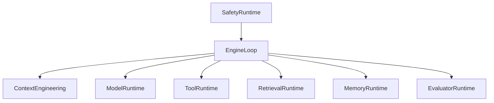
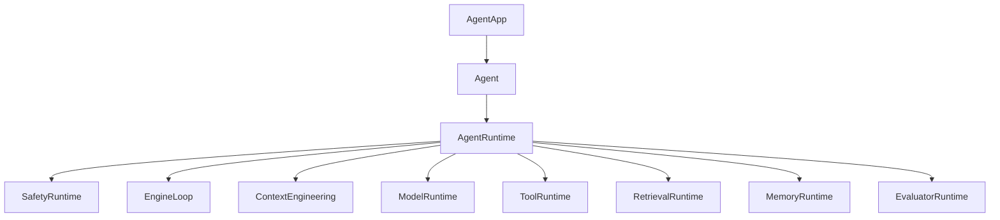
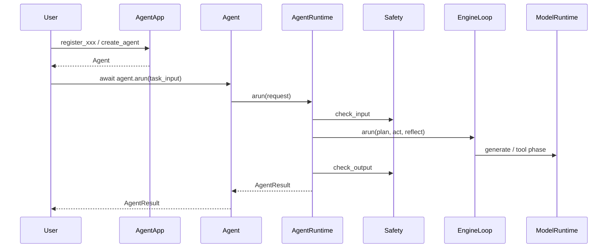

# 《从0到1工业级Agent框架打造》第十二章：AgentApp 主入口、Agent 实例门面与 AgentRuntime 编排层

---

## 目标

1. 提供 `AgentApp` 作为推荐主入口，让用户可以先注册模型、工具、记忆、检索等共享能力。
2. 提供 `Agent` 作为单个智能体的用户门面，支持 `await agent.arun(...)` 和继承扩展。
3. 提供 `AgentRuntime` 作为内部编排层，把 `Safety`、`EngineLoop`、`ToolRuntime`、`Retrieval`、`Memory` 和 `Evaluator` 串成一条真实主链路。

**本章在整体架构中的定位：**

* 所属层级：应用装配层与运行时门面层。
* 解决缺口：前面 11 章已有组件，但还缺一个给读者直接使用的统一入口。
* 引入时机：只有当 Tool、Memory、Safety 等组件的真实契约已经稳定之后，才值得把它们绑成一个用户主入口。

---

## 架构位置说明

### 当前系统结构回顾



在前 11 章里，我们已经知道组件怎么工作，但用户仍然缺一个“怎么组装这些组件”的入口。

### 本章新增后的结构



* `AgentApp` 只做注册和装配。
* `Agent` 只做用户门面和扩展点。
* `AgentRuntime` 只做编排。
* `EngineLoop` 保持可替换，但不能破坏 protocol 契约。

---

## 前置条件

1. Python >= 3.11
2. ??? `uv`
3. 已完成第十一章 Safety Layer
4. 在仓库根目录执行命令

**环境复用验证命令：**

```bash
uv run --no-sync pytest -q
```

```powershell
uv run --no-sync pytest -q
```

---

## 本章主线改动范围

### 代码目录

* `src/agent_forge/runtime/`
* `src/agent_forge/__init__.py`
* `examples/agent/`

### 测试目录

* `tests/unit/test_agent.py`
* `tests/unit/test_agent_runtime.py`
* `tests/unit/test_agent_app.py`
* `tests/unit/test_agent_demo.py`
* `tests/unit/test_agent_app_demo.py`

### 本章涉及的真实文件

* [src/agent_forge/runtime/__init__.py](../../src/agent_forge/runtime/__init__.py)
* [src/agent_forge/__init__.py](../../src/agent_forge/__init__.py)
* [src/agent_forge/runtime/app.py](../../src/agent_forge/runtime/app.py)
* [src/agent_forge/runtime/schemas.py](../../src/agent_forge/runtime/schemas.py)
* [src/agent_forge/runtime/defaults.py](../../src/agent_forge/runtime/defaults.py)
* [src/agent_forge/runtime/runtime.py](../../src/agent_forge/runtime/runtime.py)
* [src/agent_forge/runtime/agent.py](../../src/agent_forge/runtime/agent.py)
* [examples/agent/agent_demo.py](../../examples/agent/agent_demo.py)
* [examples/agent/agent_app_demo.py](../../examples/agent/agent_app_demo.py)
* [tests/unit/test_agent.py](../../tests/unit/test_agent.py)
* [tests/unit/test_agent_runtime.py](../../tests/unit/test_agent_runtime.py)
* [tests/unit/test_agent_app.py](../../tests/unit/test_agent_app.py)
* [tests/unit/test_agent_demo.py](../../tests/unit/test_agent_demo.py)
* [tests/unit/test_agent_app_demo.py](../../tests/unit/test_agent_app_demo.py)

---

## 实施步骤

### 第 1 步：先看主流程（先讲“面”）



`AgentApp -> Agent -> AgentRuntime -> EngineLoop` 是本章最重要的主线。

### 第 2 步：导出运行时入口

文件：[src/agent_forge/runtime/__init__.py](../../src/agent_forge/runtime/__init__.py)

```bash
touch src/agent_forge/runtime/__init__.py
```

```powershell
New-Item -ItemType File -Force src/agent_forge/runtime/__init__.py | Out-Null
```

```python
"""公开 Agent 运行时层的顶层导出。"""

from agent_forge.runtime.agent import Agent
from agent_forge.runtime.app import AgentApp, AgentAppTool
from agent_forge.runtime.runtime import AgentRuntime, build_default_agent_runtime
from agent_forge.runtime.schemas import AgentConfig, AgentResult, AgentRunRequest

__all__ = [
    "Agent",
    "AgentApp",
    "AgentAppTool",
    "AgentConfig",
    "AgentResult",
    "AgentRunRequest",
    "AgentRuntime",
    "build_default_agent_runtime",
]

```

文件：[src/agent_forge/__init__.py](../../src/agent_forge/__init__.py)

```bash
touch src/agent_forge/__init__.py
```

```powershell
New-Item -ItemType File -Force src/agent_forge/__init__.py | Out-Null
```

```python
"""agent_forge framework package."""

from agent_forge.runtime import Agent, AgentApp, AgentAppTool, AgentConfig, AgentResult, AgentRunRequest, AgentRuntime, build_default_agent_runtime

__all__ = [
    "Agent",
    "AgentApp",
    "AgentAppTool",
    "AgentConfig",
    "AgentResult",
    "AgentRunRequest",
    "AgentRuntime",
    "build_default_agent_runtime",
]

```

### 代码讲解

* \u8bbe\u8ba1\u52a8\u673a\uff1a\u5bf9\u5916\u7edf\u4e00\u5bfc\u51fa `AgentApp`\u3001`Agent` \u548c `AgentRuntime`。
* \u8fb9\u754c\u4e0e\u5931\u8d25\uff1a\u5fd8\u8bb0\u5bfc\u51fa\u540e，README 和 demo \u4f1a\u76f4\u63a5\u5931\u6548。

### 第 3 步：定义 Agent 协议对象

文件：[src/agent_forge/runtime/schemas.py](../../src/agent_forge/runtime/schemas.py)

```bash
touch src/agent_forge/runtime/schemas.py
```

```powershell
New-Item -ItemType File -Force src/agent_forge/runtime/schemas.py | Out-Null
```

```python
"""Agent 入口层的公共配置与请求/响应模型。"""

from __future__ import annotations

from typing import Any, Literal
from uuid import uuid4

from pydantic import BaseModel, Field

from agent_forge.components.protocol import ErrorInfo, FinalAnswer


class AgentConfig(BaseModel):
    """定义 `Agent` 与 `AgentRuntime` 的默认运行配置。"""

    config_version: str = Field(default="v1", min_length=1, description="配置版本号。")
    default_principal: str = Field(default="agent", min_length=1, description="默认执行主体。")
    session_id_prefix: str = Field(default="session", min_length=1, description="自动生成 session_id 时使用的前缀。")
    default_model: str = Field(default="agent-default-stub", min_length=1, description="默认模型名。")
    tool_version: str = Field(default="tool-runtime-v1", min_length=1, description="工具运行时版本。")
    policy_version: str = Field(default="v1", min_length=1, description="安全策略版本。")
    enable_evaluator_by_default: bool = Field(default=False, description="是否默认开启评测。")


class AgentRunRequest(BaseModel):
    """统一封装一次 Agent 运行所需的输入。"""

    task_input: str = Field(..., min_length=1, description="用户任务输入。")
    session_id: str | None = Field(default=None, description="会话 ID；为空时由运行时自动生成。")
    trace_id: str | None = Field(default=None, description="链路追踪 ID。")
    principal: str | None = Field(default=None, description="本次运行的主体标识。")
    capabilities: set[str] | None = Field(default=None, description="本次运行允许的能力集合。")
    context: dict[str, Any] = Field(default_factory=dict, description="额外上下文字段。")
    tenant_id: str | None = Field(default=None, description="租户 ID。")
    user_id: str | None = Field(default=None, description="用户 ID。")
    evaluate: bool | None = Field(default=None, description="是否开启评测。")
    metadata: dict[str, Any] = Field(default_factory=dict, description="附加元数据。")


class AgentResult(BaseModel):
    """定义 `Agent` 对外返回的稳定结果结构。"""

    status: Literal["success", "partial", "failed", "blocked"] = Field(..., description="本次运行状态。")
    summary: str = Field(..., min_length=1, description="面向调用方的摘要。")
    output: dict[str, Any] = Field(default_factory=dict, description="结构化输出载荷。")
    session_id: str = Field(..., min_length=1, description="本次运行所属的 session_id。")
    trace_id: str = Field(..., min_length=1, description="本次运行的 trace_id。")
    references: list[str] = Field(default_factory=list, description="引用来源。")
    safety: dict[str, Any] = Field(default_factory=dict, description="输入/输出安全审查摘要。")
    error: ErrorInfo | None = Field(default=None, description="失败时的结构化错误。")
    final_answer: FinalAnswer | None = Field(default=None, description="原始 FinalAnswer。")
    evaluation: dict[str, Any] | None = Field(default=None, description="可选评测结果。")
    metadata: dict[str, Any] = Field(default_factory=dict, description="运行附加统计。")


def build_generated_session_id(prefix: str) -> str:
    """生成统一格式的 session_id。"""

    return f"{prefix}_{uuid4().hex}"

```

### 代码讲解

* \u8bbe\u8ba1\u52a8\u673a\uff1a\u7528 `AgentRunRequest` \u548c `AgentResult` \u6536\u53e3\u7528\u6237\u8f93\u5165\u548c\u6700\u7ec8\u8f93\u51fa。
* \u5de5\u7a0b\u53d6\u820d\uff1a\u4e0d\u76f4\u63a5\u66b4\u9732 `AgentState`，\u4f18\u5148\u7a33\u5b9a\u7528\u6237\u7ed3\u679c\u9762。

### 第 4 步：构建默认装配工厂

文件：[src/agent_forge/runtime/defaults.py](../../src/agent_forge/runtime/defaults.py)

```bash
touch src/agent_forge/runtime/defaults.py
```

```powershell
New-Item -ItemType File -Force src/agent_forge/runtime/defaults.py | Out-Null
```

```python
"""`Agent()` 与 `AgentApp()` 使用的默认装配实现。"""

from __future__ import annotations

import json
import time
from collections.abc import Iterator
from typing import Any

from agent_forge.components.model_runtime import (
    ModelRequest,
    ModelResponse,
    ModelRuntime,
    ModelStats,
    ModelStreamEvent,
    ProviderAdapter,
)
from agent_forge.components.observability import ObservabilityRuntime
from agent_forge.components.safety import SafetyRuntime, SafetyToolRuntimeHook
from agent_forge.components.tool_runtime import ToolRuntime
from agent_forge.runtime.schemas import AgentConfig


class DefaultAgentAdapter(ProviderAdapter):
    """默认本地模型适配器。

    设计意图：
    1. 保证 `Agent()` 和 `AgentApp()` 在没有外部模型时也能跑通主链路。
    2. 返回稳定的结构化 JSON，便于教程和测试复现。
    3. 这里只提供最小本地桩，不承担真实生产模型能力。
    """

    def generate(self, request: ModelRequest, **kwargs: Any) -> ModelResponse:
        """生成一条结构化模型响应。"""

        _ = kwargs
        # 1. 先从请求消息中抽取最近一次用户输入。
        task_input = _extract_task_input(request)
        # 2. 构造稳定的本地桩输出，保证主链路始终返回合法 JSON。
        content = json.dumps(
            {
                "summary": f"已处理任务：{task_input[:32]}",
                "output": {
                    "answer": f"这是默认本地模型返回的演示答案：{task_input}",
                    "task_input": task_input,
                },
                "references": ["runtime:default-local-adapter"],
            },
            ensure_ascii=False,
        )
        # 3. 返回标准 ModelResponse，交由 AgentRuntime 继续解析与编排。
        return ModelResponse(
            content=content,
            stats=ModelStats(
                prompt_tokens=max(1, len(task_input) // 4),
                completion_tokens=48,
                total_tokens=max(1, len(task_input) // 4) + 48,
                latency_ms=12,
                cost_usd=0.0,
            ),
        )

    def generate_stream(self, request: ModelRequest, **kwargs: Any) -> Iterator[ModelStreamEvent]:
        """输出与 `generate(...)` 对应的演示流式事件。"""

        # 1. 先复用同步生成逻辑，保证流式和非流式内容一致。
        response = self.generate(request, **kwargs)
        request_id = request.request_id or f"req_default_{int(time.time() * 1000)}"
        now_ms = int(time.time() * 1000)
        # 2. 按 start -> delta -> usage -> end 的稳定顺序输出事件。
        yield ModelStreamEvent(event_type="start", request_id=request_id, sequence=0, timestamp_ms=now_ms)
        index = 0
        for index, offset in enumerate(range(0, len(response.content), 16), start=1):
            yield ModelStreamEvent(
                event_type="delta",
                request_id=request_id,
                sequence=index,
                delta=response.content[offset : offset + 16],
                timestamp_ms=int(time.time() * 1000),
            )
        yield ModelStreamEvent(
            event_type="usage",
            request_id=request_id,
            sequence=index + 1 if response.content else 1,
            stats=response.stats,
            timestamp_ms=int(time.time() * 1000),
        )
        yield ModelStreamEvent(
            event_type="end",
            request_id=request_id,
            sequence=index + 2 if response.content else 2,
            content=response.content,
            stats=response.stats,
            timestamp_ms=int(time.time() * 1000),
            metadata={"status": "ok"},
        )


def build_default_model_runtime() -> ModelRuntime:
    """构造默认本地模型运行时。"""

    return ModelRuntime(adapter=DefaultAgentAdapter())


def build_default_observability_runtime() -> ObservabilityRuntime:
    """构造默认观测运行时。"""

    return ObservabilityRuntime()


def build_default_tool_runtime(
    *,
    safety_runtime: SafetyRuntime,
    observability_runtime: ObservabilityRuntime,
) -> ToolRuntime:
    """构造默认工具运行时。

    设计边界：
    1. 默认挂入观测 hook，保留工具执行轨迹。
    2. 默认挂入安全 hook，保证工具前置审查生效。
    """

    # 1. 先创建带观测 hook 的 ToolRuntime。
    tool_runtime = ToolRuntime(hooks=[observability_runtime.build_tool_hook()])
    # 2. 再注册安全 hook，确保工具执行前会经过安全审查。
    tool_runtime.register_hook(
        SafetyToolRuntimeHook(
            safety_runtime,
            spec_resolver=tool_runtime.get_tool_spec,
            capability_resolver=lambda _principal: set(),
        )
    )
    return tool_runtime


def build_default_agent_config() -> AgentConfig:
    """构造默认 Agent 配置。"""

    return AgentConfig()


def _extract_task_input(request: ModelRequest) -> str:
    """从模型请求中提取最近一次用户输入。"""

    # 1. 优先取最近的 user 消息，保持与真实对话语义一致。
    for message in reversed(request.messages):
        if message.role == "user" and message.content.strip():
            return message.content.strip()
    # 2. 如果没有 user 消息，就退回最后一条消息内容。
    return request.messages[-1].content.strip() if request.messages else ""

```

### 代码讲解

* \u8bbe\u8ba1\u52a8\u673a\uff1a\u8ba9 `Agent()` \u548c `AgentApp()` \u90fd\u80fd\u5728\u6ca1\u6709 provider \u7684\u60c5\u51b5\u4e0b\u5148\u95ed\u73af\u8fd0\u884c。
* \u8fb9\u754c\u4e0e\u5931\u8d25\uff1a\u9ed8\u8ba4\u88c5\u914d\u4e0d\u80fd\u7ed5\u8fc7 Safety \u548c Observability。

### 第 5 步：实现 `AgentRuntime` 主编排层

文件：[src/agent_forge/runtime/runtime.py](../../src/agent_forge/runtime/runtime.py)

```bash
touch src/agent_forge/runtime/runtime.py
```

```powershell
New-Item -ItemType File -Force src/agent_forge/runtime/runtime.py | Out-Null
```

```python
"""`AgentRuntime` 编排层。"""

from __future__ import annotations

import asyncio
import json
from typing import Any
from uuid import uuid4

from agent_forge.components.context_engineering import ContextEngineeringRuntime
from agent_forge.components.context_engineering.domain import CitationItem
from agent_forge.components.engine import EngineLimits, EngineLoop, ExecutionPlan, PlanStep, ReflectDecision, RunContext, StepOutcome
from agent_forge.components.evaluator import EvaluationRequest, EvaluatorRuntime
from agent_forge.components.memory import MemoryReadQuery, MemoryWriteRequest, to_context_messages
from agent_forge.components.model_runtime import ModelRequest, ModelResponse, ModelRuntime
from agent_forge.components.observability import ObservabilityRuntime
from agent_forge.components.protocol import AgentMessage, AgentState, ErrorInfo, ExecutionEvent, FinalAnswer, ToolCall, ToolResult, build_initial_state
from agent_forge.components.retrieval import RetrievalQuery, RetrievalRuntime
from agent_forge.components.safety import SafetyCheckRequest, SafetyRuntime, apply_output_safety
from agent_forge.components.tool_runtime import ToolRuntime
from agent_forge.runtime.defaults import build_default_agent_config, build_default_model_runtime, build_default_observability_runtime, build_default_tool_runtime
from agent_forge.runtime.schemas import AgentConfig, AgentResult, AgentRunRequest, build_generated_session_id


class AgentRuntime:
    """统一串联 Safety、Memory、Retrieval、Tool、Model 与 Engine 的编排器。"""

    def __init__(
        self,
        *,
        config: AgentConfig | None = None,
        model_name: str | None = None,
        engine_loop: EngineLoop | None = None,
        model_runtime: ModelRuntime | None = None,
        safety_runtime: SafetyRuntime | None = None,
        tool_runtime: ToolRuntime | None = None,
        context_runtime: ContextEngineeringRuntime | None = None,
        retrieval_runtime: RetrievalRuntime | None = None,
        memory_runtime: Any | None = None,
        evaluator_runtime: EvaluatorRuntime | None = None,
        observability_runtime: ObservabilityRuntime | None = None,
    ) -> None:
        """初始化 `AgentRuntime`。"""

        self.config = config or build_default_agent_config()
        self.observability_runtime = observability_runtime or build_default_observability_runtime()
        self.safety_runtime = safety_runtime or SafetyRuntime()
        self.tool_runtime = tool_runtime or build_default_tool_runtime(
            safety_runtime=self.safety_runtime,
            observability_runtime=self.observability_runtime,
        )
        self.context_runtime = context_runtime or ContextEngineeringRuntime()
        self.model_runtime = model_runtime or build_default_model_runtime()
        self.model_name = model_name or self.config.default_model
        self.engine_loop = engine_loop or EngineLoop(
            limits=EngineLimits(),
            event_listener=self.observability_runtime.engine_event_listener,
        )
        self.retrieval_runtime = retrieval_runtime
        self.memory_runtime = memory_runtime
        self.evaluator_runtime = evaluator_runtime

    async def arun(self, request: AgentRunRequest) -> AgentResult:
        """异步执行一条 Agent 主链路。"""

        # 1. 规范化请求，并初始化协议状态。
        normalized = self._normalize_request(request)
        state = self._build_initial_state(normalized)
        self.observability_runtime.set_default_context(trace_id=state.trace_id, run_id=state.run_id)

        # 2. 先做输入安全检查，命中阻断就直接返回统一 blocked 结果。
        input_decision = self.safety_runtime.check_input(
            SafetyCheckRequest(
                stage="input",
                task_input=normalized.task_input,
                trace_id=state.trace_id,
                run_id=state.run_id,
                context=normalized.context,
            )
        )
        if not input_decision.allowed:
            return self._build_blocked_result(normalized=normalized, state=state, decision=input_decision)

        # 3. 读取 memory 并注入上下文，再把用户输入写入对话状态。
        memory_context = self._maybe_read_memory(normalized)
        state.messages.append(AgentMessage(role="user", content=normalized.task_input, metadata={"source": "agent"}))

        async def _runtime_act_fn(current_state: AgentState, step: PlanStep, step_idx: int) -> StepOutcome:
            return await self._act_step(
                request=normalized,
                state=current_state,
                step=step,
                step_idx=step_idx,
                memory_messages=memory_context["messages"],
            )

        # 4. 委托 EngineLoop 驱动 plan -> act -> reflect。
        updated_state = await self.engine_loop.arun(
            state,
            plan_fn=lambda current_state: self._build_plan(request=normalized, state=current_state),
            act_fn=_runtime_act_fn,
            reflect_fn=self._reflect_step,
            context=self._build_run_context(normalized),
        )

        # 5. 汇总最终答案，并执行输出安全审查。
        final_answer = self._build_final_answer(normalized=normalized, state=updated_state)
        output_decision = self.safety_runtime.check_output(
            SafetyCheckRequest(
                stage="output",
                final_answer=final_answer,
                trace_id=updated_state.trace_id,
                run_id=updated_state.run_id,
                context=normalized.context,
            )
        )
        safe_answer = apply_output_safety(final_answer, output_decision)
        updated_state.final_answer = safe_answer

        # 6. 在安全输出基础上做评测和 memory 写回。
        evaluation = self._evaluate_if_needed(normalized=normalized, state=updated_state)
        memory_write = self._maybe_write_memory(normalized=normalized, state=updated_state)

        # 7. 收口成统一 `AgentResult`。
        return self._build_success_result(
            normalized=normalized,
            state=updated_state,
            final_answer=safe_answer,
            input_decision=input_decision,
            output_decision=output_decision,
            evaluation=evaluation,
            memory_read=memory_context,
            memory_write=memory_write,
        )

    def run(self, request: AgentRunRequest) -> AgentResult:
        """同步包装器。"""

        try:
            asyncio.get_running_loop()
        except RuntimeError:
            return asyncio.run(self.arun(request))
        raise RuntimeError("检测到运行中的事件循环，请改用 `await AgentRuntime.arun(...)`。")

    def _normalize_request(self, request: AgentRunRequest) -> AgentRunRequest:
        session_id = request.session_id or build_generated_session_id(self.config.session_id_prefix)
        principal = request.principal or self.config.default_principal
        evaluate = self.config.enable_evaluator_by_default if request.evaluate is None else request.evaluate
        return request.model_copy(
            update={
                "session_id": session_id,
                "principal": principal,
                "evaluate": evaluate,
                "context": dict(request.context),
                "metadata": dict(request.metadata),
            }
        )

    def _build_initial_state(self, request: AgentRunRequest) -> AgentState:
        state = build_initial_state(request.session_id or build_generated_session_id(self.config.session_id_prefix))
        if request.trace_id:
            state.trace_id = request.trace_id
        return state

    def _build_run_context(self, request: AgentRunRequest) -> RunContext:
        return RunContext(
            tenant_id=request.tenant_id,
            user_id=request.user_id,
            config_version=self.config.config_version,
            model_version=self.model_name,
            tool_version=self.config.tool_version,
            policy_version=self.config.policy_version,
        )

    def _build_plan(self, request: AgentRunRequest, state: AgentState) -> ExecutionPlan:
        _ = state
        return ExecutionPlan(
            global_task=request.task_input,
            success_criteria=["完成用户任务", "保留 trace/session 信息", "返回结构化最终答案"],
            constraints=["遵守安全策略", "如有工具必须经 ToolRuntime 执行", "输出必须经过输出安全审查"],
            metadata={"runtime": "agent_runtime"},
            steps=[PlanStep(key="answer_user_task", name="answer-user-task", kind="generate_answer", payload={"task_input": request.task_input})],
        )

    async def _act_step(
        self,
        *,
        request: AgentRunRequest,
        state: AgentState,
        step: PlanStep,
        step_idx: int,
        memory_messages: list[AgentMessage],
    ) -> StepOutcome:
        _ = step_idx
        if step.kind != "generate_answer":
            return StepOutcome(status="error", output={}, error=ErrorInfo(error_code="UNKNOWN_STEP_KIND", error_message=f"未知 step.kind: {step.kind}", retryable=False))

        try:
            retrieval_result = self._maybe_retrieve(request)
            bundle = self.context_runtime.build_bundle(
                system_prompt=self._build_system_prompt(request),
                developer_prompt=self._build_developer_prompt(request),
                messages=[*memory_messages, *state.messages],
                citations=retrieval_result["citations"],
                tools=self._build_tool_definitions(),
            )
            response = await self._call_model(self._build_model_request(request=request, state=state, bundle=bundle, allow_tools=True))
            tool_phase = await self._run_tool_phase(request=request, state=state, response=response)
            if tool_phase["error"] is not None:
                return StepOutcome(status="error", output={}, error=tool_phase["error"])

            final_response = response
            if tool_phase["used_tools"]:
                final_bundle = self.context_runtime.build_bundle(
                    system_prompt=self._build_system_prompt(request),
                    developer_prompt=self._build_developer_prompt(request),
                    messages=[*memory_messages, *state.messages],
                    citations=retrieval_result["citations"],
                )
                final_response = await self._call_model(
                    self._build_model_request(request=request, state=state, bundle=final_bundle, allow_tools=False)
                )

            payload = self._extract_response_payload(final_response)
            references = self._merge_references(payload.get("references") or [], retrieval_result["references"], tool_phase["references"])
            summary = str(payload.get("summary") or "模型未返回摘要。")
            output = payload.get("output") or {}
            if not isinstance(output, dict):
                output = {"raw": output}

            state.messages.append(
                AgentMessage(
                    role="assistant",
                    content=summary,
                    metadata={
                        "agent_output": output,
                        "references": references,
                        "model_stats": final_response.stats.model_dump(),
                    },
                )
            )
            state.events.append(
                self._build_state_update_event(
                    state=state,
                    step_id=f"agent_step_{step.key}",
                    payload={
                        "phase": "agent_runtime_model_response",
                        "step_key": step.key,
                        "step_name": step.name,
                        "references": references,
                        "used_tools": tool_phase["used_tools"],
                    },
                )
            )
            return StepOutcome(status="ok", output={"summary": summary, "output": output, "references": references})
        except Exception as exc:  # noqa: BLE001
            return StepOutcome(status="error", output={}, error=ErrorInfo(error_code="AGENT_STEP_FAILED", error_message=str(exc), retryable=False))

    def _reflect_step(self, state: AgentState, step: PlanStep, step_idx: int, outcome: StepOutcome) -> ReflectDecision:
        _ = state
        _ = step
        _ = step_idx
        if outcome.status == "ok":
            return ReflectDecision(action="continue", reason="当前 step 已成功完成。")
        if outcome.error and outcome.error.retryable:
            return ReflectDecision(action="retry", reason="step 失败但可重试。")
        return ReflectDecision(action="abort", reason="step 失败且不可重试。")

    def _build_model_request(self, *, request: AgentRunRequest, state: AgentState, bundle: Any, allow_tools: bool) -> ModelRequest:
        _ = state
        return ModelRequest(
            messages=bundle.messages,
            system_prompt=bundle.system_prompt,
            model=self.model_name,
            response_schema={
                "type": "object",
                "properties": {
                    "summary": {"type": "string"},
                    "output": {"type": "object"},
                    "references": {"type": "array", "items": {"type": "string"}},
                },
                "required": ["summary", "output"],
            },
            tools=bundle.tools if allow_tools and bundle.tools else None,
            request_id=f"agent_run_{request.session_id}_{'tools' if allow_tools else 'final'}",
        )

    def _build_system_prompt(self, request: AgentRunRequest) -> str:
        _ = request
        return "你是一个注重结构化输出、可追踪引用和安全边界的 Agent。"

    def _build_developer_prompt(self, request: AgentRunRequest) -> str | None:
        _ = request
        return "请优先返回结构化 JSON；如使用工具，先根据工具结果再给最终答案。"

    def _build_final_answer(self, *, normalized: AgentRunRequest, state: AgentState) -> FinalAnswer:
        assistant_messages = [message for message in state.messages if message.role == "assistant"]
        latest = assistant_messages[-1] if assistant_messages else None
        if latest is None:
            return FinalAnswer(status="failed", summary="Agent 未能产出最终 assistant 消息。", output={"task_input": normalized.task_input}, references=[])

        answer_output = latest.metadata.get("agent_output", {}) if isinstance(latest.metadata, dict) else {}
        references = latest.metadata.get("references", []) if isinstance(latest.metadata, dict) else []
        if not isinstance(answer_output, dict):
            answer_output = {"raw": answer_output}
        if not isinstance(references, list):
            references = []
        return FinalAnswer(
            status="success",
            summary=latest.content,
            output=answer_output,
            artifacts=[{"type": "agent_message", "name": "default_answer"}],
            references=[str(item) for item in references],
        )

    def _evaluate_if_needed(self, *, normalized: AgentRunRequest, state: AgentState) -> dict[str, Any] | None:
        if not normalized.evaluate or self.evaluator_runtime is None or state.final_answer is None:
            return None
        result = self.evaluator_runtime.evaluate(
            EvaluationRequest(final_answer=state.final_answer, events=state.events, trace_id=state.trace_id, run_id=state.run_id)
        )
        return result.model_dump()

    def _maybe_retrieve(self, request: AgentRunRequest) -> dict[str, list[Any]]:
        if self.retrieval_runtime is None:
            return {"citations": [], "references": []}
        retrieval_query = request.context.get("retrieval_query")
        if not isinstance(retrieval_query, str) or not retrieval_query.strip():
            return {"citations": [], "references": []}
        result = self.retrieval_runtime.search(RetrievalQuery(query_text=retrieval_query.strip()))
        citations = [
            CitationItem(
                source_id=item.document_id,
                title=item.title or item.document_id,
                url=item.source_uri or f"retrieval://{item.document_id}",
                snippet=item.snippet,
                score=item.score,
            )
            for item in result.citations
        ]
        return {"citations": citations, "references": [f"retrieval:{item.document_id}" for item in result.citations]}

    def _maybe_read_memory(self, request: AgentRunRequest) -> dict[str, Any]:
        # 1. 未配置 memory 时，直接返回空结果。
        if self.memory_runtime is None:
            return {"messages": [], "read_count": 0, "enabled": False}
        # 2. 缺少租户或用户身份时不启用 memory，避免跨用户污染。
        if not request.tenant_id or not request.user_id:
            return {"messages": [], "read_count": 0, "enabled": False}
        # 3. 读取 memory，并转换成可注入模型上下文的消息。
        memory_query = request.context.get("memory_query") or request.task_input
        top_k = request.context.get("memory_top_k", 5)
        if not isinstance(top_k, int) or top_k < 1:
            top_k = 5
        result = self.memory_runtime.read(
            MemoryReadQuery(
                tenant_id=request.tenant_id,
                user_id=request.user_id,
                session_id=request.session_id,
                scope=None,
                top_k=top_k,
                query_text=str(memory_query),
            )
        )
        messages = to_context_messages(result)
        return {"messages": messages, "read_count": len(result.records), "enabled": True, "read_trace": result.read_trace}

    def _maybe_write_memory(self, *, normalized: AgentRunRequest, state: AgentState) -> dict[str, Any]:
        # 1. 未配置 memory、缺少隔离键，或 final_answer 失败时都跳过写回。
        if self.memory_runtime is None or state.final_answer is None:
            return {"write_count": 0, "enabled": False}
        if not normalized.tenant_id or not normalized.user_id:
            return {"write_count": 0, "enabled": False}
        if state.final_answer.status == "failed":
            return {"write_count": 0, "enabled": False, "skipped_reason": "final_answer_failed"}

        # 2. 先写 finish，总结最终答案；如果存在成功工具结果，再补写 fact。
        finish_result = self.memory_runtime.write(
            MemoryWriteRequest(
                tenant_id=normalized.tenant_id,
                user_id=normalized.user_id,
                session_id=normalized.session_id,
                trigger="finish",
                agent_state=state,
                final_answer=state.final_answer,
                messages=state.messages,
                tool_results=state.tool_results,
                metadata=dict(normalized.metadata),
                trace_id=state.trace_id,
                run_id=state.run_id,
            )
        )
        finish_written_count = self._memory_write_total(finish_result)
        fact_written_count = 0
        successful_tool_results = [item for item in state.tool_results if item.status == "ok"]
        if successful_tool_results:
            fact_result = self.memory_runtime.write(
                MemoryWriteRequest(
                    tenant_id=normalized.tenant_id,
                    user_id=normalized.user_id,
                    session_id=normalized.session_id,
                    trigger="fact",
                    agent_state=state,
                    final_answer=state.final_answer,
                    messages=state.messages,
                    tool_results=successful_tool_results,
                    metadata=dict(normalized.metadata),
                    trace_id=state.trace_id,
                    run_id=state.run_id,
                )
            )
            fact_written_count = self._memory_write_total(fact_result)
        return {
            "enabled": True,
            "write_count": finish_written_count + fact_written_count,
            "finish_write_count": finish_written_count,
            "fact_write_count": fact_written_count,
        }

    async def _call_model(self, request: ModelRequest) -> ModelResponse:
        return await asyncio.to_thread(self.model_runtime.generate, request)

    async def _run_tool_phase(self, *, request: AgentRunRequest, state: AgentState, response: ModelResponse) -> dict[str, Any]:
        if not response.tool_calls:
            return {"used_tools": False, "references": [], "error": None}

        references: list[str] = []
        for raw_call in response.tool_calls:
            tool_call = self._normalize_tool_call(request=request, state=state, tool_call=raw_call)
            state.tool_calls.append(tool_call)
            state.events.append(self._build_tool_call_event(state=state, tool_call=tool_call))

            result = await self.tool_runtime.execute_async(tool_call, principal=request.principal, capabilities=request.capabilities)
            state.tool_results.append(result)
            state.events.append(self._build_tool_result_event(state=state, tool_call=tool_call, result=result))
            state.messages.append(self._build_tool_message(tool_call=tool_call, result=result))
            references.append(f"tool:{tool_call.tool_name}:{tool_call.tool_call_id}")
            if result.status != "ok":
                error = result.error or ErrorInfo(
                    error_code="AGENT_TOOL_FAILED",
                    error_message=f"工具执行失败: {tool_call.tool_name}",
                    retryable=False,
                )
                return {"used_tools": True, "references": references, "error": error}
        return {"used_tools": True, "references": references, "error": None}

    def _build_tool_definitions(self) -> list[dict[str, Any]]:
        return [spec.model_dump() for spec in self.tool_runtime.list_tool_specs()]

    def _extract_response_payload(self, response: ModelResponse) -> dict[str, Any]:
        if response.parsed_output is not None:
            return dict(response.parsed_output)
        content = response.content.strip()
        if not content:
            return {}
        try:
            parsed = json.loads(content)
        except json.JSONDecodeError:
            parsed = None
        if isinstance(parsed, dict):
            return parsed
        if parsed is not None:
            return {"summary": str(parsed), "output": {"raw": parsed}}
        return {"summary": content, "output": {"raw_text": content}}

    def _normalize_tool_call(self, *, request: AgentRunRequest, state: AgentState, tool_call: ToolCall) -> ToolCall:
        base_tool_call_id = tool_call.tool_call_id or f"tool_call_{uuid4().hex}"
        tool_call_id = f"{state.run_id}:{base_tool_call_id}"
        return tool_call.model_copy(update={"tool_call_id": tool_call_id, "principal": request.principal or self.config.default_principal})

    def _memory_write_total(self, result: Any) -> int:
        structured_count = int(getattr(result, "structured_written_count", 0) or 0)
        vector_count = int(getattr(result, "vector_written_count", 0) or 0)
        if structured_count or vector_count:
            return structured_count + vector_count
        return len(getattr(result, "records", []) or [])

    def _build_tool_message(self, *, tool_call: ToolCall, result: ToolResult) -> AgentMessage:
        if result.status == "ok":
            content = f"tool_result[{tool_call.tool_name}]: {result.output}"
        else:
            content = f"tool_error[{tool_call.tool_name}]: {result.error.error_message if result.error else 'unknown error'}"
        return AgentMessage(
            role="tool",
            content=content,
            metadata={
                "tool_call_id": tool_call.tool_call_id,
                "tool_name": tool_call.tool_name,
                "tool_status": result.status,
                "tool_output": result.output,
            },
        )

    def _merge_references(self, *groups: list[Any]) -> list[str]:
        merged: list[str] = []
        seen: set[str] = set()
        for group in groups:
            for item in group:
                normalized = str(item)
                if normalized in seen:
                    continue
                seen.add(normalized)
                merged.append(normalized)
        return merged

    def _build_blocked_result(self, *, normalized: AgentRunRequest, state: AgentState, decision: Any) -> AgentResult:
        blocked_reason = decision.reason or "输入被安全策略阻断。"
        error = ErrorInfo(error_code="AGENT_INPUT_BLOCKED", error_message=blocked_reason, retryable=False)
        return AgentResult(
            status="blocked",
            summary=blocked_reason,
            output={"message": blocked_reason, "safety_action": decision.action},
            session_id=state.session_id,
            trace_id=state.trace_id,
            safety={"input": decision.model_dump()},
            error=error,
            metadata={"principal": normalized.principal, "blocked_stage": "input"},
        )

    def _build_success_result(
        self,
        *,
        normalized: AgentRunRequest,
        state: AgentState,
        final_answer: FinalAnswer,
        input_decision: Any,
        output_decision: Any,
        evaluation: dict[str, Any] | None,
        memory_read: dict[str, Any] | None = None,
        memory_write: dict[str, Any] | None = None,
    ) -> AgentResult:
        status = "success"
        if final_answer.status == "partial":
            status = "partial"
        elif final_answer.status == "failed":
            status = "failed"
        memory_read = memory_read or {}
        memory_write = memory_write or {}
        terminal_error = self._extract_terminal_error(state) if status == "failed" else None
        return AgentResult(
            status=status,
            summary=final_answer.summary,
            output=final_answer.output,
            session_id=state.session_id,
            trace_id=state.trace_id,
            references=final_answer.references,
            safety={"input": input_decision.model_dump(), "output": output_decision.model_dump()},
            error=terminal_error,
            final_answer=final_answer,
            evaluation=evaluation,
            metadata={
                "principal": normalized.principal,
                "capabilities": sorted(normalized.capabilities or []),
                "event_count": len(state.events),
                "tool_records": len(state.tool_results),
                "memory_read_count": int(memory_read.get("read_count", 0)),
                "memory_write_count": int(memory_write.get("write_count", 0)),
            },
        )

    def _extract_terminal_error(self, state: AgentState) -> ErrorInfo | None:
        for event in reversed(state.events):
            if event.error is not None:
                return event.error
        return None

    def _build_state_update_event(self, *, state: AgentState, step_id: str, payload: dict[str, Any]) -> ExecutionEvent:
        return ExecutionEvent(trace_id=state.trace_id, run_id=state.run_id, step_id=step_id, event_type="state_update", payload=payload)

    def _build_tool_call_event(self, *, state: AgentState, tool_call: ToolCall) -> ExecutionEvent:
        return ExecutionEvent(
            trace_id=state.trace_id,
            run_id=state.run_id,
            step_id=tool_call.tool_call_id,
            event_type="tool_call",
            payload={"tool_name": tool_call.tool_name, "args": tool_call.args, "principal": tool_call.principal},
        )

    def _build_tool_result_event(self, *, state: AgentState, tool_call: ToolCall, result: ToolResult) -> ExecutionEvent:
        return ExecutionEvent(
            trace_id=state.trace_id,
            run_id=state.run_id,
            step_id=tool_call.tool_call_id,
            event_type="tool_result",
            payload={"tool_name": tool_call.tool_name, "output": result.output, "status": result.status},
            error=result.error,
        )


def build_default_agent_runtime(*, config: AgentConfig | None = None) -> AgentRuntime:
    return AgentRuntime(config=config)

```

### 代码讲解

1. \u5148\u89c4\u8303\u5316 request，\u518d\u6784\u5efa state，\u518d\u8fdb\u5165 input safety。
2. act \u9636\u6bb5\u6309\u9700\u505a retrieval、tool call \u548c\u4e8c\u6b21\u751f\u6210。
3. \u8f93\u51fa\u9636\u6bb5\u5148\u505a output safety，\u518d\u51b3\u5b9a evaluator \u548c memory write。
4. \u5de5\u5177\u5931\u8d25\u65f6\u4f1a\u7acb\u5373\u6536\u53e3\u4e3a error，\u4e0d\u4f1a\u7ee7\u7eed\u4e8c\u6b21\u751f\u6210。
5. \u5931\u8d25 run \u4e0d\u4f1a\u5199 finish memory，\u5931\u8d25 tool result \u4e0d\u8fdb fact memory。

### 第 6 步：实现 `Agent` 门面

文件：[src/agent_forge/runtime/agent.py](../../src/agent_forge/runtime/agent.py)

```bash
touch src/agent_forge/runtime/agent.py
```

```powershell
New-Item -ItemType File -Force src/agent_forge/runtime/agent.py | Out-Null
```

```python
"""面向用户的 Agent 门面，支持开箱即用与继承扩展。"""

from __future__ import annotations

import asyncio
from typing import Any

from agent_forge.runtime.runtime import AgentRuntime, build_default_agent_runtime
from agent_forge.runtime.schemas import AgentConfig, AgentResult, AgentRunRequest


class Agent:
    """用户级 Agent 入口。

    设计边界：
    1. 默认 `Agent()` 必须零配置可用。
    2. 子类可以通过受保护方法覆写局部行为，而不需要复制整条主流程。
    3. 真正的编排执行交给 `AgentRuntime`，`Agent` 只负责门面与扩展点。
    """

    def __init__(self, *, config: AgentConfig | None = None, runtime: AgentRuntime | None = None) -> None:
        """创建 Agent 实例。"""

        self.config = config or AgentConfig()
        self._runtime_override = runtime
        self.runtime = self._build_runtime()

    async def arun(self, task_input: str, **options: Any) -> AgentResult:
        """异步执行一次 Agent 主流程。"""

        request = self._build_request(task_input, **options)
        try:
            # 1. 在正式运行前，允许子类补充上下文、能力或元数据。
            request = self._before_run(request)
            # 2. 统一把执行委托给 AgentRuntime，避免门面层重复编排逻辑。
            result = await self.runtime.arun(request)
            # 3. 在结果返回前，允许子类包装输出或补充业务字段。
            return self._after_run(request, result)
        except Exception as exc:  # noqa: BLE001
            return self._on_error(request, exc)

    def run(self, task_input: str, **options: Any) -> AgentResult:
        """同步包装。

        设计约束：
        1. 同步入口只作为异步主链路的轻包装。
        2. 如果当前已经位于事件循环中，调用方必须改用 `await agent.arun(...)`。
        """

        try:
            asyncio.get_running_loop()
        except RuntimeError:
            return asyncio.run(self.arun(task_input, **options))
        raise RuntimeError("检测到已有运行中的事件循环，请改用 `await Agent.arun(...)`。")

    def _build_runtime(self) -> AgentRuntime:
        """构造内部运行时。

        子类可以覆写这里，替换默认的 `AgentRuntime` 装配方式。
        """

        if self._runtime_override is not None:
            return self._runtime_override
        return build_default_agent_runtime(config=self.config)

    def _build_request(self, task_input: str, **options: Any) -> AgentRunRequest:
        """把用户输入规范化为 `AgentRunRequest`。"""

        # 1. 先集中收口扩展点，避免构造请求对象后再做零散修改。
        capabilities = self._get_capabilities(task_input, **options)
        context = self._get_context(task_input, **options)
        # 2. 统一映射可选字段，保证 AgentRuntime 看到的请求结构稳定。
        return AgentRunRequest(
            task_input=task_input,
            session_id=options.get("session_id"),
            trace_id=options.get("trace_id"),
            principal=options.get("principal"),
            capabilities=capabilities,
            context=context,
            tenant_id=options.get("tenant_id"),
            user_id=options.get("user_id"),
            evaluate=options.get("evaluate"),
            metadata=dict(options.get("metadata") or {}),
        )

    def _before_run(self, request: AgentRunRequest) -> AgentRunRequest:
        """运行前钩子。"""

        return request

    def _after_run(self, request: AgentRunRequest, result: AgentResult) -> AgentResult:
        """运行后钩子。"""

        _ = request
        return result

    def _on_error(self, request: AgentRunRequest, error: Exception) -> AgentResult:
        """把未捕获异常收口成稳定的 `AgentResult`。"""

        from agent_forge.components.protocol import ErrorInfo

        return AgentResult(
            status="failed",
            summary=f"Agent 运行失败：{error}",
            output={"message": str(error)},
            session_id=request.session_id or "unknown_session",
            trace_id=request.trace_id or "unknown_trace",
            error=ErrorInfo(error_code="AGENT_RUNTIME_EXCEPTION", error_message=str(error), retryable=False),
            metadata={"principal": request.principal or self.config.default_principal},
        )

    def _get_capabilities(self, task_input: str, **options: Any) -> set[str] | None:
        """解析本次运行的能力集合。"""

        _ = task_input
        capabilities = options.get("capabilities")
        if capabilities is None:
            return None
        return set(capabilities)

    def _get_context(self, task_input: str, **options: Any) -> dict[str, Any]:
        """解析本次运行的上下文。"""

        _ = task_input
        return dict(options.get("context") or {})

```

### 代码讲解

* \u8bbe\u8ba1\u52a8\u673a\uff1a\u7ed9\u7528\u6237\u4e00\u4e2a\u53ef\u7ee7\u627f\u3001\u53ef\u8986\u5199\u7684\u8f7b\u91cf\u95e8\u9762。
* \u5931\u8d25\u8def\u5f84\uff1a\u5728\u5df2\u6709\u4e8b\u4ef6\u5faa\u73af\u91cc\u8bef\u7528 `run(...)` \u4f1a\u660e\u786e\u62a5\u9519。

### 第 7 步：实现 `AgentApp` 注册与装配层

文件：[src/agent_forge/runtime/app.py](../../src/agent_forge/runtime/app.py)

```bash
touch src/agent_forge/runtime/app.py
```

```powershell
New-Item -ItemType File -Force src/agent_forge/runtime/app.py | Out-Null
```

```python
"""`AgentApp` 应用级注册与装配入口。"""

from __future__ import annotations

from collections.abc import Callable, Iterable
from dataclasses import dataclass
from typing import Any

from agent_forge.components.engine import EngineLoop
from agent_forge.components.evaluator import EvaluatorRuntime
from agent_forge.components.model_runtime import ModelRuntime
from agent_forge.components.observability import ObservabilityRuntime
from agent_forge.components.retrieval import RetrievalRuntime
from agent_forge.components.safety import SafetyRuntime
from agent_forge.components.tool_runtime import ToolRuntime, ToolSpec
from agent_forge.runtime.agent import Agent
from agent_forge.runtime.defaults import (
    build_default_model_runtime,
    build_default_observability_runtime,
    build_default_tool_runtime,
)
from agent_forge.runtime.runtime import AgentRuntime
from agent_forge.runtime.schemas import AgentConfig

ToolHandler = Callable[[dict[str, Any]], Any]


@dataclass(frozen=True)
class AgentAppTool:
    """封装 `AgentApp` 中注册的一条工具定义。"""

    spec: ToolSpec
    handler: ToolHandler


class AgentApp:
    """应用级 registry / factory。

    设计边界：
    1. `AgentApp` 负责注册共享能力，不负责执行编排。
    2. `AgentApp` 通过 `create_agent(...)` 组装 `Agent -> AgentRuntime` 链路。
    3. 工具采用“全局注册 + agent 授权子集”的装配模型。
    """

    def __init__(
        self,
        *,
        config: AgentConfig | None = None,
        observability_runtime: ObservabilityRuntime | None = None,
        safety_runtime: SafetyRuntime | None = None,
    ) -> None:
        """初始化应用级注册中心。"""

        self.config = config or AgentConfig()
        self.observability_runtime = observability_runtime or build_default_observability_runtime()
        self.default_safety_runtime = safety_runtime or SafetyRuntime()
        self._models: dict[str, ModelRuntime] = {"default": build_default_model_runtime()}
        self._tools: dict[str, AgentAppTool] = {}
        self._memories: dict[str, Any] = {}
        self._retrievals: dict[str, RetrievalRuntime] = {}
        self._evaluators: dict[str, EvaluatorRuntime] = {}
        self._safeties: dict[str, SafetyRuntime] = {}

    def register_model(self, name: str, runtime: ModelRuntime) -> None:
        """注册模型运行时。"""

        self._register_named(self._models, name, runtime, kind="model", allow_replace=True)

    def register_tools(self, tools: Iterable[Any]) -> None:
        """批量注册工具池。"""

        for tool in tools:
            normalized = self._normalize_tool(tool)
            self._register_named(self._tools, normalized.spec.name, normalized, kind="tool")

    def register_memory(self, name: str, runtime: Any) -> None:
        """注册 memory runtime。

        首版约束：
        1. 这里只接受已经封装好的 runtime。
        2. runtime 必须同时提供 `read(...)` 与 `write(...)`。
        """

        self._validate_memory_runtime(runtime)
        self._register_named(self._memories, name, runtime, kind="memory")

    def register_retrieval(self, name: str, runtime: RetrievalRuntime) -> None:
        """注册 retrieval runtime。"""

        self._register_named(self._retrievals, name, runtime, kind="retrieval")

    def register_evaluator(self, name: str, runtime: EvaluatorRuntime) -> None:
        """注册 evaluator runtime。"""

        self._register_named(self._evaluators, name, runtime, kind="evaluator")

    def register_safety(self, name: str, runtime: SafetyRuntime) -> None:
        """注册 safety runtime。"""

        self._register_named(self._safeties, name, runtime, kind="safety")

    def create_agent(
        self,
        *,
        name: str,
        model: str,
        allowed_tools: list[str] | None = None,
        memory: str | None = None,
        retrieval: str | None = None,
        evaluator: str | None = None,
        safety: str | None = None,
        agent_cls: type[Agent] | None = None,
        config: AgentConfig | None = None,
        engine_loop: EngineLoop | None = None,
    ) -> Agent:
        """按名字解析依赖并创建一个 `Agent`。"""

        # 1. 解析本次 agent 的基础配置与共享能力实例。
        agent_config = config or self.config
        agent_type = agent_cls or Agent
        model_runtime = self._resolve_named(self._models, model, kind="model")
        retrieval_runtime = self._resolve_optional(self._retrievals, retrieval, kind="retrieval")
        evaluator_runtime = self._resolve_optional(self._evaluators, evaluator, kind="evaluator")
        safety_runtime = self._resolve_optional(self._safeties, safety, kind="safety") or self.default_safety_runtime
        memory_runtime = self._resolve_optional(self._memories, memory, kind="memory")
        self._validate_memory_runtime(memory_runtime)

        # 2. 为当前 agent 构造专属 ToolRuntime，只注入授权工具子集。
        tool_runtime = self._build_agent_tool_runtime(
            allowed_tools=list(allowed_tools or []),
            safety_runtime=safety_runtime,
        )

        # 3. 把解析后的依赖统一交给 AgentRuntime，再构造 Agent 实例。
        runtime = AgentRuntime(
            config=agent_config,
            model_name=model,
            engine_loop=engine_loop,
            model_runtime=model_runtime,
            safety_runtime=safety_runtime,
            tool_runtime=tool_runtime,
            retrieval_runtime=retrieval_runtime,
            memory_runtime=memory_runtime,
            evaluator_runtime=evaluator_runtime,
            observability_runtime=self.observability_runtime,
        )
        agent = agent_type(config=agent_config, runtime=runtime)
        setattr(agent, "name", name)
        return agent

    def _build_agent_tool_runtime(self, *, allowed_tools: list[str], safety_runtime: SafetyRuntime) -> ToolRuntime:
        """为当前 agent 构造专属工具运行时。"""

        tool_runtime = build_default_tool_runtime(
            safety_runtime=safety_runtime,
            observability_runtime=self.observability_runtime,
        )
        for tool_name in allowed_tools:
            registration = self._resolve_named(self._tools, tool_name, kind="tool")
            tool_runtime.register_tool(registration.spec, registration.handler)
        return tool_runtime

    def _normalize_tool(self, tool: Any) -> AgentAppTool:
        """把不同工具表达统一转换成 `AgentAppTool`。"""

        if isinstance(tool, AgentAppTool):
            return tool
        if (
            isinstance(tool, tuple)
            and len(tool) == 2
            and isinstance(tool[0], ToolSpec)
            and callable(tool[1])
        ):
            return AgentAppTool(spec=tool[0], handler=tool[1])

        spec = getattr(tool, "tool_spec", None)
        handler = getattr(tool, "execute", None)
        if isinstance(spec, ToolSpec) and callable(handler):
            return AgentAppTool(spec=spec, handler=handler)

        raise TypeError(
            "工具必须是 `AgentAppTool`、`(ToolSpec, handler)`，或者同时提供 `tool_spec` 与 `execute(...)` 的对象。"
        )

    def _validate_memory_runtime(self, runtime: Any | None) -> None:
        """校验 memory runtime 的最小契约。"""

        if runtime is None:
            return
        if not callable(getattr(runtime, "read", None)) or not callable(getattr(runtime, "write", None)):
            raise TypeError("memory runtime 必须同时提供 `read(...)` 和 `write(...)`。")

    def _resolve_named(self, registry: dict[str, Any], name: str, *, kind: str) -> Any:
        """解析一个必选注册项。"""

        if name not in registry:
            raise ValueError(f"未注册的{kind}: {name}")
        return registry[name]

    def _resolve_optional(self, registry: dict[str, Any], name: str | None, *, kind: str) -> Any | None:
        """解析一个可选注册项。"""

        if name is None:
            return None
        return self._resolve_named(registry, name, kind=kind)

    def _register_named(
        self,
        registry: dict[str, Any],
        name: str,
        value: Any,
        *,
        kind: str,
        allow_replace: bool = False,
    ) -> None:
        """向命名注册表写入一个对象。"""

        if not isinstance(name, str) or not name.strip():
            raise ValueError(f"{kind} 名称不能为空字符串。")
        normalized_name = name.strip()
        if normalized_name in registry and not allow_replace:
            raise ValueError(f"{kind} 已存在: {normalized_name}")
        registry[normalized_name] = value

```

### 代码讲解

* `register_tools([...])` \u7ba1\u7406\u5168\u5c40\u5de5\u5177\u6c60，`allowed_tools=[...]` \u8868\u793a\u5f53\u524d agent \u6388\u6743\u5b50\u96c6。
* \u672a\u6ce8\u518c\u8d44\u6e90\u5728 `create_agent(...)` \u9636\u6bb5\u76f4\u63a5\u62a5\u9519。

### 第 8 步：补上 demo

文件：[examples/agent/agent_demo.py](../../examples/agent/agent_demo.py)

```bash
touch examples/agent/agent_demo.py
```

```powershell
New-Item -ItemType File -Force examples/agent/agent_demo.py | Out-Null
```

```python
"""最小 `Agent()` 示例。"""

from __future__ import annotations

import asyncio

from agent_forge import Agent


async def run_demo() -> dict[str, object]:
    """运行最小 `Agent()` 示例。"""

    agent = Agent()
    result = await agent.arun("帮我总结一下这次任务材料还缺什么？")
    return {
        "status": result.status,
        "summary": result.summary,
        "output": result.output,
        "trace_id": result.trace_id,
        "session_id": result.session_id,
    }


if __name__ == "__main__":
    print(asyncio.run(run_demo()))

```

文件：[examples/agent/agent_app_demo.py](../../examples/agent/agent_app_demo.py)

```bash
touch examples/agent/agent_app_demo.py
```

```powershell
New-Item -ItemType File -Force examples/agent/agent_app_demo.py | Out-Null
```

```python
"""最小 `AgentApp()` 示例。"""

from __future__ import annotations

import asyncio

from agent_forge import AgentApp


async def run_demo() -> dict[str, object]:
    """运行最小 `AgentApp()` 示例。"""

    # 1. 先初始化应用级装配入口；`default` 模型已内置注册。
    app = AgentApp()
    # 2. 再按名字装配出一个具体 agent。
    agent = app.create_agent(
        name="researcher",
        model="default",
    )
    # 3. 最后通过 agent 执行任务，证明主入口已经收口为 `AgentApp -> Agent`。
    result = await agent.arun("帮我总结一下这个主题。")
    return {
        "agent_name": agent.name,
        "status": result.status,
        "summary": result.summary,
        "output": result.output,
        "trace_id": result.trace_id,
        "session_id": result.session_id,
    }


if __name__ == "__main__":
    print(asyncio.run(run_demo()))

```

### 代码讲解

* `agent_demo.py` \u6559\u6700\u77ed\u8def\u5f84。
* `agent_app_demo.py` \u6559\u751f\u4ea7\u63a8\u8350\u8def\u5f84。

### 第 9 步：补齐测试

文件：[tests/unit/test_agent.py](../../tests/unit/test_agent.py)

```bash
touch tests/unit/test_agent.py
```

```powershell
New-Item -ItemType File -Force tests/unit/test_agent.py | Out-Null
```

```python
"""Tests for the user-facing Agent facade."""

from __future__ import annotations

import asyncio

from agent_forge import Agent, AgentResult, AgentRunRequest
from agent_forge.runtime.runtime import AgentRuntime


def test_agent_should_run_with_minimal_code() -> None:
    result = asyncio.run(Agent().arun("帮我梳理一下当前任务的下一步"))

    assert result.status == "success"
    assert result.summary
    assert "answer" in result.output
    assert result.trace_id.startswith("trace_")
    assert result.session_id.startswith("session_")


def test_agent_should_support_sync_wrapper_for_script_callers() -> None:
    result = Agent().run("帮我给这个需求做一个最小实现建议")

    assert result.status == "success"
    assert result.output["task_input"] == "帮我给这个需求做一个最小实现建议"


def test_agent_subclass_should_override_context_and_after_run() -> None:
    class DemoAgent(Agent):
        def _get_context(self, task_input: str, **options: object) -> dict[str, object]:
            return {"domain": "labor", "original": task_input, **dict(options.get("context") or {})}

        def _after_run(self, request: AgentRunRequest, result: AgentResult) -> AgentResult:
            result.metadata["domain"] = request.context["domain"]
            result.summary = f"[demo] {result.summary}"
            return result

    result = asyncio.run(DemoAgent().arun("帮我总结一下争议焦点"))

    assert result.summary.startswith("[demo] ")
    assert result.metadata["domain"] == "labor"


def test_agent_should_allow_runtime_injection() -> None:
    class FakeRuntime(AgentRuntime):
        async def arun(self, request: AgentRunRequest) -> AgentResult:  # type: ignore[override]
            return AgentResult(
                status="success",
                summary=f"fake:{request.task_input}",
                output={"message": "from-fake-runtime"},
                session_id=request.session_id or "session_fake",
                trace_id=request.trace_id or "trace_fake",
            )

    result = asyncio.run(Agent(runtime=FakeRuntime()).arun("test"))

    assert result.summary == "fake:test"
    assert result.output["message"] == "from-fake-runtime"


def test_agent_subclass_should_override_capabilities() -> None:
    class CapAgent(Agent):
        def _get_capabilities(self, task_input: str, **options: object) -> set[str] | None:
            _ = task_input
            _ = options
            return {"safety:tool:high_risk"}

        def _after_run(self, request: AgentRunRequest, result: AgentResult) -> AgentResult:
            result.metadata["capabilities_seen"] = sorted(request.capabilities or [])
            return result

    result = asyncio.run(CapAgent().arun("帮我确认这个任务是否需要高风险工具"))

    assert result.metadata["capabilities_seen"] == ["safety:tool:high_risk"]

```

文件：[tests/unit/test_agent_runtime.py](../../tests/unit/test_agent_runtime.py)

```bash
touch tests/unit/test_agent_runtime.py
```

```powershell
New-Item -ItemType File -Force tests/unit/test_agent_runtime.py | Out-Null
```

```python
"""Tests for `AgentRuntime` orchestration and extension points."""

from __future__ import annotations

import asyncio
from typing import Any

from agent_forge.components.engine import EngineLoop
from agent_forge.components.memory import MemoryReadResult, MemoryRecord, MemorySource, MemoryWriteResult
from agent_forge.components.model_runtime import ModelRequest, ModelResponse, ModelStats
from agent_forge.components.protocol import ErrorInfo, ToolCall
from agent_forge.components.retrieval import RetrievedCitation, RetrievalResult
from agent_forge.components.safety import SafetyCheckRequest, SafetyDecision, SafetyRuntime
from agent_forge.components.tool_runtime import ToolRuntime, ToolSpec
from agent_forge.runtime.runtime import AgentRuntime
from agent_forge.runtime.schemas import AgentRunRequest


class DenyInputReviewer:
    """Test reviewer that always blocks input."""

    reviewer_name = "deny_input"
    reviewer_version = "test-v1"
    policy_version = "policy-test"
    stage = "input"

    def review(self, request: SafetyCheckRequest) -> SafetyDecision:
        return SafetyDecision(
            allowed=False,
            action="deny",
            stage=request.stage,
            reason="input blocked by test reviewer",
            reviewer_name=self.reviewer_name,
            reviewer_version=self.reviewer_version,
            policy_version=self.policy_version,
        )


class PassThroughReviewer:
    """Test reviewer that always allows requests."""

    reviewer_name = "pass_through"
    reviewer_version = "test-v1"
    policy_version = "policy-test"
    stage = "input"

    def __init__(self, stage: str) -> None:
        self.stage = stage

    def review(self, request: SafetyCheckRequest) -> SafetyDecision:
        return SafetyDecision(
            allowed=True,
            action="allow",
            stage=request.stage,
            reason="allowed",
            reviewer_name=self.reviewer_name,
            reviewer_version=self.reviewer_version,
            policy_version=self.policy_version,
        )


class DowngradeOutputReviewer:
    """Test reviewer that always downgrades output."""

    reviewer_name = "downgrade_output"
    reviewer_version = "test-v1"
    policy_version = "policy-test"
    stage = "output"

    def review(self, request: SafetyCheckRequest) -> SafetyDecision:
        return SafetyDecision(
            allowed=False,
            action="downgrade",
            stage=request.stage,
            reason="output downgraded by test reviewer",
            reviewer_name=self.reviewer_name,
            reviewer_version=self.reviewer_version,
            policy_version=self.policy_version,
        )


class RecordingEngineLoop(EngineLoop):
    """EngineLoop test double that proves custom loops can be injected."""

    def __init__(self) -> None:
        super().__init__()
        self.called = False

    async def arun(self, state, plan_fn, act_fn, reflect_fn=None, context=None):  # type: ignore[override]
        self.called = True
        return await super().arun(state, plan_fn, act_fn, reflect_fn, context)


class RecordingRetrievalRuntime:
    """Retrieval test double that records the normalized query object."""

    def __init__(self) -> None:
        self.last_query = None

    def search(self, query):  # type: ignore[override]
        self.last_query = query
        return RetrievalResult(
            hits=[],
            citations=[
                RetrievedCitation(
                    document_id="doc-1",
                    title="retrieved-doc",
                    source_uri="memory://doc-1",
                    snippet="retrieved snippet",
                )
            ],
            backend_name="test-backend",
            retriever_version="v1",
            reranker_version="v1",
            total_candidates=1,
        )


class ToolCallingModelRuntime:
    """First request emits tool calls, second request emits final answer."""

    def __init__(self) -> None:
        self.requests: list[ModelRequest] = []

    def generate(self, request: ModelRequest, **kwargs: Any) -> ModelResponse:
        _ = kwargs
        self.requests.append(request)
        if len(self.requests) == 1:
            return ModelResponse(
                content='{"summary": "need tool", "output": {}}',
                parsed_output={"summary": "need tool", "output": {}},
                tool_calls=[
                    ToolCall(
                        tool_call_id="tc_calc_1",
                        tool_name="calculator",
                        args={"expression": "1 + 2"},
                        principal="agent",
                    )
                ],
                stats=ModelStats(total_tokens=12),
            )
        return ModelResponse(
            content='{"summary": "tool summary", "output": {"answer": "3"}, "references": ["model:final"]}',
            parsed_output={
                "summary": "tool summary",
                "output": {"answer": "3"},
                "references": ["model:final"],
            },
            stats=ModelStats(total_tokens=18),
        )


class ReusableToolCallingModelRuntime:
    """Model double that alternates between tool planning and final answer."""

    def __init__(self) -> None:
        self.requests: list[ModelRequest] = []

    def generate(self, request: ModelRequest, **kwargs: Any) -> ModelResponse:
        _ = kwargs
        self.requests.append(request)
        if len(self.requests) % 2 == 1:
            return ModelResponse(
                content='{"summary": "need tool", "output": {}}',
                parsed_output={"summary": "need tool", "output": {}},
                tool_calls=[
                    ToolCall(
                        tool_call_id=f"tc_calc_{len(self.requests)}",
                        tool_name="calculator",
                        args={"expression": "1 + 2"},
                        principal="agent",
                    )
                ],
                stats=ModelStats(total_tokens=12),
            )
        return ModelResponse(
            content='{"summary": "tool summary", "output": {"answer": "3"}, "references": ["model:final"]}',
            parsed_output={
                "summary": "tool summary",
                "output": {"answer": "3"},
                "references": ["model:final"],
            },
            stats=ModelStats(total_tokens=18),
        )


class PhaseAwareToolCallingModelRuntime:
    """根据请求阶段返回工具规划或最终答案，便于并发复用同一个 runtime。"""

    def __init__(self) -> None:
        self.requests: list[ModelRequest] = []

    def generate(self, request: ModelRequest, **kwargs: Any) -> ModelResponse:
        _ = kwargs
        self.requests.append(request)
        task_text = next((message.content for message in reversed(request.messages) if message.role == "user"), "default")
        normalized = str(task_text).replace(" ", "_")
        if request.tools:
            return ModelResponse(
                content='{"summary": "need tool", "output": {}}',
                parsed_output={"summary": "need tool", "output": {}},
                tool_calls=[
                    ToolCall(
                        tool_call_id=f"tc_{normalized}",
                        tool_name="calculator",
                        args={"expression": "1 + 2"},
                        principal="agent",
                    )
                ],
                stats=ModelStats(total_tokens=10),
            )
        return ModelResponse(
            content=f'{{"summary": "tool summary {normalized}", "output": {{"answer": "3"}}}}',
            parsed_output={"summary": f"tool summary {normalized}", "output": {"answer": "3"}},
            stats=ModelStats(total_tokens=12),
        )


class RecordingModelRuntime:
    """Model double that only records requests and returns a fixed answer."""

    def __init__(self) -> None:
        self.requests: list[ModelRequest] = []

    def generate(self, request: ModelRequest, **kwargs: Any) -> ModelResponse:
        _ = kwargs
        self.requests.append(request)
        return ModelResponse(
            content='{"summary": "plain summary", "output": {"answer": "ok"}}',
            parsed_output={"summary": "plain summary", "output": {"answer": "ok"}},
            stats=ModelStats(total_tokens=8),
        )


class RecordingModelNameRuntime:
    """Model double that records the incoming `request.model` value."""

    def __init__(self) -> None:
        self.requests: list[ModelRequest] = []

    def generate(self, request: ModelRequest, **kwargs: Any) -> ModelResponse:
        _ = kwargs
        self.requests.append(request)
        return ModelResponse(
            content='{"summary": "named model", "output": {"model": "ok"}}',
            parsed_output={"summary": "named model", "output": {"model": "ok"}},
            stats=ModelStats(total_tokens=6),
        )


class ContentOnlyJsonModelRuntime:
    """Model double that only returns JSON in `content`."""

    def __init__(self) -> None:
        self.requests: list[ModelRequest] = []

    def generate(self, request: ModelRequest, **kwargs: Any) -> ModelResponse:
        _ = kwargs
        self.requests.append(request)
        return ModelResponse(
            content='{"summary": "json only", "output": {"answer": "from-content"}}',
            parsed_output=None,
            stats=ModelStats(total_tokens=5),
        )


class PlainTextModelRuntime:
    """Model double that only returns plain text content."""

    def generate(self, request: ModelRequest, **kwargs: Any) -> ModelResponse:
        _ = request
        _ = kwargs
        return ModelResponse(
            content="plain text answer",
            parsed_output=None,
            stats=ModelStats(total_tokens=4),
        )


class RecordingMemoryRuntime:
    """Minimal memory runtime test double."""

    def __init__(self) -> None:
        self.read_queries: list[Any] = []
        self.write_requests: list[Any] = []

    def read(self, query):  # type: ignore[override]
        self.read_queries.append(query)
        return MemoryReadResult(
            records=[
                MemoryRecord(
                    record_key="user_pref",
                    scope="long_term",
                    tenant_id=query.tenant_id,
                    user_id=query.user_id,
                    session_id=None,
                    category="preference",
                    content="用户喜欢结构化输出",
                    summary="喜欢结构化输出",
                    metadata={},
                    source=MemorySource(source_type="agent_message"),
                )
            ],
            total_matched=1,
            scope=query.scope,
        )

    def write(self, request):  # type: ignore[override]
        self.write_requests.append(request)
        return MemoryWriteResult(
            records=[],
            trigger=request.trigger,
            trace_id=request.trace_id,
            run_id=request.run_id,
        )


class CountingMemoryRuntime:
    """Memory runtime double that reports formal write counters without returning records."""

    def __init__(self) -> None:
        self.write_requests: list[Any] = []

    def read(self, query):  # type: ignore[override]
        return MemoryReadResult(records=[], total_matched=0, scope=query.scope)

    def write(self, request):  # type: ignore[override]
        self.write_requests.append(request)
        if request.trigger == "finish":
            return MemoryWriteResult(
                records=[],
                structured_written_count=2,
                vector_written_count=0,
                trigger=request.trigger,
                trace_id=request.trace_id,
                run_id=request.run_id,
            )
        return MemoryWriteResult(
            records=[],
            structured_written_count=1,
            vector_written_count=1,
            trigger=request.trigger,
            trace_id=request.trace_id,
            run_id=request.run_id,
        )


def test_agent_runtime_should_block_denied_input_before_engine() -> None:
    runtime = AgentRuntime(
        safety_runtime=SafetyRuntime(
            input_reviewer=DenyInputReviewer(),
            tool_reviewer=PassThroughReviewer("tool"),
            output_reviewer=PassThroughReviewer("output"),
        )
    )

    result = asyncio.run(runtime.arun(AgentRunRequest(task_input="blocked")))

    assert result.status == "blocked"
    assert result.error is not None
    assert result.error.error_code == "AGENT_INPUT_BLOCKED"


def test_agent_runtime_should_apply_output_safety_downgrade() -> None:
    runtime = AgentRuntime(
        safety_runtime=SafetyRuntime(
            input_reviewer=PassThroughReviewer("input"),
            tool_reviewer=PassThroughReviewer("tool"),
            output_reviewer=DowngradeOutputReviewer(),
        )
    )

    result = asyncio.run(runtime.arun(AgentRunRequest(task_input="normal request")))

    assert result.status == "partial"
    assert result.final_answer is not None
    assert result.final_answer.status == "partial"
    assert result.output["safety_action"] == "downgrade"


def test_agent_runtime_should_pass_capabilities_into_result_metadata() -> None:
    runtime = AgentRuntime()

    result = asyncio.run(
        runtime.arun(
            AgentRunRequest(
                task_input="capability request",
                capabilities={"safety:tool:high_risk", "agent:debug"},
            )
        )
    )

    assert result.metadata["capabilities"] == ["agent:debug", "safety:tool:high_risk"]


def test_agent_runtime_should_allow_custom_engine_loop_injection() -> None:
    engine_loop = RecordingEngineLoop()
    runtime = AgentRuntime(engine_loop=engine_loop)

    result = asyncio.run(runtime.arun(AgentRunRequest(task_input="custom engine loop")))

    assert engine_loop.called is True
    assert result.status == "success"


def test_agent_runtime_should_allow_subclass_runtime_override() -> None:
    class CustomRuntime(AgentRuntime):
        def _build_final_answer(self, *, normalized, state):  # type: ignore[override]
            answer = super()._build_final_answer(normalized=normalized, state=state)
            answer.summary = f"custom:{answer.summary}"
            return answer

    result = asyncio.run(CustomRuntime().arun(AgentRunRequest(task_input="custom runtime")))

    assert result.summary.startswith("custom:")


def test_agent_runtime_should_preserve_requested_trace_id() -> None:
    runtime = AgentRuntime()

    result = asyncio.run(runtime.arun(AgentRunRequest(task_input="trace request", trace_id="trace_manual")))

    assert result.trace_id == "trace_manual"
    assert result.session_id.startswith("session_")


def test_agent_runtime_should_use_normalized_retrieval_query_and_merge_references() -> None:
    retrieval_runtime = RecordingRetrievalRuntime()
    runtime = AgentRuntime(retrieval_runtime=retrieval_runtime)

    result = asyncio.run(
        runtime.arun(
            AgentRunRequest(
                task_input="use retrieval",
                context={"retrieval_query": " retrieval context "},
            )
        )
    )

    assert retrieval_runtime.last_query is not None
    assert retrieval_runtime.last_query.query_text == "retrieval context"
    assert any(item.startswith("retrieval:") for item in result.references)


def test_agent_runtime_should_execute_model_tool_calls_via_tool_runtime() -> None:
    model_runtime = ToolCallingModelRuntime()
    tool_runtime = ToolRuntime()
    tool_runtime.register_tool(
        ToolSpec(
            name="calculator",
            args_schema={
                "type": "object",
                "properties": {"expression": {"type": "string"}},
                "required": ["expression"],
            },
        ),
        lambda args: {"result": 3 if str(args["expression"]).replace(" ", "") == "1+2" else 0},
    )
    runtime = AgentRuntime(model_runtime=model_runtime, tool_runtime=tool_runtime)

    result = asyncio.run(runtime.arun(AgentRunRequest(task_input="calculate 1 + 2")))

    assert result.status == "success"
    assert result.output["answer"] == "3"
    assert result.metadata["tool_records"] == 1
    assert model_runtime.requests[0].tools is not None
    assert model_runtime.requests[1].tools is None


def test_agent_runtime_should_abort_when_tool_runtime_returns_error() -> None:
    model_runtime = ToolCallingModelRuntime()
    tool_runtime = ToolRuntime()
    runtime = AgentRuntime(model_runtime=model_runtime, tool_runtime=tool_runtime)

    result = asyncio.run(runtime.arun(AgentRunRequest(task_input="calculate 1 + 2")))

    assert result.status == "failed"
    assert result.error is not None
    assert result.error.error_code == "TOOL_NOT_FOUND"
    assert result.final_answer is not None
    assert result.final_answer.status == "failed"
    assert result.metadata["tool_records"] == 1


def test_agent_runtime_should_read_and_write_memory_when_runtime_is_configured() -> None:
    memory_runtime = RecordingMemoryRuntime()
    model_runtime = RecordingModelRuntime()
    runtime = AgentRuntime(memory_runtime=memory_runtime, model_runtime=model_runtime)

    result = asyncio.run(
        runtime.arun(
            AgentRunRequest(
                task_input="remember me",
                tenant_id="tenant_a",
                user_id="user_a",
            )
        )
    )

    assert result.status == "success"
    assert result.metadata["memory_read_count"] == 1
    assert result.metadata["memory_write_count"] == 0
    assert len(memory_runtime.read_queries) == 1
    assert len(memory_runtime.write_requests) == 1
    assert memory_runtime.write_requests[0].trigger == "finish"
    assert any(message.metadata.get("memory_id") for message in model_runtime.requests[0].messages)


def test_agent_runtime_should_use_explicit_model_name_in_model_request() -> None:
    model_runtime = RecordingModelNameRuntime()
    runtime = AgentRuntime(model_runtime=model_runtime, model_name="custom-model")

    result = asyncio.run(runtime.arun(AgentRunRequest(task_input="use custom model")))

    assert result.status == "success"
    assert model_runtime.requests[0].model == "custom-model"


def test_agent_runtime_should_fallback_to_json_content_when_parsed_output_is_missing() -> None:
    runtime = AgentRuntime(model_runtime=ContentOnlyJsonModelRuntime())

    result = asyncio.run(runtime.arun(AgentRunRequest(task_input="json only content")))

    assert result.status == "success"
    assert result.summary == "json only"
    assert result.output == {"answer": "from-content"}


def test_agent_runtime_should_fallback_to_plain_text_content_when_no_structured_payload_exists() -> None:
    runtime = AgentRuntime(model_runtime=PlainTextModelRuntime())

    result = asyncio.run(runtime.arun(AgentRunRequest(task_input="plain text content")))

    assert result.status == "success"
    assert result.summary == "plain text answer"
    assert result.output == {"raw_text": "plain text answer"}


def test_agent_runtime_should_report_tool_records_as_current_run_count() -> None:
    model_runtime = ReusableToolCallingModelRuntime()
    tool_runtime = ToolRuntime()
    tool_runtime.register_tool(
        ToolSpec(
            name="calculator",
            args_schema={
                "type": "object",
                "properties": {"expression": {"type": "string"}},
                "required": ["expression"],
            },
        ),
        lambda args: {"result": 3 if str(args["expression"]).replace(" ", "") == "1+2" else 0},
    )
    runtime = AgentRuntime(model_runtime=model_runtime, tool_runtime=tool_runtime)

    first = asyncio.run(runtime.arun(AgentRunRequest(task_input="calculate first")))
    second = asyncio.run(runtime.arun(AgentRunRequest(task_input="calculate second")))

    assert first.status == "success"
    assert second.status == "success"
    assert first.metadata["tool_records"] == 1
    assert second.metadata["tool_records"] == 1


def test_agent_runtime_should_keep_tool_record_count_isolated_per_concurrent_run() -> None:
    model_runtime = PhaseAwareToolCallingModelRuntime()
    tool_runtime = ToolRuntime()

    async def _calculator(args: dict[str, Any]) -> dict[str, Any]:
        await asyncio.sleep(0.01)
        return {"result": 3 if str(args["expression"]).replace(" ", "") == "1+2" else 0}

    tool_runtime.register_tool(
        ToolSpec(
            name="calculator",
            args_schema={
                "type": "object",
                "properties": {"expression": {"type": "string"}},
                "required": ["expression"],
            },
        ),
        _calculator,
    )
    runtime = AgentRuntime(model_runtime=model_runtime, tool_runtime=tool_runtime)

    async def _run_pair() -> tuple[Any, Any]:
        return await asyncio.gather(
            runtime.arun(AgentRunRequest(task_input="calculate first")),
            runtime.arun(AgentRunRequest(task_input="calculate second")),
        )

    first, second = asyncio.run(_run_pair())

    assert first.status == "success"
    assert second.status == "success"
    assert first.metadata["tool_records"] == 1
    assert second.metadata["tool_records"] == 1


def test_agent_runtime_should_namespace_tool_call_ids_per_run() -> None:
    model_runtime = ReusableToolCallingModelRuntime()
    tool_runtime = ToolRuntime()
    tool_runtime.register_tool(
        ToolSpec(
            name="calculator",
            args_schema={
                "type": "object",
                "properties": {"expression": {"type": "string"}},
                "required": ["expression"],
            },
        ),
        lambda args: {"result": 3 if str(args["expression"]).replace(" ", "") == "1+2" else 0},
    )
    runtime = AgentRuntime(model_runtime=model_runtime, tool_runtime=tool_runtime)

    first = asyncio.run(runtime.arun(AgentRunRequest(task_input="calculate first")))
    second = asyncio.run(runtime.arun(AgentRunRequest(task_input="calculate second")))
    records = tool_runtime.get_records()

    assert first.status == "success"
    assert second.status == "success"
    assert len(records) == 2
    assert records[0].tool_call_id != records[1].tool_call_id
    assert ":tc_calc_" in records[0].tool_call_id
    assert ":tc_calc_" in records[1].tool_call_id


def test_agent_runtime_should_use_memory_write_counters_when_records_are_empty() -> None:
    model_runtime = ToolCallingModelRuntime()
    tool_runtime = ToolRuntime()
    tool_runtime.register_tool(
        ToolSpec(
            name="calculator",
            args_schema={
                "type": "object",
                "properties": {"expression": {"type": "string"}},
                "required": ["expression"],
            },
        ),
        lambda args: {"result": 3 if str(args["expression"]).replace(" ", "") == "1+2" else 0},
    )
    runtime = AgentRuntime(
        model_runtime=model_runtime,
        tool_runtime=tool_runtime,
        memory_runtime=CountingMemoryRuntime(),
    )

    result = asyncio.run(
        runtime.arun(
            AgentRunRequest(
                task_input="calculate with memory",
                tenant_id="tenant_a",
                user_id="user_a",
            )
        )
    )

    assert result.status == "success"
    assert result.metadata["memory_write_count"] == 4


def test_agent_runtime_should_not_write_memory_for_failed_final_answer() -> None:
    memory_runtime = RecordingMemoryRuntime()
    runtime = AgentRuntime(
        model_runtime=ToolCallingModelRuntime(),
        tool_runtime=ToolRuntime(),
        memory_runtime=memory_runtime,
    )

    result = asyncio.run(
        runtime.arun(
            AgentRunRequest(
                task_input="calculate failure",
                tenant_id="tenant_a",
                user_id="user_a",
            )
        )
    )

    assert result.status == "failed"
    assert result.metadata["memory_write_count"] == 0
    assert memory_runtime.write_requests == []


def test_agent_runtime_should_only_write_fact_memory_for_successful_tool_results() -> None:
    model_runtime = ToolCallingModelRuntime()
    tool_runtime = ToolRuntime()
    tool_runtime.register_tool(
        ToolSpec(
            name="calculator",
            args_schema={
                "type": "object",
                "properties": {"expression": {"type": "string"}},
                "required": ["expression"],
            },
        ),
        lambda args: {"result": 3 if str(args["expression"]).replace(" ", "") == "1+2" else 0},
    )
    memory_runtime = RecordingMemoryRuntime()
    runtime = AgentRuntime(
        model_runtime=model_runtime,
        tool_runtime=tool_runtime,
        memory_runtime=memory_runtime,
    )

    result = asyncio.run(
        runtime.arun(
            AgentRunRequest(
                task_input="calculate success",
                tenant_id="tenant_a",
                user_id="user_a",
            )
        )
    )

    assert result.status == "success"
    assert [item.trigger for item in memory_runtime.write_requests] == ["finish", "fact"]
    assert len(memory_runtime.write_requests[1].tool_results) == 1
    assert memory_runtime.write_requests[1].tool_results[0].status == "ok"


def test_agent_should_return_structured_error_from_on_error() -> None:
    class ErrorAgentRuntime(AgentRuntime):
        async def arun(self, request: AgentRunRequest):  # type: ignore[override]
            raise RuntimeError(f"boom:{request.task_input}")

    from agent_forge import Agent

    result = asyncio.run(Agent(runtime=ErrorAgentRuntime()).arun("explode"))

    assert result.status == "failed"
    assert result.error == ErrorInfo(
        error_code="AGENT_RUNTIME_EXCEPTION",
        error_message="boom:explode",
        retryable=False,
    )

```

文件：[tests/unit/test_agent_app.py](../../tests/unit/test_agent_app.py)

```bash
touch tests/unit/test_agent_app.py
```

```powershell
New-Item -ItemType File -Force tests/unit/test_agent_app.py | Out-Null
```

```python
"""Tests for the `AgentApp` application-level registry and factory."""

from __future__ import annotations

import asyncio
from typing import Any

from agent_forge import Agent, AgentApp, AgentAppTool, AgentResult, AgentRunRequest
from agent_forge.components.engine import EngineLoop
from agent_forge.components.memory import MemoryReadResult, MemoryWriteResult
from agent_forge.components.model_runtime import ModelRequest, ModelResponse, ModelStats
from agent_forge.components.protocol import ToolCall
from agent_forge.components.tool_runtime import PythonMathTool, ToolSpec
from agent_forge.runtime.defaults import build_default_model_runtime


class RecordingEngineLoop(EngineLoop):
    """EngineLoop test double that proves custom loops can be injected."""

    def __init__(self) -> None:
        super().__init__()
        self.called = False

    async def arun(self, state, plan_fn, act_fn, reflect_fn=None, context=None):  # type: ignore[override]
        self.called = True
        return await super().arun(state, plan_fn, act_fn, reflect_fn, context)


class ToolAwareModelRuntime:
    """Model double that requests a single echo tool call before final answer."""

    def __init__(self) -> None:
        self.requests: list[ModelRequest] = []

    def generate(self, request: ModelRequest, **kwargs: Any) -> ModelResponse:
        _ = kwargs
        self.requests.append(request)
        if len(self.requests) == 1:
            return ModelResponse(
                content='{"summary": "need echo", "output": {}}',
                parsed_output={"summary": "need echo", "output": {}},
                tool_calls=[
                    ToolCall(
                        tool_call_id="tc_echo_1",
                        tool_name="echo",
                        args={"text": "hello"},
                        principal="agent",
                    )
                ],
                stats=ModelStats(total_tokens=10),
            )
        return ModelResponse(
            content='{"summary": "echo done", "output": {"answer": "hello"}}',
            parsed_output={"summary": "echo done", "output": {"answer": "hello"}},
            stats=ModelStats(total_tokens=12),
        )


class RecordingModelNameRuntime:
    """Model double that records selected model names."""

    def __init__(self) -> None:
        self.requests: list[ModelRequest] = []

    def generate(self, request: ModelRequest, **kwargs: Any) -> ModelResponse:
        _ = kwargs
        self.requests.append(request)
        return ModelResponse(
            content='{"summary": "named model", "output": {"answer": "ok"}}',
            parsed_output={"summary": "named model", "output": {"answer": "ok"}},
            stats=ModelStats(total_tokens=6),
        )


class RecordingMemoryRuntime:
    """Minimal memory runtime for app-level integration tests."""

    def __init__(self) -> None:
        self.read_queries: list[Any] = []
        self.write_requests: list[Any] = []

    def read(self, query):  # type: ignore[override]
        self.read_queries.append(query)
        return MemoryReadResult(records=[], total_matched=0, scope=query.scope)

    def write(self, request):  # type: ignore[override]
        self.write_requests.append(request)
        return MemoryWriteResult(records=[], trigger=request.trigger, trace_id=request.trace_id, run_id=request.run_id)


def test_agent_app_should_create_agent_and_run_minimal_flow() -> None:
    app = AgentApp()

    agent = app.create_agent(name="researcher", model="default")
    result = asyncio.run(agent.arun("最小运行"))

    assert isinstance(agent, Agent)
    assert agent.name == "researcher"
    assert result.status == "success"
    assert result.summary


def test_agent_app_should_support_allowed_tools_with_agent_scoped_tool_runtime() -> None:
    app = AgentApp()
    model_runtime = ToolAwareModelRuntime()
    app.register_model("tool-model", model_runtime)
    app.register_tools(
        [
            PythonMathTool(),
            AgentAppTool(
                spec=ToolSpec(
                    name="echo",
                    args_schema={
                        "type": "object",
                        "properties": {"text": {"type": "string"}},
                        "required": ["text"],
                    },
                ),
                handler=lambda args: {"echo": args["text"]},
            ),
        ]
    )

    agent = app.create_agent(name="tool-agent", model="tool-model", allowed_tools=["echo"])
    result = asyncio.run(agent.arun("use echo"))

    assert result.status == "success"
    assert result.output["answer"] == "hello"
    assert result.metadata["tool_records"] == 1
    assert model_runtime.requests[0].tools is not None


def test_agent_app_should_default_to_empty_tool_permissions() -> None:
    app = AgentApp()
    app.register_tools([PythonMathTool()])

    agent = app.create_agent(name="no-tools", model="default")

    assert agent.runtime.tool_runtime.list_tool_specs() == []


def test_agent_app_should_raise_for_unknown_named_dependency() -> None:
    app = AgentApp()

    try:
        app.create_agent(name="bad-agent", model="missing")
        assert False, "should raise ValueError"
    except ValueError as exc:
        assert str(exc) == "未注册的model: missing"


def test_agent_app_should_raise_for_unknown_allowed_tool() -> None:
    app = AgentApp()

    try:
        app.create_agent(name="bad-agent", model="default", allowed_tools=["missing_tool"])
        assert False, "should raise ValueError"
    except ValueError as exc:
        assert str(exc) == "未注册的tool: missing_tool"


def test_agent_app_should_support_memory_registration_and_runtime_injection() -> None:
    app = AgentApp()
    memory_runtime = RecordingMemoryRuntime()
    app.register_memory("default", memory_runtime)

    agent = app.create_agent(name="memory-agent", model="default", memory="default")
    result = asyncio.run(
        agent.arun(
            "remember me",
            tenant_id="tenant_a",
            user_id="user_a",
        )
    )

    assert result.status == "success"
    assert len(memory_runtime.read_queries) == 1
    assert len(memory_runtime.write_requests) == 1


def test_agent_app_should_reject_invalid_memory_runtime_shape() -> None:
    app = AgentApp()

    try:
        app.register_memory("bad", object())
        assert False, "should raise TypeError"
    except TypeError as exc:
        assert "memory runtime" in str(exc)


def test_agent_app_should_support_custom_agent_cls_and_engine_loop() -> None:
    engine_loop = RecordingEngineLoop()

    class CustomAgent(Agent):
        def _after_run(self, request: AgentRunRequest, result: AgentResult) -> AgentResult:
            result.metadata["agent_name"] = self.name
            return result

    app = AgentApp()

    agent = app.create_agent(
        name="custom-agent",
        model="default",
        agent_cls=CustomAgent,
        engine_loop=engine_loop,
    )
    result = asyncio.run(agent.arun("custom agent and engine loop"))

    assert isinstance(agent, CustomAgent)
    assert engine_loop.called is True
    assert result.metadata["agent_name"] == "custom-agent"


def test_agent_app_should_allow_registering_additional_model_names() -> None:
    app = AgentApp()
    custom_model = RecordingModelNameRuntime()
    app.register_model("custom", custom_model)

    agent = app.create_agent(name="custom-model-agent", model="custom")
    result = asyncio.run(agent.arun("use custom"))

    assert agent.name == "custom-model-agent"
    assert result.status == "success"
    assert custom_model.requests[0].model == "custom"


def test_agent_app_should_allow_overriding_default_model_registration() -> None:
    app = AgentApp()
    replacement = build_default_model_runtime()

    app.register_model("default", replacement)

    assert app._models["default"] is replacement

```

文件：[tests/unit/test_agent_demo.py](../../tests/unit/test_agent_demo.py)

```bash
touch tests/unit/test_agent_demo.py
```

```powershell
New-Item -ItemType File -Force tests/unit/test_agent_demo.py | Out-Null
```

```python
"""Tests for the minimal Agent demo."""

from __future__ import annotations

import asyncio

from examples.agent.agent_demo import run_demo


def test_agent_demo_should_run_end_to_end() -> None:
    result = asyncio.run(run_demo())

    assert result["status"] == "success"
    assert result["summary"]
    assert isinstance(result["output"], dict)
    assert str(result["trace_id"]).startswith("trace_")

```

文件：[tests/unit/test_agent_app_demo.py](../../tests/unit/test_agent_app_demo.py)

```bash
touch tests/unit/test_agent_app_demo.py
```

```powershell
New-Item -ItemType File -Force tests/unit/test_agent_app_demo.py | Out-Null
```

```python
"""Tests for the minimal AgentApp demo."""

from __future__ import annotations

import asyncio

from examples.agent.agent_app_demo import run_demo


def test_agent_app_demo_should_run_end_to_end() -> None:
    result = asyncio.run(run_demo())

    assert result["agent_name"] == "researcher"
    assert result["status"] == "success"
    assert result["summary"]
    assert str(result["trace_id"]).startswith("trace_")

```

### 测试讲解

1. `test_agent.py` \u9501 `Agent` \u7684\u6700\u5c0f\u7528\u6cd5\u548c\u6269\u5c55\u70b9\u5951\u7ea6。
2. `test_agent_runtime.py` \u9501\u4e3b\u7f16\u6392\u5951\u7ea6，\u5305\u62ec tool、memory、error \u548c model selection。
3. `test_agent_app.py` \u9501\u6ce8\u518c\u4e0e\u88c5\u914d\u5951\u7ea6。

---

## 运行命令

```bash
uv run --cache-dir .uv-cache --no-sync pytest tests/unit/test_agent.py tests/unit/test_agent_runtime.py tests/unit/test_agent_app.py tests/unit/test_agent_demo.py tests/unit/test_agent_app_demo.py -q
```

```powershell
uv run --cache-dir .uv-cache --no-sync pytest tests/unit/test_agent.py tests/unit/test_agent_runtime.py tests/unit/test_agent_app.py tests/unit/test_agent_demo.py tests/unit/test_agent_app_demo.py -q
```

```bash
uv run --cache-dir .uv-cache --no-sync python examples/agent/agent_demo.py
uv run --cache-dir .uv-cache --no-sync python examples/agent/agent_app_demo.py
```

```powershell
uv run --cache-dir .uv-cache --no-sync python examples/agent/agent_demo.py
uv run --cache-dir .uv-cache --no-sync python examples/agent/agent_app_demo.py
```

---

## 增量闭环验证

1. `AgentApp` \u5df2\u7ecf\u6210\u4e3a\u63a8\u8350\u4e3b\u5165\u53e3。
2. `AgentRuntime` \u5df2\u7ecf\u771f\u5b9e\u63a5\u901a input safety、tool、memory、output safety。
3. `Agent` \u5df2\u7ecf\u63d0\u4f9b\u7ee7\u627f\u6269\u5c55\u70b9。
4. demo \u548c\u6d4b\u8bd5\u90fd\u5df2\u7ecf\u4ee5\u5f53\u524d\u4ee3\u7801\u4e3a\u51c6。

## 验证清单

1. `from agent_forge import AgentApp, Agent` ?????
2. `Agent()` ???????????
3. `AgentApp()` ??????????? agent?
4. `create_agent(model="...")` ????????????????
5. ???????? `AgentResult.error`?
6. ?? run ???? memory?
7. ??? memory ?????? run ???

## 常见问题

### 1. 为什么已经有 `Agent()` 了，还需要 `AgentApp()`？
`Agent()` \u89e3\u51b3\u201c\u600e\u4e48\u8dd1\u4e00\u4e2a agent\u201d，`AgentApp()` \u89e3\u51b3\u201c\u600e\u4e48\u7ba1\u7406\u548c\u88c5\u914d\u4e00\u7ec4 agent\u201d。

### 2. `register_tools([...])` 和 `allowed_tools=[...]` 会不会重复？
\u4e0d\u4f1a。\u524d\u8005\u662f\u5168\u5c40\u6ce8\u518c，\u540e\u8005\u662f\u5f53\u524d agent \u6388\u6743。

### 3. 用户如果要重写 `EngineLoop` 怎么办？
\u53ef\u4ee5\u5728 `AgentRuntime(..., engine_loop=custom_loop)` \u8fd9\u4e00\u5c42\u6ce8\u5165\u81ea\u5b9a\u4e49 loop。

## 环境准备与缺包兜底步骤

```bash
uv sync
uv run --cache-dir .uv-cache --no-sync pytest -q
```

```powershell
uv sync
uv run --cache-dir .uv-cache --no-sync pytest -q
```

## 本章 DoD

1. \u7528\u6237\u53ef\u4ee5\u901a\u8fc7 `Agent()` \u6216 `AgentApp()` \u771f\u6b63\u4f7f\u7528\u6846\u67b6。
2. `AgentApp -> Agent -> AgentRuntime -> EngineLoop` \u7684\u5206\u5c42\u8fb9\u754c\u5df2\u7ecf\u7a33\u5b9a。
3. \u5bf9\u5e94\u6d4b\u8bd5\u548c demo \u90fd\u5df2\u7ecf\u4e0e\u771f\u5b9e\u4ee3\u7801\u5bf9\u9f50。

## 下一章预告

\u4e0b\u4e00\u7ae0\u4f1a\u628a\u672c\u7ae0\u786e\u7acb\u7684 `AgentApp -> Agent -> AgentRuntime` \u4e3b\u5165\u53e3\u5916\u5316\u6210 CLI\u3001HTTP API \u548c\u53ef\u4ea4\u4ed8\u7684\u5e94\u7528\u5165\u53e3。
