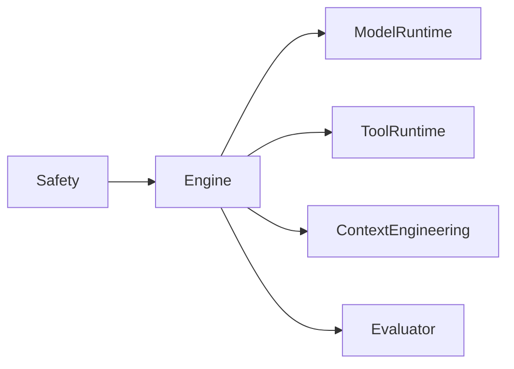
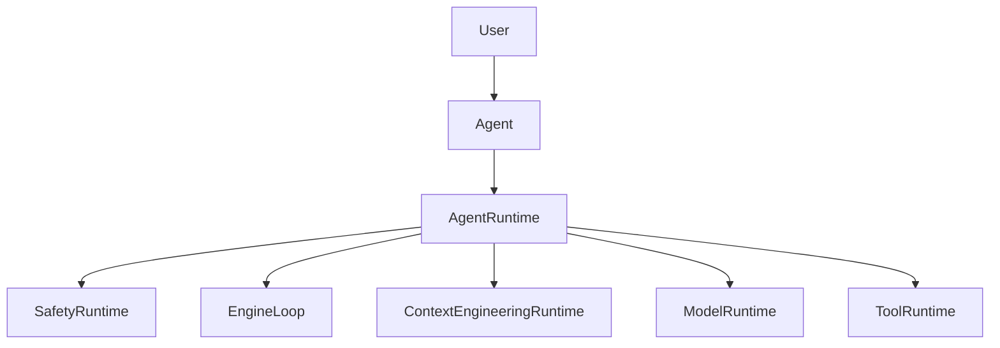
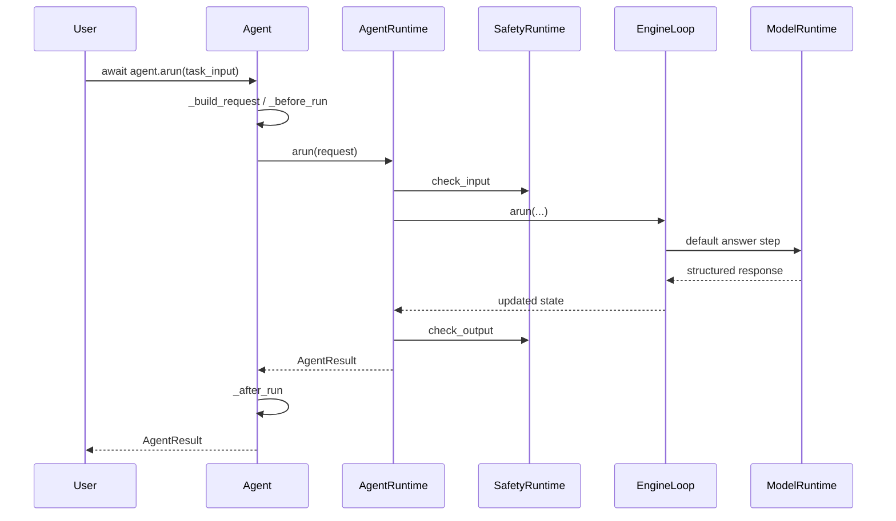

# 第十二章：Agent 开箱即用入口与可扩展编排层

## 目标

这一章解决的是一个非常实际的问题：前面 11 个组件都已经能工作，但用户还没有一个真正可用的总入口。

如果框架只能让用户手工拼 `SafetyRuntime`、`EngineLoop`、`ModelRuntime`、`ToolRuntime`，那它更像零件仓库，不像一个可交付的 Agent 框架。

这一章完成后，框架新增 4 个能力：

1. 用户可以直接 `app = AgentApp()`，再通过 `app.create_agent(...)` 拿到 `Agent` 实例并运行。
2. `Agent` 支持继承扩展，而不是只能黑盒使用。
3. `AgentRuntime` 作为正式编排层，把组件统一收口。
4. `EngineLoop` 仍可注入或继承，框架级用户还能继续下探。

## 架构位置说明（演进视角）

前面的组件层是这样：



这一章新增一层真正的用户入口：



这里的分工是：

1. `Agent` 负责用户体验和继承扩展点。
2. `AgentRuntime` 负责编排。
3. `EngineLoop` 继续负责核心执行循环。

## 前置条件

1. Python >= 3.11
2. 已安装 `uv`
3. 当前位于仓库根目录
4. 第 11 章 Safety 已经通过回归

先跑一遍 Safety 基线：

```bash
uv run --no-sync pytest tests/unit/test_safety.py tests/unit/test_safety_tool_hook.py tests/unit/test_safety_demo.py -q
```

```powershell
uv run --no-sync pytest tests/unit/test_safety.py tests/unit/test_safety_tool_hook.py tests/unit/test_safety_demo.py -q
```

## 本章主线改动范围（强制声明）

### 真实代码文件

- [src/agent_forge/runtime/__init__.py](D:/code/build_agent/src/agent_forge/runtime/__init__.py)
- [src/agent_forge/runtime/schemas.py](D:/code/build_agent/src/agent_forge/runtime/schemas.py)
- [src/agent_forge/runtime/defaults.py](D:/code/build_agent/src/agent_forge/runtime/defaults.py)
- [src/agent_forge/runtime/runtime.py](D:/code/build_agent/src/agent_forge/runtime/runtime.py)
- [src/agent_forge/runtime/agent.py](D:/code/build_agent/src/agent_forge/runtime/agent.py)
- [src/agent_forge/__init__.py](D:/code/build_agent/src/agent_forge/__init__.py)
- [examples/agent/agent_demo.py](D:/code/build_agent/examples/agent/agent_demo.py)

### 真实测试文件

- [tests/unit/test_agent.py](D:/code/build_agent/tests/unit/test_agent.py)
- [tests/unit/test_agent_runtime.py](D:/code/build_agent/tests/unit/test_agent_runtime.py)
- [tests/unit/test_agent_demo.py](D:/code/build_agent/tests/unit/test_agent_demo.py)

## 实施步骤

## 第 1 步：先看主流程，先讲“面”

默认执行链路如下：



这条链路的意义是：

1. 用户只面对 `Agent`。
2. 组件装配统一收口到 `AgentRuntime`。
3. Safety 继续作为框架级边界存在。
4. `EngineLoop` 仍然可替换。

## 第 2 步：先把顶层入口导出出来

对应主线文件：`src/agent_forge/runtime/__init__.py`

```bash
mkdir -p src/agent_forge/runtime
touch src/agent_forge/runtime/__init__.py
```

```powershell
New-Item -ItemType Directory -Force src/agent_forge/runtime | Out-Null
New-Item -ItemType File -Force src/agent_forge/runtime/__init__.py | Out-Null
```

文件：[src/agent_forge/runtime/__init__.py](D:/code/build_agent/src/agent_forge/runtime/__init__.py)

```python
"""Runtime exports for the user-facing Agent entrypoint."""

from agent_forge.runtime.agent import Agent
from agent_forge.runtime.runtime import AgentRuntime, build_default_agent_runtime
from agent_forge.runtime.schemas import AgentConfig, AgentResult, AgentRunRequest

__all__ = [
    "Agent",
    "AgentConfig",
    "AgentResult",
    "AgentRunRequest",
    "AgentRuntime",
    "build_default_agent_runtime",
]
```

对应主线文件：`src/agent_forge/__init__.py`

```bash
touch src/agent_forge/__init__.py
```

```powershell
New-Item -ItemType File -Force src/agent_forge/__init__.py | Out-Null
```

文件：[src/agent_forge/__init__.py](D:/code/build_agent/src/agent_forge/__init__.py)

```python
"""agent_forge framework package."""

from agent_forge.runtime import Agent, AgentConfig, AgentResult, AgentRunRequest, AgentRuntime, build_default_agent_runtime

__all__ = [
    "Agent",
    "AgentConfig",
    "AgentResult",
    "AgentRunRequest",
    "AgentRuntime",
    "build_default_agent_runtime",
]
```

### 代码讲解

这里做的是“公开正确入口”，不是“多导出几个名字”。

1. 用户以后直接 `from agent_forge import Agent`。
2. 高级用户还能拿到 `AgentRuntime`。
3. 但调用方不必再自己拼十个组件。

## 第 3 步：定义顶层请求和结果契约

对应主线文件：`src/agent_forge/runtime/schemas.py`

```bash
touch src/agent_forge/runtime/schemas.py
```

```powershell
New-Item -ItemType File -Force src/agent_forge/runtime/schemas.py | Out-Null
```

文件：[src/agent_forge/runtime/schemas.py](D:/code/build_agent/src/agent_forge/runtime/schemas.py)

```python
"""Schemas for the user-facing Agent facade and runtime layer."""

from __future__ import annotations

from typing import Any, Literal
from uuid import uuid4

from pydantic import BaseModel, Field

from agent_forge.components.protocol import ErrorInfo, FinalAnswer


class AgentConfig(BaseModel):
    config_version: str = Field(default="v1", min_length=1, description="编排层配置版本")
    default_principal: str = Field(default="agent", min_length=1, description="默认调用主体")
    session_id_prefix: str = Field(default="session", min_length=1, description="自动生成 session_id 的前缀")
    default_model: str = Field(default="agent-default-stub", min_length=1, description="默认模型版本标识")
    tool_version: str = Field(default="tool-runtime-v1", min_length=1, description="工具运行时版本标识")
    policy_version: str = Field(default="v1", min_length=1, description="默认安全策略版本")
    enable_evaluator_by_default: bool = Field(default=False, description="是否默认开启评测")


class AgentRunRequest(BaseModel):
    task_input: str = Field(..., min_length=1, description="用户任务输入")
    session_id: str | None = Field(default=None, description="会话 ID")
    trace_id: str | None = Field(default=None, description="链路 ID")
    principal: str | None = Field(default=None, description="调用主体")
    capabilities: set[str] | None = Field(default=None, description="调用主体能力集合")
    context: dict[str, Any] = Field(default_factory=dict, description="调用上下文")
    tenant_id: str | None = Field(default=None, description="租户隔离键")
    user_id: str | None = Field(default=None, description="用户隔离键")
    evaluate: bool | None = Field(default=None, description="是否开启评测")
    metadata: dict[str, Any] = Field(default_factory=dict, description="附加元数据")


class AgentResult(BaseModel):
    status: Literal["success", "partial", "failed", "blocked"] = Field(..., description="运行状态")
    summary: str = Field(..., min_length=1, description="结果摘要")
    output: dict[str, Any] = Field(default_factory=dict, description="结构化输出")
    session_id: str = Field(..., min_length=1, description="会话 ID")
    trace_id: str = Field(..., min_length=1, description="链路 ID")
    references: list[str] = Field(default_factory=list, description="可选参考信息")
    safety: dict[str, Any] = Field(default_factory=dict, description="安全审查摘要")
    error: ErrorInfo | None = Field(default=None, description="结构化错误")
    final_answer: FinalAnswer | None = Field(default=None, description="协议层最终答案")
    evaluation: dict[str, Any] | None = Field(default=None, description="可选评测结果")
    metadata: dict[str, Any] = Field(default_factory=dict, description="附加元数据")


def build_generated_session_id(prefix: str) -> str:
    return f"{prefix}_{uuid4().hex}"
```

### 代码讲解

这里的核心不是字段多，而是边界清晰：

1. `AgentRunRequest` 是编排层输入。
2. `AgentResult` 是用户稳定消费面。
3. `FinalAnswer` 仍然保留在结果里，避免和协议层割裂。

## 第 4 步：让 `Agent()` 默认离线可跑

对应主线文件：`src/agent_forge/runtime/defaults.py`

```bash
touch src/agent_forge/runtime/defaults.py
```

```powershell
New-Item -ItemType File -Force src/agent_forge/runtime/defaults.py | Out-Null
```

文件：[src/agent_forge/runtime/defaults.py](D:/code/build_agent/src/agent_forge/runtime/defaults.py)

```python
"""Default local runtime wiring for the user-facing Agent facade."""

from __future__ import annotations

import json
import time
from collections.abc import Iterator
from typing import Any

from agent_forge.components.model_runtime import (
    ModelRequest,
    ModelResponse,
    ModelRuntime,
    ModelStats,
    ModelStreamEvent,
    ProviderAdapter,
)
from agent_forge.components.observability import ObservabilityRuntime
from agent_forge.components.safety import SafetyRuntime, SafetyToolRuntimeHook
from agent_forge.components.tool_runtime import ToolRuntime
from agent_forge.runtime.schemas import AgentConfig


class DefaultAgentAdapter(ProviderAdapter):
    def generate(self, request: ModelRequest, **kwargs: Any) -> ModelResponse:
        _ = kwargs
        task_input = _extract_task_input(request)
        content = json.dumps(
            {
                "summary": f"已完成任务分析：{task_input[:32]}",
                "output": {
                    "answer": f"基于当前输入，建议先拆解任务目标，再补充事实与约束：{task_input}",
                    "task_input": task_input,
                },
                "references": ["runtime:default-local-adapter"],
            },
            ensure_ascii=False,
        )
        return ModelResponse(
            content=content,
            stats=ModelStats(
                prompt_tokens=max(1, len(task_input) // 4),
                completion_tokens=48,
                total_tokens=max(1, len(task_input) // 4) + 48,
                latency_ms=12,
                cost_usd=0.0,
            ),
        )

    def generate_stream(self, request: ModelRequest, **kwargs: Any) -> Iterator[ModelStreamEvent]:
        response = self.generate(request, **kwargs)
        request_id = request.request_id or f"req_default_{int(time.time() * 1000)}"
        now_ms = int(time.time() * 1000)
        yield ModelStreamEvent(event_type="start", request_id=request_id, sequence=0, timestamp_ms=now_ms)
        yield ModelStreamEvent(event_type="end", request_id=request_id, sequence=1, content=response.content, stats=response.stats, timestamp_ms=now_ms, metadata={"status": "ok"})


def build_default_model_runtime() -> ModelRuntime:
    return ModelRuntime(adapter=DefaultAgentAdapter())


def build_default_observability_runtime() -> ObservabilityRuntime:
    return ObservabilityRuntime()


def build_default_tool_runtime(
    *,
    safety_runtime: SafetyRuntime,
    observability_runtime: ObservabilityRuntime,
) -> ToolRuntime:
    tool_runtime = ToolRuntime(hooks=[observability_runtime.build_tool_hook()])
    tool_runtime.register_hook(
        SafetyToolRuntimeHook(
            safety_runtime,
            spec_resolver=tool_runtime.get_tool_spec,
            capability_resolver=lambda _principal: set(),
        )
    )
    return tool_runtime


def build_default_agent_config() -> AgentConfig:
    return AgentConfig()


def _extract_task_input(request: ModelRequest) -> str:
    for message in reversed(request.messages):
        if message.role == "user" and message.content.strip():
            return message.content.strip()
    return request.messages[-1].content.strip() if request.messages else ""
```

### 代码讲解

默认本地 adapter 不是为了偷懒，而是为了保证：

1. `Agent()` 零配置可跑。
2. 教程、demo、单测可复现。
3. 后续替换真实模型时不用改顶层 API。

## 第 5 步：实现 `AgentRuntime` 编排层

对应主线文件：`src/agent_forge/runtime/runtime.py`

```bash
touch src/agent_forge/runtime/runtime.py
```

```powershell
New-Item -ItemType File -Force src/agent_forge/runtime/runtime.py | Out-Null
```

文件：[src/agent_forge/runtime/runtime.py](D:/code/build_agent/src/agent_forge/runtime/runtime.py)

```python
"""Internal orchestration runtime behind the user-facing Agent facade."""

from __future__ import annotations

import asyncio
from typing import Any

from agent_forge.components.context_engineering import ContextEngineeringRuntime
from agent_forge.components.context_engineering.domain import CitationItem
from agent_forge.components.engine import EngineLimits, EngineLoop, ExecutionPlan, PlanStep, ReflectDecision, RunContext, StepOutcome
from agent_forge.components.evaluator import EvaluationRequest, EvaluatorRuntime
from agent_forge.components.model_runtime import ModelRequest, ModelRuntime
from agent_forge.components.observability import ObservabilityRuntime
from agent_forge.components.protocol import AgentMessage, AgentState, ErrorInfo, FinalAnswer, build_initial_state
from agent_forge.components.retrieval import RetrievalQuery, RetrievalRuntime
from agent_forge.components.safety import SafetyCheckRequest, SafetyRuntime, apply_output_safety
from agent_forge.components.tool_runtime import ToolRuntime
from agent_forge.runtime.defaults import build_default_agent_config, build_default_model_runtime, build_default_observability_runtime, build_default_tool_runtime
from agent_forge.runtime.schemas import AgentConfig, AgentResult, AgentRunRequest, build_generated_session_id


class AgentRuntime:
    def __init__(self, *, config: AgentConfig | None = None, engine_loop: EngineLoop | None = None, model_runtime: ModelRuntime | None = None, safety_runtime: SafetyRuntime | None = None, tool_runtime: ToolRuntime | None = None, context_runtime: ContextEngineeringRuntime | None = None, retrieval_runtime: RetrievalRuntime | None = None, memory_runtime: Any | None = None, evaluator_runtime: EvaluatorRuntime | None = None, observability_runtime: ObservabilityRuntime | None = None) -> None:
        self.config = config or build_default_agent_config()
        self.observability_runtime = observability_runtime or build_default_observability_runtime()
        self.safety_runtime = safety_runtime or SafetyRuntime()
        self.tool_runtime = tool_runtime or build_default_tool_runtime(safety_runtime=self.safety_runtime, observability_runtime=self.observability_runtime)
        self.context_runtime = context_runtime or ContextEngineeringRuntime()
        self.model_runtime = model_runtime or build_default_model_runtime()
        self.engine_loop = engine_loop or EngineLoop(limits=EngineLimits(), event_listener=self.observability_runtime.engine_event_listener)
        self.retrieval_runtime = retrieval_runtime
        self.memory_runtime = memory_runtime
        self.evaluator_runtime = evaluator_runtime

    async def arun(self, request: AgentRunRequest) -> AgentResult:
        normalized = self._normalize_request(request)
        state = self._build_initial_state(normalized)
        input_decision = self.safety_runtime.check_input(SafetyCheckRequest(stage="input", task_input=normalized.task_input, trace_id=state.trace_id, run_id=state.run_id, context=normalized.context))
        if not input_decision.allowed:
            return self._build_blocked_result(normalized=normalized, state=state, decision=input_decision)
        state.messages.append(AgentMessage(role="user", content=normalized.task_input, metadata={"source": "agent"}))

        async def _runtime_act_fn(current_state: AgentState, step: PlanStep, step_idx: int) -> StepOutcome:
            return await self._act_step(request=normalized, state=current_state, step=step, step_idx=step_idx)

        updated_state = await self.engine_loop.arun(
            state,
            plan_fn=lambda current_state: self._build_plan(request=normalized, state=current_state),
            act_fn=_runtime_act_fn,
            reflect_fn=self._reflect_step,
            context=self._build_run_context(normalized),
        )
        final_answer = self._build_final_answer(normalized=normalized, state=updated_state)
        output_decision = self.safety_runtime.check_output(SafetyCheckRequest(stage="output", final_answer=final_answer, trace_id=updated_state.trace_id, run_id=updated_state.run_id, context=normalized.context))
        safe_answer = apply_output_safety(final_answer, output_decision)
        updated_state.final_answer = safe_answer
        evaluation = self._evaluate_if_needed(normalized=normalized, state=updated_state)
        return self._build_success_result(normalized=normalized, state=updated_state, final_answer=safe_answer, input_decision=input_decision, output_decision=output_decision, evaluation=evaluation)

    def _normalize_request(self, request: AgentRunRequest) -> AgentRunRequest:
        session_id = request.session_id or build_generated_session_id(self.config.session_id_prefix)
        principal = request.principal or self.config.default_principal
        evaluate = self.config.enable_evaluator_by_default if request.evaluate is None else request.evaluate
        return request.model_copy(update={"session_id": session_id, "principal": principal, "evaluate": evaluate, "context": dict(request.context), "metadata": dict(request.metadata)})

    def _build_initial_state(self, request: AgentRunRequest) -> AgentState:
        state = build_initial_state(request.session_id or build_generated_session_id(self.config.session_id_prefix))
        if request.trace_id:
            state.trace_id = request.trace_id
        return state

    def _build_run_context(self, request: AgentRunRequest) -> RunContext:
        return RunContext(tenant_id=request.tenant_id, user_id=request.user_id, config_version=self.config.config_version, model_version=self.config.default_model, tool_version=self.config.tool_version, policy_version=self.config.policy_version)

    def _build_plan(self, request: AgentRunRequest, state: AgentState) -> ExecutionPlan:
        _ = state
        return ExecutionPlan(global_task=request.task_input, success_criteria=["返回结构化答案"], constraints=["默认离线可运行"], metadata={"runtime": "agent_runtime"}, steps=[PlanStep(key="answer_user_task", name="answer-user-task", kind="generate_answer", payload={"task_input": request.task_input})])

    async def _act_step(self, *, request: AgentRunRequest, state: AgentState, step: PlanStep, step_idx: int) -> StepOutcome:
        _ = step_idx
        retrieval_result = self._maybe_retrieve(request)
        bundle = self.context_runtime.build_bundle(system_prompt="你是一个工程化 Agent 框架的默认执行器，输出必须结构化、克制且可复用。", developer_prompt="请优先给出可执行结论、必要约束和下一步建议，避免空泛表述。", messages=state.messages, citations=retrieval_result["citations"])
        response = await asyncio.to_thread(self.model_runtime.generate, ModelRequest(messages=bundle.messages, system_prompt=bundle.system_prompt, model=self.config.default_model, response_schema={"type": "object", "properties": {"summary": {"type": "string"}, "output": {"type": "object"}, "references": {"type": "array", "items": {"type": "string"}}}, "required": ["summary", "output"]}, request_id=f"agent_run_{request.session_id}"))
        payload = response.parsed_output or {}
        references = list(payload.get("references") or [])
        references.extend(retrieval_result["references"])
        state.messages.append(AgentMessage(role="assistant", content=str(payload.get("summary") or "已生成结构化答案"), metadata={"agent_output": payload.get("output") or {}, "references": references}))
        return StepOutcome(status="ok", output={"summary": payload.get("summary") or "已生成结构化答案", "output": payload.get("output") or {}, "references": references})

    def _reflect_step(self, state: AgentState, step: PlanStep, step_idx: int, outcome: StepOutcome) -> ReflectDecision:
        _ = state
        _ = step
        _ = step_idx
        if outcome.status == "ok":
            return ReflectDecision(action="continue", reason="默认回答步骤已成功完成")
        if outcome.error and outcome.error.retryable:
            return ReflectDecision(action="retry", reason="步骤失败但允许重试")
        return ReflectDecision(action="abort", reason="步骤失败且不可重试")

    def _build_final_answer(self, *, normalized: AgentRunRequest, state: AgentState) -> FinalAnswer:
        assistant_messages = [message for message in state.messages if message.role == "assistant"]
        latest = assistant_messages[-1] if assistant_messages else None
        if latest is None:
            return FinalAnswer(status="failed", summary="运行结束，但没有生成可用答案", output={"task_input": normalized.task_input}, references=[])
        return FinalAnswer(status="success", summary=latest.content, output=latest.metadata.get("agent_output", {}), artifacts=[{"type": "agent_message", "name": "default_answer"}], references=[str(item) for item in latest.metadata.get("references", [])])

    def _evaluate_if_needed(self, *, normalized: AgentRunRequest, state: AgentState) -> dict[str, Any] | None:
        if not normalized.evaluate or self.evaluator_runtime is None or state.final_answer is None:
            return None
        return self.evaluator_runtime.evaluate(EvaluationRequest(final_answer=state.final_answer, events=state.events, trace_id=state.trace_id, run_id=state.run_id)).model_dump()

    def _maybe_retrieve(self, request: AgentRunRequest) -> dict[str, list[Any]]:
        if self.retrieval_runtime is None:
            return {"citations": [], "references": []}
        retrieval_query = request.context.get("retrieval_query")
        if not isinstance(retrieval_query, str) or not retrieval_query.strip():
            return {"citations": [], "references": []}
        result = self.retrieval_runtime.search(RetrievalQuery(query_text=retrieval_query.strip()))
        citations = [CitationItem(source_id=item.document_id, title=item.title or item.document_id, url=item.source_uri or f"retrieval://{item.document_id}", snippet=item.snippet, score=item.score) for item in result.citations]
        return {"citations": citations, "references": [f"retrieval:{item.document_id}" for item in result.citations]}

    def _build_blocked_result(self, *, normalized: AgentRunRequest, state: AgentState, decision: Any) -> AgentResult:
        error = ErrorInfo(error_code="AGENT_INPUT_BLOCKED", error_message=decision.reason or "输入被安全层拦截", retryable=False)
        return AgentResult(status="blocked", summary=decision.reason or "输入被安全层拦截", output={"message": decision.reason or "输入被安全层拦截", "safety_action": decision.action}, session_id=state.session_id, trace_id=state.trace_id, safety={"input": decision.model_dump()}, error=error, metadata={"principal": normalized.principal, "blocked_stage": "input"})

    def _build_success_result(self, *, normalized: AgentRunRequest, state: AgentState, final_answer: FinalAnswer, input_decision: Any, output_decision: Any, evaluation: dict[str, Any] | None) -> AgentResult:
        status = "success"
        if final_answer.status == "partial":
            status = "partial"
        elif final_answer.status == "failed":
            status = "failed"
        return AgentResult(status=status, summary=final_answer.summary, output=final_answer.output, session_id=state.session_id, trace_id=state.trace_id, references=final_answer.references, safety={"input": input_decision.model_dump(), "output": output_decision.model_dump()}, final_answer=final_answer, evaluation=evaluation, metadata={"principal": normalized.principal, "capabilities": sorted(normalized.capabilities or [])})


def build_default_agent_runtime(*, config: AgentConfig | None = None) -> AgentRuntime:
    return AgentRuntime(config=config)
```

### 代码讲解

这里把多个组件真正接平了：

1. 统一做 input safety。
2. 统一进 `EngineLoop`。
3. 统一做 output safety。
4. 统一生成 `AgentResult`。
5. retrieval 查询在这里被标准化，并转换成 `CitationItem` 再交给 Context Engineering。

## 第 6 步：实现用户门面 `Agent`

对应主线文件：`src/agent_forge/runtime/agent.py`

```bash
touch src/agent_forge/runtime/agent.py
```

```powershell
New-Item -ItemType File -Force src/agent_forge/runtime/agent.py | Out-Null
```

文件：[src/agent_forge/runtime/agent.py](D:/code/build_agent/src/agent_forge/runtime/agent.py)

```python
"""User-facing Agent facade with stable extension hooks."""

from __future__ import annotations

import asyncio
from typing import Any

from agent_forge.runtime.runtime import AgentRuntime, build_default_agent_runtime
from agent_forge.runtime.schemas import AgentConfig, AgentResult, AgentRunRequest


class Agent:
    def __init__(self, *, config: AgentConfig | None = None, runtime: AgentRuntime | None = None) -> None:
        self.config = config or AgentConfig()
        self._runtime_override = runtime
        self.runtime = self._build_runtime()

    async def arun(self, task_input: str, **options: Any) -> AgentResult:
        request = self._build_request(task_input, **options)
        try:
            request = self._before_run(request)
            result = await self.runtime.arun(request)
            return self._after_run(request, result)
        except Exception as exc:  # noqa: BLE001
            return self._on_error(request, exc)

    def run(self, task_input: str, **options: Any) -> AgentResult:
        try:
            asyncio.get_running_loop()
        except RuntimeError:
            return asyncio.run(self.arun(task_input, **options))
        raise RuntimeError("检测到正在运行的事件循环，请改用 await Agent.arun(...)")

    def _build_runtime(self) -> AgentRuntime:
        if self._runtime_override is not None:
            return self._runtime_override
        return build_default_agent_runtime(config=self.config)

    def _build_request(self, task_input: str, **options: Any) -> AgentRunRequest:
        return AgentRunRequest(
            task_input=task_input,
            session_id=options.get("session_id"),
            trace_id=options.get("trace_id"),
            principal=options.get("principal"),
            capabilities=self._get_capabilities(task_input, **options),
            context=self._get_context(task_input, **options),
            tenant_id=options.get("tenant_id"),
            user_id=options.get("user_id"),
            evaluate=options.get("evaluate"),
            metadata=dict(options.get("metadata") or {}),
        )

    def _before_run(self, request: AgentRunRequest) -> AgentRunRequest:
        return request

    def _after_run(self, request: AgentRunRequest, result: AgentResult) -> AgentResult:
        _ = request
        return result

    def _on_error(self, request: AgentRunRequest, error: Exception) -> AgentResult:
        from agent_forge.components.protocol import ErrorInfo

        return AgentResult(
            status="failed",
            summary=f"Agent 运行失败：{error}",
            output={"message": str(error)},
            session_id=request.session_id or "unknown_session",
            trace_id=request.trace_id or "unknown_trace",
            error=ErrorInfo(error_code="AGENT_RUNTIME_EXCEPTION", error_message=str(error), retryable=False),
            metadata={"principal": request.principal or self.config.default_principal},
        )

    def _get_capabilities(self, task_input: str, **options: Any) -> set[str] | None:
        _ = task_input
        capabilities = options.get("capabilities")
        if capabilities is None:
            return None
        return set(capabilities)

    def _get_context(self, task_input: str, **options: Any) -> dict[str, Any]:
        _ = task_input
        return dict(options.get("context") or {})
```

### 代码讲解

`Agent` 不是薄代理，而是模板方法门面。  
它把最常见的扩展点固定成受保护方法，让用户不用复制整条主链。

## 第 7 步：最小 demo

对应主线文件：`examples/agent/agent_demo.py`

```bash
mkdir -p examples/agent
touch examples/agent/agent_demo.py
```

```powershell
New-Item -ItemType Directory -Force examples/agent | Out-Null
New-Item -ItemType File -Force examples/agent/agent_demo.py | Out-Null
```

文件：[examples/agent/agent_demo.py](D:/code/build_agent/examples/agent/agent_demo.py)

```python
"""Minimal demo for the user-facing Agent facade."""

from __future__ import annotations

import asyncio

from agent_forge import Agent


async def run_demo() -> dict[str, object]:
    agent = Agent()
    result = await agent.arun("帮我总结这次仲裁材料还缺什么")
    return {
        "status": result.status,
        "summary": result.summary,
        "output": result.output,
        "trace_id": result.trace_id,
        "session_id": result.session_id,
    }


if __name__ == "__main__":
    print(asyncio.run(run_demo()))
```

## 第 8 步：测试锁边界

文件：[tests/unit/test_agent.py](D:/code/build_agent/tests/unit/test_agent.py)

```bash
touch tests/unit/test_agent.py
```

```powershell
New-Item -ItemType File -Force tests/unit/test_agent.py | Out-Null
```

```python
"""Tests for the user-facing Agent facade."""

from __future__ import annotations

import asyncio

from agent_forge import Agent, AgentResult, AgentRunRequest
from agent_forge.runtime.runtime import AgentRuntime


def test_agent_should_run_with_minimal_code() -> None:
    result = asyncio.run(Agent().arun("帮我梳理一下当前任务的下一步"))

    assert result.status == "success"
    assert result.summary
    assert "answer" in result.output
    assert result.trace_id.startswith("trace_")
    assert result.session_id.startswith("session_")


def test_agent_subclass_should_override_context_and_after_run() -> None:
    class DemoAgent(Agent):
        def _get_context(self, task_input: str, **options: object) -> dict[str, object]:
            return {"domain": "labor", "original": task_input, **dict(options.get("context") or {})}

        def _after_run(self, request: AgentRunRequest, result: AgentResult) -> AgentResult:
            result.metadata["domain"] = request.context["domain"]
            result.summary = f"[demo] {result.summary}"
            return result

    result = asyncio.run(DemoAgent().arun("帮我总结一下争议焦点"))

    assert result.summary.startswith("[demo] ")
    assert result.metadata["domain"] == "labor"


def test_agent_should_allow_runtime_injection() -> None:
    class FakeRuntime(AgentRuntime):
        async def arun(self, request: AgentRunRequest) -> AgentResult:  # type: ignore[override]
            return AgentResult(
                status="success",
                summary=f"fake:{request.task_input}",
                output={"message": "from-fake-runtime"},
                session_id=request.session_id or "session_fake",
                trace_id=request.trace_id or "trace_fake",
            )

    result = asyncio.run(Agent(runtime=FakeRuntime()).arun("test"))

    assert result.summary == "fake:test"
```

文件：[tests/unit/test_agent_runtime.py](D:/code/build_agent/tests/unit/test_agent_runtime.py)

```bash
touch tests/unit/test_agent_runtime.py
```

```powershell
New-Item -ItemType File -Force tests/unit/test_agent_runtime.py | Out-Null
```

```python
"""Tests for AgentRuntime orchestration and extension points."""

from __future__ import annotations

import asyncio

from agent_forge.components.engine import EngineLoop
from agent_forge.components.protocol import ErrorInfo
from agent_forge.components.retrieval import RetrievedCitation, RetrievalResult
from agent_forge.runtime.runtime import AgentRuntime
from agent_forge.runtime.schemas import AgentRunRequest


class RecordingEngineLoop(EngineLoop):
    def __init__(self) -> None:
        super().__init__()
        self.called = False

    async def arun(self, state, plan_fn, act_fn, reflect_fn=None, context=None):  # type: ignore[override]
        self.called = True
        return await super().arun(state, plan_fn, act_fn, reflect_fn, context)


class RecordingRetrievalRuntime:
    def __init__(self) -> None:
        self.last_query = None

    def search(self, query):  # type: ignore[override]
        self.last_query = query
        return RetrievalResult(
            hits=[],
            citations=[
                RetrievedCitation(
                    document_id="doc-1",
                    title="retrieved-doc",
                    source_uri="memory://doc-1",
                    snippet="retrieved snippet",
                )
            ],
            backend_name="test-backend",
            retriever_version="v1",
            reranker_version="v1",
            total_candidates=1,
        )


def test_agent_runtime_should_allow_custom_engine_loop_injection() -> None:
    engine_loop = RecordingEngineLoop()
    runtime = AgentRuntime(engine_loop=engine_loop)

    result = asyncio.run(runtime.arun(AgentRunRequest(task_input="custom engine loop")))

    assert engine_loop.called is True
    assert result.status == "success"


def test_agent_runtime_should_use_normalized_retrieval_query_and_merge_references() -> None:
    retrieval_runtime = RecordingRetrievalRuntime()
    runtime = AgentRuntime(retrieval_runtime=retrieval_runtime)

    result = asyncio.run(
        runtime.arun(
            AgentRunRequest(
                task_input="use retrieval",
                context={"retrieval_query": " retrieval context "},
            )
        )
    )

    assert retrieval_runtime.last_query is not None
    assert retrieval_runtime.last_query.query_text == "retrieval context"
    assert any(item.startswith("retrieval:") for item in result.references)


def test_agent_should_return_structured_error_from_on_error() -> None:
    class ErrorAgentRuntime(AgentRuntime):
        async def arun(self, request: AgentRunRequest):  # type: ignore[override]
            raise RuntimeError(f"boom:{request.task_input}")

    from agent_forge import Agent

    result = asyncio.run(Agent(runtime=ErrorAgentRuntime()).arun("explode"))

    assert result.status == "failed"
    assert result.error == ErrorInfo(
        error_code="AGENT_RUNTIME_EXCEPTION",
        error_message="boom:explode",
        retryable=False,
    )
```

文件：[tests/unit/test_agent_demo.py](D:/code/build_agent/tests/unit/test_agent_demo.py)

```bash
touch tests/unit/test_agent_demo.py
```

```powershell
New-Item -ItemType File -Force tests/unit/test_agent_demo.py | Out-Null
```

```python
"""Tests for the minimal Agent demo."""

from __future__ import annotations

import asyncio

from examples.agent.agent_demo import run_demo


def test_agent_demo_should_run_end_to_end() -> None:
    result = asyncio.run(run_demo())

    assert result["status"] == "success"
    assert result["summary"]
    assert isinstance(result["output"], dict)
    assert str(result["trace_id"]).startswith("trace_")
```

## 运行命令

```bash
uv run --no-sync python -m py_compile src/agent_forge/__init__.py src/agent_forge/runtime/__init__.py src/agent_forge/runtime/schemas.py src/agent_forge/runtime/defaults.py src/agent_forge/runtime/runtime.py src/agent_forge/runtime/agent.py examples/agent/agent_demo.py tests/unit/test_agent.py tests/unit/test_agent_runtime.py tests/unit/test_agent_demo.py
uv run --no-sync pytest tests/unit/test_agent.py tests/unit/test_agent_runtime.py tests/unit/test_agent_demo.py -q
uv run --no-sync python examples/agent/agent_demo.py
uv run --no-sync pytest -q
```

```powershell
uv run --no-sync python -m py_compile src/agent_forge/__init__.py src/agent_forge/runtime/__init__.py src/agent_forge/runtime/schemas.py src/agent_forge/runtime/defaults.py src/agent_forge/runtime/runtime.py src/agent_forge/runtime/agent.py examples/agent/agent_demo.py tests/unit/test_agent.py tests/unit/test_agent_runtime.py tests/unit/test_agent_demo.py
uv run --no-sync pytest tests/unit/test_agent.py tests/unit/test_agent_runtime.py tests/unit/test_agent_demo.py -q
uv run --no-sync python examples/agent/agent_demo.py
uv run --no-sync pytest -q
```

## 增量闭环验证

### 最小用法

```python
import asyncio

from agent_forge import Agent


async def main() -> None:
    agent = Agent()
    result = await agent.arun("帮我梳理这个需求的下一步")
    print(result.summary)
    print(result.output["answer"])


asyncio.run(main())
```

### 子类扩展

```python
import asyncio

from agent_forge import Agent


class LaborAgent(Agent):
    def _get_context(self, task_input: str, **options):
        return {"domain": "labor_dispute", **dict(options.get("context") or {})}


async def main() -> None:
    agent = LaborAgent()
    result = await agent.arun("帮我梳理争议焦点")
    print(result.summary)


asyncio.run(main())
```

## 验证清单

1. `Agent()` 可以直接构造并返回结构化结果。
2. `Agent` 支持继承扩展而不是要求用户复制主链。
3. `AgentRuntime` 统一收口 Safety、Engine、Context、Model。
4. `AgentRuntime` 支持自定义 `EngineLoop` 注入。
5. retrieval 查询会被标准化，并且引用会进入最终结果。
6. demo、单测、全量回归都能跑通。

## 常见问题

### 为什么 `Agent` 和 `AgentRuntime` 不合并

因为两层面对的用户不同：

1. `Agent` 面向最终使用者。
2. `AgentRuntime` 面向高级装配者。

### 能不能直接重写 `EngineLoop`

可以，而且这是框架应该支持的能力。  
但要守住协议边界：可以替换默认执行机制，不能破坏 `AgentState`、`ExecutionPlan`、`FinalAnswer` 这些稳定契约。

### 为什么默认不用真实 LLM

因为这一章的目标是“入口层收口”和“开箱即用”。  
如果默认依赖外部模型服务，教程、demo、测试都会失去可复现性。

## 本章 DoD

1. 用户可以直接 `Agent()` 开箱即用。
2. `Agent` 提供稳定扩展点，支持继承覆写。
3. `AgentRuntime` 成为统一编排层。
4. `EngineLoop` 可以被注入或替换。
5. 默认本地路径离线可跑。
6. demo、单测、全量回归全部通过。

## 下一章预告

到这里，框架已经有了稳定用户入口。  
下一章要解决的是：让 CLI 和 HTTP API 统一建立在 `AgentApp -> Agent -> AgentRuntime` 之上，而不是各自再手工拼装一套组件链路。
