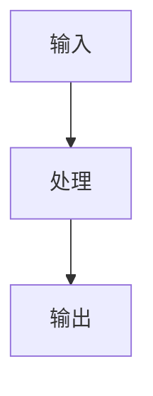

# 《从0到1工业级Agent框架打造》第X章：<标题>

## 开篇：这章解决什么问题

- 痛点 1：
- 痛点 2：
- 读者收益：

## 本章目标

1. 
2. 
3. 

## 先看全局图



## 环境准备（uv）

```bash
uv add --dev pytest
uv sync --dev
```

## 手把手步骤

### 第 1 步：创建目录/文件

```bash
# commands
```

### 第 2 步：写核心代码

文件：[<relative/path.py>](<relative/path.py>)

```python
# 完整可运行代码（不要省略关键逻辑）
```

为什么这样写：

1. 
2. 

### 第 3 步：写测试

文件：[tests/<test_file>.py](tests/<test_file>.py)

```python
# 完整可运行测试代码
```

## 关键设计解释

1. 字段/接口 A 为什么存在：
2. 字段/接口 B 为什么这样约束：
3. 失败模式如何处理：

## 运行与验证

```bash
uv run pytest tests/<test_file>.py
```

## 常见报错与修复

1. 报错：
   修复：
2. 报错：
   修复：

## 本章 DoD

1. 
2. 
3. 

## 下一章预告

- 下一章做什么：
- 与本章的承接关系：
