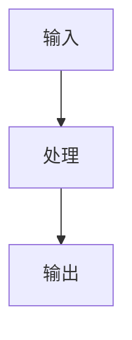

# 《从0到1工业级Agent框架打造》第X章：<标题>

## 目标

1.
2.
3.

## 前置条件

1. Python >= 3.11
2. 已安装 `uv`
3. 当前仓库根目录为执行目录（禁止写本机绝对路径，例如 `D:\...`）

## 环境准备与缺包兜底步骤（可直接复制）

```bash
uv add pydantic pydantic-settings typer fastapi openai python-dotenv
uv add --dev pytest
uv sync --dev
```

## 承接上章（复制快照）

> 本节仅用于第 02 章及以后章节；第 01 章可跳过。

```bash
cp -r examples/from_zero_to_one/chapter_XX examples/from_zero_to_one/chapter_YY
```

```powershell
Copy-Item -Recurse -Force "examples\from_zero_to_one\chapter_XX" "examples\from_zero_to_one\chapter_YY"
```
## 章节快照目录

1. 本章独立快照：`examples/from_zero_to_one/chapter_XX/`
2. 主线目标目录：`src/agent_forge/`

## 实施步骤

### 第 1 步：先讲面（主流程）



### 第 2 步：创建目录与文件

```bash
# 可直接复制执行
```

### 第 3 步：写核心代码（完整可运行）

文件：[src/agent_forge/<component>/<file>.py](../../src/agent_forge/<component>/<file>.py)

```python
# 完整代码，不允许省略关键逻辑
```

代码讲解：

1. 设计动机：
2. 工程取舍：
3. 边界条件：
4. 失败模式：

### 第 4 步：写测试（完整可运行）

文件：[tests/unit/<test_file>.py](../../tests/unit/<test_file>.py)

```python
# 完整测试代码
```

代码讲解：

1. 覆盖目标：
2. 断言设计：
3. 失败注入：

### 第 5 步：主线同步（chapter_XX -> src）

1. 本章快照中哪些文件要同步到 `src/agent_forge/`
2. 同步后执行哪些回归测试
3. 必须提供可直接复制的同步命令（至少包含 Bash 与 PowerShell 版本）

## 运行命令

```bash
uv sync --dev
uv run pytest tests/unit/<test_file>.py -q
```

## 验证清单

1. 命令可直接执行且通过
2. 路径可点击且文件真实存在
3. 代码块可独立复制运行
4. 教程内容与当前仓库代码一致

## 常见问题

1. 报错：
   修复：
2. 报错：
   修复：

## 本章 DoD

1.
2.
3.

## 下一章预告

1. 下一章做什么：
2. 与本章的承接关系：
