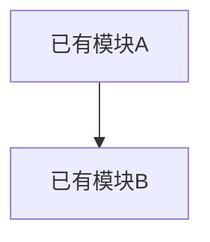
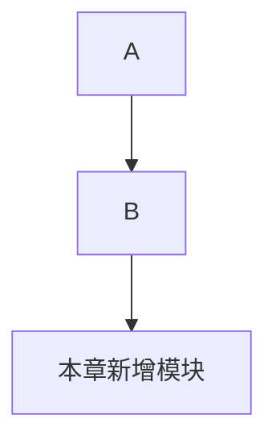
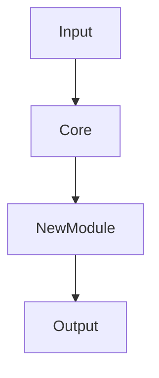

# 《从0到1工业级Agent框架打造》第 X 章：<标题>

---

## 1️⃣ 本章目标（新增系统能力）

本章完成后，系统将新增以下能力：

1.
2.
3.

**本章在整体架构中的定位：**

* 属于哪一层（如：基础设施层 / 核心执行层 / 协调层）
* 解决当前架构中的什么缺口
* 为什么必须在此阶段引入

> 禁止泛目标。必须明确“新增能力”，而不是“学习某概念”。

---

## 2️⃣ 架构位置说明（演进视角）

### 当前系统结构回顾



### 本章新增后的结构



必须说明：

* 新模块依赖谁？
* 谁依赖它？
* 是否改变依赖方向？
* 是否引入循环风险？

---

## 3️⃣ 前置条件

1. Python >= 3.11
2. 已安装 `uv`
3. 已完成上一章
4. 在仓库根目录执行命令

**环境复用验证命令：**

```bash
uv run pytest -q
```

若失败，必须先修复上一章。

---

## 4️⃣ 本章主线改动范围（强制声明）

### 代码目录

* `src/agent_forge/...`

### 测试目录

* `tests/...`

### 本章涉及的真实文件

* [src/agent_forge/<component>/<file>.py](../../src/agent_forge/<component>/<file>.py)
* [tests/unit/<test_file>.py](../../tests/unit/<test_file>.py)

禁止：

* 隐式新增文件
* 未声明文件却在后文使用

---

# 5️⃣ 实施步骤（架构驱动顺序）

---

## 第 1 步：主流程视角（先讲“面”）

说明：

* 主程序如何调用本章模块
* 数据如何流动
* 输出如何变化



必须解释：

* 为什么插在这个位置？
* 若放在别处会怎样？

---

## 第 2 步：创建文件（逐个创建，不批量）

文件：`src/agent_forge/<component>/<file>.py`

```bash
touch src/agent_forge/<component>/<file>.py
```

```powershell
New-Item -ItemType File src/agent_forge/<component>/<file>.py
```

禁止：

* 批量创建
* 目录脚本
* 伪路径
* 新增 Python 包目录却不创建 `__init__.py`

补充约束：

* 若该文件所在目录会被 Python import（包目录），必须在同一步补齐对应 `__init__.py` 的创建命令与完整代码。

---

## 第 3 步：实现核心代码（必须为最终架构一部分）

文件：[核心代码文件](../../src/agent_forge/<component>/<file>.py)

```python
# 完整可运行代码
```

若该文件过大无法在章节内完整展示，允许使用节选，但必须紧邻补充：

1. “本段为节选”提示
2. 对应源码文件可点击路径链接
3. “请进入该文件复制完整代码后再运行”提醒语

---

### 代码工程讲解（四维强制）

1. **设计动机**

   * 为什么必须抽象成这个结构？
   * 解决什么架构问题？

2. **架构位置**

   * 它在系统中属于哪一层？
   * 是否保持依赖方向稳定？

3. **工程取舍**

   * 为什么不用另一种设计？
   * 当前方案的代价是什么？

4. **边界条件与失败模式**

   * 输入异常如何处理？
   * 下游失败会怎样？
   * 是否有隐含风险？

补充约束（讲解表达）：

1. 除简单导出文件（如 `__init__.py`）外，必须使用通俗表达，不得只写抽象术语。
2. 每个关键实现段至少给一个成功例子和一个失败例子。
3. 涉及多步骤机制时，至少补一张流程图或时序图。
4. 每段“主要代码”（核心流程文件）必须达到 `chain_runner.py` 讲解深度：主流程拆解、成功/失败链路、图示化说明、工程取舍与边界四者缺一不可。
5. 历史章节升级时仅允许追加内容，不得删减原文与原代码。
6. 禁止“补丁式”写法（例如“本次补充/修复说明”独立段），新增内容必须自然融合进章节主线。

补充约束（Mermaid 11.12.0 兼容）：

1. Mermaid 仅使用 11.12.0 稳定子集（优先 `flowchart TD/LR`、`sequenceDiagram`）。
2. 节点文案使用纯文本，避免 `[/path]`、`[{k:v}]`、带括号 participant 别名等易歧义写法。
3. 表达接口路径或 JSON 时，改写为语义文本（如 `Health Endpoint`、`Status OK`）。
4. 交付前必须至少人工预览一次 Mermaid 渲染，确保无 `Syntax error in text`。

---

## 第 4 步：补齐测试（必须覆盖新增能力）

文件：[测试文件](../../tests/unit/<test_file>.py)

```python
# 完整测试
```

---

### 测试讲解

1. 覆盖目标：验证什么能力？
2. 断言设计：为何这样断言？
3. 失败注入：如何验证错误路径？
4. 是否防止未来重构破坏？

---

## 第 5 步：增量闭环验证（关键）

必须验证：

1. 主程序可运行
2. 本章模块真实参与流程
3. 新能力可见
4. 无孤立代码

---

# 6️⃣ 运行命令

```bash
uv sync --dev
uv run pytest tests/unit/<test_file>.py -q
uv run pytest -q
```

必须保证：

* Windows PowerShell 可执行
* 命令可复制运行

---

# 7️⃣ 验证清单

1. 主程序可运行
2. 本章新增功能可见
3. 测试通过
4. 路径可点击
5. 无未来删除代码
6. 未破坏上一章结构

---

# 8️⃣ 常见失败模式（必须真实）

1. 报错：
   原因：
   修复：

2. 报错：
   原因：
   修复：

必须包含：

* 至少一个真实工程错误
* 至少一个依赖方向错误示例

---

# 9️⃣ 本章 DoD（定义完成标准）

1. 新模块已接入主流程
2. 无占位代码
3. 所有测试通过
4. 架构依赖方向保持稳定
5. 本章形成真实能力增量

---

# 🔟 下一章预告（架构演进视角）

1. 当前系统已具备什么能力？
2. 当前最大结构缺口是什么？
3. 下一章为何必须解决这个缺口？
4. 若不解决会导致什么问题？

禁止写：

> 下一章我们将学习 XXX 概念

必须写：

> 若不引入 XXX，系统将无法支持 YYY 场景
