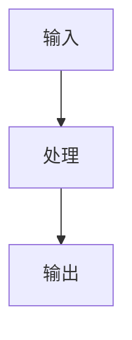

# 《从0到1工业级Agent框架打造》第X章：<标题>

## 目标

1. 
2. 
3. 

## 前置条件

1. Python >= 3.11
2. 已安装 `uv`
3. 在仓库根目录执行命令

## 本章主线改动范围

1. 代码目录：`src/agent_forge/...`
2. 测试目录：`tests/...`
3. 关键文件清单：

- [示例文件A](../../src/agent_forge/<component>/<file>.py)
- [示例文件B](../../tests/unit/<test_file>.py)

## 实施步骤

### 第 1 步：先讲面（主流程）



### 第 2 步：创建或更新文件

```bash
# 按主线路径创建文件
```

```powershell
# 按主线路径创建文件
```

### 第 3 步：实现核心代码（完整可运行）

文件：[核心代码文件](../../src/agent_forge/<component>/<file>.py)

```python
# 完整代码
```

代码讲解：

1. 设计动机：
2. 工程取舍：
3. 边界条件：
4. 失败模式：

### 第 4 步：补齐测试（完整可运行）

文件：[测试文件](../../tests/unit/<test_file>.py)

```python
# 完整测试
```

代码讲解：

1. 覆盖目标：
2. 断言设计：
3. 失败注入：

### 第 5 步：回归验证

1. 运行本章新增/修改测试。
2. 运行主线关键回归测试。
3. 核对教程路径与仓库文件一致。

## 运行命令

```bash
uv sync --dev
uv run pytest tests/unit/<test_file>.py -q
```

## 验证清单

1. 命令可执行并通过。
2. 路径可点击且文件存在。
3. 教程代码与仓库主线一致。
4. 不包含 `examples/from_zero_to_one/chapter_` 路径。

## 常见问题

1. 报错：
修复：
2. 报错：
修复：

## 本章 DoD

1. 
2. 
3. 

## 下一章预告

1. 下一章做什么：
2. 与本章的承接关系：
